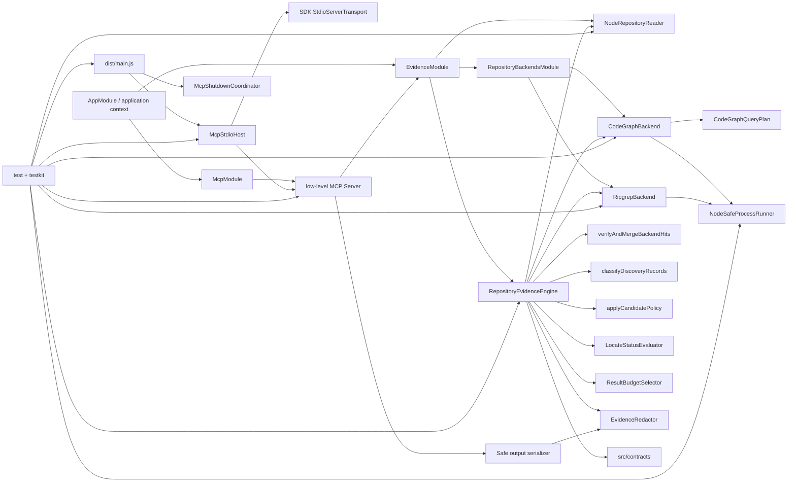

# RepoNav Foundation

## 0. 术语

- **EvidencePack**：`LocateResult.ok=true` 时返回的版本化 production 证据容器；当前由 `RepositoryEvidenceEngine` 编排 CodeGraph primary 与 ripgrep fallback 生成。
- **Discovery hit**：`CodeGraphBackend` 或 `RipgrepBackend` 产生的未核验 file/symbol/line/reason fact；它不能直接成为 public evidence。
- **CodeGraph probe**：只执行 `codegraph status --json` 的 capability/index 观察；不会初始化、更新或删除目标仓库 index。
- **CodeGraph query plan**：把 explicit symbol anchors 与 identifier-like terms 变成稳定的单 search invocations，声明 unsupported dimensions、共享 total `maxHits` 与保守 completeness。
- **Fallback**：CodeGraph primary 未保守完成本次请求时执行的 ripgrep second attempt；真实 attempt、health 与 `fallbackChecked` 都进入 coverage。
- **DiscoveryRecord**：命中经 `RepositoryReader` 对当前文件核验后，按 location/excerpt key 合并 provenance、reason、operation、terms 与全部 canonical symbols 的内部记录。
- **Direct mapping recognizer**：在 12 行、4 KiB logical window 内识别封闭 assignment/object/SQL alias/symbol definition 形式的保守 classifier；无法证明时只输出 candidate/excluded。
- **CandidatePolicy**：Evidence Engine 内部的候选分类与有界选择阶段；只消费已核验 DiscoveryRecord/context，按封闭 truth table 生成无 public ID 的 draft，再由 engine 统一物化。
- **Candidate window**：`RepositoryReader.readWindow` 围绕 seed focus 读取的同文件、最多 12 行/4 KiB verified context；它只用于局部 alias/entity/scope 召回，不替换 confirmed location、discovery key 或 ID。
- **Verification Kit**：`testkit/` 下的 manifests、fixtures 与 unit/Golden/MCP runners；它不是 production module。
- **RepositoryReader**：production filesystem seam；只接受 realpath 后的 repository root 与 normalized root-relative POSIX file path，返回 typed failures。
- **SafeProcessRunner**：production child-process seam；只接受 executable/argv/cwd/explicit env 与固定 budgets，强制 `shell:false`、stdio capture 和有界 tree cleanup。
- **MCP Surface**：`McpModule`、low-level MCP server handlers 与 `McpStdioHost` 组成的本地协议边界；只暴露 `repo_nav_locate`，不启动 HTTP listener。
- **Output parity**：每个 tool success/error 先通过 `LocateToolOutputSchema` 自校验，再由同一 serializer 同时生成 `structuredContent` 和 JSON text；解析后必须严格等值。
- **McpStdioHost**：stdio transport owner；只连接一次，跟踪 in-flight locate，合并 request/host caller signals，并提供幂等、best-effort close；request deadline 由 Evidence Engine 独占。
- **LocateAbortCoordinator**：Evidence Engine 内 first-writer-wins 的 composed abort owner；锁定 caller 或 internal deadline 的首次来源，后到事件不能改写 status/next-action。
- **Finalization policies**：`LocateStatusEvaluator`、`ResultBudgetSelector`、`NextActionPolicy` 与 `EvidenceRedactor` 组成的纯策略边界；只治理已核验结果，不改变 backend query 或 candidate recall。
- **Safe public error policy**：按四个 tool error code 固定 message/recoverable/action 白名单；application、MCP structured/text 与 `isError` 共用。

## 1. 定位与受众

这份地图描述 F7 后已可执行的 RepoNav foundation：结构化 locate request 优先经过 CodeGraph structured probe/query，并在 binary/index missing、no-result、failed、incomplete、unverified 或 unsupported intent 时显式执行 literal ripgrep fallback；所有命中经安全文件核验、discovery merge、保守 direct classification 与有界 candidate expansion，再由统一 finalization policies 裁决 status、budgets、coverage/nextActions、redaction 与 safe error，最后通过本地 stdio MCP 的 `repo_nav_locate` 输出。当前已有 production CodeGraph/ripgrep backend collection、可观察 fallback/index coverage、全状态 EvidencePack guardrails、MCP parity boundary 与受控 fixture 闭环；发布级完整回归/性能基线仍由后续 roadmap item 承担。

## 2. 结构与交互

- `src/contracts/` 持有 schema v1、normalization、Evidence ID/排序，以及 repository/process/backend/evidence service 契约；production modules 只依赖 contracts/runtime。
- `EvidenceModule` 以 `useExisting` 分别把 `NodeRepositoryReader` 和 `RepositoryEvidenceEngine` 暴露为 `REPOSITORY_READER`、`REPOSITORY_EVIDENCE_SERVICE`。
- `RepositoryBackendsModule` 提供 `NodeSafeProcessRunner`、`CodeGraphBackend` 与 `RipgrepBackend`，并通过 factory 输出有序、冻结的 `[codegraph, ripgrep]` backend collection；binary missing 不移除 provider。
- `CodeGraphBackend` 只解析 `status --json` 与 `query --json` stdout；probe 记录 binary/index/version/freshness capability，query planner 为 symbol/identifier entries 生成稳定单参数 invocation 并共享 total `maxHits`。required fields malformed 时 fail closed，additional fields forward-compatible。
- `RipgrepBackend` 按 term/anchor case metadata 组成 fixed-string search seeds，通过 `SafeProcessRunner` 执行 `rg --fixed-strings --json`；每个 actual submatch symbol 形成独立、稳定排序的 discovery fact。
- `verifyAndMergeBackendHits` 重新读取当前文件，构造不超过 12 行/4 KiB 的 logical window，核对当前命中后按 discovery key 合并全部 provenance/reasons/operations/terms/canonical symbols；fatal path error 继续上抛。
- `classifyDiscoveryRecords` 先处理 negative/layer exclusions，再以轻量 lexical masking 区分 code、comments、strings、regex 与 SQL quoted/comment regions；同一 merged record 只分类一次。
- `applyCandidatePolicy` 在 direct classification 后读取 engine 验证的 candidate windows，以同 statement/container 的 alias neighbor、同 entity sibling 与同 brace scope 的 segment similarity 发现局部线索；六类 reason/role/promotion 与 selection priority 由单一常量表定义。
- `RepositoryEvidenceEngine` 固定执行 normalize → CodeGraph primary search/pre-verification → conservative skip-or-ripgrep fallback → current-file verification/merge → classify once → candidate-window verification → bounded candidate policy → public ID/stable selection → final status/coverage/next actions → redaction；ID/order 永远早于 public text mutation。
- `NodeRepositoryReader` 与 `NodeSafeProcessRunner` 继续承担 canonical containment、bounded read、controlled env/stdout/stderr 和有界 child-tree cleanup。
- `McpModule` 注入 `REPOSITORY_EVIDENCE_SERVICE`，以 low-level SDK list/call handlers 暴露单一只读工具；unknown tool 和 protocol-invalid envelope 留在 SDK JSON-RPC error boundary。
- `LocateRequestSchema` 手工解析 envelope-valid arguments；serializer 对 service result 再应用 redaction/safe error policy，把 success、recoverable status 与四类 typed application error 映射为自校验、无 stack/path/raw stderr 的 parity output。
- `McpStdioHost` 只合并 SDK request 与 host shutdown 为 caller abort，整轮 request deadline 唯一由 Evidence Engine 的 `LocateAbortCoordinator` 持有；`McpShutdownCoordinator` 在 EOF、平台 signal、transport/parser failure 或 bootstrap failure时按 host → Nest context 的顺序 best-effort 清理。
- `DiagnosticScrubber` 只服务正式 stderr diagnostics；stdout 始终保留 MCP frames-only，public evidence redaction 与 diagnostic scrub 不共享模糊 replace 语义。
- `src/main.ts` 在首次异步启动前安装 lifecycle handlers，支持 startup shutdown intent 排队；正常 EOF/受支持 signal exit 0，fatal transport/bootstrap failure exit 1。

## 3. 数据与状态

- `LocateRequestSchema` 负责 strict input、NFKC/UTF-8 budgets、per-term case 与 file/symbol anchors；engine 解析默认 limits，并把 term 与 anchor metadata 传给 backend/verification/classifier。
- CodeGraph/ripgrep discovery facts 经当前文件核验后才成为 `DiscoveryRecord`；相同 key 的重复/permuted hits 先合并 provenance，classification、primary role、public ID 与排序均在 merge 后执行。
- Direct mapping confirmed 仅覆盖同一 executable statement 的 `target = source`、可执行 object literal 的 `target: source`、受支持 SQL query call/`.sql` alias，以及 exact anchored implementation/definition；其余 exact term/symbol reference降为 candidate。
- F3 existing candidates 与 F5 derived candidates 共用 schema v1 reason/promotion ordered sets；derived candidate 的 provenance 固定为 filesystem/find-matches，不复制 seed backend sources。
- candidate policy 只从已核验 seed/window 出发，要求同 file、focus slice 一致、delimiters balanced 与 innermost owner 相同；新 location 生成独立 discovery key，confirmed 与 candidate key 在 engine 挂载点互斥。
- candidate selection 使用 `maxCandidates` 容量的稳定优先队列；existing exact/symbol candidate 优先，随后是 alias/entity/scope/secondary，并在保留 key 上做受控 reason 合并。eligible item 被截断时记录 `MAX_CANDIDATES_REACHED`，不改变 confirmed。
- test/docs path 即使语法形似 mapping 也最多 candidate；caller layer 排除、negative term、duplicate、unverified content 进入 typed exclusion summary。
- locate status 仍为 `ok | no_result | backend_unavailable | partial | timeout`；唯一 evaluator 依次处理首次 abort source、backend-unavailable special case、coverage gap 与 ok/no-result。coverage 按真实执行顺序记录 attempts；backend 自身固定 process timeout 不冒充 caller-adjustable request deadline。
- CodeGraph 1.1.6 的 pending changes、worktree mismatch 或 reindex recommendation 映射为 `possibly-stale`；即使 clean 也保持 freshness unknown，因为 status 与文件核验之间存在竞态。
- next actions 区分 fixed safety caps 与 caller-adjustable budgets：只有 maxFiles/maxConfirmed/maxCandidates 真实截断且未达 schema max，或 engine internal deadline 且 timeoutMs<30000，才建议 `RETRY_WITH_HIGHER_LIMIT`；caller abort、backend 固定 timeout 与 12 行/4 KiB reader caps不建议提高 request limit。
- confirmed/candidate 先按 canonical stable key 有界选择，再进行 excerpt redaction；secret assignment、credential/connection、email/phone 与 oversized token 产生封闭 redaction reason，无法安全切片的 template/malformed assignment整段 fail-closed。
- 运行状态只存在于 Nest context、打开的 file handle、owned child tree、timers/listeners与内存对象；没有数据库、Redis、文件持久化或长期 session。
- MCP public input/output schema 发布为 JSON Schema 2020-12 exact object surface；标准 schema 可表达的 tuple arity、closed items 与 unique arrays 均锁定，NFKC/UTF-8 byte budget/cross-field refine 由 `$comment`/description 声明并继续由 runtime Zod 执行。
- `LocateToolOutput` 是 tool boundary 的唯一结构化状态；`isError=false` 对应成功及 recoverable engine status，`isError=true` 只对应 `INVALID_INPUT`、`INVALID_REPOSITORY`、`PATH_OUTSIDE_ROOT`、`INTERNAL_ERROR`。
- 进程生命周期状态只存在于 host/coordinator 内存：connect promise、tracked calls、abort controller、shutdown promise和startup intent；close 幂等且同一 shutdown 返回同一 promise。

## 4. 关键决策

- Backend 只产 discovery facts；public evidence 必须由当前文件核验和统一 classifier 产生。
- 顺序固定为 verify → discovery merge → classify once → primary role → ID → sort，禁止先分类再合并或以 ranking 推断 confirmed。
- Ripgrep 使用 literal fixed-string argv 与 per-seed case mode，不经 shell；JSON parser只读取结构化 match/submatch字段。
- Direct mapping truth table是封闭支持集，轻量 recognizer不宣称 AST/framework 等价；未知语法保持 candidate/excluded。
- 同一 location 的多个 canonical symbols 是独立发现事实，merge 后全部保留；classifier按可证明 role priority选择 primary，而不是在 backend 或预算阶段丢失事实。
- Candidate public ID 只在 derived location/discovery key 确定后由 engine 生成；policy draft 不持有 public ID，也不能复用或改变 seed ID。
- 文本 scope/entity/type 识别采取 fail-closed：unbalanced/nested owner 不一致、type position、SQL string/comment 或窗口外结构只会少召回，不允许扩大为模糊 candidate。
- `SECONDARY_BACKEND_HIT` 只允许 CodeGraph primary 已尝试且 record 为 ripgrep-only、无更高 candidate/confirmed reason 时生成；primary-only 不生成，merged 只合并 provenance。
- CodeGraph completeness 采取 fail-closed：多 symbol、unsupported dimensions、case-insensitive intent、budget truncation、process/parser failure 或 current-file verification failure都执行 ripgrep；CodeGraph hit 本身不代表 source completeness。
- Production 不拥有 CodeGraph index lifecycle；init 只存在于真实 smoke 的系统 temp synthetic repository，adapter 不调用 init/update/delete，也不解析 explore/node/stderr 人类文本。
- Repository file访问必须经过 canonical containment + post-open regular-file核验；local stable filesystem 是当前支持模型，Node/Windows reparse TOCTOU 是已知边界。
- Merge/classify/ID顺序、封闭 recognizer边界与 CLI统一 SafeProcessRunner具备 ADR/constraint候选价值；本文件只记录已落地现状，不代写 ADR。
- MCP 采用 low-level list/call handlers，而不是会抢先做输入校验的高层 helper；因此 envelope-valid arguments 始终由共享 Zod schema parse，typed application error 与 SDK protocol error 不串线。
- Public JSON Schema 与 runtime Zod 是两个诚实边界：前者精确表达标准可表示约束，后者继续执行 normalization、byte budget、line order 和跨集合约束；schema 测试使用独立 Ajv2020 与 Zod 反例交叉证明。
- Transport/parser error 采取 fail-closed；shutdown ownership 集中在 `McpShutdownCoordinator`，即使 server/host/app 某一步 close reject 也继续执行其余 cleanup，不向 stdio 泄露 raw error detail。
- request abort 来源采取 first-writer-wins；caller 与 deadline 后到事件不能覆盖首次来源，CodeGraph 多 hit 核验只输出 abort 前已完成的 verified evidence。
- public error action 是 code 白名单：只有 missing/empty terms 的 `INVALID_INPUT` 可携带 `ADD_TERM`，其余 error/action 组合在 application/MCP boundary 被归一化删除。
- sensitive output 是双层防线：Evidence Engine 在 service result 上 redaction，MCP serializer 对任意 service success 再防御性 redaction；任何新增 matcher 语法必须同步 forbidden corpus。

## 5. 代码锚点

- `src/evidence/repository-evidence-engine.ts:RepositoryEvidenceEngine` — CodeGraph-primary/ripgrep-fallback locate orchestration、状态与 next actions。
- `src/evidence/abort-source.ts:LocateAbortCoordinator` — first-writer-wins caller/deadline ownership。
- `src/evidence/locate-status-evaluator.ts:evaluateLocateStatus` / `next-action-policy.ts:createNextActions` — final status priority 与 caller-adjustable action policy。
- `src/evidence/result-budget-selector.ts` / `evidence-redactor.ts:redactLocateResult` — stable bounded selection、ID-after public redaction 与 cross-evidence sensitive-token propagation。
- `src/contracts/public-errors.ts` / `src/mcp/locate-tool-output.ts` — safe error code/action policy 与 structured/text/isError parity serializer。
- `src/mcp/diagnostic-scrubber.ts` — stderr-only diagnostic scrub boundary。
- `src/repository/codegraph-backend.ts:CodeGraphBackend` — structured probe/query、health mapping、shared budget 与 fail-closed result。
- `src/repository/codegraph-query-planner.ts:createCodeGraphQueryPlan` — stable entries、unsupported dimensions 与 conservative skip contract。
- `src/repository/codegraph-json.ts` / `codegraph-command.ts` — version-compatible JSON parser 与 shell-free Windows/POSIX invocation resolver。
- `src/repository/ripgrep-backend.ts:RipgrepBackend` — literal JSON ripgrep adapter 与 actual submatch facts。
- `src/evidence/discovery-record.ts:verifyAndMergeBackendHits` — current-file verification、bounded logical window 与 deterministic merge。
- `src/evidence/direct-mapping-classifier.ts:classifyDiscoveryRecords` — layer/exclusion resolver 与 direct-mapping truth table。
- `src/evidence/candidate-policy.ts:CANDIDATE_REASON_POLICY/applyCandidatePolicy` — candidate truth table、verified-context lexical predicates、promotion merge 与有界稳定选择。
- `src/evidence/repository-evidence-engine.ts:RepositoryEvidenceEngine` — candidate-window verification、confirmed/candidate 互斥、draft 物化与 candidate limit 编排。
- `src/evidence/evidence.module.ts:EvidenceModule` — reader/engine token assembly。
- `src/repository/repository-backends.module.ts:RepositoryBackendsModule` — runner/CodeGraph/ripgrep/frozen backend collection assembly。
- `src/repository/node-repository-reader.ts:NodeRepositoryReader` — canonical/bounded filesystem adapter，以及居中/clamp、12 行/4 KiB 的 `readWindow`。
- `src/repository/node-safe-process-runner.ts:NodeSafeProcessRunner` — controlled child-process/tree cleanup adapter。
- `src/mcp/repo-nav-mcp-server.ts:createRepoNavMcpServer` — tools capability、单工具 registry、unknown guard 与 low-level call handler。
- `src/mcp/locate-tool-schema.ts` / `locate-tool-output.ts` — JSON Schema 2020-12 public surface 与共享 parity serializer。
- `src/mcp/mcp-stdio-host.ts:McpStdioHost` — connect-once、tracked calls、merged cancellation 与幂等 close。
- `src/mcp/mcp-shutdown-coordinator.ts:McpShutdownCoordinator` — host/application best-effort shutdown owner。
- `src/main.ts` — compiled stdio process entry 与 early lifecycle handler installation。
- `test/unit/ripgrep-backend.spec.ts` / `evidence-merge.spec.ts` / `direct-mapping-classifier.spec.ts` — adapter、merge、truth-table证据。
- `test/unit/candidate-policy.spec.ts` / `repository-reader.spec.ts` — candidate predicates/budget/permutation、真实 rg 扩窗、confirmed identity 与 reader bounds/error semantics。
- `test/golden/candidate-policy.spec.ts` / `test/mcp/candidate-minimal-loop.spec.ts` — confirmed + alias/sibling candidate + decoy exclusion 的 Golden/stdio MCP 最小闭环。
- `test/unit/codegraph-backend.spec.ts` / `codegraph-query-planner.spec.ts` / `codegraph-live-smoke.spec.ts` — versioned parser、query argv/completeness、真实 temp index/query/cleanup 证据。
- `test/golden/codegraph-fallback.spec.ts` — missing/no-result/failed/incomplete/abort/skip/unverified/provenance/backend-unavailable 状态机证据。
- `test/golden/text-evidence-engine.spec.ts` / `text-engine-classifier.spec.ts` — 真实 rg chain、status、边界、多 symbol与 false-confirmation证据。
- `test/mcp/tool-surface.spec.ts` / `tool-output-parity.spec.ts` / `tool-error-parity.spec.ts` — 真实 SDK surface、strict schema 与 success/error parity。
- `test/mcp/request-cancellation.spec.ts` / `lifecycle-contract.spec.ts` — pre/late cancellation、compiled bin、EOF/signal、transport failure 与 cleanup fault matrix。
- `test/unit/locate-status-evaluator.spec.ts` / `output-guardrails.spec.ts` — abort source race、CodeGraph evidence preservation、fixed backend timeout、redaction/error policy 边界。
- `test/golden/output-guardrails.spec.ts` / `test/mcp/redaction-output-parity.spec.ts` — limits、service/MCP forbidden values、template/malformed/cross-evidence 与 public metadata 证据。

## 6. 已知约束 / 边界情况

- 当前没有数字 confidence；CodeGraph 只覆盖 status/query structured capability，不实现 callers/impact。
- Redaction 是封闭确定性 matcher，不宣称识别任意自然语言 secret/PII；新增表达形式必须同步 matcher 与真实 service/MCP forbidden corpus。
- `DiagnosticScrubber` 当前未完整覆盖 UNC 与单段 POSIX absolute path；正式调用只写固定安全 diagnostic，未来放开 raw adapter detail 前必须扩充 matcher。
- Windows npm shim 与 CodeGraph 1.1.6 已实测；其他 portable/native 安装布局与未来 JSON version 需通过环境矩阵、versioned fixtures 和 live smoke 扩展。
- CodeGraph clean status 不等于 freshness proven；当前保守报告 unknown，状态/文件读取竞态可能导致额外 fallback，但不会制造 false confirmation。
- Direct mapping recognizer不是通用 parser；dynamic/computed/cross-window/生成式语法保持 candidate，不扩大 confirmed。
- Candidate recognizer同样不是 AST：angle/type、SQL quoted region 与 12 行/4 KiB 边界采用保守 lexical fail-closed，复杂表达式或窗口外容器可能少召回。
- focus 与 candidate window 是两次本地读取；focus slice 改变会阻断，但仅周边内容并发变化仍可能来自第二次快照。
- `RipgrepBackend` 进程预算固定 10 秒，而 request timeout 上限为 30 秒；状态/abort已有自动化证据，超过 10 秒的真实慢仓库墙钟路径尚未实测。
- Reparse swap TOCTOU无法由当前 Node API完全消除；只支持本机稳定 filesystem，不声称对抗恶意并发 mutation。
- Windows `rg 15.1.0`、路径与 process-tree已有真实 QA；POSIX detached group/negative PID、其他 rg minor version尚未在本轮实机执行。
- Windows ADS、真实 unreadable/special device缺少稳定跨权限 fixture。
- SDK `server.onerror` 当前统一 fail-closed exit 1；若未来需要容忍 peer protocol anomaly，必须重新区分 fatal transport failure 与可恢复 diagnostic。
- Shutdown 当前依赖 evidence service/child 协作响应 AbortSignal；非协作实现可能使 tracked settle 无期限等待，当前没有进程内 hard deadline。
- Windows 按 design 通过 stdin EOF 验证 graceful shutdown；真实 SIGINT/SIGTERM exit 0 由非 Windows CI 覆盖。

## 7. 相关文档

- Requirement: `../requirements/source-of-truth-evidence.md`（仍为 draft；F7 已形成全状态/output guardrails，但发布级完整回归、性能基线与 debug/operator guide 尚未形成完整 MVP capability）。
- Roadmap: `../roadmap/repo-nav-mvp/repo-nav-mvp-roadmap.md`。
- F1/F2: `../features/2026-07-10-repository-evidence-foundation/` / `../features/2026-07-10-repository-access-process-safety/`。
- F3 design/acceptance: `../features/2026-07-10-text-source-evidence-engine/text-source-evidence-engine-design.md` / `text-source-evidence-engine-acceptance.md`。
- F4 design/acceptance: `../features/2026-07-10-mcp-locate-surface/mcp-locate-surface-design.md` / `mcp-locate-surface-acceptance.md`。
- F5 design/acceptance: `../features/2026-07-10-candidate-evidence-policy/candidate-evidence-policy-design.md` / `candidate-evidence-policy-acceptance.md`。
- F6 design/acceptance: `../features/2026-07-10-codegraph-fallback-orchestration/codegraph-fallback-orchestration-design.md` / `codegraph-fallback-orchestration-acceptance.md`。
- F7 design/acceptance: `../features/2026-07-10-evidence-output-guardrails/evidence-output-guardrails-design.md` / `evidence-output-guardrails-acceptance.md`。
