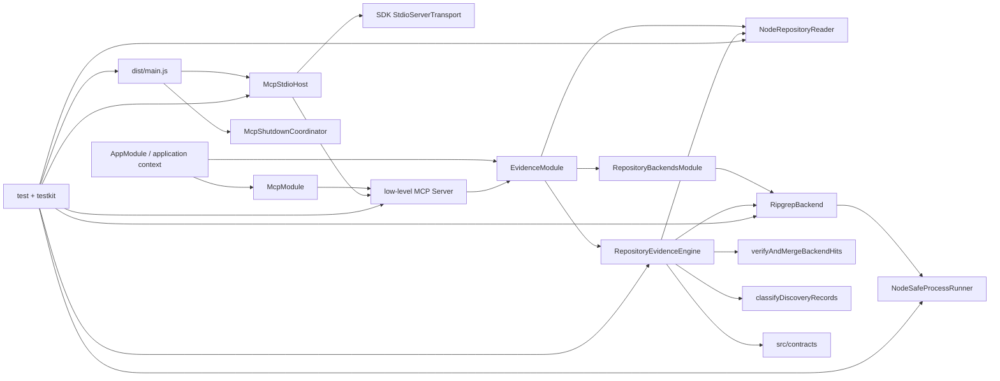

# RepoNav Foundation

## 0. 术语

- **EvidencePack**：`LocateResult.ok=true` 时返回的版本化 production 证据容器；当前由 ripgrep-only `RepositoryEvidenceEngine` 生成。
- **Discovery hit**：`RipgrepBackend` 产生的未核验 file/symbol/line/reason fact；它不能直接成为 public evidence。
- **DiscoveryRecord**：命中经 `RepositoryReader` 对当前文件核验后，按 location/excerpt key 合并 provenance、reason、operation、terms 与全部 canonical symbols 的内部记录。
- **Direct mapping recognizer**：在 12 行、4 KiB logical window 内识别封闭 assignment/object/SQL alias/symbol definition 形式的保守 classifier；无法证明时只输出 candidate/excluded。
- **Verification Kit**：`testkit/` 下的 manifests、fixtures 与 unit/Golden/MCP runners；它不是 production module。
- **RepositoryReader**：production filesystem seam；只接受 realpath 后的 repository root 与 normalized root-relative POSIX file path，返回 typed failures。
- **SafeProcessRunner**：production child-process seam；只接受 executable/argv/cwd/explicit env 与固定 budgets，强制 `shell:false`、stdio capture 和有界 tree cleanup。
- **MCP Surface**：`McpModule`、low-level MCP server handlers 与 `McpStdioHost` 组成的本地协议边界；只暴露 `repo_nav_locate`，不启动 HTTP listener。
- **Output parity**：每个 tool success/error 先通过 `LocateToolOutputSchema` 自校验，再由同一 serializer 同时生成 `structuredContent` 和 JSON text；解析后必须严格等值。
- **McpStdioHost**：stdio transport owner；只连接一次，跟踪 in-flight locate，合并 request/host/deadline signals，并提供幂等、best-effort close。

## 1. 定位与受众

这份地图描述 F4 后已可执行的 RepoNav foundation：结构化 locate request 可以通过 literal ripgrep、安全文件核验、discovery merge 和保守 classification 形成 ripgrep-only `LocateResult`，并由本地 stdio MCP 的 `repo_nav_locate` 工具调用。当前已有 production MCP host、typed tool errors、output parity、request cancellation 与进程级 shutdown；仍没有 CodeGraph backend、sibling expansion 或完整输出 redaction。

## 2. 结构与交互

- `src/contracts/` 持有 schema v1、normalization、Evidence ID/排序，以及 repository/process/backend/evidence service 契约；production modules 只依赖 contracts/runtime。
- `EvidenceModule` 以 `useExisting` 分别把 `NodeRepositoryReader` 和 `RepositoryEvidenceEngine` 暴露为 `REPOSITORY_READER`、`REPOSITORY_EVIDENCE_SERVICE`。
- `RepositoryBackendsModule` 提供 `NodeSafeProcessRunner` 与 `RipgrepBackend`，并通过 factory 输出有序、冻结的 `[ripgrep]` backend collection。
- `RipgrepBackend` 按 term/anchor case metadata 组成 fixed-string search seeds，通过 `SafeProcessRunner` 执行 `rg --fixed-strings --json`；每个 actual submatch symbol 形成独立、稳定排序的 discovery fact。
- `verifyAndMergeBackendHits` 重新读取当前文件，构造不超过 12 行/4 KiB 的 logical window，核对当前命中后按 discovery key 合并全部 provenance/reasons/operations/terms/canonical symbols；fatal path error 继续上抛。
- `classifyDiscoveryRecords` 先处理 negative/layer exclusions，再以轻量 lexical masking 区分 code、comments、strings、regex 与 SQL quoted/comment regions；同一 merged record 只分类一次。
- `RepositoryEvidenceEngine` 固定执行 normalize → backend search → current-file verification → merge → classify → primary role → full SHA-256 ID → stable sort，并组装 status、coverage、limits、exclusion summary 与 next actions。
- `NodeRepositoryReader` 与 `NodeSafeProcessRunner` 继续承担 canonical containment、bounded read、controlled env/stdout/stderr 和有界 child-tree cleanup。
- `McpModule` 注入 `REPOSITORY_EVIDENCE_SERVICE`，以 low-level SDK list/call handlers 暴露单一只读工具；unknown tool 和 protocol-invalid envelope 留在 SDK JSON-RPC error boundary。
- `LocateRequestSchema` 手工解析 envelope-valid arguments；serializer 把 success、recoverable status 与四类 typed application error 映射为自校验、无 stack/path/raw stderr 的 parity output。
- `McpStdioHost` 合并 SDK request、host shutdown 与 deadline signals，跟踪 locate promise；`McpShutdownCoordinator` 在 EOF、平台 signal、transport/parser failure 或 bootstrap failure 时按 host → Nest context 的顺序 best-effort 清理。
- `src/main.ts` 在首次异步启动前安装 lifecycle handlers，支持 startup shutdown intent 排队；正常 EOF/受支持 signal exit 0，fatal transport/bootstrap failure exit 1。

## 3. 数据与状态

- `LocateRequestSchema` 负责 strict input、NFKC/UTF-8 budgets、per-term case 与 file/symbol anchors；engine 解析默认 limits，并把 term 与 anchor metadata 传给 backend/verification/classifier。
- Ripgrep discovery facts 经当前文件核验后才成为 `DiscoveryRecord`；相同 key 的重复/permuted hits 先合并，classification、primary role、public ID 与排序均在 merge 后执行。
- Direct mapping confirmed 仅覆盖同一 executable statement 的 `target = source`、可执行 object literal 的 `target: source`、受支持 SQL query call/`.sql` alias，以及 exact anchored implementation/definition；其余 exact term/symbol reference降为 candidate。
- test/docs path 即使语法形似 mapping 也最多 candidate；caller layer 排除、negative term、duplicate、unverified content 进入 typed exclusion summary。
- ripgrep-only status 为 `ok | no_result | backend_unavailable | partial | timeout`；coverage 只记录真实 ripgrep attempt，`fallbackChecked=false`、`indexState=unknown`、`indexFreshness=not-applicable`。
- next actions 区分固定 recognizer window 与 caller 可调 budgets：固定 12 行/4 KiB 不建议加大 request limit；文件数、单文件 excerpt、backend incomplete 或内部 deadline 才按契约给 retry/action。
- 运行状态只存在于 Nest context、打开的 file handle、owned child tree、timers/listeners与内存对象；没有数据库、Redis、文件持久化或长期 session。
- MCP public input/output schema 发布为 JSON Schema 2020-12 exact object surface；标准 schema 可表达的 tuple arity、closed items 与 unique arrays 均锁定，NFKC/UTF-8 byte budget/cross-field refine 由 `$comment`/description 声明并继续由 runtime Zod 执行。
- `LocateToolOutput` 是 tool boundary 的唯一结构化状态；`isError=false` 对应成功及 recoverable engine status，`isError=true` 只对应 `INVALID_INPUT`、`INVALID_REPOSITORY`、`PATH_OUTSIDE_ROOT`、`INTERNAL_ERROR`。
- 进程生命周期状态只存在于 host/coordinator 内存：connect promise、tracked calls、abort controller、shutdown promise和startup intent；close 幂等且同一 shutdown 返回同一 promise。

## 4. 关键决策

- Backend 只产 discovery facts；public evidence 必须由当前文件核验和统一 classifier 产生。
- 顺序固定为 verify → discovery merge → classify once → primary role → ID → sort，禁止先分类再合并或以 ranking 推断 confirmed。
- Ripgrep 使用 literal fixed-string argv 与 per-seed case mode，不经 shell；JSON parser只读取结构化 match/submatch字段。
- Direct mapping truth table是封闭支持集，轻量 recognizer不宣称 AST/framework 等价；未知语法保持 candidate/excluded。
- 同一 location 的多个 canonical symbols 是独立发现事实，merge 后全部保留；classifier按可证明 role priority选择 primary，而不是在 backend 或预算阶段丢失事实。
- Repository file访问必须经过 canonical containment + post-open regular-file核验；local stable filesystem 是当前支持模型，Node/Windows reparse TOCTOU 是已知边界。
- Merge/classify/ID顺序、封闭 recognizer边界与 CLI统一 SafeProcessRunner具备 ADR/constraint候选价值；本文件只记录已落地现状，不代写 ADR。
- MCP 采用 low-level list/call handlers，而不是会抢先做输入校验的高层 helper；因此 envelope-valid arguments 始终由共享 Zod schema parse，typed application error 与 SDK protocol error 不串线。
- Public JSON Schema 与 runtime Zod 是两个诚实边界：前者精确表达标准可表示约束，后者继续执行 normalization、byte budget、line order 和跨集合约束；schema 测试使用独立 Ajv2020 与 Zod 反例交叉证明。
- Transport/parser error 采取 fail-closed；shutdown ownership 集中在 `McpShutdownCoordinator`，即使 server/host/app 某一步 close reject 也继续执行其余 cleanup，不向 stdio 泄露 raw error detail。

## 5. 代码锚点

- `src/evidence/repository-evidence-engine.ts:RepositoryEvidenceEngine` — ripgrep-only locate orchestration、状态与 next actions。
- `src/repository/ripgrep-backend.ts:RipgrepBackend` — literal JSON ripgrep adapter 与 actual submatch facts。
- `src/evidence/discovery-record.ts:verifyAndMergeBackendHits` — current-file verification、bounded logical window 与 deterministic merge。
- `src/evidence/direct-mapping-classifier.ts:classifyDiscoveryRecords` — layer/exclusion resolver 与 direct-mapping truth table。
- `src/evidence/evidence.module.ts:EvidenceModule` — reader/engine token assembly。
- `src/repository/repository-backends.module.ts:RepositoryBackendsModule` — runner/ripgrep/frozen backend collection assembly。
- `src/repository/node-repository-reader.ts:NodeRepositoryReader` — canonical/bounded filesystem adapter。
- `src/repository/node-safe-process-runner.ts:NodeSafeProcessRunner` — controlled child-process/tree cleanup adapter。
- `src/mcp/repo-nav-mcp-server.ts:createRepoNavMcpServer` — tools capability、单工具 registry、unknown guard 与 low-level call handler。
- `src/mcp/locate-tool-schema.ts` / `locate-tool-output.ts` — JSON Schema 2020-12 public surface 与共享 parity serializer。
- `src/mcp/mcp-stdio-host.ts:McpStdioHost` — connect-once、tracked calls、merged cancellation 与幂等 close。
- `src/mcp/mcp-shutdown-coordinator.ts:McpShutdownCoordinator` — host/application best-effort shutdown owner。
- `src/main.ts` — compiled stdio process entry 与 early lifecycle handler installation。
- `test/unit/ripgrep-backend.spec.ts` / `evidence-merge.spec.ts` / `direct-mapping-classifier.spec.ts` — adapter、merge、truth-table证据。
- `test/golden/text-evidence-engine.spec.ts` / `text-engine-classifier.spec.ts` — 真实 rg chain、status、边界、多 symbol与 false-confirmation证据。
- `test/mcp/tool-surface.spec.ts` / `tool-output-parity.spec.ts` / `tool-error-parity.spec.ts` — 真实 SDK surface、strict schema 与 success/error parity。
- `test/mcp/request-cancellation.spec.ts` / `lifecycle-contract.spec.ts` — pre/late cancellation、compiled bin、EOF/signal、transport failure 与 cleanup fault matrix。

## 6. 已知约束 / 边界情况

- 当前没有 CodeGraph backend、sibling/alias-neighbor expansion、数字 confidence 或完整 F7 sensitive excerpt redaction。
- Direct mapping recognizer不是通用 parser；dynamic/computed/cross-window/生成式语法保持 candidate，不扩大 confirmed。
- `RipgrepBackend` 进程预算固定 10 秒，而 request timeout 上限为 30 秒；状态/abort已有自动化证据，超过 10 秒的真实慢仓库墙钟路径尚未实测。
- Reparse swap TOCTOU无法由当前 Node API完全消除；只支持本机稳定 filesystem，不声称对抗恶意并发 mutation。
- Windows `rg 15.1.0`、路径与 process-tree已有真实 QA；POSIX detached group/negative PID、其他 rg minor version尚未在本轮实机执行。
- Windows ADS、真实 unreadable/special device缺少稳定跨权限 fixture。
- SDK `server.onerror` 当前统一 fail-closed exit 1；若未来需要容忍 peer protocol anomaly，必须重新区分 fatal transport failure 与可恢复 diagnostic。
- Shutdown 当前依赖 evidence service/child 协作响应 AbortSignal；非协作实现可能使 tracked settle 无期限等待，当前没有进程内 hard deadline。
- Windows 按 design 通过 stdin EOF 验证 graceful shutdown；真实 SIGINT/SIGTERM exit 0 由非 Windows CI 覆盖。

## 7. 相关文档

- Requirement: `../requirements/source-of-truth-evidence.md`（仍为 draft；F4 已提供本地 stdio MCP 用户入口，但 candidate/CodeGraph/完整 guardrails 与发布级回归尚未形成完整 MVP capability）。
- Roadmap: `../roadmap/repo-nav-mvp/repo-nav-mvp-roadmap.md`。
- F1/F2: `../features/2026-07-10-repository-evidence-foundation/` / `../features/2026-07-10-repository-access-process-safety/`。
- F3 design/acceptance: `../features/2026-07-10-text-source-evidence-engine/text-source-evidence-engine-design.md` / `text-source-evidence-engine-acceptance.md`。
- F4 design/acceptance: `../features/2026-07-10-mcp-locate-surface/mcp-locate-surface-design.md` / `mcp-locate-surface-acceptance.md`。
