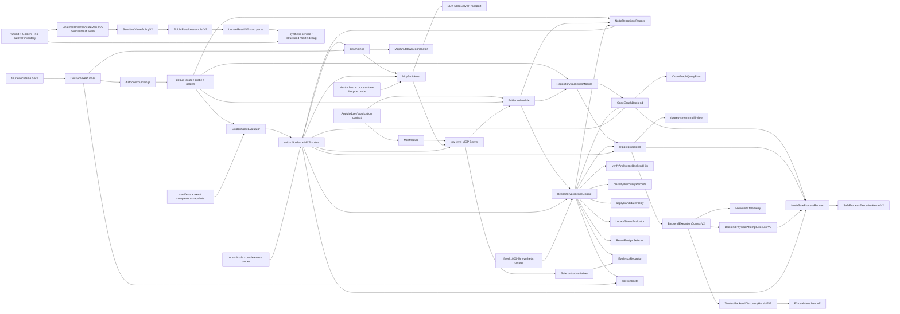

# RepoNav Foundation

## 0. 术语

- **EvidencePack**：`LocateResult.ok=true` 时返回的版本化 production 证据容器；当前由 `CanonicalRepositoryLocateExecutorV2` 编排 CodeGraph primary 与 ripgrep fallback，经 `V1LocateResultProjector` 原样返回。
- **Discovery hit**：`CodeGraphBackend` 或 `RipgrepBackend` 产生的未核验 file/symbol/line/reason fact；它不能直接成为 public evidence。
- **CodeGraph probe**：只执行 `codegraph status --json` 的 capability/index 观察；不会初始化、更新或删除目标仓库 index。
- **CodeGraph query plan**：把 explicit symbol anchors 与 identifier-like terms 变成稳定的单 search invocations，声明 unsupported dimensions、共享 total `maxHits` 与保守 completeness。
- **Fallback**：CodeGraph primary 未保守完成本次请求时执行的 ripgrep second attempt；真实 attempt、health 与 `fallbackChecked` 都进入 coverage。
- **DiscoveryRecord**：命中经 `RepositoryReader` 对当前文件核验后，按 location/excerpt key 合并 provenance、reason、operation、terms 与全部 canonical symbols 的内部记录。
- **Direct mapping recognizer**：在 12 行、4 KiB logical window 内识别封闭 assignment/object/SQL alias/symbol definition 形式的保守 classifier；无法证明时只输出 candidate/excluded。
- **CandidatePolicy**：Evidence Engine 内部的候选分类与有界选择阶段；只消费已核验 DiscoveryRecord/context，按封闭 truth table 生成无 public ID 的 draft，再由 engine 统一物化。
- **Candidate window**：`RepositoryReader.readWindow` 围绕 seed focus 读取的同文件、最多 12 行/4 KiB verified context；它只用于局部 alias/entity/scope 召回，不替换 confirmed location、discovery key 或 ID。
- **Verification Kit**：`testkit/` 下的 manifests、fixtures 与 unit/Golden/MCP runners；它不是 production module。
- **GoldenCaseEvaluator**：success/error manifest expectation 的唯一 evaluator；service 与 MCP runner 只生产 observation，完整 public projection 由 companion snapshot deep-exact 锁定。
- **Completeness report**：把 contract enum/code owner 绑定到实际 companion observation、executable schema probe 或逐 code negative mutation；禁止用 runner/group 名称自证。
- **Lifecycle probe**：独立于 LocateResult 的真实 Nest/MCP/process-tree 测试；通过 context marker 与 direct/descendant PID 观察 shutdown，并在 fault/timeout/nonzero 后统一清理。
- **Performance signal**：固定 1,000-file synthetic corpus 的 blocking correctness/hash/cleanup 与 non-blocking environment-aware timing trend；不是生产 SLA。
- **RepositoryReader**：production filesystem seam；只接受 realpath 后的 repository root 与 normalized root-relative POSIX file path，返回 typed failures。
- **SafeProcessRunner**：production child-process seam；`NodeSafeProcessRunner` 的 buffered `run` 与 `runStreaming` 均委托唯一 `SafeProcessExecutionKernelV2`（spawn/listener/timer/N+1/tree cleanup/settle-once）；exact-N 不终止，观察 N+1 sentinel 才 limit；强制 `shell:false` 与显式 env/budgets。
- **BackendExecutionContextV2**：canonical 每 request 唯一创建的 request-scoped physical-start authority；登记 exact request AbortSignal、backend-bound executor、ordinal registry、seal 与 expanded logical reducer；F3/backend 不得 bare runner 旁路 start。
- **TrustedBackendDiscoveryHandoffV2**：F5→F3 opaque handoff；仅 complete-safe expanded set 可贡献 membership；telemetry-only / early-stop 的 `completeSafeHits` 为空。
- **BackendExecutionTelemetryViewV2**：F5→F6 no-hits seam；逐 union member 投影去除 `retainedHits`/`selectionEligibility` 后的 public-neutral attempt telemetry；F6 不重解 stdout、不读 retained hits。
- **MCP Surface**：`McpModule`、low-level MCP server handlers 与 `McpStdioHost` 组成的本地协议边界；只暴露 `repo_nav_locate`，不启动 HTTP listener。
- **Output parity**：每个 tool success/error 先通过 `LocateToolOutputSchema` 自校验，再由同一 serializer 同时生成 `structuredContent` 和 JSON text；解析后必须严格等值。
- **McpStdioHost**：stdio transport owner；只连接一次，跟踪 in-flight locate，合并 request/host caller signals，并提供幂等、best-effort close；request deadline 由 Evidence Engine 独占。
- **LocateAbortCoordinator**：Evidence Engine 内 first-writer-wins 的 composed abort owner；锁定 caller 或 internal deadline 的首次来源，后到事件不能改写 status/next-action；closeable，close 时冻结 source 并清 timer/listener。
- **Finalization latch**：最后一次 await（F3 snapshot finalCheck）之后、同步 purge/rank/budget/aggregate/finalize 之前的 close 屏障；close 后 abort 不改当前 response。
- **LocateRequestRawGuardV2**：raw JSON descriptor 先读 root/terms/negativeTerms/anchors/layers 长度，layers 7/8 在 poison element 前拒绝，再接 F1B compact JSON 与 strict Zod；filesystem path 与 semantic 归一化分离，`question` optional 且不进 plan/rank/ID。
- **RequestOutcomeAggregatorV2**：F6 request-outcome owner；消费 F5 no-hits telemetry、F2 verified core、F3 snapshot 与 F8 capability contribution，派生 backend/request-outcome/status/proof；production mount 经 F8 accepted complete-real shadow。
- **RepositoryScopePolicyV1**：F7 path-only layer decision（test > docs > longest explicit prefix > leftmost ordinary > unknown）；只消费 F3 `VerifiedScopePolicyPathViewV2`，不做 Unicode/NFKC/trim/POSIX normalize；candidate-only 对 test/docs 恒成立。
- **ScopeCoverageFactsV1 / ScopeOutcomeContributionV2**：F7 coverage owner；matched 仅来自 post-final stable eligible records，outside 仅经 F3 ScopeCoverageBasis count；经 fixed-order accessors 接入 F1C/F6，contribution tuple exact 为 materialization/snapshot/scope。
- **ScopeBoundProducerRegistrarV2**：F7 execution registrar；登记 direct-classifier、candidate-collector 与 F8 language child-admission port，complete-set seal 后 cross-port arbitration materializer 产 draft。
- **LanguageCapabilityObservationV2 / CapabilityCoverageFactsV2**：F8 language owner；extension→adapter/fallback observation、one-time lexical facts、pre-budget `unsupportedLanguageHits`、retained-decision seal 与 capability contribution；经 fixed-order accessors 接入 F6 四元组 index 3。
- **AcceptedCompleteRealLocateShadowOrchestratorV2**：F8 唯一 non-exported ready provider；four-prerequisite admission → F2 source/materialization → F6 aggregation → F1C fresh complete-envelope finalizer；success 只返回 capability-bound accepted token；failure 不改 v1。
- **Finalization policies**：`LocateStatusEvaluator`、`ResultBudgetSelector`、`NextActionPolicy` 与 `EvidenceRedactor` 组成的纯策略边界；只治理已核验结果，不改变 backend query 或 candidate recall。
- **Safe public error policy**：按四个 tool error code 固定 message/recoverable/action 白名单；application、MCP structured/text 与 `isError` 共用。
- **Debug CLI**：`tools/cli` 下的本地 shallow adapter；locate 复用 application/output policy，probe 只读 infrastructure health，golden 复用 Verification Kit，不拥有新的业务语义。
- **Executable docs**：四份 public docs 中的登记 snippets 由 `test:docs` 解析并通过真实 MCP/CLI binaries 执行，同时对账 schema projection、artifact inventory 与 import graph。
- **LocateResultV2**：已落地但未接入 production 的 strict public success/error
  contract；固定 `schemaVersion='2.0'`、逻辑 `repositoryRef`、coverage/status 与
  response-local evidence ID，不替换当前 v1 `LocateResult`。
- **FinalizedUnsafeLocateResultV2**：v2 assembler 的 strict internal input；保留
  upstream coverage 与 raw term/file/symbol/excerpt，但禁止 public ID/status/
  repositoryRef/redaction metadata 和 assembler-owned degradation。
- **PublicResultAssemblerV2**：唯一把 strict raw v2 facts 物化为 public
  `LocateResultV2` 的 pure allowlist boundary；负责字段策略、derived
  degradation/status、safe errors、continuous ordinal ID 与最终 schema parse。
- **SensitiveValuePolicyV2**：对 term、file、symbol、excerpt 执行 response-local
  corpus propagation、secret/connection/PII/malformed/control redaction 和 exact
  metadata；敏感 file 整体隐藏。
- **v2 response-local ordinal ID**：按 confirmed 后 candidate 的最终数组顺序生成
  `evidence:v2:0001..N`，不含 raw excerpt/content/discovery/Git hash。
- **v2 no-cutover invariant**：F1 的 v2 modules 只由 synthetic fixture、unit/Golden
  和 import-inventory tests 可达；package barrels、Evidence Engine、MCP、CLI、docs
  不得形成 production edge，直到 F9 原子切换。

## 1. 定位与受众

这份地图描述 F9 验收后的 RepoNav MVP：结构化 locate request 优先经过 CodeGraph structured probe/query，并在 binary/index missing、no-result、failed、incomplete、unverified 或 unsupported intent 时显式执行 literal ripgrep fallback；所有命中经安全文件核验、discovery merge、保守 direct classification 与有界 candidate expansion，再由统一 finalization policies 裁决 status、budgets、coverage/nextActions、redaction 与 safe error，最后通过本地 stdio MCP 的 `repo_nav_locate` 输出。production backend/guardrails/MCP surface 之外，shallow debug CLI 与 executable docs 现已落地；Verification Kit 用 shared evaluator、完整 enum/code ownership、真实 lifecycle/process-tree/docs smoke、schema drift、full suites 与 fixed synthetic baseline 锁定当前行为。

## 2. 结构与交互

- `src/contracts/` 持有 schema v1、normalization、Evidence ID/排序，以及 repository/process/backend/evidence service 契约；production modules 只依赖 contracts/runtime。
- `src/contracts/v2/` 与 `src/evidence/public-output/` 持有 dormant v2
  raw/public strict contract、字段策略、assembler 和 synthetic projection；图中没有
  指向 production App/Evidence/MCP/CLI/docs 的 edge，且 package barrels 不导出这些
  modules。
- `EvidenceModule` 绑定 `CanonicalRepositoryLocateExecutorV2`、唯一 `V1LocateResultProjector`，并以 `useExisting` 把薄 `RepositoryEvidenceEngine` façade 暴露为 `REPOSITORY_EVIDENCE_SERVICE`；shadow/preparation/composer 不进 providers/exports。
- `RepositoryBackendsModule` 提供 `NodeSafeProcessRunner`、`CodeGraphBackend` 与 `RipgrepBackend`，并通过 factory 输出有序、冻结的 `[codegraph, ripgrep]` backend collection；binary missing 不移除 provider。
- `CodeGraphBackend` 只解析 `status --json` 与 `query --json` stdout；probe 记录 binary/index/version/freshness capability，query planner 为 symbol/identifier entries 生成稳定单参数 invocation 并共享 total `maxHits`。required fields malformed 时 fail closed，additional fields forward-compatible。
- `RipgrepBackend.searchViews`（multi-view / expanded 生产路径）经 request-scoped `BackendExecutionContextV2`：availability preparation → `BackendPhysicalAttemptExecutorV2.startStreaming`（`kind:'ripgrep-group'`）→ `RipgrepJsonLineConsumerV2` + `MultiViewAccumulatorV2` 流式解析 `rg --fixed-strings --json`；legacy 与 expanded 为同 parse 独立 lanes；outcome facts 优先绑 `ripgrep-group`。v1 `probe`/`search` 仍走 buffered `processRunner.run`（非 multi-view 残留路径）。
- `NodeSafeProcessRunner` 的 buffered `run` 与 `runStreaming` 均委托唯一 `SafeProcessExecutionKernelV2`：stdout/stderr exact-N 成功、观察 N+1 才 limit；同步 consumer finalizer；tree cleanup / settle-once；无第二套 process lifecycle SM。
- `BackendExecutionContextV2` 每 canonical request 创建一次并贯穿 F3 与 backend；seal 后 late-start 失败；expanded logical reducer 只接 registry closed-set；F3 仅经 `TrustedBackendDiscoveryHandoffV2` / `requireBackendDiscoveryHandoffForF3V2` 消费 complete-safe hits；F6 只消费 no-retainedHits `BackendExecutionTelemetryViewV2`（F5 不创建 public backend/request-outcome owner）。
- F6 `LocateRequestRawGuardV2` + v2 parse seam 在 MCP/CLI 入口执行 raw/filesystem/semantic 分离与 optional `question`；`LocateAbortCoordinator` + finalization latch 拥有 caller/deadline first-writer 与 close 后冻结；`RequestOutcomeAggregatorV2` 经 F8 accepted shadow 聚合 backend/request-outcome/status/proof（contribution 含 capability）。
- `verifyAndMergeBackendHits` 重新读取当前文件，构造不超过 12 行/4 KiB 的 logical window，核对当前命中后按 discovery key 合并全部 provenance/reasons/operations/terms/canonical symbols；fatal path error 继续上抛。
- `classifyDiscoveryRecords` 先处理 negative/layer exclusions，再以轻量 lexical masking 区分 code、comments、strings、regex 与 SQL quoted/comment regions；同一 merged record 只分类一次。
- `applyCandidatePolicy` 在 direct classification 后读取 engine 验证的 candidate windows，以同 statement/container 的 alias neighbor、同 entity sibling 与同 brace scope 的 segment similarity 发现局部线索；六类 reason/role/promotion 与 selection priority 由单一常量表定义。
- `CanonicalRepositoryLocateExecutorV2` 固定执行 normalize → CodeGraph primary search/pre-verification → conservative skip-or-ripgrep fallback → current-file verification/merge → classify once → candidate-window verification → bounded candidate policy → public ID/stable selection → final status/coverage/next actions → redaction，并登记 request-local projection capability/internal token/exact canonical input；`RepositoryEvidenceEngine` 只 issue capability、调用 executor 一次并交给 v1 projector。ID/order 永远早于 public text mutation。
- `NodeRepositoryReader` 继续承担 canonical containment 与 bounded read；`NodeSafeProcessRunner` 经唯一 kernel 承担 controlled env/stdout/stderr 与有界 child-tree cleanup（含 streaming）。
- `McpModule` 注入 `REPOSITORY_EVIDENCE_SERVICE`，以 low-level SDK list/call handlers 暴露单一只读工具；unknown tool 和 protocol-invalid envelope 留在 SDK JSON-RPC error boundary。
- `LocateRequestSchema` 手工解析 envelope-valid arguments；serializer 对 service result 再应用 redaction/safe error policy，把 success、recoverable status 与四类 typed application error 映射为自校验、无 stack/path/raw stderr 的 parity output。
- `McpStdioHost` 只合并 SDK request 与 host shutdown 为 caller abort，整轮 request deadline 唯一由 Evidence Engine 的 `LocateAbortCoordinator` 持有；`McpShutdownCoordinator` 在 EOF、平台 signal、transport/parser failure 或 bootstrap failure时按 host → Nest context 的顺序 best-effort 清理。
- `DiagnosticScrubber` 只服务正式 stderr diagnostics；stdout 始终保留 MCP frames-only，public evidence redaction 与 diagnostic scrub 不共享模糊 replace 语义。
- `src/main.ts` 在首次异步启动前安装 lifecycle handlers，支持 startup shutdown intent 排队；正常 EOF/受支持 signal exit 0，fatal transport/bootstrap failure exit 1。
- `tools/cli` 先严格 parse usage，再按 command 创建 application context 或调用 Golden runner；locate 只解析 `REPOSITORY_EVIDENCE_SERVICE` 并经 MCP 共用的 output policy，probe 只解析 reader/ordered backends，所有 context path 在 `finally` close且 cleanup failure fail-closed。
- `debug golden` 使用 F8 registry 与 shared Vitest JSON summary；CLI 与 docs timeout/abort 都经 `NodeSafeProcessRunner` 的 process-tree grace/hard-kill/close deadline，不复制 evaluator或 expectation semantics。
- `testkit/docs` 以登记 block registry 启动真实 production MCP/CLI，核验 tools/list、success/recoverable/error parity、CLI exits/schemas、Zod/JSON Schema reference projection、artifact inventory与 import graph；runtime report写 gitignored `test-artifacts/docs/`。
- `testkit/contracts/golden-evaluator.ts` 是 success/error expectation 的唯一实现；`golden-projection.ts` 只 normalize repository root，class/reason/ID/order/excerpt/promotion/provenance/coverage/actions 保持 exact。
- `fixture-completeness.ts` 从 contract constants 对账 79 个 owner，并要求 owner 指向实际 snapshot observation、schema probe 或逐 reason-code mutation；23 个 success manifests 与 23 个 companion snapshots exact 配对。
- `McpLifecycleCaseRunner` 对 production bin 只报告真实可观测状态；instrumented probe 导入 `AppModule`、真实 host 与 `NodeSafeProcessRunner`，通过 marker/PID 验证 context、direct/descendant cleanup，并统一清理 fault/timeout/nonzero 路径。
- large synthetic runner 用固定 seed 生成 1,000 files / 50 modules / 10 mappings / 200 decoys，warmup 1 + measured 5；runtime report 写 gitignored `test-artifacts/`，reviewed baseline 位于 `testkit/baselines/`，tests 不覆盖 baseline。

## 3. 数据与状态

- Dormant v2 先以 `FinalizedUnsafeLocateResultV2Schema` 拒绝 output-owned fields、
  非 canonical arrays、contradictory backend/snapshot/scope/capability/abort/status
  facts 与非法 repository locator；programmer contract violation 只产生 fixed
  `INTERNAL_ERROR`。
- `PublicResultAssemblerV2` 对完整 raw response 收集 sensitive corpus，按
  term/file/symbol/excerpt 字段策略处理，canonical union
  `LOCATION_REDACTED`，派生最终 status，再显式 allowlist 组装并按 final order
  分配连续 v2 ordinal ID；public schema 负责最终 cross-field parse。
- v2 字段策略使用合成 hostile corpus 覆盖 secret assignment、fixed credential、
  connection、email/phone、malformed/oversized、C0/DEL/ANSI/bidi 与跨字段 token；
  literal placeholder 只有结合 metadata/resolvable 才具有 redaction 语义。
- v2 state 只存在于单次 pure function 调用和 synthetic tests；没有 DI provider、
  cache、数据库、Redis、文件持久化或日志。`package.json` 在 public beta 授权后为 `private: false`。
- `LocateRequestSchema` 负责 strict input、NFKC/UTF-8 budgets、per-term case 与 file/symbol anchors；engine 解析默认 limits，并把 term 与 anchor metadata 传给 backend/verification/classifier。
- CodeGraph/ripgrep discovery facts 经当前文件核验后才成为 `DiscoveryRecord`；相同 key 的重复/permuted hits 先合并 provenance，classification、primary role、public ID 与排序均在 merge 后执行。
- Direct mapping confirmed 仅覆盖同一 executable statement 的 `target = source`、可执行 object literal 的 `target: source`、受支持 SQL query call/`.sql` alias，以及 exact anchored implementation/definition；其余 exact term/symbol reference降为 candidate。
- F3 existing candidates 与 F5 derived candidates 共用 schema v1 reason/promotion ordered sets；derived candidate 的 provenance 固定为 filesystem/find-matches，不复制 seed backend sources。
- candidate policy 只从已核验 seed/window 出发，要求同 file、focus slice 一致、delimiters balanced 与 innermost owner 相同；新 location 生成独立 discovery key，confirmed 与 candidate key 在 engine 挂载点互斥。
- candidate selection 使用 `maxCandidates` 容量的稳定优先队列；existing exact/symbol candidate 优先，随后是 alias/entity/scope/secondary，并在保留 key 上做受控 reason 合并。eligible item 被截断时记录 `MAX_CANDIDATES_REACHED`，不改变 confirmed。
- test/docs path 即使语法形似 mapping 也最多 candidate；caller layer 排除、negative term、duplicate、unverified content 进入 typed exclusion summary。
- locate status 仍为 `ok | no_result | backend_unavailable | partial | timeout`；唯一 evaluator 依次处理首次 abort source、backend-unavailable special case、coverage gap 与 ok/no-result。coverage 按真实执行顺序记录 attempts；backend 自身固定 process timeout 不冒充 caller-adjustable request deadline。
- CodeGraph 1.1.6 的 pending changes、worktree mismatch 或 reindex recommendation 映射为 `possibly-stale`；即使 clean 也保持 freshness unknown，因为 status 与文件核验之间存在竞态。
- next actions 区分 fixed safety caps 与 caller-adjustable budgets：只有 maxFiles/maxConfirmed/maxCandidates 真实截断且未达 schema max，或 engine internal deadline 且 timeoutMs<30000，才建议 `RETRY_WITH_HIGHER_LIMIT`；caller abort、backend 固定 timeout 与 12 行/4 KiB reader caps不建议提高 request limit。
- confirmed/candidate 先按 canonical stable key 有界选择，再进行 excerpt redaction；secret assignment、credential/connection、email/phone 与 oversized token 产生封闭 redaction reason，无法安全切片的 template/malformed assignment整段 fail-closed。
- 运行状态只存在于 Nest context、打开的 file handle、owned child tree、timers/listeners与内存对象；没有数据库、Redis、文件持久化或长期 session。
- Debug CLI output 是单次进程内状态：stdout 一次写完整 formal JSON/help，stderr 只写固定安全 diagnostic；probe root 永远以 `<repository-root>` 暴露，Golden summary只含 counts、安全 test names与 reviewed artifact paths。
- MCP public input/output schema 发布为 JSON Schema 2020-12 exact object surface；标准 schema 可表达的 tuple arity、closed items 与 unique arrays 均锁定，NFKC/UTF-8 byte budget/cross-field refine 由 `$comment`/description 声明并继续由 runtime Zod 执行。
- `LocateToolOutput` 是 tool boundary 的唯一结构化状态；`isError=false` 对应成功及 recoverable engine status，`isError=true` 只对应 `INVALID_INPUT`、`INVALID_REPOSITORY`、`PATH_OUTSIDE_ROOT`、`INTERNAL_ERROR`。
- 进程生命周期状态只存在于 host/coordinator 内存：connect promise、tracked calls、abort controller、shutdown promise和startup intent；close 幂等且同一 shutdown 返回同一 promise。
- Verification Kit 的持久状态只有 versioned manifests/companion snapshots/ownership metadata 与 reviewed performance baseline；每次 completeness/lifecycle/performance runtime JSON 写入 gitignored `test-artifacts/`，synthetic temp repository 在 `finally` 删除。

## 4. 关键决策

- v2 raw/public separation 通过单一 `PublicResultAssemblerV2` 强制；producer 不得
  构造 public ID/status/redaction metadata，projection 不得再次 redaction、派生
  status 或分配 ID。
- F1 的 no-cutover 是一等契约而非临时说明：v1 仍是唯一 production
  service/MCP/CLI/docs contract；F9 独占 package export、真实 transport parity 与
  原子切换，其他 feature 不得提前挂载或填充虚假 coverage facts。
- v2 public result 使用 response-local ordinal ID 和逻辑 repository ref，不暴露
  raw root、Git object ID、discovery/content hash；字段安全与 cross-field truth
  由 strict schemas + hostile mutation 双重拥有。
- Backend 只产 discovery facts；public evidence 必须由当前文件核验和统一 classifier 产生。
- 顺序固定为 verify → discovery merge → classify once → primary role → ID → sort，禁止先分类再合并或以 ranking 推断 confirmed。
- Ripgrep 使用 literal fixed-string argv 与 per-seed case mode，不经 shell；multi-view 生产路径流式解析 structured match/submatch，不经全量 buffered `search` 桥。
- Process N+1 与 streaming consumer 契约由唯一 kernel 拥有；incomplete/telemetry-only expanded 不得进入 F3 complete-safe membership 或 public evidence；F6 只读 no-hits telemetry seam。
- Physical start 权威在 `BackendExecutionContextV2` + executor；canonical 外不得创建 context；CodeGraph/v1 ripgrep bare `processRunner.run` 仍为非 multi-view 残留。
- F6 request-outcome ownership：raw guard → abort latch → `RequestOutcomeAggregatorV2` direct seam 为唯一 status/proof aggregator；production F2 core accessor 与 F1C aggregation registrar importer 保持 0；F8 是唯一 production bridge。
- Direct mapping truth table是封闭支持集，轻量 recognizer不宣称 AST/framework 等价；未知语法保持 candidate/excluded。
- 同一 location 的多个 canonical symbols 是独立发现事实，merge 后全部保留；classifier按可证明 role priority选择 primary，而不是在 backend 或预算阶段丢失事实。
- Candidate public ID 只在 derived location/discovery key 确定后由 engine 生成；policy draft 不持有 public ID，也不能复用或改变 seed ID。
- 文本 scope/entity/type 识别采取 fail-closed：unbalanced/nested owner 不一致、type position、SQL string/comment 或窗口外结构只会少召回，不允许扩大为模糊 candidate。
- `SECONDARY_BACKEND_HIT` 只允许 CodeGraph primary 已尝试且 record 为 ripgrep-only、无更高 candidate/confirmed reason 时生成；primary-only 不生成，merged 只合并 provenance。
- CodeGraph completeness 采取 fail-closed：多 symbol、unsupported dimensions、case-insensitive intent、budget truncation、process/parser failure 或 current-file verification failure都执行 ripgrep；CodeGraph hit 本身不代表 source completeness。
- Production 不拥有 CodeGraph index lifecycle；init 只存在于真实 smoke 的系统 temp synthetic repository，adapter 不调用 init/update/delete，也不解析 explore/node/stderr 人类文本。
- Repository file访问必须经过 canonical containment + post-open regular-file核验；local stable filesystem 是当前支持模型，Node/Windows reparse TOCTOU 是已知边界。
- Merge/classify/ID顺序、封闭 recognizer边界与 CLI统一 SafeProcessRunner具备 ADR/constraint候选价值；本文件只记录已落地现状，不代写 ADR。
- MCP 采用 low-level list/call handlers，而不是会抢先做输入校验的高层 helper；因此 envelope-valid arguments 始终由共享 Zod schema parse，typed application error 与 SDK protocol error 不串线。
- Public JSON Schema 与 runtime Zod 是两个诚实边界：前者精确表达标准可表示约束，后者继续执行 normalization、byte budget、line order 和跨集合约束；schema 测试使用独立 Ajv2020 与 Zod 反例交叉证明。
- Transport/parser error 采取 fail-closed；shutdown ownership 集中在 `McpShutdownCoordinator`，即使 server/host/app 某一步 close reject 也继续执行其余 cleanup，不向 stdio 泄露 raw error detail。
- request abort 来源采取 first-writer-wins；caller 与 deadline 后到事件不能覆盖首次来源，CodeGraph 多 hit 核验只输出 abort 前已完成的 verified evidence。
- public error action 是 code 白名单：只有 missing/empty terms 的 `INVALID_INPUT` 可携带 `ADD_TERM`，其余 error/action 组合在 application/MCP boundary 被归一化删除。
- sensitive output 是双层防线：Evidence Engine 在 service result 上 redaction，MCP serializer 对任意 service success 再防御性 redaction；任何新增 matcher 语法必须同步 forbidden corpus。
- Golden regression 采用 allowlist normalization：只有 repository absolute root/temp/report-only environment 可变；public class/reason/ID/order/excerpt/promotion/provenance/coverage/actions 的任何漂移必须失败。
- Completeness 不能由 case/group 名称推断；新增 enum/code 必须有机器可验证 owner evidence，confirmed/candidate reason 还必须有逐 code false-positive mutation。
- Lifecycle assertion 不用主进程 exit 推断 Nest/context/child 状态；未安装 probe 时返回 `null`，安装 probe 时 marker/PID 是唯一观察来源，所有异常路径执行末端 cleanup。
- Synthetic correctness/config/corpus/projection/cleanup 是 blocking，elapsed/median/p95/RSS 只作 environment-aware trend；baseline 只能经 review 更新。
- Debug CLI 是 surface non-parity：flags/display 不复制 MCP wire contract，但 locate application/output semantics 必须同源；probe 只是 infrastructure diagnostic，不能产生 EvidencePack/source-of-truth judgement或修改 index。
- Public docs 的 machine-readable schema block 由真实 schemas/constants/examples投影 deep-exact；未知/重复/缺失 block、retired field、artifact/command inventory drift都由 `test:docs` 阻断。

## 5. 代码锚点

- `src/contracts/v2/locate-result-v2.ts` — dormant v2 raw/public strict schemas、
  backend/snapshot/status/redaction cross-field invariants、canonical coverage、
  status derivation 与 response-local ID contract。
- `src/evidence/public-output/sensitive-value-policy-v2.ts` — v2 response-local
  corpus、term/file/symbol/excerpt field adapters、fixed placeholders 与 hostile
  matcher families。
- `src/evidence/public-output/public-result-assembler-v2.ts` — strict raw parse、
  explicit allowlist、derived degradation/status、continuous ordinal ID 与 fixed
  safe errors。
- `src/evidence/public-output/synthetic-locate-projection-v2.ts` — F1-only
  service/structured/text/debug equivalent projections。
- `testkit/contracts/public-output-v2-import-inventory.ts` /
  `test/unit/public-output-v2-no-cutover.spec.ts` — deliberate reachability mutation
  owner 与当前 production no-cutover gate。
- `test/unit/public-output-v2-*.spec.ts` /
  `test/unit/public-result-assembler-v2.spec.ts` /
  `test/golden/public-output-v2.spec.ts` — strict family mutations、hostile corpus、
  placeholder collision、safe error/parity、determinism 与 full projection scan。
- `src/evidence/locate-execution/canonical-locate-executor-v2.ts:CanonicalRepositoryLocateExecutorV2` — CodeGraph-primary/ripgrep-fallback locate orchestration、请求级 `RequestRepositorySnapshotV2` 生命周期（root resolve 后创建、finally dispose）、legacy single-call freeze selector、expanded fold 后 / verify 前 `DiscoveryHitSelectorV2` bind、purge 后 `EvidenceRankerV2`（复用同一 bound selection）、scope-bound classify 与 post-final `stableScopeRecords` → scope coverage mount、retainedEligible ∩ stable-included → capability coverage mount、状态与 next actions、canonical input registration；real success envelope 可含 snapshot/scope/capability（有 ranking 时再加 ranking；backend/request-outcome 由 F8 shadow aggregation 生成）；executor 不 import F2 stages/`public-output`。
- `src/evidence/locate-execution/v1-locate-result-projector.ts:V1LocateResultProjector` — production-only exact legacy projection adapter（F9 删除）。
- `src/evidence/repository-evidence-engine.ts:RepositoryEvidenceEngine` — 薄 service façade；concrete class 不再从 package barrel 导出。
- `src/contracts/v2/locate-fact-envelope-v2.ts` / `src/evidence/canonical/*` — typed fact envelope、four-prerequisite inspector、neutral registrars、finalizer/composer；`accepted-complete-real-locate-shadow-orchestrator-v2.ts` 为 F8 accepted shadow；production roots runtime 不可达 shadow/composer/public schema。
- `src/evidence/language/` — F8 ECMAScript/SQL lexical kernels、extension registry、TS/JS/SQL adapters、fallback policy、observation/coordinator/scope producer、capability coverage builder/accessors、execution coverage mount。
- `src/evidence/request-snapshot/` — 请求级 file cache（canonical promise / alias ledger / per-call limits）、verified observation cache、expanded/legacy discovery lane 与 fixed-800 reservation、legacy selected-path proof pool、trusted scope-policy adapter / classification views、capability classification views、pre-ranking dual pools、final check/purge、opaque snapshot trust proof、Git state probe、producer-basis / scope-coverage basis / neutral language carrier、discovery selection binding 与 trusted snapshot ranking view；Nest singleton 不持 request maps。
- `src/evidence/scope/` — F7 path-only `RepositoryScopePolicyV1`、resolve/request-scope、ScopeCoverageFacts/contribution accessors、scope-bound classification bridge、producer registrar（含 F8 language port admission）与 arbitration materializer、execution coverage mount；兼容 legacy layer export。
- `src/evidence/ranking/` — F2 dormant ranking：`DiscoveryHitSelectorV2`（read 前 F3 opaque folded view reservation）、`EvidenceRankerV2`（purge 后 trusted pool + structured public-safe ordering / MatchPriority / round-robin / unsatisfied ledger）、opaque `EvidenceRankingOutcomeV2` 与 F6 fragment-budget / F8 retained-ref accessors；ranking 不 import `public-output`。
- `src/evidence/public-output/f2-locate-projection-stages-v2.ts` / `materialized-evidence-core-v2.ts` — F2 zero-arg `createSource`/`materialize` 与 F1 `materializePublicEvidenceV2`；F8 accepted shadow 经 exact-once acquisition 委托；F9 前 package 不导出。
- `src/evidence/evidence.module.ts` — 唯一 non-exported ready provider 绑定 F8 accepted complete-real shadow orchestrator；LOCATE_RESULT_PROJECTOR 唯一 binding 为 V2LocateResultProjector（F9 cutover）。
- `src/repository/verified-text-file-source-v2.ts:VerifiedTextFileSourceV2` — realpath→containment→open→bounded UTF-8 decode 安全内核；`NodeRepositoryReader` 与 request snapshot 共用。
- `src/evidence/abort-source.ts:LocateAbortCoordinator` — first-writer-wins caller/deadline ownership；closeable freeze/cleanup。
- `src/evidence/locate-execution/canonical-locate-finalization-v2.ts` — finalization latch（last await 后同步 finalize 屏障）。
- `src/evidence/request-outcome/locate-request-raw-guard-v2.ts` / `src/contracts/locate-request-parse-v2.ts` — raw descriptor guard、filesystem/semantic 分离、optional question。
- `src/evidence/request-outcome/request-outcome-aggregator-v2.ts:RequestOutcomeAggregatorV2` — backend/request-outcome/status/proof；F8 revision contribution tuple exact `[materialization,snapshot,scope,capability]`；production mount 经 F8 accepted shadow。
- `src/evidence/request-outcome/locate-status-v2.ts` / `next-action-policy-v2.ts` — v2 status priority 与 next-action truth table（aggregator 下游）。
- `src/evidence/locate-status-evaluator.ts:evaluateLocateStatus` / `next-action-policy.ts:createNextActions` — final status priority 与 caller-adjustable action policy。
- `src/evidence/result-budget-selector.ts` / `evidence-redactor.ts:redactLocateResult` — stable bounded selection、ID-after public redaction 与 cross-evidence sensitive-token propagation。
- `src/contracts/public-errors.ts` / `src/mcp/locate-tool-output.ts` — safe error code/action policy 与 structured/text/isError parity serializer。
- `src/mcp/diagnostic-scrubber.ts` — stderr-only diagnostic scrub boundary。
- `src/repository/codegraph-backend.ts:CodeGraphBackend` — structured probe/query、health mapping、shared budget 与 fail-closed result。
- `src/repository/codegraph-query-planner.ts:createCodeGraphQueryPlan` — stable entries、unsupported dimensions 与 conservative skip contract。
- `src/repository/codegraph-json.ts` / `codegraph-command.ts` — version-compatible JSON parser 与 shell-free Windows/POSIX invocation resolver。
- `src/process/safe-process-execution-kernel-v2.ts` / `bounded-byte-collector-v2.ts` / `primary-termination-trigger-reducer-v2.ts` / `settlement-verdict-v2.ts` / `buffered-compatibility-projection-v2.ts` — 唯一 child lifecycle/N+1 owner、buffered 兼容投影与 settlement precedence。
- `src/process/backend-execution-context-v2.ts` / `backend-physical-attempt-executor-v2.ts` — request-scoped context、physical start/result authority、availability preparation 与 seal/reducer 入口。
- `src/repository/ripgrep-stream/` — line framer、protocol FSM、JSON line consumer、multi-view accumulator（staging commit/discard、early-stop telemetry）。
- `src/contracts/v2/backend-execution-outcome-v2.ts` — strict outcome schema、opaque validated token、F3 trusted handoff 与 F6 no-hits telemetry accessor；package root 不 re-export。
- `src/repository/ripgrep-backend.ts:RipgrepBackend` — multi-view `searchViews` 流式 JSON adapter；v1 `probe`/`search` 仍 buffered bare runner。
- `src/evidence/discovery-record.ts:verifyAndMergeBackendHits` — current-file verification、bounded logical window 与 deterministic merge。
- `src/evidence/direct-mapping-classifier.ts:classifyDiscoveryRecords` — layer/exclusion resolver 与 direct-mapping truth table；production classify 经 F7 scope-bound bridge（skipFallback 启发式仍可走 legacy 裸 classify，见 residual）。
- `src/evidence/candidate-policy.ts` / `candidate-policy/` — candidate truth table、verified-context lexical predicates、promotion merge 与有界稳定选择；F3 enumerator/lane evaluators 与 F7 candidate-collector port 复用其 consumer 表面。
- `src/evidence/repository-evidence-engine.ts:RepositoryEvidenceEngine` — candidate-window verification、confirmed/candidate 互斥、draft 物化与 candidate limit 编排。
- `src/evidence/evidence.module.ts:EvidenceModule` — reader/engine token assembly。
- `src/repository/repository-backends.module.ts:RepositoryBackendsModule` — runner/CodeGraph/ripgrep/frozen backend collection assembly。
- `src/repository/node-repository-reader.ts:NodeRepositoryReader` — 无状态 one-shot canonical/bounded filesystem adapter（含居中/clamp `readWindow`）；请求级 cache 不落在此 singleton。
- `src/repository/node-safe-process-runner.ts:NodeSafeProcessRunner` — thin adapter；buffered/streaming 均委托 `SafeProcessExecutionKernelV2`。
- `src/mcp/repo-nav-mcp-server.ts:createRepoNavMcpServer` — tools capability、单工具 registry、unknown guard 与 low-level call handler。
- `src/mcp/locate-tool-schema.ts` / `locate-tool-output.ts` — JSON Schema 2020-12 public surface 与共享 parity serializer。
- `src/mcp/mcp-stdio-host.ts:McpStdioHost` — connect-once、tracked calls、merged cancellation 与幂等 close。
- `src/mcp/mcp-shutdown-coordinator.ts:McpShutdownCoordinator` — host/application best-effort shutdown owner。
- `src/main.ts` — compiled stdio process entry 与 early lifecycle handler installation。
- `tools/cli/parser.ts` / `execute.ts` / `main.ts` — strict debug command input、seam dispatch、exit mapping、single-write output 与 context/signal lifecycle。
- `testkit/runners/run-vitest-surface.ts` — unit/Golden/MCP selection registry executor与 process-tree-safe Golden JSON summary。
- `testkit/docs/docs-smoke-runner.ts` / `schema-reference.ts` / `cli-open-stdin-child.ts` — executable docs registry、真实 binaries、schema/artifact/import drift与 open-stdin process-tree harness。
- `docs/getting-started-mcp.md` / `debug-cli.md` / `reference/repo-nav-locate.md` / `acceptance/mvp.md` — 当前 public MCP/CLI/API/验收入口。
- `test/unit/ripgrep-backend.spec.ts` / `evidence-merge.spec.ts` / `direct-mapping-classifier.spec.ts` — adapter、merge、truth-table证据。
- `test/unit/candidate-policy.spec.ts` / `repository-reader.spec.ts` — candidate predicates/budget/permutation、真实 rg 扩窗、confirmed identity 与 reader bounds/error semantics。
- `test/golden/candidate-policy.spec.ts` / `test/mcp/candidate-minimal-loop.spec.ts` — confirmed + alias/sibling candidate + decoy exclusion 的 Golden/stdio MCP 最小闭环。
- `test/unit/codegraph-backend.spec.ts` / `codegraph-query-planner.spec.ts` / `codegraph-live-smoke.spec.ts` — versioned parser、query argv/completeness、真实 temp index/query/cleanup 证据。
- `test/golden/codegraph-fallback.spec.ts` — missing/no-result/failed/incomplete/abort/skip/unverified/provenance/backend-unavailable 状态机证据。
- `test/golden/text-evidence-engine.spec.ts` / `text-engine-classifier.spec.ts` — 真实 rg chain、status、边界、多 symbol与 false-confirmation证据。
- `test/mcp/tool-surface.spec.ts` / `tool-output-parity.spec.ts` / `tool-error-parity.spec.ts` — 真实 SDK surface、strict schema 与 success/error parity。
- `test/mcp/request-cancellation.spec.ts` / `lifecycle-contract.spec.ts` — pre/late cancellation、compiled bin、EOF/signal、transport failure 与 cleanup fault matrix。
- `test/unit/locate-status-evaluator.spec.ts` / `output-guardrails.spec.ts` — abort source race、CodeGraph evidence preservation、fixed backend timeout、redaction/error policy 边界。
- `test/golden/output-guardrails.spec.ts` / `test/mcp/redaction-output-parity.spec.ts` — limits、service/MCP forbidden values、template/malformed/cross-evidence 与 public metadata 证据。
- `testkit/contracts/golden-evaluator.ts` / `golden-projection.ts` / `test/golden/mvp-evaluator.spec.ts` — shared success/error evaluator、exact companion projection 与 deliberate mutation 证据。
- `testkit/contracts/fixture-completeness.ts` / `fixture-coverage-probes.ts` / `test/golden/fixture-completeness.spec.ts` — 79 个 enum/code owner、23/23 snapshot pairs、unrelated-owner 与逐 code negative guards。
- `testkit/contracts/mcp-lifecycle-harness.ts` / `testkit/fixtures/mcp/lifecycle-probe.ts` / `test/mcp/lifecycle-contract.spec.ts` — production stdio、真实 Nest context marker、direct/descendant PID 与 timeout/nonzero cleanup。
- `testkit/performance/large-synthetic-repository.ts` / `test/golden/large-synthetic-repository.spec.ts` — fixed corpus、5-run stable projection、environment report、baseline separation 与 temp cleanup。

## 6. 已知约束 / 边界情况

- v2 当前是 dormant synthetic in-process seam；真实 MCP/CLI/stderr parity 尚未由
  production v2 请求证明，必须留到 F9 cutover gate。
- v2 no-cutover inventory 对当前相对 ESM import/export graph 有效，不等价于完整
  TypeScript module resolution；新增 import 形态时必须同步 gate。
- `locate-result-v2.ts` 与 `sensitive-value-policy-v2.ts` 体量较大但职责仍分别集中
  于完整 contract owner 与 field policy；后续扩展应持续监控结构复杂度。
- 当前没有数字 confidence；CodeGraph 只覆盖 status/query structured capability，不实现 callers/impact。
- Redaction 是封闭确定性 matcher，不宣称识别任意自然语言 secret/PII；新增表达形式必须同步 matcher 与真实 service/MCP forbidden corpus。
- `DiagnosticScrubber` 当前未完整覆盖 UNC 与单段 POSIX absolute path；正式调用只写固定安全 diagnostic，未来放开 raw adapter detail 前必须扩充 matcher。
- Windows npm shim 与 CodeGraph 1.1.6 已实测；其他 portable/native 安装布局与未来 JSON version 需通过环境矩阵、versioned fixtures 和 live smoke 扩展。
- CodeGraph clean status 不等于 freshness proven；当前保守报告 unknown，状态/文件读取竞态可能导致额外 fallback，但不会制造 false confirmation。
- Direct mapping recognizer不是通用 parser；dynamic/computed/cross-window/生成式语法保持 candidate，不扩大 confirmed。
- Candidate recognizer同样不是 AST：angle/type、SQL quoted region 与 12 行/4 KiB 边界采用保守 lexical fail-closed，复杂表达式或窗口外容器可能少召回。
- focus 与 candidate window 是两次本地读取；focus slice 改变会阻断，但仅周边内容并发变化仍可能来自第二次快照。
- `RipgrepBackend` 进程预算固定 10 秒，而 request timeout 上限为 30 秒；状态/abort已有自动化证据，超过 10 秒的真实慢仓库墙钟路径尚未实测。
- F5 multi-view / streaming 已绿；CodeGraph 与 Ripgrep v1 `probe`/`search` 仍 bare runner，expanded locate 若走这些路径则物理 start 不进 F5 registry/trace。
- `createBackendExecutionContextV2` 的 preparation port 参数当前未注入使用（executor 内联 availability）；cwd identity 敌意语料仍弱。
- F5 platform markers 本地 `test:platform` 已绿；远程六格同 revision marker evidence 尚未归档。
- F6 question metamorphic 深度仍偏 terms 层（REV-003）；F6-ABORT/LATCH platform case 行为覆盖偏软（REV-013）；远程六格 F6 marker 若未归档则 deferred。
- F7 REV-007 separator `replaceAll`、REV-008 coverage ownership、REV-009 skipFallback 裸 classify、REV-010 无 ranking 时 missing-owner 证明偏弱；远程六格 F7-SCOPE-001 marker deferred。
- F8 language/capability 已挂 production execution 与 accepted complete-real shadow；production transport 仍 v1。empty-ranking seal 与 harness aggregation bundle 为 residual；REV-005..014（COUNT/REAL-SHADOW/LANG 断言强度、`materializeLanguageCapabilityRecordV2` 未挂生产等）important/nit；远程六格 F8-LANG-001 marker deferred；F9 cutover/publish 需独立 owner 授权。
- Reparse swap TOCTOU无法由当前 Node API完全消除；只支持本机稳定 filesystem，不声称对抗恶意并发 mutation。
- Windows `rg 15.1.0`、路径与 process-tree已有真实 QA；POSIX detached group/negative PID、其他 rg minor version尚未在本轮实机执行。
- Windows ADS、真实 unreadable/special device缺少稳定跨权限 fixture。
- SDK `server.onerror` 当前统一 fail-closed exit 1；若未来需要容忍 peer protocol anomaly，必须重新区分 fatal transport failure 与可恢复 diagnostic。
- Shutdown 当前依赖 evidence service/child 协作响应 AbortSignal；非协作实现可能使 tracked settle 无期限等待，当前没有进程内 hard deadline。
- Windows 按 design 通过 stdin EOF 验证 graceful shutdown；真实 SIGINT/SIGTERM exit 0 由非 Windows CI 覆盖。
- Golden full suite 的 `exclusion-summary` 不适用 forbidden-ID guard，因此有一个显式 conditional skip；不是环境缺口。
- Synthetic timing 仅覆盖当前 Windows/Node/ripgrep 与受控 corpus，不能代表真实 monorepo；只用 correctness/hash/cleanup 阻塞。
- Debug CLI 是 local diagnostic surface；没有 remote auth、HTTP listener、UI、index lifecycle或代码修改能力。Golden child预算固定 30 秒，超出时按 runner failure并清理 owned process tree。
- Lifecycle PID marker 文件在外层进程极端异常时存在截断/PID reuse小窗口；正常、deliberate leak、timeout 与 nonzero 路径已有真实清理证据。

## 7. 相关文档

- Public-beta roadmap:
  `../roadmap/repo-nav-public-beta/repo-nav-public-beta-roadmap.md`；
  F1 `public-output-boundary-v2` 已完成，F9 `public-beta-release` 负责 production
  v2 cutover。
- v2 contract/threat model:
  `../roadmap/repo-nav-public-beta/public-contract-v2.md` /
  `../roadmap/repo-nav-public-beta/threat-model.md`。
- F1 design/acceptance:
  `../features/2026-07-23-public-output-boundary-v2/public-output-boundary-v2-design.md`
  / `public-output-boundary-v2-acceptance.md`。
- Requirement: `../requirements/source-of-truth-evidence.md`（仍为 draft；F7 已形成全状态/output guardrails，但发布级完整回归、性能基线与 debug/operator guide 尚未形成完整 MVP capability）。
- Roadmap: `../roadmap/repo-nav-mvp/repo-nav-mvp-roadmap.md`。
- F1/F2: `../features/2026-07-10-repository-evidence-foundation/` / `../features/2026-07-10-repository-access-process-safety/`。
- F3 design/acceptance: `../features/2026-07-10-text-source-evidence-engine/text-source-evidence-engine-design.md` / `text-source-evidence-engine-acceptance.md`。
- F4 design/acceptance: `../features/2026-07-10-mcp-locate-surface/mcp-locate-surface-design.md` / `mcp-locate-surface-acceptance.md`。
- F5 design/acceptance: `../features/2026-07-10-candidate-evidence-policy/candidate-evidence-policy-design.md` / `candidate-evidence-policy-acceptance.md`。
- F6 design/acceptance: `../features/2026-07-10-codegraph-fallback-orchestration/codegraph-fallback-orchestration-design.md` / `codegraph-fallback-orchestration-acceptance.md`。
- F7 design/acceptance: `../features/2026-07-10-evidence-output-guardrails/evidence-output-guardrails-design.md` / `evidence-output-guardrails-acceptance.md`。
- F8 design/acceptance: `../features/2026-07-10-mvp-golden-regression-suite/mvp-golden-regression-suite-design.md` / `mvp-golden-regression-suite-acceptance.md`。
- F9 design/acceptance: `../features/2026-07-10-debug-cli-mcp-guide/debug-cli-mcp-guide-design.md` / `debug-cli-mcp-guide-acceptance.md`。
- Public guides: `../../docs/getting-started-mcp.md` / `../../docs/debug-cli.md` / `../../docs/reference/repo-nav-locate.md` / `../../docs/acceptance/mvp.md`。

## 8. 变更日志

- 2026-07-31：F9 `public-beta-release` acceptance 回填 production v2 cutover（LOCATE_RESULT_PROJECTOR→V2LocateResultProjector）、`0.2.0-beta.1` release candidate、F9-PACK-001 远程六格（push run 30506332626）、owner gates（license MIT/security/advisory dispositions/real-consumer ctxline）；随后 owner 授权 public：`private:false`、merge main、tag、npm publish；REV-005/008 记为 residual。
- 2026-07-28：F8 `language-capability-boundary` acceptance 回填 TS/JS/SQL+fallback adapters、F7 language port/three-port seal、pre-budget unsupportedLanguageHits、CapabilityCoverage mount、F6 四元组 capability、EvidenceModule 唯一 accepted complete-real shadow；production 仍 v1；empty-ranking seal / aggregation harness / 远程六格 F8 marker / F9 cutover 记为残留。
- 2026-07-28：F7 `repository-scope-policy` acceptance 回填 path-only scope policy、F3 trusted adapter/pre-cap fold、two-base-port producer registrar/materializer、ScopeCoverageFacts 固定顺序 accessors 与 production scope mount（envelope 仍缺 capability）；production 仍 v1；REV-007..010 与远程六格 F7 marker 记为残留。
- 2026-07-28：F6 `input-abort-contract-v2` acceptance 回填 raw request guard、abort/finalization latch、`RequestOutcomeAggregatorV2` direct seam、F8-only production mount 与 F2 core accessor importer=0；production 仍 v1；REV-003/013 与远程六格 F6 marker 记为残留。
- 2026-07-28：F5 `streaming-ripgrep` acceptance 回填单一 `SafeProcessExecutionKernelV2`（N+1）、`ripgrep-stream` multi-view、`BackendExecutionContextV2`/physical executor、F3 trusted handoff 与 F6 no-hits telemetry seam；production 仍 v1；CodeGraph/v1 bare runner 与远程六格 marker 记为已知残留。
- 2026-07-23：F1 acceptance 回填 dormant `LocateResultV2` raw/public strict
  boundary、字段级 `SensitiveValuePolicyV2`、单一 `PublicResultAssemblerV2`、
  response-local ordinal ID 与 no-cutover invariant；production 仍保持 v1，
  F9 独占原子切换。
- 2026-07-13：F8 acceptance 回填 shared Golden evaluator、machine-verified completeness、真实 lifecycle probe 与 fixed synthetic performance baseline 的当前结构。
- 2026-07-13：F9 acceptance 回填 shallow debug CLI、process-tree-safe Golden adapter、executable MCP/CLI docs、schema/artifact/import drift gate与 MVP aggregate verification。
