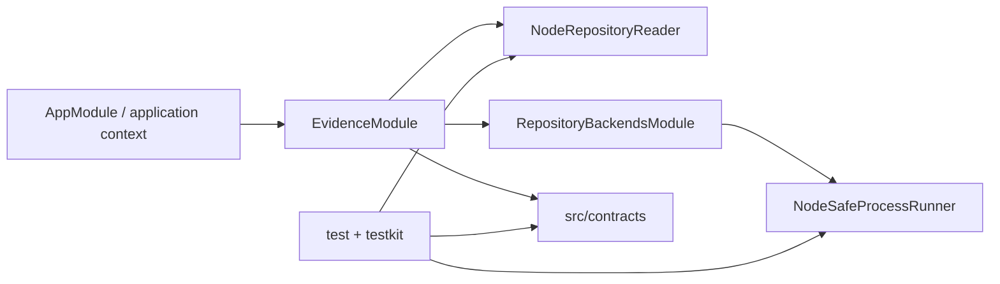

# RepoNav Foundation

## 0. 术语

- **EvidencePack**：`LocateResult.ok=true` 时返回的版本化证据容器；当前只有 schema，没有 production engine。
- **Verification Kit**：`testkit/` 下的 GoldenCase、McpLifecycleCase、manifests、fixtures 与 runners；它不是 production module。
- **RepositoryReader**：production filesystem seam；只接受 realpath 后的 repository root 与 normalized root-relative POSIX file path，返回 typed failures。
- **SafeProcessRunner**：production child-process seam；只接受 executable/argv/cwd/explicit env 与固定 budgets，强制 `shell:false`、stdio capture 和有界 tree cleanup。
- **fail-closed seam**：尚未配置的 evidence service 调用立即抛 `RepoNavBootstrapIncompleteError`；真实 reader 已挂载，但不能产生伪 evidence。

## 1. 定位与受众

这份地图描述 F2 后仓库的可执行 foundation 与 repository safety。后续 backend/engine design 可直接复用 reader/process seams；它仍不代表 repository search、classification 或 MCP tool 已存在。

## 2. 结构与交互

- `src/contracts/` 持有 schema v1、normalization、Evidence ID/排序，以及 `RepositoryAccessError` 与 `SafeProcessRequest/Result` 契约；production modules 只依赖 contracts/runtime。
- `src/evidence/evidence.module.ts` 用 `useExisting` 把 `NodeRepositoryReader` 暴露为 `REPOSITORY_READER`；evidence service 仍 fail closed。
- `src/repository/repository-backends.module.ts` 以 module 内部 class token 提供 `NodeSafeProcessRunner`，同时保留 frozen empty backend collection；当前没有 production search backend。
- `NodeRepositoryReader` 每次读取重新 realpath root/target，验证 containment，open 后 fstat regular file，再以 64 KiB chunks 做 bounded read；handle 在 settle 前关闭。
- `NodeSafeProcessRunner` 在受控 env 与 pipes 中启动 child；stdout/stderr 分别按 raw bytes 达到 cap 即终止。abort/timeout/cap 先 graceful tree kill，grace 后 hard kill，最终 close deadline失败则 reject runner invariant。
- Windows tree termination 使用 `taskkill /PID /T` 与 `/F`；POSIX 使用 detached process group 和 negative PID signals。
- `testkit/fixtures/process/process-helper.ts` 启动真实 descendant；unit、Golden、MCP runners 都传播 Vitest 退出码。

## 3. 数据与状态

- `LocateRequestSchema` 负责 strict input、NFKC/UTF-8 budgets 与 file-anchor lexical boundary；EvidencePack/LocateResult schemas仍是公开结果契约。
- Repository failures 是封闭 code：invalid root/path、not regular/unreadable/binary/range、file/excerpt limits、aborted。错误 message 不包含绝对 repository path或文件内容。
- Safe process result 区分 invalid request、spawn/non-zero、abort/timeout、stdout/stderr limits；invalid-request/spawn-error固定空输出与 null exit/signal。
- 运行状态只存在于 Nest context、打开的 file handle、owned child tree、timers/listeners与内存对象；没有数据库、Redis、文件持久化或长期 session。

## 4. 关键决策

- Repository file访问必须经过 canonical containment + post-open regular-file核验；local stable filesystem 是当前支持模型，Node/Windows reparse TOCTOU 是已知边界。
- Production CLI adapter 必须复用 SafeProcessRunner，不得执行 shell string、继承全部 parent env或把 child stdout写入父 stdout。
- Termination command失败不能无限等待或伪装 spawn-error；owned child tree无法在最终 deadline内 close 属于 runner invariant rejection。
- schema v1、runtime tokens、filesystem/process seams与 Verification Kit 边界具备 ADR 候选价值；本文件只记录 owner-approved design 已落地现状，不代写 ADR。

## 5. 代码锚点

- `src/contracts/repository-access.ts` — repository typed failure codes/messages。
- `src/contracts/safe-process.ts` — process request budgets与 result union。
- `src/repository/node-repository-reader.ts:NodeRepositoryReader` — canonical/bounded filesystem adapter。
- `src/repository/node-safe-process-runner.ts:NodeSafeProcessRunner` — controlled child-process/tree cleanup adapter。
- `src/evidence/evidence.module.ts:EvidenceModule` — real reader + fail-closed evidence service assembly。
- `src/repository/repository-backends.module.ts:RepositoryBackendsModule` — runner class token与当前空 backend collection。
- `test/unit/repository-safety.spec.ts` / `repository-reader.spec.ts` — filesystem contract evidence。
- `test/unit/safe-process-runner.spec.ts` / `process-cleanup.spec.ts` — process contract与resource lifecycle evidence。

## 6. 已知约束 / 边界情况

- 当前不存在 search backend、Evidence Engine、production MCP host/tool、HTTP、LLM或持久化；真实 reader/runner不是完整 locate capability。
- backend collection仍是 frozen empty `useValue`；首个真实 backend接入时必须改为 factory、有序/frozen assembly并加顺序 tests。
- Reparse swap TOCTOU无法由当前 Node API完全消除；只支持本机稳定 filesystem，不声称对抗恶意并发 mutation。
- Windows路径/process-tree已有真实 QA；POSIX detached group/negative PID尚未在本轮实机执行。
- Windows ADS、真实 unreadable/special device缺少稳定跨权限 fixture。

## 7. 相关文档

- Requirement: `../requirements/source-of-truth-evidence.md`（仍为 draft；F2 只提供非用户可感 safety foundation）。
- Roadmap: `../roadmap/repo-nav-mvp/repo-nav-mvp-roadmap.md`。
- F1 design: `../features/2026-07-10-repository-evidence-foundation/repository-evidence-foundation-design.md`。
- F2 design/acceptance: `../features/2026-07-10-repository-access-process-safety/repository-access-process-safety-design.md` / `repository-access-process-safety-acceptance.md`。
