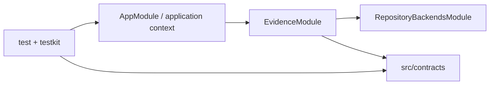

# RepoNav Foundation

## 0. 术语

- **EvidencePack**：`LocateResult.ok=true` 时返回的版本化证据容器；当前只有 schema，没有 production engine。
- **Verification Kit**：`testkit/` 下的 GoldenCase、McpLifecycleCase、manifests 与 runners；它不是 production module。
- **fail-closed seam**：尚未配置的 reader/service 调用立即抛 `RepoNavBootstrapIncompleteError`，不返回伪证据。

## 1. 定位与受众

这份地图描述 F1 后仓库的可执行 foundation。后续 feature design 可用它定位公共契约、Nest runtime seam 与验证入口；它不代表真实 repository search 或 MCP tool 已存在。

## 2. 结构与交互

- `src/contracts/` 持有 Zod schemas、由 schema inference 得到的类型、normalization、Evidence ID 与稳定排序；production modules 只依赖这层和 runtime tokens（`src/contracts/index.ts:1-5`）。
- `src/runtime/tokens.ts:1-13` 定义四个跨 module 的 `Symbol.for` tokens；当前 `MCP_STDIO_HOST` 只声明、不注册 provider。
- `src/app/app.module.ts:1-8` 只导入 `EvidenceModule`；`src/app/create-application-context.ts:1-12` 通过 `NestFactory.createApplicationContext` 建立无 HTTP listener 的 standalone context。
- `src/evidence/evidence.module.ts:1-27` 用 `useExisting` 暴露 reader/service runtime tokens；默认实现均 fail closed。
- `src/repository/repository-backends.module.ts:1-18` 当前只提供 frozen empty backend collection；尚无 production backend。
- `testkit/` 可以依赖 `src/`，反向依赖被禁止；unit、Golden、MCP runners 最终都调用 Vitest 并传播退出码（`testkit/runners/run-vitest-surface.ts:1-116`）。

## 3. 数据与状态

- `LocateRequestSchema` 负责 strict input shape、NFKC/UTF-8 budgets 和 file-anchor lexical boundary；normalization helpers 生成带 case metadata 的 terms/anchors（`src/contracts/request.ts:15-225`）。
- `EvidencePackSchema`、`LocateResultSchema` 与封闭 reason/status enums 是 schema v1 的公开结果契约（`src/contracts/evidence.ts:22-216`）。
- Evidence ID 使用规范化相对路径、行范围和未遮盖 excerpt hash；public ID 再包含 evidence class 与 primary role。最终排序按 class、role、file、start、end、id（`src/contracts/evidence-id.ts:21-87`）。
- F1 没有数据库、Redis、文件持久化、长期 session 或 production process；运行状态只存在于 Nest context、测试进程和内存对象。

## 4. 关键决策

- 当前结构来自 owner-approved `repository-evidence-foundation-design.md`：Zod 是 runtime schema 唯一来源，production/testkit 单向依赖，未配置 seams 必须 fail closed。
- schema v1、runtime tokens 与 Verification Kit 边界具备 ADR 候选价值；尚未单独归档 decision，本文件只记录已落地现状。

## 5. 代码锚点

- `src/contracts/index.ts` — production-safe 公共契约出口。
- `src/runtime/tokens.ts` — Nest runtime injection seams。
- `src/app/create-application-context.ts:createRepoNavApplicationContext` — 唯一 application-context assembly 入口。
- `src/evidence/evidence.module.ts:EvidenceModule` — fail-closed service/reader assembly。
- `src/repository/repository-backends.module.ts:RepositoryBackendsModule` — backend collection token 的当前空实现。
- `testkit/create-testing-module.ts:createRepoNavTestingModule` — 三个外部 seam 的 test override factory。
- `testkit/runners/` — unit/Golden/MCP 真实 runner 入口。

## 6. 已知约束 / 边界情况

- 当前不存在真实 reader、search backend、Evidence Engine、MCP host/tool、HTTP、LLM 或数据库；把 skeleton 当 production capability 是错误用法。
- file anchor 只有 lexical root-relative canonicalization；realpath、symlink escape 与当前文件核验属于后续 repository access safety。
- backend collection 当前是 frozen empty `useValue`；首个真实 backend 接入时必须形成 factory、有序/frozen assembly 并由顺序测试锁定。
- MCP lifecycle harness 验证 synthetic JSON-RPC frames/exit/timeout，不声称测试了尚不存在的 production MCP host。

## 7. 相关文档

- Requirement: `../requirements/source-of-truth-evidence.md`（仍为 draft；F1 只提供非用户可感 foundation）。
- Roadmap: `../roadmap/repo-nav-mvp/repo-nav-mvp-roadmap.md`。
- Feature design: `../features/2026-07-10-repository-evidence-foundation/repository-evidence-foundation-design.md`。
