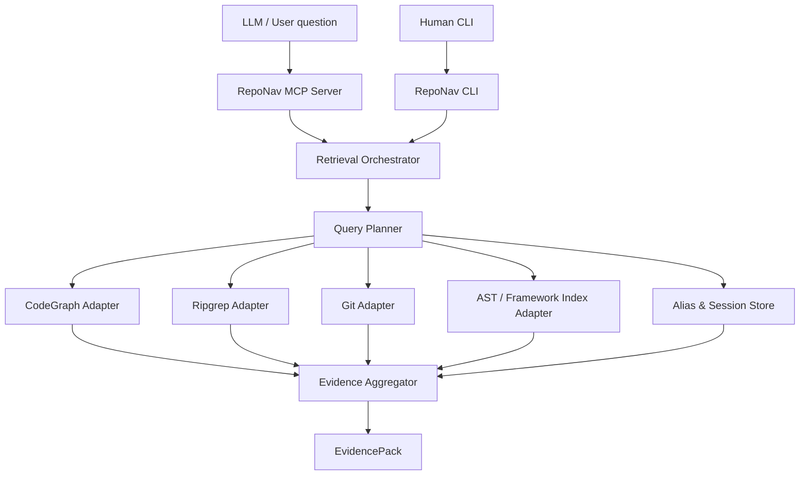
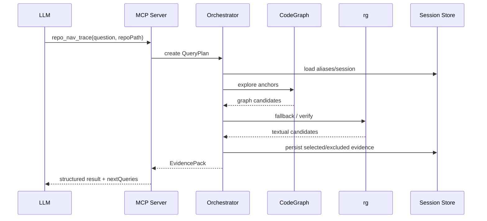

# 02. ????

## ????



## ????

### 1. MCP Server

?? LLM ???????????

- `repo_nav_plan`
- `repo_nav_locate`
- `repo_nav_trace`
- `repo_nav_impact`
- `repo_nav_refine`
- `repo_nav_explain_session`

???

- ?????
- ?? Orchestrator?
- ????? JSON?
- ???????
- ??????????

### 2. CLI

?????????

```bash
repo-nav ask "???????????"
repo-nav plan "speaker confirmation permission"
repo-nav trace "speaker confirmation permission" --layer server
repo-nav impact server/src/modules/foo/foo.service.ts
repo-nav session show <session-id>
```

CLI ? MCP ? fallback???????

### 3. Retrieval Orchestrator

?????????

- ?????? QueryPlan?
- ?????? backend?
- ???????
- ???????
- ?? too broad / off topic / no result?
- ????????

### 4. Query Planner

???????????????

```ts
export interface QueryPlan {
  readonly intent: 'locate' | 'trace' | 'impact' | 'verify' | 'compare';
  readonly question: string;
  readonly repoPath: string;
  readonly domainTerms: readonly string[];
  readonly knownAnchors: readonly string[];
  readonly targetLayers: readonly RepoLayer[];
  readonly relationTypes: readonly RelationType[];
  readonly negativeConstraints: readonly string[];
  readonly maxFiles: number;
  readonly confidence: number;
}

export type RepoLayer = 'client' | 'server' | 'db' | 'test' | 'docs' | 'config';

export type RelationType =
  | 'caller'
  | 'callee'
  | 'import'
  | 'route'
  | 'entity'
  | 'test'
  | 'migration'
  | 'git-history';
```

### 5. Adapters

#### CodeGraph Adapter

?????

- symbol source?
- caller/callee?
- graph path?
- indexed file read?

?????? `.codegraph/`??????

#### Ripgrep Adapter

???

- fallback?
- ? TS ???
- SQL / migration / docs?
- ?? CodeGraph ? no-caller / no-result?

#### Git Adapter

???

- ?????
- blame?
- commit message ??????
- ???????????????

#### AST / Framework Index Adapter

????????

- Angular standalone component / route / service?
- NestJS controller / provider / guard / module?
- TypeORM entity / table / column / relation?
- test spec ? source ???

### 6. Alias & Session Store

?? SQLite ???

????

```text
repo_nav.sqlite
??? repositories
??? sessions
??? session_events
??? aliases
??? files
??? symbols
??? routes
??? entities
??? evidence_items
??? excluded_candidates
```

## ????



## ????

1. **? anchor????**???????????????
2. **???????**?CodeGraph + rg + git ?????????????
3. **???????**???????? reason?
4. **??????**???? no caller / no references?
5. **session ?????**????????????
6. **LLM ????**???????????????
