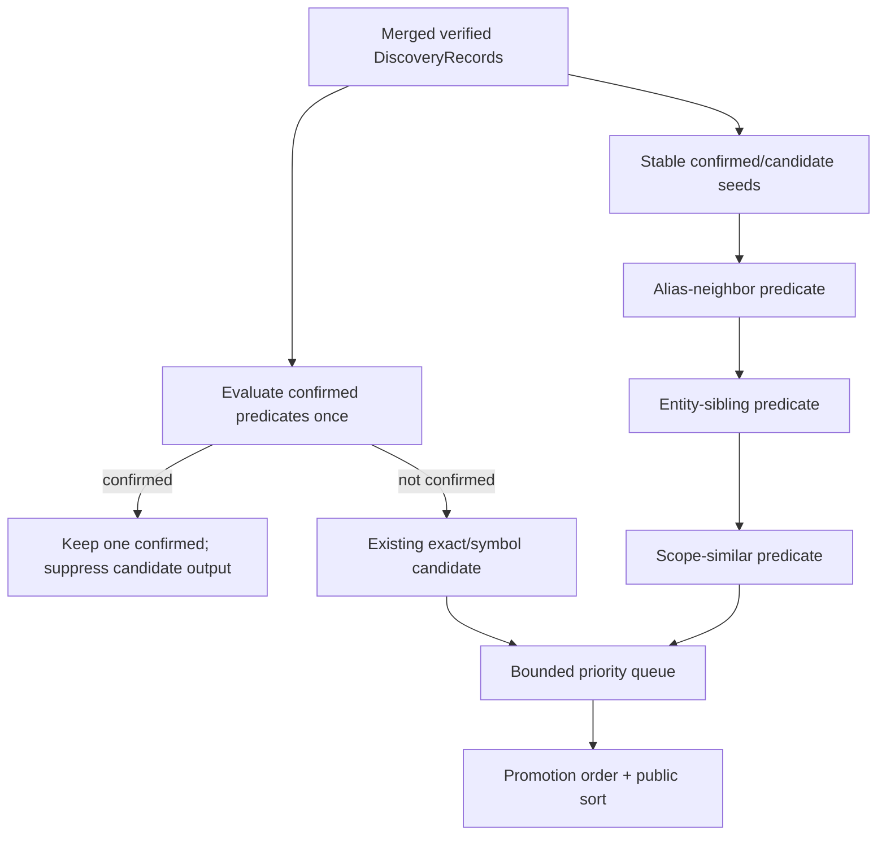

# candidate-evidence-policy 设计

## 0. 术语约定

- **Seed**：F3 已核验的 confirmed/candidate discovery record；candidate expansion 不从未核验 backend hit 起步。
- **Candidate window**：复用 F3 的最多 12 行/4 KiB lexical window，或同一受支持 container 的已核验片段。
- **互斥**：以 classification 前 discovery key 判断同一位置只能产生一条 public evidence，而不是仅比较包含 class/role 的 public ID。
- **Promotion requirements**：封闭枚举的稳定 ordered set，不是自动升级动作。
- **权威输入**：draft requirement + 已批准 roadmap 4.1/4.2/4.6/4.7。

## 1. 决策与约束

### 需求摘要

在 F3 的保守 confirmed 基线上增加受控 candidate policy：从已核验位置发现 same-scope/same-entity/alias-neighbor 关联，按明确 predicate 产生 candidate reason 与 promotion requirements；对每个 discovery record 只分类一次，confirmed 优先且不能被 candidate expansion 重复加入；在 `maxCandidates`、timeout 与现有文件预算下稳定停止。

### 复杂度档位

证据严格档位。无 AST/LLM/embedding 时，scope/entity/similarity 必须使用有限 lexical 规则并公开召回边界；宁可不产出 candidate，也不允许模糊相似度或自动 confirmed。

### 关键决策

- Candidate policy 是 Evidence Engine 内部 deep policy，输入/输出都是已核验 DiscoveryRecord；不新增 transport tool。
- reason/promotion 采用下表唯一映射；reason 按 schema priority 去重，promotion 按 `USER_SEMANTIC_CONFIRMATION → DIRECT_REFERENCE_REQUIRED → CALL_PATH_REQUIRED` 固定顺序去重。
- F3 已产生的 exact-term/symbol-reference candidate 在 F5 统一补齐 promotion requirements；sibling/alias expansion 只在同一已核验 file/window/container 内执行，不枚举新文件。
- `SECONDARY_BACKEND_HIT` 的生成 ownership 在 F6：F5 只定义分类/promotion 语义，只有 provenance 真含 secondary backend 时才接受。
- 每个 discovery key 先合并全部 facts，再运行一次 classifier；若满足 confirmed predicate，candidate predicates 只保留为内部 facts，不生成第二条 evidence。
- candidate selection 使用有界 priority queue：扫描稳定 seed 顺序，按 selection key 保留最优 `maxCandidates`，扫描完成后再按 public output order 输出；不使用“先遇到先占满”。

### Candidate promotion truth table

| Candidate reason | 精确 predicate / owner | role | Promotion requirements |
|---|---|---|---|
| `EXACT_TERM_WITHOUT_DIRECT_MAPPING` | F3：当前文件 exact term，未满足 confirmed mapping | `reference` | `USER_SEMANTIC_CONFIRMATION`, `DIRECT_REFERENCE_REQUIRED` |
| `SYMBOL_REFERENCE_ONLY` | F3/F5：explicit symbol anchor 只命中 import/reference/call site，不是 definition/implementation | `reference` | `DIRECT_REFERENCE_REQUIRED`, `CALL_PATH_REQUIRED` |
| `ALIAS_SOURCE_NEIGHBOR` | F5：同一 12 行/4 KiB verified context 与同一 statement/container 中，seed 与 candidate 之间最多 3 个非 comment lexical tokens，允许分隔符仅 `:`, `=`, `,`, SQL `AS` | `related` | `USER_SEMANTIC_CONFIRMATION`, `DIRECT_REFERENCE_REQUIRED` |
| `SAME_ENTITY_SIBLING` | F5：seed 与 candidate 是同一 12 行/4 KiB verified context 内受支持 object/class/interface/type/table container 的不同 property/column | `related` | `USER_SEMANTIC_CONFIRMATION`, `DIRECT_REFERENCE_REQUIRED` |
| `SAME_SCOPE_SIMILAR_IDENTIFIER` | F5：同一 brace lexical scope；camel/snake segments 仅相差一个 segment，或共享完整 base segments 加一个前后缀 | `related` | `USER_SEMANTIC_CONFIRMATION`, `DIRECT_REFERENCE_REQUIRED` |
| `SECONDARY_BACKEND_HIT` | F6：CodeGraph primary 已尝试但该已核验 record 仅由 ripgrep secondary 发现，且未满足更高 candidate/confirmed reason | `related` | `DIRECT_REFERENCE_REQUIRED` |

表中 requirements 已按全局固定顺序列出；测试断言 exact set + order。

**Lexical constants**：

- identifier tokenizer 先 NFKC；token grammar 为 `(?:[$_]|\p{ID_Start})(?:[$_\u200C\u200D]|\p{ID_Continue})*`。segments 按 `_`/`$`、camel lower→upper、acronym→CapitalizedWord、letter↔digit 边界切分，丢弃空 segment，并做 Unicode simple case fold。
- similar identifier 的唯一 predicate：segment sequence 通过一次 insertion/deletion/substitution 可相等，且至少共享一个非单字符 segment；不使用 edit-distance score。
- container recognizer 复用 F3 lexical scanner，在 verified context 内跳过 string/comment，要求 delimiters balanced；只支持 object literal、`class|interface|type ... {}` 和 SQL table-column list。无法闭合/嵌套超出 context 时 fail closed，不产该 reason。
- 同一 candidate 合并多个 reason 后，以 schema priority 最高的 reason 决定 bounded queue selection priority；完整 reasons 仍按 schema order输出。

### Candidate selection/stop contract

1. 先按 F3 public stable order处理已有 candidate records，再按 confirmed discovery key stable order建立 expansion seeds。
2. 每个 seed 依次评估 `ALIAS_SOURCE_NEIGHBOR → SAME_ENTITY_SIBLING → SAME_SCOPE_SIMILAR_IDENTIFIER`；同一 discovery key 合并 reason，不重复分类。
3. selection key 固定为：existing exact/symbol candidate 优先 → alias neighbor → entity sibling → scope similar → secondary hit → relative file → lines → discovery key。
4. 使用容量为 `maxCandidates` 的有界 priority queue；扫描所有已核验 seed windows 后输出最优集合，再按 evidence class/role/file/line/id 进行 public sort。
5. policy contexts 最多来自已保留的 `maxConfirmed + maxCandidates` records（schema v1 各 ≤20，总计 ≤40），且已受 `maxFiles≤20`、每 context 12 行/4 KiB 与整轮 deadline 限制；`maxCandidates=0` 时也不突破这组边界。若 bounded scan 发现 eligible candidate，则 candidates 为空并记录 `MAX_CANDIDATES_REACHED`。
6. 有 eligible candidate 被截断时记录 `MAX_CANDIDATES_REACHED`，最终 status 由 F7 决定；confirmed 集合和 ID 不受 candidate budget 影响。
7. abort/timeout 立即停止 expansion，只保留已经完成 reader verification 与 classification 的 candidate；不得接纳迟到结果。

### 明确不做

- 不自动提升 candidate、生成修复建议或业务结论。
- 不使用 LLM、embedding、git history、AST 或不透明 similarity score。
- 不新增 MCP tool，不扩大 F3 direct-mapping confirmed 规则。
- 不在 F5 伪造 `SECONDARY_BACKEND_HIT`；没有 F6 provenance 就不能出现该 reason。

### 基线、依赖、风险与交付物

- 基线 commit：`04b04f7a1314f322e82157363ced505e2199cfc8`。
- 前置：F4 accepted，确保 policy 结果可经同一 MCP tool 观察；F3 classification/ID contract 不可绕开。
- Top 3 风险：文本 scope/entity 误关联、public ID 掩盖双分类、扫描顺序导致预算漂移。分别由 predicate false-positive fixtures、discovery-key invariant、permutation/property tests 阻断。
- 关键假设：同 file/container 的受控 lexical candidate 对宿主 Agent有价值；跨文件语义关系留给 CodeGraph/宿主推理。
- 交付物：CandidatePolicy/truth-table constants、selection priority/budget policy、positive/negative manifests、permutation report、MCP minimal-loop transcript。
- 清洁度：禁止临时 stdout/debug、无来源 TODO/FIXME、注释掉代码、死 import；不得在协议中输出任意自然语言 reason。

## 2. 名词与编排

### 2.1 名词层

**现状**：F3 已能输出 direct-mapping confirmed 和 exact-term/reference candidate，按 discovery key merge 并稳定排序；没有 sibling expansion 和完整 promotion mapping。

**变化**：

```ts
interface CandidatePolicyInput {
  readonly records: readonly DiscoveryRecord[];
  readonly contexts: readonly VerifiedCandidateContext[];
  readonly maxCandidates: number;
  readonly signal: AbortSignal;
}

interface VerifiedCandidateContext {
  readonly seedDiscoveryKey: string;
  readonly file: string;
  readonly lines: readonly [number, number];
  readonly unredactedExcerpt: string; // 已由 F2 reader 在本次调用核验，最多 12 行/4 KiB
  readonly provenance: EvidenceProvenance;
}

interface ClassifiedCandidateDraft {
  readonly seedDiscoveryKey: string;
  readonly discoveryKey: string;
  readonly role: EvidenceRole;
  readonly location: EvidenceLocation;
  readonly provenance: EvidenceProvenance;
  readonly reasonCodes: readonly CandidateReasonCode[];
  readonly promotionRequirements: readonly PromotionRequirementCode[];
  // intentionally no public id
}

interface CandidatePolicyResult {
  readonly candidates: readonly ClassifiedCandidateDraft[];
  readonly truncated: boolean;
}
```

- policy 不接 backend/process/filesystem；contexts 由 engine 从 F3 已核验 window 构造，不能扩到 12 行/4 KiB 之外，也不能替换 seed location/discovery key。
- 新 sibling/alias candidate 必须在 context 内定位自己的精确 line range/excerpt slice，继承 filesystem verification provenance 后计算独立 discovery key；不得复用 seed key 或改变 seed confirmed ID。
- context-derived candidate 的 public provenance 固定为 `discoveredBy=['filesystem']`、`verifiedBy='filesystem'`、`operations=['FILESYSTEM_FIND_MATCHES']`；seed backend sources 只保留在内部 `seedDiscoveryKey` relation，不得复制到新 candidate。非 derived 的 F3/F6 records 保留各自真实 provenance。
- `seedDiscoveryKey` 必须引用 input records 中唯一现存 key；同 key contexts 不得有冲突或重叠 line range。referential-integrity failure 是 internal invariant error，不静默选择其一。
- `truncated=true` 的唯一含义是至少一个 eligible candidate 因 `maxCandidates` 未输出；engine 据此记录 `MAX_CANDIDATES_REACHED`。
- 公共 output 仍服从 roadmap 4.6/4.7；policy 返回无 `id` 的 internal drafts，不计算 public ID、不改变 confirmed；engine 在 policy 后统一按 draft discovery key/class/role 生成 public ID。

### 2.2 编排层



- 同一 candidate 被多个 seed/reason 发现时按其独立 discovery key 合并，reason/promotion ordered-set 去重。
- negative term、layer mismatch、unverified file 仍在 policy 前排除；candidate 必须有 `verifiedBy=filesystem`。
- provenance truth table：primary(CodeGraph)-only 不产生 `SECONDARY_BACKEND_HIT`；secondary(ripgrep)-only 且 primary 已尝试时产生；primary+secondary merged 只合并 provenance、不产生该 reason。三格都只能生成一条 public evidence。
- derived candidate 使用 filesystem/find-matches provenance；backend hit、seed、file enumeration permutation 不得改变输出 IDs/class/reasons/promotions/order。

### 2.3 挂载点清单

- Evidence Engine candidate-policy stage：merge 后、public ID/最终 sort 前的唯一 expansion seam。
- Candidate truth-table/priority constants：reason、promotion 与 selection 的唯一 schema v1 来源。
- Golden/MCP minimal-loop fixtures：candidate policy 的公开观察入口。

### 2.4 推进策略

1. **truth table/predicates/context**：六类 reason 的 owner、lexical predicate、verified context、derived provenance、draft type、role、promotion exact set/order及 primary/secondary/merged provenance 正反 cases 通过。
   验证：`npm test -- --group candidate-truth-table --group candidate-discovery --group candidate-context --case secondary-backend-provenance-table`
2. **classification exclusivity**：按 discovery key 只分类一次，confirmed 优先、唯一 role/public evidence。
   验证：`npm test -- --group candidate-classification --case discovery-key-mutual-exclusion`
3. **budget/determinism**：maxCandidates 0/边界/截断/abort 与 hit/seed permutation 稳定。
   验证：`npm test -- --group candidate-budget --group candidate-permutation`
4. **最小闭环**：同一 pack 含 direct mapping confirmed + sibling/alias candidate，排除 unrelated decoy；Golden 与 MCP parity 通过。
   验证：`npm run test:golden -- --case sibling-candidate --case alias-candidate --case sibling-false-positive && npm run test:mcp -- --case candidate-minimal-loop`

### 2.5 结构健康度与微重构

##### 评估

- 文件级：不搬 F3 engine；candidate predicates/selection policy 独立文件，通过单一 stage 挂入。
- 目录级：policy 属 Evidence Engine；fixtures 属 Verification Kit，不能把 candidate logic 放 transport。
- Compound：未发现既有目录 convention。

##### 结论：不做微重构

只扩展现有 classifier pipeline，不改变 adapter/module 结构。

## 3. 验收契约

### 3.1 关键场景

- 每个 reason 都有 positive 与 false-positive fixture；identifier/container/alias lexical edge cases 与 promotion exact set/order 一致。
- candidate context 不超过 12 行/4 KiB；新 location 从已核验 context 精确切片并生成独立 discovery key，使用 filesystem-only derived provenance，seed ID 不变。
- primary-only/secondary-only/merged provenance 三格严格按表决定 `SECONDARY_BACKEND_HIT`，均不生成重复 public evidence。
- 同一 discovery location 同时满足 confirmed/candidate predicate 时，只输出一个 confirmed，即使 class 导致 public IDs 本可不同。
- alias/entity/scope 规则不跨 statement/container/file；不相关相似字段、test/docs decoy 不产出 sibling candidate。
- maxCandidates=0、1、默认、超限、timeout 都可判定；截断记录 limit，confirmed 不受影响。
- 打乱 backend hits、seed、file order 后，candidate class/reasons/promotions/IDs/order 完全一致。
- minimal loop 经 service 与真实 stdio MCP 输出同一 pack；它只证明受控 fixture，不代表发布完成。

### 3.2 明确不做的反向核对

- 不出现自动 confirmed、修复建议、自然语言 reason 或 numeric similarity/confidence。
- 不 import LLM/embedding/git/AST/MCP transport dependencies。
- F6 前任何 evidence 不得含 `SECONDARY_BACKEND_HIT`。

### 3.3 Acceptance Coverage Matrix

| Scenario | Covered By Step | Evidence Type | Command / Action | Core? |
|---|---|---|---|---|
| reason/promotion/context/derived provenance/draft type truth table | S1 | table-driven unit + fixtures | truth/discovery/context/provenance cases | yes |
| discovery-key mutual exclusion/role precedence | S2 | invariant unit | classification case | yes |
| maxCandidates/stop/permutation | S3 | boundary/property tests | budget/permutation groups | yes |
| confirmed+candidate+decoy Golden/MCP loop | S4 | Golden + stdio integration | named candidate cases | yes |

### 3.4 DoD Contract

| ID | 要求 | 证据 | 阻塞级别 |
|---|---|---|---|
| DOD-DESIGN-001 | design/checklist/review 完整并获 owner 批准 | design review | blocking |
| DOD-IMPL-001 | policy/table/budget/fixtures 完成 | checklist/diff/logs | blocking |
| DOD-REVIEW-001 | code review passed，重点审 false candidate 与 single classification | review report | blocking |
| DOD-QA-001 | truth table、budget、permutation、Golden/MCP 全运行 | QA report | blocking |
| DOD-ACCEPT-001 | acceptance 记录召回边界与 minimal-loop 限制 | acceptance | blocking |

Validation Commands:

| ID | 命令 | 目的 | 核心性 | 失败处理 |
|---|---|---|---|---|
| CMD-BUILD | `npm run build` | 编译 | core | fix-or-block |
| CMD-TYPECHECK | `npm run typecheck` | strict 类型检查 | core | fix-or-block |
| CMD-TRUTH | `npm test -- --group candidate-truth-table --group candidate-discovery --group candidate-context --case secondary-backend-provenance-table` | reason/promotion/context/provenance predicates | core | fix-or-block |
| CMD-EXCLUSIVE | `npm test -- --group candidate-classification --case discovery-key-mutual-exclusion` | single classification | core | fix-or-block |
| CMD-BUDGET | `npm test -- --group candidate-budget --group candidate-permutation` | bounded deterministic stop | core | fix-or-block |
| CMD-LOOP | `npm run test:golden -- --case sibling-candidate --case alias-candidate --case sibling-false-positive && npm run test:mcp -- --case candidate-minimal-loop` | minimal loop parity | core | fix-or-block |

Required Artifacts: design-review、truth-table constants、policy interface、positive/negative manifests、permutation report、Golden/MCP transcripts、command logs、review、QA、acceptance。

## 4. 与项目级架构文档的关系

Acceptance 回填 Evidence Engine candidate stage 与 bounded selection policy。文本 predicate 与 promotion mapping 属长期 schema constraint，落地后建议 ADR/learning 记录召回边界。
