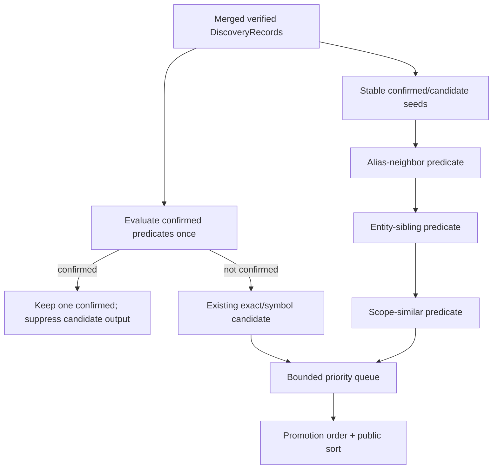

# CodeStable Code Quality Review Packet

- root: `D:/Personal/repo-nav-worktrees/repo-nav-mvp`
- unit: `.codestable/features/2026-07-10-candidate-evidence-policy`
- stage: `quality`

## Reviewer Mission

Check whether the code is clean, tested, maintainable, secure, and robust under real project conditions.

## Stage Focus

maintainability, readability, coupling, security, edge cases, test gaps, performance, idempotency, crash-resume behavior, and deterministic boundaries

## Reviewer Output Contract

- Lead with findings, ordered by severity.
- Include severity (`P0`/`P1`/`P2`/`P3`) and confidence for each finding.
- Reference concrete files, code, docs, or validation evidence when possible.
- If there are no blocking findings, say so explicitly and list residual risks or test gaps.

## Unit Documents
### `.codestable/features/2026-07-10-candidate-evidence-policy/candidate-evidence-policy-checklist.yaml`

```
feature: 2026-07-10-candidate-evidence-policy
created: '2026-07-10'
steps:
- id: S1
  action: 实现 candidate truth table、verified context 与 lexical/provenance predicates
  exit_signal: 六类 reason 的 owner/predicate/context/role/promotion 及 primary/secondary/merged provenance 均有 positive/false-positive case
  verification: npm test -- --group candidate-truth-table --group candidate-discovery --group candidate-context --case secondary-backend-provenance-table
  artifacts: [CandidatePolicy, VerifiedCandidateContext, ClassifiedCandidateDraft, truth-table constants, predicate fixture report]
  status: done
- id: S2
  action: 实现 discovery-key 单次分类与 confirmed 优先
  exit_signal: 每个 discovery record 只产生一个 class、primary role 和 public evidence
  verification: npm test -- --group candidate-classification --case discovery-key-mutual-exclusion
  artifacts: [classification invariant report]
  status: done
- id: S3
  action: 实现 maxCandidates bounded selection 与稳定停止
  exit_signal: 0/边界/截断/abort 和 hit/seed permutation 的 result/limit/order 可重复
  verification: npm test -- --group candidate-budget --group candidate-permutation
  artifacts: [selection policy, permutation report]
  status: done
- id: S4
  action: 验证 Golden/MCP candidate 最小闭环
  exit_signal: 同一 pack 含 direct confirmed、sibling/alias candidate，排除 unrelated decoy 且两表面 parity
  verification: npm run test:golden -- --case sibling-candidate --case alias-candidate --case sibling-false-positive && npm run test:mcp -- --case candidate-minimal-loop
  artifacts: [Golden manifests, MCP transcript, artifact inventory]
  status: done
checks:
- id: C1
  item: 六类 CandidateReasonCode owner/predicate/role/promotion mapping 与设计表一致
  source: design 1 truth table
  status: pending
- id: C2
  item: promotion requirements 使用全局固定顺序去重
  source: design 1
  status: pending
- id: C3
  item: tokenizer/container/alias constants 精确，predicate 不跨 12 行/4 KiB verified context、声明边界或 file
  source: design 1/3.1
  status: pending
- id: C4
  item: VerifiedCandidateContext 引用唯一现存 seed key且无冲突 context；新 candidate 精确切片并生成独立 discovery key
  source: design 2.1/3.1
  status: pending
- id: C5
  item: SECONDARY_BACKEND_HIT 仅在 secondary-only 且 primary attempted 时生成；primary-only/merged 不生成
  source: design 1/2.2/3.1
  status: pending
- id: C6
  item: policy 返回无 public id 的 ClassifiedCandidateDraft，engine 后续统一生成 ID；mutual exclusion 以 discovery key 判定
  source: design 0/1/3.1
  status: pending
- id: C7
  item: confirmed priority 与唯一 primary role 不被 expansion 覆盖
  source: design 1/2.2
  status: pending
- id: C8
  item: selection key、bounded queue、maxCandidates=0/truncated 语义稳定
  source: design 1 selection contract
  status: pending
- id: C9
  item: candidate 截断记录 MAX_CANDIDATES_REACHED 且不改变 confirmed
  source: design 1/2.1
  status: pending
- id: C10
  item: derived candidate provenance 固定 filesystem/find-matches，不复制 seed backend sources；permutation 不改变 class/reasons/promotions/IDs/order
  source: design 2.2/3.1
  status: pending
- id: C11
  item: minimal loop 同时验证 confirmed/candidate/decoy 与 MCP parity
  source: design 3.1
  status: pending
- id: C12
  item: 无自动升级、修复建议、LLM/embedding/git/AST/新 MCP tool
  source: design 1/3.2
  status: pending
dod:
  commands:
  - id: CMD-BUILD
    command: npm run build
    core: true
    failure_handling: fix-or-block
  - id: CMD-TYPECHECK
    command: npm run typecheck
    core: true
    failure_handling: fix-or-block
  - id: CMD-TRUTH
    command: npm test -- --group candidate-truth-table --group candidate-discovery --group candidate-context --case secondary-backend-provenance-table
    core: true
    failure_handling: fix-or-block
  - id: CMD-EXCLUSIVE
    command: npm test -- --group candidate-classification --case discovery-key-mutual-exclusion
    core: true
    failure_handling: fix-or-block
  - id: CMD-BUDGET
    command: npm test -- --group candidate-budget --group candidate-permutation
    core: true
    failure_handling: fix-or-block
  - id: CMD-LOOP
    command: npm run test:golden -- --case sibling-candidate --case alias-candidate --case sibling-false-positive && npm run test:mcp -- --case candidate-minimal-loop
    core: true
    failure_handling: fix-or-block
  evidence_required: [command_output, diff_summary, artifact_inventory, truth_table, permutation_report]
  cleanliness:
    debug_output: forbidden
    temporary_todo_fixme: forbidden
    commented_out_code: forbidden
    unused_imports: forbidden
```

### `.codestable/features/2026-07-10-candidate-evidence-policy/candidate-evidence-policy-design-review.md`

```
---
doc_type: feature-design-review
feature: 2026-07-10-candidate-evidence-policy
status: passed
reviewed: 2026-07-10
round: 4
---

# candidate-evidence-policy feature design 审查报告

## 1. Scope And Inputs

- Design：`.codestable/features/2026-07-10-candidate-evidence-policy/candidate-evidence-policy-design.md`
- Checklist：`.codestable/features/2026-07-10-candidate-evidence-policy/candidate-evidence-policy-checklist.yaml`
- Roadmap：`.codestable/roadmap/repo-nav-mvp/repo-nav-mvp-roadmap.md`
- Requirement：`.codestable/requirements/source-of-truth-evidence.md`
- Baseline：`04b04f7a1314f322e82157363ced505e2199cfc8`（设计审查时 no-code baseline）

### Independent Review

- Status：completed
- Detection：native-agent
- Provider / agent：`/root/design_review_core_surfaces`
- Raw output：独立只读 reviewer 完成多轮审查；最终 Round 4 无 blocking / important finding
- Merge policy：主 agent 逐条核验 finding、同步 design/checklist、重跑 YAML 与 cross-doc gate 后复审
- Gate effect：none

## 2. Design Summary

- Goal：bounded sibling/alias candidate、promotion truth table 与 deterministic selection。
- Steps：4 条，均有可独立判断的 exit signal。
- Checks：12 条，均能追溯到 design、roadmap contract 或 artifact。
- Baseline / validation：真实 build/typecheck/unit/Golden/MCP/docs 命令已进入 DoD。

## 3. Findings

### blocking

- none

### important

- none

### nit

- none

### suggestion

- 实现若改变 approved interface、status/reason、ordering、failure mode 或验证边界，必须回到 design review。

### learning

- Roadmap 共享协议必须在 feature 中落成 typed seam、可执行错误模式和真实证据入口。

### praise

- 方案边界、negative fixtures、命令与 required artifacts 已形成可证伪闭环。

## 4. User Review Focus

- Owner 已在第二次 roadmap checkpoint 批准本设计。
- Implement 必须遵守 design 的明确不做、清洁度和恢复边界。
- Review / QA / acceptance 必须消费真实 command logs、gate results 与 evidence pack。

## 5. Evidence Confidence Ledger

| Check | Verdict | Evidence Class | Basis | Follow-up |
|---|---|---|---|---|
| Acceptance Coverage Matrix | pass | E+C | 核心场景均映射到 step、命令和证据 | implementation 运行证据 |
| DoD Contract | pass | E | 五阶段 DoD、commands、artifacts 齐全 | none |
| Steps and checks traceability | pass | E | pending 状态和来源明确 | none |
| Roadmap contract compliance | pass | E+C | 未绕开 roadmap 4.x 硬契约 | none |
| Module interface design | pass | E+C | depth、seam、ordering 和 error mode 可执行 | code review |
| Validation and artifacts | pass | E | YAML/cross-doc 与命令入口可核验 | QA |

Summary：E=6，C=3，H=0，H-only core checks=none。

## 6. Residual Risk

- 12 行/4 KiB 是明确的保守召回边界。
- 设计通过不替代 implementation、code review、QA 和 acceptance 的真实运行证据。

## 7. Verdict

- Status：passed
- Next：design 已由 owner 批准，可进入 goal feature loop。
```

### `.codestable/features/2026-07-10-candidate-evidence-policy/candidate-evidence-policy-design.md`

```
---
doc_type: feature-design
feature: 2026-07-10-candidate-evidence-policy
requirement: source-of-truth-evidence
roadmap: repo-nav-mvp
roadmap_item: candidate-evidence-policy
status: approved
summary: 实现可解释 sibling/alias candidate、单次分类互斥、promotion truth table 与稳定有界停止
tags: [candidate, repo-nav]
---

# candidate-evidence-policy 设计

## 0. 术语约定

- **Seed**：F3 已核验的 confirmed/candidate discovery record；candidate expansion 不从未核验 backend hit 起步。
- **Candidate window**：复用 F3 的最多 12 行/4 KiB lexical window，或同一受支持 container 的已核验片段。
- **互斥**：以 classification 前 discovery key 判断同一位置只能产生一条 public evidence，而不是仅比较包含 class/role 的 public ID。
- **Promotion requirements**：封闭枚举的稳定 ordered set，不是自动升级动作。
- **权威输入**：draft requirement + 已批准 roadmap 4.1/4.2/4.6/4.7。

## 1. 决策与约束

### 需求摘要

在 F3 的保守 confirmed 基线上增加受控 candidate policy：从已核验位置发现 same-scope/same-entity/alias-neighbor 关联，按明确 predicate 产生 candidate reason 与 promotion requirements；对每个 discovery record 只分类一次，confirmed 优先且不能被 candidate expansion 重复加入；在 `maxCandidates`、timeout 与现有文件预算下稳定停止。

### 复杂度档位

证据严格档位。无 AST/LLM/embedding 时，scope/entity/similarity 必须使用有限 lexical 规则并公开召回边界；宁可不产出 candidate，也不允许模糊相似度或自动 confirmed。

### 关键决策

- Candidate policy 是 Evidence Engine 内部 deep policy，输入/输出都是已核验 DiscoveryRecord；不新增 transport tool。
- reason/promotion 采用下表唯一映射；reason 按 schema priority 去重，promotion 按 `USER_SEMANTIC_CONFIRMATION → DIRECT_REFERENCE_REQUIRED → CALL_PATH_REQUIRED` 固定顺序去重。
- F3 已产生的 exact-term/symbol-reference candidate 在 F5 统一补齐 promotion requirements；sibling/alias expansion 只在同一已核验 file/window/container 内执行，不枚举新文件。
- `SECONDARY_BACKEND_HIT` 的生成 ownership 在 F6：F5 只定义分类/promotion 语义，只有 provenance 真含 secondary backend 时才接受。
- 每个 discovery key 先合并全部 facts，再运行一次 classifier；若满足 confirmed predicate，candidate predicates 只保留为内部 facts，不生成第二条 evidence。
- candidate selection 使用有界 priority queue：扫描稳定 seed 顺序，按 selection key 保留最优 `maxCandidates`，扫描完成后再按 public output order 输出；不使用“先遇到先占满”。

### Candidate promotion truth table

| Candidate reason | 精确 predicate / owner | role | Promotion requirements |
|---|---|---|---|
| `EXACT_TERM_WITHOUT_DIRECT_MAPPING` | F3：当前文件 exact term，未满足 confirmed mapping | `reference` | `USER_SEMANTIC_CONFIRMATION`, `DIRECT_REFERENCE_REQUIRED` |
| `SYMBOL_REFERENCE_ONLY` | F3/F5：explicit symbol anchor 只命中 import/reference/call site，不是 definition/implementation | `reference` | `DIRECT_REFERENCE_REQUIRED`, `CALL_PATH_REQUIRED` |
| `ALIAS_SOURCE_NEIGHBOR` | F5：同一 12 行/4 KiB verified context 与同一 statement/container 中，seed 与 candidate 之间最多 3 个非 comment lexical tokens，允许分隔符仅 `:`, `=`, `,`, SQL `AS` | `related` | `USER_SEMANTIC_CONFIRMATION`, `DIRECT_REFERENCE_REQUIRED` |
| `SAME_ENTITY_SIBLING` | F5：seed 与 candidate 是同一 12 行/4 KiB verified context 内受支持 object/class/interface/type/table container 的不同 property/column | `related` | `USER_SEMANTIC_CONFIRMATION`, `DIRECT_REFERENCE_REQUIRED` |
| `SAME_SCOPE_SIMILAR_IDENTIFIER` | F5：同一 brace lexical scope；camel/snake segments 仅相差一个 segment，或共享完整 base segments 加一个前后缀 | `related` | `USER_SEMANTIC_CONFIRMATION`, `DIRECT_REFERENCE_REQUIRED` |
| `SECONDARY_BACKEND_HIT` | F6：CodeGraph primary 已尝试但该已核验 record 仅由 ripgrep secondary 发现，且未满足更高 candidate/confirmed reason | `related` | `DIRECT_REFERENCE_REQUIRED` |

表中 requirements 已按全局固定顺序列出；测试断言 exact set + order。

**Lexical constants**：

- identifier tokenizer 先 NFKC；token grammar 为 `(?:[$_]|\p{ID_Start})(?:[$_\u200C\u200D]|\p{ID_Continue})*`。segments 按 `_`/`$`、camel lower→upper、acronym→CapitalizedWord、letter↔digit 边界切分，丢弃空 segment，并做 Unicode simple case fold。
- similar identifier 的唯一 predicate：segment sequence 通过一次 insertion/deletion/substitution 可相等，且至少共享一个非单字符 segment；不使用 edit-distance score。
- container recognizer 复用 F3 lexical scanner，在 verified context 内跳过 string/comment，要求 delimiters balanced；只支持 object literal、`class|interface|type ... {}` 和 SQL table-column list。无法闭合/嵌套超出 context 时 fail closed，不产该 reason。
- 同一 candidate 合并多个 reason 后，以 schema priority 最高的 reason 决定 bounded queue selection priority；完整 reasons 仍按 schema order输出。

### Candidate selection/stop contract

1. 先按 F3 public stable order处理已有 candidate records，再按 confirmed discovery key stable order建立 expansion seeds。
2. 每个 seed 依次评估 `ALIAS_SOURCE_NEIGHBOR → SAME_ENTITY_SIBLING → SAME_SCOPE_SIMILAR_IDENTIFIER`；同一 discovery key 合并 reason，不重复分类。
3. selection key 固定为：existing exact/symbol candidate 优先 → alias neighbor → entity sibling → scope similar → secondary hit → relative file → lines → discovery key。
4. 使用容量为 `maxCandidates` 的有界 priority queue；扫描所有已核验 seed windows 后输出最优集合，再按 evidence class/role/file/line/id 进行 public sort。
5. policy contexts 最多来自已保留的 `maxConfirmed + maxCandidates` records（schema v1 各 ≤20，总计 ≤40），且已受 `maxFiles≤20`、每 context 12 行/4 KiB 与整轮 deadline 限制；`maxCandidates=0` 时也不突破这组边界。若 bounded scan 发现 eligible candidate，则 candidates 为空并记录 `MAX_CANDIDATES_REACHED`。
6. 有 eligible candidate 被截断时记录 `MAX_CANDIDATES_REACHED`，最终 status 由 F7 决定；confirmed 集合和 ID 不受 candidate budget 影响。
7. abort/timeout 立即停止 expansion，只保留已经完成 reader verification 与 classification 的 candidate；不得接纳迟到结果。

### 明确不做

- 不自动提升 candidate、生成修复建议或业务结论。
- 不使用 LLM、embedding、git history、AST 或不透明 similarity score。
- 不新增 MCP tool，不扩大 F3 direct-mapping confirmed 规则。
- 不在 F5 伪造 `SECONDARY_BACKEND_HIT`；没有 F6 provenance 就不能出现该 reason。

### 基线、依赖、风险与交付物

- 基线 commit：`04b04f7a1314f322e82157363ced505e2199cfc8`。
- 前置：F4 accepted，确保 policy 结果可经同一 MCP tool 观察；F3 classification/ID contract 不可绕开。
- Top 3 风险：文本 scope/entity 误关联、public ID 掩盖双分类、扫描顺序导致预算漂移。分别由 predicate false-positive fixtures、discovery-key invariant、permutation/property tests 阻断。
- 关键假设：同 file/container 的受控 lexical candidate 对宿主 Agent有价值；跨文件语义关系留给 CodeGraph/宿主推理。
- 交付物：CandidatePolicy/truth-table constants、selection priority/budget policy、positive/negative manifests、permutation report、MCP minimal-loop transcript。
- 清洁度：禁止临时 stdout/debug、无来源 TODO/FIXME、注释掉代码、死 import；不得在协议中输出任意自然语言 reason。

## 2. 名词与编排

### 2.1 名词层

**现状**：F3 已能输出 direct-mapping confirmed 和 exact-term/reference candidate，按 discovery key merge 并稳定排序；没有 sibling expansion 和完整 promotion mapping。

**变化**：

```ts
interface CandidatePolicyInput {
  readonly records: readonly DiscoveryRecord[];
  readonly contexts: readonly VerifiedCandidateContext[];
  readonly maxCandidates: number;
  readonly signal: AbortSignal;
}

interface VerifiedCandidateContext {
  readonly seedDiscoveryKey: string;
  readonly file: string;
  readonly lines: readonly [number, number];
  readonly unredactedExcerpt: string; // 已由 F2 reader 在本次调用核验，最多 12 行/4 KiB
  readonly provenance: EvidenceProvenance;
}

interface ClassifiedCandidateDraft {
  readonly seedDiscoveryKey: string;
  readonly discoveryKey: string;
  readonly role: EvidenceRole;
  readonly location: EvidenceLocation;
  readonly provenance: EvidenceProvenance;
  readonly reasonCodes: readonly CandidateReasonCode[];
  readonly promotionRequirements: readonly PromotionRequirementCode[];
  // intentionally no public id
}

interface CandidatePolicyResult {
  readonly candidates: readonly ClassifiedCandidateDraft[];
  readonly truncated: boolean;
}
```

- policy 不接 backend/process/filesystem；contexts 由 engine 从 F3 已核验 window 构造，不能扩到 12 行/4 KiB 之外，也不能替换 seed location/discovery key。
- 新 sibling/alias candidate 必须在 context 内定位自己的精确 line range/excerpt slice，继承 filesystem verification provenance 后计算独立 discovery key；不得复用 seed key 或改变 seed confirmed ID。
- context-derived candidate 的 public provenance 固定为 `discoveredBy=['filesystem']`、`verifiedBy='filesystem'`、`operations=['FILESYSTEM_FIND_MATCHES']`；seed backend sources 只保留在内部 `seedDiscoveryKey` relation，不得复制到新 candidate。非 derived 的 F3/F6 records 保留各自真实 provenance。
- engine 可为 CandidatePolicy 另行读取一个以 `focusLines` 为中心、最多 12 行/4 KiB 的 filesystem-verified window；该 window 必须与 seed 同 file、完整包含 focus range 且 focus slice 与 `focusExcerpt` 规范化后相等。它不替换 DiscoveryRecord/public confirmed location 或 discovery key，因此扩展前后 seed ID 不变。
- `seedDiscoveryKey` 必须引用 input records 中唯一现存 key；同 key contexts 不得有冲突或重叠 line range。context 允许比 record location 向前/后扩展，但不得替换或遗漏已核验 focus slice；referential-integrity failure 是 internal invariant error，不静默选择其一。
- `truncated=true` 的唯一含义是至少一个 eligible candidate 因 `maxCandidates` 未输出；engine 据此记录 `MAX_CANDIDATES_REACHED`。
- 公共 output 仍服从 roadmap 4.6/4.7；policy 返回无 `id` 的 internal drafts，不计算 public ID、不改变 confirmed；engine 在 policy 后统一按 draft discovery key/class/role 生成 public ID。

### 2.2 编排层



- 同一 candidate 被多个 seed/reason 发现时按其独立 discovery key 合并，reason/promotion ordered-set 去重。
- negative term、layer mismatch、unverified file 仍在 policy 前排除；candidate 必须有 `verifiedBy=filesystem`。
- provenance truth table：primary(CodeGraph)-only 不产生 `SECONDARY_BACKEND_HIT`；secondary(ripgrep)-only 且 primary 已尝试时产生；primary+secondary merged 只合并 provenance、不产生该 reason。三格都只能生成一条 public evidence。
- derived candidate 使用 filesystem/find-matches provenance；backend hit、seed、file enumeration permutation 不得改变输出 IDs/class/reasons/promotions/order。

### 2.3 挂载点清单

- Evidence Engine candidate-policy stage：merge 后、public ID/最终 sort 前的唯一 expansion seam。
- Candidate truth-table/priority constants：reason、promotion 与 selection 的唯一 schema v1 来源。
- Golden/MCP minimal-loop fixtures：candidate policy 的公开观察入口。

### 2.4 推进策略

1. **truth table/predicates/context**：六类 reason 的 owner、lexical predicate、verified context、derived provenance、draft type、role、promotion exact set/order及 primary/secondary/merged provenance 正反 cases 通过。
   验证：`npm test -- --group candidate-truth-table --group candidate-discovery --group candidate-context --case secondary-backend-provenance-table`
2. **classification exclusivity**：按 discovery key 只分类一次，confirmed 优先、唯一 role/public evidence。
   验证：`npm test -- --group candidate-classification --case discovery-key-mutual-exclusion`
3. **budget/determinism**：maxCandidates 0/边界/截断/abort 与 hit/seed permutation 稳定。
   验证：`npm test -- --group candidate-budget --group candidate-permutation`
4. **最小闭环**：同一 pack 含 direct mapping confirmed + sibling/alias candidate，排除 unrelated decoy；Golden 与 MCP parity 通过。
   验证：`npm run test:golden -- --case sibling-candidate --case alias-candidate --case sibling-false-positive && npm run test:mcp -- --case candidate-minimal-loop`

### 2.5 结构健康度与微重构

##### 评估

- 文件级：不搬 F3 engine；candidate predicates/selection policy 独立文件，通过单一 stage 挂入。
- 目录级：policy 属 Evidence Engine；fixtures 属 Verification Kit，不能把 candidate logic 放 transport。
- Compound：未发现既有目录 convention。

##### 结论：不做微重构

只扩展现有 classifier pipeline，不改变 adapter/module 结构。

## 3. 验收契约

### 3.1 关键场景

- 每个 reason 都有 positive 与 false-positive fixture；identifier/container/alias lexical edge cases 与 promotion exact set/order 一致。
- candidate context 不超过 12 行/4 KiB；新 location 从已核验 context 精确切片并生成独立 discovery key，使用 filesystem-only derived provenance，seed ID 不变。
- primary-only/secondary-only/merged provenance 三格严格按表决定 `SECONDARY_BACKEND_HIT`，均不生成重复 public evidence。
- 同一 discovery location 同时满足 confirmed/candidate predicate 时，只输出一个 confirmed，即使 class 导致 public IDs 本可不同。
- alias/entity/scope 规则不跨 statement/container/file；不相关相似字段、test/docs decoy 不产出 sibling candidate。
- maxCandidates=0、1、默认、超限、timeout 都可判定；截断记录 limit，confirmed 不受影响。
- 打乱 backend hits、seed、file order 后，candidate class/reasons/promotions/IDs/order 完全一致。
- minimal loop 经 service 与真实 stdio MCP 输出同一 pack；它只证明受控 fixture，不代表发布完成。

### 3.2 明确不做的反向核对

- 不出现自动 confirmed、修复建议、自然语言 reason 或 numeric similarity/confidence。
- 不 import LLM/embedding/git/AST/MCP transport dependencies。
- F6 前任何 evidence 不得含 `SECONDARY_BACKEND_HIT`。

### 3.3 Acceptance Coverage Matrix

| Scenario | Covered By Step | Evidence Type | Command / Action | Core? |
|---|---|---|---|---|
| reason/promotion/context/derived provenance/draft type truth table | S1 | table-driven unit + fixtures | truth/discovery/context/provenance cases | yes |
| discovery-key mutual exclusion/role precedence | S2 | invariant unit | classification case | yes |
| maxCandidates/stop/permutation | S3 | boundary/property tests | budget/permutation groups | yes |
| confirmed+candidate+decoy Golden/MCP loop | S4 | Golden + stdio integration | named candidate cases | yes |

### 3.4 DoD Contract

| ID | 要求 | 证据 | 阻塞级别 |
|---|---|---|---|
| DOD-DESIGN-001 | design/checklist/review 完整并获 owner 批准 | design review | blocking |
| DOD-IMPL-001 | policy/table/budget/fixtures 完成 | checklist/diff/logs | blocking |
| DOD-REVIEW-001 | code review passed，重点审 false candidate 与 single classification | review report | blocking |
| DOD-QA-001 | truth table、budget、permutation、Golden/MCP 全运行 | QA report | blocking |
| DOD-ACCEPT-001 | acceptance 记录召回边界与 minimal-loop 限制 | acceptance | blocking |

Validation Commands:

| ID | 命令 | 目的 | 核心性 | 失败处理 |
|---|---|---|---|---|
| CMD-BUILD | `npm run build` | 编译 | core | fix-or-block |
| CMD-TYPECHECK | `npm run typecheck` | strict 类型检查 | core | fix-or-block |
| CMD-TRUTH | `npm test -- --group candidate-truth-table --group candidate-discovery --group candidate-context --case secondary-backend-provenance-table` | reason/promotion/context/provenance predicates | core | fix-or-block |
| CMD-EXCLUSIVE | `npm test -- --group candidate-classification --case discovery-key-mutual-exclusion` | single classification | core | fix-or-block |
| CMD-BUDGET | `npm test -- --group candidate-budget --group candidate-permutation` | bounded deterministic stop | core | fix-or-block |
| CMD-LOOP | `npm run test:golden -- --case sibling-candidate --case alias-candidate --case sibling-false-positive && npm run test:mcp -- --case candidate-minimal-loop` | minimal loop parity | core | fix-or-block |

Required Artifacts: design-review、truth-table constants、policy interface、positive/negative manifests、permutation report、Golden/MCP transcripts、command logs、review、QA、acceptance。

## 4. 与项目级架构文档的关系

Acceptance 回填 Evidence Engine candidate stage 与 bounded selection policy。文本 predicate 与 promotion mapping 属长期 schema constraint，落地后建议 ADR/learning 记录召回边界。
```

### `.codestable/features/2026-07-10-candidate-evidence-policy/candidate-evidence-policy-evidence-pack.md`

```
---
doc_type: feature-evidence-pack
feature: 2026-07-10-candidate-evidence-policy
status: generated
---

# 2026-07-10-candidate-evidence-policy evidence pack

## 1. Scope

- Design: `.codestable/features/2026-07-10-candidate-evidence-policy/candidate-evidence-policy-design.md`
- Checklist: `.codestable/features/2026-07-10-candidate-evidence-policy/candidate-evidence-policy-checklist.yaml`

## 2. DoD Results

```json
{
  "gate_id": "dod-runner",
  "stage": "implementation.before_review",
  "status": "passed",
  "blocking": [],
  "warnings": [],
  "evidence": [
    {
      "command": "npm run build",
      "exit_code": 0,
      "stdout": "\n> repo-nav@0.1.0 build\n> tsc -p tsconfig.build.json\n\n",
      "stderr": "",
      "id": "CMD-BUILD",
      "core": true,
      "failure_handling": "fix-or-block"
    },
    {
      "command": "npm run typecheck",
      "exit_code": 0,
      "stdout": "\n> repo-nav@0.1.0 typecheck\n> tsc -p tsconfig.json --noEmit\n\n",
      "stderr": "",
      "id": "CMD-TYPECHECK",
      "core": true,
      "failure_handling": "fix-or-block"
    },
    {
      "command": "npm test -- --group candidate-truth-table --group candidate-discovery --group candidate-context --case secondary-backend-provenance-table",
      "exit_code": 0,
      "stdout": "\n> repo-nav@0.1.0 test\n> tsx testkit/runners/unit-runner.ts --group candidate-truth-table --group candidate-discovery --group candidate-context --case secondary-backend-provenance-table\n\n\n RUN  v4.1.10 D:/Personal/repo-nav-worktrees/repo-nav-mvp\n\n ↓ test/unit/scope-gate.spec.ts (2 tests | 2 skipped)\n ↓ test/unit/runner-smoke.spec.ts (1 test | 1 skipped)\n ↓ test/unit/contract.spec.ts (12 tests | 12 skipped)\n ↓ test/unit/evidence-merge.spec.ts (6 tests | 6 skipped)\n ↓ test/unit/direct-mapping-classifier.spec.ts (34 tests | 34 skipped)\n ↓ test/unit/repository-reader.spec.ts (6 tests | 6 skipped)\n ↓ test/unit/safe-process-runner.spec.ts (6 tests | 6 skipped)\n ↓ test/unit/process-cleanup.spec.ts (6 tests | 6 skipped)\n ↓ test/unit/ripgrep-backend.spec.ts (6 tests | 6 skipped)\n ↓ test/unit/repository-safety.spec.ts (5 tests | 5 skipped)\n ✓ test/unit/candidate-policy.spec.ts (37 tests | 8 skipped) 80ms\n ↓ test/unit/di.spec.ts (2 tests | 2 skipped)\n\n Test Files  1 passed | 11 skipped (12)\n      Tests  29 passed | 94 skipped (123)\n   Start at  16:10:03\n   Duration  867ms (transform 870ms, setup 0ms, import 4.34s, tests 80ms, environment 1ms)\n\n",
      "stderr": "",
      "id": "CMD-TRUTH",
      "core": true,
      "failure_handling": "fix-or-block"
    },
    {
      "command": "npm test -- --group candidate-classification --case discovery-key-mutual-exclusion",
      "exit_code": 0,
      "stdout": "\n> repo-nav@0.1.0 test\n> tsx testkit/runners/unit-runner.ts --group candidate-classification --case discovery-key-mutual-exclusion\n\n\n RUN  v4.1.10 D:/Personal/repo-nav-worktrees/repo-nav-mvp\n\n ↓ test/unit/runner-smoke.spec.ts (1 test | 1 skipped)\n ↓ test/unit/scope-gate.spec.ts (2 tests | 2 skipped)\n ↓ test/unit/contract.spec.ts (12 tests | 12 skipped)\n ↓ test/unit/evidence-merge.spec.ts (6 tests | 6 skipped)\n ↓ test/unit/direct-mapping-classifier.spec.ts (34 tests | 34 skipped)\n ↓ test/unit/repository-reader.spec.ts (6 tests | 6 skipped)\n ↓ test/unit/process-cleanup.spec.ts (6 tests | 6 skipped)\n ↓ test/unit/safe-process-runner.spec.ts (6 tests | 6 skipped)\n ↓ test/unit/ripgrep-backend.spec.ts (6 tests | 6 skipped)\n ↓ test/unit/repository-safety.spec.ts (5 tests | 5 skipped)\n ✓ test/unit/candidate-policy.spec.ts (37 tests | 35 skipped) 19ms\n ↓ test/unit/di.spec.ts (2 tests | 2 skipped)\n\n Test Files  1 passed | 11 skipped (12)\n      Tests  2 passed | 121 skipped (123)\n   Start at  16:10:05\n   Duration  1.19s (transform 1.14s, setup 0ms, import 6.24s, tests 19ms, environment 2ms)\n\n",
      "stderr": "",
      "id": "CMD-EXCLUSIVE",
      "core": true,
      "failure_handling": "fix-or-block"
    },
    {
      "command": "npm test -- --group candidate-budget --group candidate-permutation",
      "exit_code": 0,
      "stdout": "\n> repo-nav@0.1.0 test\n> tsx testkit/runners/unit-runner.ts --group candidate-budget --group candidate-permutation\n\n\n RUN  v4.1.10 D:/Personal/repo-nav-worktrees/repo-nav-mvp\n\n ↓ test/unit/runner-smoke.spec.ts (1 test | 1 skipped)\n ↓ test/unit/scope-gate.spec.ts (2 tests | 2 skipped)\n ↓ test/unit/contract.spec.ts (12 tests | 12 skipped)\n ↓ test/unit/evidence-merge.spec.ts (6 tests | 6 skipped)\n ↓ test/unit/direct-mapping-classifier.spec.ts (34 tests | 34 skipped)\n ↓ test/unit/repository-reader.spec.ts (6 tests | 6 skipped)\n ↓ test/unit/process-cleanup.spec.ts (6 tests | 6 skipped)\n ↓ test/unit/safe-process-runner.spec.ts (6 tests | 6 skipped)\n ↓ test/unit/ripgrep-backend.spec.ts (6 tests | 6 skipped)\n ↓ test/unit/repository-safety.spec.ts (5 tests | 5 skipped)\n ✓ test/unit/candidate-policy.spec.ts (37 tests | 31 skipped) 49ms\n ↓ test/unit/di.spec.ts (2 tests | 2 skipped)\n\n Test Files  1 passed | 11 skipped (12)\n      Tests  6 passed | 117 skipped (123)\n   Start at  16:10:07\n   Duration  1.11s (transform 1.14s, setup 0ms, import 5.59s, tests 49ms, environment 2ms)\n\n",
      "stderr": "",
      "id": "CMD-BUDGET",
      "core": true,
      "failure_handling": "fix-or-block"
    },
    {
      "command": "npm run test:golden -- --case sibling-candidate --case alias-candidate --case sibling-false-positive && npm run test:mcp -- --case candidate-minimal-loop",
      "exit_code": 0,
      "stdout": "\n> repo-nav@0.1.0 test:golden\n> tsx testkit/runners/golden-runner.ts --case sibling-candidate --case alias-candidate --case sibling-false-positive\n\n\n RUN  v4.1.10 D:/Personal/repo-nav-worktrees/repo-nav-mvp\n\n ↓ test/golden/runner-smoke.spec.ts (1 test | 1 skipped)\n ↓ test/golden/golden-contract.spec.ts (5 tests | 5 skipped)\n ↓ test/golden/text-engine-classifier.spec.ts (6 tests | 6 skipped)\n ↓ test/golden/text-evidence-engine.spec.ts (14 tests | 14 skipped)\n ✓ test/golden/candidate-policy.spec.ts (3 tests) 65ms\n\n Test Files  1 passed | 4 skipped (5)\n      Tests  3 passed | 26 skipped (29)\n   Start at  16:10:09\n   Duration  812ms (transform 427ms, setup 0ms, import 2.46s, tests 65ms, environment 0ms)\n\n\n> repo-nav@0.1.0 test:mcp\n> npm run build --silent && tsx testkit/runners/mcp-runner.ts --case candidate-minimal-loop\n\n\n RUN  v4.1.10 D:/Personal/repo-nav-worktrees/repo-nav-mvp\n\n ↓ test/mcp/runner-smoke.spec.ts (1 test | 1 skipped)\n ↓ test/mcp/request-cancellation.spec.ts (3 tests | 3 skipped)\n ↓ test/mcp/tool-error-parity.spec.ts (4 tests | 4 skipped)\n ↓ test/mcp/tool-output-parity.spec.ts (2 tests | 2 skipped)\n ↓ test/mcp/tool-surface.spec.ts (8 tests | 8 skipped)\n ↓ test/mcp/lifecycle-contract.spec.ts (12 tests | 12 skipped)\n ✓ test/mcp/candidate-minimal-loop.spec.ts (1 test) 750ms\n     ✓ returns confirmed and bounded candidates with transport parity  748ms\n\n Test Files  1 passed | 6 skipped (7)\n      Tests  1 passed | 30 skipped (31)\n   Start at  16:10:12\n   Duration  1.49s (transform 663ms, setup 0ms, import 4.16s, tests 750ms, environment 1ms)\n\n",
      "stderr": "",
      "id": "CMD-LOOP",
      "core": true,
      "failure_handling": "fix-or-block"
    }
  ],
  "providers": {}
}
```

## 3. Validation Commands

Extracted from checklist `dod.commands`; see DoD Results for command status.

## 4. Scope And Cleanliness

Design bytes: 14388
Checklist bytes: 4420

## 5. Residual Risks

- none

## 6. Provider Signals

```json
{
  "archguard": {
    "status": "unavailable",
    "reason": "archguard binary not found on PATH",
    "warnings": []
  },
  "meta_cc": {
    "status": "unavailable",
    "reason": "meta-cc summary not found; realtime session collection is out of scope",
    "warnings": []
  }
}
```

## 7. Gate Results

```json
{
  "gate_id": "scope-gate",
  "stage": "implementation.before_review",
  "status": "passed",
  "blocking": [],
  "warnings": [],
  "evidence": [
    {
      "changed_files": [
        ".codestable/features/2026-07-10-candidate-evidence-policy/candidate-evidence-policy-checklist.yaml",
        ".codestable/features/2026-07-10-candidate-evidence-policy/candidate-evidence-policy-design.md",
        ".codestable/roadmap/repo-nav-mvp/goal-state.yaml",
        "src/contracts/ports.ts",
        "src/evidence/direct-mapping-classifier.ts",
        "src/evidence/repository-evidence-engine.ts",
        "src/index.ts",
        "src/repository/node-repository-reader.ts",
        "test/unit/di.spec.ts",
        "test/unit/direct-mapping-classifier.spec.ts",
        "test/unit/evidence-merge.spec.ts",
        "test/unit/repository-reader.spec.ts",
        "testkit/fixtures/mcp/fixture-evidence.service.ts",
        "testkit/runners/runner-registry.ts",
        ".codestable/features/2026-07-10-candidate-evidence-policy/candidate-evidence-policy-evidence-pack.md",
        ".codestable/features/2026-07-10-candidate-evidence-policy/candidate-evidence-policy-implementation.md",
        ".codestable/features/2026-07-10-candidate-evidence-policy/candidate-evidence-policy-minimal-loop-report.md",
        ".codestable/features/2026-07-10-candidate-evidence-policy/candidate-evidence-policy-permutation-report.md",
        ".codestable/features/2026-07-10-candidate-evidence-policy/candidate-evidence-policy-review-packet.md",
        ".codestable/features/2026-07-10-candidate-evidence-policy/candidate-evidence-policy-review.md",
        ".codestable/features/2026-07-10-candidate-evidence-policy/implementation-scope.txt",
        "src/evidence/candidate-policy.ts",
        "test/golden/candidate-policy.spec.ts",
        "test/mcp/candidate-minimal-loop.spec.ts",
        "test/unit/candidate-policy.spec.ts",
        "testkit/fixtures/candidate-policy/candidate-fixture-backend.ts",
        "testkit/fixtures/candidate-policy/server/alpha.fixture",
        "testkit/fixtures/candidate-policy/server/exclusive.fixture",
        "testkit/fixtures/candidate-policy/server/mapping.fixture",
        "testkit/fixtures/candidate-policy/server/zeta.fixture",
        "testkit/manifests/golden/alias-candidate.yaml",
        "testkit/manifests/golden/sibling-candidate.yaml",
        "testkit/manifests/golden/sibling-false-positive.yaml"
      ],
      "ignored_machine_artifacts": [
        ".codestable/features/2026-07-10-candidate-evidence-policy/candidate-evidence-policy-dod-results.json",
        ".codestable/features/2026-07-10-candidate-evidence-policy/candidate-evidence-policy-evidence-pack-results.json",
        ".codestable/features/2026-07-10-candidate-evidence-policy/candidate-evidence-policy-gate-results.json"
      ],
      "allowed_prefixes": [
        ".codestable/features/2026-07-10-candidate-evidence-policy",
        "src/contracts",
        "src/evidence",
        "src/repository",
        "src/index.ts",
        "test/unit",
        "test/golden",
        "test/mcp",
        "testkit/contracts",
        "testkit/fixtures/candidate-policy",
        "testkit/fixtures/mcp",
        "testkit/manifests/golden",
        "testkit/runners",
        ".codestable/roadmap/repo-nav-mvp/goal-state.yaml"
      ]
    }
  ],
  "providers": {}
}
```
```

### `.codestable/features/2026-07-10-candidate-evidence-policy/candidate-evidence-policy-implementation.md`

```
---
doc_type: feature-implementation
feature: 2026-07-10-candidate-evidence-policy
status: completed
---

# candidate-evidence-policy 实现记录

## 动了哪些文件

- Production：`src/evidence/candidate-policy.ts`、`direct-mapping-classifier.ts`、`repository-evidence-engine.ts`、`RepositoryReader.readWindow`及`src/index.ts`。
- Tests/testkit：candidate policy unit/Golden/MCP specs、candidate fixture/backend、3个Golden manifests、MCP fixture service和runner registry。
- CodeStable：F5 checklist、goal state、implementation scope、permutation/minimal-loop evidence及本记录。

## 按步骤实现

### S1：truth table、verified context 与 lexical predicates

- `CANDIDATE_REASON_POLICY`成为六类reason owner/role/promotion唯一映射；promotion按schema顺序做ordered-set。
- `VerifiedCandidateContext`必须引用现存唯一seed并保留同file的exact focus slice；engine通过`RepositoryReader.readWindow`构造以focus为中心的12行/4 KiB verified window，既能包含后续closing delimiter，又不改变seed record/public ID。
- Candidate lexical scan复用F3 `maskNonCode`，identifier按NFKC与Unicode identifier grammar读取；balanced object/class/interface/type/SQL table container、alias delimiter和segment-one-change predicate均为封闭规则。
- derived draft精确切片到identifier行与excerpt，使用独立discovery key和filesystem-only provenance，不携带public ID。
- F6 `SECONDARY_BACKEND_HIT`只提供primary/secondary/merged provenance truth helper，F5 engine不调用、不输出该reason。

### S2：discovery-key互斥

- F3 classifier仍对每个merged record只选择一次confirmed或existing candidate；CandidatePolicy跳过seed identifier和当前已核验record focus token。
- confirmed seed的public discovery key与所有derived draft key保持互斥；policy draft只有`related`单一role，public ID由engine统一生成。

### S3：bounded selection与稳定停止

- 既有exact/symbol candidate先占预算；derived candidate使用剩余容量的bounded queue。
- selection按alias → entity → scope → file → lines → discovery key；输入records/contexts先稳定排序，permutation深等。
- 0/1/默认容量、截断、pre-abort均可判定；截断只表示eligible candidate未输出，并由engine映射`MAX_CANDIDATES_REACHED`，confirmed不变。

### S4：Golden/MCP最小闭环

- multi-line candidate fixture通过真实reader、engine、policy形成direct confirmed、alias/sibling candidates并排除container外decoy。
- 3个Golden manifests与真实stdio`candidate-minimal-loop`通过；structured/text parity由F4共享serializer继续保证。

## 第一性原则 pre-pass

- 外部行为：同一`repo_nav_locate`pack可同时返回当前direct mapping事实和受控verified candidate。
- 不可破约束：不扩大confirmed truth table；不枚举新文件；不复制seed provenance；不生成自然语言reason；不引入第二tool或新依赖。
- 最小充分改动：一个pure candidate policy、engine单一挂载点、复用F3 lexical mask和F4 transport。
- 必须不写：LLM/embedding/git/AST、numeric similarity、自动promotion、`SECONDARY_BACKEND_HIT` production ownership均未加入。

## Step evidence

- S1：CMD-TRUTH通过；alias/entity/scope positive，comment/string/regex/docs/unrelated false-positive，class/SQL container，12行/4 KiB与provenance/reference integrity均有断言。
- S2：CMD-EXCLUSIVE通过；confirmed seed只有一个public class/role，derived drafts无相同discovery key。
- S3：CMD-BUDGET通过；0/1边界、engine limit、pre-abort、records/contexts反序均通过。
- S4：CMD-LOOP通过；3 Golden + 1真实stdio MCP case通过。

## 方案边界与清洁度

- 未改变backend/process/MCP production协议；MCP只增加测试fixture观察入口。
- 共享变更仅为导出F3 non-code maskers并给RepositoryReader增加bounded verified window读取能力。
- 无production debug、TODO/FIXME/XXX、注释掉实现、unused import或第二套public contract。

## 实际交付物

- Policy/interface/truth constants：`src/evidence/candidate-policy.ts`。
- Engine mount：`src/evidence/repository-evidence-engine.ts`。
- Positive/negative fixtures：`testkit/fixtures/candidate-policy/`与3个candidate Golden manifests。
- Truth/budget/permutation：`test/unit/candidate-policy.spec.ts`与`candidate-evidence-policy-permutation-report.md`。
- Golden/MCP transcript summary：`candidate-evidence-policy-minimal-loop-report.md`。

## 基线与最后一轮本地审计

- 开工基线：build/typecheck、84/84 unit、25 active Golden加1 conditional skip、30/30 MCP全部通过。
- Round 3 review-fix后：build/typecheck通过；123/123 unit、28 active Golden加1 conditional skip、31/31 MCP全部通过。
- scope gate、6条core DoD commands和evidence pack均为`passed`；archguard/meta-cc provider在本机不可用但没有provider warning或核心证据缺口。
- `git diff --check`通过；production/testkit定向扫描无debug、TODO/FIXME/XXX、注释掉实现或unused import。

## 知识候选

- Candidate public ID必须在derived location/discovery key确定后生成，不能复用seed ID。
- 在F5阶段只定义secondary provenance truth table，不得提前把F6 reason注入production evidence。

## 推进顺序退出信号

- S1-S4均为`done`；C1-C12保持`pending`，由acceptance统一改为`passed`。

## Round 1 独立审查修复

- alias predicate按语法位置收窄：SQL `AS`只限`.sql`，`,`/`:`只限同一object owner，function parameters与class/interface/type annotation不再生成alias candidate。
- balanced scanner改为统一delimiter stack；任何outer未闭合或错配都令scope/entity fail closed。same-scope与same-entity改为比较两侧各自innermost owner，nested object/block不再跨容器关联。
- engine在`maxFiles`前按完整backend hit key稳定排序；新增2-file、`maxFiles=1`、正反hits的完整`LocateResult`深等测试。
- `EXACT_TERM_WITHOUT_DIRECT_MAPPING`在test/docs强制candidate路径固定为`reference`；secondary provenance严格限定`['ripgrep']`且primary已尝试。
- Golden与stdio MCP改为断言全部5条candidate symbol/reason exact set和顺序，不再只检查subset。
- 新增engine级同一occurrence互斥测试；confirmed与candidate discovery key在engine挂载点增加运行时不相交断言。
- bounded queue增加第二次有界reason归并扫描；candidate被淘汰后以更高优先reason重入时，仍保留完整reason ordered set，并有专门回归测试。

## Round 2 独立审查修复

- 新增`RepositoryReader.readWindow`，在单次verified file read内围绕focus构造并按行数/字节数收缩context；engine只把该window交给CandidatePolicy，confirmed record/location/ID维持原样。
- candidate fixture backend改为与真实ripgrep一致的single-line hit；另用真实`RipgrepBackend + NodeSafeProcessRunner + NodeRepositoryReader + production engine`验证`mapping.fixture`可产`hcpName/SAME_ENTITY_SIBLING`。
- type-position fail-closed覆盖普通annotation、`as`/`satisfies`、nested generic comma、tuple、function parameter和inline type literal；property name仍可作为sibling，type identifier不进入seed/candidate scan。
- `.sql` context复用F3 SQL-aware masker，覆盖`--`、single/double/dollar quote和nested block comment negatives；真实`SELECT hcpId AS hcpName`仍产alias。
- delimiter stack扩展到`[]`，与`{}`/`()`统一处理错配和未闭合；unclosed array不再产生scope/entity reason。
- `maxCandidates=0`跳过无保留key的第二次reason scan；六类truth table改为完整exact assertion。engine的schema v1调用仍遵守`maxCandidates<=20`、records/contexts各≤40，不在pure policy重复一套上限解析。

## Round 3 独立审查修复

- type-position recognizer增加保守angle-container检查，`<HcpName>hcpId`、`factory<HcpName>(hcpId)`及nested `Record<string, HcpName>`均exact零candidate。
- candidate context第二次reader核验除abort/可解释limit外不再静默吞掉`FILE_UNREADABLE`、binary、invalid range等错误；请求fail closed为typed internal error，不返回缺失candidate的假`ok`。
- 新增扩窗/仅focus两条engine路径的confirmed evidence深等断言，证明candidate window只影响derived candidates，不改变confirmed id/location/excerpt。
- `readWindow`新增byte shrink保留focus、focus本身超限与abort测试；`maxCandidates=0`无第二次reason merge扫描。
```

### `.codestable/features/2026-07-10-candidate-evidence-policy/candidate-evidence-policy-minimal-loop-report.md`

```
---
doc_type: feature-evidence
feature: 2026-07-10-candidate-evidence-policy
status: passed
---

# Candidate 最小闭环证据

## Fixture path

`testkit/fixtures/candidate-policy/server/mapping.fixture`由与生产ripgrep一致的single-line seed hit进入真实`RepositoryEvidenceEngine`；engine通过reader另取bounded verified window：

```text
ripgrep-shaped single-line structured hit
  -> NodeRepositoryReader current-file verification
  -> DiscoveryRecord merge
  -> direct-mapping classifier
  -> NodeRepositoryReader centered 12-line/4 KiB candidate window
  -> CandidatePolicy verified context scan
  -> public ID/sort/budget
  -> LocateResult
  -> repo_nav_locate structuredContent/text
```

## Public observation

- confirmed：`hcpId: row.hcp_id`，`value-mapping`，`DIRECT_ALIAS_MAPPING + EXACT_TERM_MATCH`。
- alias candidate：`sourceAlias`，`related`，`ALIAS_SOURCE_NEIGHBOR`。
- sibling candidate：`hcpName`，`related`，`SAME_SCOPE_SIMILAR_IDENTIFIER + SAME_ENTITY_SIBLING`。
- 完整exact candidate序列：`sourceAlias`、`hcp_name`、`hcpName`、`hcpEmail`、`hcp_email`；Golden与MCP都逐条断言symbol、role与reason ordered set，不允许额外candidate。
- derived provenance：`filesystem / FILESYSTEM_FIND_MATCHES / verifiedBy=filesystem`；未复制seed的ripgrep source。
- decoy：object container外的`unrelatedToken`不在上述exact set；primitive/custom/generic type、function parameter、nested object/block与unclosed outer delimiter另有unit negative断言。
- F6边界：全部candidate均不含`SECONDARY_BACKEND_HIT`。

## Transport evidence

- `sibling-candidate`、`alias-candidate`、`sibling-false-positive`三个Golden manifests通过。
- `candidate-minimal-loop`经真实stdio MCP client/server与fixture child运行；`isError=false`，structuredContent与text parse严格等值。
- unit integration另以真实`RipgrepBackend + NodeSafeProcessRunner`扫描fixture root，production engine确认`server/mapping.fixture`输出`hcpName/SAME_ENTITY_SIBLING`，避免fixture backend掩盖真实hit粒度。
- 同一single-line hit分别使用centered window与focus-only window时，confirmed evidence的`id/location/excerpt`完整深等；只有derived sibling召回随window变化。
- 本闭环只证明受控fixture的candidate policy，不代表F7 guardrails或F8发布级回归完成。
```

### `.codestable/features/2026-07-10-candidate-evidence-policy/candidate-evidence-policy-permutation-report.md`

```
---
doc_type: feature-evidence
feature: 2026-07-10-candidate-evidence-policy
status: passed
---

# Candidate selection 与 permutation 证据

## Selection key

- 既有 F3 exact/symbol candidate 先占用 `maxCandidates`，F5 derived candidate只使用剩余容量。
- derived priority固定为 alias neighbor → entity sibling → scope similar → file → lines → discovery key。
- bounded queue容量等于剩余`maxCandidates`；扫描仍继续到所有已保留verified contexts，较优的迟到candidate可以替换当前最差项。
- 同一discovery key再次命中时合并reason和promotion ordered set，`seedDiscoveryKey`取稳定最小值；public ID只在policy返回draft后生成。
- 首轮bounded selection结束后只针对最终保留的至多`maxCandidates`个key重扫verified contexts并归并reason；因此被淘汰后以更高优先reason重入的candidate不会丢失早期reason，额外状态仍受candidate容量约束。

## Boundary evidence

- `maxCandidates=0`：发现eligible candidate但输出空，`truncated=true`；engine保留confirmed并记录`MAX_CANDIDATES_REACHED`。
- `maxCandidates=1`：只保留priority最高的`sourceAlias / ALIAS_SOURCE_NEIGHBOR`；confirmed ID和内容不变，仍记录截断。
- pre-aborted signal：不开始context scan，不接纳candidate。
- context硬边界：12行与4 KiB以内可扫描；13行、4097 bytes、未知seed、重复/重叠context或被替换的location/excerpt/provenance均作为internal invariant error拒绝。

## Permutation evidence

- `candidate-permutation`将两个verified records和contexts同时反转。
- policy内部先按seed key/file/lines排序，再执行相同bounded selection。
- forward/reversed结果对`candidates`、`truncated`、reason/promotions和draft discovery keys严格深等。
- backend hit permutation使用两个真实fixture file和`maxFiles=1`，正反hits均选择`server/alpha.fixture`，完整pack（含ID、reason、order、limit）深等。
- queue淘汰重入case令`hcpName`先以scope reason入队、被alias interloper淘汰、再以alias reason重入；最终exact reasons仍为`SAME_SCOPE_SIMILAR_IDENTIFIER + ALIAS_SOURCE_NEIGHBOR`。
- Golden/MCP observation均使用policy生成的public IDs；backend/seed输入没有参与public selection tie-break之外的隐式顺序。

## 命令

- `npm test -- --group candidate-budget --group candidate-permutation` → passed。
- `npm test -- --group candidate-classification --case discovery-key-mutual-exclusion` → passed。
```

### `.codestable/features/2026-07-10-candidate-evidence-policy/candidate-evidence-policy-review-packet.md`

```
[large file omitted]
```

### `.codestable/features/2026-07-10-candidate-evidence-policy/candidate-evidence-policy-review.md`

```
---
doc_type: feature-review
feature: 2026-07-10-candidate-evidence-policy
status: changes-requested
reviewer: subagent
reviewed: 2026-07-13
round: 1
---

# candidate-evidence-policy 代码审查报告

## 1. Scope And Inputs

- Independent reviewers：原生Task agents `/root/f2_code_review`与`/root/f4_review_fast`，均只读当前F5完整diff。
- Inputs：approved design/checklist、implementation/evidence pack/gate/DoD、production policy/engine/classifier、unit/Golden/MCP tests。
- Evidence basis：scope/DoD/evidence passed；build/typecheck、97 unit、28 active Golden、31 MCP通过；reviewers未采信主线程passed描述并构造反例。

## 2. Findings

### blocking

1. `candidate-policy.ts` alias predicate只看分隔符与同行/共同range，未识别statement/container类型；class/interface property的`string`和function parameter comma会被误标最高优先`ALIAS_SOURCE_NEIGHBOR`。
2. same-scope/same-entity使用任意最小共同祖先range，不比较token各自innermost owner；nested block/object会跨scope/entity误关联。scanner还会在outer delimiter未闭合时保留已闭合inner range，违反balanced fail-closed。
3. `repository-evidence-engine.ts`在`maxFiles`选择前按backend原始hit顺序取文件；同一hits集合正反排列会选择不同file/seed/IDs，违反backend/file permutation稳定性。
4. F3 classifier在test/docs direct mapping的force-candidate路径输出role=`value-mapping`，而F5全局truth table规定`EXACT_TERM_WITHOUT_DIRECT_MAPPING`必须为`reference`。

### important

1. `secondaryBackendCandidateReasons`接受`filesystem+ripgrep`，未严格限定ripgrep-only provenance。
2. candidate Golden evaluator只检查期望subset存在；3个manifest复用同一fixture/request，除一个opaque forbidden ID外允许任意extra candidates，无法阻断上述误报。
3. mutual-exclusion unit仅比较whole-window confirmed key与single-token derived key的天然不同，未走engine构造同一occurrence并证明public evidence总数1。

### suggestion

- bounded queue只合并仍在queue的draft；同key先以低优先reason淘汰、后以高优先reason重入时可能丢失早期reason。建议补淘汰重入/permutation completeness case，并在必要时增加有界的跨扫描合并策略。

## 3. Praise / Learning

- Engine existing-candidate-first、derived剩余容量、truncated→limit、confirmed slice/ID稳定逻辑未发现额外blocking。
- Golden和stdio MCP都真实构造production `RepositoryEvidenceEngine`+`NodeRepositoryReader`，并非纯静态stub；缺口在negative assertion强度。
- verified context逐字段file/lines/excerpt/provenance与12行/4 KiB边界总体正确。

## 4. QA Focus

- unbalanced/truncated outer context、nested block、nested object/two sibling containers。
- primitive/custom type annotation、function argument comma、generic/type negatives，且断言exact candidate set。
- 2+ files、`maxFiles=1`、hits正反排列的完整pack ID/reason/order/limit深等。
- `filesystem+ripgrep` secondary negative、F6前public output零SECONDARY。
- engine-level同一occurrence mutual exclusion与bounded queue淘汰重入reason completeness。

## 5. Verdict

- Status：changes-requested。
- Next：仅在上述F5 approved boundary内进入review-fix，重跑implementation gates与独立review。
```

## Git Diff Stat

```
### unstaged
.../candidate-evidence-policy-checklist.yaml       |   8 +-
 .../candidate-evidence-policy-design.md            |   3 +-
 .codestable/roadmap/repo-nav-mvp/goal-state.yaml   |   2 +-
 src/contracts/ports.ts                             |   7 ++
 src/evidence/direct-mapping-classifier.ts          |  14 +--
 src/evidence/repository-evidence-engine.ts         | 133 +++++++++++++++++++--
 src/index.ts                                       |   1 +
 src/repository/node-repository-reader.ts           |  58 +++++++++
 test/unit/di.spec.ts                               |  10 ++
 test/unit/direct-mapping-classifier.spec.ts        |   6 +-
 test/unit/evidence-merge.spec.ts                   |   4 +
 test/unit/repository-reader.spec.ts                |  75 ++++++++++++
 testkit/fixtures/mcp/fixture-evidence.service.ts   |  22 ++++
 testkit/runners/runner-registry.ts                 |  17 +++
 14 files changed, 335 insertions(+), 25 deletions(-)

### staged
No staged diff.
```

## Focused Diff

### Unstaged

```diff
diff --git a/.codestable/features/2026-07-10-candidate-evidence-policy/candidate-evidence-policy-checklist.yaml b/.codestable/features/2026-07-10-candidate-evidence-policy/candidate-evidence-policy-checklist.yaml
index 610e78c..40c93c5 100644
--- a/.codestable/features/2026-07-10-candidate-evidence-policy/candidate-evidence-policy-checklist.yaml
+++ b/.codestable/features/2026-07-10-candidate-evidence-policy/candidate-evidence-policy-checklist.yaml
@@ -6,25 +6,25 @@ steps:
   exit_signal: 六类 reason 的 owner/predicate/context/role/promotion 及 primary/secondary/merged provenance 均有 positive/false-positive case
   verification: npm test -- --group candidate-truth-table --group candidate-discovery --group candidate-context --case secondary-backend-provenance-table
   artifacts: [CandidatePolicy, VerifiedCandidateContext, ClassifiedCandidateDraft, truth-table constants, predicate fixture report]
-  status: pending
+  status: done
 - id: S2
   action: 实现 discovery-key 单次分类与 confirmed 优先
   exit_signal: 每个 discovery record 只产生一个 class、primary role 和 public evidence
   verification: npm test -- --group candidate-classification --case discovery-key-mutual-exclusion
   artifacts: [classification invariant report]
-  status: pending
+  status: done
 - id: S3
   action: 实现 maxCandidates bounded selection 与稳定停止
   exit_signal: 0/边界/截断/abort 和 hit/seed permutation 的 result/limit/order 可重复
   verification: npm test -- --group candidate-budget --group candidate-permutation
   artifacts: [selection policy, permutation report]
-  status: pending
+  status: done
 - id: S4
   action: 验证 Golden/MCP candidate 最小闭环
   exit_signal: 同一 pack 含 direct confirmed、sibling/alias candidate，排除 unrelated decoy 且两表面 parity
   verification: npm run test:golden -- --case sibling-candidate --case alias-candidate --case sibling-false-positive && npm run test:mcp -- --case candidate-minimal-loop
   artifacts: [Golden manifests, MCP transcript, artifact inventory]
-  status: pending
+  status: done
 checks:
 - id: C1
   item: 六类 CandidateReasonCode owner/predicate/role/promotion mapping 与设计表一致
diff --git a/.codestable/features/2026-07-10-candidate-evidence-policy/candidate-evidence-policy-design.md b/.codestable/features/2026-07-10-candidate-evidence-policy/candidate-evidence-policy-design.md
index ab13db2..1393683 100644
--- a/.codestable/features/2026-07-10-candidate-evidence-policy/candidate-evidence-policy-design.md
+++ b/.codestable/features/2026-07-10-candidate-evidence-policy/candidate-evidence-policy-design.md
@@ -128,7 +128,8 @@ interface CandidatePolicyResult {
 - policy 不接 backend/process/filesystem；contexts 由 engine 从 F3 已核验 window 构造，不能扩到 12 行/4 KiB 之外，也不能替换 seed location/discovery key。
 - 新 sibling/alias candidate 必须在 context 内定位自己的精确 line range/excerpt slice，继承 filesystem verification provenance 后计算独立 discovery key；不得复用 seed key 或改变 seed confirmed ID。
 - context-derived candidate 的 public provenance 固定为 `discoveredBy=['filesystem']`、`verifiedBy='filesystem'`、`operations=['FILESYSTEM_FIND_MATCHES']`；seed backend sources 只保留在内部 `seedDiscoveryKey` relation，不得复制到新 candidate。非 derived 的 F3/F6 records 保留各自真实 provenance。
-- `seedDiscoveryKey` 必须引用 input records 中唯一现存 key；同 key contexts 不得有冲突或重叠 line range。referential-integrity failure 是 internal invariant error，不静默选择其一。
+- engine 可为 CandidatePolicy 另行读取一个以 `focusLines` 为中心、最多 12 行/4 KiB 的 filesystem-verified window；该 window 必须与 seed 同 file、完整包含 focus range 且 focus slice 与 `focusExcerpt` 规范化后相等。它不替换 DiscoveryRecord/public confirmed location 或 discovery key，因此扩展前后 seed ID 不变。
+- `seedDiscoveryKey` 必须引用 input records 中唯一现存 key；同 key contexts 不得有冲突或重叠 line range。context 允许比 record location 向前/后扩展，但不得替换或遗漏已核验 focus slice；referential-integrity failure 是 internal invariant error，不静默选择其一。
 - `truncated=true` 的唯一含义是至少一个 eligible candidate 因 `maxCandidates` 未输出；engine 据此记录 `MAX_CANDIDATES_REACHED`。
 - 公共 output 仍服从 roadmap 4.6/4.7；policy 返回无 `id` 的 internal drafts，不计算 public ID、不改变 confirmed；engine 在 policy 后统一按 draft discovery key/class/role 生成 public ID。

diff --git a/.codestable/roadmap/repo-nav-mvp/goal-state.yaml b/.codestable/roadmap/repo-nav-mvp/goal-state.yaml
index a68314c..75a057f 100644
--- a/.codestable/roadmap/repo-nav-mvp/goal-state.yaml
+++ b/.codestable/roadmap/repo-nav-mvp/goal-state.yaml
@@ -47,7 +47,7 @@ features:
   review: .codestable/features/2026-07-10-candidate-evidence-policy/candidate-evidence-policy-review.md
   qa: .codestable/features/2026-07-10-candidate-evidence-policy/candidate-evidence-policy-qa.md
   acceptance: .codestable/features/2026-07-10-candidate-evidence-policy/candidate-evidence-policy-acceptance.md
-  status: pending
+  status: implementing
 - slug: codegraph-fallback-orchestration
   roadmap_item: codegraph-fallback-orchestration
   feature_dir: .codestable/features/2026-07-10-codegraph-fallback-orchestration
diff --git a/src/contracts/ports.ts b/src/contracts/ports.ts
index c8800c5..24a0375 100644
--- a/src/contracts/ports.ts
+++ b/src/contracts/ports.ts
@@ -107,6 +107,13 @@ export interface RepositoryReader {
     limits: RepositoryReadLimits,
     signal: AbortSignal,
   ): Promise<EvidenceLocation>;
+  readWindow(
+    repositoryRoot: string,
+    relativeFile: string,
+    focusLines: readonly [number, number],
+    limits: RepositoryReadLimits,
+    signal: AbortSignal,
+  ): Promise<EvidenceLocation>;
   findMatches(
     repositoryRoot: string,
     relativeFile: string,
diff --git a/src/evidence/direct-mapping-classifier.ts b/src/evidence/direct-mapping-classifier.ts
index d09e466..a86b2d4 100644
--- a/src/evidence/direct-mapping-classifier.ts
+++ b/src/evidence/direct-mapping-classifier.ts
@@ -104,7 +104,7 @@ export function resolveRepositoryLayer(file: string): RepoLayer {
     : 'unknown';
 }

-function replaceNonCode(excerpt: string): string {
+export function maskNonCode(excerpt: string): string {
   let state:
     | 'code'
     | 'line-comment'
@@ -357,7 +357,7 @@ function containsSqlAlias(
   );
 }

-function maskSqlNonCode(sql: string): string {
+export function maskSqlNonCode(sql: string): string {
   let state:
     | 'code'
     | 'single'
@@ -463,7 +463,7 @@ function maskSqlNonCode(sql: string): string {
 }

 function sqlCallArguments(excerpt: string): readonly string[] {
-  const code = replaceNonCode(excerpt);
+  const code = maskNonCode(excerpt);
   const callPattern = /\b(?:query|select|addSelect)\s*\(/giu;
   const argumentsFound: string[] = [];
   for (const match of code.matchAll(callPattern)) {
@@ -563,8 +563,8 @@ function classifyRecord(
   context: ClassificationContext,
   forceCandidate: boolean,
 ): Classification | undefined {
-  const code = maskDeclarationDecoys(replaceNonCode(record.location.excerpt));
-  const focusCode = maskDeclarationDecoys(replaceNonCode(record.focusExcerpt));
+  const code = maskDeclarationDecoys(maskNonCode(record.location.excerpt));
+  const focusCode = maskDeclarationDecoys(maskNonCode(record.focusExcerpt));
   const directMapping =
     withinClassificationWindow(record.location.excerpt) &&
     (hasAssignmentMapping(focusCode, record.matchedTerms) ||
@@ -586,7 +586,7 @@ function classifyRecord(
     const definitions = anchoredSymbols
       .flatMap((symbol) => {
         const role = symbolDefinitionRole(
-          replaceNonCode(record.focusExcerpt),
+          maskNonCode(record.focusExcerpt),
           symbol,
         );
         return role === undefined ? [] : [{ symbol, role }];
@@ -621,7 +621,7 @@ function classifyRecord(
   if (record.matchedTerms.length > 0) {
     return {
       evidenceClass: 'candidate',
-      role: forceCandidate && directMapping ? 'value-mapping' : 'reference',
+      role: 'reference',
       reasonCodes: ['EXACT_TERM_WITHOUT_DIRECT_MAPPING'],
       promotionRequirements: [
         'USER_SEMANTIC_CONFIRMATION',
diff --git a/src/evidence/repository-evidence-engine.ts b/src/evidence/repository-evidence-engine.ts
index f8aec5c..5b60f55 100644
--- a/src/evidence/repository-evidence-engine.ts
+++ b/src/evidence/repository-evidence-engine.ts
@@ -1,6 +1,8 @@
 import { Inject, Injectable } from '@nestjs/common';

 import {
+  comparePublicEvidence,
+  createDiscoveryKey,
   DEFAULT_MAX_FILE_BYTES,
   LIMIT_REASON_CODES,
   NEXT_ACTION_CODES,
@@ -27,6 +29,11 @@ import {
   REPOSITORY_READER,
   REPOSITORY_SEARCH_BACKENDS,
 } from '../runtime/tokens.js';
+import {
+  applyCandidatePolicy,
+  createVerifiedCandidateContext,
+  materializeCandidateDraft,
+} from './candidate-policy.js';
 import { classifyDiscoveryRecords } from './direct-mapping-classifier.js';
 import { verifyAndMergeBackendHits } from './discovery-record.js';

@@ -34,6 +41,27 @@ const CLASSIFICATION_MAX_LINES = 12;
 const CLASSIFICATION_MAX_BYTES = 4 * 1024;
 const MAX_TIMEOUT_MS = 30_000;

+function compareText(left: string, right: string): number {
+  return left === right ? 0 : left < right ? -1 : 1;
+}
+
+function compareBackendHit(
+  left: Parameters<typeof verifyAndMergeBackendHits>[0]['hits'][number],
+  right: Parameters<typeof verifyAndMergeBackendHits>[0]['hits'][number],
+): number {
+  return (
+    compareText(left.file, right.file) ||
+    (left.lines?.[0] ?? Number.MAX_SAFE_INTEGER) -
+      (right.lines?.[0] ?? Number.MAX_SAFE_INTEGER) ||
+    (left.lines?.[1] ?? Number.MAX_SAFE_INTEGER) -
+      (right.lines?.[1] ?? Number.MAX_SAFE_INTEGER) ||
+    compareText(left.symbol ?? '', right.symbol ?? '') ||
+    compareText(left.matchedText ?? '', right.matchedText ?? '') ||
+    compareText(left.source, right.source) ||
+    compareText(left.reasonCodes.join('\u0000'), right.reasonCodes.join('\u0000'))
+  );
+}
+
 function verificationTerms(
   terms: readonly NormalizedSearchTerm[],
   anchors: readonly NormalizedLocateAnchor[],
@@ -201,7 +229,7 @@ export class RepositoryEvidenceEngine implements RepositoryEvidenceService {
       const selectedHits = [] as typeof backendResult.hits[number][];
       const selectedFiles = new Set<string>();
       let filesTruncated = false;
-      for (const hit of backendResult.hits) {
+      for (const hit of [...backendResult.hits].sort(compareBackendHit)) {
         if (!selectedFiles.has(hit.file) && selectedFiles.size >= limits.maxFiles) {
           filesTruncated = true;
           continue;
@@ -239,6 +267,89 @@ export class RepositoryEvidenceEngine implements RepositoryEvidenceService {
         },
         initialExclusions,
       );
+      const confirmed = Object.freeze(
+        classified.confirmed.slice(0, limits.maxConfirmed),
+      );
+      const existingCandidates = classified.candidates.slice(
+        0,
+        limits.maxCandidates,
+      );
+      const retainedSeedKeys = new Set(
+        [...confirmed, ...existingCandidates].map((evidence) =>
+          createDiscoveryKey(evidence.location),
+        ),
+      );
+      let candidateContextFileLimit = false;
+      let candidateContextExcerptLimit = false;
+      const candidateContexts: ReturnType<
+        typeof createVerifiedCandidateContext
+      >[] = [];
+      for (const record of merged.records.filter((candidate) =>
+        retainedSeedKeys.has(candidate.discoveryKey),
+      )) {
+        try {
+          const window = await this.reader.readWindow(
+            repositoryRoot,
+            record.location.file,
+            record.focusLines,
+            {
+              maxFileBytes: DEFAULT_MAX_FILE_BYTES,
+              maxExcerptBytes: CLASSIFICATION_MAX_BYTES,
+              maxExcerptLines: CLASSIFICATION_MAX_LINES,
+            },
+            controller.signal,
+          );
+          candidateContexts.push(createVerifiedCandidateContext(record, window));
+        } catch (error: unknown) {
+          if (!(error instanceof RepositoryAccessError)) {
+            throw error;
+          }
+          if (error.code === 'ABORTED') {
+            break;
+          }
+          if (error.code === 'MAX_FILE_BYTES_REACHED') {
+            candidateContextFileLimit = true;
+            continue;
+          }
+          if (error.code === 'MAX_EXCERPT_BYTES_REACHED') {
+            candidateContextExcerptLimit = true;
+            continue;
+          }
+          throw error;
+        }
+      }
+      const candidatePolicy = applyCandidatePolicy({
+        records: merged.records,
+        contexts: candidateContexts,
+        maxCandidates: Math.max(
+          0,
+          limits.maxCandidates - existingCandidates.length,
+        ),
+        signal: controller.signal,
+      });
+      const candidates = Object.freeze(
+        [
+          ...existingCandidates,
+          ...candidatePolicy.candidates.map(materializeCandidateDraft),
+        ].sort(comparePublicEvidence),
+      );
+      const confirmedKeys = new Set(
+        confirmed.map((evidence) => createDiscoveryKey(evidence.location)),
+      );
+      if (
+        candidates.some((evidence) =>
+          confirmedKeys.has(createDiscoveryKey(evidence.location)),
+        )
+      ) {
+        throw new Error(
+          'Candidate policy violated discovery-key mutual exclusion.',
+        );
+      }
+      const confirmedTruncated =
+        classified.confirmed.length > limits.maxConfirmed;
+      const candidatesTruncated =
+        classified.candidates.length > limits.maxCandidates ||
+        candidatePolicy.truncated;

       const limitReasons: LimitReasonCode[] = [];
       if (
@@ -255,10 +366,16 @@ export class RepositoryEvidenceEngine implements RepositoryEvidenceService {
           limitReasons.push('MAX_EXCERPT_BYTES_REACHED');
         }
       }
-      if (classified.confirmed.length > limits.maxConfirmed) {
+      if (candidateContextFileLimit) {
+        limitReasons.push('MAX_FILE_BYTES_REACHED');
+      }
+      if (candidateContextExcerptLimit) {
+        limitReasons.push('MAX_EXCERPT_BYTES_REACHED');
+      }
+      if (confirmedTruncated) {
         limitReasons.push('MAX_CONFIRMED_REACHED');
       }
-      if (classified.candidates.length > limits.maxCandidates) {
+      if (candidatesTruncated) {
         limitReasons.push('MAX_CANDIDATES_REACHED');
       }
       if (
@@ -270,12 +387,6 @@ export class RepositoryEvidenceEngine implements RepositoryEvidenceService {
         limitReasons.push('TIMEOUT_REACHED');
       }
       const limitsReached = uniqueSchemaOrder(limitReasons, LIMIT_REASON_CODES);
-      const confirmed = Object.freeze(
-        classified.confirmed.slice(0, limits.maxConfirmed),
-      );
-      const candidates = Object.freeze(
-        classified.candidates.slice(0, limits.maxCandidates),
-      );
       const status = this.statusFor(
         backendResult.health,
         backendResult.complete,
@@ -289,8 +400,8 @@ export class RepositoryEvidenceEngine implements RepositoryEvidenceService {
         filesTruncated ||
           (backendResult.health.state === 'available' &&
             !backendResult.complete) ||
-          classified.confirmed.length > limits.maxConfirmed ||
-          classified.candidates.length > limits.maxCandidates,
+          confirmedTruncated ||
+          candidatesTruncated,
         context.signal.aborted,
         limits.timeoutMs,
       );
diff --git a/src/index.ts b/src/index.ts
index 34997b7..972eab1 100644
--- a/src/index.ts
+++ b/src/index.ts
@@ -5,6 +5,7 @@ export * from './repository/node-repository-reader.js';
 export * from './repository/ripgrep-backend.js';
 export * from './repository/node-safe-process-runner.js';
 export * from './evidence/repository-evidence-engine.js';
+export * from './evidence/candidate-policy.js';
 export * from './mcp/locate-tool-schema.js';
 export * from './mcp/locate-tool-output.js';
 export * from './mcp/repo-nav-mcp-server.js';
diff --git a/src/repository/node-repository-reader.ts b/src/repository/node-repository-reader.ts
index 254f050..2e85ce7 100644
--- a/src/repository/node-repository-reader.ts
+++ b/src/repository/node-repository-reader.ts
@@ -103,6 +103,64 @@ export class NodeRepositoryReader implements RepositoryReader {
     };
   }

+  public async readWindow(
+    repositoryRoot: string,
+    relativeFile: string,
+    focusLines: readonly [number, number],
+    limits: RepositoryReadLimits,
+    signal: AbortSignal,
+  ): Promise<EvidenceLocation> {
+    const file = await this.readVerifiedText(
+      repositoryRoot,
+      relativeFile,
+      limits,
+      signal,
+    );
+    const [focusStart, focusEnd] = focusLines;
+    const focusLength = focusEnd - focusStart + 1;
+    if (
+      !Number.isSafeInteger(focusStart) ||
+      !Number.isSafeInteger(focusEnd) ||
+      focusStart < 1 ||
+      focusEnd < focusStart ||
+      focusEnd > file.lines.length ||
+      focusLength > limits.maxExcerptLines
+    ) {
+      throw new RepositoryAccessError('INVALID_LINE_RANGE', file.relativeFile);
+    }
+
+    const available = limits.maxExcerptLines - focusLength;
+    let start = Math.max(1, focusStart - Math.ceil(available / 2));
+    let end = Math.min(file.lines.length, start + limits.maxExcerptLines - 1);
+    start = Math.max(1, end - limits.maxExcerptLines + 1);
+
+    let excerpt = file.lines.slice(start - 1, end).join('\n');
+    while (
+      Buffer.byteLength(excerpt, 'utf8') > limits.maxExcerptBytes &&
+      (start < focusStart || end > focusEnd)
+    ) {
+      const before = focusStart - start;
+      const after = end - focusEnd;
+      if (before >= after && start < focusStart) {
+        start += 1;
+      } else if (end > focusEnd) {
+        end -= 1;
+      }
+      excerpt = file.lines.slice(start - 1, end).join('\n');
+    }
+
+    if (excerpt.length === 0) {
+      throw new RepositoryAccessError('INVALID_LINE_RANGE', file.relativeFile);
+    }
+    this.assertExcerptWithinLimit(excerpt, file.relativeFile, limits);
+    this.assertNotAborted(signal, file.relativeFile);
+    return {
+      file: file.relativeFile,
+      lines: [start, end],
+      excerpt,
+    };
+  }
+
   public async findMatches(
     repositoryRoot: string,
     relativeFile: string,
diff --git a/test/unit/di.spec.ts b/test/unit/di.spec.ts
index 79c3230..cd86932 100644
--- a/test/unit/di.spec.ts
+++ b/test/unit/di.spec.ts
@@ -69,6 +69,16 @@ class FakeReader implements RepositoryReader {
     throw new Error('Fixture readRange was not expected.');
   }

+  public readWindow(
+    _repositoryRoot: string,
+    _relativeFile: string,
+    _focusLines: readonly [number, number],
+    _limits: RepositoryReadLimits,
+    _signal: AbortSignal,
+  ): Promise<never> {
+    throw new Error('Fixture readWindow was not expected.');
+  }
+
   public async findMatches(): Promise<readonly never[]> {
     return [];
   }
diff --git a/test/unit/direct-mapping-classifier.spec.ts b/test/unit/direct-mapping-classifier.spec.ts
index cedac89..a070cfb 100644
--- a/test/unit/direct-mapping-classifier.spec.ts
+++ b/test/unit/direct-mapping-classifier.spec.ts
@@ -316,7 +316,11 @@ describe.runIf(isSelected(classifierIdentity))('direct mapping classifier', () =
       { ...emptyContext, layers: ['test'] },
     );
     expect(testResult.confirmed).toEqual([]);
-    expect(testResult.candidates[0]?.evidenceClass).toBe('candidate');
+    expect(testResult.candidates[0]).toMatchObject({
+      evidenceClass: 'candidate',
+      role: 'reference',
+      reasonCodes: ['EXACT_TERM_WITHOUT_DIRECT_MAPPING'],
+    });
   });
 });

diff --git a/test/unit/evidence-merge.spec.ts b/test/unit/evidence-merge.spec.ts
index 5e30604..999e034 100644
--- a/test/unit/evidence-merge.spec.ts
+++ b/test/unit/evidence-merge.spec.ts
@@ -41,6 +41,10 @@ class FakeReader implements RepositoryReader {
     return this.rangeLocation;
   }

+  public async readWindow(): Promise<EvidenceLocation> {
+    return this.rangeLocation;
+  }
+
   public async findMatches(): Promise<readonly EvidenceLocation[]> {
     return this.foundLocations;
   }
diff --git a/test/unit/repository-reader.spec.ts b/test/unit/repository-reader.spec.ts
index 6cef4c8..849674a 100644
--- a/test/unit/repository-reader.spec.ts
+++ b/test/unit/repository-reader.spec.ts
@@ -92,6 +92,71 @@ describe.runIf(isSelected(limitsIdentity))('repository reader limits', () => {
     );
   });

+  it('reads a centered bounded window and clamps it at repository file edges', async () => {
+    await withRepository(
+      { 'window.ts': Array.from({ length: 10 }, (_, index) => `line-${index + 1}`).join('\n') },
+      async (root, reader) => {
+        await expect(
+          reader.readWindow(
+            root,
+            'window.ts',
+            [7, 7],
+            defaultLimits,
+            new AbortController().signal,
+          ),
+        ).resolves.toEqual({
+          file: 'window.ts',
+          lines: [3, 10],
+          excerpt: Array.from({ length: 8 }, (_, index) => `line-${index + 3}`).join('\n'),
+        });
+        await expect(
+          reader.readWindow(
+            root,
+            'window.ts',
+            [1, 1],
+            { ...defaultLimits, maxExcerptLines: 3 },
+            new AbortController().signal,
+          ),
+        ).resolves.toMatchObject({ lines: [1, 3] });
+      },
+    );
+  });
+
+  it('shrinks a window by bytes without dropping the verified focus', async () => {
+    await withRepository(
+      { 'window.ts': `${'a'.repeat(40)}\nfocus\n${'b'.repeat(40)}` },
+      async (root, reader) => {
+        await expect(
+          reader.readWindow(
+            root,
+            'window.ts',
+            [2, 2],
+            {
+              ...defaultLimits,
+              maxExcerptBytes: 10,
+              maxExcerptLines: 3,
+            },
+            new AbortController().signal,
+          ),
+        ).resolves.toEqual({
+          file: 'window.ts',
+          lines: [2, 2],
+          excerpt: 'focus',
+        });
+        await expectCode(
+          reader.readWindow(
+            root,
+            'window.ts',
+            [1, 1],
+            { ...defaultLimits, maxExcerptBytes: 10 },
+            new AbortController().signal,
+          ),
+          'MAX_EXCERPT_BYTES_REACHED',
+        );
+      },
+    );
+  });
+
   it('distinguishes file, excerpt-byte, and excerpt-line limits', async () => {
     await withRepository(
       { 'large.txt': '0123456789', 'lines.txt': 'one\ntwo\nthree' },
@@ -201,6 +266,16 @@ describe.runIf(isSelected(failuresIdentity))('repository reader failures', () =>
         ),
         'ABORTED',
       );
+      await expectCode(
+        reader.readWindow(
+          root,
+          'source.txt',
+          [1, 1],
+          defaultLimits,
+          controller.signal,
+        ),
+        'ABORTED',
+      );

       await reader.readRange(
         root,
diff --git a/testkit/fixtures/mcp/fixture-evidence.service.ts b/testkit/fixtures/mcp/fixture-evidence.service.ts
index f77d0e0..ac9fe55 100644
--- a/testkit/fixtures/mcp/fixture-evidence.service.ts
+++ b/testkit/fixtures/mcp/fixture-evidence.service.ts
@@ -6,6 +6,12 @@ import {
   type LocateStatus,
   type RepositoryEvidenceService,
 } from '../../../src/contracts/index.js';
+import { RepositoryEvidenceEngine } from '../../../src/evidence/repository-evidence-engine.js';
+import { NodeRepositoryReader } from '../../../src/repository/node-repository-reader.js';
+import {
+  CandidateFixtureBackend,
+  candidateFixtureRoot,
+} from '../candidate-policy/candidate-fixture-backend.js';

 const FIXTURE_EVIDENCE_ID = `evidence:v1:${'0'.repeat(64)}`;

@@ -117,6 +123,22 @@ export class FixtureEvidenceService implements RepositoryEvidenceService {
     request: LocateRequest,
     context: LocateExecutionContext,
   ): Promise<LocateResult> {
+    if (request.question === 'candidate-minimal-loop') {
+      const engine = new RepositoryEvidenceEngine(
+        [new CandidateFixtureBackend()],
+        new NodeRepositoryReader(),
+      );
+      return await engine.locate(
+        {
+          ...request,
+          repoPath: candidateFixtureRoot,
+          terms: ['hcpId', 'row.hcp_id'],
+          termCase: 'sensitive',
+          layers: ['server'],
+        },
+        context,
+      );
+    }
     if (request.question === 'throw:INTERNAL_ERROR') {
       throw new Error(
         'Unsafe internal failure C:\\private\\repo\\secret.ts\n    at fixture (raw stderr)',
diff --git a/testkit/runners/runner-registry.ts b/testkit/runners/runner-registry.ts
index 3b0acb5..c8a5651 100644
--- a/testkit/runners/runner-registry.ts
+++ b/testkit/runners/runner-registry.ts
@@ -23,6 +23,12 @@ export const RUNNER_SELECTIONS: Readonly<
       'evidence-merge',
       'direct-mapping-classifier',
       'evidence-id-order',
+      'candidate-truth-table',
+      'candidate-discovery',
+      'candidate-context',
+      'candidate-classification',
+      'candidate-budget',
+      'candidate-permutation',
     ]),
     cases: new Set([
       'runner-smoke',
@@ -39,6 +45,12 @@ export const RUNNER_SELECTIONS: Readonly<
       'evidence-merge',
       'direct-mapping-classifier',
       'evidence-id-order',
+      'secondary-backend-provenance-table',
+      'candidate-discovery',
+      'candidate-context',
+      'discovery-key-mutual-exclusion',
+      'candidate-budget',
+      'candidate-permutation',
     ]),
   }),
   golden: Object.freeze({
@@ -46,6 +58,7 @@ export const RUNNER_SELECTIONS: Readonly<
       'runner-smoke',
       'text-engine-classifier',
       'text-evidence-engine',
+      'candidate-policy',
     ]),
     cases: new Set([
       'runner-smoke',
@@ -59,6 +72,9 @@ export const RUNNER_SELECTIONS: Readonly<
       'ripgrep-failed',
       'ripgrep-incomplete',
       'ripgrep-timeout',
+      'sibling-candidate',
+      'alias-candidate',
+      'sibling-false-positive',
     ]),
   }),
   mcp: Object.freeze({
@@ -79,6 +95,7 @@ export const RUNNER_SELECTIONS: Readonly<
       'request-cancellation-cleanup',
       'stdio-clean-output',
       'stdio-graceful-shutdown',
+      'candidate-minimal-loop',
     ]),
   }),
 });
```

### Staged

```diff
No staged diff.
```

### Untracked Files

#### `.codestable/features/2026-07-10-candidate-evidence-policy/candidate-evidence-policy-dod-results.json`

```
{
  "gate_id": "dod-runner",
  "stage": "implementation.before_review",
  "status": "passed",
  "blocking": [],
  "warnings": [],
  "evidence": [
    {
      "command": "npm run build",
      "exit_code": 0,
      "stdout": "\n> repo-nav@0.1.0 build\n> tsc -p tsconfig.build.json\n\n",
      "stderr": "",
      "id": "CMD-BUILD",
      "core": true,
      "failure_handling": "fix-or-block"
    },
    {
      "command": "npm run typecheck",
      "exit_code": 0,
      "stdout": "\n> repo-nav@0.1.0 typecheck\n> tsc -p tsconfig.json --noEmit\n\n",
      "stderr": "",
      "id": "CMD-TYPECHECK",
      "core": true,
      "failure_handling": "fix-or-block"
    },
    {
      "command": "npm test -- --group candidate-truth-table --group candidate-discovery --group candidate-context --case secondary-backend-provenance-table",
      "exit_code": 0,
      "stdout": "\n> repo-nav@0.1.0 test\n> tsx testkit/runners/unit-runner.ts --group candidate-truth-table --group candidate-discovery --group candidate-context --case secondary-backend-provenance-table\n\n\n RUN  v4.1.10 D:/Personal/repo-nav-worktrees/repo-nav-mvp\n\n ↓ test/unit/scope-gate.spec.ts (2 tests | 2 skipped)\n ↓ test/unit/runner-smoke.spec.ts (1 test | 1 skipped)\n ↓ test/unit/contract.spec.ts (12 tests | 12 skipped)\n ↓ test/unit/evidence-merge.spec.ts (6 tests | 6 skipped)\n ↓ test/unit/direct-mapping-classifier.spec.ts (34 tests | 34 skipped)\n ↓ test/unit/repository-reader.spec.ts (6 tests | 6 skipped)\n ↓ test/unit/safe-process-runner.spec.ts (6 tests | 6 skipped)\n ↓ test/unit/process-cleanup.spec.ts (6 tests | 6 skipped)\n ↓ test/unit/ripgrep-backend.spec.ts (6 tests | 6 skipped)\n ↓ test/unit/repository-safety.spec.ts (5 tests | 5 skipped)\n ✓ test/unit/candidate-policy.spec.ts (37 tests | 8 skipped) 80ms\n ↓ test/unit/di.spec.ts (2 tests | 2 skipped)\n\n Test Files  1 passed | 11 skipped (12)\n      Tests  29 passed | 94 skipped (123)\n   Start at  16:10:03\n   Duration  867ms (transform 870ms, setup 0ms, import 4.34s, tests 80ms, environment 1ms)\n\n",
      "stderr": "",
      "id": "CMD-TRUTH",
      "core": true,
      "failure_handling": "fix-or-block"
    },
    {
      "command": "npm test -- --group candidate-classification --case discovery-key-mutual-exclusion",
      "exit_code": 0,
      "stdout": "\n> repo-nav@0.1.0 test\n> tsx testkit/runners/unit-runner.ts --group candidate-classification --case discovery-key-mutual-exclusion\n\n\n RUN  v4.1.10 D:/Personal/repo-nav-worktrees/repo-nav-mvp\n\n ↓ test/unit/runner-smoke.spec.ts (1 test | 1 skipped)\n ↓ test/unit/scope-gate.spec.ts (2 tests | 2 skipped)\n ↓ test/unit/contract.spec.ts (12 tests | 12 skipped)\n ↓ test/unit/evidence-merge.spec.ts (6 tests | 6 skipped)\n ↓ test/unit/direct-mapping-classifier.spec.ts (34 tests | 34 skipped)\n ↓ test/unit/repository-reader.spec.ts (6 tests | 6 skipped)\n ↓ test/unit/process-cleanup.spec.ts (6 tests | 6 skipped)\n ↓ test/unit/safe-process-runner.spec.ts (6 tests | 6 skipped)\n ↓ test/unit/ripgrep-backend.spec.ts (6 tests | 6 skipped)\n ↓ test/unit/repository-safety.spec.ts (5 tests | 5 skipped)\n ✓ test/unit/candidate-policy.spec.ts (37 tests | 35 skipped) 19ms\n ↓ test/unit/di.spec.ts (2 tests | 2 skipped)\n\n Test Files  1 passed | 11 skipped (12)\n      Tests  2 passed | 121 skipped (123)\n   Start at  16:10:05\n   Duration  1.19s (transform 1.14s, setup 0ms, import 6.24s, tests 19ms, environment 2ms)\n\n",
      "stderr": "",
      "id": "CMD-EXCLUSIVE",
      "core": true,
      "failure_handling": "fix-or-block"
    },
    {
      "command": "npm test -- --group candidate-budget --group candidate-permutation",
      "exit_code": 0,
      "stdout": "\n> repo-nav@0.1.0 test\n> tsx testkit/runners/unit-runner.ts --group candidate-budget --group candidate-permutation\n\n\n RUN  v4.1.10 D:/Personal/repo-nav-worktrees/repo-nav-mvp\n\n ↓ test/unit/runner-smoke.spec.ts (1 test | 1 skipped)\n ↓ test/unit/scope-gate.spec.ts (2 tests | 2 skipped)\n ↓ test/unit/contract.spec.ts (12 tests | 12 skipped)\n ↓ test/unit/evidence-merge.spec.ts (6 tests | 6 skipped)\n ↓ test/unit/direct-mapping-classifier.spec.ts (34 tests | 34 skipped)\n ↓ test/unit/repository-reader.spec.ts (6 tests | 6 skipped)\n ↓ test/unit/process-cleanup.spec.ts (6 tests | 6 skipped)\n ↓ test/unit/safe-process-runner.spec.ts (6 tests | 6 skipped)\n ↓ test/unit/ripgrep-backend.spec.ts (6 tests | 6 skipped)\n ↓ test/unit/repository-safety.spec.ts (5 tests | 5 skipped)\n ✓ test/unit/candidate-policy.spec.ts (37 tests | 31 skipped) 49ms\n ↓ test/unit/di.spec.ts (2 tests | 2 skipped)\n\n Test Files  1 passed | 11 skipped (12)\n      Tests  6 passed | 117 skipped (123)\n   Start at  16:10:07\n   Duration  1.11s (transform 1.14s, setup 0ms, import 5.59s, tests 49ms, environment 2ms)\n\n",
      "stderr": "",
      "id": "CMD-BUDGET",
      "core": true,
      "failure_handling": "fix-or-block"
    },
    {
      "command": "npm run test:golden -- --case sibling-candidate --case alias-candidate --case sibling-false-positive && npm run test:mcp -- --case candidate-minimal-loop",
      "exit_code": 0,
      "stdout": "\n> repo-nav@0.1.0 test:golden\n> tsx testkit/runners/golden-runner.ts --case sibling-candidate --case alias-candidate --case sibling-false-positive\n\n\n RUN  v4.1.10 D:/Personal/repo-nav-worktrees/repo-nav-mvp\n\n ↓ test/golden/runner-smoke.spec.ts (1 test | 1 skipped)\n ↓ test/golden/golden-contract.spec.ts (5 tests | 5 skipped)\n ↓ test/golden/text-engine-classifier.spec.ts (6 tests | 6 skipped)\n ↓ test/golden/text-evidence-engine.spec.ts (14 tests | 14 skipped)\n ✓ test/golden/candidate-policy.spec.ts (3 tests) 65ms\n\n Test Files  1 passed | 4 skipped (5)\n      Tests  3 passed | 26 skipped (29)\n   Start at  16:10:09\n   Duration  812ms (transform 427ms, setup 0ms, import 2.46s, tests 65ms, environment 0ms)\n\n\n> repo-nav@0.1.0 test:mcp\n> npm run build --silent && tsx testkit/runners/mcp-runner.ts --case candidate-minimal-loop\n\n\n RUN  v4.1.10 D:/Personal/repo-nav-worktrees/repo-nav-mvp\n\n ↓ test/mcp/runner-smoke.spec.ts (1 test | 1 skipped)\n ↓ test/mcp/request-cancellation.spec.ts (3 tests | 3 skipped)\n ↓ test/mcp/tool-error-parity.spec.ts (4 tests | 4 skipped)\n ↓ test/mcp/tool-output-parity.spec.ts (2 tests | 2 skipped)\n ↓ test/mcp/tool-surface.spec.ts (8 tests | 8 skipped)\n ↓ test/mcp/lifecycle-contract.spec.ts (12 tests | 12 skipped)\n ✓ test/mcp/candidate-minimal-loop.spec.ts (1 test) 750ms\n     ✓ returns confirmed and bounded candidates with transport parity  748ms\n\n Test Files  1 passed | 6 skipped (7)\n      Tests  1 passed | 30 skipped (31)\n   Start at  16:10:12\n   Duration  1.49s (transform 663ms, setup 0ms, import 4.16s, tests 750ms, environment 1ms)\n\n",
      "stderr": "",
      "id": "CMD-LOOP",
      "core": true,
      "failure_handling": "fix-or-block"
    }
  ],
  "providers": {}
}
```

#### `.codestable/features/2026-07-10-candidate-evidence-policy/candidate-evidence-policy-evidence-pack-results.json`

```
{
  "gate_id": "evidence-pack",
  "stage": "implementation.before_review",
  "status": "passed",
  "blocking": [],
  "warnings": [],
  "evidence": [
    {
      "out": ".codestable\\features\\2026-07-10-candidate-evidence-policy\\candidate-evidence-policy-evidence-pack.md",
      "providers": {
        "archguard": {
          "status": "unavailable",
          "reason": "archguard binary not found on PATH",
          "warnings": []
        },
        "meta_cc": {
          "status": "unavailable",
          "reason": "meta-cc summary not found; realtime session collection is out of scope",
          "warnings": []
        }
      }
    }
  ],
  "providers": {}
}
```

#### `.codestable/features/2026-07-10-candidate-evidence-policy/candidate-evidence-policy-evidence-pack.md`

```
---
doc_type: feature-evidence-pack
feature: 2026-07-10-candidate-evidence-policy
status: generated
---

# 2026-07-10-candidate-evidence-policy evidence pack

## 1. Scope

- Design: `.codestable/features/2026-07-10-candidate-evidence-policy/candidate-evidence-policy-design.md`
- Checklist: `.codestable/features/2026-07-10-candidate-evidence-policy/candidate-evidence-policy-checklist.yaml`

## 2. DoD Results

```json
{
  "gate_id": "dod-runner",
  "stage": "implementation.before_review",
  "status": "passed",
  "blocking": [],
  "warnings": [],
  "evidence": [
    {
      "command": "npm run build",
      "exit_code": 0,
      "stdout": "\n> repo-nav@0.1.0 build\n> tsc -p tsconfig.build.json\n\n",
      "stderr": "",
      "id": "CMD-BUILD",
      "core": true,
      "failure_handling": "fix-or-block"
    },
    {
      "command": "npm run typecheck",
      "exit_code": 0,
      "stdout": "\n> repo-nav@0.1.0 typecheck\n> tsc -p tsconfig.json --noEmit\n\n",
      "stderr": "",
      "id": "CMD-TYPECHECK",
      "core": true,
      "failure_handling": "fix-or-block"
    },
    {
      "command": "npm test -- --group candidate-truth-table --group candidate-discovery --group candidate-context --case secondary-backend-provenance-table",
      "exit_code": 0,
      "stdout": "\n> repo-nav@0.1.0 test\n> tsx testkit/runners/unit-runner.ts --group candidate-truth-table --group candidate-discovery --group candidate-context --case secondary-backend-provenance-table\n\n\n RUN  v4.1.10 D:/Personal/repo-nav-worktrees/repo-nav-mvp\n\n ↓ test/unit/scope-gate.spec.ts (2 tests | 2 skipped)\n ↓ test/unit/runner-smoke.spec.ts (1 test | 1 skipped)\n ↓ test/unit/contract.spec.ts (12 tests | 12 skipped)\n ↓ test/unit/evidence-merge.spec.ts (6 tests | 6 skipped)\n ↓ test/unit/direct-mapping-classifier.spec.ts (34 tests | 34 skipped)\n ↓ test/unit/repository-reader.spec.ts (6 tests | 6 skipped)\n ↓ test/unit/safe-process-runner.spec.ts (6 tests | 6 skipped)\n ↓ test/unit/process-cleanup.spec.ts (6 tests | 6 skipped)\n ↓ test/unit/ripgrep-backend.spec.ts (6 tests | 6 skipped)\n ↓ test/unit/repository-safety.spec.ts (5 tests | 5 skipped)\n ✓ test/unit/candidate-policy.spec.ts (37 tests | 8 skipped) 80ms\n ↓ test/unit/di.spec.ts (2 tests | 2 skipped)\n\n Test Files  1 passed | 11 skipped (12)\n      Tests  29 passed | 94 skipped (123)\n   Start at  16:10:03\n   Duration  867ms (transform 870ms, setup 0ms, import 4.34s, tests 80ms, environment 1ms)\n\n",
      "stderr": "",
      "id": "CMD-TRUTH",
      "core": true,
      "failure_handling": "fix-or-block"
    },
    {
      "command": "npm test -- --group candidate-classification --case discovery-key-mutual-exclusion",
      "exit_code": 0,
      "stdout": "\n> repo-nav@0.1.0 test\n> tsx testkit/runners/unit-runner.ts --group candidate-classification --case discovery-key-mutual-exclusion\n\n\n RUN  v4.1.10 D:/Personal/repo-nav-worktrees/repo-nav-mvp\n\n ↓ test/unit/runner-smoke.spec.ts (1 test | 1 skipped)\n ↓ test/unit/scope-gate.spec.ts (2 tests | 2 skipped)\n ↓ test/unit/contract.spec.ts (12 tests | 12 skipped)\n ↓ test/unit/evidence-merge.spec.ts (6 tests | 6 skipped)\n ↓ test/unit/direct-mapping-classifier.spec.ts (34 tests | 34 skipped)\n ↓ test/unit/repository-reader.spec.ts (6 tests | 6 skipped)\n ↓ test/unit/process-cleanup.spec.ts (6 tests | 6 skipped)\n ↓ test/unit/safe-process-runner.spec.ts (6 tests | 6 skipped)\n ↓ test/unit/ripgrep-backend.spec.ts (6 tests | 6 skipped)\n ↓ test/unit/repository-safety.spec.ts (5 tests | 5 skipped)\n ✓ test/unit/candidate-policy.spec.ts (37 tests | 35 skipped) 19ms\n ↓ test/unit/di.spec.ts (2 tests | 2 skipped)\n\n Test Files  1 passed | 11 skipped (12)\n      Tests  2 passed | 121 skipped (123)\n   Start at  16:10:05\n   Duration  1.19s (transform 1.14s, setup 0ms, import 6.24s, tests 19ms, environment 2ms)\n\n",
      "stderr": "",
      "id": "CMD-EXCLUSIVE",
      "core": true,
      "failure_handling": "fix-or-block"
    },
    {
      "command": "npm test -- --group candidate-budget --group candidate-permutation",
      "exit_code": 0,
      "stdout": "\n> repo-nav@0.1.0 test\n> tsx testkit/runners/unit-runner.ts --group candidate-budget --group candidate-permutation\n\n\n RUN  v4.1.10 D:/Personal/repo-nav-worktrees/repo-nav-mvp\n\n ↓ test/unit/runner-smoke.spec.ts (1 test | 1 skipped)\n ↓ test/unit/scope-gate.spec.ts (2 tests | 2 skipped)\n ↓ test/unit/contract.spec.ts (12 tests | 12 skipped)\n ↓ test/unit/evidence-merge.spec.ts (6 tests | 6 skipped)\n ↓ test/unit/direct-mapping-classifier.spec.ts (34 tests | 34 skipped)\n ↓ test/unit/repository-reader.spec.ts (6 tests | 6 skipped)\n ↓ test/unit/process-cleanup.spec.ts (6 tests | 6 skipped)\n ↓ test/unit/safe-process-runner.spec.ts (6 tests | 6 skipped)\n ↓ test/unit/ripgrep-backend.spec.ts (6 tests | 6 skipped)\n ↓ test/unit/repository-safety.spec.ts (5 tests | 5 skipped)\n ✓ test/unit/candidate-policy.spec.ts (37 tests | 31 skipped) 49ms\n ↓ test/unit/di.spec.ts (2 tests | 2 skipped)\n\n Test Files  1 passed | 11 skipped (12)\n      Tests  6 passed | 117 skipped (123)\n   Start at  16:10:07\n   Duration  1.11s (transform 1.14s, setup 0ms, import 5.59s, tests 49ms, environment 2ms)\n\n",
      "stderr": "",
      "id": "CMD-BUDGET",
      "core": true,
      "failure_handling": "fix-or-block"
    },
    {
      "command": "npm run test:golden -- --case sibling-candidate --case alias-candidate --case sibling-false-positive && npm run test:mcp -- --case candidate-minimal-loop",
      "exit_code": 0,
      "stdout": "\n> repo-nav@0.1.0 test:golden\n> tsx testkit/runners/golden-runner.ts --case sibling-candidate --case alias-candidate --case sibling-false-positive\n\n\n RUN  v4.1.10 D:/Personal/repo-nav-worktrees/repo-nav-mvp\n\n ↓ test/golden/runner-smoke.spec.ts (1 test | 1 skipped)\n ↓ test/golden/golden-contract.spec.ts (5 tests | 5 skipped)\n ↓ test/golden/text-engine-classifier.spec.ts (6 tests | 6 skipped)\n ↓ test/golden/text-evidence-engine.spec.ts (14 tests | 14 skipped)\n ✓ test/golden/candidate-policy.spec.ts (3 tests) 65ms\n\n Test Files  1 passed | 4 skipped (5)\n      Tests  3 passed | 26 skipped (29)\n   Start at  16:10:09\n   Duration  812ms (transform 427ms, setup 0ms, import 2.46s, tests 65ms, environment 0ms)\n\n\n> repo-nav@0.1.0 test:mcp\n> npm run build --silent && tsx testkit/runners/mcp-runner.ts --case candidate-minimal-loop\n\n\n RUN  v4.1.10 D:/Personal/repo-nav-worktrees/repo-nav-mvp\n\n ↓ test/mcp/runner-smoke.spec.ts (1 test | 1 skipped)\n ↓ test/mcp/request-cancellation.spec.ts (3 tests | 3 skipped)\n ↓ test/mcp/tool-error-parity.spec.ts (4 tests | 4 skipped)\n ↓ test/mcp/tool-output-parity.spec.ts (2 tests | 2 skipped)\n ↓ test/mcp/tool-surface.spec.ts (8 tests | 8 skipped)\n ↓ test/mcp/lifecycle-contract.spec.ts (12 tests | 12 skipped)\n ✓ test/mcp/candidate-minimal-loop.spec.ts (1 test) 750ms\n     ✓ returns confirmed and bounded candidates with transport parity  748ms\n\n Test Files  1 passed | 6 skipped (7)\n      Tests  1 passed | 30 skipped (31)\n   Start at  16:10:12\n   Duration  1.49s (transform 663ms, setup 0ms, import 4.16s, tests 750ms, environment 1ms)\n\n",
      "stderr": "",
      "id": "CMD-LOOP",
      "core": true,
      "failure_handling": "fix-or-block"
    }
  ],
  "providers": {}
}
```

## 3. Validation Commands

Extracted from checklist `dod.commands`; see DoD Results for command status.

## 4. Scope And Cleanliness

Design bytes: 14388
Checklist bytes: 4420

## 5. Residual Risks

- none

## 6. Provider Signals

```json
{
  "archguard": {
    "status": "unavailable",
    "reason": "archguard binary not found on PATH",
    "warnings": []
  },
  "meta_cc": {
    "status": "unavailable",
    "reason": "meta-cc summary not found; realtime session collection is out of scope",
    "warnings": []
  }
}
```

## 7. Gate Results

```json
{
  "gate_id": "scope-gate",
  "stage": "implementation.before_review",
  "status": "passed",
  "blocking": [],
  "warnings": [],
  "evidence": [
    {
      "changed_files": [
        ".codestable/features/2026-07-10-candidate-evidence-policy/candidate-evidence-policy-checklist.yaml",
        ".codestable/features/2026-07-10-candidate-evidence-policy/candidate-evidence-policy-design.md",
        ".codestable/roadmap/repo-nav-mvp/goal-state.yaml",
        "src/contracts/ports.ts",
        "src/evidence/direct-mapping-classifier.ts",
        "src/evidence/repository-evidence-engine.ts",
        "src/index.ts",
        "src/repository/node-repository-reader.ts",
        "test/unit/di.spec.ts",
        "test/unit/direct-mapping-classifier.spec.ts",
        "test/unit/evidence-merge.spec.ts",
        "test/unit/repository-reader.spec.ts",
        "testkit/fixtures/mcp/fixture-evidence.service.ts",
        "testkit/runners/runner-registry.ts",
        ".codestable/features/2026-07-10-candidate-evidence-policy/candidate-evidence-policy-evidence-pack.md",
        ".codestable/features/2026-07-10-candidate-evidence-policy/candidate-evidence-policy-implementation.md",
        ".codestable/features/2026-07-10-candidate-evidence-policy/candidate-evidence-policy-minimal-loop-report.md",
        ".codestable/features/2026-07-10-candidate-evidence-policy/candidate-evidence-policy-permutation-report.md",
        ".codestable/features/2026-07-10-candidate-evidence-policy/candidate-evidence-policy-review-packet.md",
        ".codestable/features/2026-07-10-candidate-evidence-policy/candidate-evidence-policy-review.md",
        ".codestable/features/2026-07-10-candidate-evidence-policy/implementation-scope.txt",
        "src/evidence/candidate-policy.ts",
        "test/golden/candidate-policy.spec.ts",
        "test/mcp/candidate-minimal-loop.spec.ts",
        "test/unit/candidate-policy.spec.ts",
        "testkit/fixtures/candidate-policy/candidate-fixture-backend.ts",
        "testkit/fixtures/candidate-policy/server/alpha.fixture",
        "testkit/fixtures/candidate-policy/server/exclusive.fixture",
        "testkit/fixtures/candidate-policy/server/mapping.fixture",
        "testkit/fixtures/candidate-policy/server/zeta.fixture",
        "testkit/manifests/golden/alias-candidate.yaml",
        "testkit/manifests/golden/sibling-candidate.yaml",
        "testkit/manifests/golden/sibling-false-positive.yaml"
      ],
      "ignored_machine_artifacts": [
        ".codestable/features/2026-07-10-candidate-evidence-policy/candidate-evidence-policy-dod-results.json",
        ".codestable/features/2026-07-10-candidate-evidence-policy/candidate-evidence-policy-evidence-pack-results.json",
        ".codestable/features/2026-07-10-candidate-evidence-policy/candidate-evidence-policy-gate-results.json"
      ],
      "allowed_prefixes": [
        ".codestable/features/2026-07-10-candidate-evidence-policy",
        "src/contracts",
        "src/evidence",
        "src/repository",
        "src/index.ts",
        "test/unit",
        "test/golden",
        "test/mcp",
        "testkit/contracts",
        "testkit/fixtures/candidate-policy",
        "testkit/fixtures/mcp",
        "testkit/manifests/golden",
        "testkit/runners",
        ".codestable/roadmap/repo-nav-mvp/goal-state.yaml"
      ]
    }
  ],
  "providers": {}
}
```
```

#### `.codestable/features/2026-07-10-candidate-evidence-policy/candidate-evidence-policy-gate-results.json`

```
{
  "gate_id": "scope-gate",
  "stage": "implementation.before_review",
  "status": "passed",
  "blocking": [],
  "warnings": [],
  "evidence": [
    {
      "changed_files": [
        ".codestable/features/2026-07-10-candidate-evidence-policy/candidate-evidence-policy-checklist.yaml",
        ".codestable/features/2026-07-10-candidate-evidence-policy/candidate-evidence-policy-design.md",
        ".codestable/roadmap/repo-nav-mvp/goal-state.yaml",
        "src/contracts/ports.ts",
        "src/evidence/direct-mapping-classifier.ts",
        "src/evidence/repository-evidence-engine.ts",
        "src/index.ts",
        "src/repository/node-repository-reader.ts",
        "test/unit/di.spec.ts",
        "test/unit/direct-mapping-classifier.spec.ts",
        "test/unit/evidence-merge.spec.ts",
        "test/unit/repository-reader.spec.ts",
        "testkit/fixtures/mcp/fixture-evidence.service.ts",
        "testkit/runners/runner-registry.ts",
        ".codestable/features/2026-07-10-candidate-evidence-policy/candidate-evidence-policy-evidence-pack.md",
        ".codestable/features/2026-07-10-candidate-evidence-policy/candidate-evidence-policy-implementation.md",
        ".codestable/features/2026-07-10-candidate-evidence-policy/candidate-evidence-policy-minimal-loop-report.md",
        ".codestable/features/2026-07-10-candidate-evidence-policy/candidate-evidence-policy-permutation-report.md",
        ".codestable/features/2026-07-10-candidate-evidence-policy/candidate-evidence-policy-review-packet.md",
        ".codestable/features/2026-07-10-candidate-evidence-policy/candidate-evidence-policy-review.md",
        ".codestable/features/2026-07-10-candidate-evidence-policy/implementation-scope.txt",
        "src/evidence/candidate-policy.ts",
        "test/golden/candidate-policy.spec.ts",
        "test/mcp/candidate-minimal-loop.spec.ts",
        "test/unit/candidate-policy.spec.ts",
        "testkit/fixtures/candidate-policy/candidate-fixture-backend.ts",
        "testkit/fixtures/candidate-policy/server/alpha.fixture",
        "testkit/fixtures/candidate-policy/server/exclusive.fixture",
        "testkit/fixtures/candidate-policy/server/mapping.fixture",
        "testkit/fixtures/candidate-policy/server/zeta.fixture",
        "testkit/manifests/golden/alias-candidate.yaml",
        "testkit/manifests/golden/sibling-candidate.yaml",
        "testkit/manifests/golden/sibling-false-positive.yaml"
      ],
      "ignored_machine_artifacts": [
        ".codestable/features/2026-07-10-candidate-evidence-policy/candidate-evidence-policy-dod-results.json",
        ".codestable/features/2026-07-10-candidate-evidence-policy/candidate-evidence-policy-evidence-pack-results.json",
        ".codestable/features/2026-07-10-candidate-evidence-policy/candidate-evidence-policy-gate-results.json"
      ],
      "allowed_prefixes": [
        ".codestable/features/2026-07-10-candidate-evidence-policy",
        "src/contracts",
        "src/evidence",
        "src/repository",
        "src/index.ts",
        "test/unit",
        "test/golden",
        "test/mcp",
        "testkit/contracts",
        "testkit/fixtures/candidate-policy",
        "testkit/fixtures/mcp",
        "testkit/manifests/golden",
        "testkit/runners",
        ".codestable/roadmap/repo-nav-mvp/goal-state.yaml"
      ]
    }
  ],
  "providers": {}
}
```

#### `.codestable/features/2026-07-10-candidate-evidence-policy/candidate-evidence-policy-implementation.md`

```
---
doc_type: feature-implementation
feature: 2026-07-10-candidate-evidence-policy
status: completed
---

# candidate-evidence-policy 实现记录

## 动了哪些文件

- Production：`src/evidence/candidate-policy.ts`、`direct-mapping-classifier.ts`、`repository-evidence-engine.ts`、`RepositoryReader.readWindow`及`src/index.ts`。
- Tests/testkit：candidate policy unit/Golden/MCP specs、candidate fixture/backend、3个Golden manifests、MCP fixture service和runner registry。
- CodeStable：F5 checklist、goal state、implementation scope、permutation/minimal-loop evidence及本记录。

## 按步骤实现

### S1：truth table、verified context 与 lexical predicates

- `CANDIDATE_REASON_POLICY`成为六类reason owner/role/promotion唯一映射；promotion按schema顺序做ordered-set。
- `VerifiedCandidateContext`必须引用现存唯一seed并保留同file的exact focus slice；engine通过`RepositoryReader.readWindow`构造以focus为中心的12行/4 KiB verified window，既能包含后续closing delimiter，又不改变seed record/public ID。
- Candidate lexical scan复用F3 `maskNonCode`，identifier按NFKC与Unicode identifier grammar读取；balanced object/class/interface/type/SQL table container、alias delimiter和segment-one-change predicate均为封闭规则。
- derived draft精确切片到identifier行与excerpt，使用独立discovery key和filesystem-only provenance，不携带public ID。
- F6 `SECONDARY_BACKEND_HIT`只提供primary/secondary/merged provenance truth helper，F5 engine不调用、不输出该reason。

### S2：discovery-key互斥

- F3 classifier仍对每个merged record只选择一次confirmed或existing candidate；CandidatePolicy跳过seed identifier和当前已核验record focus token。
- confirmed seed的public discovery key与所有derived draft key保持互斥；policy draft只有`related`单一role，public ID由engine统一生成。

### S3：bounded selection与稳定停止

- 既有exact/symbol candidate先占预算；derived candidate使用剩余容量的bounded queue。
- selection按alias → entity → scope → file → lines → discovery key；输入records/contexts先稳定排序，permutation深等。
- 0/1/默认容量、截断、pre-abort均可判定；截断只表示eligible candidate未输出，并由engine映射`MAX_CANDIDATES_REACHED`，confirmed不变。

### S4：Golden/MCP最小闭环

- multi-line candidate fixture通过真实reader、engine、policy形成direct confirmed、alias/sibling candidates并排除container外decoy。
- 3个Golden manifests与真实stdio`candidate-minimal-loop`通过；structured/text parity由F4共享serializer继续保证。

## 第一性原则 pre-pass

- 外部行为：同一`repo_nav_locate`pack可同时返回当前direct mapping事实和受控verified candidate。
- 不可破约束：不扩大confirmed truth table；不枚举新文件；不复制seed provenance；不生成自然语言reason；不引入第二tool或新依赖。
- 最小充分改动：一个pure candidate policy、engine单一挂载点、复用F3 lexical mask和F4 transport。
- 必须不写：LLM/embedding/git/AST、numeric similarity、自动promotion、`SECONDARY_BACKEND_HIT` production ownership均未加入。

## Step evidence

- S1：CMD-TRUTH通过；alias/entity/scope positive，comment/string/regex/docs/unrelated false-positive，class/SQL container，12行/4 KiB与provenance/reference integrity均有断言。
- S2：CMD-EXCLUSIVE通过；confirmed seed只有一个public class/role，derived drafts无相同discovery key。
- S3：CMD-BUDGET通过；0/1边界、engine limit、pre-abort、records/contexts反序均通过。
- S4：CMD-LOOP通过；3 Golden + 1真实stdio MCP case通过。

## 方案边界与清洁度

- 未改变backend/process/MCP production协议；MCP只增加测试fixture观察入口。
- 共享变更仅为导出F3 non-code maskers并给RepositoryReader增加bounded verified window读取能力。
- 无production debug、TODO/FIXME/XXX、注释掉实现、unused import或第二套public contract。

## 实际交付物

- Policy/interface/truth constants：`src/evidence/candidate-policy.ts`。
- Engine mount：`src/evidence/repository-evidence-engine.ts`。
- Positive/negative fixtures：`testkit/fixtures/candidate-policy/`与3个candidate Golden manifests。
- Truth/budget/permutation：`test/unit/candidate-policy.spec.ts`与`candidate-evidence-policy-permutation-report.md`。
- Golden/MCP transcript summary：`candidate-evidence-policy-minimal-loop-report.md`。

## 基线与最后一轮本地审计

- 开工基线：build/typecheck、84/84 unit、25 active Golden加1 conditional skip、30/30 MCP全部通过。
- Round 3 review-fix后：build/typecheck通过；123/123 unit、28 active Golden加1 conditional skip、31/31 MCP全部通过。
- scope gate、6条core DoD commands和evidence pack均为`passed`；archguard/meta-cc provider在本机不可用但没有provider warning或核心证据缺口。
- `git diff --check`通过；production/testkit定向扫描无debug、TODO/FIXME/XXX、注释掉实现或unused import。

## 知识候选

- Candidate public ID必须在derived location/discovery key确定后生成，不能复用seed ID。
- 在F5阶段只定义secondary provenance truth table，不得提前把F6 reason注入production evidence。

## 推进顺序退出信号

- S1-S4均为`done`；C1-C12保持`pending`，由acceptance统一改为`passed`。

## Round 1 独立审查修复

- alias predicate按语法位置收窄：SQL `AS`只限`.sql`，`,`/`:`只限同一object owner，function parameters与class/interface/type annotation不再生成alias candidate。
- balanced scanner改为统一delimiter stack；任何outer未闭合或错配都令scope/entity fail closed。same-scope与same-entity改为比较两侧各自innermost owner，nested object/block不再跨容器关联。
- engine在`maxFiles`前按完整backend hit key稳定排序；新增2-file、`maxFiles=1`、正反hits的完整`LocateResult`深等测试。
- `EXACT_TERM_WITHOUT_DIRECT_MAPPING`在test/docs强制candidate路径固定为`reference`；secondary provenance严格限定`['ripgrep']`且primary已尝试。
- Golden与stdio MCP改为断言全部5条candidate symbol/reason exact set和顺序，不再只检查subset。
- 新增engine级同一occurrence互斥测试；confirmed与candidate discovery key在engine挂载点增加运行时不相交断言。
- bounded queue增加第二次有界reason归并扫描；candidate被淘汰后以更高优先reason重入时，仍保留完整reason ordered set，并有专门回归测试。

## Round 2 独立审查修复

- 新增`RepositoryReader.readWindow`，在单次verified file read内围绕focus构造并按行数/字节数收缩context；engine只把该window交给CandidatePolicy，confirmed record/location/ID维持原样。
- candidate fixture backend改为与真实ripgrep一致的single-line hit；另用真实`RipgrepBackend + NodeSafeProcessRunner + NodeRepositoryReader + production engine`验证`mapping.fixture`可产`hcpName/SAME_ENTITY_SIBLING`。
- type-position fail-closed覆盖普通annotation、`as`/`satisfies`、nested generic comma、tuple、function parameter和inline type literal；property name仍可作为sibling，type identifier不进入seed/candidate scan。
- `.sql` context复用F3 SQL-aware masker，覆盖`--`、single/double/dollar quote和nested block comment negatives；真实`SELECT hcpId AS hcpName`仍产alias。
- delimiter stack扩展到`[]`，与`{}`/`()`统一处理错配和未闭合；unclosed array不再产生scope/entity reason。
- `maxCandidates=0`跳过无保留key的第二次reason scan；六类truth table改为完整exact assertion。engine的schema v1调用仍遵守`maxCandidates<=20`、records/contexts各≤40，不在pure policy重复一套上限解析。

## Round 3 独立审查修复

- type-position recognizer增加保守angle-container检查，`<HcpName>hcpId`、`factory<HcpName>(hcpId)`及nested `Record<string, HcpName>`均exact零candidate。
- candidate context第二次reader核验除abort/可解释limit外不再静默吞掉`FILE_UNREADABLE`、binary、invalid range等错误；请求fail closed为typed internal error，不返回缺失candidate的假`ok`。
- 新增扩窗/仅focus两条engine路径的confirmed evidence深等断言，证明candidate window只影响derived candidates，不改变confirmed id/location/excerpt。
- `readWindow`新增byte shrink保留focus、focus本身超限与abort测试；`maxCandidates=0`无第二次reason merge扫描。
```

#### `.codestable/features/2026-07-10-candidate-evidence-policy/candidate-evidence-policy-minimal-loop-report.md`

```
---
doc_type: feature-evidence
feature: 2026-07-10-candidate-evidence-policy
status: passed
---

# Candidate 最小闭环证据

## Fixture path

`testkit/fixtures/candidate-policy/server/mapping.fixture`由与生产ripgrep一致的single-line seed hit进入真实`RepositoryEvidenceEngine`；engine通过reader另取bounded verified window：

```text
ripgrep-shaped single-line structured hit
  -> NodeRepositoryReader current-file verification
  -> DiscoveryRecord merge
  -> direct-mapping classifier
  -> NodeRepositoryReader centered 12-line/4 KiB candidate window
  -> CandidatePolicy verified context scan
  -> public ID/sort/budget
  -> LocateResult
  -> repo_nav_locate structuredContent/text
```

## Public observation

- confirmed：`hcpId: row.hcp_id`，`value-mapping`，`DIRECT_ALIAS_MAPPING + EXACT_TERM_MATCH`。
- alias candidate：`sourceAlias`，`related`，`ALIAS_SOURCE_NEIGHBOR`。
- sibling candidate：`hcpName`，`related`，`SAME_SCOPE_SIMILAR_IDENTIFIER + SAME_ENTITY_SIBLING`。
- 完整exact candidate序列：`sourceAlias`、`hcp_name`、`hcpName`、`hcpEmail`、`hcp_email`；Golden与MCP都逐条断言symbol、role与reason ordered set，不允许额外candidate。
- derived provenance：`filesystem / FILESYSTEM_FIND_MATCHES / verifiedBy=filesystem`；未复制seed的ripgrep source。
- decoy：object container外的`unrelatedToken`不在上述exact set；primitive/custom/generic type、function parameter、nested object/block与unclosed outer delimiter另有unit negative断言。
- F6边界：全部candidate均不含`SECONDARY_BACKEND_HIT`。

## Transport evidence

- `sibling-candidate`、`alias-candidate`、`sibling-false-positive`三个Golden manifests通过。
- `candidate-minimal-loop`经真实stdio MCP client/server与fixture child运行；`isError=false`，structuredContent与text parse严格等值。
- unit integration另以真实`RipgrepBackend + NodeSafeProcessRunner`扫描fixture root，production engine确认`server/mapping.fixture`输出`hcpName/SAME_ENTITY_SIBLING`，避免fixture backend掩盖真实hit粒度。
- 同一single-line hit分别使用centered window与focus-only window时，confirmed evidence的`id/location/excerpt`完整深等；只有derived sibling召回随window变化。
- 本闭环只证明受控fixture的candidate policy，不代表F7 guardrails或F8发布级回归完成。
```

#### `.codestable/features/2026-07-10-candidate-evidence-policy/candidate-evidence-policy-permutation-report.md`

```
---
doc_type: feature-evidence
feature: 2026-07-10-candidate-evidence-policy
status: passed
---

# Candidate selection 与 permutation 证据

## Selection key

- 既有 F3 exact/symbol candidate 先占用 `maxCandidates`，F5 derived candidate只使用剩余容量。
- derived priority固定为 alias neighbor → entity sibling → scope similar → file → lines → discovery key。
- bounded queue容量等于剩余`maxCandidates`；扫描仍继续到所有已保留verified contexts，较优的迟到candidate可以替换当前最差项。
- 同一discovery key再次命中时合并reason和promotion ordered set，`seedDiscoveryKey`取稳定最小值；public ID只在policy返回draft后生成。
- 首轮bounded selection结束后只针对最终保留的至多`maxCandidates`个key重扫verified contexts并归并reason；因此被淘汰后以更高优先reason重入的candidate不会丢失早期reason，额外状态仍受candidate容量约束。

## Boundary evidence

- `maxCandidates=0`：发现eligible candidate但输出空，`truncated=true`；engine保留confirmed并记录`MAX_CANDIDATES_REACHED`。
- `maxCandidates=1`：只保留priority最高的`sourceAlias / ALIAS_SOURCE_NEIGHBOR`；confirmed ID和内容不变，仍记录截断。
- pre-aborted signal：不开始context scan，不接纳candidate。
- context硬边界：12行与4 KiB以内可扫描；13行、4097 bytes、未知seed、重复/重叠context或被替换的location/excerpt/provenance均作为internal invariant error拒绝。

## Permutation evidence

- `candidate-permutation`将两个verified records和contexts同时反转。
- policy内部先按seed key/file/lines排序，再执行相同bounded selection。
- forward/reversed结果对`candidates`、`truncated`、reason/promotions和draft discovery keys严格深等。
- backend hit permutation使用两个真实fixture file和`maxFiles=1`，正反hits均选择`server/alpha.fixture`，完整pack（含ID、reason、order、limit）深等。
- queue淘汰重入case令`hcpName`先以scope reason入队、被alias interloper淘汰、再以alias reason重入；最终exact reasons仍为`SAME_SCOPE_SIMILAR_IDENTIFIER + ALIAS_SOURCE_NEIGHBOR`。
- Golden/MCP observation均使用policy生成的public IDs；backend/seed输入没有参与public selection tie-break之外的隐式顺序。

## 命令

- `npm test -- --group candidate-budget --group candidate-permutation` → passed。
- `npm test -- --group candidate-classification --case discovery-key-mutual-exclusion` → passed。
```

#### `.codestable/features/2026-07-10-candidate-evidence-policy/candidate-evidence-policy-review-packet.md`

```
[large file omitted]
```

#### `.codestable/features/2026-07-10-candidate-evidence-policy/candidate-evidence-policy-review.md`

```
---
doc_type: feature-review
feature: 2026-07-10-candidate-evidence-policy
status: changes-requested
reviewer: subagent
reviewed: 2026-07-13
round: 1
---

# candidate-evidence-policy 代码审查报告

## 1. Scope And Inputs

- Independent reviewers：原生Task agents `/root/f2_code_review`与`/root/f4_review_fast`，均只读当前F5完整diff。
- Inputs：approved design/checklist、implementation/evidence pack/gate/DoD、production policy/engine/classifier、unit/Golden/MCP tests。
- Evidence basis：scope/DoD/evidence passed；build/typecheck、97 unit、28 active Golden、31 MCP通过；reviewers未采信主线程passed描述并构造反例。

## 2. Findings

### blocking

1. `candidate-policy.ts` alias predicate只看分隔符与同行/共同range，未识别statement/container类型；class/interface property的`string`和function parameter comma会被误标最高优先`ALIAS_SOURCE_NEIGHBOR`。
2. same-scope/same-entity使用任意最小共同祖先range，不比较token各自innermost owner；nested block/object会跨scope/entity误关联。scanner还会在outer delimiter未闭合时保留已闭合inner range，违反balanced fail-closed。
3. `repository-evidence-engine.ts`在`maxFiles`选择前按backend原始hit顺序取文件；同一hits集合正反排列会选择不同file/seed/IDs，违反backend/file permutation稳定性。
4. F3 classifier在test/docs direct mapping的force-candidate路径输出role=`value-mapping`，而F5全局truth table规定`EXACT_TERM_WITHOUT_DIRECT_MAPPING`必须为`reference`。

### important

1. `secondaryBackendCandidateReasons`接受`filesystem+ripgrep`，未严格限定ripgrep-only provenance。
2. candidate Golden evaluator只检查期望subset存在；3个manifest复用同一fixture/request，除一个opaque forbidden ID外允许任意extra candidates，无法阻断上述误报。
3. mutual-exclusion unit仅比较whole-window confirmed key与single-token derived key的天然不同，未走engine构造同一occurrence并证明public evidence总数1。

### suggestion

- bounded queue只合并仍在queue的draft；同key先以低优先reason淘汰、后以高优先reason重入时可能丢失早期reason。建议补淘汰重入/permutation completeness case，并在必要时增加有界的跨扫描合并策略。

## 3. Praise / Learning

- Engine existing-candidate-first、derived剩余容量、truncated→limit、confirmed slice/ID稳定逻辑未发现额外blocking。
- Golden和stdio MCP都真实构造production `RepositoryEvidenceEngine`+`NodeRepositoryReader`，并非纯静态stub；缺口在negative assertion强度。
- verified context逐字段file/lines/excerpt/provenance与12行/4 KiB边界总体正确。

## 4. QA Focus

- unbalanced/truncated outer context、nested block、nested object/two sibling containers。
- primitive/custom type annotation、function argument comma、generic/type negatives，且断言exact candidate set。
- 2+ files、`maxFiles=1`、hits正反排列的完整pack ID/reason/order/limit深等。
- `filesystem+ripgrep` secondary negative、F6前public output零SECONDARY。
- engine-level同一occurrence mutual exclusion与bounded queue淘汰重入reason completeness。

## 5. Verdict

- Status：changes-requested。
- Next：仅在上述F5 approved boundary内进入review-fix，重跑implementation gates与独立review。
```

#### `.codestable/features/2026-07-10-candidate-evidence-policy/implementation-scope.txt`

```
# F5 implementation scope approved by the feature design.
src/contracts
src/evidence
src/repository
src/index.ts
test/unit
test/golden
test/mcp
testkit/contracts
testkit/fixtures/candidate-policy
testkit/fixtures/mcp
testkit/manifests/golden
testkit/runners
.codestable/roadmap/repo-nav-mvp/goal-state.yaml
```

#### `src/evidence/candidate-policy.ts`

```
import {
  CANDIDATE_REASON_CODES,
  PROMOTION_REQUIREMENT_CODES,
  createDiscoveryKey,
  createEvidenceId,
  normalizeEvidenceExcerpt,
  type CandidateEvidence,
  type CandidateReasonCode,
  type EvidenceLocation,
  type EvidenceProvenance,
  type EvidenceSource,
  type PromotionRequirementCode,
} from '../contracts/index.js';
import type { DiscoveryRecord } from './discovery-record.js';
import {
  maskNonCode,
  maskSqlNonCode,
} from './direct-mapping-classifier.js';

export interface CandidatePolicyInput {
  readonly records: readonly DiscoveryRecord[];
  readonly contexts: readonly VerifiedCandidateContext[];
  readonly maxCandidates: number;
  readonly signal: AbortSignal;
}

export interface VerifiedCandidateContext {
  readonly seedDiscoveryKey: string;
  readonly file: string;
  readonly lines: readonly [number, number];
  readonly unredactedExcerpt: string;
  readonly provenance: EvidenceProvenance;
}

export interface ClassifiedCandidateDraft {
  readonly seedDiscoveryKey: string;
  readonly discoveryKey: string;
  readonly role: 'related';
  readonly location: EvidenceLocation;
  readonly provenance: EvidenceProvenance;
  readonly reasonCodes: readonly CandidateReasonCode[];
  readonly promotionRequirements: readonly PromotionRequirementCode[];
}

export interface CandidatePolicyResult {
  readonly candidates: readonly ClassifiedCandidateDraft[];
  readonly truncated: boolean;
}

interface CandidateReasonPolicy {
  readonly owner: 'F3' | 'F5' | 'F6';
  readonly role: CandidateEvidence['role'];
  readonly promotionRequirements: readonly PromotionRequirementCode[];
}

function promotionSet(
  ...codes: readonly PromotionRequirementCode[]
): readonly PromotionRequirementCode[] {
  return Object.freeze(codes);
}

export const CANDIDATE_REASON_POLICY = Object.freeze({
  EXACT_TERM_WITHOUT_DIRECT_MAPPING: Object.freeze({
    owner: 'F3',
    role: 'reference',
    promotionRequirements: promotionSet(
      'USER_SEMANTIC_CONFIRMATION',
      'DIRECT_REFERENCE_REQUIRED',
    ),
  }),
  SYMBOL_REFERENCE_ONLY: Object.freeze({
    owner: 'F3',
    role: 'reference',
    promotionRequirements: promotionSet(
      'DIRECT_REFERENCE_REQUIRED',
      'CALL_PATH_REQUIRED',
    ),
  }),
  SAME_SCOPE_SIMILAR_IDENTIFIER: Object.freeze({
    owner: 'F5',
    role: 'related',
    promotionRequirements: promotionSet(
      'USER_SEMANTIC_CONFIRMATION',
      'DIRECT_REFERENCE_REQUIRED',
    ),
  }),
  SAME_ENTITY_SIBLING: Object.freeze({
    owner: 'F5',
    role: 'related',
    promotionRequirements: promotionSet(
      'USER_SEMANTIC_CONFIRMATION',
      'DIRECT_REFERENCE_REQUIRED',
    ),
  }),
  ALIAS_SOURCE_NEIGHBOR: Object.freeze({
    owner: 'F5',
    role: 'related',
    promotionRequirements: promotionSet(
      'USER_SEMANTIC_CONFIRMATION',
      'DIRECT_REFERENCE_REQUIRED',
    ),
  }),
  SECONDARY_BACKEND_HIT: Object.freeze({
    owner: 'F6',
    role: 'related',
    promotionRequirements: promotionSet('DIRECT_REFERENCE_REQUIRED'),
  }),
} satisfies Readonly<Record<CandidateReasonCode, CandidateReasonPolicy>>);

const IDENTIFIER_PATTERN = /(?:[$_]|\p{ID_Start})(?:[$_\u200C\u200D]|\p{ID_Continue})*/gu;
const MAX_CONTEXT_LINES = 12;
const MAX_CONTEXT_BYTES = 4 * 1024;
const DERIVED_PROVENANCE = Object.freeze({
  discoveredBy: Object.freeze(['filesystem'] as const),
  verifiedBy: 'filesystem' as const,
  operations: Object.freeze(['FILESYSTEM_FIND_MATCHES'] as const),
});
const KEYWORDS = new Set([
  'as',
  'bigint',
  'boolean',
  'class',
  'const',
  'create',
  'export',
  'extends',
  'false',
  'from',
  'function',
  'import',
  'interface',
  'number',
  'let',
  'new',
  'null',
  'return',
  'select',
  'table',
  'string',
  'true',
  'type',
  'undefined',
  'unknown',
  'var',
  'void',
]);
const DERIVED_SELECTION_PRIORITY = Object.freeze({
  ALIAS_SOURCE_NEIGHBOR: 0,
  SAME_ENTITY_SIBLING: 1,
  SAME_SCOPE_SIMILAR_IDENTIFIER: 2,
} as const);

interface IdentifierToken {
  readonly value: string;
  readonly normalizedValue: string;
  readonly start: number;
  readonly end: number;
  readonly line: number;
}

interface BalancedRange {
  readonly start: number;
  readonly end: number;
  readonly kind: 'brace' | 'paren' | 'bracket';
  readonly containerKind:
    | 'scope'
    | 'object'
    | 'declaration'
    | 'sql-table'
    | 'paren'
    | 'bracket';
}

interface BalancedStructure {
  readonly ranges: readonly BalancedRange[];
  readonly complete: boolean;
}

function compareText(left: string, right: string): number {
  return left === right ? 0 : left < right ? -1 : 1;
}

function orderedUnique<T extends string>(
  values: readonly T[],
  order: readonly T[],
): readonly T[] {
  const priority = new Map(order.map((value, index) => [value, index]));
  return Object.freeze(
    Array.from(new Set(values)).sort(
      (left, right) =>
        (priority.get(left) ?? Number.MAX_SAFE_INTEGER) -
        (priority.get(right) ?? Number.MAX_SAFE_INTEGER),
    ),
  );
}

export function promotionRequirementsForReasons(
  reasonCodes: readonly CandidateReasonCode[],
): readonly PromotionRequirementCode[] {
  return orderedUnique(
    reasonCodes.flatMap(
      (reasonCode) => CANDIDATE_REASON_POLICY[reasonCode].promotionRequirements,
    ),
    PROMOTION_REQUIREMENT_CODES,
  );
}

export function secondaryBackendCandidateReasons(
  discoveredBy: readonly EvidenceSource[],
  primaryAttempted: boolean,
): readonly CandidateReasonCode[] {
  const reasons: readonly CandidateReasonCode[] = primaryAttempted &&
    discoveredBy.length === 1 &&
    discoveredBy[0] === 'ripgrep'
    ? ['SECONDARY_BACKEND_HIT']
    : [];
  return Object.freeze(reasons);
}

export function createVerifiedCandidateContext(
  record: DiscoveryRecord,
  location: EvidenceLocation = record.location,
): VerifiedCandidateContext {
  return Object.freeze({
    seedDiscoveryKey: record.discoveryKey,
    file: location.file,
    lines: location.lines,
    unredactedExcerpt: location.excerpt,
    provenance: Object.freeze({
      discoveredBy: record.discoveredBy,
      verifiedBy: 'filesystem',
      operations: record.operations,
    }),
  });
}

function identifierTokens(masked: string, firstLine: number): readonly IdentifierToken[] {
  return Object.freeze(
    Array.from(masked.matchAll(IDENTIFIER_PATTERN)).flatMap((match) => {
      if (match.index === undefined) {
        return [];
      }
      const value = match[0];
      const normalizedValue = value.normalize('NFKC').toLocaleLowerCase('und');
      if (KEYWORDS.has(normalizedValue)) {
        return [];
      }
      const line =
        firstLine + (masked.slice(0, match.index).match(/\n/gu)?.length ?? 0);
      return [{
        value,
        normalizedValue,
        start: match.index,
        end: match.index + value.length,
        line,
      }];
    }),
  );
}

function identifierSegments(value: string): readonly string[] {
  const separated = value
    .normalize('NFKC')
    .replace(/([\p{Ll}\p{N}])([\p{Lu}])/gu, '$1 $2')
    .replace(/([\p{Lu}])([\p{Lu}][\p{Ll}])/gu, '$1 $2')
    .replace(/([\p{L}])([\p{N}])/gu, '$1 $2')
    .replace(/([\p{N}])([\p{L}])/gu, '$1 $2');
  return Object.freeze(
    separated
      .split(/[_$\s]+/u)
      .filter((segment) => segment.length > 0)
      .map((segment) => segment.toLocaleLowerCase('und')),
  );
}

function oneSegmentApart(leftValue: string, rightValue: string): boolean {
  const left = identifierSegments(leftValue);
  const right = identifierSegments(rightValue);
  if (!left.some((segment) => segment.length > 1 && right.includes(segment))) {
    return false;
  }
  if (Math.abs(left.length - right.length) > 1) {
    return false;
  }
  if (left.length === right.length) {
    return left.filter((segment, index) => segment !== right[index]).length === 1;
  }
  const shorter = left.length < right.length ? left : right;
  const longer = left.length < right.length ? right : left;
  for (let omitted = 0; omitted < longer.length; omitted += 1) {
    const candidate = longer.filter((_segment, index) => index !== omitted);
    if (candidate.every((segment, index) => segment === shorter[index])) {
      return true;
    }
  }
  return false;
}

function balancedStructure(masked: string): BalancedStructure {
  const ranges: BalancedRange[] = [];
  const stack: {
    readonly delimiter: '{' | '(' | '[';
    readonly start: number;
  }[] = [];
  let complete = true;
  for (let index = 0; index < masked.length; index += 1) {
    const character = masked[index];
    if (character === '{' || character === '(' || character === '[') {
      stack.push({ delimiter: character, start: index });
      continue;
    }
    if (character !== '}' && character !== ')' && character !== ']') {
      continue;
    }
    const expected = character === '}' ? '{' : character === ')' ? '(' : '[';
    const opened = stack.at(-1);
    if (opened?.delimiter !== expected) {
      complete = false;
      continue;
    }
    stack.pop();
    const prefix = masked.slice(0, opened.start).trimEnd();
    if (expected === '{') {
      const declaration =
        /\b(?:class|interface)\s+[$_\p{ID_Start}][^{};]*$/iu.test(prefix) ||
        /\btype\s+[$_\p{ID_Start}][^{};=]*=\s*$/iu.test(prefix) ||
        /\b(?:as|satisfies)\s*$/iu.test(prefix) ||
        (/:\s*$/u.test(prefix) &&
          /^\s*(?:=|;|\||&|>|\]|\)|\}|\{)/u.test(
            masked.slice(index + 1),
          ));
      const object =
        !declaration &&
        (/\breturn$/iu.test(prefix) || /[=(:,]\s*$/u.test(prefix));
      ranges.push({
        start: opened.start,
        end: index + 1,
        kind: 'brace',
        containerKind: declaration
          ? 'declaration'
          : object
            ? 'object'
            : 'scope',
      });
    } else if (expected === '(') {
      ranges.push({
        start: opened.start,
        end: index + 1,
        kind: 'paren',
        containerKind: /\bCREATE\s+TABLE\b[^;()]*$/iu.test(
          masked.slice(0, opened.start),
        )
          ? 'sql-table'
          : 'paren',
      });
    } else {
      ranges.push({
        start: opened.start,
        end: index + 1,
        kind: 'bracket',
        containerKind: 'bracket',
      });
    }
  }
  if (stack.length > 0) {
    complete = false;
  }
  return Object.freeze({
    ranges: Object.freeze(
      ranges.sort(
      (left, right) =>
          left.start - right.start ||
          left.end - right.end ||
          compareText(left.kind, right.kind),
      ),
    ),
    complete,
  });
}

function innermostOwnedRange(
  ranges: readonly BalancedRange[],
  token: [REDACTED]
  predicate: (range: BalancedRange) => boolean,
): BalancedRange | undefined {
  return ranges
    .filter(
      (range) =>
        predicate(range) &&
        range.start < token.start &&
        range.end >= token.end,
    )
    .sort(
      (first, second) =>
        first.end - first.start - (second.end - second.start),
    )[0];
}

function sameRange(
  left: BalancedRange | undefined,
  right: BalancedRange | undefined,
): boolean {
  return (
    left !== undefined &&
    right !== undefined &&
    left.start === right.start &&
    left.end === right.end &&
    left.kind === right.kind &&
    left.containerKind === right.containerKind
  );
}

function entityOwner(
  structure: BalancedStructure,
  token: [REDACTED]
): BalancedRange | undefined {
  return innermostOwnedRange(
    structure.ranges,
    token,
    (range) =>
      range.containerKind === 'object' ||
      range.containerKind === 'declaration' ||
      range.containerKind === 'sql-table',
  );
}

function directBraceOwner(
  structure: BalancedStructure,
  token: [REDACTED]
): BalancedRange | undefined {
  return innermostOwnedRange(
    structure.ranges,
    token,
    (range) => range.kind === 'brace',
  );
}

function isPropertyOrColumn(
  masked: string,
  token: [REDACTED]
  range: BalancedRange,
  structure: BalancedStructure,
): boolean {
  const tail = masked.slice(token.end, range.end);
  if (range.kind === 'brace') {
    if (!sameRange(directBraceOwner(structure, token), range)) {
      return false;
    }
    return /^\s*\??\s*(?::|=)/u.test(tail);
  }
  const previous = masked.slice(range.start + 1, token.start).trimEnd().at(-1);
  return (
    (previous === undefined || previous === ',' || previous === '(') &&
    /^\s+(?:bigint|boolean|date|decimal|integer|jsonb?|numeric|text|timestamp|uuid|varchar)\b/iu.test(
      tail,
    )
  );
}

function aliasNeighbors(
  masked: string,
  file: string,
  left: IdentifierToken,
  right: IdentifierToken,
  structure: BalancedStructure,
): boolean {
  const first = left.start < right.start ? left : right;
  const second = first === left ? right : left;
  const between = masked.slice(first.end, second.start).trim();
  if (!/^(?::|=|,|AS)$/iu.test(between)) {
    return false;
  }
  if (left.line !== right.line) {
    return false;
  }
  if (between.toLocaleUpperCase('und') === 'AS') {
    return file.toLocaleLowerCase('und').endsWith('.sql');
  }
  const sharedParen = sameRange(
    innermostOwnedRange(
      structure.ranges,
      left,
      (range) => range.kind === 'paren',
    ),
    innermostOwnedRange(
      structure.ranges,
      right,
      (range) => range.kind === 'paren',
    ),
  );
  if (between === '=') {
    return !sharedParen;
  }
  if (!structure.complete) {
    return false;
  }
  const firstOwner = entityOwner(structure, first);
  const secondOwner = entityOwner(structure, second);
  if (
    firstOwner === undefined ||
    secondOwner === undefined ||
    !sameRange(firstOwner, secondOwner) ||
    firstOwner.containerKind !== 'object'
  ) {
    return false;
  }
  if (between === ':') {
    return isPropertyOrColumn(masked, first, firstOwner, structure);
  }
  return (
    directBraceOwner(structure, first)?.start === firstOwner.start &&
    directBraceOwner(structure, second)?.start === firstOwner.start &&
    /^\s*(?:,|\})/u.test(masked.slice(first.end, firstOwner.end)) &&
    /^\s*(?:,|\})/u.test(masked.slice(second.end, secondOwner.end))
  );
}

function sameEntitySibling(
  masked: string,
  left: IdentifierToken,
  right: IdentifierToken,
  structure: BalancedStructure,
): boolean {
  if (!structure.complete) {
    return false;
  }
  const leftOwner = entityOwner(structure, left);
  const rightOwner = entityOwner(structure, right);
  if (
    leftOwner === undefined ||
    rightOwner === undefined ||
    !sameRange(leftOwner, rightOwner)
  ) {
    return false;
  }
  return (
    isPropertyOrColumn(masked, left, leftOwner, structure) &&
    isPropertyOrColumn(masked, right, rightOwner, structure)
  );
}

function isTypePositionToken(
  masked: string,
  token: [REDACTED]
  structure: BalancedStructure,
): boolean {
  const statementPrefix = masked.slice(0, token.start);
  const boundary = Math.max(
    statementPrefix.lastIndexOf(';'),
    statementPrefix.lastIndexOf('\n'),
    statementPrefix.lastIndexOf('{'),
    statementPrefix.lastIndexOf('}'),
  );
  const prefix = statementPrefix.slice(boundary + 1);
  if (
    /\b(?:as|satisfies)\b[^;=\n]*$/iu.test(prefix) ||
    isInsideAngleType(masked, token, boundary)
  ) {
    return true;
  }
  const owner = entityOwner(structure, token);
  if (
    owner?.containerKind === 'object' &&
    sameRange(directBraceOwner(structure, token), owner)
  ) {
    return false;
  }
  if (
    owner !== undefined &&
    isPropertyOrColumn(masked, token, owner, structure)
  ) {
    return false;
  }
  return prefix.includes(':');
}

function isInsideAngleType(
  masked: string,
  token: [REDACTED]
  statementBoundary: number,
): boolean {
  let nestedClosings = 0;
  for (let index = token.start - 1; index > statementBoundary; index -= 1) {
    const character = masked[index];
    if (character === '>') {
      nestedClosings += 1;
      continue;
    }
    if (character !== '<') {
      continue;
    }
    if (nestedClosings > 0) {
      nestedClosings -= 1;
      continue;
    }
    let depth = 1;
    for (let closing = index + 1; closing < masked.length; closing += 1) {
      const closingCharacter = masked[closing];
      if (closingCharacter === '<') {
        depth += 1;
      } else if (closingCharacter === '>') {
        depth -= 1;
        if (depth === 0) {
          return closing >= token.end;
        }
      } else if (
        depth === 1 &&
        (closingCharacter === ';' ||
          closingCharacter === '\n' ||
          closingCharacter === '{' ||
          closingCharacter === '}')
      ) {
        return false;
      }
    }
    return false;
  }
  return false;
}

function sameScopeSimilar(
  masked: string,
  left: IdentifierToken,
  right: IdentifierToken,
  structure: BalancedStructure,
): boolean {
  if (
    !structure.complete ||
    isTypePositionToken(masked, left, structure) ||
    isTypePositionToken(masked, right, structure)
  ) {
    return false;
  }
  return (
    sameRange(
      directBraceOwner(structure, left),
      directBraceOwner(structure, right),
    ) &&
    oneSegmentApart(left.value, right.value)
  );
}

function contextSizeIsValid(context: VerifiedCandidateContext): boolean {
  const excerptLines = context.unredactedExcerpt.split('\n').length;
  return (
    excerptLines <= MAX_CONTEXT_LINES &&
    Buffer.byteLength(context.unredactedExcerpt, 'utf8') <= MAX_CONTEXT_BYTES &&
    context.lines[0] >= 1 &&
    context.lines[0] <= context.lines[1] &&
    context.lines[1] - context.lines[0] + 1 === excerptLines
  );
}

function contextContainsVerifiedFocus(
  context: VerifiedCandidateContext,
  record: DiscoveryRecord,
): boolean {
  if (
    context.lines[0] > record.focusLines[0] ||
    context.lines[1] < record.focusLines[1]
  ) {
    return false;
  }
  const contextLines = context.unredactedExcerpt.split('\n');
  const start = record.focusLines[0] - context.lines[0];
  const length = record.focusLines[1] - record.focusLines[0] + 1;
  return (
    normalizeEvidenceExcerpt(contextLines.slice(start, start + length).join('\n')) ===
    normalizeEvidenceExcerpt(record.focusExcerpt)
  );
}

function arraysEqual<T>(left: readonly T[], right: readonly T[]): boolean {
  return (
    left.length === right.length &&
    left.every((value, index) => value === right[index])
  );
}

function validateInput(input: CandidatePolicyInput): ReadonlyMap<string, DiscoveryRecord> {
  if (!Number.isInteger(input.maxCandidates) || input.maxCandidates < 0) {
    throw new Error('Candidate maxCandidates must be a non-negative integer.');
  }
  const records = new Map<string, DiscoveryRecord>();
  for (const record of input.records) {
    if (records.has(record.discoveryKey)) {
      throw new Error(`Duplicate discovery record key: ${record.discoveryKey}`);
    }
    records.set(record.discoveryKey, record);
  }
  const bySeed = new Map<string, VerifiedCandidateContext[]>();
  for (const context of input.contexts) {
    const record = records.get(context.seedDiscoveryKey);
    if (record === undefined) {
      throw new Error(`Candidate context references an unknown seed: ${context.seedDiscoveryKey}`);
    }
    if (
      context.file !== record.location.file ||
      !contextContainsVerifiedFocus(context, record) ||
      !contextSizeIsValid(context) ||
      context.provenance.verifiedBy !== 'filesystem' ||
      !arraysEqual(context.provenance.discoveredBy, record.discoveredBy) ||
      !arraysEqual(context.provenance.operations, record.operations)
    ) {
      throw new Error(`Candidate context violates the verified seed boundary: ${context.seedDiscoveryKey}`);
    }
    const siblings = bySeed.get(context.seedDiscoveryKey) ?? [];
    if (
      siblings.some(
        (sibling) =>
          sibling.file !== context.file ||
          sibling.lines[0] <= context.lines[1] && context.lines[0] <= sibling.lines[1],
      )
    ) {
      throw new Error(`Candidate contexts conflict for seed: ${context.seedDiscoveryKey}`);
    }
    siblings.push(context);
    bySeed.set(context.seedDiscoveryKey, siblings);
  }
  return records;
}

function isTestOrDocsFile(file: string): boolean {
  const normalized = file.replaceAll('\\', '/').toLocaleLowerCase('und');
  return /(?:^|\/)(?:__tests__|docs?|examples|fixtures?|specs?|tests?)(?:\/|$)/u.test(
    normalized,
  ) || /\.(?:md|mdx|rst|adoc|spec|test)(?:\.|$)/u.test(normalized);
}

function isReservedToken(
  token: [REDACTED]
  context: VerifiedCandidateContext,
  records: readonly DiscoveryRecord[],
): boolean {
  return records.some((record) => {
    if (
      record.location.file !== context.file ||
      token.line < record.focusLines[0] ||
      token.line > record.focusLines[1]
    ) {
      return false;
    }
    return [...record.matchedTerms.map((term) => term.value), ...record.canonicalSymbols]
      .map((value) => value.normalize('NFKC').toLocaleLowerCase('und'))
      .includes(token.normalizedValue);
  });
}

function draftFor(
  context: VerifiedCandidateContext,
  token: [REDACTED]
  reasonCodes: readonly CandidateReasonCode[],
): ClassifiedCandidateDraft {
  const location = Object.freeze({
    file: context.file,
    symbol: token.value,
    lines: Object.freeze([token.line, token.line] as const),
    excerpt: token.value,
  });
  return Object.freeze({
    seedDiscoveryKey: context.seedDiscoveryKey,
    discoveryKey: createDiscoveryKey(location),
    role: 'related',
    location,
    provenance: DERIVED_PROVENANCE,
    reasonCodes: orderedUnique(reasonCodes, CANDIDATE_REASON_CODES),
    promotionRequirements: promotionRequirementsForReasons(reasonCodes),
  });
}

function draftPriority(draft: ClassifiedCandidateDraft): number {
  return Math.min(
    ...draft.reasonCodes.flatMap((reasonCode) =>
      reasonCode in DERIVED_SELECTION_PRIORITY
        ? [DERIVED_SELECTION_PRIORITY[reasonCode as keyof typeof DERIVED_SELECTION_PRIORITY]]
        : [],
    ),
  );
}

function compareDraftSelection(
  left: ClassifiedCandidateDraft,
  right: ClassifiedCandidateDraft,
): number {
  return (
    draftPriority(left) - draftPriority(right) ||
    compareText(left.location.file, right.location.file) ||
    left.location.lines[0] - right.location.lines[0] ||
    left.location.lines[1] - right.location.lines[1] ||
    compareText(left.discoveryKey, right.discoveryKey)
  );
}

function mergeDraft(
  current: ClassifiedCandidateDraft,
  incoming: ClassifiedCandidateDraft,
): ClassifiedCandidateDraft {
  if (
    current.location.file !== incoming.location.file ||
    current.location.lines[0] !== incoming.location.lines[0] ||
    current.location.lines[1] !== incoming.location.lines[1] ||
    current.location.excerpt !== incoming.location.excerpt
  ) {
    throw new Error(`Candidate discovery key has conflicting locations: ${current.discoveryKey}`);
  }
  const reasonCodes = orderedUnique(
    [...current.reasonCodes, ...incoming.reasonCodes],
    CANDIDATE_REASON_CODES,
  );
  return Object.freeze({
    ...current,
    seedDiscoveryKey:
      compareText(current.seedDiscoveryKey, incoming.seedDiscoveryKey) <= 0
        ? current.seedDiscoveryKey
        : incoming.seedDiscoveryKey,
    reasonCodes,
    promotionRequirements: promotionRequirementsForReasons(reasonCodes),
  });
}

function insertBounded(
  queue: ClassifiedCandidateDraft[],
  draft: ClassifiedCandidateDraft,
  capacity: number,
): boolean {
  const existingIndex = queue.findIndex(
    (candidate) => candidate.discoveryKey === draft.discoveryKey,
  );
  if (existingIndex >= 0) {
    const current = queue[existingIndex];
    if (current !== undefined) {
      queue[existingIndex] = mergeDraft(current, draft);
    }
    queue.sort(compareDraftSelection);
    return false;
  }
  if (capacity === 0) {
    return true;
  }
  queue.push(draft);
  queue.sort(compareDraftSelection);
  if (queue.length <= capacity) {
    return false;
  }
  queue.pop();
  return true;
}

function reasonsForToken(
  masked: string,
  file: string,
  token: [REDACTED]
  seeds: readonly IdentifierToken[],
  structure: BalancedStructure,
): readonly CandidateReasonCode[] {
  const reasons: CandidateReasonCode[] = [];
  for (const seed of seeds) {
    if (aliasNeighbors(masked, file, seed, token, structure)) {
      reasons.push('ALIAS_SOURCE_NEIGHBOR');
    }
    if (sameEntitySibling(masked, seed, token, structure)) {
      reasons.push('SAME_ENTITY_SIBLING');
    }
    if (sameScopeSimilar(masked, seed, token, structure)) {
      reasons.push('SAME_SCOPE_SIMILAR_IDENTIFIER');
    }
  }
  return orderedUnique(reasons, CANDIDATE_REASON_CODES);
}

function* draftsForContext(
  context: VerifiedCandidateContext,
  seedRecord: DiscoveryRecord,
  records: readonly DiscoveryRecord[],
  signal: AbortSignal,
): Generator<ClassifiedCandidateDraft, void, undefined> {
  if (signal.aborted || isTestOrDocsFile(context.file)) {
    return;
  }
  const sql = context.file.toLocaleLowerCase('und').endsWith('.sql');
  const masked = sql
    ? maskSqlNonCode(context.unredactedExcerpt)
    : maskNonCode(context.unredactedExcerpt);
  const tokens = identifierTokens(masked, context.lines[0]);
  const structure = balancedStructure(masked);
  const seedValues = new Set(
    [...seedRecord.matchedTerms.map((term) => term.value), ...seedRecord.canonicalSymbols]
      .map((value) => value.normalize('NFKC').toLocaleLowerCase('und')),
  );
  const seeds = tokens.filter(
    (token) =>
      seedValues.has(token.normalizedValue) &&
      (sql || !isTypePositionToken(masked, token, structure)),
  );
  if (seeds.length === 0) {
    return;
  }
  for (const token of tokens) {
    if (signal.aborted) {
      return;
    }
    if (
      seedValues.has(token.normalizedValue) ||
      isReservedToken(token, context, records) ||
      (!sql && isTypePositionToken(masked, token, structure)) ||
      masked.slice(token.end).trimStart().startsWith('.')
    ) {
      continue;
    }
    const reasonCodes = reasonsForToken(
      masked,
      context.file,
      token,
      seeds,
      structure,
    );
    if (reasonCodes.length > 0) {
      yield draftFor(context, token, reasonCodes);
    }
  }
}

export function applyCandidatePolicy(input: CandidatePolicyInput): CandidatePolicyResult {
  const recordsByKey = validateInput(input);
  const records = Array.from(recordsByKey.values());
  const queue: ClassifiedCandidateDraft[] = [];
  let truncated = false;
  const contexts = [...input.contexts].sort(
    (left, right) =>
      compareText(left.seedDiscoveryKey, right.seedDiscoveryKey) ||
      compareText(left.file, right.file) ||
      left.lines[0] - right.lines[0] ||
      left.lines[1] - right.lines[1],
  );

  for (const context of contexts) {
    if (input.signal.aborted) {
      break;
    }
    const seedRecord = recordsByKey.get(context.seedDiscoveryKey);
    if (seedRecord === undefined) {
      throw new Error(`Candidate seed disappeared: ${context.seedDiscoveryKey}`);
    }
    for (const draft of draftsForContext(
      context,
      seedRecord,
      records,
      input.signal,
    )) {
      truncated =
        insertBounded(
          queue,
          draft,
          input.maxCandidates,
        ) || truncated;
    }
  }

  const retained = new Map(
    queue.map((candidate) => [candidate.discoveryKey, candidate]),
  );
  if (retained.size > 0) {
    for (const context of contexts) {
      const seedRecord = recordsByKey.get(context.seedDiscoveryKey);
      if (seedRecord === undefined) {
        throw new Error(`Candidate seed disappeared: ${context.seedDiscoveryKey}`);
      }
      for (const draft of draftsForContext(
        context,
        seedRecord,
        records,
        input.signal,
      )) {
        const current = retained.get(draft.discoveryKey);
        if (current !== undefined) {
          retained.set(draft.discoveryKey, mergeDraft(current, draft));
        }
      }
    }
  }

  return Object.freeze({
    candidates: Object.freeze(
      queue
        .map((candidate) => retained.get(candidate.discoveryKey) ?? candidate)
        .sort(compareDraftSelection),
    ),
    truncated,
  });
}

export function materializeCandidateDraft(
  draft: ClassifiedCandidateDraft,
): CandidateEvidence {
  return Object.freeze({
    evidenceClass: 'candidate',
    id: createEvidenceId(draft.discoveryKey, 'candidate', draft.role),
    role: draft.role,
    location: draft.location,
    provenance: draft.provenance,
    reasonCodes: draft.reasonCodes,
    promotionRequirements: draft.promotionRequirements,
  });
}
```

#### `test/golden/candidate-policy.spec.ts`

```
import { readFileSync } from 'node:fs';
import { resolve } from 'node:path';

import { describe, expect, it } from 'vitest';
import { parse } from 'yaml';

import { RepositoryEvidenceEngine } from '../../src/evidence/repository-evidence-engine.js';
import { NodeRepositoryReader } from '../../src/repository/node-repository-reader.js';
import {
  assertGoldenCase,
  GoldenCaseSchema,
  type GoldenObservation,
  type GoldenSuccessCase,
} from '../../testkit/contracts/index.js';
import {
  CandidateFixtureBackend,
} from '../../testkit/fixtures/candidate-policy/candidate-fixture-backend.js';
import { isSelected } from '../../testkit/testing/selection.js';

const repositoryRoot = resolve(import.meta.dirname, '..', '..');
const manifestRoot = resolve(repositoryRoot, 'testkit', 'manifests', 'golden');
const CASE_IDS = [
  'sibling-candidate',
  'alias-candidate',
  'sibling-false-positive',
] as const;
const EXPECTED_CANDIDATES = [
  { symbol: 'sourceAlias', reasonCodes: ['ALIAS_SOURCE_NEIGHBOR'] },
  { symbol: 'hcp_name', reasonCodes: ['SAME_SCOPE_SIMILAR_IDENTIFIER'] },
  {
    symbol: 'hcpName',
    reasonCodes: [
      'SAME_SCOPE_SIMILAR_IDENTIFIER',
      'SAME_ENTITY_SIBLING',
    ],
  },
  {
    symbol: 'hcpEmail',
    reasonCodes: [
      'SAME_SCOPE_SIMILAR_IDENTIFIER',
      'SAME_ENTITY_SIBLING',
    ],
  },
  { symbol: 'hcp_email', reasonCodes: ['SAME_SCOPE_SIMILAR_IDENTIFIER'] },
] as const;

function loadCase(caseId: (typeof CASE_IDS)[number]): GoldenSuccessCase {
  const parsed = GoldenCaseSchema.parse(
    parse(readFileSync(resolve(manifestRoot, `${caseId}.yaml`), 'utf8')),
  );
  if (parsed.kind !== 'success') {
    throw new Error(`${caseId} must be a success case.`);
  }
  return parsed;
}

async function observe(goldenCase: GoldenSuccessCase): Promise<GoldenObservation> {
  const engine = new RepositoryEvidenceEngine(
    [new CandidateFixtureBackend()],
    new NodeRepositoryReader(),
  );
  const result = await engine.locate(goldenCase.request, {
    signal: new AbortController().signal,
  });
  return {
    result,
    mcpIsError: !result.ok,
    structuredContent: result,
    textContent: JSON.stringify(result),
  };
}

for (const caseId of CASE_IDS) {
  describe.runIf(isSelected({ group: 'candidate-policy', caseId }))(
    caseId,
    () => {
      it('matches the bounded candidate policy manifest', async () => {
        const goldenCase = loadCase(caseId);
        const observation = await observe(goldenCase);
        expect(() => assertGoldenCase(goldenCase, observation)).not.toThrow();
        expect(observation.result).toMatchObject({
          ok: true,
          evidence: {
            confirmed: [{ role: 'value-mapping' }],
            candidates: expect.any(Array),
          },
        });
        if (observation.result.ok) {
          expect(
            observation.result.evidence.candidates.map((candidate) => ({
              symbol: candidate.location.symbol,
              reasonCodes: candidate.reasonCodes,
            })),
          ).toEqual(EXPECTED_CANDIDATES);
          expect(
            observation.result.evidence.candidates.every(
              (candidate) =>
                !candidate.reasonCodes.includes('SECONDARY_BACKEND_HIT'),
            ),
          ).toBe(true);
        }
      });
    },
  );
}
```

#### `test/mcp/candidate-minimal-loop.spec.ts`

```
import { describe, expect, it } from 'vitest';

import {
  connectMcpStdioFixture,
  parseLocateToolResultParity,
} from '../../testkit/contracts/index.js';
import { isSelected } from '../../testkit/testing/selection.js';

describe.runIf(
  isSelected({ group: 'mcp-surface', caseId: 'candidate-minimal-loop' }),
)('MCP candidate minimal loop', () => {
  it('returns confirmed and bounded candidates with transport parity', async () => {
    const session = await connectMcpStdioFixture();
    try {
      const result = await session.client.callTool({
        name: 'repo_nav_locate',
        arguments: {
          repoPath: 'D:/fixture/repository',
          question: 'candidate-minimal-loop',
          terms: ['hcpId', 'row.hcp_id'],
          limits: { maxCandidates: 8 },
        },
      });
      const parsed = parseLocateToolResultParity(result);
      expect(parsed.isError).toBe(false);
      expect(parsed.output.ok).toBe(true);
      if (!parsed.output.ok) {
        throw new Error(`Candidate MCP loop failed: ${parsed.output.error.code}`);
      }
      const evidence = parsed.output.evidence;
      expect(evidence.confirmed).toContainEqual(
        expect.objectContaining({
          role: 'value-mapping',
          location: expect.objectContaining({ file: 'server/mapping.fixture' }),
        }),
      );
      expect(
        evidence.candidates.map((candidate) => ({
          role: candidate.role,
          symbol: candidate.location.symbol,
          reasonCodes: candidate.reasonCodes,
        })),
      ).toEqual([
        {
          role: 'related',
          symbol: 'sourceAlias',
          reasonCodes: ['ALIAS_SOURCE_NEIGHBOR'],
        },
        {
          role: 'related',
          symbol: 'hcp_name',
          reasonCodes: ['SAME_SCOPE_SIMILAR_IDENTIFIER'],
        },
        {
          role: 'related',
          symbol: 'hcpName',
          reasonCodes: [
            'SAME_SCOPE_SIMILAR_IDENTIFIER',
            'SAME_ENTITY_SIBLING',
          ],
        },
        {
          role: 'related',
          symbol: 'hcpEmail',
          reasonCodes: [
            'SAME_SCOPE_SIMILAR_IDENTIFIER',
            'SAME_ENTITY_SIBLING',
          ],
        },
        {
          role: 'related',
          symbol: 'hcp_email',
          reasonCodes: ['SAME_SCOPE_SIMILAR_IDENTIFIER'],
        },
      ]);
      expect(
        evidence.candidates.some((candidate) =>
          candidate.reasonCodes.includes('SECONDARY_BACKEND_HIT'),
        ),
      ).toBe(false);
    } finally {
      await session.close();
    }
  });
});
```

#### `test/unit/candidate-policy.spec.ts`

```
import { describe, expect, it } from 'vitest';

import {
  type BackendHealth,
  type BackendHit,
  type BackendSearchRequest,
  type BackendSearchResult,
  CANDIDATE_REASON_CODES,
  createDiscoveryKey,
  type EvidenceLocation,
  type NormalizedSearchTerm,
  type RepositorySearchBackend,
  RepositoryAccessError,
} from '../../src/contracts/index.js';
import {
  applyCandidatePolicy,
  CANDIDATE_REASON_POLICY,
  createVerifiedCandidateContext,
  materializeCandidateDraft,
  promotionRequirementsForReasons,
  secondaryBackendCandidateReasons,
  type VerifiedCandidateContext,
} from '../../src/evidence/candidate-policy.js';
import type { DiscoveryRecord } from '../../src/evidence/discovery-record.js';
import { classifyDiscoveryRecords } from '../../src/evidence/direct-mapping-classifier.js';
import { RepositoryEvidenceEngine } from '../../src/evidence/repository-evidence-engine.js';
import { NodeSafeProcessRunner } from '../../src/repository/node-safe-process-runner.js';
import { NodeRepositoryReader } from '../../src/repository/node-repository-reader.js';
import { RipgrepBackend } from '../../src/repository/ripgrep-backend.js';
import {
  CandidateFixtureBackend,
  candidateFixtureRoot,
} from '../../testkit/fixtures/candidate-policy/candidate-fixture-backend.js';
import { isSelected } from '../../testkit/testing/selection.js';

const POLICY_EXCERPT = [
  'function map(row: SourceRow) {',
  '  const sourceAlias = hcpId;',
  '  const unrelatedToken = [REDACTED]',
  '  return {',
  '    hcpId: row.hcp_id,',
  '    hcpName: row.hcp_name,',
  '  };',
  '}',
].join('\n');

function term(value: string): NormalizedSearchTerm {
  return Object.freeze({ value, caseSensitive: true });
}

function record(
  excerpt = POLICY_EXCERPT,
  matchedTerms: readonly NormalizedSearchTerm[] = [term('hcpId')],
  file = 'server/candidate.ts',
): DiscoveryRecord {
  const location: EvidenceLocation = Object.freeze({
    file,
    lines: Object.freeze([1, excerpt.split('\n').length] as const),
    excerpt,
  });
  const lines = excerpt.split('\n');
  const focusIndex = lines.findIndex((line) =>
    matchedTerms.every((matchedTerm) => line.includes(matchedTerm.value)),
  );
  const focusLine = Math.max(1, focusIndex + 1);
  return Object.freeze({
    discoveryKey: createDiscoveryKey(location),
    location,
    discoveredBy: Object.freeze(['ripgrep'] as const),
    operations: Object.freeze([
      'RIPGREP_SEARCH',
      'FILESYSTEM_READ_RANGE',
    ] as const),
    discoveryReasonCodes: Object.freeze(['LITERAL_TERM_HIT'] as const),
    matchedTerms,
    focusLines: Object.freeze([focusLine, focusLine] as const),
    focusExcerpt: lines[focusIndex] ?? 'hcpId',
    canonicalSymbols: Object.freeze([]),
  });
}

function rangedRecord(
  file: string,
  linesRange: readonly [number, number],
  excerpt: string,
  matchedTerm: NormalizedSearchTerm,
): DiscoveryRecord {
  const location: EvidenceLocation = Object.freeze({
    file,
    lines: linesRange,
    excerpt,
  });
  const lines = excerpt.split('\n');
  const focusIndex = lines.findIndex((line) => line.includes(matchedTerm.value));
  const focusLine = linesRange[0] + focusIndex;
  return Object.freeze({
    discoveryKey: createDiscoveryKey(location),
    location,
    discoveredBy: Object.freeze(['ripgrep'] as const),
    operations: Object.freeze([
      'RIPGREP_SEARCH',
      'FILESYSTEM_READ_RANGE',
    ] as const),
    discoveryReasonCodes: Object.freeze(['LITERAL_TERM_HIT'] as const),
    matchedTerms: Object.freeze([matchedTerm]),
    focusLines: Object.freeze([focusLine, focusLine] as const),
    focusExcerpt: lines[focusIndex] ?? matchedTerm.value,
    canonicalSymbols: Object.freeze([]),
  });
}

function runPolicy(
  seed: DiscoveryRecord,
  maxCandidates = 20,
  contexts: readonly VerifiedCandidateContext[] = [
    createVerifiedCandidateContext(seed),
  ],
  signal: AbortSignal = new AbortController().signal,
) {
  return applyCandidatePolicy({
    records: [seed],
    contexts,
    maxCandidates,
    signal,
  });
}

function selected(group: string, caseId: string): boolean {
  return isSelected({ group, caseId });
}

class OrderedFixtureBackend implements RepositorySearchBackend {
  public readonly id = 'ripgrep' as const;

  public constructor(private readonly hits: readonly BackendHit[]) {}

  public async probe(
    _repositoryRoot: string,
    _signal: AbortSignal,
  ): Promise<BackendHealth> {
    return { state: 'available' };
  }

  public async search(
    _request: BackendSearchRequest,
    _signal: AbortSignal,
  ): Promise<BackendSearchResult> {
    return {
      health: { state: 'available' },
      hits: this.hits,
      complete: true,
    };
  }
}

function candidateSummary(result: ReturnType<typeof runPolicy>) {
  return result.candidates.map((candidate) => ({
    symbol: candidate.location.symbol,
    reasonCodes: candidate.reasonCodes,
  }));
}

describe.runIf(selected('candidate-truth-table', 'secondary-backend-provenance-table'))(
  'candidate truth table',
  () => {
    it('owns every schema reason and preserves exact promotion order', () => {
      expect(Object.keys(CANDIDATE_REASON_POLICY)).toEqual(
        CANDIDATE_REASON_CODES,
      );
      expect(CANDIDATE_REASON_POLICY).toEqual({
        EXACT_TERM_WITHOUT_DIRECT_MAPPING: {
          owner: 'F3',
          role: 'reference',
          promotionRequirements: [
            'USER_SEMANTIC_CONFIRMATION',
            'DIRECT_REFERENCE_REQUIRED',
          ],
        },
        SYMBOL_REFERENCE_ONLY: {
          owner: 'F3',
          role: 'reference',
          promotionRequirements: [
            'DIRECT_REFERENCE_REQUIRED',
            'CALL_PATH_REQUIRED',
          ],
        },
        SAME_SCOPE_SIMILAR_IDENTIFIER: {
          owner: 'F5',
          role: 'related',
          promotionRequirements: [
            'USER_SEMANTIC_CONFIRMATION',
            'DIRECT_REFERENCE_REQUIRED',
          ],
        },
        SAME_ENTITY_SIBLING: {
          owner: 'F5',
          role: 'related',
          promotionRequirements: [
            'USER_SEMANTIC_CONFIRMATION',
            'DIRECT_REFERENCE_REQUIRED',
          ],
        },
        ALIAS_SOURCE_NEIGHBOR: {
          owner: 'F5',
          role: 'related',
          promotionRequirements: [
            'USER_SEMANTIC_CONFIRMATION',
            'DIRECT_REFERENCE_REQUIRED',
          ],
        },
        SECONDARY_BACKEND_HIT: {
          owner: 'F6',
          role: 'related',
          promotionRequirements: ['DIRECT_REFERENCE_REQUIRED'],
        },
      });
      expect(
        promotionRequirementsForReasons([
          'SYMBOL_REFERENCE_ONLY',
          'SAME_ENTITY_SIBLING',
        ]),
      ).toEqual([
        'USER_SEMANTIC_CONFIRMATION',
        'DIRECT_REFERENCE_REQUIRED',
        'CALL_PATH_REQUIRED',
      ]);
    });

    it('assigns secondary-only provenance only after a primary attempt', () => {
      expect(secondaryBackendCandidateReasons(['codegraph'], true)).toEqual([]);
      expect(secondaryBackendCandidateReasons(['ripgrep'], false)).toEqual([]);
      expect(
        secondaryBackendCandidateReasons(['codegraph', 'ripgrep'], true),
      ).toEqual([]);
      expect(
        secondaryBackendCandidateReasons(['filesystem', 'ripgrep'], true),
      ).toEqual([]);
      expect(
        secondaryBackendCandidateReasons(['ripgrep', 'filesystem'], true),
      ).toEqual([]);
      expect(secondaryBackendCandidateReasons(['ripgrep'], true)).toEqual([
        'SECONDARY_BACKEND_HIT',
      ]);
    });
  },
);

describe.runIf(selected('candidate-discovery', 'secondary-backend-provenance-table'))(
  'candidate lexical discovery',
  () => {
    it('finds bounded alias, entity sibling, and scope-similar identifiers', () => {
      const result = runPolicy(record());
      const bySymbol = new Map(
        result.candidates.map((candidate) => [
          candidate.location.symbol,
          candidate,
        ]),
      );

      expect(bySymbol.get('sourceAlias')).toMatchObject({
        role: 'related',
        reasonCodes: ['ALIAS_SOURCE_NEIGHBOR'],
        promotionRequirements: [
          'USER_SEMANTIC_CONFIRMATION',
          'DIRECT_REFERENCE_REQUIRED',
        ],
        provenance: {
          discoveredBy: ['filesystem'],
          verifiedBy: 'filesystem',
          operations: ['FILESYSTEM_FIND_MATCHES'],
        },
      });
      expect(bySymbol.get('hcpName')?.reasonCodes).toEqual([
        'SAME_SCOPE_SIMILAR_IDENTIFIER',
        'SAME_ENTITY_SIBLING',
      ]);
      expect(bySymbol.has('unrelatedToken')).toBe(false);
      expect(bySymbol.has('row')).toBe(false);

      for (const candidate of result.candidates) {
        expect(candidate.discoveryKey).not.toBe(candidate.seedDiscoveryKey);
        expect(candidate.location.lines[0]).toBe(candidate.location.lines[1]);
        expect(candidate.location.excerpt).toBe(candidate.location.symbol);
        expect(materializeCandidateDraft(candidate).id).toMatch(
          /^evidence:v1:[a-f0-9]{64}$/u,
        );
      }
    });

    it('fails closed across comments, strings, unrelated identifiers, and docs', () => {
      const decoy = record(
        [
          'function map() {',
          '  // hcpId = commentedAlias',
          "  const text = 'hcpId = stringAlias';",
          '  const pattern = /hcpId = regexAlias/;',
          '  const unrelatedName = otherValue;',
          '  return { hcpId: row.hcp_id };',
          '}',
        ].join('\n'),
      );
      const result = runPolicy(decoy);
      const symbols = result.candidates.map(
        (candidate) => candidate.location.symbol,
      );
      expect(symbols).not.toContain('commentedAlias');
      expect(symbols).not.toContain('stringAlias');
      expect(symbols).not.toContain('regexAlias');
      expect(symbols).not.toContain('unrelatedName');
      expect(
        runPolicy(record(POLICY_EXCERPT, [term('hcpId')], 'docs/example.ts'))
          .candidates,
      ).toEqual([]);
    });

    it.each([
      {
        label: 'class',
        excerpt: 'class Hcp {\n  hcpId: CustomId;\n  hcpName: CustomName;\n}',
        seed: 'hcpId',
        candidate: 'hcpName',
        expectedReasons: [
          'SAME_SCOPE_SIMILAR_IDENTIFIER',
          'SAME_ENTITY_SIBLING',
        ],
      },
      {
        label: 'interface',
        excerpt: 'interface Hcp {\n  hcpId: string;\n  hcpName: string;\n}',
        seed: 'hcpId',
        candidate: 'hcpName',
        expectedReasons: [
          'SAME_SCOPE_SIMILAR_IDENTIFIER',
          'SAME_ENTITY_SIBLING',
        ],
      },
      {
        label: 'generic type alias',
        excerpt: [
          'type Hcp = {',
          '  hcpId: EntityId<string>;',
          '  hcpName: EntityName<string>;',
          '};',
        ].join('\n'),
        seed: 'hcpId',
        candidate: 'hcpName',
        expectedReasons: [
          'SAME_SCOPE_SIMILAR_IDENTIFIER',
          'SAME_ENTITY_SIBLING',
        ],
      },
      {
        label: 'SQL table',
        excerpt: 'CREATE TABLE hcp (\n  hcp_id uuid,\n  hcp_name text\n);',
        seed: 'hcp_id',
        candidate: 'hcp_name',
        expectedReasons: ['SAME_ENTITY_SIBLING'],
      },
    ] as const)(
      'recognizes a balanced $label container',
      ({ excerpt, seed, candidate, expectedReasons }) => {
        const result = runPolicy(record(excerpt, [term(seed)]));
        expect(candidateSummary(result)).toEqual([
          { symbol: candidate, reasonCodes: expectedReasons },
        ]);
      },
    );

    it.each([
      {
        label: 'function parameter list',
        excerpt: 'function f(hcpId, callback) {\n  return hcpId;\n}',
        forbidden: 'callback',
      },
      {
        label: 'nested object',
        excerpt: [
          'const value = {',
          '  hcpId: source.id,',
          '  child: { hcpName: source.name },',
          '};',
        ].join('\n'),
        forbidden: 'hcpName',
      },
      {
        label: 'nested brace scope',
        excerpt: [
          'function f() {',
          '  const hcpId = source.id;',
          '  if (ready) { const hcpName = source.name; }',
          '}',
        ].join('\n'),
        forbidden: 'hcpName',
      },
      {
        label: 'unclosed outer delimiter',
        excerpt: [
          'function f() {',
          '  const value = {',
          '    hcpId: source.id,',
          '    child: { hcpName: source.name },',
          '  };',
        ].join('\n'),
        forbidden: 'hcpName',
      },
    ])('fails closed for $label boundaries', ({ excerpt, forbidden }) => {
      expect(
        runPolicy(record(excerpt)).candidates.some(
          (candidate) => candidate.location.symbol === forbidden,
        ),
      ).toBe(false);
    });

    it.each([
      {
        label: 'variable annotation',
        excerpt: 'function f() { const hcpId: HcpName = source; }',
        forbidden: 'HcpName',
      },
      {
        label: 'as assertion',
        excerpt: 'function f() { const value = hcpId as HcpName; }',
        forbidden: 'HcpName',
      },
      {
        label: 'satisfies inline type',
        excerpt: [
          'const value = source satisfies {',
          '  hcpId: CustomId;',
          '  hcpName: string;',
          '};',
        ].join('\n'),
        forbidden: 'CustomId',
      },
      {
        label: 'generic comma type',
        excerpt: [
          'interface Hcp {',
          '  hcpId: Record<string, CustomId>;',
          '  hcpName: string;',
          '}',
        ].join('\n'),
        forbidden: 'CustomId',
      },
      {
        label: 'tuple type',
        excerpt: [
          'type Hcp = {',
          '  hcpId: [Other, CustomId];',
          '  hcpName: string;',
          '};',
        ].join('\n'),
        forbidden: 'CustomId',
      },
      {
        label: 'function parameter type',
        excerpt: 'function f(hcpId: HcpName) { return hcpId; }',
        forbidden: 'HcpName',
      },
      {
        label: 'inline type literal',
        excerpt: [
          'const value: {',
          '  hcpId: CustomId;',
          '  hcpName: string;',
          '} = source;',
        ].join('\n'),
        forbidden: 'CustomId',
      },
    ])('does not classify $label tokens as candidates', ({ excerpt, forbidden }) => {
      const result = runPolicy(record(excerpt));
      expect(
        result.candidates.some(
          (candidate) => candidate.location.symbol === forbidden,
        ),
      ).toBe(false);
    });

    it.each([
      'function f() { const value = <HcpName>hcpId; }',
      'function f() { const value = factory<HcpName>(hcpId); }',
      'function f() { const value = factory<Record<string, HcpName>>(hcpId); }',
    ])('fails closed for angle-bracket type syntax: %s', (excerpt) => {
      expect(runPolicy(record(excerpt)).candidates).toEqual([]);
    });

    it('uses SQL-aware masking for AS aliases', () => {
      expect(
        candidateSummary(
          runPolicy(
            record(
              'SELECT hcpId AS hcpName;',
              [term('hcpId')],
              'db/mapping.sql',
            ),
          ),
        ),
      ).toEqual([
        { symbol: 'hcpName', reasonCodes: ['ALIAS_SOURCE_NEIGHBOR'] },
      ]);

      for (const excerpt of [
        '-- hcpId AS hcpName',
        "SELECT 'hcpId AS hcpName';",
        'SELECT "hcpId AS hcpName";',
        'SELECT $$ hcpId AS hcpName $$;',
        '/* outer /* inner */ hcpId AS hcpName */ SELECT 1;',
      ]) {
        expect(
          runPolicy(
            record(excerpt, [term('hcpId')], 'db/mapping.sql'),
          ).candidates,
        ).toEqual([]);
      }
    });

    it('fails scope and entity discovery closed for an unclosed array', () => {
      const result = runPolicy(
        record(
          'function f() { const values = [hcpId; const hcpName = 1; }',
        ),
      );
      expect(
        result.candidates.some(
          (candidate) => candidate.location.symbol === 'hcpName',
        ),
      ).toBe(false);
    });

    it('produces sibling candidates from the real single-line RipgrepBackend path', async () => {
      const engine = new RepositoryEvidenceEngine(
        [new RipgrepBackend(new NodeSafeProcessRunner())],
        new NodeRepositoryReader(),
      );
      const result = await engine.locate(
        {
          repoPath: candidateFixtureRoot,
          question: 'real ripgrep candidate window',
          terms: ['hcpId', 'row.hcp_id'],
          termCase: 'sensitive',
          layers: ['server'],
        },
        { signal: new AbortController().signal },
      );

      expect(result.ok).toBe(true);
      if (!result.ok) {
        throw new Error(result.error.message);
      }
      expect(
        result.evidence.candidates.some(
          (candidate) =>
            candidate.location.file === 'server/mapping.fixture' &&
            candidate.location.symbol === 'hcpName' &&
            candidate.reasonCodes.includes('SAME_ENTITY_SIBLING'),
        ),
      ).toBe(true);
    });

    it('keeps confirmed identity unchanged when only the candidate window expands', async () => {
      class FocusOnlyReader extends NodeRepositoryReader {
        public override async readWindow(
          ...args: Parameters<NodeRepositoryReader['readWindow']>
        ): Promise<EvidenceLocation> {
          return await this.readRange(...args);
        }
      }
      const request = {
        repoPath: candidateFixtureRoot,
        question: 'candidate window identity',
        terms: ['hcpId', 'row.hcp_id'],
        termCase: 'sensitive' as const,
        layers: ['server'] as const,
      };
      const locate = async (reader: NodeRepositoryReader) =>
        await new RepositoryEvidenceEngine(
          [new CandidateFixtureBackend()],
          reader,
        ).locate(request, { signal: new AbortController().signal });
      const expanded = await locate(new NodeRepositoryReader());
      const focusOnly = await locate(new FocusOnlyReader());

      expect(expanded.ok).toBe(true);
      expect(focusOnly.ok).toBe(true);
      if (!expanded.ok || !focusOnly.ok) {
        throw new Error('Candidate window identity fixture failed.');
      }
      expect(expanded.evidence.confirmed).toEqual(focusOnly.evidence.confirmed);
      expect(
        expanded.evidence.candidates.some(
          (candidate) => candidate.location.symbol === 'hcpName',
        ),
      ).toBe(true);
      expect(focusOnly.evidence.candidates).toEqual([]);
    });

    it('fails the request instead of hiding a second-read candidate context error', async () => {
      class FailingWindowReader extends NodeRepositoryReader {
        public override async readWindow(): Promise<never> {
          throw new RepositoryAccessError('FILE_UNREADABLE');
        }
      }
      const result = await new RepositoryEvidenceEngine(
        [new CandidateFixtureBackend()],
        new FailingWindowReader(),
      ).locate(
        {
          repoPath: candidateFixtureRoot,
          question: 'candidate context failure',
          terms: ['hcpId', 'row.hcp_id'],
          termCase: 'sensitive',
          layers: ['server'],
        },
        { signal: new AbortController().signal },
      );

      expect(result).toMatchObject({
        ok: false,
        error: { code: 'INTERNAL_ERROR', recoverable: false },
      });
    });
  },
);

describe.runIf(selected('candidate-context', 'secondary-backend-provenance-table'))(
  'candidate verified context invariants',
  () => {
    it('rejects unknown, conflicting, and oversized contexts', () => {
      const seed = record();
      const valid = createVerifiedCandidateContext(seed);
      expect(() =>
        applyCandidatePolicy({
          records: [seed],
          contexts: [{ ...valid, seedDiscoveryKey: 'missing' }],
          maxCandidates: 1,
          signal: new AbortController().signal,
        }),
      ).toThrow(/unknown seed/u);
      expect(() =>
        applyCandidatePolicy({
          records: [seed],
          contexts: [valid, valid],
          maxCandidates: 1,
          signal: new AbortController().signal,
        }),
      ).toThrow(/conflict/u);
      expect(() =>
        applyCandidatePolicy({
          records: [seed],
          contexts: [
            {
              ...valid,
              lines: [1, 13],
              unredactedExcerpt: Array.from({ length: 13 }, () => 'hcpId')
                .join('\n'),
            },
          ],
          maxCandidates: 1,
          signal: new AbortController().signal,
        }),
      ).toThrow(/verified seed boundary/u);
    });

    it('accepts exactly 4 KiB and rejects 4 KiB plus one byte', () => {
      const prefix = 'function f(){hcpAlias=hcpId;}';
      const exactExcerpt = `${prefix}${' '.repeat(4 * 1024 - prefix.length)}`;
      const exactRecord = record(exactExcerpt);
      expect(runPolicy(exactRecord).candidates).toContainEqual(
        expect.objectContaining({
          location: expect.objectContaining({ symbol: 'hcpAlias' }),
        }),
      );

      const oversizedRecord = record(`${exactExcerpt} `);
      expect(() => runPolicy(oversizedRecord)).toThrow(
        /verified seed boundary/u,
      );
    });
  },
);

describe.runIf(
  selected('candidate-classification', 'discovery-key-mutual-exclusion'),
)(
  'candidate classification mutual exclusion',
  () => {
    it('keeps a confirmed seed out of candidate output before public IDs exist', () => {
      const excerpt = [
        'const sourceAlias = hcpId;',
        'hcpId = hcp_id;',
      ].join('\n');
      const seed = record(excerpt, [term('hcpId'), term('hcp_id')]);
      const classified = classifyDiscoveryRecords([seed], {
        anchors: [],
        layers: [],
        negativeTerms: [],
      });
      expect(classified.confirmed).toHaveLength(1);
      expect(classified.candidates).toEqual([]);

      const policy = runPolicy(seed);
      const confirmedKeys = new Set(
        classified.confirmed.map((evidence) =>
          createDiscoveryKey(evidence.location),
        ),
      );
      expect(confirmedKeys).toEqual(new Set([seed.discoveryKey]));
      expect(
        policy.candidates.some((candidate) =>
          confirmedKeys.has(candidate.discoveryKey),
        ),
      ).toBe(false);
      expect(policy.candidates.every((candidate) => candidate.role === 'related'))
        .toBe(true);
    });

    it('emits one confirmed evidence for an occurrence that also matches candidate terms', async () => {
      const matchedText = 'hcpId = hcp_id;';
      const engine = new RepositoryEvidenceEngine(
        [
          new OrderedFixtureBackend([
            {
              file: 'server/exclusive.fixture',
              lines: [1, 1],
              matchedText,
              source: 'ripgrep',
              reasonCodes: ['LITERAL_TERM_HIT'],
            },
          ]),
        ],
        new NodeRepositoryReader(),
      );
      const result = await engine.locate(
        {
          repoPath: candidateFixtureRoot,
          question: 'mutual exclusion',
          terms: ['hcpId', 'hcp_id'],
          termCase: 'sensitive',
          layers: ['server'],
        },
        { signal: new AbortController().signal },
      );

      expect(result.ok).toBe(true);
      if (!result.ok) {
        throw new Error(result.error.message);
      }
      expect(result.evidence.confirmed).toHaveLength(1);
      expect(result.evidence.confirmed[0]?.role).toBe('value-mapping');
      expect(result.evidence.candidates).toEqual([]);
      expect(
        result.evidence.confirmed.length + result.evidence.candidates.length,
      ).toBe(1);
    });
  },
);

describe.runIf(selected('candidate-budget', 'candidate-budget'))(
  'candidate bounded selection',
  () => {
    it('reports zero and finite-capacity truncation without admitting late work', () => {
      const seed = record();
      expect(runPolicy(seed, 0)).toMatchObject({
        candidates: [],
        truncated: true,
      });
      const one = runPolicy(seed, 1);
      expect(one.candidates).toHaveLength(1);
      expect(one.truncated).toBe(true);

      const controller = new AbortController();
      controller.abort();
      expect(runPolicy(seed, 20, [createVerifiedCandidateContext(seed)], controller.signal))
        .toEqual({ candidates: [], truncated: false });
    });

    it.each([0, 1] as const)(
      'keeps confirmed evidence stable when maxCandidates is %i',
      async (maxCandidates) => {
        const engine = new RepositoryEvidenceEngine(
          [new CandidateFixtureBackend()],
          new NodeRepositoryReader(),
        );
        const result = await engine.locate(
          {
            repoPath: candidateFixtureRoot,
            question: 'candidate budget',
            terms: ['hcpId', 'row.hcp_id'],
            termCase: 'sensitive',
            layers: ['server'],
            limits: { maxCandidates },
          },
          { signal: new AbortController().signal },
        );
        expect(result).toMatchObject({
          ok: true,
          evidence: {
            status: 'partial',
            confirmed: [{ role: 'value-mapping' }],
            candidates:
              maxCandidates === 0
                ? []
                : [
                    {
                      location: { symbol: 'sourceAlias' },
                      reasonCodes: ['ALIAS_SOURCE_NEIGHBOR'],
                    },
                  ],
            coverage: { limitsReached: ['MAX_CANDIDATES_REACHED'] },
          },
        });
      },
    );
  },
);

describe.runIf(selected('candidate-permutation', 'candidate-permutation'))(
  'candidate deterministic selection',
  () => {
    it('is invariant to record and context permutations', () => {
      const first = record();
      const second = record(
        POLICY_EXCERPT.replaceAll('hcpId', 'hcpCode'),
        [term('hcpCode')],
        'server/second.ts',
      );
      const forward = applyCandidatePolicy({
        records: [first, second],
        contexts: [
          createVerifiedCandidateContext(first),
          createVerifiedCandidateContext(second),
        ],
        maxCandidates: 3,
        signal: new AbortController().signal,
      });
      const reversed = applyCandidatePolicy({
        records: [second, first],
        contexts: [
          createVerifiedCandidateContext(second),
          createVerifiedCandidateContext(first),
        ],
        maxCandidates: 3,
        signal: new AbortController().signal,
      });
      expect(reversed).toEqual(forward);
    });

    it('retains every reason when a selected candidate leaves and re-enters the bounded queue', () => {
      const file = 'server/reason-merge.ts';
      const completeExcerpt = [
        'function f() {',
        '  const hcpId = 1;',
        '  const hcpName = aliasSeed;',
        '  const zAlias = zSeed; }',
      ].join('\n');
      const scopeSeed = rangedRecord(
        file,
        [1, 4],
        completeExcerpt,
        term('hcpId'),
      );
      const interloperSeed = rangedRecord(
        file,
        [2, 4],
        completeExcerpt.split('\n').slice(1).join('\n'),
        term('zSeed'),
      );
      const aliasSeed = rangedRecord(
        file,
        [3, 3],
        '  const hcpName = aliasSeed;',
        term('aliasSeed'),
      );
      const records = [scopeSeed, interloperSeed, aliasSeed];
      const result = applyCandidatePolicy({
        records,
        contexts: records.map((candidate) =>
          createVerifiedCandidateContext(candidate),
        ),
        maxCandidates: 1,
        signal: new AbortController().signal,
      });

      expect(candidateSummary(result)).toEqual([
        {
          symbol: 'hcpName',
          reasonCodes: [
            'SAME_SCOPE_SIMILAR_IDENTIFIER',
            'ALIAS_SOURCE_NEIGHBOR',
          ],
        },
      ]);
      expect(result.truncated).toBe(true);
    });

    it('is invariant to backend hit order before maxFiles selection', async () => {
      const hits = [
        {
          file: 'server/alpha.fixture',
          lines: [1, 1] as const,
          matchedText: 'export const alpha = { hcpId: row.hcp_id };',
          source: 'ripgrep' as const,
          reasonCodes: ['LITERAL_TERM_HIT'] as const,
        },
        {
          file: 'server/zeta.fixture',
          lines: [1, 1] as const,
          matchedText: 'export const zeta = { hcpId: row.hcp_id };',
          source: 'ripgrep' as const,
          reasonCodes: ['LITERAL_TERM_HIT'] as const,
        },
      ] satisfies readonly BackendHit[];
      const locate = async (orderedHits: readonly BackendHit[]) =>
        await new RepositoryEvidenceEngine(
          [new OrderedFixtureBackend(orderedHits)],
          new NodeRepositoryReader(),
        ).locate(
          {
            repoPath: candidateFixtureRoot,
            question: 'stable file budget',
            terms: ['hcpId', 'row.hcp_id'],
            termCase: 'sensitive',
            layers: ['server'],
            limits: { maxFiles: 1 },
          },
          { signal: new AbortController().signal },
        );

      const forward = await locate(hits);
      const reversed = await locate([...hits].reverse());
      expect(reversed).toEqual(forward);
      expect(forward).toMatchObject({
        ok: true,
        evidence: {
          confirmed: [{ location: { file: 'server/alpha.fixture' } }],
          coverage: { limitsReached: ['MAX_FILES_REACHED'] },
        },
      });
    });
  },
);
```

#### `testkit/fixtures/candidate-policy/candidate-fixture-backend.ts`

```
import { readFileSync } from 'node:fs';
import { resolve } from 'node:path';

import type {
  BackendHealth,
  BackendSearchRequest,
  BackendSearchResult,
  RepositorySearchBackend,
} from '../../../src/contracts/index.js';

export const candidateFixtureRoot = resolve(import.meta.dirname);
const candidateFile = 'server/mapping.fixture';
const candidateExcerpt = readFileSync(
  resolve(candidateFixtureRoot, candidateFile),
  'utf8',
).trimEnd();
const candidateLines = candidateExcerpt.split('\n');
const candidateLineIndex = candidateLines.findIndex((line) =>
  line.includes('hcpId: row.hcp_id'),
);
const candidateLine = candidateLines[candidateLineIndex];
if (candidateLineIndex < 0 || candidateLine === undefined) {
  throw new Error('Candidate fixture mapping seed is missing.');
}

export class CandidateFixtureBackend implements RepositorySearchBackend {
  public readonly id = 'ripgrep' as const;

  public async probe(
    _repositoryRoot: string,
    _signal: AbortSignal,
  ): Promise<BackendHealth> {
    return { state: 'available' };
  }

  public async search(
    _request: BackendSearchRequest,
    _signal: AbortSignal,
  ): Promise<BackendSearchResult> {
    return {
      health: { state: 'available' },
      hits: [
        {
          file: candidateFile,
          lines: [candidateLineIndex + 1, candidateLineIndex + 1],
          matchedText: candidateLine,
          source: 'ripgrep',
          reasonCodes: ['LITERAL_TERM_HIT'],
        },
      ],
      complete: true,
    };
  }
}
```

#### `testkit/fixtures/candidate-policy/server/alpha.fixture`

```
export const alpha = { hcpId: row.hcp_id };
```

#### `testkit/fixtures/candidate-policy/server/exclusive.fixture`

```
hcpId = hcp_id;
```

#### `testkit/fixtures/candidate-policy/server/mapping.fixture`

```
export function mapCandidate(row: SourceRow) {
  const sourceAlias = hcpId;
  const unrelatedToken = [REDACTED]
  return {
    hcpName: row.hcp_name,
    hcpEmail: row.hcp_email,
    hcpId: row.hcp_id,
  };
}
```

#### `testkit/fixtures/candidate-policy/server/zeta.fixture`

```
export const zeta = { hcpId: row.hcp_id };
```

#### `testkit/manifests/golden/alias-candidate.yaml`

```
schemaVersion: '1.0'
id: alias-candidate
kind: success
fixtureRoot: testkit/fixtures/candidate-policy
request:
  repoPath: testkit/fixtures/candidate-policy
  question: Which verified alias is adjacent to the mapping seed?
  terms: [hcpId, row.hcp_id]
  termCase: sensitive
  layers: [server]
expected:
  ok: true
  status: ok
  confirmed:
    - file: server/mapping.fixture
      contains: 'hcpId: row.hcp_id'
      role: value-mapping
      reasonCodes: [DIRECT_ALIAS_MAPPING, EXACT_TERM_MATCH]
  candidates:
    - file: server/mapping.fixture
      contains: sourceAlias
      role: related
      reasonCodes: [ALIAS_SOURCE_NEIGHBOR]
  forbiddenEvidenceIds:
    - evidence:v1:dc7e46a20ef89e12a87008a440bab96154f961cda087c622bed853b670005291
  requiredCoverageCodes: []
  minimumExclusionCounts: {}
```

#### `testkit/manifests/golden/sibling-candidate.yaml`

```
schemaVersion: '1.0'
id: sibling-candidate
kind: success
fixtureRoot: testkit/fixtures/candidate-policy
request:
  repoPath: testkit/fixtures/candidate-policy
  question: Which sibling belongs to the same entity?
  terms: [hcpId, row.hcp_id]
  termCase: sensitive
  layers: [server]
expected:
  ok: true
  status: ok
  confirmed:
    - file: server/mapping.fixture
      contains: 'hcpId: row.hcp_id'
      role: value-mapping
      reasonCodes: [DIRECT_ALIAS_MAPPING, EXACT_TERM_MATCH]
  candidates:
    - file: server/mapping.fixture
      contains: hcpName
      role: related
      reasonCodes: [SAME_SCOPE_SIMILAR_IDENTIFIER, SAME_ENTITY_SIBLING]
  forbiddenEvidenceIds:
    - evidence:v1:dc7e46a20ef89e12a87008a440bab96154f961cda087c622bed853b670005291
  requiredCoverageCodes: []
  minimumExclusionCounts: {}
```

#### `testkit/manifests/golden/sibling-false-positive.yaml`

```
schemaVersion: '1.0'
id: sibling-false-positive
kind: success
fixtureRoot: testkit/fixtures/candidate-policy
request:
  repoPath: testkit/fixtures/candidate-policy
  question: Exclude similar text outside the entity container.
  terms: [hcpId, row.hcp_id]
  termCase: sensitive
  layers: [server]
expected:
  ok: true
  status: ok
  confirmed:
    - file: server/mapping.fixture
      contains: 'hcpId: row.hcp_id'
      role: value-mapping
  candidates:
    - file: server/mapping.fixture
      contains: hcpName
      role: related
  forbiddenEvidenceIds:
    - evidence:v1:dc7e46a20ef89e12a87008a440bab96154f961cda087c622bed853b670005291
  requiredCoverageCodes: []
  minimumExclusionCounts: {}
```


## Validation Commands And Results
- scope gate: passed
- DoD 6/6 core commands: passed
- full build/typecheck + 123 unit + 28 active Golden (1 skip) + 31 MCP: passed

## Reviewer Risk Prompts
- Check database and migration safety.
- Check concurrency and race conditions.
- Check idempotency and rerun behavior.
- Check crash-resume persistence.
- Check provider cost and production writes.
- Check deterministic LLM boundary for IDs, paths, enums, and foreign keys.
