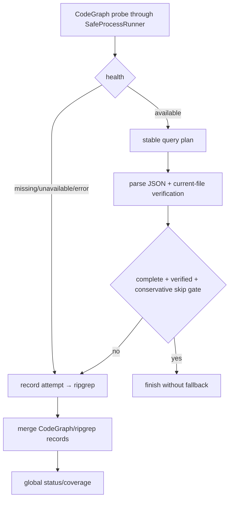

# codegraph-fallback-orchestration 设计

## 0. 术语约定

- **Probe**：`codegraph status --json`，只判断 binary/index capability，不初始化用户仓库。
- **Query plan**：把多 terms/anchors 变成稳定的单 search CLI invocations，并声明未表达 input dimensions。
- **Strategy complete**：CodeGraph 已表达本次请求要求且 query 未截断；有 hit 不自动等于 complete。
- **Fallback**：RipgrepBackend 的显式 second attempt，必须进入 `coverage.backends` 与 `fallbackChecked`。
- **Observed baseline**：设计审查时本机 CodeGraph 1.1.6，本 repo 无 `.codegraph/`；实现 acceptance 必须重新记录实际版本。
- **权威输入**：draft requirement + 已批准 roadmap 4.1-4.3、4.6-4.7。

## 1. 决策与约束

### 需求摘要

把 CodeGraph 作为可选结构化 primary backend 接入同一 Evidence Engine：使用 F2 SafeProcessRunner 执行 status/query JSON，按明确 query plan 发现 symbol/file 候选，经 RepositoryReader 当前文件核验；binary/index 缺失、query no-result/failed/incomplete、hit 未核验或 input 维度无法表达时，按状态表运行 ripgrep fallback，不把 backend failure 伪装成 no_result。

### 复杂度档位

兼容严格档位。机器 JSON 的 required fields fail closed、additional fields forward-compatible；stderr/ANSI 文本仅诊断，不参与 production contract。真实 indexed temp repo smoke 是 core evidence。

### 关键决策

- CodeGraphBackend 始终存在于 `[codegraph, ripgrep]` collection 首位；binary 缺失通过 probe 记录 unavailable，不从集合静默消失。
- status/query 全部穿过 SafeProcessRunner，使用 argv/cwd、受控 env、同一 AbortSignal 与 stdout/stderr caps；late results 不接纳。
- 只解析 `status --json` 与 `query --json` stdout；`explore/node` 人类文本和 stderr 不作为 schema。
- Query plan 先处理 explicit symbol anchors，再处理 identifier-like terms；每个 entry 单独调用一个 `<search>`，按 input stable order 去重并共享 total maxHits。
- CodeGraph 不表达 negative terms、layers、file/table/route/term anchors 或可靠 per-term case；这些维度由 engine verification/filter 处理，并通常使 strategy incomplete、强制 ripgrep。
- 只有“显式 symbol-anchor-only intent”满足保守 skip 条件时可不跑 ripgrep；其他 CodeGraph success 也运行 fallback，优先保证 source-of-truth 可靠性。
- `SECONDARY_BACKEND_HIT` 的唯一 predicate 与 F5 共用：CodeGraph primary 已尝试，但某已核验 record 仅由 ripgrep secondary 发现且无更高 candidate/confirmed reason时生成；primary-only 不生成，primary+secondary merged 只合并 provenance也不生成。

### Query plan contract

1. entries：normalized `kind=symbol` anchors 按 input order；再加入匹配 schema v1 单 identifier grammar `^(?:[$_]|\p{ID_Start})(?:[$_\u200C\u200D]|\p{ID_Continue})*$`（Unicode mode）的 NFKC terms，按 `(value,caseSensitive)` 去重。
2. 不把多个 terms 拼接为一个 search string；每 invocation 使用 `codegraph query --json --path <root> --limit <remaining> <entry.value>` 等价 argv。
3. returned symbol 必须按 entry case metadata 在 engine merge 前比较；CodeGraph CLI 无法承诺 insensitive discovery completeness，因此 insensitive entry 标记 plan incomplete。
4. `maxHits` 是所有 invocation 的 total budget；每次传 positive remaining。remaining=0 时不再启动 CLI invocation，并把未执行 entry 记为 plan incomplete；返回达到 limit 或 entry 未执行使 `complete=false`。
5. file/table/route/term anchors、negativeTerms、non-identifier literal terms、layer filtering 不进入 query string；engine 后过滤，但任一存在都使 CodeGraph 不足以独立完成策略。
6. 保守 skip-ripgrep 条件必须全部满足：至少一个 explicit symbol anchor；所有 terms 与该 anchor exact-normalized 等价；无其他 anchors/negativeTerms/layers；entries 全执行、case-sensitive、未达 limit；已核验 explicit symbol implementation/definition confirmed；无 verification failure。

### Probe/query/fallback truth table

| 观察 | BackendHealth/Attempt | Engine 动作/最终约束 |
|---|---|---|
| executable spawn error | unavailable / `CODEGRAPH_UNAVAILABLE` | 运行 ripgrep；indexState=unavailable |
| status exit 0 + valid JSON `initialized:false` | missing / `CODEGRAPH_INDEX_MISSING` | 运行 ripgrep；indexState=missing |
| status nonzero、malformed JSON、required field wrong/missing | error / `BACKEND_PROCESS_FAILED` | 运行 ripgrep；indexState=error |
| status valid initialized true | available，记录 version/stale flag | 执行 query plan |
| query valid、zero hits、complete | used / `CODEGRAPH_NO_RESULT` | 运行 ripgrep |
| query spawn/nonzero/malformed required JSON | failed / `BACKEND_PROCESS_FAILED` | 运行 ripgrep |
| query 被 caller/global signal abort | failed / `BACKEND_ABORTED` | 立即终止整轮，不启动 fallback |
| CodeGraph process-local timeout/failure，但 global signal 未 abort且仍有总预算 | failed / `BACKEND_ABORTED` 或 `BACKEND_PROCESS_FAILED` | 记录 attempt 后允许 ripgrep fallback |
| query hits 但 current-file verification 全失败 | used + `UNVERIFIED_FILE_CONTENT` | 运行 ripgrep |
| query hits verified 但 plan incomplete/limit reached | used, complete=false | 运行 ripgrep；最终通常 partial 或由 fallback 补全 |
| verified explicit-symbol evidence + 保守 skip 条件全满足 | used, complete=true | 可跳过 ripgrep；fallbackChecked=false |
| fallback 完成且有足够 verified evidence | 两 attempts 可见 | ok/partial 由全局 limits；fallbackChecked=true |
| 两 backend 都 unavailable/failed 且无 evidence | 两 attempts 可见 | backend_unavailable，不得 no_result |

最终 LocateStatus 仍由 Evidence Engine 按 roadmap 4.1 全局表裁决，adapter 不自行返回 status。

**CodeGraph 1.1.6 freshness mapping**：

- `initialized` 与 `version` 是 status JSON required fields；`initialized=false` 时 `indexState=missing`、`indexFreshness=not-applicable`。
- observed 1.1.6 initialized payload 的 freshness fields 为 `lastIndexed`、`pendingChanges.{added,modified,removed}`、`worktreeMismatch`、`index.reindexRecommended`。任一 pending count >0、worktreeMismatch 非 null 或 reindexRecommended=true 时 `possibleStaleIndex=true`、`indexFreshness=possibly-stale`。
- initialized=true 且上述信号全部 clean 时仍返回 `indexFreshness=unknown`，因为 status 与随后 filesystem read 之间存在竞态；不伪造 fresh。
- future/unknown version 若缺 freshness optional fields，health 可保持 available，但 `possibleStaleIndex` 省略、freshness=unknown；required `initialized/version` 或决定 query hits 的 fields wrong/missing 才 fail closed。

### 明确不做

- 不初始化、更新或删除用户目标仓库的 CodeGraph index。
- 不解析 `codegraph explore/node` 或 stderr 人类文本，不实现 callers/impact。
- 不把 symbol query 当作 literal source completeness；有 hit 不自动跳过 ripgrep。
- 不把 binary missing 通过 provider omission 隐藏。

### 基线、依赖、风险与交付物

- 基线 commit：`04b04f7a1314f322e82157363ced505e2199cfc8`。
- 前置：F3 accepted 的 ripgrep/merge/status baseline；F2 process/reader safety。
- Top 3 风险：CLI JSON/version 漂移、CodeGraph semantic coverage 被高估、temp index 污染。分别由 versioned fixtures+live smoke、保守 completeness gate、temp-only cleanup 阻断。
- 非显然依赖：当前 observed binary 1.1.6 可能变化；实现时 runtime probe/`--help` 记录实际 argv capability。
- 交付物：CodeGraphBackend/query planner、versioned schemas/fixtures、engine fallback policy、transition matrix tests、indexed synthetic smoke record、temp cleanup evidence。
- 清洁度：禁止临时 stdout/debug、无来源 TODO/FIXME、注释掉代码、死 import；ANSI stderr 不进入 protocol values。

## 2. 名词与编排

### 2.1 名词层

**现状**：backend collection 只有 RipgrepBackend；Evidence Engine 已实现 current-file verification、merge、classification 和 ripgrep-only statuses。

**变化**：

```ts
interface CodeGraphQueryPlan {
  readonly entries: readonly {
    readonly value: string;
    readonly caseSensitive: boolean;
    readonly source: 'symbol-anchor' | 'term';
  }[];
  readonly unsupportedDimensions: readonly string[];
  readonly canSkipFallbackIfVerified: boolean;
}
```

- `BackendHealth` 按上述 deterministic mapping 生成 available/missing/unavailable/error、version、indexFound、possibleStaleIndex 与 reasonCode。
- CodeGraph parser 对 additional JSON fields 宽容；决定 initialized/hits/file/symbol/lines/complete 的 required field 缺失或 wrong type 则 fail closed。
- backend attempt order 固定 codegraph → ripgrep；coverage 不随 provider availability 改变顺序。
- CodeGraph hit 仍只是 discovery；reader verification 和 canonical symbol case comparison 后才能 merge。

**Module/interface 检查**：adapter 隐藏 CLI version/argv/JSON；query planner 显式暴露 strategy completeness；engine orchestration owns fallback/coverage/status，SafeProcessRunner owns process safety。测试分别用 versioned parser fixtures、fake backend transitions 和真实 temp index。

### 2.2 编排层



- abort/deadline 在 probe/query/fallback 共用同一 signal；deadline 后不得开始新 invocation。
- unknown JSON shape 视为 failed attempt 并 fallback，不临时新增 reason code。
- provenance 三格：primary-only 无 secondary reason；secondary-only 且 primary attempted 可产生 `SECONDARY_BACKEND_HIT`；primary+secondary merged 只合并 provenance、无该 reason；三格都不生成第二个 public evidence。

### 2.3 挂载点清单

- `RepositoryBackendsModule`：固定 collection 改为 `[CodeGraphBackend, RipgrepBackend]`，CodeGraph binary 可 unavailable 但 provider 不消失。
- Evidence Engine fallback policy：消费 query-plan completeness/attempt/result，决定是否运行 ripgrep。
- CodeGraph compatibility fixtures + temp indexed smoke：adapter 的版本边界验证入口。

### 2.4 推进策略

1. **probe/parser contract**：available/missing/unavailable/error/stale 与 malformed/additional-field cases 映射稳定。
   验证：`npm test -- --group codegraph-probe --group codegraph-parser`
2. **query planner**：多 anchors/terms、case、unsupported dimensions、budget/dedup/complete 与 argv snapshot 通过。
   验证：`npm test -- --group codegraph-query-plan`
3. **fallback orchestration**：truth table 全行、global-abort no-fallback、process-local-timeout fallback、hit-unverified fallback、保守 no-fallback、三格 provenance 与 final status cases 通过。
   验证：`npm run test:golden -- --case codegraph-missing --case codegraph-no-result --case codegraph-failed --case codegraph-incomplete --case codegraph-global-abort-no-fallback --case codegraph-local-timeout-fallback --case codegraph-hit-unverified --case codegraph-symbol-complete-no-fallback --case codegraph-secondary-provenance-table --case backend-unavailable`
4. **真实 indexed smoke**：在 temp synthetic repo 初始化临时 index，成功 query JSON/parser/version/caps/cleanup 通过；禁用/不启动 watcher/daemon，并在结束后断言无遗留 child/daemon，不触碰工作 repo。
   验证：`npm test -- --group codegraph-live-smoke --case indexed-temp-repo`

### 2.5 结构健康度与微重构

##### 评估

- 文件级：不搬 RipgrepBackend；CodeGraph adapter、query planner、engine fallback policy 分离。
- 目录级：CLI parser/fixtures 属 repository infrastructure；global status policy 留在 Evidence Engine。
- Compound：未发现既有目录 convention。

##### 结论：不做微重构

通过 backend collection 和 engine policy 两个既有 seam 挂载。

## 3. 验收契约

### 3.1 关键场景

- binary missing、index missing、status nonzero/malformed、stale/unknown fields 映射唯一 health/indexState/reason。
- 多 symbol anchors/identifier terms 生成稳定单参数 invocations；unsupported/case-insensitive dimensions 标记 incomplete 并 fallback。
- CodeGraph no-result、非 global-abort 的 process failure/local timeout、incomplete、hit-unverified 在剩余全局预算内运行 ripgrep；caller/global abort 立即结束且 ripgrep invocation=0。两 backend 失败无 evidence 返回 backend_unavailable。
- 只有保守 symbol-anchor-only gate 全满足时 `fallbackChecked=false`；其余 success 也显式记录 ripgrep attempt。
- primary-only/secondary-only/merged provenance 三格与 F5 truth table 一致，reason/public evidence count 可判定。
- temp synthetic repo 真实初始化 index并成功 query；version/argv/stdout JSON/stderr/process/cleanup 留 artifact，无 watcher/daemon/child 残留，工作 repo 无 `.codegraph/` 变化。

### 3.2 明确不做的反向核对

- production 不得调用 index init/update/delete，不解析 human text/stderr，不实现 callers/impact。
- CodeGraph provider 不得因 binary missing 从 collection 消失。
- CodeGraph hit 不得绕过 reader verification、classification 或 candidate mutual exclusion。

### 3.3 Acceptance Coverage Matrix

| Scenario | Covered By Step | Evidence Type | Command / Action | Core? |
|---|---|---|---|---|
| probe/parser/version compatibility | S1 | table unit + JSON fixtures | probe/parser groups | yes |
| multi-input query plan/completeness/budget | S2 | unit + argv snapshots | query-plan group | yes |
| transition/global-abort/local-timeout/fallback/skip/provenance/coverage/status | S3 | Golden fake-adapter faults | ten named cases | yes |
| real success JSON + temp index cleanup | S4 | real binary integration artifact | indexed-temp-repo | yes |

### 3.4 DoD Contract

| ID | 要求 | 证据 | 阻塞级别 |
|---|---|---|---|
| DOD-DESIGN-001 | design/checklist/review 完整并获 owner 批准 | design review | blocking |
| DOD-IMPL-001 | adapter/planner/policy/fixtures/smoke 完成 | checklist/diff/logs | blocking |
| DOD-REVIEW-001 | code review passed，重点审 completeness 与 target-index 禁令 | review report | blocking |
| DOD-QA-001 | fake transitions + real indexed temp smoke 运行 | QA report | blocking |
| DOD-ACCEPT-001 | acceptance 记录 observed version/JSON/support boundary | acceptance | blocking |

Validation Commands:

| ID | 命令 | 目的 | 核心性 | 失败处理 |
|---|---|---|---|---|
| CMD-BUILD | `npm run build` | 编译 | core | fix-or-block |
| CMD-TYPECHECK | `npm run typecheck` | strict 类型检查 | core | fix-or-block |
| CMD-PARSER | `npm test -- --group codegraph-probe --group codegraph-parser` | probe/JSON compatibility | core | fix-or-block |
| CMD-PLAN | `npm test -- --group codegraph-query-plan` | query semantics | core | fix-or-block |
| CMD-FALLBACK | `npm run test:golden -- --case codegraph-missing --case codegraph-no-result --case codegraph-failed --case codegraph-incomplete --case codegraph-global-abort-no-fallback --case codegraph-local-timeout-fallback --case codegraph-hit-unverified --case codegraph-symbol-complete-no-fallback --case codegraph-secondary-provenance-table --case backend-unavailable` | transition/abort/skip/provenance matrix | core | fix-or-block |
| CMD-SMOKE | `npm test -- --group codegraph-live-smoke --case indexed-temp-repo` | real binary success/cleanup | core | fix-or-block |

Required Artifacts: design-review、query-plan/transition tables、versioned JSON fixtures、argv snapshots、Golden manifests、live smoke record、temp cleanup evidence、command logs、review、QA、acceptance。

## 4. 与项目级架构文档的关系

Acceptance 回填 CodeGraph adapter、query planner、backend collection 和 fallback ownership。保守 completeness gate 与 temp-only index policy 属跨版本长期约束，建议 ADR。
