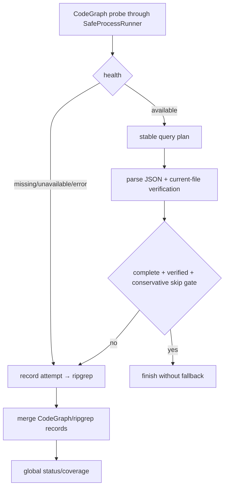

# CodeStable Code Quality Review Packet

- root: `D:/Personal/repo-nav-worktrees/repo-nav-mvp`
- unit: `.codestable/features/2026-07-10-codegraph-fallback-orchestration`
- stage: `quality`

## Reviewer Mission

Check whether the code is clean, tested, maintainable, secure, and robust under real project conditions.

## Stage Focus

maintainability, readability, coupling, security, edge cases, test gaps, performance, idempotency, crash-resume behavior, and deterministic boundaries

## Reviewer Output Contract

- Lead with findings, ordered by severity.
- Include severity (`P0`/`P1`/`P2`/`P3`) and confidence for each finding.
- Reference concrete files, code, docs, or validation evidence when possible.
- If there are no blocking findings, say so explicitly and list residual risks or test gaps.

## Unit Documents
### `.codestable/features/2026-07-10-codegraph-fallback-orchestration/codegraph-fallback-orchestration-checklist.yaml`

```
feature: 2026-07-10-codegraph-fallback-orchestration
created: '2026-07-10'
steps:
- id: S1
  action: 实现 CodeGraph probe 与 versioned JSON parser
  exit_signal: available/missing/unavailable/error/stale/malformed/additional-field cases 映射唯一且 fail closed
  verification: npm test -- --group codegraph-probe --group codegraph-parser
  artifacts: [CodeGraphBackend, versioned JSON fixtures, health mapping report]
  status: done
- id: S2
  action: 实现多输入 query planner 与 completeness contract
  exit_signal: Unicode identifier grammar、stable entries/argv/case/unsupported dimensions/maxHits/remaining=0/dedup/complete 全部可判定
  verification: npm test -- --group codegraph-query-plan
  artifacts: [CodeGraphQueryPlan, argv snapshots]
  status: done
- id: S3
  action: 实现 Evidence Engine fallback orchestration
  exit_signal: truth table 的 global-abort/no-fallback、local-timeout/fallback、attempt/hit-unverified/skip/provenance三格/final status 路径经 Golden cases 通过
  verification: npm run test:golden -- --case codegraph-missing --case codegraph-no-result --case codegraph-failed --case codegraph-incomplete --case codegraph-global-abort-no-fallback --case codegraph-local-timeout-fallback --case codegraph-hit-unverified --case codegraph-symbol-complete-no-fallback --case codegraph-secondary-provenance-table --case backend-unavailable
  artifacts: [fallback policy, transition fixtures, coverage snapshots]
  status: done
- id: S4
  action: 验证真实 indexed temp-repo CodeGraph success path
  exit_signal: 锁定版本的 probe/query JSON 可解析，temp index/child/daemon 全清理且工作 repo 未被初始化
  verification: npm test -- --group codegraph-live-smoke --case indexed-temp-repo
  artifacts: [live smoke record, version/capability log, cleanup evidence]
  status: done
checks:
- id: C1
  item: CodeGraph provider 始终位于 backend collection 首位，binary missing 不静默移除
  source: design 1/2.3
  status: pending
- id: C2
  item: status/query 全部穿过 F2 SafeProcessRunner 与同一 AbortSignal/caps
  source: design 1/2.2
  status: pending
- id: C3
  item: probe/query observations 与 1.1.6 pendingChanges/worktreeMismatch/reindex freshness 按 truth table 唯一映射
  source: design 1 truth table
  status: pending
- id: C4
  item: Unicode identifier grammar 决定 eligible term；每项生成单 search argv，共享 total maxHits且remaining=0不 spawn
  source: design 1 query plan
  status: pending
- id: C5
  item: unsupported dimensions/case-insensitive/limit 明确使 strategy incomplete
  source: design 1 query plan
  status: pending
- id: C6
  item: 只有保守 explicit-symbol gate 可跳过 ripgrep
  source: design 1/3.1
  status: pending
- id: C7
  item: non-global process failure/local timeout/incomplete/unverified 在预算内 fallback；caller/global abort 不启动 ripgrep
  source: design 1 truth table
  status: pending
- id: C8
  item: primary-only无secondary reason、secondary-only可生成、merged只合并provenance，均不生成第二个 public evidence
  source: design 1/2.2
  status: pending
- id: C9
  item: parser additional fields 宽容，required fields missing/wrong type fail closed
  source: design 2.1
  status: pending
- id: C10
  item: temp synthetic repo 覆盖成功 query JSON，结束后无 child/daemon/index 残留且工作 repo 无 mutation
  source: design 2.4/3.1
  status: pending
- id: C11
  item: 不解析 explore/node/stderr text，不实现 callers/impact
  source: design 1/3.2
  status: pending
- id: C12
  item: query/transition/version/smoke/cleanup artifacts 可盘点
  source: design 3.4
  status: pending
dod:
  commands:
  - id: CMD-BUILD
    command: npm run build
    core: true
    failure_handling: fix-or-block
  - id: CMD-TYPECHECK
    command: npm run typecheck
    core: true
    failure_handling: fix-or-block
  - id: CMD-PARSER
    command: npm test -- --group codegraph-probe --group codegraph-parser
    core: true
    failure_handling: fix-or-block
  - id: CMD-PLAN
    command: npm test -- --group codegraph-query-plan
    core: true
    failure_handling: fix-or-block
  - id: CMD-FALLBACK
    command: npm run test:golden -- --case codegraph-missing --case codegraph-no-result --case codegraph-failed --case codegraph-incomplete --case codegraph-global-abort-no-fallback --case codegraph-local-timeout-fallback --case codegraph-hit-unverified --case codegraph-symbol-complete-no-fallback --case codegraph-secondary-provenance-table --case backend-unavailable
    core: true
    failure_handling: fix-or-block
  - id: CMD-SMOKE
    command: npm test -- --group codegraph-live-smoke --case indexed-temp-repo
    core: true
    failure_handling: fix-or-block
  evidence_required: [command_output, diff_summary, artifact_inventory, transition_table, live_smoke_record]
  cleanliness:
    debug_output: forbidden
    temporary_todo_fixme: forbidden
    commented_out_code: forbidden
    unused_imports: forbidden
```

### `.codestable/features/2026-07-10-codegraph-fallback-orchestration/codegraph-fallback-orchestration-design-review.md`

```
---
doc_type: feature-design-review
feature: 2026-07-10-codegraph-fallback-orchestration
status: passed
reviewed: 2026-07-10
round: 5
---

# codegraph-fallback-orchestration feature design 审查报告

## 1. Scope And Inputs

- Design：`.codestable/features/2026-07-10-codegraph-fallback-orchestration/codegraph-fallback-orchestration-design.md`
- Checklist：`.codestable/features/2026-07-10-codegraph-fallback-orchestration/codegraph-fallback-orchestration-checklist.yaml`
- Roadmap：`.codestable/roadmap/repo-nav-mvp/repo-nav-mvp-roadmap.md`
- Requirement：`.codestable/requirements/source-of-truth-evidence.md`
- Baseline：`04b04f7a1314f322e82157363ced505e2199cfc8`（设计审查时 no-code baseline）

### Independent Review

- Status：completed
- Detection：native-agent
- Provider / agent：`/root/design_review_core_surfaces`
- Raw output：独立只读 reviewer 完成多轮审查；最终 Round 5 无 blocking / important finding
- Merge policy：主 agent 逐条核验 finding、同步 design/checklist、重跑 YAML 与 cross-doc gate 后复审
- Gate effect：none

## 2. Design Summary

- Goal：CodeGraph query plan、freshness、abort/timeout 与 ripgrep fallback。
- Steps：4 条，均有可独立判断的 exit signal。
- Checks：12 条，均能追溯到 design、roadmap contract 或 artifact。
- Baseline / validation：真实 build/typecheck/unit/Golden/MCP/docs 命令已进入 DoD。

## 3. Findings

### blocking

- none

### important

- none

### nit

- none

### suggestion

- 实现若改变 approved interface、status/reason、ordering、failure mode 或验证边界，必须回到 design review。

### learning

- Roadmap 共享协议必须在 feature 中落成 typed seam、可执行错误模式和真实证据入口。

### praise

- 方案边界、negative fixtures、命令与 required artifacts 已形成可证伪闭环。

## 4. User Review Focus

- Owner 已在第二次 roadmap checkpoint 批准本设计。
- Implement 必须遵守 design 的明确不做、清洁度和恢复边界。
- Review / QA / acceptance 必须消费真实 command logs、gate results 与 evidence pack。

## 5. Evidence Confidence Ledger

| Check | Verdict | Evidence Class | Basis | Follow-up |
|---|---|---|---|---|
| Acceptance Coverage Matrix | pass | E+C | 核心场景均映射到 step、命令和证据 | implementation 运行证据 |
| DoD Contract | pass | E | 五阶段 DoD、commands、artifacts 齐全 | none |
| Steps and checks traceability | pass | E | pending 状态和来源明确 | none |
| Roadmap contract compliance | pass | E+C | 未绕开 roadmap 4.x 硬契约 | none |
| Module interface design | pass | E+C | depth、seam、ordering 和 error mode 可执行 | code review |
| Validation and artifacts | pass | E | YAML/cross-doc 与命令入口可核验 | QA |

Summary：E=6，C=3，H=0，H-only core checks=none。

## 6. Residual Risk

- CodeGraph JSON/version 与临时索引清理需真实 binary 验证。
- 设计通过不替代 implementation、code review、QA 和 acceptance 的真实运行证据。

## 7. Verdict

- Status：passed
- Next：design 已由 owner 批准，可进入 goal feature loop。
```

### `.codestable/features/2026-07-10-codegraph-fallback-orchestration/codegraph-fallback-orchestration-design.md`

```
---
doc_type: feature-design
feature: 2026-07-10-codegraph-fallback-orchestration
requirement: source-of-truth-evidence
roadmap: repo-nav-mvp
roadmap_item: codegraph-fallback-orchestration
status: approved
summary: 接入 CodeGraph 结构化 probe/query、显式 query plan 与可观察的 ripgrep fallback 状态机
tags: [codegraph, repo-nav]
---

# codegraph-fallback-orchestration 设计

## 0. 术语约定

- **Probe**：`codegraph status --json`，只判断 binary/index capability，不初始化用户仓库。
- **Query plan**：把多 terms/anchors 变成稳定的单 search CLI invocations，并声明未表达 input dimensions。
- **Strategy complete**：CodeGraph 已表达本次请求要求且 query 未截断；有 hit 不自动等于 complete。
- **Fallback**：RipgrepBackend 的显式 second attempt，必须进入 `coverage.backends` 与 `fallbackChecked`。
- **Observed baseline**：设计审查时本机 CodeGraph 1.1.6，本 repo 无 `.codegraph/`；实现 acceptance 必须重新记录实际版本。
- **权威输入**：draft requirement + 已批准 roadmap 4.1-4.3、4.6-4.7。

## 1. 决策与约束

### 需求摘要

把 CodeGraph 作为可选结构化 primary backend 接入同一 Evidence Engine：使用 F2 SafeProcessRunner 执行 status/query JSON，按明确 query plan 发现 symbol/file 候选，经 RepositoryReader 当前文件核验；binary/index 缺失、query no-result/failed/incomplete、hit 未核验或 input 维度无法表达时，按状态表运行 ripgrep fallback，不把 backend failure 伪装成 no_result。

### 复杂度档位

兼容严格档位。机器 JSON 的 required fields fail closed、additional fields forward-compatible；stderr/ANSI 文本仅诊断，不参与 production contract。真实 indexed temp repo smoke 是 core evidence。

### 关键决策

- CodeGraphBackend 始终存在于 `[codegraph, ripgrep]` collection 首位；binary 缺失通过 probe 记录 unavailable，不从集合静默消失。
- status/query 全部穿过 SafeProcessRunner，使用 argv/cwd、受控 env、同一 AbortSignal 与 stdout/stderr caps；late results 不接纳。
- 只解析 `status --json` 与 `query --json` stdout；`explore/node` 人类文本和 stderr 不作为 schema。
- Query plan 先处理 explicit symbol anchors，再处理 identifier-like terms；每个 entry 单独调用一个 `<search>`，按 input stable order 去重并共享 total maxHits。
- CodeGraph 不表达 negative terms、layers、file/table/route/term anchors 或可靠 per-term case；这些维度由 engine verification/filter 处理，并通常使 strategy incomplete、强制 ripgrep。
- 只有“显式 symbol-anchor-only intent”满足保守 skip 条件时可不跑 ripgrep；其他 CodeGraph success 也运行 fallback，优先保证 source-of-truth 可靠性。
- `SECONDARY_BACKEND_HIT` 的唯一 predicate 与 F5 共用：CodeGraph primary 已尝试，但某已核验 record 仅由 ripgrep secondary 发现且无更高 candidate/confirmed reason时生成；primary-only 不生成，primary+secondary merged 只合并 provenance也不生成。

### Query plan contract

1. entries：normalized `kind=symbol` anchors 按 input order；再加入匹配 schema v1 单 identifier grammar `^(?:[$_]|\p{ID_Start})(?:[$_\u200C\u200D]|\p{ID_Continue})*$`（Unicode mode）的 NFKC terms，按 `(value,caseSensitive)` 去重。
2. 不把多个 terms 拼接为一个 search string；每 invocation 使用 `codegraph query --json --path <root> --limit <remaining> <entry.value>` 等价 argv。
3. returned symbol 必须按 entry case metadata 在 engine merge 前比较；CodeGraph CLI 无法承诺 insensitive discovery completeness，因此 insensitive entry 标记 plan incomplete。
4. `maxHits` 是所有 invocation 的 total budget；每次传 positive remaining。remaining=0 时不再启动 CLI invocation，并把未执行 entry 记为 plan incomplete；返回达到 limit 或 entry 未执行使 `complete=false`。
5. file/table/route/term anchors、negativeTerms、non-identifier literal terms、layer filtering 不进入 query string；engine 后过滤，但任一存在都使 CodeGraph 不足以独立完成策略。
6. 保守 skip-ripgrep 条件必须全部满足：至少一个 explicit symbol anchor；所有 terms 与该 anchor exact-normalized 等价；无其他 anchors/negativeTerms/layers；entries 全执行、case-sensitive、未达 limit；已核验 explicit symbol implementation/definition confirmed；无 verification failure。

### Probe/query/fallback truth table

| 观察 | BackendHealth/Attempt | Engine 动作/最终约束 |
|---|---|---|
| executable spawn error | unavailable / `CODEGRAPH_UNAVAILABLE` | 运行 ripgrep；indexState=unavailable |
| status exit 0 + valid JSON `initialized:false` | missing / `CODEGRAPH_INDEX_MISSING` | 运行 ripgrep；indexState=missing |
| status nonzero、malformed JSON、required field wrong/missing | error / `BACKEND_PROCESS_FAILED` | 运行 ripgrep；indexState=error |
| status valid initialized true | available，记录 version/stale flag | 执行 query plan |
| query valid、zero hits、complete | used / `CODEGRAPH_NO_RESULT` | 运行 ripgrep |
| query spawn/nonzero/malformed required JSON | failed / `BACKEND_PROCESS_FAILED` | 运行 ripgrep |
| query 被 caller/global signal abort | failed / `BACKEND_ABORTED` | 立即终止整轮，不启动 fallback |
| CodeGraph process-local timeout/failure，但 global signal 未 abort且仍有总预算 | failed / `BACKEND_ABORTED` 或 `BACKEND_PROCESS_FAILED` | 记录 attempt 后允许 ripgrep fallback |
| query hits 但 current-file verification 全失败 | used + `UNVERIFIED_FILE_CONTENT` | 运行 ripgrep |
| query hits verified 但 plan incomplete/limit reached | used, complete=false | 运行 ripgrep；最终通常 partial 或由 fallback 补全 |
| verified explicit-symbol evidence + 保守 skip 条件全满足 | used, complete=true | 可跳过 ripgrep；fallbackChecked=false |
| fallback 完成且有足够 verified evidence | 两 attempts 可见 | ok/partial 由全局 limits；fallbackChecked=true |
| 两 backend 都 unavailable/failed 且无 evidence | 两 attempts 可见 | backend_unavailable，不得 no_result |

最终 LocateStatus 仍由 Evidence Engine 按 roadmap 4.1 全局表裁决，adapter 不自行返回 status。

**CodeGraph 1.1.6 freshness mapping**：

- `initialized` 与 `version` 是 status JSON required fields；`initialized=false` 时 `indexState=missing`、`indexFreshness=not-applicable`。
- observed 1.1.6 initialized payload 的 freshness fields 为 `lastIndexed`、`pendingChanges.{added,modified,removed}`、`worktreeMismatch`、`index.reindexRecommended`。任一 pending count >0、worktreeMismatch 非 null 或 reindexRecommended=true 时 `possibleStaleIndex=true`、`indexFreshness=possibly-stale`。
- initialized=true 且上述信号全部 clean 时仍返回 `indexFreshness=unknown`，因为 status 与随后 filesystem read 之间存在竞态；不伪造 fresh。
- future/unknown version 若缺 freshness optional fields，health 可保持 available，但 `possibleStaleIndex` 省略、freshness=unknown；required `initialized/version` 或决定 query hits 的 fields wrong/missing 才 fail closed。

### 明确不做

- 不初始化、更新或删除用户目标仓库的 CodeGraph index。
- 不解析 `codegraph explore/node` 或 stderr 人类文本，不实现 callers/impact。
- 不把 symbol query 当作 literal source completeness；有 hit 不自动跳过 ripgrep。
- 不把 binary missing 通过 provider omission 隐藏。

### 基线、依赖、风险与交付物

- 基线 commit：`04b04f7a1314f322e82157363ced505e2199cfc8`。
- 前置：F3 accepted 的 ripgrep/merge/status baseline；F2 process/reader safety。
- Top 3 风险：CLI JSON/version 漂移、CodeGraph semantic coverage 被高估、temp index 污染。分别由 versioned fixtures+live smoke、保守 completeness gate、temp-only cleanup 阻断。
- 非显然依赖：当前 observed binary 1.1.6 可能变化；实现时 runtime probe/`--help` 记录实际 argv capability。
- 交付物：CodeGraphBackend/query planner、versioned schemas/fixtures、engine fallback policy、transition matrix tests、indexed synthetic smoke record、temp cleanup evidence。
- 清洁度：禁止临时 stdout/debug、无来源 TODO/FIXME、注释掉代码、死 import；ANSI stderr 不进入 protocol values。

## 2. 名词与编排

### 2.1 名词层

**现状**：backend collection 只有 RipgrepBackend；Evidence Engine 已实现 current-file verification、merge、classification 和 ripgrep-only statuses。

**变化**：

```ts
interface CodeGraphQueryPlan {
  readonly entries: readonly {
    readonly value: string;
    readonly caseSensitive: boolean;
    readonly source: 'symbol-anchor' | 'term';
  }[];
  readonly unsupportedDimensions: readonly string[];
  readonly canSkipFallbackIfVerified: boolean;
}
```

- `BackendHealth` 按上述 deterministic mapping 生成 available/missing/unavailable/error、version、indexFound、possibleStaleIndex 与 reasonCode。
- CodeGraph parser 对 additional JSON fields 宽容；决定 initialized/hits/file/symbol/lines/complete 的 required field 缺失或 wrong type 则 fail closed。
- backend attempt order 固定 codegraph → ripgrep；coverage 不随 provider availability 改变顺序。
- CodeGraph hit 仍只是 discovery；reader verification 和 canonical symbol case comparison 后才能 merge。

**Module/interface 检查**：adapter 隐藏 CLI version/argv/JSON；query planner 显式暴露 strategy completeness；engine orchestration owns fallback/coverage/status，SafeProcessRunner owns process safety。测试分别用 versioned parser fixtures、fake backend transitions 和真实 temp index。

### 2.2 编排层



- abort/deadline 在 probe/query/fallback 共用同一 signal；deadline 后不得开始新 invocation。
- unknown JSON shape 视为 failed attempt 并 fallback，不临时新增 reason code。
- provenance 三格：primary-only 无 secondary reason；secondary-only 且 primary attempted 可产生 `SECONDARY_BACKEND_HIT`；primary+secondary merged 只合并 provenance、无该 reason；三格都不生成第二个 public evidence。

### 2.3 挂载点清单

- `RepositoryBackendsModule`：固定 collection 改为 `[CodeGraphBackend, RipgrepBackend]`，CodeGraph binary 可 unavailable 但 provider 不消失。
- Evidence Engine fallback policy：消费 query-plan completeness/attempt/result，决定是否运行 ripgrep。
- CodeGraph compatibility fixtures + temp indexed smoke：adapter 的版本边界验证入口。

### 2.4 推进策略

1. **probe/parser contract**：available/missing/unavailable/error/stale 与 malformed/additional-field cases 映射稳定。
   验证：`npm test -- --group codegraph-probe --group codegraph-parser`
2. **query planner**：多 anchors/terms、case、unsupported dimensions、budget/dedup/complete 与 argv snapshot 通过。
   验证：`npm test -- --group codegraph-query-plan`
3. **fallback orchestration**：truth table 全行、global-abort no-fallback、process-local-timeout fallback、hit-unverified fallback、保守 no-fallback、三格 provenance 与 final status cases 通过。
   验证：`npm run test:golden -- --case codegraph-missing --case codegraph-no-result --case codegraph-failed --case codegraph-incomplete --case codegraph-global-abort-no-fallback --case codegraph-local-timeout-fallback --case codegraph-hit-unverified --case codegraph-symbol-complete-no-fallback --case codegraph-secondary-provenance-table --case backend-unavailable`
4. **真实 indexed smoke**：在 temp synthetic repo 初始化临时 index，成功 query JSON/parser/version/caps/cleanup 通过；禁用/不启动 watcher/daemon，并在结束后断言无遗留 child/daemon，不触碰工作 repo。
   验证：`npm test -- --group codegraph-live-smoke --case indexed-temp-repo`

### 2.5 结构健康度与微重构

##### 评估

- 文件级：不搬 RipgrepBackend；CodeGraph adapter、query planner、engine fallback policy 分离。
- 目录级：CLI parser/fixtures 属 repository infrastructure；global status policy 留在 Evidence Engine。
- Compound：未发现既有目录 convention。

##### 结论：不做微重构

通过 backend collection 和 engine policy 两个既有 seam 挂载。

## 3. 验收契约

### 3.1 关键场景

- binary missing、index missing、status nonzero/malformed、stale/unknown fields 映射唯一 health/indexState/reason。
- 多 symbol anchors/identifier terms 生成稳定单参数 invocations；unsupported/case-insensitive dimensions 标记 incomplete 并 fallback。
- CodeGraph no-result、非 global-abort 的 process failure/local timeout、incomplete、hit-unverified 在剩余全局预算内运行 ripgrep；caller/global abort 立即结束且 ripgrep invocation=0。两 backend 失败无 evidence 返回 backend_unavailable。
- 只有保守 symbol-anchor-only gate 全满足时 `fallbackChecked=false`；其余 success 也显式记录 ripgrep attempt。
- primary-only/secondary-only/merged provenance 三格与 F5 truth table 一致，reason/public evidence count 可判定。
- temp synthetic repo 真实初始化 index并成功 query；version/argv/stdout JSON/stderr/process/cleanup 留 artifact，无 watcher/daemon/child 残留，工作 repo 无 `.codegraph/` 变化。

### 3.2 明确不做的反向核对

- production 不得调用 index init/update/delete，不解析 human text/stderr，不实现 callers/impact。
- CodeGraph provider 不得因 binary missing 从 collection 消失。
- CodeGraph hit 不得绕过 reader verification、classification 或 candidate mutual exclusion。

### 3.3 Acceptance Coverage Matrix

| Scenario | Covered By Step | Evidence Type | Command / Action | Core? |
|---|---|---|---|---|
| probe/parser/version compatibility | S1 | table unit + JSON fixtures | probe/parser groups | yes |
| multi-input query plan/completeness/budget | S2 | unit + argv snapshots | query-plan group | yes |
| transition/global-abort/local-timeout/fallback/skip/provenance/coverage/status | S3 | Golden fake-adapter faults | ten named cases | yes |
| real success JSON + temp index cleanup | S4 | real binary integration artifact | indexed-temp-repo | yes |

### 3.4 DoD Contract

| ID | 要求 | 证据 | 阻塞级别 |
|---|---|---|---|
| DOD-DESIGN-001 | design/checklist/review 完整并获 owner 批准 | design review | blocking |
| DOD-IMPL-001 | adapter/planner/policy/fixtures/smoke 完成 | checklist/diff/logs | blocking |
| DOD-REVIEW-001 | code review passed，重点审 completeness 与 target-index 禁令 | review report | blocking |
| DOD-QA-001 | fake transitions + real indexed temp smoke 运行 | QA report | blocking |
| DOD-ACCEPT-001 | acceptance 记录 observed version/JSON/support boundary | acceptance | blocking |

Validation Commands:

| ID | 命令 | 目的 | 核心性 | 失败处理 |
|---|---|---|---|---|
| CMD-BUILD | `npm run build` | 编译 | core | fix-or-block |
| CMD-TYPECHECK | `npm run typecheck` | strict 类型检查 | core | fix-or-block |
| CMD-PARSER | `npm test -- --group codegraph-probe --group codegraph-parser` | probe/JSON compatibility | core | fix-or-block |
| CMD-PLAN | `npm test -- --group codegraph-query-plan` | query semantics | core | fix-or-block |
| CMD-FALLBACK | `npm run test:golden -- --case codegraph-missing --case codegraph-no-result --case codegraph-failed --case codegraph-incomplete --case codegraph-global-abort-no-fallback --case codegraph-local-timeout-fallback --case codegraph-hit-unverified --case codegraph-symbol-complete-no-fallback --case codegraph-secondary-provenance-table --case backend-unavailable` | transition/abort/skip/provenance matrix | core | fix-or-block |
| CMD-SMOKE | `npm test -- --group codegraph-live-smoke --case indexed-temp-repo` | real binary success/cleanup | core | fix-or-block |

Required Artifacts: design-review、query-plan/transition tables、versioned JSON fixtures、argv snapshots、Golden manifests、live smoke record、temp cleanup evidence、command logs、review、QA、acceptance。

## 4. 与项目级架构文档的关系

Acceptance 回填 CodeGraph adapter、query planner、backend collection 和 fallback ownership。保守 completeness gate 与 temp-only index policy 属跨版本长期约束，建议 ADR。
```

### `.codestable/features/2026-07-10-codegraph-fallback-orchestration/codegraph-fallback-orchestration-evidence-pack.md`

```
---
doc_type: feature-evidence-pack
feature: 2026-07-10-codegraph-fallback-orchestration
status: generated
---

# 2026-07-10-codegraph-fallback-orchestration evidence pack

## 1. Scope

- Design: `.codestable/features/2026-07-10-codegraph-fallback-orchestration/codegraph-fallback-orchestration-design.md`
- Checklist: `.codestable/features/2026-07-10-codegraph-fallback-orchestration/codegraph-fallback-orchestration-checklist.yaml`

## 2. DoD Results

```json
{
  "gate_id": "dod-runner",
  "stage": "implementation.before_review",
  "status": "passed",
  "blocking": [],
  "warnings": [],
  "evidence": [
    {
      "command": "npm run build",
      "exit_code": 0,
      "stdout": "\n> repo-nav@0.1.0 build\n> tsc -p tsconfig.build.json\n\n",
      "stderr": "",
      "id": "CMD-BUILD",
      "core": true,
      "failure_handling": "fix-or-block"
    },
    {
      "command": "npm run typecheck",
      "exit_code": 0,
      "stdout": "\n> repo-nav@0.1.0 typecheck\n> tsc -p tsconfig.json --noEmit\n\n",
      "stderr": "",
      "id": "CMD-TYPECHECK",
      "core": true,
      "failure_handling": "fix-or-block"
    },
    {
      "command": "npm test -- --group codegraph-probe --group codegraph-parser",
      "exit_code": 0,
      "stdout": "\n> repo-nav@0.1.0 test\n> tsx testkit/runners/unit-runner.ts --group codegraph-probe --group codegraph-parser\n\n\n RUN  v4.1.10 D:/Personal/repo-nav-worktrees/repo-nav-mvp\n\n ↓ test/unit/scope-gate.spec.ts (2 tests | 2 skipped)\n ↓ test/unit/runner-smoke.spec.ts (1 test | 1 skipped)\n ↓ test/unit/contract.spec.ts (12 tests | 12 skipped)\n ↓ test/unit/evidence-merge.spec.ts (6 tests | 6 skipped)\n ↓ test/unit/direct-mapping-classifier.spec.ts (34 tests | 34 skipped)\n ↓ test/unit/repository-reader.spec.ts (6 tests | 6 skipped)\n ↓ test/unit/safe-process-runner.spec.ts (6 tests | 6 skipped)\n ↓ test/unit/process-cleanup.spec.ts (6 tests | 6 skipped)\n ↓ test/unit/ripgrep-backend.spec.ts (6 tests | 6 skipped)\n ↓ test/unit/codegraph-live-smoke.spec.ts (1 test | 1 skipped)\n ↓ test/unit/codegraph-query-planner.spec.ts (6 tests | 6 skipped)\n ↓ test/unit/repository-safety.spec.ts (5 tests | 5 skipped)\n ✓ test/unit/codegraph-backend.spec.ts (8 tests) 13ms\n ↓ test/unit/candidate-policy.spec.ts (37 tests | 37 skipped)\n ↓ test/unit/di.spec.ts (2 tests | 2 skipped)\n\n Test Files  1 passed | 14 skipped (15)\n      Tests  8 passed | 130 skipped (138)\n   Start at  16:51:41\n   Duration  936ms (transform 1.17s, setup 0ms, import 6.05s, tests 13ms, environment 2ms)\n\n",
      "stderr": "",
      "id": "CMD-PARSER",
      "core": true,
      "failure_handling": "fix-or-block"
    },
    {
      "command": "npm test -- --group codegraph-query-plan",
      "exit_code": 0,
      "stdout": "\n> repo-nav@0.1.0 test\n> tsx testkit/runners/unit-runner.ts --group codegraph-query-plan\n\n\n RUN  v4.1.10 D:/Personal/repo-nav-worktrees/repo-nav-mvp\n\n ↓ test/unit/runner-smoke.spec.ts (1 test | 1 skipped)\n ↓ test/unit/scope-gate.spec.ts (2 tests | 2 skipped)\n ↓ test/unit/contract.spec.ts (12 tests | 12 skipped)\n ↓ test/unit/evidence-merge.spec.ts (6 tests | 6 skipped)\n ↓ test/unit/direct-mapping-classifier.spec.ts (34 tests | 34 skipped)\n ↓ test/unit/repository-reader.spec.ts (6 tests | 6 skipped)\n ↓ test/unit/process-cleanup.spec.ts (6 tests | 6 skipped)\n ↓ test/unit/safe-process-runner.spec.ts (6 tests | 6 skipped)\n ↓ test/unit/codegraph-live-smoke.spec.ts (1 test | 1 skipped)\n ↓ test/unit/codegraph-backend.spec.ts (8 tests | 8 skipped)\n ✓ test/unit/codegraph-query-planner.spec.ts (6 tests) 13ms\n ↓ test/unit/ripgrep-backend.spec.ts (6 tests | 6 skipped)\n ↓ test/unit/repository-safety.spec.ts (5 tests | 5 skipped)\n ↓ test/unit/candidate-policy.spec.ts (37 tests | 37 skipped)\n ↓ test/unit/di.spec.ts (2 tests | 2 skipped)\n\n Test Files  1 passed | 14 skipped (15)\n      Tests  6 passed | 132 skipped (138)\n   Start at  16:51:43\n   Duration  981ms (transform 1.25s, setup 0ms, import 6.42s, tests 13ms, environment 2ms)\n\n",
      "stderr": "",
      "id": "CMD-PLAN",
      "core": true,
      "failure_handling": "fix-or-block"
    },
    {
      "command": "npm run test:golden -- --case codegraph-missing --case codegraph-no-result --case codegraph-failed --case codegraph-incomplete --case codegraph-global-abort-no-fallback --case codegraph-local-timeout-fallback --case codegraph-hit-unverified --case codegraph-symbol-complete-no-fallback --case codegraph-secondary-provenance-table --case backend-unavailable",
      "exit_code": 0,
      "stdout": "\n> repo-nav@0.1.0 test:golden\n> tsx testkit/runners/golden-runner.ts --case codegraph-missing --case codegraph-no-result --case codegraph-failed --case codegraph-incomplete --case codegraph-global-abort-no-fallback --case codegraph-local-timeout-fallback --case codegraph-hit-unverified --case codegraph-symbol-complete-no-fallback --case codegraph-secondary-provenance-table --case backend-unavailable\n\n\n RUN  v4.1.10 D:/Personal/repo-nav-worktrees/repo-nav-mvp\n\n ↓ test/golden/runner-smoke.spec.ts (1 test | 1 skipped)\n ↓ test/golden/golden-contract.spec.ts (5 tests | 5 skipped)\n ↓ test/golden/text-engine-classifier.spec.ts (6 tests | 6 skipped)\n ↓ test/golden/candidate-policy.spec.ts (3 tests | 3 skipped)\n ↓ test/golden/text-evidence-engine.spec.ts (14 tests | 14 skipped)\n ✓ test/golden/codegraph-fallback.spec.ts (11 tests) 89ms\n\n Test Files  1 passed | 5 skipped (6)\n      Tests  11 passed | 29 skipped (40)\n   Start at  16:51:45\n   Duration  791ms (transform 437ms, setup 0ms, import 2.74s, tests 89ms, environment 0ms)\n\n",
      "stderr": "",
      "id": "CMD-FALLBACK",
      "core": true,
      "failure_handling": "fix-or-block"
    },
    {
      "command": "npm test -- --group codegraph-live-smoke --case indexed-temp-repo",
      "exit_code": 0,
      "stdout": "\n> repo-nav@0.1.0 test\n> tsx testkit/runners/unit-runner.ts --group codegraph-live-smoke --case indexed-temp-repo\n\n\n RUN  v4.1.10 D:/Personal/repo-nav-worktrees/repo-nav-mvp\n\n ↓ test/unit/runner-smoke.spec.ts (1 test | 1 skipped)\n ↓ test/unit/scope-gate.spec.ts (2 tests | 2 skipped)\n ↓ test/unit/contract.spec.ts (12 tests | 12 skipped)\n ↓ test/unit/evidence-merge.spec.ts (6 tests | 6 skipped)\n ↓ test/unit/direct-mapping-classifier.spec.ts (34 tests | 34 skipped)\n ↓ test/unit/safe-process-runner.spec.ts (6 tests | 6 skipped)\n ↓ test/unit/repository-reader.spec.ts (6 tests | 6 skipped)\n ↓ test/unit/process-cleanup.spec.ts (6 tests | 6 skipped)\n ↓ test/unit/codegraph-query-planner.spec.ts (6 tests | 6 skipped)\n ↓ test/unit/codegraph-backend.spec.ts (8 tests | 8 skipped)\n ↓ test/unit/ripgrep-backend.spec.ts (6 tests | 6 skipped)\n ↓ test/unit/repository-safety.spec.ts (5 tests | 5 skipped)\n ↓ test/unit/candidate-policy.spec.ts (37 tests | 37 skipped)\n ↓ test/unit/di.spec.ts (2 tests | 2 skipped)\n ✓ test/unit/codegraph-live-smoke.spec.ts (1 test) 4940ms\n     ✓ indexes, probes, queries, and removes only the temporary repository  4938ms\n\n Test Files  1 passed | 14 skipped (15)\n      Tests  1 passed | 137 skipped (138)\n   Start at  16:51:46\n   Duration  5.65s (transform 1.24s, setup 0ms, import 6.17s, tests 4.94s, environment 2ms)\n\n",
      "stderr": "",
      "id": "CMD-SMOKE",
      "core": true,
      "failure_handling": "fix-or-block"
    }
  ],
  "providers": {}
}
```

## 3. Validation Commands

Extracted from checklist `dod.commands`; see DoD Results for command status.

## 4. Scope And Cleanliness

Design bytes: 13902
Checklist bytes: 4681

## 5. Residual Risks

- none

## 6. Provider Signals

```json
{
  "archguard": {
    "status": "unavailable",
    "reason": "archguard binary not found on PATH",
    "warnings": []
  },
  "meta_cc": {
    "status": "unavailable",
    "reason": "meta-cc summary not found; realtime session collection is out of scope",
    "warnings": []
  }
}
```

## 7. Gate Results

```json
{
  "gate_id": "scope-gate",
  "stage": "implementation.before_review",
  "status": "passed",
  "blocking": [],
  "warnings": [],
  "evidence": [
    {
      "changed_files": [
        ".codestable/features/2026-07-10-codegraph-fallback-orchestration/codegraph-fallback-orchestration-checklist.yaml",
        ".codestable/roadmap/repo-nav-mvp/goal-features/codegraph-fallback-orchestration.md",
        ".codestable/roadmap/repo-nav-mvp/goal-state.yaml",
        "src/contracts/ports.ts",
        "src/evidence/direct-mapping-classifier.ts",
        "src/evidence/repository-evidence-engine.ts",
        "src/index.ts",
        "src/repository/repository-backends.module.ts",
        "test/unit/di.spec.ts",
        "test/unit/ripgrep-backend.spec.ts",
        "testkit/runners/runner-registry.ts",
        ".codestable/features/2026-07-10-codegraph-fallback-orchestration/codegraph-fallback-orchestration-evidence-pack.md",
        ".codestable/features/2026-07-10-codegraph-fallback-orchestration/codegraph-fallback-orchestration-implementation.md",
        ".codestable/features/2026-07-10-codegraph-fallback-orchestration/codegraph-fallback-orchestration-review-packet.md",
        ".codestable/features/2026-07-10-codegraph-fallback-orchestration/codegraph-health-mapping-report.md",
        ".codestable/features/2026-07-10-codegraph-fallback-orchestration/codegraph-live-smoke-record.md",
        ".codestable/features/2026-07-10-codegraph-fallback-orchestration/codegraph-query-plan-report.md",
        ".codestable/features/2026-07-10-codegraph-fallback-orchestration/codegraph-transition-report.md",
        ".codestable/features/2026-07-10-codegraph-fallback-orchestration/implementation-scope.txt",
        "src/repository/codegraph-backend.ts",
        "src/repository/codegraph-command.ts",
        "src/repository/codegraph-json.ts",
        "src/repository/codegraph-query-planner.ts",
        "test/golden/codegraph-fallback.spec.ts",
        "test/unit/codegraph-backend.spec.ts",
        "test/unit/codegraph-live-smoke.spec.ts",
        "test/unit/codegraph-query-planner.spec.ts",
        "testkit/fixtures/codegraph/codegraph-transition-backend.ts",
        "testkit/fixtures/codegraph/query-v1.1.6.json",
        "testkit/fixtures/codegraph/repository/server/definition.ts",
        "testkit/fixtures/codegraph/repository/server/mapping.ts",
        "testkit/fixtures/codegraph/repository/server/merged.ts",
        "testkit/fixtures/codegraph/repository/server/primary.ts",
        "testkit/fixtures/codegraph/repository/server/secondary.ts",
        "testkit/fixtures/codegraph/repository/server/unverified.ts",
        "testkit/fixtures/codegraph/status-v1.1.6-clean.json",
        "testkit/fixtures/codegraph/status-v1.1.6-missing.json",
        "testkit/fixtures/codegraph/status-v1.1.6-stale.json",
        "testkit/manifests/golden/backend-unavailable.yaml",
        "testkit/manifests/golden/codegraph-failed.yaml",
        "testkit/manifests/golden/codegraph-global-abort-no-fallback.yaml",
        "testkit/manifests/golden/codegraph-hit-unverified.yaml",
        "testkit/manifests/golden/codegraph-incomplete.yaml",
        "testkit/manifests/golden/codegraph-local-timeout-fallback.yaml",
        "testkit/manifests/golden/codegraph-missing.yaml",
        "testkit/manifests/golden/codegraph-no-result.yaml",
        "testkit/manifests/golden/codegraph-secondary-provenance-table.yaml",
        "testkit/manifests/golden/codegraph-symbol-complete-no-fallback.yaml"
      ],
      "ignored_machine_artifacts": [
        ".codestable/features/2026-07-10-codegraph-fallback-orchestration/codegraph-fallback-orchestration-dod-results.json",
        ".codestable/features/2026-07-10-codegraph-fallback-orchestration/codegraph-fallback-orchestration-evidence-pack-results.json",
        ".codestable/features/2026-07-10-codegraph-fallback-orchestration/codegraph-fallback-orchestration-gate-results.json"
      ],
      "allowed_prefixes": [
        ".codestable/features/2026-07-10-codegraph-fallback-orchestration",
        "src/contracts",
        "src/evidence",
        "src/repository",
        "src/index.ts",
        "test/unit",
        "test/golden",
        "test/mcp",
        "testkit/contracts",
        "testkit/fixtures/codegraph",
        "testkit/fixtures/mcp",
        "testkit/manifests/golden",
        "testkit/runners",
        ".codestable/roadmap/repo-nav-mvp/goal-state.yaml",
        ".codestable/roadmap/repo-nav-mvp/goal-features/codegraph-fallback-orchestration.md"
      ]
    }
  ],
  "providers": {}
}
```
```

### `.codestable/features/2026-07-10-codegraph-fallback-orchestration/codegraph-fallback-orchestration-implementation.md`

```
---
doc_type: feature-implementation
feature: 2026-07-10-codegraph-fallback-orchestration
status: completed
---

# codegraph-fallback-orchestration 实现记录

## 第一性原则 pre-pass

- 外部行为：`repo_nav_locate` 优先观察 CodeGraph status/query，在保守条件外显式执行 ripgrep fallback，并公开 attempt/index/fallback coverage。
- 不可破约束：所有 CLI 经 SafeProcessRunner；CodeGraph hit 必须由当前文件核验；global abort 不启动 fallback；binary/index missing 不能从 provider collection 消失。
- 最小充分改动：新增 CodeGraph command/parser/planner/backend，扩展内部 backend request/result metadata，在既有 Evidence Engine seam 编排两个 backend；不新增 tool/schema version。
- 必须不写：index init/update/delete production path、explore/node/stderr parser、callers/impact、shell 拼接或业务判断。

## 基线预检

- 基线 commit：`8a691264e2aca2689bbd3f8ff35ca87af9ca83f8`（F5 accepted）。
- 开工前最终 F5 基线：build/typecheck、123 unit、28 active Golden + 1 conditional skip、31 MCP 全部通过；工作树 clean。
- F6 start gate：passed，linked worktree/branch 合规。

## 按步骤实现与证据

### S1：probe 与 versioned JSON parser

- 新增 `codegraph-json.ts` 与 1.1.6 status/query fixtures；required `initialized/version` 与 hit `file/name/lines` wrong/missing fail closed，additional fields 宽容。
- `CodeGraphBackend.probe()` 使用 structured stdout；spawn/missing/index/error/abort/stale mapping 固定，stderr/ANSI 不参与协议值。
- Evidence：CMD-PARSER 8 passed；`codegraph-health-mapping-report.md`。

### S2：query planner / completeness / argv

- 新增 Unicode identifier planner：symbol anchors 优先、terms 后置、stable dedup；unsupported anchors/negative/layers/case/non-identifier 明确标记 incomplete。
- 每 entry 单独 query，共享 total maxHits；remaining=0 不 spawn；只有 sensitive symbol-only exact intent 声明可进入 skip gate。
- Windows npm/portable `.cmd` 不可由 `shell:false` 直接 spawn，新增 `codegraph-command.ts` 解析为 `node.exe + JS entry + logical argv`；POSIX 仍直接 executable。
- Evidence：CMD-PLAN 6 passed；argv 3→2/limit=1 stop/fuzzy raw budget snapshots；`codegraph-query-plan-report.md`。

### S3：fallback orchestration

- `RepositoryBackendsModule` 现在冻结 `[CodeGraphBackend, RipgrepBackend]`。
- Engine 对 primary hit 做当前文件预核验；只有 complete + sensitive exact symbol intent + verified implementation/definition + 无 verification failure 才跳过 fallback。
- 其余 missing/no-result/failed/incomplete/local timeout/hit-unverified 都运行 ripgrep；global signal abort 立即返回且 ripgrep calls=0。
- 最终对稳定合并后的两 backend hits 重新核验/merge/classify；fallback 完整可关闭 primary incomplete，不直接制造 partial。
- direct classifier 在 `primaryAttempted` 且 record 为 ripgrep-only、无更高 reason 时生成唯一 secondary candidate；merged provenance 不生成 secondary。
- Evidence：CMD-FALLBACK 11 passed；`codegraph-transition-report.md` 与 10 个 Golden manifests。

### S4：真实 indexed temp repo

- 真实 `codegraph 1.1.6` 在系统 temp 初始化单文件 synthetic repo；production parser/runner 成功 probe/query `AlphaMapping`。
- owned child settled、无 daemon/watcher pid/lock artifact、temp tree 可删除；工作 repo `.codegraph/` 前后均不存在。
- Evidence：CMD-SMOKE 1 passed；`codegraph-live-smoke-record.md`。

## 实际交付物

- Production：`codegraph-command.ts`、`codegraph-json.ts`、`codegraph-query-planner.ts`、`codegraph-backend.ts`；backend module/engine/classifier/ports/index 挂载。
- Verification：3 个 CodeGraph unit specs、1 个 10-case Golden transition spec、versioned JSON/temporary repository fixtures、10 个 Golden manifests、runner registry。
- Artifacts：health mapping、query plan/argv、transition、live smoke/cleanup reports 与本实现记录。

## 最后一轮本地审计

- 全量：build/typecheck、138/138 unit、39 active Golden + 1 conditional skip、31/31 MCP 全部通过。
- DoD：6/6 core commands passed；scope gate `implementation.before_review` passed；`git diff --check` 无 whitespace error。
- 清洁度：production/test/testkit 无 debug output、TODO/FIXME/XXX、注释掉实现或 unused import；无工作仓库 `.codegraph/` mutation。
- Checklist：S1-S4=`done`；C1-C12 保持 `pending`，由 acceptance 统一核对。

## 独立 review Round 1 修复

- 收紧 skip gate：只有单一 explicit symbol intent 可声明 `canSkipFallbackIfVerified=true`；多 symbol 即使只核验其中一个，也必须执行 ripgrep fallback。
- 拆分 probe 与 query failure mapping：probe spawn error 仍代表 provider unavailable；已进入 query 后的 spawn/nonzero/malformed/timeout/abort 都是 failed attempt，health 为 `error`。
- 新增 query spawn/timeout 的 exact health reason 断言，以及 local/global abort 的 `coverage.backends[0].status=failed`、`indexState=error` 与多 symbol integration fallback 断言。

## 知识候选

- Windows 上 npm `.cmd` 不能在 Node `spawn(shell:false)` 下直接作为 executable；CodeGraph adapter 必须解析到 Node JS entry，而不是打开 shell。
- `BackendSearchResult.complete=false` 是 backend 局部状态；fallback 完整后不能机械映射为全局 `partial`。
- CodeGraph 1.1.6 status/query optional fields需 forward-compatible，但决定 initialized/current-file hit 的 required fields必须 fail closed。
```

### `.codestable/features/2026-07-10-codegraph-fallback-orchestration/codegraph-fallback-orchestration-review-packet.md`

```
[large file omitted]
```

### `.codestable/features/2026-07-10-codegraph-fallback-orchestration/codegraph-health-mapping-report.md`

```
---
doc_type: feature-evidence
feature: 2026-07-10-codegraph-fallback-orchestration
status: current
---

# CodeGraph probe / parser 映射证据

- 实测 binary：`codegraph 1.1.6`。
- Probe argv：`codegraph status --json <repositoryRoot>`，经 `NodeSafeProcessRunner`、`shell:false`、受控 stdout/stderr/timeout 执行。
- Probe：`initialized=false` → `missing/CODEGRAPH_INDEX_MISSING`；spawn error → `unavailable/CODEGRAPH_UNAVAILABLE`；abort/local timeout → `unavailable/BACKEND_ABORTED`；nonzero/malformed required JSON → `error/BACKEND_PROCESS_FAILED`。
- Query：spawn/nonzero/malformed JSON → `error/BACKEND_PROCESS_FAILED`；abort/local timeout → `error/BACKEND_ABORTED`。因此 query 已发生后的失败在 coverage 中唯一映射为 `status=failed`、`indexState=error`，不会伪装成 provider unavailable。
- initialized 1.1.6 的 `pendingChanges`、`worktreeMismatch`、`index.reindexRecommended` 映射为 `possibleStaleIndex`；未来版本缺 optional freshness fields 时保持 available/unknown。
- Query parser 只消费 stdout JSON array 的 `node.filePath/name/qualifiedName/startLine/endLine`，additional fields 宽容，required field wrong/missing fail closed；stderr/ANSI 不参与协议值。
- 验证：`npm test -- --group codegraph-probe --group codegraph-parser` → 8 passed；`npm run typecheck` → exit 0。
```

### `.codestable/features/2026-07-10-codegraph-fallback-orchestration/codegraph-live-smoke-record.md`

```
---
doc_type: feature-evidence
feature: 2026-07-10-codegraph-fallback-orchestration
status: current
---

# CodeGraph 真实 indexed temp-repo smoke

- 日期：2026-07-13；平台：Windows；observed CodeGraph version：`1.1.6`。
- 测试只在系统 temp 下创建 `repo-nav-codegraph-*`，写入单文件 `AlphaMapping` synthetic repository。
- `codegraph init <temp>`、`status --json <temp>`、`query --json --path <temp> --limit 5 AlphaMapping` 全部通过 `NodeSafeProcessRunner`，无 shell 拼接。
- Windows npm/portable shim 由 adapter 解析为 `node.exe + JS entry + logical argv`，避免 `shell:false` 无法直接 spawn `.cmd`；POSIX 保持直接 `codegraph` executable。
- Probe 返回 initialized/indexFound、version 1.1.6 与 clean pendingChanges；query 返回 `sample.ts:1`、symbol `AlphaMapping`，parser/limit/canSkip metadata 全部通过。
- init owned child 已退出；`.codegraph` 内没有 daemon/watcher pid/lock artifact；temp repository 可递归删除，删除后不存在。
- 工作仓库测试前后 `.codegraph/` existence 不变（均不存在），未初始化、更新或删除目标工作仓库 index。
- 验证：`npm test -- --group codegraph-live-smoke --case indexed-temp-repo` → 1 passed，exit 0。
```

### `.codestable/features/2026-07-10-codegraph-fallback-orchestration/codegraph-query-plan-report.md`

```
---
doc_type: feature-evidence
feature: 2026-07-10-codegraph-fallback-orchestration
status: current
---

# CodeGraph query plan / argv 证据

- Plan 顺序：explicit symbol anchors 先于 identifier-like terms；按 `(value, caseSensitive)` 稳定去重。
- Unicode identifier 使用 schema v1 grammar；non-identifier literal 不进入 query，并标记 `non-identifier-term`。
- file/table/route/term anchors、negative terms、layers 与 case-insensitive entry 都进入 `unsupportedDimensions`，使 strategy incomplete。
- 每个 entry 单独执行 `codegraph query --json --path <root> --limit <remaining> <value>`；所有 invocation 共享 total `maxHits`，remaining=0 不再 spawn。
- 只有 sensitive explicit-symbol-only、所有 terms exact 对应 symbol anchor 且无 unsupported dimension 时，plan 才声明 `canSkipFallbackIfVerified=true`；engine 仍需 verified confirmed 才能跳过 ripgrep。
- fuzzy raw result 同样消耗共享 total budget，不能因 exact filter 丢弃后让下一 entry 超额查询。
- 验证：`npm test -- --group codegraph-query-plan` → 6 passed；argv snapshot、remaining 3→2、limit=1 stop、fuzzy-budget 与 complete=false 均有断言。
```

### `.codestable/features/2026-07-10-codegraph-fallback-orchestration/codegraph-transition-report.md`

```
---
doc_type: feature-evidence
feature: 2026-07-10-codegraph-fallback-orchestration
status: current
---

# CodeGraph fallback transition 证据

- Backend collection 固定 `[codegraph, ripgrep]`；CodeGraph binary/index missing 通过 attempt 显式表达，不移除 provider。
- missing/no-result/failed/incomplete/local-timeout/hit-unverified 均在全局 signal 尚未 abort 时执行 ripgrep；caller/global abort 只记录 CodeGraph attempt，ripgrep invocation=0。
- 只有单一 explicit symbol、complete + `canSkipFallbackIfVerified` + 当前文件核验无失败 + `EXACT_SYMBOL_ANCHOR` implementation/definition confirmed 时跳过 fallback；多 symbol intent 即使部分命中并核验成功也必须 fallback。
- fallback 完整时，CodeGraph 自身 `complete=false` 不直接制造全局 partial；全局 files/result limits 仍独立生效。
- Provenance 三格已验证：primary-only 无 secondary reason；secondary-only 生成唯一 `SECONDARY_BACKEND_HIT`；primary+secondary merged 只合并 `discoveredBy`，不生成第二 evidence/secondary reason。
- 验证：10 个命名 Golden transition cases 的 11 条断言全部 passed；attempt order、fallbackChecked、query failure status/index state、多 symbol 保守 fallback、exclusion、merged provenance 与 secondary exact set 均有断言。
```

## Git Diff Stat

```
### unstaged
...codegraph-fallback-orchestration-checklist.yaml |   8 +-
 .../codegraph-fallback-orchestration.md            |   2 +-
 .codestable/roadmap/repo-nav-mvp/goal-state.yaml   |   2 +-
 src/contracts/ports.ts                             |   3 +
 src/evidence/direct-mapping-classifier.ts          |  14 ++
 src/evidence/repository-evidence-engine.ts         | 248 +++++++++++++++++----
 src/index.ts                                       |   4 +
 src/repository/repository-backends.module.ts       |  15 +-
 test/unit/di.spec.ts                               |  11 +-
 test/unit/ripgrep-backend.spec.ts                  |   6 +
 testkit/runners/runner-registry.ts                 |  19 ++
 11 files changed, 278 insertions(+), 54 deletions(-)

### staged
No staged diff.
```

## Focused Diff

### Unstaged

```diff
diff --git a/.codestable/features/2026-07-10-codegraph-fallback-orchestration/codegraph-fallback-orchestration-checklist.yaml b/.codestable/features/2026-07-10-codegraph-fallback-orchestration/codegraph-fallback-orchestration-checklist.yaml
index d45c7d1..3235d45 100644
--- a/.codestable/features/2026-07-10-codegraph-fallback-orchestration/codegraph-fallback-orchestration-checklist.yaml
+++ b/.codestable/features/2026-07-10-codegraph-fallback-orchestration/codegraph-fallback-orchestration-checklist.yaml
@@ -6,25 +6,25 @@ steps:
   exit_signal: available/missing/unavailable/error/stale/malformed/additional-field cases 映射唯一且 fail closed
   verification: npm test -- --group codegraph-probe --group codegraph-parser
   artifacts: [CodeGraphBackend, versioned JSON fixtures, health mapping report]
-  status: pending
+  status: done
 - id: S2
   action: 实现多输入 query planner 与 completeness contract
   exit_signal: Unicode identifier grammar、stable entries/argv/case/unsupported dimensions/maxHits/remaining=0/dedup/complete 全部可判定
   verification: npm test -- --group codegraph-query-plan
   artifacts: [CodeGraphQueryPlan, argv snapshots]
-  status: pending
+  status: done
 - id: S3
   action: 实现 Evidence Engine fallback orchestration
   exit_signal: truth table 的 global-abort/no-fallback、local-timeout/fallback、attempt/hit-unverified/skip/provenance三格/final status 路径经 Golden cases 通过
   verification: npm run test:golden -- --case codegraph-missing --case codegraph-no-result --case codegraph-failed --case codegraph-incomplete --case codegraph-global-abort-no-fallback --case codegraph-local-timeout-fallback --case codegraph-hit-unverified --case codegraph-symbol-complete-no-fallback --case codegraph-secondary-provenance-table --case backend-unavailable
   artifacts: [fallback policy, transition fixtures, coverage snapshots]
-  status: pending
+  status: done
 - id: S4
   action: 验证真实 indexed temp-repo CodeGraph success path
   exit_signal: 锁定版本的 probe/query JSON 可解析，temp index/child/daemon 全清理且工作 repo 未被初始化
   verification: npm test -- --group codegraph-live-smoke --case indexed-temp-repo
   artifacts: [live smoke record, version/capability log, cleanup evidence]
-  status: pending
+  status: done
 checks:
 - id: C1
   item: CodeGraph provider 始终位于 backend collection 首位，binary missing 不静默移除
diff --git a/.codestable/roadmap/repo-nav-mvp/goal-features/codegraph-fallback-orchestration.md b/.codestable/roadmap/repo-nav-mvp/goal-features/codegraph-fallback-orchestration.md
index 6f332a1..5aa6d95 100644
--- a/.codestable/roadmap/repo-nav-mvp/goal-features/codegraph-fallback-orchestration.md
+++ b/.codestable/roadmap/repo-nav-mvp/goal-features/codegraph-fallback-orchestration.md
@@ -3,7 +3,7 @@ doc_type: roadmap-goal-feature
 roadmap: repo-nav-mvp
 feature: 2026-07-10-codegraph-fallback-orchestration
 roadmap_item: codegraph-fallback-orchestration
-status: pending
+status: implementing
 ---

 # codegraph-fallback-orchestration Goal 执行规格
diff --git a/.codestable/roadmap/repo-nav-mvp/goal-state.yaml b/.codestable/roadmap/repo-nav-mvp/goal-state.yaml
index 3b7b92a..cca4f08 100644
--- a/.codestable/roadmap/repo-nav-mvp/goal-state.yaml
+++ b/.codestable/roadmap/repo-nav-mvp/goal-state.yaml
@@ -56,7 +56,7 @@ features:
   review: .codestable/features/2026-07-10-codegraph-fallback-orchestration/codegraph-fallback-orchestration-review.md
   qa: .codestable/features/2026-07-10-codegraph-fallback-orchestration/codegraph-fallback-orchestration-qa.md
   acceptance: .codestable/features/2026-07-10-codegraph-fallback-orchestration/codegraph-fallback-orchestration-acceptance.md
-  status: pending
+  status: implementing
 - slug: evidence-output-guardrails
   roadmap_item: evidence-output-guardrails
   feature_dir: .codestable/features/2026-07-10-evidence-output-guardrails
diff --git a/src/contracts/ports.ts b/src/contracts/ports.ts
index 24a0375..b373303 100644
--- a/src/contracts/ports.ts
+++ b/src/contracts/ports.ts
@@ -11,6 +11,7 @@ import {
 import {
   NormalizedLocateAnchorSchema,
   NormalizedSearchTermSchema,
+  RepoLayerSchema,
   type LocateRequest,
   type NormalizedSearchTerm,
 } from './request.js';
@@ -32,6 +33,7 @@ export const BackendSearchRequestSchema = z
     terms: z.array(NormalizedSearchTermSchema).readonly(),
     anchors: z.array(NormalizedLocateAnchorSchema).readonly(),
     negativeTerms: z.array(NormalizedSearchTermSchema).readonly(),
+    layers: z.array(RepoLayerSchema).readonly(),
     maxHits: z.int().positive(),
   })
   .readonly();
@@ -74,6 +76,7 @@ export const BackendSearchResultSchema = z
     health: BackendHealthSchema,
     hits: z.array(BackendHitSchema).readonly(),
     complete: z.boolean(),
+    canSkipFallbackIfVerified: z.boolean().optional(),
   })
   .readonly();
 export type BackendSearchResult = z.infer<typeof BackendSearchResultSchema>;
diff --git a/src/evidence/direct-mapping-classifier.ts b/src/evidence/direct-mapping-classifier.ts
index a86b2d4..cc0cc98 100644
--- a/src/evidence/direct-mapping-classifier.ts
+++ b/src/evidence/direct-mapping-classifier.ts
@@ -11,11 +11,13 @@ import {
   type RepoLayer,
 } from '../contracts/index.js';
 import type { DiscoveryRecord } from './discovery-record.js';
+import { secondaryBackendCandidateReasons } from './candidate-policy.js';

 export interface ClassificationContext {
   readonly anchors: readonly NormalizedLocateAnchor[];
   readonly layers: readonly RepoLayer[];
   readonly negativeTerms: readonly NormalizedSearchTerm[];
+  readonly primaryAttempted?: boolean;
 }

 export interface ClassificationResult {
@@ -629,6 +631,18 @@ function classifyRecord(
       ],
     };
   }
+  const secondaryReasons = secondaryBackendCandidateReasons(
+    record.discoveredBy,
+    context.primaryAttempted === true,
+  );
+  if (secondaryReasons.length > 0) {
+    return {
+      evidenceClass: 'candidate',
+      role: 'related',
+      reasonCodes: secondaryReasons,
+      promotionRequirements: ['DIRECT_REFERENCE_REQUIRED'],
+    };
+  }
   return undefined;
 }

diff --git a/src/evidence/repository-evidence-engine.ts b/src/evidence/repository-evidence-engine.ts
index 5b60f55..257a18f 100644
--- a/src/evidence/repository-evidence-engine.ts
+++ b/src/evidence/repository-evidence-engine.ts
@@ -12,6 +12,7 @@ import {
   resolveLocateLimits,
   type BackendAttempt,
   type BackendHealth,
+  type BackendSearchResult,
   type ExclusionReasonCode,
   type LimitReasonCode,
   type LocateExecutionContext,
@@ -24,6 +25,7 @@ import {
   type RepositoryEvidenceService,
   type RepositoryReader,
   type RepositorySearchBackend,
+  type SearchBackendId,
 } from '../contracts/index.js';
 import {
   REPOSITORY_READER,
@@ -108,6 +110,7 @@ function uniqueSchemaOrder<T extends string>(
 }

 function attemptFor(
+  backend: SearchBackendId,
   health: BackendHealth,
   hitCount: number,
 ): BackendAttempt {
@@ -118,13 +121,49 @@ function attemptFor(
         ? 'unavailable'
         : 'failed';
   return Object.freeze({
-    backend: 'ripgrep',
+    backend,
     status,
     hitCount,
     ...(health.reasonCode === undefined ? {} : { reasonCode: health.reasonCode }),
   });
 }

+function indexStateFor(
+  health: BackendHealth | undefined,
+): 'available' | 'missing' | 'unavailable' | 'error' | 'unknown' {
+  return health?.state ?? 'unknown';
+}
+
+function indexFreshnessFor(
+  health: BackendHealth | undefined,
+): 'not-applicable' | 'unknown' | 'possibly-stale' {
+  if (health === undefined || health.state === 'missing' || health.state === 'unavailable') {
+    return 'not-applicable';
+  }
+  return health.possibleStaleIndex === true ? 'possibly-stale' : 'unknown';
+}
+
+function selectBackendHits(
+  results: readonly BackendSearchResult[],
+  maxFiles: number,
+): {
+  readonly hits: readonly BackendSearchResult['hits'][number][];
+  readonly filesTruncated: boolean;
+} {
+  const hits: BackendSearchResult['hits'][number][] = [];
+  const files = new Set<string>();
+  let filesTruncated = false;
+  for (const hit of results.flatMap((result) => result.hits).sort(compareBackendHit)) {
+    if (!files.has(hit.file) && files.size >= maxFiles) {
+      filesTruncated = true;
+      continue;
+    }
+    files.add(hit.file);
+    hits.push(hit);
+  }
+  return Object.freeze({ hits: Object.freeze(hits), filesTruncated });
+}
+
 function toolError(error: unknown): LocateResult {
   if (error instanceof RepositoryAccessError) {
     if (error.code === 'INVALID_REPOSITORY') {
@@ -209,38 +248,120 @@ export class RepositoryEvidenceEngine implements RepositoryEvidenceService {
         );
       }

+      const codegraph = this.backends.find(
+        (backend) => backend.id === 'codegraph',
+      );
       const ripgrep = this.backends.find((backend) => backend.id === 'ripgrep');
-      if (ripgrep === undefined) {
+      if (codegraph === undefined && ripgrep === undefined) {
         return this.backendUnavailableResult(repositoryRoot, normalizedTerms);
       }
+
       const maximumHits =
         limits.maxFiles * Math.max(1, limits.maxConfirmed + limits.maxCandidates);
-      const backendResult = await ripgrep.search(
-        {
-          repositoryRoot,
-          terms: normalizedTerms,
-          anchors,
-          negativeTerms,
-          maxHits: maximumHits,
-        },
-        controller.signal,
-      );
+      const backendRequest = Object.freeze({
+        repositoryRoot,
+        terms: normalizedTerms,
+        anchors,
+        negativeTerms,
+        layers: request.layers ?? [],
+        maxHits: maximumHits,
+      });
+      let codegraphResult: BackendSearchResult | undefined;
+      let ripgrepResult: BackendSearchResult | undefined;
+      let skipFallback = false;
+      let fallbackChecked = false;

-      const selectedHits = [] as typeof backendResult.hits[number][];
-      const selectedFiles = new Set<string>();
-      let filesTruncated = false;
-      for (const hit of [...backendResult.hits].sort(compareBackendHit)) {
-        if (!selectedFiles.has(hit.file) && selectedFiles.size >= limits.maxFiles) {
-          filesTruncated = true;
-          continue;
+      if (codegraph !== undefined) {
+        codegraphResult = await codegraph.search(
+          backendRequest,
+          controller.signal,
+        );
+        if (controller.signal.aborted) {
+          return this.timeoutResult(
+            repositoryRoot,
+            normalizedTerms,
+            context.signal.aborted,
+            limits.timeoutMs,
+            [attemptFor('codegraph', codegraphResult.health, codegraphResult.hits.length)],
+            codegraphResult.health,
+          );
+        }
+        if (
+          codegraphResult.health.state === 'available' &&
+          codegraphResult.complete &&
+          codegraphResult.canSkipFallbackIfVerified === true &&
+          codegraphResult.hits.length > 0
+        ) {
+          const primarySelection = selectBackendHits(
+            [codegraphResult],
+            limits.maxFiles,
+          );
+          const primaryMerged = await verifyAndMergeBackendHits({
+            repositoryRoot,
+            hits: primarySelection.hits,
+            terms: termsForVerification,
+            reader: this.reader,
+            limits: {
+              maxFileBytes: DEFAULT_MAX_FILE_BYTES,
+              maxExcerptBytes: CLASSIFICATION_MAX_BYTES,
+              maxExcerptLines: CLASSIFICATION_MAX_LINES,
+            },
+            maxMatchesPerHit: Math.max(
+              1,
+              limits.maxConfirmed + limits.maxCandidates,
+            ),
+            signal: controller.signal,
+          });
+          const primaryClassified = classifyDiscoveryRecords(
+            primaryMerged.records,
+            {
+              anchors,
+              layers: request.layers ?? [],
+              negativeTerms,
+              primaryAttempted: true,
+            },
+          );
+          skipFallback =
+            !primarySelection.filesTruncated &&
+            !primaryMerged.aborted &&
+            primaryMerged.unverifiedLocations === 0 &&
+            primaryMerged.failures.length === 0 &&
+            primaryClassified.confirmed.some(
+              (evidence) =>
+                evidence.reasonCodes.includes('EXACT_SYMBOL_ANCHOR') &&
+                (evidence.role === 'definition' ||
+                  evidence.role === 'execution-site'),
+            );
+        }
+        if (controller.signal.aborted) {
+          return this.timeoutResult(
+            repositoryRoot,
+            normalizedTerms,
+            context.signal.aborted,
+            limits.timeoutMs,
+            [attemptFor('codegraph', codegraphResult.health, codegraphResult.hits.length)],
+            codegraphResult.health,
+          );
         }
-        selectedFiles.add(hit.file);
-        selectedHits.push(hit);
       }

+      if (!skipFallback && ripgrep !== undefined) {
+        fallbackChecked = codegraphResult !== undefined;
+        ripgrepResult = await ripgrep.search(
+          backendRequest,
+          controller.signal,
+        );
+      }
+
+      const backendResults = [codegraphResult, ripgrepResult].filter(
+        (result): result is BackendSearchResult => result !== undefined,
+      );
+      const selected = selectBackendHits(backendResults, limits.maxFiles);
+      const filesTruncated = selected.filesTruncated;
+
       const merged = await verifyAndMergeBackendHits({
         repositoryRoot,
-        hits: selectedHits,
+        hits: selected.hits,
         terms: termsForVerification,
         reader: this.reader,
         limits: {
@@ -264,6 +385,7 @@ export class RepositoryEvidenceEngine implements RepositoryEvidenceService {
           anchors,
           layers: request.layers ?? [],
           negativeTerms,
+          primaryAttempted: codegraphResult !== undefined,
         },
         initialExclusions,
       );
@@ -351,10 +473,17 @@ export class RepositoryEvidenceEngine implements RepositoryEvidenceService {
         classified.candidates.length > limits.maxCandidates ||
         candidatePolicy.truncated;

+      const strategyComplete = skipFallback
+        ? codegraphResult?.health.state === 'available' &&
+          codegraphResult.complete
+        : ripgrepResult?.health.state === 'available' && ripgrepResult.complete;
+      const finalBackendResult = ripgrepResult ?? codegraphResult;
       const limitReasons: LimitReasonCode[] = [];
       if (
         filesTruncated ||
-        (backendResult.health.state === 'available' && !backendResult.complete)
+        (strategyComplete !== true &&
+          finalBackendResult?.health.state === 'available' &&
+          finalBackendResult.complete === false)
       ) {
         limitReasons.push('MAX_FILES_REACHED');
       }
@@ -382,14 +511,19 @@ export class RepositoryEvidenceEngine implements RepositoryEvidenceService {
         internalDeadlineReached ||
         merged.aborted ||
         context.signal.aborted ||
-        backendResult.health.reasonCode === 'BACKEND_ABORTED'
+        (ripgrepResult?.health.reasonCode === 'BACKEND_ABORTED' &&
+          strategyComplete !== true)
       ) {
         limitReasons.push('TIMEOUT_REACHED');
       }
       const limitsReached = uniqueSchemaOrder(limitReasons, LIMIT_REASON_CODES);
+      const finalHealth = finalBackendResult?.health ?? {
+        state: 'unavailable' as const,
+        reasonCode: 'RIPGREP_UNAVAILABLE' as const,
+      };
       const status = this.statusFor(
-        backendResult.health,
-        backendResult.complete,
+        finalHealth,
+        strategyComplete === true,
         confirmed.length + candidates.length,
         limitsReached,
         context.signal.aborted,
@@ -398,13 +532,34 @@ export class RepositoryEvidenceEngine implements RepositoryEvidenceService {
         status,
         candidates.length > 0,
         filesTruncated ||
-          (backendResult.health.state === 'available' &&
-            !backendResult.complete) ||
+          (strategyComplete !== true &&
+            finalBackendResult?.health.state === 'available') ||
           confirmedTruncated ||
           candidatesTruncated,
         context.signal.aborted,
         limits.timeoutMs,
+        codegraphResult?.health.state === 'missing',
       );
+      const attempts = Object.freeze([
+        ...(codegraphResult === undefined
+          ? []
+          : [
+              attemptFor(
+                'codegraph',
+                codegraphResult.health,
+                codegraphResult.hits.length,
+              ),
+            ]),
+        ...(ripgrepResult === undefined
+          ? []
+          : [
+              attemptFor(
+                'ripgrep',
+                ripgrepResult.health,
+                ripgrepResult.hits.length,
+              ),
+            ]),
+      ]);

       return {
         ok: true,
@@ -416,10 +571,10 @@ export class RepositoryEvidenceEngine implements RepositoryEvidenceService {
           confirmed,
           candidates,
           coverage: {
-            backends: [attemptFor(backendResult.health, backendResult.hits.length)],
-            fallbackChecked: false,
-            indexState: 'unknown',
-            indexFreshness: 'not-applicable',
+            backends: attempts,
+            fallbackChecked,
+            indexState: indexStateFor(codegraphResult?.health),
+            indexFreshness: indexFreshnessFor(codegraphResult?.health),
             limitsReached,
             exclusionSummary: classified.exclusionSummary,
           },
@@ -474,6 +629,7 @@ export class RepositoryEvidenceEngine implements RepositoryEvidenceService {
     retryableLimitReached: boolean,
     callerAborted: boolean,
     timeoutMs: number,
+    initializeCodeGraph = false,
   ): readonly NextActionCode[] {
     const actions: NextActionCode[] = [];
     if (status === 'no_result') {
@@ -482,6 +638,12 @@ export class RepositoryEvidenceEngine implements RepositoryEvidenceService {
     if (hasCandidates) {
       actions.push('CONFIRM_CANDIDATE');
     }
+    if (
+      initializeCodeGraph &&
+      (status === 'no_result' || status === 'backend_unavailable')
+    ) {
+      actions.push('INITIALIZE_CODEGRAPH');
+    }
     if (
       (status === 'partial' && retryableLimitReached) ||
       (status === 'timeout' && !callerAborted && timeoutMs < MAX_TIMEOUT_MS)
@@ -496,6 +658,15 @@ export class RepositoryEvidenceEngine implements RepositoryEvidenceService {
     normalizedTerms: ReturnType<typeof normalizeSearchTerms>,
     callerAborted: boolean,
     timeoutMs: number,
+    attempts: readonly BackendAttempt[] = [
+      {
+        backend: 'ripgrep',
+        status: 'skipped',
+        reasonCode: 'BACKEND_ABORTED',
+        hitCount: 0,
+      },
+    ],
+    codeGraphHealth?: BackendHealth,
   ): LocateResult {
     return {
       ok: true,
@@ -507,17 +678,10 @@ export class RepositoryEvidenceEngine implements RepositoryEvidenceService {
         confirmed: [],
         candidates: [],
         coverage: {
-          backends: [
-            {
-              backend: 'ripgrep',
-              status: 'skipped',
-              reasonCode: 'BACKEND_ABORTED',
-              hitCount: 0,
-            },
-          ],
+          backends: attempts,
           fallbackChecked: false,
-          indexState: 'unknown',
-          indexFreshness: 'not-applicable',
+          indexState: indexStateFor(codeGraphHealth),
+          indexFreshness: indexFreshnessFor(codeGraphHealth),
           limitsReached: ['TIMEOUT_REACHED'],
           exclusionSummary: {},
         },
diff --git a/src/index.ts b/src/index.ts
index 972eab1..93a5d0c 100644
--- a/src/index.ts
+++ b/src/index.ts
@@ -3,6 +3,10 @@ export * from './app/create-application-context.js';
 export * from './runtime/tokens.js';
 export * from './repository/node-repository-reader.js';
 export * from './repository/ripgrep-backend.js';
+export * from './repository/codegraph-backend.js';
+export * from './repository/codegraph-command.js';
+export * from './repository/codegraph-json.js';
+export * from './repository/codegraph-query-planner.js';
 export * from './repository/node-safe-process-runner.js';
 export * from './evidence/repository-evidence-engine.js';
 export * from './evidence/candidate-policy.js';
diff --git a/src/repository/repository-backends.module.ts b/src/repository/repository-backends.module.ts
index b434cf1..e78c707 100644
--- a/src/repository/repository-backends.module.ts
+++ b/src/repository/repository-backends.module.ts
@@ -3,20 +3,29 @@ import { Module } from '@nestjs/common';
 import type { RepositorySearchBackend } from '../contracts/index.js';
 import { REPOSITORY_SEARCH_BACKENDS } from '../runtime/tokens.js';
 import { NodeSafeProcessRunner } from './node-safe-process-runner.js';
+import { CodeGraphBackend } from './codegraph-backend.js';
 import { RipgrepBackend } from './ripgrep-backend.js';

 @Module({
   providers: [
     NodeSafeProcessRunner,
+    CodeGraphBackend,
     RipgrepBackend,
     {
       provide: REPOSITORY_SEARCH_BACKENDS,
-      inject: [RipgrepBackend],
+      inject: [CodeGraphBackend, RipgrepBackend],
       useFactory: (
+        codegraph: CodeGraphBackend,
         ripgrep: RipgrepBackend,
-      ): readonly RepositorySearchBackend[] => Object.freeze([ripgrep]),
+      ): readonly RepositorySearchBackend[] =>
+        Object.freeze([codegraph, ripgrep]),
     },
   ],
-  exports: [REPOSITORY_SEARCH_BACKENDS, NodeSafeProcessRunner, RipgrepBackend],
+  exports: [
+    REPOSITORY_SEARCH_BACKENDS,
+    NodeSafeProcessRunner,
+    CodeGraphBackend,
+    RipgrepBackend,
+  ],
 })
 export class RepositoryBackendsModule {}
diff --git a/test/unit/di.spec.ts b/test/unit/di.spec.ts
index cd86932..8bb55b1 100644
--- a/test/unit/di.spec.ts
+++ b/test/unit/di.spec.ts
@@ -16,6 +16,7 @@ import {
 } from '../../src/contracts/index.js';
 import { RepositoryEvidenceEngine } from '../../src/evidence/repository-evidence-engine.js';
 import { NodeMcpStdioHost } from '../../src/mcp/mcp-stdio-host.js';
+import { CodeGraphBackend } from '../../src/repository/codegraph-backend.js';
 import { RipgrepBackend } from '../../src/repository/ripgrep-backend.js';
 import {
   MCP_STDIO_HOST,
@@ -112,9 +113,13 @@ describe.runIf(isSelected(identity))('NestJS standalone DI assembly', () => {
         REPOSITORY_EVIDENCE_SERVICE,
       );

-      expect(backends).toHaveLength(1);
-      expect(backends[0]).toBeInstanceOf(RipgrepBackend);
-      expect(backends.map((backend) => backend.id)).toEqual(['ripgrep']);
+      expect(backends).toHaveLength(2);
+      expect(backends[0]).toBeInstanceOf(CodeGraphBackend);
+      expect(backends[1]).toBeInstanceOf(RipgrepBackend);
+      expect(backends.map((backend) => backend.id)).toEqual([
+        'codegraph',
+        'ripgrep',
+      ]);
       expect(Object.isFrozen(backends)).toBe(true);
       await expect(
         reader.resolveRoot(request.repoPath, new AbortController().signal),
diff --git a/test/unit/ripgrep-backend.spec.ts b/test/unit/ripgrep-backend.spec.ts
index 782e2ba..cb6935f 100644
--- a/test/unit/ripgrep-backend.spec.ts
+++ b/test/unit/ripgrep-backend.spec.ts
@@ -50,6 +50,7 @@ function request(root: string): BackendSearchRequest {
     ],
     anchors: [],
     negativeTerms: [],
+    layers: [],
     maxHits: 10,
   };
 }
@@ -98,6 +99,7 @@ describe.runIf(isSelected(identity))('ripgrep backend', () => {
           terms: [{ value: '[literal].*', caseSensitive: true }],
           anchors: [],
           negativeTerms: [],
+          layers: [],
           maxHits: 4,
         },
         new AbortController().signal,
@@ -160,6 +162,7 @@ describe.runIf(isSelected(identity))('ripgrep backend', () => {
         terms: [],
         anchors: [{ kind: 'file', value: 'src/[literal].ts', caseSensitive: true }],
         negativeTerms: [],
+        layers: [],
         maxHits: 2,
       },
       new AbortController().signal,
@@ -198,6 +201,7 @@ describe.runIf(isSelected(identity))('ripgrep backend', () => {
           { kind: 'symbol', value: 'maprow', caseSensitive: false },
         ],
         negativeTerms: [],
+        layers: [],
         maxHits: 4,
       },
       new AbortController().signal,
@@ -215,6 +219,7 @@ describe.runIf(isSelected(identity))('ripgrep backend', () => {
         terms: [],
         anchors: [{ kind: 'symbol', value: 'maprow', caseSensitive: true }],
         negativeTerms: [],
+        layers: [],
         maxHits: 4,
       },
       new AbortController().signal,
@@ -250,6 +255,7 @@ describe.runIf(isSelected(identity))('ripgrep backend', () => {
             caseSensitive: true,
           })),
           negativeTerms: [],
+          layers: [],
           maxHits: 4,
         },
         new AbortController().signal,
diff --git a/testkit/runners/runner-registry.ts b/testkit/runners/runner-registry.ts
index c8a5651..5a91b34 100644
--- a/testkit/runners/runner-registry.ts
+++ b/testkit/runners/runner-registry.ts
@@ -29,6 +29,10 @@ export const RUNNER_SELECTIONS: Readonly<
       'candidate-classification',
       'candidate-budget',
       'candidate-permutation',
+      'codegraph-probe',
+      'codegraph-parser',
+      'codegraph-query-plan',
+      'codegraph-live-smoke',
     ]),
     cases: new Set([
       'runner-smoke',
@@ -51,6 +55,10 @@ export const RUNNER_SELECTIONS: Readonly<
       'discovery-key-mutual-exclusion',
       'candidate-budget',
       'candidate-permutation',
+      'codegraph-probe',
+      'codegraph-parser',
+      'codegraph-query-plan',
+      'indexed-temp-repo',
     ]),
   }),
   golden: Object.freeze({
@@ -59,6 +67,7 @@ export const RUNNER_SELECTIONS: Readonly<
       'text-engine-classifier',
       'text-evidence-engine',
       'candidate-policy',
+      'codegraph-fallback',
     ]),
     cases: new Set([
       'runner-smoke',
@@ -75,6 +84,16 @@ export const RUNNER_SELECTIONS: Readonly<
       'sibling-candidate',
       'alias-candidate',
       'sibling-false-positive',
+      'codegraph-missing',
+      'codegraph-no-result',
+      'codegraph-failed',
+      'codegraph-incomplete',
+      'codegraph-global-abort-no-fallback',
+      'codegraph-local-timeout-fallback',
+      'codegraph-hit-unverified',
+      'codegraph-symbol-complete-no-fallback',
+      'codegraph-secondary-provenance-table',
+      'backend-unavailable',
     ]),
   }),
   mcp: Object.freeze({
```

### Staged

```diff
No staged diff.
```

### Untracked Files

#### `.codestable/features/2026-07-10-codegraph-fallback-orchestration/codegraph-fallback-orchestration-dod-results.json`

```
{
  "gate_id": "dod-runner",
  "stage": "implementation.before_review",
  "status": "passed",
  "blocking": [],
  "warnings": [],
  "evidence": [
    {
      "command": "npm run build",
      "exit_code": 0,
      "stdout": "\n> repo-nav@0.1.0 build\n> tsc -p tsconfig.build.json\n\n",
      "stderr": "",
      "id": "CMD-BUILD",
      "core": true,
      "failure_handling": "fix-or-block"
    },
    {
      "command": "npm run typecheck",
      "exit_code": 0,
      "stdout": "\n> repo-nav@0.1.0 typecheck\n> tsc -p tsconfig.json --noEmit\n\n",
      "stderr": "",
      "id": "CMD-TYPECHECK",
      "core": true,
      "failure_handling": "fix-or-block"
    },
    {
      "command": "npm test -- --group codegraph-probe --group codegraph-parser",
      "exit_code": 0,
      "stdout": "\n> repo-nav@0.1.0 test\n> tsx testkit/runners/unit-runner.ts --group codegraph-probe --group codegraph-parser\n\n\n RUN  v4.1.10 D:/Personal/repo-nav-worktrees/repo-nav-mvp\n\n ↓ test/unit/scope-gate.spec.ts (2 tests | 2 skipped)\n ↓ test/unit/runner-smoke.spec.ts (1 test | 1 skipped)\n ↓ test/unit/contract.spec.ts (12 tests | 12 skipped)\n ↓ test/unit/evidence-merge.spec.ts (6 tests | 6 skipped)\n ↓ test/unit/direct-mapping-classifier.spec.ts (34 tests | 34 skipped)\n ↓ test/unit/repository-reader.spec.ts (6 tests | 6 skipped)\n ↓ test/unit/safe-process-runner.spec.ts (6 tests | 6 skipped)\n ↓ test/unit/process-cleanup.spec.ts (6 tests | 6 skipped)\n ↓ test/unit/ripgrep-backend.spec.ts (6 tests | 6 skipped)\n ↓ test/unit/codegraph-live-smoke.spec.ts (1 test | 1 skipped)\n ↓ test/unit/codegraph-query-planner.spec.ts (6 tests | 6 skipped)\n ↓ test/unit/repository-safety.spec.ts (5 tests | 5 skipped)\n ✓ test/unit/codegraph-backend.spec.ts (8 tests) 13ms\n ↓ test/unit/candidate-policy.spec.ts (37 tests | 37 skipped)\n ↓ test/unit/di.spec.ts (2 tests | 2 skipped)\n\n Test Files  1 passed | 14 skipped (15)\n      Tests  8 passed | 130 skipped (138)\n   Start at  16:51:41\n   Duration  936ms (transform 1.17s, setup 0ms, import 6.05s, tests 13ms, environment 2ms)\n\n",
      "stderr": "",
      "id": "CMD-PARSER",
      "core": true,
      "failure_handling": "fix-or-block"
    },
    {
      "command": "npm test -- --group codegraph-query-plan",
      "exit_code": 0,
      "stdout": "\n> repo-nav@0.1.0 test\n> tsx testkit/runners/unit-runner.ts --group codegraph-query-plan\n\n\n RUN  v4.1.10 D:/Personal/repo-nav-worktrees/repo-nav-mvp\n\n ↓ test/unit/runner-smoke.spec.ts (1 test | 1 skipped)\n ↓ test/unit/scope-gate.spec.ts (2 tests | 2 skipped)\n ↓ test/unit/contract.spec.ts (12 tests | 12 skipped)\n ↓ test/unit/evidence-merge.spec.ts (6 tests | 6 skipped)\n ↓ test/unit/direct-mapping-classifier.spec.ts (34 tests | 34 skipped)\n ↓ test/unit/repository-reader.spec.ts (6 tests | 6 skipped)\n ↓ test/unit/process-cleanup.spec.ts (6 tests | 6 skipped)\n ↓ test/unit/safe-process-runner.spec.ts (6 tests | 6 skipped)\n ↓ test/unit/codegraph-live-smoke.spec.ts (1 test | 1 skipped)\n ↓ test/unit/codegraph-backend.spec.ts (8 tests | 8 skipped)\n ✓ test/unit/codegraph-query-planner.spec.ts (6 tests) 13ms\n ↓ test/unit/ripgrep-backend.spec.ts (6 tests | 6 skipped)\n ↓ test/unit/repository-safety.spec.ts (5 tests | 5 skipped)\n ↓ test/unit/candidate-policy.spec.ts (37 tests | 37 skipped)\n ↓ test/unit/di.spec.ts (2 tests | 2 skipped)\n\n Test Files  1 passed | 14 skipped (15)\n      Tests  6 passed | 132 skipped (138)\n   Start at  16:51:43\n   Duration  981ms (transform 1.25s, setup 0ms, import 6.42s, tests 13ms, environment 2ms)\n\n",
      "stderr": "",
      "id": "CMD-PLAN",
      "core": true,
      "failure_handling": "fix-or-block"
    },
    {
      "command": "npm run test:golden -- --case codegraph-missing --case codegraph-no-result --case codegraph-failed --case codegraph-incomplete --case codegraph-global-abort-no-fallback --case codegraph-local-timeout-fallback --case codegraph-hit-unverified --case codegraph-symbol-complete-no-fallback --case codegraph-secondary-provenance-table --case backend-unavailable",
      "exit_code": 0,
      "stdout": "\n> repo-nav@0.1.0 test:golden\n> tsx testkit/runners/golden-runner.ts --case codegraph-missing --case codegraph-no-result --case codegraph-failed --case codegraph-incomplete --case codegraph-global-abort-no-fallback --case codegraph-local-timeout-fallback --case codegraph-hit-unverified --case codegraph-symbol-complete-no-fallback --case codegraph-secondary-provenance-table --case backend-unavailable\n\n\n RUN  v4.1.10 D:/Personal/repo-nav-worktrees/repo-nav-mvp\n\n ↓ test/golden/runner-smoke.spec.ts (1 test | 1 skipped)\n ↓ test/golden/golden-contract.spec.ts (5 tests | 5 skipped)\n ↓ test/golden/text-engine-classifier.spec.ts (6 tests | 6 skipped)\n ↓ test/golden/candidate-policy.spec.ts (3 tests | 3 skipped)\n ↓ test/golden/text-evidence-engine.spec.ts (14 tests | 14 skipped)\n ✓ test/golden/codegraph-fallback.spec.ts (11 tests) 89ms\n\n Test Files  1 passed | 5 skipped (6)\n      Tests  11 passed | 29 skipped (40)\n   Start at  16:51:45\n   Duration  791ms (transform 437ms, setup 0ms, import 2.74s, tests 89ms, environment 0ms)\n\n",
      "stderr": "",
      "id": "CMD-FALLBACK",
      "core": true,
      "failure_handling": "fix-or-block"
    },
    {
      "command": "npm test -- --group codegraph-live-smoke --case indexed-temp-repo",
      "exit_code": 0,
      "stdout": "\n> repo-nav@0.1.0 test\n> tsx testkit/runners/unit-runner.ts --group codegraph-live-smoke --case indexed-temp-repo\n\n\n RUN  v4.1.10 D:/Personal/repo-nav-worktrees/repo-nav-mvp\n\n ↓ test/unit/runner-smoke.spec.ts (1 test | 1 skipped)\n ↓ test/unit/scope-gate.spec.ts (2 tests | 2 skipped)\n ↓ test/unit/contract.spec.ts (12 tests | 12 skipped)\n ↓ test/unit/evidence-merge.spec.ts (6 tests | 6 skipped)\n ↓ test/unit/direct-mapping-classifier.spec.ts (34 tests | 34 skipped)\n ↓ test/unit/safe-process-runner.spec.ts (6 tests | 6 skipped)\n ↓ test/unit/repository-reader.spec.ts (6 tests | 6 skipped)\n ↓ test/unit/process-cleanup.spec.ts (6 tests | 6 skipped)\n ↓ test/unit/codegraph-query-planner.spec.ts (6 tests | 6 skipped)\n ↓ test/unit/codegraph-backend.spec.ts (8 tests | 8 skipped)\n ↓ test/unit/ripgrep-backend.spec.ts (6 tests | 6 skipped)\n ↓ test/unit/repository-safety.spec.ts (5 tests | 5 skipped)\n ↓ test/unit/candidate-policy.spec.ts (37 tests | 37 skipped)\n ↓ test/unit/di.spec.ts (2 tests | 2 skipped)\n ✓ test/unit/codegraph-live-smoke.spec.ts (1 test) 4940ms\n     ✓ indexes, probes, queries, and removes only the temporary repository  4938ms\n\n Test Files  1 passed | 14 skipped (15)\n      Tests  1 passed | 137 skipped (138)\n   Start at  16:51:46\n   Duration  5.65s (transform 1.24s, setup 0ms, import 6.17s, tests 4.94s, environment 2ms)\n\n",
      "stderr": "",
      "id": "CMD-SMOKE",
      "core": true,
      "failure_handling": "fix-or-block"
    }
  ],
  "providers": {}
}
```

#### `.codestable/features/2026-07-10-codegraph-fallback-orchestration/codegraph-fallback-orchestration-evidence-pack-results.json`

```
{
  "gate_id": "evidence-pack",
  "stage": "implementation.before_review",
  "status": "passed",
  "blocking": [],
  "warnings": [],
  "evidence": [
    {
      "out": ".codestable\\features\\2026-07-10-codegraph-fallback-orchestration\\codegraph-fallback-orchestration-evidence-pack.md",
      "providers": {
        "archguard": {
          "status": "unavailable",
          "reason": "archguard binary not found on PATH",
          "warnings": []
        },
        "meta_cc": {
          "status": "unavailable",
          "reason": "meta-cc summary not found; realtime session collection is out of scope",
          "warnings": []
        }
      }
    }
  ],
  "providers": {}
}
```

#### `.codestable/features/2026-07-10-codegraph-fallback-orchestration/codegraph-fallback-orchestration-evidence-pack.md`

```
---
doc_type: feature-evidence-pack
feature: 2026-07-10-codegraph-fallback-orchestration
status: generated
---

# 2026-07-10-codegraph-fallback-orchestration evidence pack

## 1. Scope

- Design: `.codestable/features/2026-07-10-codegraph-fallback-orchestration/codegraph-fallback-orchestration-design.md`
- Checklist: `.codestable/features/2026-07-10-codegraph-fallback-orchestration/codegraph-fallback-orchestration-checklist.yaml`

## 2. DoD Results

```json
{
  "gate_id": "dod-runner",
  "stage": "implementation.before_review",
  "status": "passed",
  "blocking": [],
  "warnings": [],
  "evidence": [
    {
      "command": "npm run build",
      "exit_code": 0,
      "stdout": "\n> repo-nav@0.1.0 build\n> tsc -p tsconfig.build.json\n\n",
      "stderr": "",
      "id": "CMD-BUILD",
      "core": true,
      "failure_handling": "fix-or-block"
    },
    {
      "command": "npm run typecheck",
      "exit_code": 0,
      "stdout": "\n> repo-nav@0.1.0 typecheck\n> tsc -p tsconfig.json --noEmit\n\n",
      "stderr": "",
      "id": "CMD-TYPECHECK",
      "core": true,
      "failure_handling": "fix-or-block"
    },
    {
      "command": "npm test -- --group codegraph-probe --group codegraph-parser",
      "exit_code": 0,
      "stdout": "\n> repo-nav@0.1.0 test\n> tsx testkit/runners/unit-runner.ts --group codegraph-probe --group codegraph-parser\n\n\n RUN  v4.1.10 D:/Personal/repo-nav-worktrees/repo-nav-mvp\n\n ↓ test/unit/scope-gate.spec.ts (2 tests | 2 skipped)\n ↓ test/unit/runner-smoke.spec.ts (1 test | 1 skipped)\n ↓ test/unit/contract.spec.ts (12 tests | 12 skipped)\n ↓ test/unit/evidence-merge.spec.ts (6 tests | 6 skipped)\n ↓ test/unit/direct-mapping-classifier.spec.ts (34 tests | 34 skipped)\n ↓ test/unit/repository-reader.spec.ts (6 tests | 6 skipped)\n ↓ test/unit/safe-process-runner.spec.ts (6 tests | 6 skipped)\n ↓ test/unit/process-cleanup.spec.ts (6 tests | 6 skipped)\n ↓ test/unit/ripgrep-backend.spec.ts (6 tests | 6 skipped)\n ↓ test/unit/codegraph-live-smoke.spec.ts (1 test | 1 skipped)\n ↓ test/unit/codegraph-query-planner.spec.ts (6 tests | 6 skipped)\n ↓ test/unit/repository-safety.spec.ts (5 tests | 5 skipped)\n ✓ test/unit/codegraph-backend.spec.ts (8 tests) 13ms\n ↓ test/unit/candidate-policy.spec.ts (37 tests | 37 skipped)\n ↓ test/unit/di.spec.ts (2 tests | 2 skipped)\n\n Test Files  1 passed | 14 skipped (15)\n      Tests  8 passed | 130 skipped (138)\n   Start at  16:51:41\n   Duration  936ms (transform 1.17s, setup 0ms, import 6.05s, tests 13ms, environment 2ms)\n\n",
      "stderr": "",
      "id": "CMD-PARSER",
      "core": true,
      "failure_handling": "fix-or-block"
    },
    {
      "command": "npm test -- --group codegraph-query-plan",
      "exit_code": 0,
      "stdout": "\n> repo-nav@0.1.0 test\n> tsx testkit/runners/unit-runner.ts --group codegraph-query-plan\n\n\n RUN  v4.1.10 D:/Personal/repo-nav-worktrees/repo-nav-mvp\n\n ↓ test/unit/runner-smoke.spec.ts (1 test | 1 skipped)\n ↓ test/unit/scope-gate.spec.ts (2 tests | 2 skipped)\n ↓ test/unit/contract.spec.ts (12 tests | 12 skipped)\n ↓ test/unit/evidence-merge.spec.ts (6 tests | 6 skipped)\n ↓ test/unit/direct-mapping-classifier.spec.ts (34 tests | 34 skipped)\n ↓ test/unit/repository-reader.spec.ts (6 tests | 6 skipped)\n ↓ test/unit/process-cleanup.spec.ts (6 tests | 6 skipped)\n ↓ test/unit/safe-process-runner.spec.ts (6 tests | 6 skipped)\n ↓ test/unit/codegraph-live-smoke.spec.ts (1 test | 1 skipped)\n ↓ test/unit/codegraph-backend.spec.ts (8 tests | 8 skipped)\n ✓ test/unit/codegraph-query-planner.spec.ts (6 tests) 13ms\n ↓ test/unit/ripgrep-backend.spec.ts (6 tests | 6 skipped)\n ↓ test/unit/repository-safety.spec.ts (5 tests | 5 skipped)\n ↓ test/unit/candidate-policy.spec.ts (37 tests | 37 skipped)\n ↓ test/unit/di.spec.ts (2 tests | 2 skipped)\n\n Test Files  1 passed | 14 skipped (15)\n      Tests  6 passed | 132 skipped (138)\n   Start at  16:51:43\n   Duration  981ms (transform 1.25s, setup 0ms, import 6.42s, tests 13ms, environment 2ms)\n\n",
      "stderr": "",
      "id": "CMD-PLAN",
      "core": true,
      "failure_handling": "fix-or-block"
    },
    {
      "command": "npm run test:golden -- --case codegraph-missing --case codegraph-no-result --case codegraph-failed --case codegraph-incomplete --case codegraph-global-abort-no-fallback --case codegraph-local-timeout-fallback --case codegraph-hit-unverified --case codegraph-symbol-complete-no-fallback --case codegraph-secondary-provenance-table --case backend-unavailable",
      "exit_code": 0,
      "stdout": "\n> repo-nav@0.1.0 test:golden\n> tsx testkit/runners/golden-runner.ts --case codegraph-missing --case codegraph-no-result --case codegraph-failed --case codegraph-incomplete --case codegraph-global-abort-no-fallback --case codegraph-local-timeout-fallback --case codegraph-hit-unverified --case codegraph-symbol-complete-no-fallback --case codegraph-secondary-provenance-table --case backend-unavailable\n\n\n RUN  v4.1.10 D:/Personal/repo-nav-worktrees/repo-nav-mvp\n\n ↓ test/golden/runner-smoke.spec.ts (1 test | 1 skipped)\n ↓ test/golden/golden-contract.spec.ts (5 tests | 5 skipped)\n ↓ test/golden/text-engine-classifier.spec.ts (6 tests | 6 skipped)\n ↓ test/golden/candidate-policy.spec.ts (3 tests | 3 skipped)\n ↓ test/golden/text-evidence-engine.spec.ts (14 tests | 14 skipped)\n ✓ test/golden/codegraph-fallback.spec.ts (11 tests) 89ms\n\n Test Files  1 passed | 5 skipped (6)\n      Tests  11 passed | 29 skipped (40)\n   Start at  16:51:45\n   Duration  791ms (transform 437ms, setup 0ms, import 2.74s, tests 89ms, environment 0ms)\n\n",
      "stderr": "",
      "id": "CMD-FALLBACK",
      "core": true,
      "failure_handling": "fix-or-block"
    },
    {
      "command": "npm test -- --group codegraph-live-smoke --case indexed-temp-repo",
      "exit_code": 0,
      "stdout": "\n> repo-nav@0.1.0 test\n> tsx testkit/runners/unit-runner.ts --group codegraph-live-smoke --case indexed-temp-repo\n\n\n RUN  v4.1.10 D:/Personal/repo-nav-worktrees/repo-nav-mvp\n\n ↓ test/unit/runner-smoke.spec.ts (1 test | 1 skipped)\n ↓ test/unit/scope-gate.spec.ts (2 tests | 2 skipped)\n ↓ test/unit/contract.spec.ts (12 tests | 12 skipped)\n ↓ test/unit/evidence-merge.spec.ts (6 tests | 6 skipped)\n ↓ test/unit/direct-mapping-classifier.spec.ts (34 tests | 34 skipped)\n ↓ test/unit/safe-process-runner.spec.ts (6 tests | 6 skipped)\n ↓ test/unit/repository-reader.spec.ts (6 tests | 6 skipped)\n ↓ test/unit/process-cleanup.spec.ts (6 tests | 6 skipped)\n ↓ test/unit/codegraph-query-planner.spec.ts (6 tests | 6 skipped)\n ↓ test/unit/codegraph-backend.spec.ts (8 tests | 8 skipped)\n ↓ test/unit/ripgrep-backend.spec.ts (6 tests | 6 skipped)\n ↓ test/unit/repository-safety.spec.ts (5 tests | 5 skipped)\n ↓ test/unit/candidate-policy.spec.ts (37 tests | 37 skipped)\n ↓ test/unit/di.spec.ts (2 tests | 2 skipped)\n ✓ test/unit/codegraph-live-smoke.spec.ts (1 test) 4940ms\n     ✓ indexes, probes, queries, and removes only the temporary repository  4938ms\n\n Test Files  1 passed | 14 skipped (15)\n      Tests  1 passed | 137 skipped (138)\n   Start at  16:51:46\n   Duration  5.65s (transform 1.24s, setup 0ms, import 6.17s, tests 4.94s, environment 2ms)\n\n",
      "stderr": "",
      "id": "CMD-SMOKE",
      "core": true,
      "failure_handling": "fix-or-block"
    }
  ],
  "providers": {}
}
```

## 3. Validation Commands

Extracted from checklist `dod.commands`; see DoD Results for command status.

## 4. Scope And Cleanliness

Design bytes: 13902
Checklist bytes: 4681

## 5. Residual Risks

- none

## 6. Provider Signals

```json
{
  "archguard": {
    "status": "unavailable",
    "reason": "archguard binary not found on PATH",
    "warnings": []
  },
  "meta_cc": {
    "status": "unavailable",
    "reason": "meta-cc summary not found; realtime session collection is out of scope",
    "warnings": []
  }
}
```

## 7. Gate Results

```json
{
  "gate_id": "scope-gate",
  "stage": "implementation.before_review",
  "status": "passed",
  "blocking": [],
  "warnings": [],
  "evidence": [
    {
      "changed_files": [
        ".codestable/features/2026-07-10-codegraph-fallback-orchestration/codegraph-fallback-orchestration-checklist.yaml",
        ".codestable/roadmap/repo-nav-mvp/goal-features/codegraph-fallback-orchestration.md",
        ".codestable/roadmap/repo-nav-mvp/goal-state.yaml",
        "src/contracts/ports.ts",
        "src/evidence/direct-mapping-classifier.ts",
        "src/evidence/repository-evidence-engine.ts",
        "src/index.ts",
        "src/repository/repository-backends.module.ts",
        "test/unit/di.spec.ts",
        "test/unit/ripgrep-backend.spec.ts",
        "testkit/runners/runner-registry.ts",
        ".codestable/features/2026-07-10-codegraph-fallback-orchestration/codegraph-fallback-orchestration-evidence-pack.md",
        ".codestable/features/2026-07-10-codegraph-fallback-orchestration/codegraph-fallback-orchestration-implementation.md",
        ".codestable/features/2026-07-10-codegraph-fallback-orchestration/codegraph-fallback-orchestration-review-packet.md",
        ".codestable/features/2026-07-10-codegraph-fallback-orchestration/codegraph-health-mapping-report.md",
        ".codestable/features/2026-07-10-codegraph-fallback-orchestration/codegraph-live-smoke-record.md",
        ".codestable/features/2026-07-10-codegraph-fallback-orchestration/codegraph-query-plan-report.md",
        ".codestable/features/2026-07-10-codegraph-fallback-orchestration/codegraph-transition-report.md",
        ".codestable/features/2026-07-10-codegraph-fallback-orchestration/implementation-scope.txt",
        "src/repository/codegraph-backend.ts",
        "src/repository/codegraph-command.ts",
        "src/repository/codegraph-json.ts",
        "src/repository/codegraph-query-planner.ts",
        "test/golden/codegraph-fallback.spec.ts",
        "test/unit/codegraph-backend.spec.ts",
        "test/unit/codegraph-live-smoke.spec.ts",
        "test/unit/codegraph-query-planner.spec.ts",
        "testkit/fixtures/codegraph/codegraph-transition-backend.ts",
        "testkit/fixtures/codegraph/query-v1.1.6.json",
        "testkit/fixtures/codegraph/repository/server/definition.ts",
        "testkit/fixtures/codegraph/repository/server/mapping.ts",
        "testkit/fixtures/codegraph/repository/server/merged.ts",
        "testkit/fixtures/codegraph/repository/server/primary.ts",
        "testkit/fixtures/codegraph/repository/server/secondary.ts",
        "testkit/fixtures/codegraph/repository/server/unverified.ts",
        "testkit/fixtures/codegraph/status-v1.1.6-clean.json",
        "testkit/fixtures/codegraph/status-v1.1.6-missing.json",
        "testkit/fixtures/codegraph/status-v1.1.6-stale.json",
        "testkit/manifests/golden/backend-unavailable.yaml",
        "testkit/manifests/golden/codegraph-failed.yaml",
        "testkit/manifests/golden/codegraph-global-abort-no-fallback.yaml",
        "testkit/manifests/golden/codegraph-hit-unverified.yaml",
        "testkit/manifests/golden/codegraph-incomplete.yaml",
        "testkit/manifests/golden/codegraph-local-timeout-fallback.yaml",
        "testkit/manifests/golden/codegraph-missing.yaml",
        "testkit/manifests/golden/codegraph-no-result.yaml",
        "testkit/manifests/golden/codegraph-secondary-provenance-table.yaml",
        "testkit/manifests/golden/codegraph-symbol-complete-no-fallback.yaml"
      ],
      "ignored_machine_artifacts": [
        ".codestable/features/2026-07-10-codegraph-fallback-orchestration/codegraph-fallback-orchestration-dod-results.json",
        ".codestable/features/2026-07-10-codegraph-fallback-orchestration/codegraph-fallback-orchestration-evidence-pack-results.json",
        ".codestable/features/2026-07-10-codegraph-fallback-orchestration/codegraph-fallback-orchestration-gate-results.json"
      ],
      "allowed_prefixes": [
        ".codestable/features/2026-07-10-codegraph-fallback-orchestration",
        "src/contracts",
        "src/evidence",
        "src/repository",
        "src/index.ts",
        "test/unit",
        "test/golden",
        "test/mcp",
        "testkit/contracts",
        "testkit/fixtures/codegraph",
        "testkit/fixtures/mcp",
        "testkit/manifests/golden",
        "testkit/runners",
        ".codestable/roadmap/repo-nav-mvp/goal-state.yaml",
        ".codestable/roadmap/repo-nav-mvp/goal-features/codegraph-fallback-orchestration.md"
      ]
    }
  ],
  "providers": {}
}
```
```

#### `.codestable/features/2026-07-10-codegraph-fallback-orchestration/codegraph-fallback-orchestration-gate-results.json`

```
{
  "gate_id": "scope-gate",
  "stage": "implementation.before_review",
  "status": "passed",
  "blocking": [],
  "warnings": [],
  "evidence": [
    {
      "changed_files": [
        ".codestable/features/2026-07-10-codegraph-fallback-orchestration/codegraph-fallback-orchestration-checklist.yaml",
        ".codestable/roadmap/repo-nav-mvp/goal-features/codegraph-fallback-orchestration.md",
        ".codestable/roadmap/repo-nav-mvp/goal-state.yaml",
        "src/contracts/ports.ts",
        "src/evidence/direct-mapping-classifier.ts",
        "src/evidence/repository-evidence-engine.ts",
        "src/index.ts",
        "src/repository/repository-backends.module.ts",
        "test/unit/di.spec.ts",
        "test/unit/ripgrep-backend.spec.ts",
        "testkit/runners/runner-registry.ts",
        ".codestable/features/2026-07-10-codegraph-fallback-orchestration/codegraph-fallback-orchestration-evidence-pack.md",
        ".codestable/features/2026-07-10-codegraph-fallback-orchestration/codegraph-fallback-orchestration-implementation.md",
        ".codestable/features/2026-07-10-codegraph-fallback-orchestration/codegraph-fallback-orchestration-review-packet.md",
        ".codestable/features/2026-07-10-codegraph-fallback-orchestration/codegraph-health-mapping-report.md",
        ".codestable/features/2026-07-10-codegraph-fallback-orchestration/codegraph-live-smoke-record.md",
        ".codestable/features/2026-07-10-codegraph-fallback-orchestration/codegraph-query-plan-report.md",
        ".codestable/features/2026-07-10-codegraph-fallback-orchestration/codegraph-transition-report.md",
        ".codestable/features/2026-07-10-codegraph-fallback-orchestration/implementation-scope.txt",
        "src/repository/codegraph-backend.ts",
        "src/repository/codegraph-command.ts",
        "src/repository/codegraph-json.ts",
        "src/repository/codegraph-query-planner.ts",
        "test/golden/codegraph-fallback.spec.ts",
        "test/unit/codegraph-backend.spec.ts",
        "test/unit/codegraph-live-smoke.spec.ts",
        "test/unit/codegraph-query-planner.spec.ts",
        "testkit/fixtures/codegraph/codegraph-transition-backend.ts",
        "testkit/fixtures/codegraph/query-v1.1.6.json",
        "testkit/fixtures/codegraph/repository/server/definition.ts",
        "testkit/fixtures/codegraph/repository/server/mapping.ts",
        "testkit/fixtures/codegraph/repository/server/merged.ts",
        "testkit/fixtures/codegraph/repository/server/primary.ts",
        "testkit/fixtures/codegraph/repository/server/secondary.ts",
        "testkit/fixtures/codegraph/repository/server/unverified.ts",
        "testkit/fixtures/codegraph/status-v1.1.6-clean.json",
        "testkit/fixtures/codegraph/status-v1.1.6-missing.json",
        "testkit/fixtures/codegraph/status-v1.1.6-stale.json",
        "testkit/manifests/golden/backend-unavailable.yaml",
        "testkit/manifests/golden/codegraph-failed.yaml",
        "testkit/manifests/golden/codegraph-global-abort-no-fallback.yaml",
        "testkit/manifests/golden/codegraph-hit-unverified.yaml",
        "testkit/manifests/golden/codegraph-incomplete.yaml",
        "testkit/manifests/golden/codegraph-local-timeout-fallback.yaml",
        "testkit/manifests/golden/codegraph-missing.yaml",
        "testkit/manifests/golden/codegraph-no-result.yaml",
        "testkit/manifests/golden/codegraph-secondary-provenance-table.yaml",
        "testkit/manifests/golden/codegraph-symbol-complete-no-fallback.yaml"
      ],
      "ignored_machine_artifacts": [
        ".codestable/features/2026-07-10-codegraph-fallback-orchestration/codegraph-fallback-orchestration-dod-results.json",
        ".codestable/features/2026-07-10-codegraph-fallback-orchestration/codegraph-fallback-orchestration-evidence-pack-results.json",
        ".codestable/features/2026-07-10-codegraph-fallback-orchestration/codegraph-fallback-orchestration-gate-results.json"
      ],
      "allowed_prefixes": [
        ".codestable/features/2026-07-10-codegraph-fallback-orchestration",
        "src/contracts",
        "src/evidence",
        "src/repository",
        "src/index.ts",
        "test/unit",
        "test/golden",
        "test/mcp",
        "testkit/contracts",
        "testkit/fixtures/codegraph",
        "testkit/fixtures/mcp",
        "testkit/manifests/golden",
        "testkit/runners",
        ".codestable/roadmap/repo-nav-mvp/goal-state.yaml",
        ".codestable/roadmap/repo-nav-mvp/goal-features/codegraph-fallback-orchestration.md"
      ]
    }
  ],
  "providers": {}
}
```

#### `.codestable/features/2026-07-10-codegraph-fallback-orchestration/codegraph-fallback-orchestration-implementation.md`

```
---
doc_type: feature-implementation
feature: 2026-07-10-codegraph-fallback-orchestration
status: completed
---

# codegraph-fallback-orchestration 实现记录

## 第一性原则 pre-pass

- 外部行为：`repo_nav_locate` 优先观察 CodeGraph status/query，在保守条件外显式执行 ripgrep fallback，并公开 attempt/index/fallback coverage。
- 不可破约束：所有 CLI 经 SafeProcessRunner；CodeGraph hit 必须由当前文件核验；global abort 不启动 fallback；binary/index missing 不能从 provider collection 消失。
- 最小充分改动：新增 CodeGraph command/parser/planner/backend，扩展内部 backend request/result metadata，在既有 Evidence Engine seam 编排两个 backend；不新增 tool/schema version。
- 必须不写：index init/update/delete production path、explore/node/stderr parser、callers/impact、shell 拼接或业务判断。

## 基线预检

- 基线 commit：`8a691264e2aca2689bbd3f8ff35ca87af9ca83f8`（F5 accepted）。
- 开工前最终 F5 基线：build/typecheck、123 unit、28 active Golden + 1 conditional skip、31 MCP 全部通过；工作树 clean。
- F6 start gate：passed，linked worktree/branch 合规。

## 按步骤实现与证据

### S1：probe 与 versioned JSON parser

- 新增 `codegraph-json.ts` 与 1.1.6 status/query fixtures；required `initialized/version` 与 hit `file/name/lines` wrong/missing fail closed，additional fields 宽容。
- `CodeGraphBackend.probe()` 使用 structured stdout；spawn/missing/index/error/abort/stale mapping 固定，stderr/ANSI 不参与协议值。
- Evidence：CMD-PARSER 8 passed；`codegraph-health-mapping-report.md`。

### S2：query planner / completeness / argv

- 新增 Unicode identifier planner：symbol anchors 优先、terms 后置、stable dedup；unsupported anchors/negative/layers/case/non-identifier 明确标记 incomplete。
- 每 entry 单独 query，共享 total maxHits；remaining=0 不 spawn；只有 sensitive symbol-only exact intent 声明可进入 skip gate。
- Windows npm/portable `.cmd` 不可由 `shell:false` 直接 spawn，新增 `codegraph-command.ts` 解析为 `node.exe + JS entry + logical argv`；POSIX 仍直接 executable。
- Evidence：CMD-PLAN 6 passed；argv 3→2/limit=1 stop/fuzzy raw budget snapshots；`codegraph-query-plan-report.md`。

### S3：fallback orchestration

- `RepositoryBackendsModule` 现在冻结 `[CodeGraphBackend, RipgrepBackend]`。
- Engine 对 primary hit 做当前文件预核验；只有 complete + sensitive exact symbol intent + verified implementation/definition + 无 verification failure 才跳过 fallback。
- 其余 missing/no-result/failed/incomplete/local timeout/hit-unverified 都运行 ripgrep；global signal abort 立即返回且 ripgrep calls=0。
- 最终对稳定合并后的两 backend hits 重新核验/merge/classify；fallback 完整可关闭 primary incomplete，不直接制造 partial。
- direct classifier 在 `primaryAttempted` 且 record 为 ripgrep-only、无更高 reason 时生成唯一 secondary candidate；merged provenance 不生成 secondary。
- Evidence：CMD-FALLBACK 11 passed；`codegraph-transition-report.md` 与 10 个 Golden manifests。

### S4：真实 indexed temp repo

- 真实 `codegraph 1.1.6` 在系统 temp 初始化单文件 synthetic repo；production parser/runner 成功 probe/query `AlphaMapping`。
- owned child settled、无 daemon/watcher pid/lock artifact、temp tree 可删除；工作 repo `.codegraph/` 前后均不存在。
- Evidence：CMD-SMOKE 1 passed；`codegraph-live-smoke-record.md`。

## 实际交付物

- Production：`codegraph-command.ts`、`codegraph-json.ts`、`codegraph-query-planner.ts`、`codegraph-backend.ts`；backend module/engine/classifier/ports/index 挂载。
- Verification：3 个 CodeGraph unit specs、1 个 10-case Golden transition spec、versioned JSON/temporary repository fixtures、10 个 Golden manifests、runner registry。
- Artifacts：health mapping、query plan/argv、transition、live smoke/cleanup reports 与本实现记录。

## 最后一轮本地审计

- 全量：build/typecheck、138/138 unit、39 active Golden + 1 conditional skip、31/31 MCP 全部通过。
- DoD：6/6 core commands passed；scope gate `implementation.before_review` passed；`git diff --check` 无 whitespace error。
- 清洁度：production/test/testkit 无 debug output、TODO/FIXME/XXX、注释掉实现或 unused import；无工作仓库 `.codegraph/` mutation。
- Checklist：S1-S4=`done`；C1-C12 保持 `pending`，由 acceptance 统一核对。

## 独立 review Round 1 修复

- 收紧 skip gate：只有单一 explicit symbol intent 可声明 `canSkipFallbackIfVerified=true`；多 symbol 即使只核验其中一个，也必须执行 ripgrep fallback。
- 拆分 probe 与 query failure mapping：probe spawn error 仍代表 provider unavailable；已进入 query 后的 spawn/nonzero/malformed/timeout/abort 都是 failed attempt，health 为 `error`。
- 新增 query spawn/timeout 的 exact health reason 断言，以及 local/global abort 的 `coverage.backends[0].status=failed`、`indexState=error` 与多 symbol integration fallback 断言。

## 知识候选

- Windows 上 npm `.cmd` 不能在 Node `spawn(shell:false)` 下直接作为 executable；CodeGraph adapter 必须解析到 Node JS entry，而不是打开 shell。
- `BackendSearchResult.complete=false` 是 backend 局部状态；fallback 完整后不能机械映射为全局 `partial`。
- CodeGraph 1.1.6 status/query optional fields需 forward-compatible，但决定 initialized/current-file hit 的 required fields必须 fail closed。
```

#### `.codestable/features/2026-07-10-codegraph-fallback-orchestration/codegraph-fallback-orchestration-review-packet.md`

```
[large file omitted]
```

#### `.codestable/features/2026-07-10-codegraph-fallback-orchestration/codegraph-health-mapping-report.md`

```
---
doc_type: feature-evidence
feature: 2026-07-10-codegraph-fallback-orchestration
status: current
---

# CodeGraph probe / parser 映射证据

- 实测 binary：`codegraph 1.1.6`。
- Probe argv：`codegraph status --json <repositoryRoot>`，经 `NodeSafeProcessRunner`、`shell:false`、受控 stdout/stderr/timeout 执行。
- Probe：`initialized=false` → `missing/CODEGRAPH_INDEX_MISSING`；spawn error → `unavailable/CODEGRAPH_UNAVAILABLE`；abort/local timeout → `unavailable/BACKEND_ABORTED`；nonzero/malformed required JSON → `error/BACKEND_PROCESS_FAILED`。
- Query：spawn/nonzero/malformed JSON → `error/BACKEND_PROCESS_FAILED`；abort/local timeout → `error/BACKEND_ABORTED`。因此 query 已发生后的失败在 coverage 中唯一映射为 `status=failed`、`indexState=error`，不会伪装成 provider unavailable。
- initialized 1.1.6 的 `pendingChanges`、`worktreeMismatch`、`index.reindexRecommended` 映射为 `possibleStaleIndex`；未来版本缺 optional freshness fields 时保持 available/unknown。
- Query parser 只消费 stdout JSON array 的 `node.filePath/name/qualifiedName/startLine/endLine`，additional fields 宽容，required field wrong/missing fail closed；stderr/ANSI 不参与协议值。
- 验证：`npm test -- --group codegraph-probe --group codegraph-parser` → 8 passed；`npm run typecheck` → exit 0。
```

#### `.codestable/features/2026-07-10-codegraph-fallback-orchestration/codegraph-live-smoke-record.md`

```
---
doc_type: feature-evidence
feature: 2026-07-10-codegraph-fallback-orchestration
status: current
---

# CodeGraph 真实 indexed temp-repo smoke

- 日期：2026-07-13；平台：Windows；observed CodeGraph version：`1.1.6`。
- 测试只在系统 temp 下创建 `repo-nav-codegraph-*`，写入单文件 `AlphaMapping` synthetic repository。
- `codegraph init <temp>`、`status --json <temp>`、`query --json --path <temp> --limit 5 AlphaMapping` 全部通过 `NodeSafeProcessRunner`，无 shell 拼接。
- Windows npm/portable shim 由 adapter 解析为 `node.exe + JS entry + logical argv`，避免 `shell:false` 无法直接 spawn `.cmd`；POSIX 保持直接 `codegraph` executable。
- Probe 返回 initialized/indexFound、version 1.1.6 与 clean pendingChanges；query 返回 `sample.ts:1`、symbol `AlphaMapping`，parser/limit/canSkip metadata 全部通过。
- init owned child 已退出；`.codegraph` 内没有 daemon/watcher pid/lock artifact；temp repository 可递归删除，删除后不存在。
- 工作仓库测试前后 `.codegraph/` existence 不变（均不存在），未初始化、更新或删除目标工作仓库 index。
- 验证：`npm test -- --group codegraph-live-smoke --case indexed-temp-repo` → 1 passed，exit 0。
```

#### `.codestable/features/2026-07-10-codegraph-fallback-orchestration/codegraph-query-plan-report.md`

```
---
doc_type: feature-evidence
feature: 2026-07-10-codegraph-fallback-orchestration
status: current
---

# CodeGraph query plan / argv 证据

- Plan 顺序：explicit symbol anchors 先于 identifier-like terms；按 `(value, caseSensitive)` 稳定去重。
- Unicode identifier 使用 schema v1 grammar；non-identifier literal 不进入 query，并标记 `non-identifier-term`。
- file/table/route/term anchors、negative terms、layers 与 case-insensitive entry 都进入 `unsupportedDimensions`，使 strategy incomplete。
- 每个 entry 单独执行 `codegraph query --json --path <root> --limit <remaining> <value>`；所有 invocation 共享 total `maxHits`，remaining=0 不再 spawn。
- 只有 sensitive explicit-symbol-only、所有 terms exact 对应 symbol anchor 且无 unsupported dimension 时，plan 才声明 `canSkipFallbackIfVerified=true`；engine 仍需 verified confirmed 才能跳过 ripgrep。
- fuzzy raw result 同样消耗共享 total budget，不能因 exact filter 丢弃后让下一 entry 超额查询。
- 验证：`npm test -- --group codegraph-query-plan` → 6 passed；argv snapshot、remaining 3→2、limit=1 stop、fuzzy-budget 与 complete=false 均有断言。
```

#### `.codestable/features/2026-07-10-codegraph-fallback-orchestration/codegraph-transition-report.md`

```
---
doc_type: feature-evidence
feature: 2026-07-10-codegraph-fallback-orchestration
status: current
---

# CodeGraph fallback transition 证据

- Backend collection 固定 `[codegraph, ripgrep]`；CodeGraph binary/index missing 通过 attempt 显式表达，不移除 provider。
- missing/no-result/failed/incomplete/local-timeout/hit-unverified 均在全局 signal 尚未 abort 时执行 ripgrep；caller/global abort 只记录 CodeGraph attempt，ripgrep invocation=0。
- 只有单一 explicit symbol、complete + `canSkipFallbackIfVerified` + 当前文件核验无失败 + `EXACT_SYMBOL_ANCHOR` implementation/definition confirmed 时跳过 fallback；多 symbol intent 即使部分命中并核验成功也必须 fallback。
- fallback 完整时，CodeGraph 自身 `complete=false` 不直接制造全局 partial；全局 files/result limits 仍独立生效。
- Provenance 三格已验证：primary-only 无 secondary reason；secondary-only 生成唯一 `SECONDARY_BACKEND_HIT`；primary+secondary merged 只合并 `discoveredBy`，不生成第二 evidence/secondary reason。
- 验证：10 个命名 Golden transition cases 的 11 条断言全部 passed；attempt order、fallbackChecked、query failure status/index state、多 symbol 保守 fallback、exclusion、merged provenance 与 secondary exact set 均有断言。
```

#### `.codestable/features/2026-07-10-codegraph-fallback-orchestration/implementation-scope.txt`

```
# F6 implementation scope approved by the feature design.
src/contracts
src/evidence
src/repository
src/index.ts
test/unit
test/golden
test/mcp
testkit/contracts
testkit/fixtures/codegraph
testkit/fixtures/mcp
testkit/manifests/golden
testkit/runners
.codestable/roadmap/repo-nav-mvp/goal-state.yaml
.codestable/roadmap/repo-nav-mvp/goal-features/codegraph-fallback-orchestration.md
```

#### `src/repository/codegraph-backend.ts`

```
import { Injectable } from '@nestjs/common';

import type {
  BackendHealth,
  BackendHit,
  BackendSearchRequest,
  BackendSearchResult,
  SafeProcessFailure,
  SafeProcessResult,
  RepositorySearchBackend,
} from '../contracts/index.js';
import { NodeSafeProcessRunner } from './node-safe-process-runner.js';
import { createCodeGraphProcessInvocation } from './codegraph-command.js';
import { parseCodeGraphQuery, parseCodeGraphStatus } from './codegraph-json.js';
import { createCodeGraphQueryPlan } from './codegraph-query-planner.js';

const PROCESS_LIMITS = Object.freeze({
  timeoutMs: 10_000,
  maxStdoutBytes: 8 * 1024 * 1024,
  maxStderrBytes: 1024 * 1024,
  terminateGraceMs: 500,
});

function probeFailureHealth(result: SafeProcessFailure): BackendHealth {
  if (result.kind === 'spawn-error') {
    return { state: 'unavailable', reasonCode: 'CODEGRAPH_UNAVAILABLE' };
  }
  if (result.kind === 'aborted' || result.kind === 'timeout') {
    return { state: 'unavailable', reasonCode: 'BACKEND_ABORTED' };
  }
  return { state: 'error', reasonCode: 'BACKEND_PROCESS_FAILED' };
}

function queryFailureHealth(result: SafeProcessFailure): BackendHealth {
  return {
    state: 'error',
    reasonCode:
      result.kind === 'aborted' || result.kind === 'timeout'
        ? 'BACKEND_ABORTED'
        : 'BACKEND_PROCESS_FAILED',
  };
}

function compareHits(left: BackendHit, right: BackendHit): number {
  const text = (first: string, second: string): number =>
    first === second ? 0 : first < second ? -1 : 1;
  return (
    text(left.file, right.file) ||
    (left.lines?.[0] ?? 0) - (right.lines?.[0] ?? 0) ||
    (left.lines?.[1] ?? 0) - (right.lines?.[1] ?? 0) ||
    text(left.symbol ?? '', right.symbol ?? '') ||
    text(left.reasonCodes.join('\u0000'), right.reasonCodes.join('\u0000'))
  );
}

function failedResult(
  result: SafeProcessResult,
  canSkipFallbackIfVerified = false,
): BackendSearchResult {
  if (result.ok) {
    throw new Error('Expected a failed process result.');
  }
  return Object.freeze({
    health: queryFailureHealth(result),
    hits: Object.freeze([]),
    complete: false,
    canSkipFallbackIfVerified,
  });
}

@Injectable()
export class CodeGraphBackend implements RepositorySearchBackend {
  public readonly id = 'codegraph' as const;

  public constructor(private readonly processRunner: NodeSafeProcessRunner) {}

  public async probe(
    repositoryRoot: string,
    signal: AbortSignal,
  ): Promise<BackendHealth> {
    const invocation = createCodeGraphProcessInvocation([
      'status',
      '--json',
      repositoryRoot,
    ]);
    const result = await this.processRunner.run(
      {
        ...invocation,
        cwd: repositoryRoot,
        ...PROCESS_LIMITS,
      },
      signal,
    );
    if (!result.ok) {
      return probeFailureHealth(result);
    }
    return (
      parseCodeGraphStatus(result.stdout) ?? {
        state: 'error',
        reasonCode: 'BACKEND_PROCESS_FAILED',
      }
    );
  }

  public async search(
    request: BackendSearchRequest,
    signal: AbortSignal,
  ): Promise<BackendSearchResult> {
    const health = await this.probe(request.repositoryRoot, signal);
    if (health.state !== 'available') {
      return Object.freeze({
        health,
        hits: Object.freeze([]),
        complete: false,
        canSkipFallbackIfVerified: false,
      });
    }

    const plan = createCodeGraphQueryPlan(request);
    const hits: BackendHit[] = [];
    let complete = plan.unsupportedDimensions.length === 0;
    let executedEntries = 0;
    let remainingBudget = request.maxHits;

    for (const entry of plan.entries) {
      if (remainingBudget <= 0) {
        complete = false;
        break;
      }
      const result = await this.processRunner.run(
        {
          ...createCodeGraphProcessInvocation([
            'query',
            '--json',
            '--path',
            request.repositoryRoot,
            '--limit',
            String(remainingBudget),
            entry.value,
          ]),
          cwd: request.repositoryRoot,
          ...PROCESS_LIMITS,
        },
        signal,
      );
      if (!result.ok) {
        const failure = failedResult(
          result,
          plan.canSkipFallbackIfVerified,
        );
        return Object.freeze({
          ...failure,
          hits: Object.freeze(hits.sort(compareHits)),
        });
      }
      const parsed = parseCodeGraphQuery(result.stdout, entry);
      if (parsed === undefined) {
        return Object.freeze({
          health: {
            state: 'error' as const,
            reasonCode: 'BACKEND_PROCESS_FAILED' as const,
          },
          hits: Object.freeze(hits.sort(compareHits)),
          complete: false,
          canSkipFallbackIfVerified: plan.canSkipFallbackIfVerified,
        });
      }
      executedEntries += 1;
      const invocationLimit = remainingBudget;
      hits.push(...parsed.hits.slice(0, invocationLimit));
      remainingBudget -= Math.min(parsed.rawResultCount, invocationLimit);
      if (parsed.rawResultCount >= invocationLimit) {
        complete = false;
      }
    }

    if (executedEntries < plan.entries.length) {
      complete = false;
    }
    return Object.freeze({
      health: Object.freeze({
        ...health,
        ...(hits.length === 0
          ? { reasonCode: 'CODEGRAPH_NO_RESULT' as const }
          : {}),
      }),
      hits: Object.freeze(hits.sort(compareHits).slice(0, request.maxHits)),
      complete,
      canSkipFallbackIfVerified: plan.canSkipFallbackIfVerified,
    });
  }
}
```

#### `src/repository/codegraph-command.ts`

```
import { existsSync } from 'node:fs';
import { delimiter, dirname, resolve } from 'node:path';

export interface CodeGraphProcessInvocation {
  readonly executable: string;
  readonly argv: readonly string[];
}

export function createCodeGraphProcessInvocation(
  argv: readonly string[],
): CodeGraphProcessInvocation {
  if (process.platform !== 'win32') {
    return Object.freeze({ executable: 'codegraph', argv: Object.freeze([...argv]) });
  }

  for (const directory of (process.env['PATH'] ?? '').split(delimiter)) {
    if (directory.length === 0 || !existsSync(resolve(directory, 'codegraph.cmd'))) {
      continue;
    }

    const portableRoot = resolve(directory, '..');
    const portableNode = resolve(portableRoot, 'node.exe');
    const portableScript = resolve(
      portableRoot,
      'lib',
      'dist',
      'bin',
      'codegraph.js',
    );
    if (existsSync(portableNode) && existsSync(portableScript)) {
      return Object.freeze({
        executable: portableNode,
        argv: Object.freeze(['--liftoff-only', portableScript, ...argv]),
      });
    }

    const npmShim = resolve(
      dirname(resolve(directory, 'codegraph.cmd')),
      'node_modules',
      '@colbymchenry',
      'codegraph',
      'npm-shim.js',
    );
    if (existsSync(npmShim)) {
      const siblingNode = resolve(directory, 'node.exe');
      return Object.freeze({
        executable: existsSync(siblingNode) ? siblingNode : process.execPath,
        argv: Object.freeze([npmShim, ...argv]),
      });
    }
  }

  return Object.freeze({ executable: 'codegraph', argv: Object.freeze([...argv]) });
}
```

#### `src/repository/codegraph-json.ts`

```
import { posix, win32 } from 'node:path';

import type { BackendHealth, BackendHit } from '../contracts/index.js';
import type { CodeGraphQueryPlanEntry } from './codegraph-query-planner.js';

function isRecord(value: unknown): value is Record<string, unknown> {
  return typeof value === 'object' && value !== null && !Array.isArray(value);
}

function decodeJson(stdout: Uint8Array): unknown | undefined {
  try {
    return JSON.parse(Buffer.from(stdout).toString('utf8')) as unknown;
  } catch {
    return undefined;
  }
}

function nonNegativeInteger(value: unknown): value is number {
  return Number.isSafeInteger(value) && typeof value === 'number' && value >= 0;
}

function pendingChangesAreValid(value: unknown): value is {
  readonly added: number;
  readonly modified: number;
  readonly removed: number;
} {
  return (
    isRecord(value) &&
    nonNegativeInteger(value['added']) &&
    nonNegativeInteger(value['modified']) &&
    nonNegativeInteger(value['removed'])
  );
}

export function parseCodeGraphStatus(
  stdout: Uint8Array,
): BackendHealth | undefined {
  const value = decodeJson(stdout);
  if (
    !isRecord(value) ||
    typeof value['initialized'] !== 'boolean' ||
    typeof value['version'] !== 'string' ||
    value['version'].length === 0
  ) {
    return undefined;
  }
  if (!value['initialized']) {
    return Object.freeze({
      state: 'missing',
      version: value['version'],
      indexFound: false,
      reasonCode: 'CODEGRAPH_INDEX_MISSING',
    });
  }

  const pending = value['pendingChanges'];
  const index = value['index'];
  const pendingObserved = pendingChangesAreValid(pending);
  const mismatchObserved = Object.hasOwn(value, 'worktreeMismatch');
  const reindexObserved =
    isRecord(index) && typeof index['reindexRecommended'] === 'boolean';
  const stale =
    (pendingObserved &&
      (pending.added > 0 || pending.modified > 0 || pending.removed > 0)) ||
    (mismatchObserved && value['worktreeMismatch'] !== null) ||
    (reindexObserved && index['reindexRecommended'] === true);

  return Object.freeze({
    state: 'available',
    version: value['version'],
    indexFound: true,
    ...(stale
      ? { possibleStaleIndex: true as const }
      : pendingObserved && mismatchObserved && reindexObserved
        ? { possibleStaleIndex: false as const }
        : {}),
  });
}

function isSafeRelativeFile(value: string): boolean {
  const slashValue = value.replaceAll('\\', '/');
  const normalized = posix.normalize(slashValue);
  return (
    normalized !== '.' &&
    normalized !== '..' &&
    !normalized.startsWith('../') &&
    !posix.isAbsolute(normalized) &&
    !win32.isAbsolute(value) &&
    !/^[A-Za-z]:/u.test(value)
  );
}

function matchesEntry(value: string, entry: CodeGraphQueryPlanEntry): boolean {
  return entry.caseSensitive
    ? value === entry.value
    : value.toLocaleLowerCase('und') === entry.value.toLocaleLowerCase('und');
}

export interface ParsedCodeGraphQuery {
  readonly rawResultCount: number;
  readonly hits: readonly BackendHit[];
}

export function parseCodeGraphQuery(
  stdout: Uint8Array,
  entry: CodeGraphQueryPlanEntry,
): ParsedCodeGraphQuery | undefined {
  const value = decodeJson(stdout);
  if (!Array.isArray(value)) {
    return undefined;
  }
  const hits: BackendHit[] = [];
  for (const result of value) {
    if (!isRecord(result) || !isRecord(result['node'])) {
      return undefined;
    }
    const node = result['node'];
    const file = node['filePath'];
    const name = node['name'];
    const qualifiedName = node['qualifiedName'];
    const startLine = node['startLine'];
    const endLine = node['endLine'];
    if (
      typeof file !== 'string' ||
      file.length === 0 ||
      !isSafeRelativeFile(file) ||
      typeof name !== 'string' ||
      name.length === 0 ||
      (qualifiedName !== undefined && typeof qualifiedName !== 'string') ||
      typeof startLine !== 'number' ||
      !Number.isSafeInteger(startLine) ||
      startLine < 1 ||
      typeof endLine !== 'number' ||
      !Number.isSafeInteger(endLine) ||
      endLine < startLine
    ) {
      return undefined;
    }
    if (
      !matchesEntry(name, entry) &&
      !(typeof qualifiedName === 'string' && matchesEntry(qualifiedName, entry))
    ) {
      continue;
    }
    hits.push(
      Object.freeze({
        file: posix.normalize(file.replaceAll('\\', '/')),
        symbol: name,
        lines: [startLine, startLine] as const,
        source: 'codegraph' as const,
        reasonCodes: [
          entry.source === 'symbol-anchor'
            ? ('SYMBOL_SEARCH_HIT' as const)
            : ('LITERAL_TERM_HIT' as const),
        ],
      }),
    );
  }
  return Object.freeze({
    rawResultCount: value.length,
    hits: Object.freeze(hits),
  });
}
```

#### `src/repository/codegraph-query-planner.ts`

```
import type {
  BackendSearchRequest,
  NormalizedLocateAnchor,
  NormalizedSearchTerm,
} from '../contracts/index.js';

export interface CodeGraphQueryPlanEntry {
  readonly value: string;
  readonly caseSensitive: boolean;
  readonly source: 'symbol-anchor' | 'term';
}

export interface CodeGraphQueryPlan {
  readonly entries: readonly CodeGraphQueryPlanEntry[];
  readonly unsupportedDimensions: readonly string[];
  readonly canSkipFallbackIfVerified: boolean;
}

const IDENTIFIER = /^(?:[$_]|\p{ID_Start})(?:[$_\u200C\u200D]|\p{ID_Continue})*$/u;

function comparisonKey(value: string, caseSensitive: boolean): string {
  return `${caseSensitive ? '1' : '0'}\u0000${
    caseSensitive ? value : value.toLocaleLowerCase('und')
  }`;
}

function exactEquivalent(
  term: NormalizedSearchTerm,
  anchor: NormalizedLocateAnchor,
): boolean {
  if (!term.caseSensitive || !anchor.caseSensitive) {
    return false;
  }
  return term.value === anchor.value;
}

export function createCodeGraphQueryPlan(
  request: BackendSearchRequest,
): CodeGraphQueryPlan {
  const entries: CodeGraphQueryPlanEntry[] = [];
  const unsupportedDimensions: string[] = [];
  const seen = new Set<string>();
  const symbolAnchors = request.anchors.filter(
    (anchor) => anchor.kind === 'symbol',
  );

  const addEntry = (entry: CodeGraphQueryPlanEntry): void => {
    const key = comparisonKey(entry.value, entry.caseSensitive);
    if (seen.has(key)) {
      return;
    }
    seen.add(key);
    entries.push(Object.freeze(entry));
    if (!entry.caseSensitive) {
      unsupportedDimensions.push('case-insensitive-search');
    }
  };

  for (const anchor of symbolAnchors) {
    addEntry({
      value: anchor.value,
      caseSensitive: anchor.caseSensitive,
      source: 'symbol-anchor',
    });
  }

  for (const anchor of request.anchors) {
    if (anchor.kind !== 'symbol') {
      unsupportedDimensions.push(`anchor:${anchor.kind}`);
    }
  }
  if (request.negativeTerms.length > 0) {
    unsupportedDimensions.push('negative-terms');
  }
  if (request.layers.length > 0) {
    unsupportedDimensions.push('layer-filter');
  }

  for (const term of request.terms) {
    if (!IDENTIFIER.test(term.value)) {
      unsupportedDimensions.push('non-identifier-term');
      continue;
    }
    addEntry({
      value: term.value,
      caseSensitive: term.caseSensitive,
      source: 'term',
    });
  }

  const unsupported = Object.freeze(Array.from(new Set(unsupportedDimensions)));
  const onlySymbolAnchors = request.anchors.every(
    (anchor) => anchor.kind === 'symbol',
  );
  const termsMatchAnchors = request.terms.every((term) =>
    symbolAnchors.some((anchor) => exactEquivalent(term, anchor)),
  );

  return Object.freeze({
    entries: Object.freeze(entries),
    unsupportedDimensions: unsupported,
    canSkipFallbackIfVerified:
      symbolAnchors.length === 1 &&
      onlySymbolAnchors &&
      termsMatchAnchors &&
      unsupported.length === 0,
  });
}
```

#### `test/golden/codegraph-fallback.spec.ts`

```
import { readFileSync } from 'node:fs';
import { resolve } from 'node:path';

import { describe, expect, it } from 'vitest';
import { parse } from 'yaml';

import type {
  BackendHit,
  BackendSearchResult,
  LocateResult,
} from '../../src/contracts/index.js';
import { RepositoryEvidenceEngine } from '../../src/evidence/repository-evidence-engine.js';
import { NodeRepositoryReader } from '../../src/repository/node-repository-reader.js';
import {
  assertGoldenCase,
  GoldenCaseSchema,
  type GoldenObservation,
  type GoldenSuccessCase,
} from '../../testkit/contracts/index.js';
import { CodeGraphTransitionBackend } from '../../testkit/fixtures/codegraph/codegraph-transition-backend.js';
import { isSelected } from '../../testkit/testing/selection.js';

const CASE_IDS = [
  'codegraph-missing',
  'codegraph-no-result',
  'codegraph-failed',
  'codegraph-incomplete',
  'codegraph-global-abort-no-fallback',
  'codegraph-local-timeout-fallback',
  'codegraph-hit-unverified',
  'codegraph-symbol-complete-no-fallback',
  'codegraph-secondary-provenance-table',
  'backend-unavailable',
] as const;
type CaseId = (typeof CASE_IDS)[number];

const repositoryRoot = resolve(import.meta.dirname, '..', '..');
const manifestRoot = resolve(repositoryRoot, 'testkit', 'manifests', 'golden');

function hit(
  source: 'codegraph' | 'ripgrep',
  file = 'server/mapping.ts',
  matchedText = 'export const targetField = row.source_field;',
): BackendHit {
  return {
    file,
    lines: file === 'server/mapping.ts' ? [2, 2] : [1, 1],
    matchedText,
    source,
    reasonCodes: ['LITERAL_TERM_HIT'],
  };
}

function result(
  overrides: Partial<BackendSearchResult> = {},
): BackendSearchResult {
  return {
    health: { state: 'available', version: '1.1.6' },
    hits: [],
    complete: true,
    canSkipFallbackIfVerified: false,
    ...overrides,
  };
}

function loadCase(caseId: CaseId): GoldenSuccessCase {
  const value = GoldenCaseSchema.parse(
    parse(readFileSync(resolve(manifestRoot, `${caseId}.yaml`), 'utf8')),
  );
  if (value.kind !== 'success') {
    throw new Error(`${caseId} must be a success Golden case.`);
  }
  return value;
}

interface TransitionRun {
  readonly observation: GoldenObservation;
  readonly codegraph: CodeGraphTransitionBackend;
  readonly ripgrep: CodeGraphTransitionBackend;
}

async function runCase(caseId: CaseId): Promise<TransitionRun> {
  const goldenCase = loadCase(caseId);
  const caller = new AbortController();
  let codegraphResult = result();
  let ripgrepResult = result({ hits: [hit('ripgrep')] });

  switch (caseId) {
    case 'codegraph-missing':
      codegraphResult = result({
        health: {
          state: 'missing',
          version: '1.1.6',
          indexFound: false,
          reasonCode: 'CODEGRAPH_INDEX_MISSING',
        },
        complete: false,
      });
      break;
    case 'codegraph-no-result':
      codegraphResult = result({
        health: {
          state: 'available',
          version: '1.1.6',
          reasonCode: 'CODEGRAPH_NO_RESULT',
        },
      });
      break;
    case 'codegraph-failed':
      codegraphResult = result({
        health: { state: 'error', reasonCode: 'BACKEND_PROCESS_FAILED' },
        complete: false,
      });
      break;
    case 'codegraph-incomplete':
      codegraphResult = result({
        hits: [hit('codegraph')],
        complete: false,
      });
      break;
    case 'codegraph-global-abort-no-fallback':
      codegraphResult = result({
        health: { state: 'error', reasonCode: 'BACKEND_ABORTED' },
        complete: false,
      });
      ripgrepResult = result({ hits: [] });
      break;
    case 'codegraph-local-timeout-fallback':
      codegraphResult = result({
        health: { state: 'error', reasonCode: 'BACKEND_ABORTED' },
        complete: false,
      });
      break;
    case 'codegraph-hit-unverified':
      codegraphResult = result({
        hits: [
          hit(
            'codegraph',
            'server/unverified.ts',
            "export const staleValue = 'stale';",
          ),
        ],
        canSkipFallbackIfVerified: true,
      });
      break;
    case 'codegraph-symbol-complete-no-fallback':
      codegraphResult = result({
        hits: [
          {
            file: 'server/definition.ts',
            symbol: 'AlphaMapping',
            lines: [1, 1],
            source: 'codegraph',
            reasonCodes: ['SYMBOL_SEARCH_HIT'],
          },
        ],
        canSkipFallbackIfVerified: true,
      });
      ripgrepResult = result({ hits: [] });
      break;
    case 'codegraph-secondary-provenance-table': {
      const primary = hit(
        'codegraph',
        'server/primary.ts',
        'export const opaquePrimary = 1;',
      );
      const mergedPrimary = hit(
        'codegraph',
        'server/merged.ts',
        'export const opaqueMerged = 3;',
      );
      const secondary = hit(
        'ripgrep',
        'server/secondary.ts',
        'export const opaqueSecondary = 2;',
      );
      const mergedSecondary = hit(
        'ripgrep',
        'server/merged.ts',
        'export const opaqueMerged = 3;',
      );
      codegraphResult = result({ hits: [primary, mergedPrimary] });
      ripgrepResult = result({ hits: [secondary, mergedSecondary] });
      break;
    }
    case 'backend-unavailable':
      codegraphResult = result({
        health: { state: 'unavailable', reasonCode: 'CODEGRAPH_UNAVAILABLE' },
        complete: false,
      });
      ripgrepResult = result({
        health: { state: 'missing', reasonCode: 'RIPGREP_UNAVAILABLE' },
        hits: [],
        complete: false,
      });
      break;
  }

  const codegraph = new CodeGraphTransitionBackend(
    'codegraph',
    codegraphResult,
    caseId === 'codegraph-global-abort-no-fallback'
      ? () => caller.abort(new Error('caller aborted'))
      : undefined,
  );
  const ripgrep = new CodeGraphTransitionBackend('ripgrep', ripgrepResult);
  const resultValue: LocateResult = await new RepositoryEvidenceEngine(
    [codegraph, ripgrep],
    new NodeRepositoryReader(),
  ).locate(goldenCase.request, { signal: caller.signal });
  return {
    codegraph,
    ripgrep,
    observation: {
      result: resultValue,
      mcpIsError: !resultValue.ok,
      structuredContent: resultValue,
      textContent: JSON.stringify(resultValue),
    },
  };
}

for (const caseId of CASE_IDS) {
  describe.runIf(isSelected({ group: 'codegraph-fallback', caseId }))(
    caseId,
    () => {
      it('matches the explicit fallback transition contract', async () => {
        const goldenCase = loadCase(caseId);
        const run = await runCase(caseId);
        expect(() => assertGoldenCase(goldenCase, run.observation)).not.toThrow();
        expect(run.codegraph.calls).toBe(1);

        if (!run.observation.result.ok) {
          throw new Error('Fallback Golden cases must return recoverable results.');
        }
        const evidence = run.observation.result.evidence;
        if (caseId === 'codegraph-global-abort-no-fallback') {
          expect(run.ripgrep.calls).toBe(0);
          expect(evidence.coverage.fallbackChecked).toBe(false);
          expect(evidence.coverage.backends.map((attempt) => attempt.backend)).toEqual([
            'codegraph',
          ]);
          expect(evidence.coverage.backends[0]?.status).toBe('failed');
          expect(evidence.coverage.indexState).toBe('error');
          return;
        }
        if (caseId === 'codegraph-symbol-complete-no-fallback') {
          expect(run.ripgrep.calls).toBe(0);
          expect(evidence.coverage.fallbackChecked).toBe(false);
          expect(evidence.coverage.backends).toHaveLength(1);
          expect(evidence.confirmed[0]?.provenance.discoveredBy).toEqual([
            'codegraph',
          ]);
          return;
        }

        expect(run.ripgrep.calls).toBe(1);
        expect(evidence.coverage.fallbackChecked).toBe(true);
        expect(evidence.coverage.backends.map((attempt) => attempt.backend)).toEqual([
          'codegraph',
          'ripgrep',
        ]);
        if (caseId === 'codegraph-incomplete') {
          expect(evidence.confirmed[0]?.provenance.discoveredBy).toEqual([
            'codegraph',
            'ripgrep',
          ]);
          expect(evidence.coverage.limitsReached).toEqual([]);
        }
        if (caseId === 'codegraph-missing') {
          expect(evidence.nextActions).not.toContain('INITIALIZE_CODEGRAPH');
        }
        if (caseId === 'codegraph-hit-unverified') {
          expect(evidence.coverage.exclusionSummary.UNVERIFIED_FILE_CONTENT).toBe(
            1,
          );
        }
        if (caseId === 'codegraph-local-timeout-fallback') {
          expect(evidence.coverage.backends[0]?.status).toBe('failed');
          expect(evidence.coverage.indexState).toBe('error');
        }
        if (caseId === 'codegraph-secondary-provenance-table') {
          expect(
            evidence.candidates.map((candidate) => ({
              file: candidate.location.file,
              discoveredBy: candidate.provenance.discoveredBy,
              reasons: candidate.reasonCodes,
            })),
          ).toEqual([
            {
              file: 'server/secondary.ts',
              discoveredBy: ['ripgrep'],
              reasons: ['SECONDARY_BACKEND_HIT'],
            },
          ]);
        }
      });
    },
  );
}

describe.runIf(
  isSelected({
    group: 'codegraph-fallback',
    caseId: 'codegraph-symbol-complete-no-fallback',
  }),
)('multi-symbol fallback guard', () => {
  it('still invokes ripgrep when only one of multiple requested symbols is verified', async () => {
    const goldenCase = loadCase('codegraph-symbol-complete-no-fallback');
    const codegraph = new CodeGraphTransitionBackend(
      'codegraph',
      result({
        hits: [
          {
            file: 'server/definition.ts',
            symbol: 'AlphaMapping',
            lines: [1, 1],
            source: 'codegraph',
            reasonCodes: ['SYMBOL_SEARCH_HIT'],
          },
        ],
        canSkipFallbackIfVerified: false,
      }),
    );
    const ripgrep = new CodeGraphTransitionBackend(
      'ripgrep',
      result({ hits: [] }),
    );
    const request = {
      ...goldenCase.request,
      searchTerms: ['AlphaMapping', 'BetaMapping'],
      anchors: [
        { kind: 'symbol' as const, value: 'AlphaMapping' },
        { kind: 'symbol' as const, value: 'BetaMapping' },
      ],
    };

    const located = await new RepositoryEvidenceEngine(
      [codegraph, ripgrep],
      new NodeRepositoryReader(),
    ).locate(request, { signal: new AbortController().signal });

    expect(located.ok).toBe(true);
    if (!located.ok) {
      throw new Error('Expected a recoverable result.');
    }
    expect(ripgrep.calls).toBe(1);
    expect(located.evidence.coverage.fallbackChecked).toBe(true);
  });
});
```

#### `test/unit/codegraph-backend.spec.ts`

```
import { readFileSync } from 'node:fs';
import { resolve } from 'node:path';

import { describe, expect, it } from 'vitest';

import type {
  BackendSearchRequest,
  SafeProcessRequest,
  SafeProcessResult,
} from '../../src/contracts/index.js';
import { CodeGraphBackend } from '../../src/repository/codegraph-backend.js';
import {
  parseCodeGraphQuery,
  parseCodeGraphStatus,
} from '../../src/repository/codegraph-json.js';
import { NodeSafeProcessRunner } from '../../src/repository/node-safe-process-runner.js';
import { isSelected } from '../../testkit/testing/selection.js';

const fixtureRoot = resolve(
  import.meta.dirname,
  '..',
  '..',
  'testkit',
  'fixtures',
  'codegraph',
);

function bytes(value: string): Uint8Array {
  return Buffer.from(value, 'utf8');
}

function fixture(name: string): Uint8Array {
  return readFileSync(resolve(fixtureRoot, name));
}

class RecordingProcessRunner extends NodeSafeProcessRunner {
  public readonly requests: SafeProcessRequest[] = [];

  public constructor(private readonly results: readonly SafeProcessResult[]) {
    super();
  }

  public override async run(
    request: SafeProcessRequest,
    _signal: AbortSignal,
  ): Promise<SafeProcessResult> {
    this.requests.push(request);
    return (
      this.results[this.requests.length - 1] ?? {
        ok: true,
        exitCode: 0,
        stdout: bytes('[]'),
        stderr: bytes(''),
      }
    );
  }
}

function request(): BackendSearchRequest {
  return {
    repositoryRoot: 'C:/repository',
    terms: [{ value: 'AlphaMapping', caseSensitive: true }],
    anchors: [
      { kind: 'symbol', value: 'AlphaMapping', caseSensitive: true },
    ],
    negativeTerms: [],
    layers: [],
    maxHits: 5,
  };
}

describe.runIf(isSelected({ group: 'codegraph-probe', caseId: 'codegraph-probe' }))(
  'CodeGraph probe',
  () => {
    it('maps 1.1.6 missing, clean, and stale status payloads', () => {
      expect(parseCodeGraphStatus(fixture('status-v1.1.6-missing.json'))).toEqual({
        state: 'missing',
        version: '1.1.6',
        indexFound: false,
        reasonCode: 'CODEGRAPH_INDEX_MISSING',
      });
      expect(parseCodeGraphStatus(fixture('status-v1.1.6-clean.json'))).toEqual({
        state: 'available',
        version: '1.1.6',
        indexFound: true,
        possibleStaleIndex: false,
      });
      expect(parseCodeGraphStatus(fixture('status-v1.1.6-stale.json'))).toEqual({
        state: 'available',
        version: '1.1.6',
        indexFound: true,
        possibleStaleIndex: true,
      });
    });

    it('accepts future additional fields but rejects missing required fields', () => {
      expect(
        parseCodeGraphStatus(
          bytes(JSON.stringify({ initialized: true, version: '2.0.0', extra: 1 })),
        ),
      ).toEqual({
        state: 'available',
        version: '2.0.0',
        indexFound: true,
      });
      expect(parseCodeGraphStatus(bytes('{"initialized":true}'))).toBeUndefined();
      expect(parseCodeGraphStatus(bytes('not-json'))).toBeUndefined();
    });

    it('uses status JSON through SafeProcessRunner and maps process failures', async () => {
      const runner = new RecordingProcessRunner([
        {
          ok: true,
          exitCode: 0,
          stdout: fixture('status-v1.1.6-clean.json'),
          stderr: bytes('ignored diagnostics'),
        },
      ]);
      await expect(
        new CodeGraphBackend(runner).probe(
          'C:/repository',
          new AbortController().signal,
        ),
      ).resolves.toMatchObject({ state: 'available', version: '1.1.6' });
      expect(runner.requests[0]?.cwd).toBe('C:/repository');
      expect(runner.requests[0]?.executable.length).toBeGreaterThan(0);
      expect(runner.requests[0]?.argv.slice(-3)).toEqual([
        'status',
        '--json',
        'C:/repository',
      ]);

      const missing = new CodeGraphBackend(
        new RecordingProcessRunner([
          {
            ok: false,
            kind: 'spawn-error',
            exitCode: null,
            terminationSignal: null,
            stdout: bytes(''),
            stderr: bytes(''),
          },
        ]),
      );
      await expect(
        missing.probe('C:/repository', new AbortController().signal),
      ).resolves.toEqual({
        state: 'unavailable',
        reasonCode: 'CODEGRAPH_UNAVAILABLE',
      });
    });
  },
);

describe.runIf(
  isSelected({ group: 'codegraph-parser', caseId: 'codegraph-parser' }),
)('CodeGraph query JSON parser', () => {
  it('parses exact current-file candidates and ignores fuzzy decoys', () => {
    const parsed = parseCodeGraphQuery(fixture('query-v1.1.6.json'), {
      value: 'AlphaMapping',
      caseSensitive: true,
      source: 'symbol-anchor',
    });
    expect(parsed).toEqual({
      rawResultCount: 2,
      hits: [
        {
          file: 'src/alpha.ts',
          symbol: 'AlphaMapping',
          lines: [2, 2],
          source: 'codegraph',
          reasonCodes: ['SYMBOL_SEARCH_HIT'],
        },
      ],
    });
  });

  it('accepts insensitive actual spelling but rejects malformed required hit fields', () => {
    const parsed = parseCodeGraphQuery(fixture('query-v1.1.6.json'), {
      value: 'alphamapping',
      caseSensitive: false,
      source: 'term',
    });
    expect(parsed?.hits[0]).toMatchObject({
      symbol: 'AlphaMapping',
      reasonCodes: ['LITERAL_TERM_HIT'],
    });
    expect(
      parseCodeGraphQuery(
        bytes(JSON.stringify([{ node: { name: 'AlphaMapping' } }])),
        {
          value: 'AlphaMapping',
          caseSensitive: true,
          source: 'term',
        },
      ),
    ).toBeUndefined();
  });

  it('runs probe then one structured query without reading stderr text', async () => {
    const runner = new RecordingProcessRunner([
      {
        ok: true,
        exitCode: 0,
        stdout: fixture('status-v1.1.6-clean.json'),
        stderr: bytes(''),
      },
      {
        ok: true,
        exitCode: 0,
        stdout: fixture('query-v1.1.6.json'),
        stderr: bytes('\u001b[31mhuman diagnostics\u001b[0m'),
      },
    ]);
    const result = await new CodeGraphBackend(runner).search(
      request(),
      new AbortController().signal,
    );
    expect(runner.requests[1]?.argv.slice(-7)).toEqual([
      'query',
      '--json',
      '--path',
      'C:/repository',
      '--limit',
      '5',
      'AlphaMapping',
    ]);
    expect(result).toMatchObject({
      health: { state: 'available', version: '1.1.6' },
      canSkipFallbackIfVerified: true,
    });
    expect(result.hits).toHaveLength(1);
  });

  it.each([
    ['spawn-error', 'BACKEND_PROCESS_FAILED'],
    ['timeout', 'BACKEND_ABORTED'],
  ] as const)(
    'maps a query %s to an error health and a failed attempt reason',
    async (kind, reasonCode) => {
      const runner = new RecordingProcessRunner([
        {
          ok: true,
          exitCode: 0,
          stdout: fixture('status-v1.1.6-clean.json'),
          stderr: bytes(''),
        },
        {
          ok: false,
          kind,
          exitCode: null,
          terminationSignal: null,
          stdout: bytes(''),
          stderr: bytes(''),
        },
      ]);

      await expect(
        new CodeGraphBackend(runner).search(
          request(),
          new AbortController().signal,
        ),
      ).resolves.toMatchObject({
        health: { state: 'error', reasonCode },
        hits: [],
        complete: false,
      });
      expect(runner.requests).toHaveLength(2);
    },
  );
});
```

#### `test/unit/codegraph-live-smoke.spec.ts`

```
import {
  existsSync,
  mkdtempSync,
  readdirSync,
  rmSync,
  writeFileSync,
} from 'node:fs';
import { tmpdir } from 'node:os';
import { resolve } from 'node:path';

import { describe, expect, it } from 'vitest';

import { CodeGraphBackend } from '../../src/repository/codegraph-backend.js';
import { createCodeGraphProcessInvocation } from '../../src/repository/codegraph-command.js';
import { NodeSafeProcessRunner } from '../../src/repository/node-safe-process-runner.js';
import { isSelected } from '../../testkit/testing/selection.js';

const identity = {
  group: 'codegraph-live-smoke',
  caseId: 'indexed-temp-repo',
} as const;

function filesBelow(root: string): readonly string[] {
  const files: string[] = [];
  const visit = (directory: string): void => {
    for (const entry of readdirSync(directory, { withFileTypes: true })) {
      const path = resolve(directory, entry.name);
      if (entry.isDirectory()) {
        visit(path);
      } else {
        files.push(path.slice(root.length + 1).replaceAll('\\', '/'));
      }
    }
  };
  visit(root);
  return files.sort();
}

describe.runIf(isSelected(identity))('CodeGraph real indexed temp repository', () => {
  it('indexes, probes, queries, and removes only the temporary repository', async () => {
    const workspaceIndex = resolve(process.cwd(), '.codegraph');
    const workspaceIndexExisted = existsSync(workspaceIndex);
    const repository = mkdtempSync(resolve(tmpdir(), 'repo-nav-codegraph-'));
    const runner = new NodeSafeProcessRunner();
    try {
      writeFileSync(
        resolve(repository, 'sample.ts'),
        [
          'export function AlphaMapping(sourceId: string): string {',
          '  return sourceId;',
          '}',
          '',
        ].join('\n'),
        'utf8',
      );
      const init = await runner.run(
        {
          ...createCodeGraphProcessInvocation(['init', repository]),
          cwd: repository,
          timeoutMs: 30_000,
          maxStdoutBytes: 4 * 1024 * 1024,
          maxStderrBytes: 1024 * 1024,
          terminateGraceMs: 500,
        },
        new AbortController().signal,
      );
      expect(init.ok).toBe(true);
      expect(existsSync(resolve(repository, '.codegraph'))).toBe(true);

      const backend = new CodeGraphBackend(runner);
      const health = await backend.probe(
        repository,
        new AbortController().signal,
      );
      expect(health).toMatchObject({
        state: 'available',
        indexFound: true,
        possibleStaleIndex: false,
      });
      expect(health.version).toMatch(/^1\.1\.6$/u);

      const search = await backend.search(
        {
          repositoryRoot: repository,
          terms: [{ value: 'AlphaMapping', caseSensitive: true }],
          anchors: [
            {
              kind: 'symbol',
              value: 'AlphaMapping',
              caseSensitive: true,
            },
          ],
          negativeTerms: [],
          layers: [],
          maxHits: 5,
        },
        new AbortController().signal,
      );
      expect(search).toMatchObject({
        health: { state: 'available', version: '1.1.6' },
        complete: true,
        canSkipFallbackIfVerified: true,
      });
      expect(search.hits).toEqual([
        {
          file: 'sample.ts',
          symbol: 'AlphaMapping',
          lines: [1, 1],
          source: 'codegraph',
          reasonCodes: ['SYMBOL_SEARCH_HIT'],
        },
      ]);
      expect(
        filesBelow(resolve(repository, '.codegraph')).some((file) =>
          /(?:daemon|watcher).*\.(?:pid|lock)$/iu.test(file),
        ),
      ).toBe(false);
      expect(existsSync(workspaceIndex)).toBe(workspaceIndexExisted);
    } finally {
      const normalizedRepository = resolve(repository);
      const normalizedTemp = resolve(tmpdir());
      if (!normalizedRepository.startsWith(normalizedTemp)) {
        throw new Error('Refusing to clean a non-temporary CodeGraph fixture.');
      }
      rmSync(normalizedRepository, { recursive: true, force: true });
    }
    expect(existsSync(repository)).toBe(false);
    expect(existsSync(workspaceIndex)).toBe(workspaceIndexExisted);
  }, 60_000);
});
```

#### `test/unit/codegraph-query-planner.spec.ts`

```
import { describe, expect, it } from 'vitest';

import type {
  BackendSearchRequest,
  SafeProcessRequest,
  SafeProcessResult,
} from '../../src/contracts/index.js';
import { CodeGraphBackend } from '../../src/repository/codegraph-backend.js';
import { createCodeGraphQueryPlan } from '../../src/repository/codegraph-query-planner.js';
import { NodeSafeProcessRunner } from '../../src/repository/node-safe-process-runner.js';
import { isSelected } from '../../testkit/testing/selection.js';

function bytes(value: string): Uint8Array {
  return Buffer.from(value, 'utf8');
}

function status(): SafeProcessResult {
  return {
    ok: true,
    exitCode: 0,
    stdout: bytes(
      JSON.stringify({
        initialized: true,
        version: '1.1.6',
        pendingChanges: { added: 0, modified: 0, removed: 0 },
        worktreeMismatch: null,
        index: { reindexRecommended: false },
      }),
    ),
    stderr: bytes(''),
  };
}

function query(name: string, line: number): SafeProcessResult {
  return {
    ok: true,
    exitCode: 0,
    stdout: bytes(
      JSON.stringify([
        {
          node: {
            name,
            qualifiedName: name,
            filePath: `src/${name}.ts`,
            startLine: line,
            endLine: line,
          },
        },
      ]),
    ),
    stderr: bytes(''),
  };
}

class RecordingRunner extends NodeSafeProcessRunner {
  public readonly requests: SafeProcessRequest[] = [];

  public constructor(private readonly results: readonly SafeProcessResult[]) {
    super();
  }

  public override async run(
    request: SafeProcessRequest,
    _signal: AbortSignal,
  ): Promise<SafeProcessResult> {
    this.requests.push(request);
    const result = this.results[this.requests.length - 1];
    if (result === undefined) {
      throw new Error('Unexpected CodeGraph invocation.');
    }
    return result;
  }
}

function baseRequest(
  overrides: Partial<BackendSearchRequest> = {},
): BackendSearchRequest {
  return {
    repositoryRoot: 'C:/repository',
    terms: [{ value: 'Alpha', caseSensitive: true }],
    anchors: [{ kind: 'symbol', value: 'Alpha', caseSensitive: true }],
    negativeTerms: [],
    layers: [],
    maxHits: 4,
    ...overrides,
  };
}

describe.runIf(
  isSelected({ group: 'codegraph-query-plan', caseId: 'codegraph-query-plan' }),
)('CodeGraph query planner', () => {
  it('orders symbol anchors before Unicode identifier terms and deduplicates', () => {
    const plan = createCodeGraphQueryPlan(
      baseRequest({
        anchors: [
          { kind: 'symbol', value: 'Beta', caseSensitive: true },
          { kind: 'symbol', value: 'Alpha', caseSensitive: true },
        ],
        terms: [
          { value: 'Alpha', caseSensitive: true },
          { value: 'Δelta', caseSensitive: true },
          { value: 'Beta', caseSensitive: true },
        ],
      }),
    );
    expect(plan.entries).toEqual([
      { value: 'Beta', caseSensitive: true, source: 'symbol-anchor' },
      { value: 'Alpha', caseSensitive: true, source: 'symbol-anchor' },
      { value: 'Δelta', caseSensitive: true, source: 'term' },
    ]);
    expect(plan.unsupportedDimensions).toEqual([]);
    expect(plan.canSkipFallbackIfVerified).toBe(false);
  });

  it('marks every unsupported or incomplete input dimension explicitly', () => {
    const plan = createCodeGraphQueryPlan(
      baseRequest({
        anchors: [
          { kind: 'symbol', value: 'alpha', caseSensitive: false },
          { kind: 'file', value: 'src/alpha.ts', caseSensitive: true },
          { kind: 'table', value: 'alpha_table', caseSensitive: true },
        ],
        terms: [
          { value: 'alpha', caseSensitive: false },
          { value: 'alpha-value', caseSensitive: true },
        ],
        negativeTerms: [{ value: 'legacy', caseSensitive: false }],
        layers: ['server'],
      }),
    );
    expect(plan.entries).toEqual([
      { value: 'alpha', caseSensitive: false, source: 'symbol-anchor' },
    ]);
    expect(plan.unsupportedDimensions).toEqual([
      'case-insensitive-search',
      'anchor:file',
      'anchor:table',
      'negative-terms',
      'layer-filter',
      'non-identifier-term',
    ]);
    expect(plan.canSkipFallbackIfVerified).toBe(false);
  });

  it('requires all terms to exactly match a sensitive explicit symbol anchor', () => {
    expect(createCodeGraphQueryPlan(baseRequest()).canSkipFallbackIfVerified).toBe(
      true,
    );
    expect(
      createCodeGraphQueryPlan(
        baseRequest({
          anchors: [
            { kind: 'symbol', value: 'Alpha', caseSensitive: true },
            { kind: 'symbol', value: 'Beta', caseSensitive: true },
          ],
          terms: [
            { value: 'Alpha', caseSensitive: true },
            { value: 'Beta', caseSensitive: true },
          ],
        }),
      ).canSkipFallbackIfVerified,
    ).toBe(false);
    expect(
      createCodeGraphQueryPlan(
        baseRequest({
          terms: [
            { value: 'Alpha', caseSensitive: true },
            { value: 'Other', caseSensitive: true },
          ],
        }),
      ).canSkipFallbackIfVerified,
    ).toBe(false);
  });

  it('shares total maxHits, passes only positive remaining, and stops at zero', async () => {
    const runner = new RecordingRunner([status(), query('Alpha', 1)]);
    const result = await new CodeGraphBackend(runner).search(
      baseRequest({
        terms: [
          { value: 'Alpha', caseSensitive: true },
          { value: 'Beta', caseSensitive: true },
        ],
        anchors: [],
        maxHits: 1,
      }),
      new AbortController().signal,
    );
    expect(runner.requests).toHaveLength(2);
    expect(runner.requests[1]?.argv.slice(-7)).toEqual([
      'query',
      '--json',
      '--path',
      'C:/repository',
      '--limit',
      '1',
      'Alpha',
    ]);
    expect(result).toMatchObject({ complete: false });
    expect(result.hits).toHaveLength(1);
  });

  it('charges fuzzy raw results against the shared total budget', async () => {
    const runner = new RecordingRunner([status(), query('AlphaHelper', 1)]);
    const result = await new CodeGraphBackend(runner).search(
      baseRequest({
        terms: [
          { value: 'Alpha', caseSensitive: true },
          { value: 'Beta', caseSensitive: true },
        ],
        anchors: [],
        maxHits: 1,
      }),
      new AbortController().signal,
    );
    expect(runner.requests).toHaveLength(2);
    expect(result.hits).toEqual([]);
    expect(result.complete).toBe(false);
  });

  it('reduces remaining budget for each stable single-search invocation', async () => {
    const runner = new RecordingRunner([
      status(),
      query('Alpha', 1),
      query('Beta', 2),
    ]);
    const result = await new CodeGraphBackend(runner).search(
      baseRequest({
        terms: [
          { value: 'Alpha', caseSensitive: true },
          { value: 'Beta', caseSensitive: true },
        ],
        anchors: [],
        maxHits: 3,
      }),
      new AbortController().signal,
    );
    expect(runner.requests[1]?.argv.at(-2)).toBe('3');
    expect(runner.requests[2]?.argv.at(-2)).toBe('2');
    expect(result.complete).toBe(true);
    expect(result.hits.map((hit) => hit.symbol)).toEqual(['Alpha', 'Beta']);
  });
});
```

#### `testkit/fixtures/codegraph/codegraph-transition-backend.ts`

```
import type {
  BackendHealth,
  BackendSearchRequest,
  BackendSearchResult,
  RepositorySearchBackend,
  SearchBackendId,
} from '../../../src/contracts/index.js';

export class CodeGraphTransitionBackend implements RepositorySearchBackend {
  public calls = 0;

  public constructor(
    public readonly id: SearchBackendId,
    private readonly result: BackendSearchResult,
    private readonly onSearch?: () => void,
  ) {}

  public async probe(
    _repositoryRoot: string,
    _signal: AbortSignal,
  ): Promise<BackendHealth> {
    return this.result.health;
  }

  public async search(
    _request: BackendSearchRequest,
    _signal: AbortSignal,
  ): Promise<BackendSearchResult> {
    this.calls += 1;
    this.onSearch?.();
    return this.result;
  }
}
```

#### `testkit/fixtures/codegraph/query-v1.1.6.json`

```
[
  {
    "node": {
      "id": "function:fixture",
      "kind": "function",
      "name": "AlphaMapping",
      "qualifiedName": "AlphaMapping",
      "filePath": "src/alpha.ts",
      "language": "typescript",
      "startLine": 2,
      "endLine": 4,
      "signature": "(sourceId: string): string",
      "futureField": true
    },
    "score": 90.0,
    "futureResultField": "allowed"
  },
  {
    "node": {
      "id": "function:decoy",
      "kind": "function",
      "name": "AlphaMappingHelper",
      "qualifiedName": "AlphaMappingHelper",
      "filePath": "src/helper.ts",
      "startLine": 8,
      "endLine": 10
    },
    "score": 80.0
  }
]
```

#### `testkit/fixtures/codegraph/repository/server/definition.ts`

```
export function AlphaMapping(): string { return 'alpha'; }
```

#### `testkit/fixtures/codegraph/repository/server/mapping.ts`

```
declare const row: { readonly source_field: string };
export const targetField = row.source_field;
```

#### `testkit/fixtures/codegraph/repository/server/merged.ts`

```
export const opaqueMerged = 3;
```

#### `testkit/fixtures/codegraph/repository/server/primary.ts`

```
export const opaquePrimary = 1;
```

#### `testkit/fixtures/codegraph/repository/server/secondary.ts`

```
export const opaqueSecondary = 2;
```

#### `testkit/fixtures/codegraph/repository/server/unverified.ts`

```
export const currentValue = 'current';
```

#### `testkit/fixtures/codegraph/status-v1.1.6-clean.json`

```
{
  "initialized": true,
  "version": "1.1.6",
  "projectPath": "C:\\fixture",
  "indexPath": "C:\\fixture\\.codegraph",
  "lastIndexed": "2026-07-13T00:00:00.000Z",
  "pendingChanges": { "added": 0, "modified": 0, "removed": 0 },
  "worktreeMismatch": null,
  "index": { "reindexRecommended": false },
  "futureField": { "allowed": true }
}
```

#### `testkit/fixtures/codegraph/status-v1.1.6-missing.json`

```
{
  "initialized": false,
  "version": "1.1.6",
  "projectPath": "C:\\fixture",
  "indexPath": "C:\\fixture\\.codegraph",
  "lastIndexed": null
}
```

#### `testkit/fixtures/codegraph/status-v1.1.6-stale.json`

```
{
  "initialized": true,
  "version": "1.1.6",
  "pendingChanges": { "added": 0, "modified": 1, "removed": 0 },
  "worktreeMismatch": null,
  "index": { "reindexRecommended": false }
}
```

#### `testkit/manifests/golden/backend-unavailable.yaml`

```
schemaVersion: '1.0'
id: backend-unavailable
kind: success
fixtureRoot: testkit/fixtures/codegraph/repository
request:
  repoPath: testkit/fixtures/codegraph/repository
  question: Where is the source field mapped?
  terms: [targetField, row.source_field]
  termCase: sensitive
  limits:
    maxCandidates: 0
expected:
  ok: true
  status: backend_unavailable
  confirmed: []
  candidates: []
  forbiddenEvidenceIds: []
  requiredCoverageCodes: [CODEGRAPH_UNAVAILABLE, RIPGREP_UNAVAILABLE]
  minimumExclusionCounts: {}
```

#### `testkit/manifests/golden/codegraph-failed.yaml`

```
schemaVersion: '1.0'
id: codegraph-failed
kind: success
fixtureRoot: testkit/fixtures/codegraph/repository
request:
  repoPath: testkit/fixtures/codegraph/repository
  question: Where is the source field mapped?
  terms: [targetField, row.source_field]
  termCase: sensitive
  limits:
    maxCandidates: 0
expected:
  ok: true
  status: ok
  confirmed:
    - file: server/mapping.ts
      contains: 'targetField = row.source_field'
      role: value-mapping
      reasonCodes: [DIRECT_ALIAS_MAPPING, EXACT_TERM_MATCH]
  candidates: []
  forbiddenEvidenceIds: []
  requiredCoverageCodes: [BACKEND_PROCESS_FAILED]
  minimumExclusionCounts: {}
```

#### `testkit/manifests/golden/codegraph-global-abort-no-fallback.yaml`

```
schemaVersion: '1.0'
id: codegraph-global-abort-no-fallback
kind: success
fixtureRoot: testkit/fixtures/codegraph/repository
request:
  repoPath: testkit/fixtures/codegraph/repository
  question: Abort the primary query.
  terms: [targetField]
  termCase: sensitive
  limits:
    maxCandidates: 0
expected:
  ok: true
  status: timeout
  confirmed: []
  candidates: []
  forbiddenEvidenceIds: []
  requiredCoverageCodes: [BACKEND_ABORTED, TIMEOUT_REACHED]
  minimumExclusionCounts: {}
```

#### `testkit/manifests/golden/codegraph-hit-unverified.yaml`

```
schemaVersion: '1.0'
id: codegraph-hit-unverified
kind: success
fixtureRoot: testkit/fixtures/codegraph/repository
request:
  repoPath: testkit/fixtures/codegraph/repository
  question: Where is the source field mapped?
  terms: [targetField, row.source_field]
  termCase: sensitive
  limits:
    maxCandidates: 0
expected:
  ok: true
  status: ok
  confirmed:
    - file: server/mapping.ts
      contains: 'targetField = row.source_field'
      role: value-mapping
      reasonCodes: [DIRECT_ALIAS_MAPPING, EXACT_TERM_MATCH]
  candidates: []
  forbiddenEvidenceIds: []
  requiredCoverageCodes: []
  minimumExclusionCounts: {UNVERIFIED_FILE_CONTENT: 1}
```

#### `testkit/manifests/golden/codegraph-incomplete.yaml`

```
schemaVersion: '1.0'
id: codegraph-incomplete
kind: success
fixtureRoot: testkit/fixtures/codegraph/repository
request:
  repoPath: testkit/fixtures/codegraph/repository
  question: Where is the source field mapped?
  terms: [targetField, row.source_field]
  termCase: sensitive
  limits:
    maxCandidates: 0
expected:
  ok: true
  status: ok
  confirmed:
    - file: server/mapping.ts
      contains: 'targetField = row.source_field'
      role: value-mapping
      reasonCodes: [DIRECT_ALIAS_MAPPING, EXACT_TERM_MATCH]
  candidates: []
  forbiddenEvidenceIds: []
  requiredCoverageCodes: []
  minimumExclusionCounts: {}
```

#### `testkit/manifests/golden/codegraph-local-timeout-fallback.yaml`

```
schemaVersion: '1.0'
id: codegraph-local-timeout-fallback
kind: success
fixtureRoot: testkit/fixtures/codegraph/repository
request:
  repoPath: testkit/fixtures/codegraph/repository
  question: Where is the source field mapped?
  terms: [targetField, row.source_field]
  termCase: sensitive
  limits:
    maxCandidates: 0
expected:
  ok: true
  status: ok
  confirmed:
    - file: server/mapping.ts
      contains: 'targetField = row.source_field'
      role: value-mapping
      reasonCodes: [DIRECT_ALIAS_MAPPING, EXACT_TERM_MATCH]
  candidates: []
  forbiddenEvidenceIds: []
  requiredCoverageCodes: [BACKEND_ABORTED]
  minimumExclusionCounts: {}
```

#### `testkit/manifests/golden/codegraph-missing.yaml`

```
schemaVersion: '1.0'
id: codegraph-missing
kind: success
fixtureRoot: testkit/fixtures/codegraph/repository
request:
  repoPath: testkit/fixtures/codegraph/repository
  question: Where is the source field mapped?
  terms: [targetField, row.source_field]
  termCase: sensitive
  limits:
    maxCandidates: 0
expected:
  ok: true
  status: ok
  confirmed:
    - file: server/mapping.ts
      contains: 'targetField = row.source_field'
      role: value-mapping
      reasonCodes: [DIRECT_ALIAS_MAPPING, EXACT_TERM_MATCH]
  candidates: []
  forbiddenEvidenceIds: []
  requiredCoverageCodes: [CODEGRAPH_INDEX_MISSING]
  minimumExclusionCounts: {}
```

#### `testkit/manifests/golden/codegraph-no-result.yaml`

```
schemaVersion: '1.0'
id: codegraph-no-result
kind: success
fixtureRoot: testkit/fixtures/codegraph/repository
request:
  repoPath: testkit/fixtures/codegraph/repository
  question: Where is the source field mapped?
  terms: [targetField, row.source_field]
  termCase: sensitive
  limits:
    maxCandidates: 0
expected:
  ok: true
  status: ok
  confirmed:
    - file: server/mapping.ts
      contains: 'targetField = row.source_field'
      role: value-mapping
      reasonCodes: [DIRECT_ALIAS_MAPPING, EXACT_TERM_MATCH]
  candidates: []
  forbiddenEvidenceIds: []
  requiredCoverageCodes: [CODEGRAPH_NO_RESULT]
  minimumExclusionCounts: {}
```

#### `testkit/manifests/golden/codegraph-secondary-provenance-table.yaml`

```
schemaVersion: '1.0'
id: codegraph-secondary-provenance-table
kind: success
fixtureRoot: testkit/fixtures/codegraph/repository
request:
  repoPath: testkit/fixtures/codegraph/repository
  question: Preserve secondary-only provenance.
  terms: [opaqueSearchTerm]
  termCase: sensitive
  layers: [server]
expected:
  ok: true
  status: ok
  confirmed: []
  candidates:
    - file: server/secondary.ts
      contains: opaqueSecondary
      role: related
      reasonCodes: [SECONDARY_BACKEND_HIT]
  forbiddenEvidenceIds: []
  requiredCoverageCodes: []
  minimumExclusionCounts: {}
```

#### `testkit/manifests/golden/codegraph-symbol-complete-no-fallback.yaml`

```
schemaVersion: '1.0'
id: codegraph-symbol-complete-no-fallback
kind: success
fixtureRoot: testkit/fixtures/codegraph/repository
request:
  repoPath: testkit/fixtures/codegraph/repository
  question: Locate the exact symbol definition.
  terms: [AlphaMapping]
  termCase: sensitive
  anchors:
    - kind: symbol
      value: AlphaMapping
  limits:
    maxCandidates: 0
expected:
  ok: true
  status: ok
  confirmed:
    - file: server/definition.ts
      contains: AlphaMapping
      role: execution-site
      reasonCodes: [EXACT_SYMBOL_ANCHOR]
  candidates: []
  forbiddenEvidenceIds: []
  requiredCoverageCodes: []
  minimumExclusionCounts: {}
```


## Validation Commands And Results
- scope gate: passed
- DoD 6/6 core commands: passed
- full build/typecheck + 138 unit + 39 active Golden (1 skip) + 31 MCP: passed

## Reviewer Risk Prompts
- Check database and migration safety.
- Check concurrency and race conditions.
- Check idempotency and rerun behavior.
- Check crash-resume persistence.
- Check provider cost and production writes.
- Check deterministic LLM boundary for IDs, paths, enums, and foreign keys.
