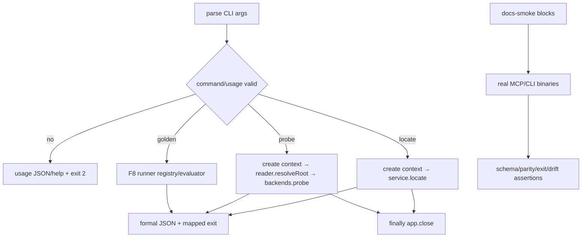

# debug-cli-mcp-guide 设计

## 0. 术语约定

- **Debug CLI**：本地诊断/测试 surface，不是第二个稳定产品 API。
- **Application semantics**：EvidencePack、classification、status、error codes 与 backend ordering；CLI 只能复用，不能重写。
- **Surface non-parity**：CLI 命令/flags/展示可与 MCP 不同；application semantics 必须完全同源。
- **Executable docs**：文档中标记的 config/command/request snippets 被 `test:docs` 实际解析或运行。
- **权威输入**：draft requirement + 已批准 roadmap 4.1/4.2/4.5 与 F9 completion signal。

## 1. 决策与约束

### 需求摘要

提供三条本地 debug commands（locate/probe/golden）、MCP 安装/调用指南、CLI 指南、`repo_nav_locate` schema v1 reference 和 MVP 验收说明。每条 CLI 命令都绑定既有 runtime token/testkit seam，定义输入、输出、exit code 与 cleanup；`test:docs` 从真实 snippets 启动 stdio、调用 success/recoverable/error case 并检查 schema drift，最后聚合 build/typecheck/unit/golden/MCP/docs 全部完成。

### 复杂度档位

发布收口严格档位。CLI 可用性、文档可执行性和 schema drift 是 core；文案风格不替代运行证据。

### 关键决策

- debug CLI 放在 `tools/cli/`，可依赖 production `src` 与 `testkit`；production MCP `src/**` 不反向依赖 CLI/testkit。
- `debug locate` 创建同一个 Nest application context，解析 `REPOSITORY_EVIDENCE_SERVICE` 并原样输出 `LocateToolOutput` JSON；不复制 classifier/fallback/status/error。
- `debug probe` 只做 infrastructure diagnostics：用 `REPOSITORY_READER.resolveRoot` + 有序 `REPOSITORY_SEARCH_BACKENDS.probe` 输出 `BackendHealth[]`；不生成 EvidencePack、不判断 source-of-truth。这一 probe 边界需要 owner 在本轮 review 拍板。
- `debug golden` 调用 F8 manifest runners/shared evaluator；不实现独立 snapshot semantics。
- 所有需要 context 的命令在 success、usage/service error、signal、unexpected exception 的 finally/shutdown path 调用 `app.close()`，并复用 F4/F2 cleanup。
- CLI stdout 只输出正式 JSON/help；diagnostics 写 stderr。`debug_output: forbidden` 仅禁止临时非契约 logging，不禁止正式 debug command output。
- API reference 以实际 Zod/JSON Schema v1 为权威；examples 由 schema-valid fixture 生成或 machine-check，不手写第二份字段定义。

### Command contract matrix

| Command | Input | Seam | stdout | Exit codes / cleanup | 禁止复制 |
|---|---|---|---|---|---|
| `repo-nav debug locate` | `--repo`、`--question`、重复 `--term`；可选 anchor/layer/negative/limits；也支持 `--request <json>` | application context + `REPOSITORY_EVIDENCE_SERVICE` | canonical `LocateToolOutput` JSON | 0=`ok=true`（含 recoverable statuses）；2=CLI usage parse error；3=`ok=false` tool error；1=bootstrap/unexpected；所有路径 close context | classification、fallback、status/error mapping、redaction |
| `repo-nav debug probe` | `--repo` | reader resolveRoot + ordered backend `probe` ports | diagnostic object `{schemaVersion:'1.0', repositoryRootRedacted, backends: BackendHealth[]}` | 0=probe completed（即使某 backend unavailable）；2=usage；3=invalid repo；1=unexpected；close context | LocateStatus、EvidencePack、candidate/source judgement |
| `repo-nav debug golden` | `--all` 或 `--case/--group` | F8 runner registry + shared evaluator | summary JSON（case counts/failures/artifact paths） | 0=all selected pass；2=usage/unknown case；1=runner failure；runner resources close | expectation comparison、normalization、fixture semantics |

Unknown command、缺 required args、wrong JSON/flag value 必须走 exit 2 且不启动 backend。SIGINT/EOF 在 context command 中走 idempotent cleanup；stdout 仍保持合法完整 JSON 或无 partial machine output。

### Documentation artifact contract

| Path | 内容/可执行证据 |
|---|---|
| `docs/getting-started-mcp.md` | 安装、MCP host stdio config、tools/list、success/recoverable/error call；config/request snippets 实际 smoke |
| `docs/debug-cli.md` | 三 commands 的 flags、exit codes、JSON examples、diagnostic-only 边界；command snippets 执行 |
| `docs/reference/repo-nav-locate.md` | input/output/errors/status/reason schema v1 reference；field/code list从 schema检查 |
| `docs/acceptance/mvp.md` | 完整 commands、artifact locations、F5 minimal loop 与 F9 publishable MVP candidate 的区别 |

`test:docs` contract：

1. parse 所有 `docs-smoke` fenced blocks，未知/过期 block 失败；
2. 用 getting-started config 启动真实 `repo-nav-mcp` child，设置 smoke timeout，执行 tools/list 和一个 success、一个 recoverable、一个 error request；任一 assertion/timeout/failure 都在 finally 终止并等待 child cleanup；
3. 对 structured/text/isError 与当前 schemas 做 parse/deep parity；
4. 执行 CLI help、locate、probe、golden snippets并核验 exit/stdout schema；
5. 检查 API reference enum/field/example 与 schema projection 一致，且不存在 plan/trace/impact/session 等禁止字段；
6. 检查 acceptance guide 列出完整 MVP commands 与 minimal-loop 非发布说明。

### 明确不做

- 不承诺 CLI flags/pretty format 与 MCP wire surface 对等；但不允许 application semantics 分叉。
- 不增加 UI、远程服务、代码修改、index mutation 或新业务推理。
- 不从文档发明 schema fields/reason codes，不把 probe 结果包装成 source-of-truth 结论。
- 不把空壳 `test:docs`、只检查文件存在或只跑 `--help` 当验收。

### 基线、依赖、风险与交付物

- 基线 commit：`04b04f7a1314f322e82157363ced505e2199cfc8`。
- 前置：F8 accepted 的 full runners/completeness/performance baseline。
- Top 3 风险：CLI 形成第二套语义、docs snippets 漂移、context/child 未关闭。分别由 seam matrix/禁止 imports、executable docs/schema drift、lifecycle cases 阻断。
- 关键假设：probe 作为 infrastructure diagnostic 对用户有价值但不是 application contract；owner 可要求删除而不影响 MCP MVP。
- 交付物：`repo-nav` debug bin、三 command implementations/tests、四份 docs、docs snippet runner/schema drift report、full acceptance command logs。
- 清洁度：禁止临时 stdout/debug、无来源 TODO/FIXME、注释掉代码、死 import；正式 CLI JSON/help/stderr diagnostics 允许且必须有 schema/format owner。

## 2. 名词与编排

### 2.1 名词层

**现状**：production MCP、application service、backend ports 和 Verification Kit 已完成；没有面向开发者的 CLI/docs surface。

**变化**：

- `tools/cli` 的 parser/dispatcher 只组装 command inputs、调用既有 seams、映射固定 exit codes。
- `LocateDebugCommand` 直接消费 LocateResult；`ProbeDebugCommand` 只消费 root/backends health；`GoldenDebugCommand` 只消费 runner summary。
- `DocsSmokeRunner` 解析被标记 snippets，调用实际 binaries/schemas，输出 machine-readable drift report。
- docs examples 来自 versioned fixtures；schema field/enum tables可生成或验证，不手工漂移。

**Module/interface 检查**：CLI 是 shallow local adapter；只有 locate 穿 application interface，probe 明确是 infrastructure diagnostic，golden 明确是 testkit adapter。import-graph test 阻止 CLI 引用 classifier/fallback internals，production graph 阻止依赖 CLI/testkit。

### 2.2 编排层

- CLI parse error 不创建 application context；context 创建后任何分支都经 finally/shutdown coordinator。
- output 先完整构造并 schema-validate，再一次写 stdout，避免 signal/exception 留 partial JSON。

### 2.3 挂载点清单

- `repo-nav` bin + `debug locate|probe|golden` registry：唯一 CLI surface。
- 四份 `docs/` artifacts：安装、诊断、API reference、MVP acceptance 的对外入口。
- `test:docs` snippet/schema-drift runner：文档可执行性的唯一 gate。

### 2.4 推进策略

1. **CLI parser/exit/lifecycle skeleton**：help、unknown、missing/wrong args、signal/exception 与 context cleanup 通过。
   验证：`npm test -- --group debug-cli-shell --group debug-cli-lifecycle`
2. **locate command**：success/recoverable/tool-error 原样 application semantics 与 exit codes 通过，import graph 无业务 internals。
   验证：`npm test -- --group debug-cli-locate`
3. **probe/golden commands**：health-only diagnostic 与 shared evaluator summary 的 input/output/exit/cleanup 通过。
   验证：`npm test -- --group debug-cli-probe --group debug-cli-golden`
4. **executable docs/schema drift**：四份 docs 的 MCP/CLI snippets、reference fields/codes、禁止字段和 MVP distinction 通过。
   验证：`npm run test:docs`
5. **MVP 聚合收口**：build/typecheck/unit/full Golden/MCP/docs 全绿并生成 acceptance artifact inventory。
   验证：`npm run build && npm run typecheck && npm test && npm run test:golden -- --all && npm run test:mcp -- --all && npm run test:docs`

### 2.5 结构健康度与微重构

##### 评估

- 文件级：不搬 production/testkit；CLI 新建 shallow commands。
- 目录级：`tools/cli` 可向下依赖 src/testkit，production `src` 禁止反向依赖；docs smoke 放 testkit。
- Compound：未发现既有目录 convention。

##### 结论：不做微重构

只新增 adapters/docs，通过既有 seams 连接。

## 3. 验收契约

### 3.1 关键场景

- help exit 0；unknown/missing/wrong args exit 2 且不启动 backend；unexpected bootstrap exit 1。
- debug locate 的 ok/recoverable exit 0、tool error exit 3，stdout schema 与 application result一致，context/children 始终关闭。
- debug probe 只输出 BackendHealth diagnostic，不产 EvidencePack/LocateStatus；debug golden 的 comparison 由 shared evaluator负责。
- getting-started snippet 真正启动 stdio 并完成 tools/list + success/recoverable/error；CLI 三命令 snippets 实际运行。
- API reference fields/enums/examples 与 schema v1 无 drift，无旧 plan/trace/impact/session；MVP guide 明确 F5 minimal loop 不等于发布。
- 全聚合命令一次运行并保留 command logs/artifact inventory。

### 3.2 明确不做的反向核对

- CLI command source 不得 import classifier/fallback/redaction internals；production src 不得 import tools/cli/testkit。
- probe 不得输出 source-of-truth judgement、触发 index mutation或改变 backend order。
- docs 不得新增 schema field/tool，`test:docs` 不得仅检查文件存在/help。

### 3.3 Acceptance Coverage Matrix

| Scenario | Covered By Step | Evidence Type | Command / Action | Core? |
|---|---|---|---|---|
| CLI usage/exit/lifecycle | S1 | unit + child/context integration | shell/lifecycle groups | yes |
| locate application-seam reuse | S2 | integration + import graph | locate group | yes |
| probe/golden bounded diagnostics | S3 | port/runner integration | probe/golden groups | yes |
| MCP/CLI docs snippets + schema drift | S4 | executable docs report | `npm run test:docs` | yes |
| complete MVP regression/acceptance inventory | S5 | aggregate command logs | full command | yes |

### 3.4 DoD Contract

| ID | 要求 | 证据 | 阻塞级别 |
|---|---|---|---|
| DOD-DESIGN-001 | design/checklist/review 完整并获 owner 批准 | design review | blocking |
| DOD-IMPL-001 | CLI/docs/docs-runner 完成且 seams/exit codes 可核验 | checklist/diff/logs | blocking |
| DOD-REVIEW-001 | code review passed，重点审语义复用与 docs drift | review report | blocking |
| DOD-QA-001 | CLI lifecycle、MCP snippets、full suites 全运行 | QA report | blocking |
| DOD-ACCEPT-001 | acceptance 生成 artifact inventory 与 MVP 使用边界 | acceptance | blocking |

Validation Commands:

| ID | 命令 | 目的 | 核心性 | 失败处理 |
|---|---|---|---|---|
| CMD-BUILD | `npm run build` | 编译 | core | fix-or-block |
| CMD-TYPECHECK | `npm run typecheck` | strict 类型检查 | core | fix-or-block |
| CMD-SHELL | `npm test -- --group debug-cli-shell --group debug-cli-lifecycle` | parser/exit/cleanup | core | fix-or-block |
| CMD-LOCATE | `npm test -- --group debug-cli-locate` | application semantics reuse | core | fix-or-block |
| CMD-DIAG | `npm test -- --group debug-cli-probe --group debug-cli-golden` | bounded diagnostics | core | fix-or-block |
| CMD-DOCS | `npm run test:docs` | executable docs/schema drift | core | fix-or-block |
| CMD-ALL | `npm run build && npm run typecheck && npm test && npm run test:golden -- --all && npm run test:mcp -- --all && npm run test:docs` | MVP aggregate | core | fix-or-block |

Required Artifacts: design-review、CLI command/exit matrix、import graph report、four docs、docs-smoke/schema-drift report、MCP/CLI transcripts、full command logs、artifact inventory、review、QA、acceptance。

## 4. 与项目级架构文档的关系

Acceptance 回填 local tooling/docs boundaries。CLI surface non-parity、probe diagnostic ownership、executable docs gate 若落地稳定，建议 ADR/guide convention。
