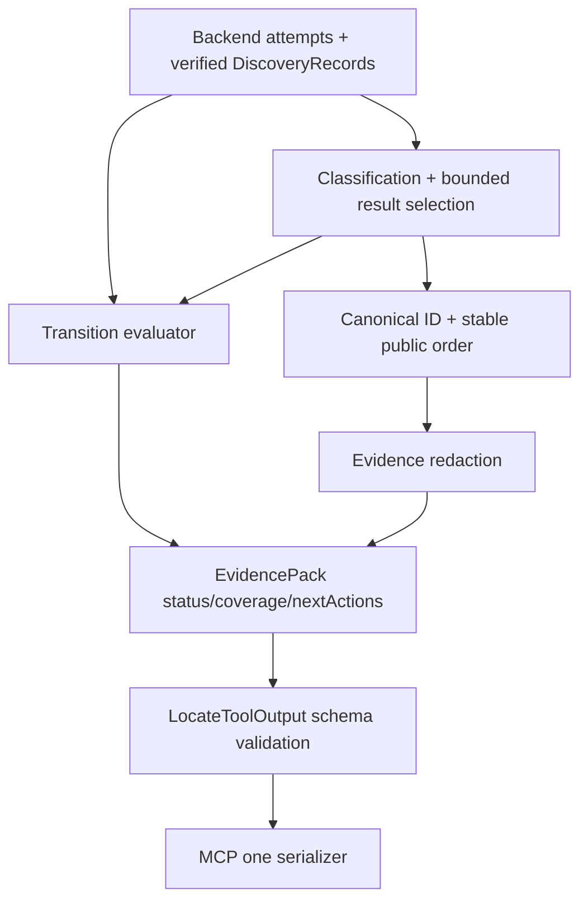

# evidence-output-guardrails 设计

## 0. 术语约定

- **Final status**：整轮 backend/fallback/verification/limits/abort 汇总后唯一裁决的 LocateStatus；backend 不自行决定。
- **Caller-adjustable limit**：`maxFiles|maxConfirmed|maxCandidates|timeoutMs`；在 schema range 内可建议重试。
- **Fixed safety limit**：`maxFileBytes|maxExcerptBytes|maxExcerptLines`；MVP 不允许 caller 提高。
- **Redaction**：public ID 计算后对 excerpt/message/log surface 做确定性遮盖，保留 path/lines/typed metadata。
- **四表面 error parity**：application `LocateResult`、MCP `structuredContent`、MCP text fallback、MCP `isError`。
- **权威输入**：draft requirement + 已批准 roadmap 4.1、4.6、4.7。

## 1. 决策与约束

### 需求摘要

把 F5 candidate 分支和 F6 CodeGraph/fallback 分支汇合为完整 EvidencePack guardrails：用单一 transition evaluator 裁决所有 LocateStatus；对每类 budget 规定截断顺序、coverage reason 和 nextAction；在 ID 后遮盖敏感 excerpt 并覆盖 MCP/error/log surfaces；四个 RepoNavToolError 在 application/MCP 表面字段一致且不泄露 stack、绝对路径或 raw backend 内容。

### 复杂度档位

安全与协议严格档位。transition/limit/redaction/error 全部 table-driven，并由 completeness test 保证新增 status/reason 后不能漏 fixture。

### 关键决策

- 最终状态优先级固定：tool error（独立 union）→ timeout → backend_unavailable special case → partial coverage gap → ok/no_result；具体 predicate 见状态表。
- `BackendSearchResult.complete=false` 只贡献 coverage gap，不直接等于 partial；必须结合 fallback 与 verified evidence。
- 结果选择先按 canonical stable key在有界队列中保留最优 confirmed/candidate，再 redaction；ID/order 不能基于 redacted excerpt。
- `MAX_*_REACHED` 只有确有 eligible item/verification 因该 limit 未完成时记录，caller 主动传较小值不是自动 limit hit。
- `RETRY_WITH_HIGHER_LIMIT` 只用于 caller-adjustable limit 且当前值低于 schema max；fixed safety cap 不建议突破。
- evidence excerpt redaction、safe error message 和 stderr diagnostic scrubber 是三个明确层，不用单一 replace 假装覆盖所有面。
- `PERSONAL_DATA` 的 MVP matcher 仅覆盖 email address 与 phone-like token；人名/一般标识符不自动遮盖。该边界需要 owner 在本轮 design review 拍板。

### 完整状态转换矩阵

| Case / 条件 | Final result | Coverage / nextActions |
|---|---|---|
| schema/normalization invalid | `ok=false/INVALID_INPUT` | 不启动 backend；缺/空 terms 时 ADD_TERM |
| repo invalid | `ok=false/INVALID_REPOSITORY` | 无 attempt/action |
| root/evidence path escape | `ok=false/PATH_OUTSIDE_ROOT` | 立即终止，无 action |
| uncaught invariant/exception | `ok=false/INTERNAL_ERROR` | cleanup，无 action |
| caller abort | `ok=true/timeout` | 保留已核验证据；无 RETRY |
| internal deadline | `ok=true/timeout` | 保留已核验证据；timeoutMs<30000 才给 RETRY |
| 所有可用 backends unavailable/failed 且无 verified evidence；或 hit-unverified 后 fallback unavailable | `ok=true/backend_unavailable` | attempts/exclusions 完整；适用时 INITIALIZE_CODEGRAPH |
| 非 backend-unavailable 特例，且 limit、backend complete=false、必要 fallback 未完成或 result 截断造成 coverage gap | `ok=true/partial` | 可为空；列 coverage/limits；caller-adjustable 时 RETRY |
| 有 verified evidence，策略/fallback 完整且无 limit | `ok=true/ok` | candidate 时 CONFIRM_CANDIDATE |
| 无 verified evidence，所有 required attempts 完成且无 limit | `ok=true/no_result` | ADD_TERM、ADD_SYMBOL_ANCHOR；index missing 时可追加 INITIALIZE_CODEGRAPH |
| primary hit 但全部核验失败，ripgrep fallback 完成且无 verified evidence | `ok=true/no_result` | `UNVERIFIED_FILE_CONTENT` + attempts；ADD_TERM/ADD_SYMBOL_ANCHOR |

复合情况按 predicate priority 裁决：tool error → timeout → backend-unavailable special case → partial coverage gap → ok/no_result。`backend_unavailable` special case 必须在 generic incomplete/partial 前判断；已有 evidence 且无 gap 才是 ok；no_result 必须证明策略完整。completeness inventory 以本表每个 predicate row ID 为 key，而不是只按最终 status 枚举计数。

### Limit/selection contract

| Limit | 生效点 | 保留/截断顺序 | reason/status/action |
|---|---|---|---|
| `maxFiles` | 依据 stable backend hit/file order调度 unique file verification | 已完成 verification 保留；额外 eligible file 不调度 | `MAX_FILES_REACHED`, partial, 可调时 RETRY |
| `maxConfirmed` | classification 后有界 stable selection | confirmed selection key 后截断；candidate 独立 | `MAX_CONFIRMED_REACHED`, partial, 可调时 RETRY |
| `maxCandidates` | F5 bounded selection | 不影响 confirmed；0 也允许显式空 candidates | `MAX_CANDIDATES_REACHED`, partial, 可调时 RETRY |
| `maxFileBytes` | reader open/fstat 后 | 该 file 不进入 evidence | `MAX_FILE_BYTES_REACHED` + `UNVERIFIED_FILE_CONTENT`, partial；无 RETRY |
| `maxExcerptBytes/Lines` | reader output 前 | 不输出未完整核验 excerpt；schema v1 的 line cap 也映射 excerpt cap code | `MAX_EXCERPT_BYTES_REACHED` + `UNVERIFIED_FILE_CONTENT`, partial；无 RETRY |
| `timeoutMs` | 整轮 deadline | 只保留 deadline 前已完成 evidence | `TIMEOUT_REACHED`, timeout；低于 max 时 RETRY |

`limitsReached` 和 `nextActions` 按 schema priority 去重；result selection 不依赖 filesystem/backends 到达顺序。

### Redaction contract

| Reason | Deterministic matcher | Public action |
|---|---|---|
| `SECRET_LIKE_VALUE` | known token/key assignment（password/secret/token/api-key 等）或固定 credential format | 只替换 value，保留 safe context；无法安全切片则整 excerpt placeholder |
| `CONNECTION_STRING` | URI/DSN 含 userinfo/password/secret query param | 遮盖 credentials/query secret |
| `PERSONAL_DATA` | email address、phone-like token | 遮盖 token；不猜姓名 |
| `BINARY_OR_OVERSIZED_CONTENT` | 已核验 UTF-8 excerpt 中单个 token/value 超过 public display cap，或无法安全局部遮盖 | 整 excerpt placeholder，不输出 raw token；真正 binary reader failure 仍按 UNVERIFIED exclusion，不生成 evidence |

- `EvidenceLocation.file/symbol/lines` 保留；`redaction={applied:true,reasonCodes:[...]}` 使用 schema order。
- verification/read caps 与 public display redaction 是互斥阶段：reader 16 KiB/80-line cap 触发时没有 public evidence，只记 limit/exclusion；只有 reader 已完整返回 cap 内 UTF-8 excerpt 后，redactor 的独立 2 KiB（2048 UTF-8 bytes）single-token public-display cap 才可产生 `BINARY_OR_OVERSIZED_CONTENT` placeholder。
- ID 由 unredacted normalized excerpt 计算后立即丢弃 hash material；public output 不含 raw hash。
- service output、MCP structured/text 都只能接收 redacted EvidencePack。safe error policy 删除 stack/absolute path/raw stderr；diagnostic scrubber 作用于正式 stderr，stdout 仍 frames-only。
- tests 必须在 service result、MCP structured、text、captured stdout/stderr、error message 中搜索 forbidden raw secrets。

### Tool error contract

| Code | recoverable | suggestedAction | message 禁止项 |
|---|---:|---|---|
| `INVALID_INPUT` | true | 仅缺/空 terms 为 ADD_TERM，否则 none | raw invalid payload、stack |
| `INVALID_REPOSITORY` | true | none | absolute resolved path、OS raw error |
| `PATH_OUTSIDE_ROOT` | false | none | escaped target absolute path/content |
| `INTERNAL_ERROR` | false | none | stack、class/function name、backend stderr、secret excerpt |

### 明确不做

- 不扩展 search/candidate reasons，不新增 tool、persistence 或业务结论。
- 不把 no_result 表述为“代码不存在”，不把 backend failure 表述为完成搜索。
- 不允许 caller 提高 fixed safety limits，不用 numeric confidence 或非确定性 redaction。
- 不承诺遮盖所有自然语言 PII；MVP PERSONAL_DATA 边界只含表中 token types。

### 基线、依赖、风险与交付物

- 基线 commit：`04b04f7a1314f322e82157363ced505e2199cfc8`。
- 前置：F5 candidate policy、F6 fallback orchestration 均 accepted。
- Top 3 风险：复合状态优先级漂移、limit 误报 no_result、敏感值从备用 surface 泄露。分别由 transition completeness、limit table、全 surface forbidden scans 阻断。
- 关键假设：owner 接受 PERSONAL_DATA 的有限确定性边界；其余 PII 由后续安全 feature 扩展并升级 schema。
- 交付物：transition/limit evaluators、redaction/safe-message/logger scrubber、completeness matrices、Golden/MCP service transcripts、forbidden scan report。
- 清洁度：禁止临时 stdout/debug、无来源 TODO/FIXME、注释掉代码、死 import；正式 scrubbed stderr diagnostics 允许。

## 2. 名词与编排

### 2.1 名词层

**现状**：F3/F5/F6 已产生 verified records、candidate policy、backend attempts 与局部 statuses；完整复合裁决、redaction 和 error safe policy 尚未统一。

**变化**：

- `LocateStatusEvaluator` 消费 attempts、strategy completeness、verified counts、limits、abort source，返回唯一 status/nextActions。
- `ResultBudgetSelector` 分别维护 confirmed/candidate bounded stable selection，输出 typed limit facts。
- `EvidenceRedactor` 只消费已分配 ID 的 EvidenceLocation，输出带 metadata 的 public location。
- `SafePublicErrorFactory` 与 `DiagnosticScrubber` 分治 tool message/stderr。
- 所有组件只能返回 schema v1 封闭枚举；新增 code 必须同步 schema、matrix 与 positive/negative fixtures。

### 2.2 编排层

- tool errors 在 EvidencePack pipeline 外形成 `LocateResult.ok=false`，仍经同一 output schema 与 serializer。
- transition evaluator 必须 table-driven；case inventory completeness test 将矩阵行与 fixture IDs 一一核对。

### 2.3 挂载点清单

- Evidence Engine finalization stage：状态、budget、redaction 的唯一组装点。
- MCP output serializer/safe-message policy：所有 public surfaces 的唯一映射点。
- Transition/limit/redaction/error fixture matrices：guardrail 的唯一验收清单。

### 2.4 推进策略

1. **完整 transition evaluator**：矩阵每个 predicate row 和复合优先级都有命名 fixture，显式包含 hit-unverified fallback complete/unavailable、caller abort empty/evidence、internal deadline below/at max。
   验证：`npm test -- --group locate-status --case transition-matrix-completeness --case hit-unverified-fallback-complete --case hit-unverified-fallback-unavailable --case caller-abort-empty --case caller-abort-with-evidence --case internal-deadline-below-max --case internal-deadline-at-max`
2. **limits/selection/nextActions**：六类 limits、0/boundary/truncation、stable selection 与 action rules 通过。
   验证：`npm run test:golden -- --group result-limits --case partial-empty-limit --case partial-with-evidence`
3. **redaction 全 surface**：四类 reason、metadata、ID/order stability 和 forbidden raw scan 通过。
   验证：`npm run test:golden -- --case secret-redaction --case redaction-metadata && npm run test:mcp -- --case redaction-output-parity`
4. **四类 error parity**：application/structured/text/isError 字段与 message 禁止项逐 code 通过。
   验证：`npm run test:mcp -- --case invalid-input --case invalid-repo --case path-outside-root --case internal-error-parity`

### 2.5 结构健康度与微重构

##### 评估

- 文件级：不搬 search/candidate adapters；finalization policies 独立文件，避免 EvidenceService 变成单一巨类。
- 目录级：status/budget/redaction 属 Evidence Engine；MCP serializer 保留在 adapter 层，safe schema 共用 contracts。
- Compound：未发现既有目录 convention。

##### 结论：不做微重构

status/budget/redaction 都是本 feature 的新增 policy，不搬迁前置实现；通过独立文件新增，避免把语义变更伪装成重构。

## 3. 验收契约

### 3.1 关键场景

- transition matrix 的 ok-via-codegraph、ok-via-fallback、verified-no-result、hit-unverified fallback complete/unavailable、backend-unavailable、partial-empty/evidence、caller-abort empty/evidence、internal-deadline below/at-max、tool errors 全有 predicate-keyed case。
- 六类 limit 输入分别产生唯一 limitsReached/status/nextActions；timeout、partial、backend_unavailable 的复合优先级稳定。
- 四类 redaction 保留 path/lines/metadata，ID/order 前后不变；raw secret 不出现在 service/MCP/text/error/stdout/stderr。
- 四个 tool error 的 code/recoverable/action/message 与 isError/parity 完全一致。
- schema/status/reason 新枚举缺 fixture 时 completeness test 失败。

### 3.2 明确不做的反向核对

- 不新增 recall/candidate reason/tool/persistence；不改变 backend query semantics。
- 不出现“code does not exist”类 no_result 结论，不输出 raw stack/path/stderr/secret。
- fixed safety limit 不生成 RETRY_WITH_HIGHER_LIMIT；candidate/confirmed 截断不改变 canonical order。

### 3.3 Acceptance Coverage Matrix

| Scenario | Covered By Step | Evidence Type | Command / Action | Core? |
|---|---|---|---|---|
| predicate rows + all statuses + compound/abort-source priority | S1 | table unit + Golden inventory | locate-status/completeness + named boundaries | yes |
| every limit + selection + action | S2 | boundary/permutation Golden | result-limits group | yes |
| redaction metadata/ID/all surfaces | S3 | Golden + MCP + forbidden scan | three redaction cases | yes |
| four tool errors/four surfaces | S4 | application/MCP integration | four error cases | yes |

### 3.4 DoD Contract

| ID | 要求 | 证据 | 阻塞级别 |
|---|---|---|---|
| DOD-DESIGN-001 | design/checklist/review 完整并获 owner 批准 | design review | blocking |
| DOD-IMPL-001 | policies/matrices/fixtures 完成且前置行为回归 | checklist/diff/logs | blocking |
| DOD-REVIEW-001 | code review passed，重点审状态优先级和泄露面 | review report | blocking |
| DOD-QA-001 | transition/limit/redaction/error 全部运行并扫描 forbidden values | QA report | blocking |
| DOD-ACCEPT-001 | acceptance 回写 guardrails 与 PERSONAL_DATA 边界 | acceptance | blocking |

Validation Commands:

| ID | 命令 | 目的 | 核心性 | 失败处理 |
|---|---|---|---|---|
| CMD-BUILD | `npm run build` | 编译 | core | fix-or-block |
| CMD-TYPECHECK | `npm run typecheck` | strict 类型检查 | core | fix-or-block |
| CMD-STATUS | `npm test -- --group locate-status --case transition-matrix-completeness --case hit-unverified-fallback-complete --case hit-unverified-fallback-unavailable --case caller-abort-empty --case caller-abort-with-evidence --case internal-deadline-below-max --case internal-deadline-at-max` | predicate-keyed 完整状态裁决 | core | fix-or-block |
| CMD-LIMITS | `npm run test:golden -- --group result-limits --case partial-empty-limit --case partial-with-evidence` | limits/selection/actions | core | fix-or-block |
| CMD-REDACTION | `npm run test:golden -- --case secret-redaction --case redaction-metadata && npm run test:mcp -- --case redaction-output-parity` | 全 surface redaction | core | fix-or-block |
| CMD-ERRORS | `npm run test:mcp -- --case invalid-input --case invalid-repo --case path-outside-root --case internal-error-parity` | 四类 error parity | core | fix-or-block |

Required Artifacts: design-review、transition/limit/redaction/error matrices、fixture inventory、forbidden scan report、service/MCP transcripts、command logs、review、QA、acceptance。

## 4. 与项目级架构文档的关系

Acceptance 回填 Evidence Engine finalization policies 与 MCP safe output boundary。状态优先级、limit action、redaction reason 和 error safe-message 属 schema v1 长期约束，建议 ADR。
