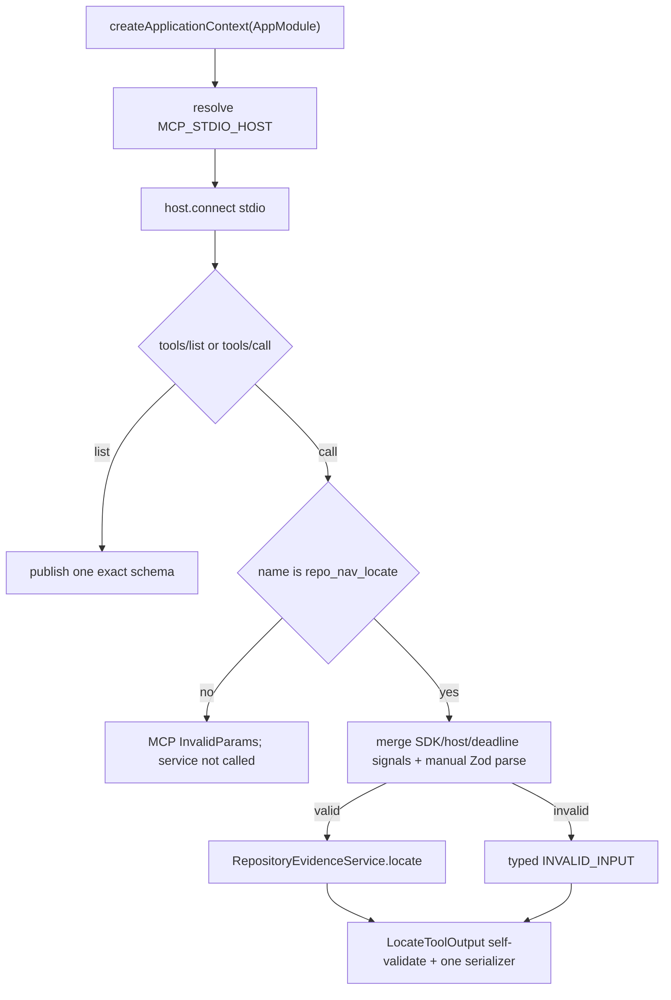

# mcp-locate-surface 设计

## 0. 术语约定

- **Application contract**：`RepositoryEvidenceService.locate()` 与 `LocateResult`；MCP 只映射，不复制业务规则。
- **Tool-invalid input**：协议 envelope 合法、`arguments` 为 object，但不符合 LocateRequest Zod schema；映射 `INVALID_INPUT`。
- **Protocol-invalid request**：连 MCP `tools/call` envelope 都不合法；由 SDK JSON-RPC 层处理，不伪装成 RepoNav tool error。
- **Output parity**：`structuredContent` 与 `content[0].text` parse 后严格等于同一个 `LocateToolOutput`。
- **权威输入**：draft requirement + 已批准 roadmap 4.1/4.2/4.4/4.5/4.6。

## 1. 决策与约束

### 需求摘要

用 NestJS standalone application context 和本地 stdio 暴露唯一只读工具 `repo_nav_locate`。MCP Surface 必须准确发布 input/output schema、把 service 的 success/recoverable/tool error 映射为单一协议对象、保证 stdout 不被污染，并在 EOF/signal/transport/bootstrap failure 下幂等关闭 transport、在途调用、child processes 与 Nest context。

### 复杂度档位

协议严格档位。SDK v1.29.0 的 helper validation/error path 不能替代 RepoNav 自己的 tool error contract；所有 success/error output 都先经 RepoNav Zod schema 自校验再序列化。

### 关键决策

- 锁定 `@modelcontextprotocol/sdk@1.29.0` stable imports；实现时核验 lockfile 和实际 API，不升级 v2 pre-release。
- 不直接用 `McpServer.registerTool` 的精确 inputSchema 承担 runtime validation：该 helper 会在 callback 前拒绝 schema-invalid arguments，无法产生 roadmap 要求的 typed structured error。
- 使用 SDK low-level `Server` 的 `ListToolsRequestSchema`/`CallToolRequestSchema` handlers：Server 构造/初始化时显式声明 `tools: { listChanged: false }` capability；`tools/list` 发布由 Zod 转换的精确 schema；`tools/call` 先校验 tool name，再由 RepoNav `LocateRequestSchema.safeParse` envelope-valid arguments，从而稳定映射 `INVALID_INPUT`。
- 任何 protocol-envelope invalid request 仍由 SDK 返回 JSON-RPC error；envelope-valid 但 `name !== 'repo_nav_locate'` 的请求由 registry guard 抛出 `McpError(ErrorCode.InvalidParams, 'Unknown tool')`，不得进入 input parse/service，也不得生成 RepoNav structuredContent。GoldenErrorCase 只覆盖正确 tool name 下的 tool-schema-invalid object 和四个 RepoNavToolError。
- success 与 error 都先用 `LocateToolOutputSchema.parse` 自校验，再由同一 serializer 生成 `structuredContent` 与 canonical JSON text；error 设置 `isError:true`，recoverable statuses 保持 `isError:false`。
- `tools/list` 只能列一个工具，input/output schemas 与 schema v1 snapshot 一致；annotations 标记 read-only、non-destructive、idempotent。
- `MCP_STDIO_HOST` owns SDK server/transport/in-flight controller registry；production `main.ts` owns Nest context 与进程退出协调。

### 明确不做

- 不启动 HTTP/Fastify/Express listener，不增加 plan/trace/impact 等工具。
- handler 不直连 filesystem、rg、CodeGraph 或 classifier，只解析 input、调用 service、序列化 result。
- 不承诺把 protocol-invalid JSON-RPC envelope 映射成 RepoNav `INVALID_INPUT`。
- 不让日志、child output、stack 或绝对敏感路径进入 stdout/tool message。

### 基线、依赖、风险与交付物

- 基线 commit：`04b04f7a1314f322e82157363ced505e2199cfc8`。
- 前置：F3 accepted 的 `RepositoryEvidenceService` 和 F1 lifecycle runner；F2 提供 AbortSignal child cleanup。
- Top 3 风险：SDK pre-handler validation 绕过 typed error、stdio 污染、shutdown double-close/资源泄漏。分别由 low-level handlers、自校验 serializer、幂等 shutdown state machine 阻断。
- 关键假设：RepoNav tool input 总是 MCP envelope 中的 object；非 object 属协议层错误。Windows lifecycle test 用 stdin EOF，支持 signal 的平台额外测 SIGINT。
- 交付物：`McpModule`、`McpStdioHost`、tool registry/schema snapshot、production `main.ts`、stdio integration client、error/lifecycle fixtures、command logs。
- 清洁度：正式 diagnostics 只写 stderr；禁止临时 stdout/debug、无来源 TODO/FIXME、注释掉代码、死 import。

## 2. 名词与编排

### 2.1 名词层

**现状**：F1 已声明 `MCP_STDIO_HOST` 但无 provider；F3 service 可从 token 解析；没有 production process entry。

**变化**：

```ts
export interface McpStdioHost {
  connect(): Promise<void>;
  close(reason: 'eof' | 'signal' | 'transport-error' | 'bootstrap-error'): Promise<void>;
}
```

- `connect()` 只可调用一次，绑定 stdio transport 后开始接收；重复调用是 internal invariant error。
- `close()` 幂等并返回同一 shutdown promise；mark closing 后拒绝新 call，abort 所有 tracked locate controllers，关闭 SDK server/transport，等待 tracked calls settle。
- tool handler 为每次 locate 合并 SDK `RequestHandlerExtra.signal`、host shutdown signal 与 request deadline signal，并把合并 signal 作为 `LocateExecutionContext.signal` 传给 service；handler finally 从 registry 移除。客户端取消、连接关闭、deadline 或进程 shutdown 任一触发都会停止 reader/child，且只 abort 一次。
- App-level shutdown coordinator 在 host close 完成后调用 `app.close()`；`McpStdioHost.onModuleDestroy()` 只做 idempotent low-level close，不反向再次关闭 app。

**工具结果映射**：

| Application result | MCP `isError` | structured/text |
|---|---:|---|
| `ok=true`, status `ok|no_result|partial|backend_unavailable|timeout` | false | 同一 `LocateToolOutput` |
| `ok=false`, code `INVALID_INPUT|INVALID_REPOSITORY|PATH_OUTSIDE_ROOT|INTERNAL_ERROR` | true | 同一 `LocateToolOutput` |
| protocol-invalid envelope | SDK JSON-RPC error | 不属于 RepoNav output schema |
| envelope-valid unknown tool name | registry guard 的 MCP InvalidParams JSON-RPC error | service 未调用，不产生 RepoNav output |

所有 error message 必须通过 safe-message policy：不含 stack、repository absolute path、secret excerpt、raw stderr；`recoverable/suggestedAction` 完全来自 application result。

**Module/interface 检查**：MCP host 是 shallow transport adapter，service 是 deep module；schema conversion、handler、serializer、lifecycle 各有单一 owner。integration tests 通过真实 stdio client 观察 tools/list/call/close，不 mock handler internals。

### 2.2 编排层



**Shutdown 时序**：

1. `stdin end/EOF`、SIGINT/SIGTERM、transport error 或 bootstrap error 调用唯一 `shutdown(reason)`。
2. 原子切换 `running → closing`，后续触发返回同一 promise。
3. host 停止接收，abort tracked locate；关闭 SDK server/transport 并等待 tracked calls/resource cleanup。
4. 调用 `app.close()`，观察 Nest hooks；最后设置 exit code（normal EOF/signal=0，bootstrap/internal shutdown failure=1）。
5. 所有 diagnostics 写 stderr；stdout 在全生命周期只包含可被 MCP client 解析的 frames。

### 2.3 挂载点清单

- `repo-nav-mcp` bin / production `main.ts`：唯一 stdio process entry。
- `McpModule` + `MCP_STDIO_HOST` provider：唯一 protocol/lifecycle adapter。
- `tools/list`/`tools/call` registry：唯一 `repo_nav_locate` MCP surface。
- stdio integration/lifecycle runner：唯一协议验收入口。

### 2.4 推进策略

1. **capability/registry/schema**：initialize 声明 tools capability；tools/list 只有一个 tool；unknown name 在 registry guard 被拒绝；精确 object input/output schema、annotations 与禁止表面 snapshot 通过。
   验证：`npm run test:mcp -- --case initialize-tools-capability --case tool-list-schema --case single-tool-readonly --case unknown-tool-jsonrpc-boundary`
2. **success/recoverable mapping**：source mapping、no_result/partial/timeout 的 isError=false 与 structured/text parity 通过。
   验证：`npm run test:mcp -- --case source-field-mapping --case recoverable-status-parity`
3. **typed error mapping**：schema-invalid object 和四个 tool error 的 code/recoverable/action/isError/parity/message 禁止项通过。
   验证：`npm run test:mcp -- --case invalid-input --case invalid-repo --case path-outside-root --case internal-error-parity`
4. **stdio lifecycle/cancellation**：clean stdout、request cancellation、EOF/平台 signal、in-flight abort、transport/context/child cleanup、幂等 close 与 maxShutdownMs 通过；signal 正常关闭 exit 0 是本 MCP child contract。
   验证：`npm run test:mcp -- --case request-cancellation-cleanup --case stdio-clean-output --case stdio-graceful-shutdown`

### 2.5 结构健康度与微重构

##### 评估

- 文件级：不搬 service/contract；新增 MCP adapter、serializer、bootstrap。
- 目录级：MCP SDK 只出现在 mcp infrastructure；`main.ts` 不含业务判断。
- Compound：未发现既有目录 convention。

##### 结论：不做微重构

通过 F1 token 与 F3 service seam 挂载，不改前置模块语义。

## 3. 验收契约

### 3.1 关键场景

- initialize response 声明 tools capability；tools/list 精确列出一个 `repo_nav_locate`，顶层 input/output 均为 MCP 可接受 object schema 且 snapshot 与 Zod contract 一致，无其他 tools/HTTP provider。
- unknown tool name 产生 MCP InvalidParams JSON-RPC error，service call count 为 0，不返回 RepoNav structuredContent。
- 缺 terms、wrong type、byte-budget 失败等 envelope-valid object 均返回 `ok=false/INVALID_INPUT/isError=true`，structured/text 严格同值。
- invalid repo、path escape、internal exception 保留 application error 字段，不输出 stack、absolute path 或 raw stderr。
- `no_result|partial|backend_unavailable|timeout` 仍是 `ok=true/isError=false`。
- SDK request cancellation、EOF/signal/transport error 都通过合并 signal abort in-flight child；shutdown 在 maxShutdownMs 内关闭 host/context，重复触发不 double-close。

### 3.2 明确不做的反向核对

- tool registry 不得出现第二个工具，provider graph 不得出现 HTTP adapter/listener。
- MCP handler/import graph 不得依赖 reader、process runner、backend adapter 或 classification implementation。
- protocol-envelope invalid request 不得伪造 RepoNav structuredContent；应保持 SDK error boundary。

### 3.3 Acceptance Coverage Matrix

| Scenario | Covered By Step | Evidence Type | Command / Action | Core? |
|---|---|---|---|---|
| tools capability + one tool + exact object schemas + unknown guard + no HTTP | S1 | initialize/list/raw-call snapshot + graph assertion | capability/schema/unknown cases | yes |
| success/recoverable parity | S2 | real stdio integration | mapping/status cases | yes |
| schema-invalid + four typed errors | S3 | real stdio error fixtures | four error cases | yes |
| stdout/lifecycle/cleanup/idempotence | S4 | child-process lifecycle evidence | lifecycle cases | yes |

### 3.4 DoD Contract

| ID | 要求 | 证据 | 阻塞级别 |
|---|---|---|---|
| DOD-DESIGN-001 | design/checklist/review 完整并获 owner 批准 | design review | blocking |
| DOD-IMPL-001 | host/registry/serializer/bootstrap 与 fixtures 完成 | checklist/diff/logs | blocking |
| DOD-REVIEW-001 | code review passed，重点审 SDK boundary 与 close ownership | review report | blocking |
| DOD-QA-001 | tools/list/call/error/lifecycle 全部真实 stdio 运行 | QA report | blocking |
| DOD-ACCEPT-001 | acceptance 固定 SDK version、协议与 residual risk | acceptance | blocking |

Validation Commands:

| ID | 命令 | 目的 | 核心性 | 失败处理 |
|---|---|---|---|---|
| CMD-BUILD | `npm run build` | 编译 | core | fix-or-block |
| CMD-TYPECHECK | `npm run typecheck` | strict 类型检查 | core | fix-or-block |
| CMD-SCHEMA | `npm run test:mcp -- --case initialize-tools-capability --case tool-list-schema --case single-tool-readonly --case unknown-tool-jsonrpc-boundary` | capability/registry/schema | core | fix-or-block |
| CMD-SUCCESS | `npm run test:mcp -- --case source-field-mapping --case recoverable-status-parity` | success/recoverable mapping | core | fix-or-block |
| CMD-ERROR | `npm run test:mcp -- --case invalid-input --case invalid-repo --case path-outside-root --case internal-error-parity` | typed error parity | core | fix-or-block |
| CMD-LIFECYCLE | `npm run test:mcp -- --case request-cancellation-cleanup --case stdio-clean-output --case stdio-graceful-shutdown` | cancellation/lifecycle/cleanup | core | fix-or-block |

Required Artifacts: design-review、SDK lock evidence、tool schema snapshot、provider graph assertion、stdio transcripts、lifecycle cleanup report、command logs、review、QA、acceptance。

## 4. 与项目级架构文档的关系

Acceptance 回填 MCP Surface、standalone bootstrap 与 shutdown ownership。low-level SDK handler + RepoNav 自校验 serializer 是为满足 typed error parity 的结构性决策，落地后建议归档 ADR。
