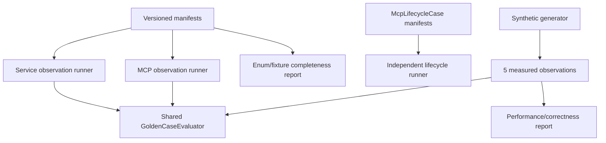

# mvp-golden-regression-suite 设计

## 0. 术语约定

- **Execution runner**：service runner 或 stdio MCP runner；两者都把 success/error observation 交给同一个 GoldenCaseEvaluator。
- **GoldenCaseEvaluator**：按 `kind` 分派 success/error 的共享判定语义，不是两套 evaluator。
- **Lifecycle runner**：只处理 `McpLifecycleCase` 的 stdout/shutdown，不伪装 LocateResult。
- **Completeness report**：从 schema enums 与 manifests 生成“status/reason/error → positive/negative cases”覆盖，不靠人工 group 名称。
- **Performance signal**：固定 synthetic corpus 上的 correctness + environment-aware timing report，不是 SLA。
- **权威输入**：draft requirement + 已批准 roadmap 4.4、4.6、4.7 与 Goal Coverage Matrix。

## 1. 决策与约束

### 需求摘要

把 F1 的 runner/manifest 基线扩展为可发布 MVP 候选的完整回归系统：success/error 共用判别联合 evaluator，service/MCP runners 复用同一 expectation 语义，lifecycle 独立；fixture family 显式覆盖 classification、backend transitions、security、limits、redaction、protocol、shutdown；大型合成仓库产生可比较 correctness/performance report，但不以单一毫秒阈值判定通过。

### 复杂度档位

回归严格档位。snapshot normalization 采用 allowlist，不能抹掉 schema/classification/order 漂移；每个核心 failure 至少有 positive 与 false-positive guard。

### 关键决策

- `GoldenCase = GoldenSuccessCase | GoldenErrorCase` 由一个 evaluator 处理；service/MCP 只是 observation adapter，不复制 expected semantics。
- lifecycle 使用独立 `McpLifecycleCaseRunner`，断言 frames-only、exitCode、maxShutdownMs、Nest context hook 与 child cleanup。
- Golden success comparison 是 exact contract：manifest 做语义断言，且每个 success case 的 sibling stable-projection snapshot 对完整 public output 做 deep exact comparison，覆盖 status、normalizedTerms、confirmed/candidates、promotion、provenance、coverage、nextActions、ID/order；forbidden IDs 必须不存在；required coverage 是 subset；minimum exclusions 是 lower bound。
- normalization 只允许替换 repository absolute root、test temp directory 和 runtime duration字段；relative path、excerpt、class、role、reason、promotion、coverage、ID/order 不得 normalize。
- completeness report 从 schema enums/manifest metadata 自动生成；缺 status/error/reason family 的负责 case 时 core test 失败。
- synthetic performance correctness 是 blocking；timing 是趋势信号。初始版本记录 baseline，不设单一绝对毫秒阈值。

### Evaluator comparison contract

| Case | 必须比较 | 允许 normalize/忽略 |
|---|---|---|
| GoldenSuccessCase | manifest：`ok=true`、status、confirmed/candidates exact length/order、file/contains/role/reasons、forbidden IDs、requiredCoverageCodes、minimumExclusionCounts；sibling stable snapshot：完整 EvidencePack 的 normalizedTerms、IDs、promotionRequirements、provenance(discoveredBy/verifiedBy/operations)、coverage、nextActions 与 schemaVersion deep exact | repositoryRoot absolute prefix → placeholder；temp root；elapsed/report-only environment |
| GoldenErrorCase | `ok=false`、code、recoverable、suggestedAction exact；MCP isError=true；structured/text deep-equal | safe message 文案可按 code snapshot；不得忽略 stack/path/secret forbidden scan |
| McpLifecycleCase | stdout frames-only、exitCode、shutdown duration ≤ manifest max、context closed、children cleaned | observed duration 数值只比较上限，不进入 snapshot |

Evaluator 自身必须有 deliberate-failure tests：unexpected evidence、wrong order、forbidden ID、missing coverage、low exclusion count、wrong nextAction、missing/wrong-order promotion、wrong verifiedBy/discoveredBy/operation order、error parity mismatch 都应使 runner 非零退出。

Roadmap 4.4 的 manifest interface 保持不变；full stable projection 存在 `testkit/expected/{case-id}.json`，由同一 evaluator 读取，不把新增 optional fields偷偷塞入 GoldenCase。snapshot 是 manifest 的 companion artifact，必须提交并 review。

### Fixture-family coverage matrix

| Family | Required cases/assertions | Runner |
|---|---|---|
| direct classification | source-field-mapping；assignment/object/SQL/symbol；exact class/role/reasons | service + MCP sample |
| false confirmation | DTO/entity/test/docs/comment/unsupported syntax；forbidden confirmed IDs | service |
| candidate | sibling/alias positive、unrelated false-positive、promotion exact set/order、budget/permutation | service + MCP minimal loop |
| layer/path/security | layer/negative/symlink/root escape、unverified/binary/oversized、redaction forbidden scan | service + MCP error/security |
| backend transitions | CodeGraph missing/no-result/failed/incomplete、ripgrep unavailable、both unavailable、hit-unverified | service |
| final status/limits | ok/no_result/backend_unavailable/partial empty+evidence/timeout empty+evidence；六类 limits | service + MCP representative |
| protocol/errors | invalid input/repo/path/internal、tools/list/schema、success/error parity | MCP |
| lifecycle | frames-only、EOF/platform signal、context close、in-flight child cleanup、idempotent shutdown | lifecycle runner |

### Schema/enum completeness ownership

- input enums（RepoLayer、AnchorKind、TermCaseMode）与 output enums（LocateStatus、EvidenceSource、EvidenceRole）都有 owner case/mutation test。
- Confirmed/Candidate/Discovery/Promotion/EvidenceOperation codes：classification/candidate/provenance families，均需 positive；candidate/confirmed 还需 false-positive guard。
- Backend/Limit/Exclusion/Redaction/NextAction codes：transition/security/limits/action families，每个 code 至少一项 required coverage/minimum count/stable snapshot assertion。
- RepoNavToolError：protocol family 每个 code 至少一个 exact case。
- completeness 输出两层：enum/code owner coverage；每个 public EvidencePack 字段的 deliberate mutation test。任一缺失都阻塞。

### Synthetic performance contract

`large-synthetic-repository-v1` 使用固定 seed 与 generator config：1,000 source files、50 modules、10 direct mappings、200 named decoys、固定 file-size distribution；manifest 固定 request/limits。生成内容全为合成代码，无网络/真实业务源码。

Runtime report schema/path：

```text
test-artifacts/performance/large-synthetic-repository-v1.json
```

包含 `schemaVersion`、generator config/hash、git commit、Node/OS/arch/CPU、dependency versions、warmup=1、measuredRuns=5、每次 elapsedMs/peakRssBytes、median/p95、status/result counts/limitsReached、fixture cleanup result。

首次 F8 acceptance 将 environment/config/hash 与 timing summary 的基线副本提交到 `testkit/baselines/performance/large-synthetic-repository-v1.json`；后续 runs 写 gitignored `test-artifacts/` 并与这个 committed baseline 生成 trend。更新 committed baseline 必须经过 code review，不由 test 自动覆盖。

- Blocking correctness：5 次输出 stable projection/hash 完全一致；status/counts/limits 与 manifest 相同；无 timeout/资源泄漏；report schema 完整。
- Non-blocking performance：记录 median/p95/peak RSS 与相对上次 baseline 趋势；首版无上次数据时只建 baseline。显著趋势在 review 中报告，不因单次 elapsed 自动失败。

### 明确不做

- 不为 snapshot 修改 production 语义，不宽泛 scrub 真实协议字段。
- 不访问真实业务仓库或网络，不把 synthetic timing 宣称为 monorepo SLA。
- 不将 success/error 拆成不同 expectation semantics，不让 lifecycle 进入 GoldenCase。
- 不以单次或单一毫秒阈值决定 performance pass/fail。

### 基线、依赖、风险与交付物

- 基线 commit：`04b04f7a1314f322e82157363ced505e2199cfc8`。
- 前置：F7 accepted 的完整 guardrails。
- Top 3 风险：normalization 隐藏协议漂移、group 名称掩盖漏 case、跨环境 timing 噪声。分别由 allowlist/negative evaluator tests、generated completeness report、environment/repeat/trend 报告缓解。
- 关键假设：1,000-file synthetic corpus 足以形成 MVP 趋势信号，但不代表真实 monorepo。
- 交付物：shared evaluator、service/MCP/lifecycle runners、manifest family、completeness report、synthetic generator、versioned report schema/baseline artifact、全 suite logs。
- 清洁度：禁止临时 stdout/debug、无来源 TODO/FIXME、注释掉代码、死 import；test artifacts 使用明确目录/retention，不散落 temp files。

## 2. 名词与编排

### 2.1 名词层

**现状**：各前置 feature 已有局部 unit/Golden/MCP cases；F1 提供 shared schema/harness，但尚无全 family completeness 与性能报告。

**变化**：

- `GoldenCaseEvaluator.evaluate(case, observation)` 是 success/error expectation 的唯一实现。
- `ServiceGoldenRunner`、`McpGoldenRunner` 只负责产生 observation；`McpLifecycleCaseRunner` 独立。
- manifest metadata 声明 covered input/output enums、status/reason/action/error codes 与 positive/negative role；companion snapshot覆盖完整 public fields，生成两层 completeness report。
- snapshot projection 只在 evaluator 内维护 allowlist，runner 不各自 normalize。
- synthetic generator/report schema versioned，runtime output 写 `test-artifacts/`，可核验 schema/config/hash。

### 2.2 编排层



- runner failure 必须指出 case ID、field path、expected/actual safe projection，禁止 dump raw secret。
- `--all` 先跑 schema/completeness，再运行 service/MCP/lifecycle；completeness fail 时不伪造部分 suite passed。

### 2.3 挂载点清单

- `test:golden --all`：service cases、shared evaluator、completeness 的聚合入口。
- `test:mcp --all`：protocol success/error 与 lifecycle 的聚合入口。
- versioned fixture family + synthetic generator/report schema：MVP regression truth source。

### 2.4 推进策略

1. **shared evaluator**：manifest + companion full-projection snapshot、normalization contract 与 deliberate-failure self-tests 通过。
   验证：`npm run test:golden -- --case manifest-evaluator --case evaluator-negative-self-test`
2. **classification/candidate family**：每个 class/reason/promotion 有明确 positive/negative coverage。
   验证：`npm run test:golden -- --group classification --group candidate`
3. **backend/security/status family**：backend/limit/exclusion/redaction/error codes 与 transition cases 全覆盖。
   验证：`npm run test:golden -- --group backend-transitions --group security --group final-status`
4. **protocol/lifecycle family**：tool schema/parity/errors 与 frames/shutdown/context/child cleanup 分 runner 通过。
   验证：`npm run test:mcp -- --group protocol --group lifecycle`
5. **completeness + full suites**：schema enums 与 manifests coverage 完整，两个 --all 入口全绿。
   验证：`npm run test:golden -- --case fixture-completeness && npm run test:golden -- --all && npm run test:mcp -- --all`
6. **synthetic correctness/performance**：固定 corpus 5 次 projection 一致并生成有效 report/baseline。
   验证：`npm run test:golden -- --case large-synthetic-repository --report-performance`

### 2.5 结构健康度与微重构

##### 评估

- 文件级：前置 local evaluators 若重复 expectation 语义，先以 shared evaluator 替换调用，但不改 assertions。
- 目录级：manifest/evaluator/runner/generator/report schema 分目录，production `src` 不依赖 testkit。
- Compound：未发现既有目录 convention。

##### 结论：做受控 evaluator 去重

Checklist S1 包含将重复 success/error expectation 判断搬到 shared evaluator；只搬不改 assertions，并先运行所有既有 local cases证明行为不变。

## 3. 验收契约

### 3.1 关键场景

- shared evaluator 对 manifest 语义和完整 projection 的 nextActions/promotion/provenance/coverage/order 判断正确，故意错误 observation 必须失败。
- coverage matrix 每行都有 manifest/case/runner，schema 新增 enum 后 completeness test 自动红灯。
- lifecycle runner 实际观察 stdout frames、exit、duration、context hook 和 descendant cleanup，不只等进程自然退出。
- full Golden/MCP suites 可按 case/group/all 运行，case ID 唯一且失败定位到 field。
- synthetic report schema/config/hash/environment/5 runs/correctness/timing 完整；correctness 不稳定阻塞，timing 只报告趋势。

### 3.2 明确不做的反向核对

- production 代码不得为 snapshot 特判；normalization allowlist 不得包含 class/reason/ID/order/excerpt。
- fixture 不得复制真实公司源码、访问网络或初始化工作 repo index。
- lifecycle 不得通过 GoldenSuccessCase/ErrorCase 表达；timing 不得用单次硬阈值判定。

### 3.3 Acceptance Coverage Matrix

| Scenario | Covered By Step | Evidence Type | Command / Action | Core? |
|---|---|---|---|---|
| manifest + full projection evaluator exact/negative behavior | S1 | evaluator self-tests | manifest-evaluator/negative | yes |
| class/reason/promotion positive+negative | S2 | Golden family report | classification/candidate | yes |
| backend/security/status/limits/redaction | S3 | Golden transitions/security | three groups | yes |
| protocol/lifecycle internal observations | S4 | real stdio/lifecycle runner | protocol/lifecycle | yes |
| enum completeness + full suites | S5 | generated report + command logs | completeness + --all | yes |
| synthetic correctness/performance baseline | S6 | versioned JSON report | large synthetic case | yes |

### 3.4 DoD Contract

| ID | 要求 | 证据 | 阻塞级别 |
|---|---|---|---|
| DOD-DESIGN-001 | design/checklist/review 完整并获 owner 批准 | design review | blocking |
| DOD-IMPL-001 | evaluator/runners/families/reports 完成 | checklist/diff/logs | blocking |
| DOD-REVIEW-001 | code review passed，重点审 normalization 与 coverage completeness | review report | blocking |
| DOD-QA-001 | full suites、lifecycle 与 5-run synthetic 实际运行 | QA report | blocking |
| DOD-ACCEPT-001 | acceptance 记录 coverage report 与性能 baseline 限制 | acceptance | blocking |

Validation Commands:

| ID | 命令 | 目的 | 核心性 | 失败处理 |
|---|---|---|---|---|
| CMD-BUILD | `npm run build` | 编译 | core | fix-or-block |
| CMD-TYPECHECK | `npm run typecheck` | strict 类型检查 | core | fix-or-block |
| CMD-EVALUATOR | `npm run test:golden -- --case manifest-evaluator --case evaluator-negative-self-test` | shared evaluator | core | fix-or-block |
| CMD-FAMILIES | `npm run test:golden -- --group classification --group candidate --group backend-transitions --group security --group final-status` | Golden families | core | fix-or-block |
| CMD-MCP | `npm run test:mcp -- --group protocol --group lifecycle` | protocol/lifecycle | core | fix-or-block |
| CMD-ALL | `npm run test:golden -- --case fixture-completeness && npm run test:golden -- --all && npm run test:mcp -- --all` | completeness/full regression | core | fix-or-block |
| CMD-PERF | `npm run test:golden -- --case large-synthetic-repository --report-performance` | correctness/performance report | core | fix-or-block |

Required Artifacts: design-review、fixture coverage matrix/two-layer completeness report、manifest + companion snapshot inventory、shared evaluator mutation logs、lifecycle report、synthetic generator config/hash、runtime performance JSON、committed baseline JSON、full command logs、review、QA、acceptance。

## 4. 与项目级架构文档的关系

Acceptance 回填 Verification Kit runners/evaluator/fixture/report boundaries。normalization allowlist、completeness generation 与 synthetic report schema 属长期测试架构约束，建议 ADR/learning。
