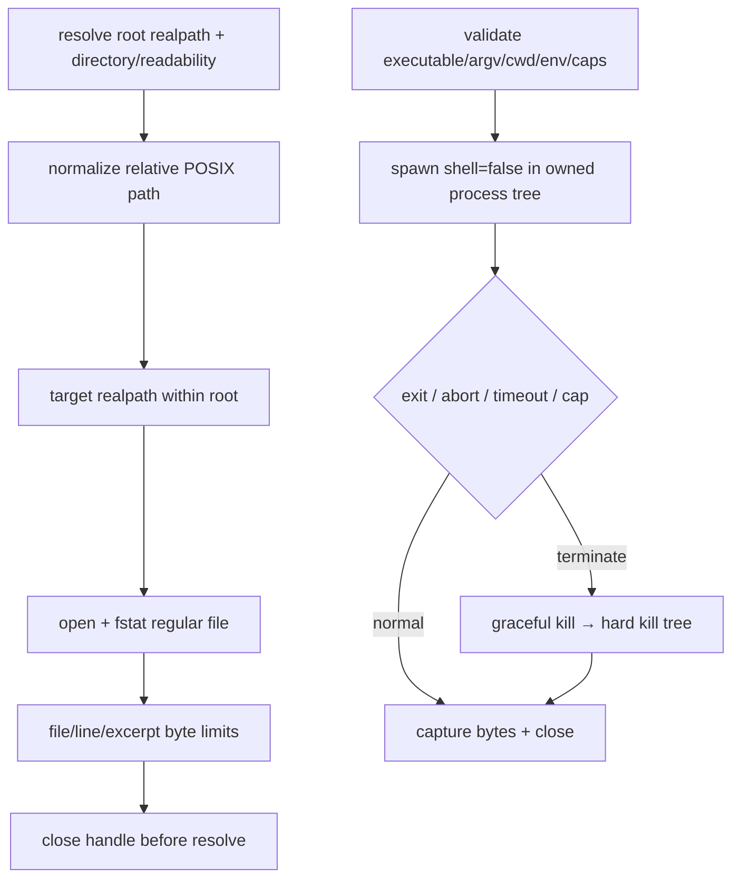

# repository-access-process-safety 设计

## 0. 术语约定

- **Repository root**：`repoPath` 经过 realpath 后得到的绝对目录；对外 EvidencePack 只使用 root-relative POSIX path。
- **RepositoryReader**：当前文件核验的唯一 filesystem seam，签名服从 roadmap 4.3。
- **SafeProcessRunner**：所有 production CLI adapter 的唯一 child-process seam；不得使用 shell string。
- **Typed failure**：reader 与 runner 的调用方只按封闭 code/kind 分支，不解析 `Error.message`。
- **权威输入**：draft requirement 提供愿景，已批准 roadmap 4.1/4.2/4.3 的路径、状态和 port 契约是硬约束。

## 1. 决策与约束

### 需求摘要

在任何真实仓库检索前建立 filesystem/process 安全底座：root 与每次目标读取都做 canonical path 防线，文件大小/行数/excerpt 有硬上限，child process 只接受 executable+argv+cwd，stdout/stderr 独立限流捕获，AbortSignal/timeout/output overflow 都终止整个进程树并一次性 settle。

### 复杂度档位

安全严格档位。路径越界、资源超限、abort 与进程失败必须可判别；Windows reparse point 和 process-tree cleanup 必须有真实 filesystem/helper-process integration tests。

### 关键决策

- RepositoryReader 保持 roadmap 的 Promise 返回签名；失败通过 `RepositoryAccessError` 封闭 code 暴露，不改变已批准 port。
- root/evidence path escape 是 fatal，映射 `PATH_OUTSIDE_ROOT` 并立即终止；普通不可读/非 regular/binary/定位失败成为 `UNVERIFIED_FILE_CONTENT`；file/excerpt/line 上限成为对应 limit；abort/deadline 由 service 映射 `timeout`。
- SafeProcessRunner 返回 discriminated union，不把 non-zero/abort/timeout/output-limit 混成异常文本；只有 runner invariant 才抛未捕获异常。
- runner 强制 `shell:false`、stdio capture、受控环境、独立 stdout/stderr byte caps；不得 `inherit` 父 stdout。
- child 在独立 process group/tree 中启动；abort、timeout 或 cap overflow 先发 graceful termination，短 grace 后 hard kill，等待 close 并清除 listeners/streams 后 settle。
- local stable filesystem 是 MVP 支持模型：reader 在 read 前 realpath、open 后 fstat 并要求 regular file；Node/Windows 无法完全消除 reparse-point TOCTOU，作为 residual risk 由真实 fixture 和支持边界控制。

### 明确不做

- 不实现搜索策略、classification、redaction 或最终 LocateStatus 裁决。
- 不允许 root 外读取、绝对 evidence path、`..` escape、directory/device/socket/pipe 等非 regular file。
- 不允许 shell 拼接、父 stdio inherit、无界 output、进程只 kill 直系 child 后立即 resolve。
- 不把 SafeProcessRunner failure 直接写成 BackendReasonCode；具体 adapter 负责封闭映射。

### 基线、依赖、风险与交付物

- 基线 commit：`04b04f7a1314f322e82157363ced505e2199cfc8`。
- 前置：`repository-evidence-foundation` 必须 accepted，提供 tokens、contracts 和真实 unit runner。
- Top 3 风险：symlink/reparse TOCTOU、Windows descendant 泄漏、恶意 output 内存耗尽。分别由 read 前后核验、process-tree fixture、byte caps + kill tests 缓解。
- 关键假设：目标是本机开发仓库而非对抗性远程 filesystem；Node 运行时具备 AbortSignal 和跨平台 child process API。
- 交付物：`NodeRepositoryReader`、`RepositoryAccessError`、`RepositoryReadLimits`、`SafeProcessRunner` contract/implementation、Nest providers、filesystem 与 helper-child fixtures、命令日志。
- 清洁度：禁止临时 stdout/debug、无来源 TODO/FIXME、注释掉代码、死 import；正式 runner stderr diagnostics 不属于临时 debug。

## 2. 名词与编排

### 2.1 名词层

**现状**：F1 只提供 token/module skeleton；没有 real reader/process provider。F2 用 production provider 替换 fail-closed `REPOSITORY_READER`，但不接搜索后端。

**RepositoryReader failure contract**：

```ts
export type RepositoryAccessErrorCode =
  | 'INVALID_REPOSITORY'
  | 'PATH_OUTSIDE_ROOT'
  | 'INVALID_RELATIVE_PATH'
  | 'NOT_REGULAR_FILE'
  | 'FILE_UNREADABLE'
  | 'BINARY_FILE'
  | 'INVALID_LINE_RANGE'
  | 'MAX_FILE_BYTES_REACHED'
  | 'MAX_EXCERPT_BYTES_REACHED'
  | 'ABORTED';

export class RepositoryAccessError extends Error {
  readonly code: RepositoryAccessErrorCode;
  readonly relativeFile?: string;
}
```

错误 message 不含 repository 绝对路径或原始敏感内容。唯一所有者与下游动作：

| Reader code | 所有者/动作 |
|---|---|
| `INVALID_REPOSITORY` | service → `RepoNavToolError.INVALID_REPOSITORY` |
| `PATH_OUTSIDE_ROOT` / `INVALID_RELATIVE_PATH` | service 立即终止 → `PATH_OUTSIDE_ROOT` |
| `NOT_REGULAR_FILE` / `FILE_UNREADABLE` / `BINARY_FILE` / `INVALID_LINE_RANGE` | engine 排除 → `UNVERIFIED_FILE_CONTENT` |
| `MAX_FILE_BYTES_REACHED` / `MAX_EXCERPT_BYTES_REACHED` | engine 记录对应 roadmap limit；`maxExcerptLines` 触发也折叠为 schema v1 已有的 `MAX_EXCERPT_BYTES_REACHED`，不新增协议 code；最终 status 由整轮 orchestration 决定 |
| `ABORTED` | engine 停止接收结果；service 按 caller abort/deadline 生成 timeout 语义 |

`resolveRoot` 只接受存在、可读、realpath 后为目录的 repo；`readRange/findMatches` 只接受 normalized relative POSIX path，并在每次 open 前重新核验目标 realpath 位于 root 内。

**SafeProcessRunner contract**：

```ts
export interface SafeProcessRequest {
  readonly executable: string;
  readonly argv: readonly string[];
  readonly cwd: string;
  readonly env?: Readonly<Record<string, string>>;
  readonly timeoutMs: number;
  readonly maxStdoutBytes: number;
  readonly maxStderrBytes: number;
  readonly terminateGraceMs: number;
}

export interface SafeProcessSuccess {
  readonly ok: true;
  readonly exitCode: 0;
  readonly stdout: Uint8Array;
  readonly stderr: Uint8Array;
}

export interface SafeProcessFailure {
  readonly ok: false;
  readonly kind:
    | 'invalid-request'
    | 'spawn-error'
    | 'non-zero-exit'
    | 'aborted'
    | 'timeout'
    | 'stdout-limit'
    | 'stderr-limit';
  readonly exitCode: number | null;
  readonly terminationSignal: string | null;
  readonly stdout: Uint8Array;
  readonly stderr: Uint8Array;
}

export interface SafeProcessRunner {
  run(request: SafeProcessRequest, signal: AbortSignal): Promise<SafeProcessSuccess | SafeProcessFailure>;
}
```

- runner limits 使用 schema v1 固定边界：`timeoutMs` default 10_000、range 100..30_000；`maxStdoutBytes` default 4 MiB、range 1 KiB..8 MiB；`maxStderrBytes` default 1 MiB、range 1 KiB..2 MiB；`terminateGraceMs` default 500、range 50..2_000。所有数值必须是 finite positive safe integer。
- `executable/cwd` 各为 1..4096 UTF-8 bytes；argv 最多 256 项、每项最多 4096 bytes、合计最多 64 KiB；显式 env 最多 64 项，key 最多 128 bytes、value 最多 4096 bytes、合计最多 64 KiB。
- request 在 spawn 前完成校验；越界/NaN/Infinity/负数返回 `invalid-request` 且不启动 child。它属于调用方 invariant violation，adapter 不得映射为 backend unavailable。
- `invalid-request` 与 `spawn-error` 的 result 固定为 `exitCode=null`、`terminationSignal=null`、空 stdout/stderr；只有实际成功 spawn 的 kind 可以携带 captured bytes 或 termination signal。
- `env` 是显式附加环境；runner 只继承启动二进制所需的 allowlist（至少 PATH/PATHEXT/SystemRoot/TEMP/TMP，按平台存在性选择），不隐式转发所有 secrets。
- stdout/stderr caps 分别计 raw bytes；达到上限立即停止继续缓存并终止进程树，返回对应 failure kind。
- caller/adapter 将 `spawn-error` 映射 unavailable，`non-zero-exit` 映射 failed，`aborted|timeout` 映射 aborted；`invalid-request` 是内部 contract violation，由 service safe-error boundary 处理；runner 自身不知道 BackendReasonCode。

**Module/interface 检查**：reader 和 runner 是真实外部 seam，接口包含 caller 必须知道的 limits、ordering、error mode 与 cleanup；测试从 port 观察，不 mock Node fs/child_process 的内部调用顺序。

### 2.2 编排层



- reader 在每个 async boundary 前后检查同一 AbortSignal；abort 后完成的 read 结果被丢弃，handle 在 settle 前关闭。
- runner 只允许一次 settle；`error`、`exit`、`close`、abort 和 timer 竞争由内部 state machine 合并，timer/listener/stream 在 settle 前清理。
- stdout/stderr 永远是 pipes；child diagnostics 不得进入 MCP server 的父 stdout。
- process-tree helper 必须启动一个 descendant；测试核验 timeout/abort 后直系 child 与 descendant 都退出。

### 2.3 挂载点清单

- `REPOSITORY_READER` provider：由 fail-closed placeholder 替换为 `NodeRepositoryReader`。
- `SafeProcessRunner` provider：使用 `RepositoryBackendsModule` 内部 class token，不新增第五个跨 module `Symbol.for` token；它是后续 Ripgrep/CodeGraph adapter 的唯一进程入口。
- Repository safety contracts public export：reader/runner typed errors 与 limits 的唯一来源。

### 2.4 推进策略

1. **root/path/file-type 防线**：invalid repo、绝对/`..`、symlink/reparse escape、directory/device cases 可判定。
   验证：`npm test -- --group repository-safety --case windows-reparse-policy`
2. **reader 资源与 failure mapping**：file/excerpt/line/binary/abort cases 返回正确 typed code 且 handle 关闭。
   验证：`npm test -- --group reader-limits --group reader-failures`
3. **SafeProcessRunner contract**：special argv、controlled env、non-zero/spawn error、stdout/stderr caps 与父 stdout 隔离通过。
   验证：`npm test -- --group process-contract --group process-output-isolation`
4. **取消与 process-tree cleanup**：abort/timeout/cap overflow 只 settle 一次，child/descendant、timer、listener、stream 全部清理。
   验证：`npm test -- --group process-cleanup --case reader-abort-no-late-completion`

### 2.5 结构健康度与微重构

##### 评估

- 文件级：F1 新文件不搬迁；只通过 provider replacement 扩展。
- 目录级：filesystem 与 process 属于 repository infrastructure，可共用 safety contracts，但 reader/runner implementation 分文件，避免单文件承担两类资源生命周期。
- Compound：未发现既有目录 convention。

##### 结论：不做微重构

F2 只新增真实 seams；不重排 F1 contracts/module skeleton。

## 3. 验收契约

### 3.1 关键场景

- root 不存在/不可读/非目录返回 `INVALID_REPOSITORY`；相对 path escape、symlink/reparse 越界立即返回 `PATH_OUTSIDE_ROOT`，不读取目标内容。
- 目录、特殊文件、binary、非法范围、不可读文件被 typed failure 区分；file limit 独立产生 `MAX_FILE_BYTES_REACHED`，excerpt bytes 与 excerpt lines 两个触发 fixture 都稳定折叠为同一个公共 `MAX_EXCERPT_BYTES_REACHED`。
- executable 与含空格/引号/`&|;[]` 的 argv 保持参数边界，`shell:false`，不存在命令与非零退出可区分。
- child stdout/stderr 各自超限会终止树；任何 child 输出都不污染父 stdout。
- reader abort 后无迟到 completion 交给下游；runner abort/timeout 后 direct child 与 descendant 都退出，promise 只 settle 一次。

### 3.2 明确不做的反向核对

- 搜索/classification/status/redaction 不得进入 safety module。
- 不得根据 `Error.message`、stderr 文本或平台本地化字符串决定 domain branch。
- 不得使用 shell string、`stdio: inherit`、无界 Buffer 或只 kill 直系 child 的清理路径。

### 3.3 Acceptance Coverage Matrix

| Scenario | Covered By Step | Evidence Type | Command / Action | Core? |
|---|---|---|---|---|
| root/symlink/reparse/file type | S1 | real filesystem integration | repository-safety group | yes |
| reader limits/typed failures/handle close | S2 | unit + filesystem integration | reader-limits/failures groups | yes |
| argv/env/output isolation/failure union | S3 | helper process integration | process-contract/isolation groups | yes |
| abort/timeout/tree cleanup/no late result | S4 | helper child + resource assertions | process-cleanup + reader abort | yes |

### 3.4 DoD Contract

| ID | 要求 | 证据 | 阻塞级别 |
|---|---|---|---|
| DOD-DESIGN-001 | design/checklist/review 完整并获 owner 批准 | design review | blocking |
| DOD-IMPL-001 | typed seams 与真实 fixtures 完成 | checklist/diff/logs | blocking |
| DOD-REVIEW-001 | code review passed，重点审跨平台清理 | review report | blocking |
| DOD-QA-001 | Windows 与当前开发平台真实 filesystem/process cases 运行 | QA report | blocking |
| DOD-ACCEPT-001 | acceptance 记录支持模型与 residual risk | acceptance | blocking |

Validation Commands:

| ID | 命令 | 目的 | 核心性 | 失败处理 |
|---|---|---|---|---|
| CMD-BUILD | `npm run build` | 编译 | core | fix-or-block |
| CMD-TYPECHECK | `npm run typecheck` | strict 类型检查 | core | fix-or-block |
| CMD-READER | `npm test -- --group repository-safety --group reader-limits --group reader-failures` | filesystem contract | core | fix-or-block |
| CMD-PROCESS | `npm test -- --group process-contract --group process-output-isolation` | process contract | core | fix-or-block |
| CMD-CLEANUP | `npm test -- --group process-cleanup --case reader-abort-no-late-completion` | resource lifecycle | core | fix-or-block |

Required Artifacts: design-review、typed contract exports、filesystem fixture inventory、helper-child source、command logs、resource cleanup evidence、review、QA、acceptance。

## 4. 与项目级架构文档的关系

Acceptance 回填 Repository Backends 的 filesystem/process seams、provider 与跨平台支持模型。若 process-tree 和 typed safety failures 落地稳定，建议记录为 architecture constraint ADR。
