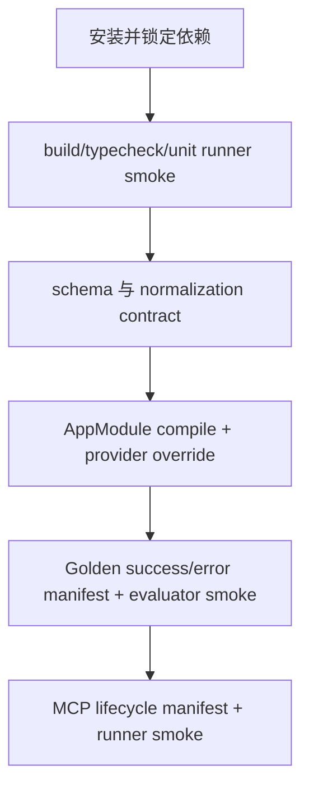

# repository-evidence-foundation 设计

## 0. 术语约定

- **Feature**：`repository-evidence-foundation`，与 roadmap item 一一对应。
- **权威输入**：`source-of-truth-evidence` requirement 仍为 draft；owner 已批准并激活的 `repo-nav-mvp` roadmap 第 3/4 节是当前实现硬约束。
- **GoldenCase**：只包含 `GoldenSuccessCase | GoldenErrorCase`；不包含 stdio 生命周期。
- **McpLifecycleCase**：独立描述 stdout cleanliness 与 graceful shutdown，由 MCP runner 执行。
- **运行时 schema**：Zod schema 是唯一运行时来源；TypeScript 类型必须由 schema inference 导出，不维护手写镜像类型。

## 1. 决策与约束

### 需求摘要

建立可实际执行的 NestJS 11 standalone、TypeScript 5.8 strict、Zod schema、DI token/module skeleton、fixture contract 与 unit/golden/MCP 三类测试入口。F1 不做真实检索或 MCP tool；成功标准是所有公共契约可由真实 runner 解析和判定，后续 F2-F4 能替换 provider 而不改协议。

### 复杂度档位

采用严格档位：输入 byte budget、封闭枚举、ID/排序、DI 替换和 fixture 判别联合必须由类型与测试锁定；不以占位脚本伪造 runner 成功。

### 关键决策

- NestJS 11 只创建 application context；F1 不提供 `main.ts`，不启动 HTTP 或 stdio production bootstrap。
- `LocateRequest`、`LocateResult`、`EvidencePack`、reason/status/ID/排序常量以 roadmap schema v1 为准。
- 四个 `Symbol.for(...)` runtime tokens 是跨 module 唯一 injection seam；backend collection 是唯一多 adapter assembly point。
- F1 的 backend collection 是空只读数组；reader/service 注册 fail-closed 的 unconfigured provider，仅用于 module compile 与 test override，调用即抛 `RepoNavBootstrapIncompleteError`，绝不返回伪 EvidencePack。
- Golden success/error 共用判别联合和 evaluator contract；MCP lifecycle 使用独立 schema、manifest 和 runner。
- F1 必须建立并真实运行 `build`、`typecheck`、unit、golden、MCP 五个入口；MCP runner 此时只验证 runner/lifecycle manifest harness，不冒充已经存在的 `repo_nav_locate`。

### 明确不做

- 不实现 RepositoryReader、RipgrepBackend、Evidence Engine 或 `repo_nav_locate`。
- 不引入 LLM、HTTP/Fastify listener、数据库或持久化。
- 不恢复 session/trace/impact/plan 等旧表面。
- 不让 production source 依赖 Verification Kit，不把 test fake 注册成 production 默认。

### 基线、依赖、风险与交付物

- 基线 commit：`04b04f7a1314f322e82157363ced505e2199cfc8`；当前无 package、src、test 实现。
- Roadmap 前置 item：无。
- Top 3 风险：schema 与 roadmap 漂移；placeholder 被误当真实实现；runner 名存实亡。分别由 schema projection tests、fail-closed provider tests、runner smoke 阻断。
- 非显然依赖：Node/NestJS/TypeScript/Zod/MCP SDK 和测试框架的精确版本必须在 lockfile 固定；稳定 MCP SDK API 在 F4 实现时再次核验。
- 交付物：工程/lockfile、公共 schema exports、runtime tokens/module skeleton、Golden success/error contracts、独立 lifecycle contract、真实 runners、合成 manifest 样例与命令日志。
- 清洁度：禁止临时 stdout/debug、无来源 TODO/FIXME、注释掉代码、死 import、同名 runner shim。

## 2. 名词与编排

### 2.1 名词层

**现状**：仓库只有已批准 roadmap、draft requirement 和 Git baseline，没有可复用代码模块。

**变化与依赖方向**：

```text
src/contracts/                   # production-safe Zod schemas、inferred types、schema v1 constants
src/runtime/tokens.ts            # 四个 Symbol.for runtime tokens
src/app/app.module.ts            # 只组装 module skeleton
src/app/create-application-context.ts
src/evidence/evidence.module.ts  # F1 fail-closed service seam，F3 替换
src/repository/repository-backends.module.ts # F1 empty collection，F2/F3/F6 扩展
testkit/contracts/               # GoldenCase、McpLifecycleCase schemas
testkit/manifests/               # 纯合成 YAML fixtures
testkit/runners/                 # unit/golden/MCP runner 入口
test/                            # contract、DI、runner smoke tests
```

依赖只能是 `src/app → src/evidence|src/repository|src/contracts`、production modules → `src/contracts|src/runtime`、`testkit/test → src`。`src/**` 不得 import `testkit/**` 或 `test/**`。

**公共契约**：

- `src/contracts` 导出 request/result/evidence schema、inferred readonly types、schemaVersion、reason/status/priority tables、normalization/ID canonicalization helpers。
- `testkit/contracts` 定义 `GoldenCase = GoldenSuccessCase | GoldenErrorCase` 和独立 `McpLifecycleCase`；两者不得以可选字段拼成一个“大而全”schema。
- `REPOSITORY_SEARCH_BACKENDS` 默认解析为 `Object.freeze([])`；`REPOSITORY_READER` 与 `REPOSITORY_EVIDENCE_SERVICE` 默认解析为 fail-closed unconfigured provider。
- `MCP_STDIO_HOST` 在 F1 只声明 token，不注册 production provider；F4 才挂载。

**Module/interface 检查**：module seam 隐藏 Nest runtime 细节；schema seam 隐藏 Zod parse 与 byte budget；Verification Kit 只从公共 interface 观察结果。test module 必须通过 `overrideProvider(...).useValue(...)` 替换 reader、service、backend collection，不 mock Evidence Engine 内部。

### 2.2 编排层



- AppModule 在 F1 只要求 application context 可创建/关闭；调用未配置 reader/service 必须稳定失败，禁止 production bootstrap。
- test factory 先导入同一个 AppModule，再 override 三个 runtime seams；它必须证明空 collection 顺序稳定、fake replacement 生效、context close 可观察。
- Golden runner parse 判别联合并调用共享 expectation evaluator；F1 只用 synthetic results 证明 evaluator/manifest 可判别。
- MCP runner parse `McpLifecycleCase` 并可启动 synthetic stdio fixture child，证明 frames-only/exit/timeout harness 可用；不声称已测试真实 MCP host。
- 所有 runner 的诊断写 stderr，机器结果写约定输出；失败必须非零退出。

### 2.3 挂载点清单

- `package.json` scripts：`build`、`typecheck`、`test`、`test:golden`、`test:mcp`。
- `AppModule` 与 `createRepoNavApplicationContext()`：standalone context 的唯一 production assembly root。
- `src/contracts` 与 `src/runtime/tokens.ts`：后续 modules 的唯一公共协议入口。
- `testkit/runners` + versioned manifest directories：Golden/MCP 验证入口。

### 2.4 推进策略

1. **工程与 runner 基线**：五个稳定入口都真实启动并正确传播退出码。
   验证：`npm run build && npm run typecheck && npm test -- --group runner-smoke && npm run test:golden -- --case runner-smoke && npm run test:mcp -- --case runner-smoke`
2. **公共 schema**：literal/NFKC/UTF-8 byte/case/封闭枚举/ID/排序 tests 通过。
   验证：`npm test -- --group contract --case term-case-parity`
3. **DI skeleton**：context compile/close、fail-closed provider、fake override 与有序 collection tests 通过。
   验证：`npm test -- --group di`
4. **Golden contract**：success/error 判别联合、required/forbidden/exclusion assertions 可判别。
   验证：`npm run test:golden -- --case manifest-schema --case evaluator-smoke`
5. **MCP lifecycle contract**：独立 lifecycle schema 与 synthetic stdio harness 可判别。
   验证：`npm run test:mcp -- --case lifecycle-manifest-schema --case runner-smoke`

### 2.5 结构健康度与微重构

##### 评估

- 文件级：无旧实现文件可搬迁。
- 目录级：以 production/testkit 单向依赖建立初始边界，避免将 manifests 混入 `src`。
- Compound：未发现既有目录 convention。

##### 结论：不做微重构

这是 no-code baseline 上的新能力；目录树属于首次建模，不伪装成重构。

## 3. 验收契约

### 3.1 关键场景

- 全新 checkout 安装依赖后，五个 scripts 均运行真实程序；不存在的 case 或断言失败返回非零退出。
- 超 byte budget、空 terms、regex-like literal、smart-case 混合输入分别得到稳定 parse 结果；schema enums/priority tables 与 roadmap v1 一致。
- AppModule 可 create/close；未替换 provider 的业务调用 fail closed；override 后 fake reader/service/backend 可从公开 token 解析。
- Golden success/error manifests 可区分，错误 case 能表达 schema-invalid `requestJson`；lifecycle 字段不能进入 GoldenCase。
- `McpLifecycleCase` runner 能核验 synthetic child 的 frames-only stdout、exit code 与 maxShutdownMs；它不解析 LocateResult。

### 3.2 明确不做的反向核对

- package 不得出现 HTTP server adapter、数据库 client、LLM client 或真实搜索实现。
- production graph 不得返回 fabricated EvidencePack；F1 service/reader 未配置时必须 fail closed。
- `src/**` 不得依赖 `testkit/**`；GoldenCase 不得包含 lifecycle optional fields。

### 3.3 Acceptance Coverage Matrix

| Scenario | Covered By Step | Evidence Type | Command / Action | Core? |
|---|---|---|---|---|
| 五类入口真实可运行 | S1 | command/exit code | runner-smoke 聚合命令 | yes |
| schema/normalization/ID/排序 | S2 | unit + schema snapshot | `npm test -- --group contract --case term-case-parity` | yes |
| DI fail-closed 与 override | S3 | Nest integration | `npm test -- --group di` | yes |
| Golden success/error contract | S4 | manifest/evaluator | `npm run test:golden -- --case manifest-schema --case evaluator-smoke` | yes |
| 独立 lifecycle contract | S5 | MCP harness | `npm run test:mcp -- --case lifecycle-manifest-schema --case runner-smoke` | yes |

### 3.4 DoD Contract

| ID | 要求 | 证据 | 阻塞级别 |
|---|---|---|---|
| DOD-DESIGN-001 | design/checklist/review 完整并获 owner 批准 | design review | blocking |
| DOD-IMPL-001 | steps/checks 完成且交付物可核验 | checklist/diff/logs | blocking |
| DOD-REVIEW-001 | code review passed | review report | blocking |
| DOD-QA-001 | 五类入口与全部核心场景实际运行 | QA report | blocking |
| DOD-ACCEPT-001 | acceptance 回写 roadmap 与 artifact inventory | acceptance | blocking |

Validation Commands:

| ID | 命令 | 目的 | 核心性 | 失败处理 |
|---|---|---|---|---|
| CMD-BUILD | `npm run build` | 编译生产与 testkit | core | fix-or-block |
| CMD-TYPECHECK | `npm run typecheck` | strict 类型检查 | core | fix-or-block |
| CMD-UNIT | `npm test -- --group runner-smoke --group contract --group di` | unit/contract/DI | core | fix-or-block |
| CMD-GOLDEN | `npm run test:golden -- --case runner-smoke --case manifest-schema --case evaluator-smoke` | Golden runner 与判别联合 | core | fix-or-block |
| CMD-MCP | `npm run test:mcp -- --case runner-smoke --case lifecycle-manifest-schema` | MCP harness 与独立 lifecycle schema | core | fix-or-block |

Required Artifacts: design-review、package/lockfile、目录与 export inventory、schema/manifest 样例、真实 command logs、diff summary、review、QA、acceptance。

## 4. 与项目级架构文档的关系

当前无实现 architecture。Acceptance 必须按实际目录和 provider graph 回填模块地图；schema v1、runtime tokens、production/testkit 单向依赖若落地稳定，建议进入 ADR。
