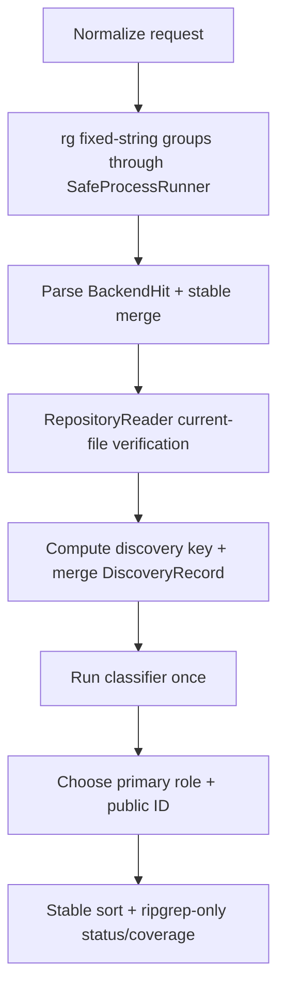

# text-source-evidence-engine 设计

## 0. 术语约定

- **Discovery hit**：backend 给出的未核验 file/symbol/line/reason fact，不是 evidence。
- **DiscoveryRecord**：当前文件核验成功后、classification 前按 discovery key 合并的内部记录。
- **Direct mapping recognizer**：只识别本设计列出的封闭语法；无法证明时降为 candidate/excluded，绝不猜 confirmed。
- **F3 baseline**：只有 RipgrepBackend；CodeGraph、sibling candidate、MCP transport 与完整 F7 guardrails 尚未加入。
- **权威输入**：draft requirement + 已批准 roadmap 4.1-4.3、4.6-4.7。

## 1. 决策与约束

### 需求摘要

用 F2 的 SafeProcessRunner 和 RepositoryReader 建立第一条可运行 source-of-truth 路径：literal ripgrep discovery → 当前文件核验 → discovery merge → 单次 classification → canonical ID/排序 → baseline LocateResult。核心目标不是扩大召回，而是证明 direct mapping 可以 confirmed，DTO/entity/test/docs/comment decoys 不会 false-confirmed，并在 coverage/exclusion 中留下可核验事实。

### 复杂度档位

证据严格档位。confirmed recognizer 使用封闭、保守、table-driven 规则；任意未支持 syntax 只能 candidate/excluded。文本方案不宣称等价于 AST/framework 语义。

### 关键决策

- RipgrepBackend 只产 discovery facts；使用 `rg --fixed-strings --json`，按每个 term/anchor 的 `caseSensitive` 分组执行，稳定合并。
- backend hit 必须通过 RepositoryReader；有 lines 用 `readRange`，否则在该 file 内 `findMatches`。
- merge 顺序固定为：核验 → discovery key → 合并 provenance/reasons → classifier 执行一次 → primary role → public ID → stable sort。不得先分类再 merge。
- recognizer 对一个核验位置最多读取 12 行且不超过 4 KiB 的 logical window；超过窗口不确认。
- direct mapping confirmed 只支持下表三类可执行形式；comments/type declarations/docs/tests 不得 confirmed。
- F3 输出完整 `LocateResult` schema，但只冻结 ripgrep-only 状态/coverage baseline；F6/F7 只能扩展 attempts/guardrails，不能改已有语义。

### MVP direct-mapping truth table

| 已核验形式 | 可确认 predicate | 输出 | 反例/降级 |
|---|---|---|---|
| assignment | 同一 executable statement 中 exact requested source/target tokens 位于 `target = source` 两侧 | confirmed / `value-mapping` / `DIRECT_ALIAS_MAPPING`,`EXACT_TERM_MATCH` | equality、type default、comment/string example、只有一侧可定位 → candidate |
| return/object mapping | object property `target: source` 位于 `return`、assignment RHS 或 call argument 的 object literal 中，source/target 都是 exact token | 同上 | interface/type/DTO decorator metadata、shorthand、只有同名 property → candidate |
| SQL alias | `.sql` 文件中的 statement，或 source string/template 直接作为 `query|select|addSelect` call argument；包含 exact `source AS target` identifier pair | 同上 | docs/test/example string、未绑定上述 executable context、模糊 alias → candidate |
| explicit symbol anchor implementation/definition | caller 提供 symbol anchor，backend canonical symbol 已按 case metadata 匹配，window 是 implementation/definition body | confirmed / `execution-site|definition` / `EXACT_SYMBOL_ANCHOR` | import/reference/call site → candidate |
| exact term only | 当前文件存在 exact/normalized term，但不满足上面规则 | candidate / `reference|related` / `EXACT_TERM_WITHOUT_DIRECT_MAPPING` | negative/layer/unverified 按 exclusion 处理 |

Recognizer 必须做轻量 lexical segmentation，区分 code/comment/string/type declaration；它不是通用 parser。测试或 docs path 即使含 syntactic mapping 也不得 confirmed；caller 包含 `test|docs` layer 时可作为 candidate，否则计 `OUTSIDE_LAYER_HINT`。

**Deterministic layer/path resolver**：reader 已把路径规范化为 POSIX relative path；resolver 再按以下固定优先级分类：

1. `test`：任一目录 segment 为 `test|tests|__tests__|spec|specs|fixtures|__fixtures__`，或 basename 含 `.spec.` / `.test.`；
2. `docs`：任一目录 segment 为 `docs|documentation|examples`，或扩展名为 `.md|.mdx|.rst|.adoc`；
3. 其他 layer 只按 caller 显式 path/layer hints 与已知 top-level segment 匹配，无法确定则 `unknown`。

Windows `\` 在 resolver 前必须已转换为 `/`；segment 与扩展比较使用 ASCII-insensitive 规则。test 优先于 docs。即使 caller 显式包含 test/docs，相关 mapping 也最多 candidate；caller layers 排除解析出的 layer 时计 `OUTSIDE_LAYER_HINT`。F3 不凭未知目录名猜 client/server/db。

### 明确不做

- 不做 sibling/alias-neighbor candidate expansion，不接 MCP/CodeGraph。
- 不输出数字 confidence，不从排名推断 confirmed。
- 不支持跨 12 行/4 KiB window、dynamic property、computed alias、宏/模板生成等 syntax；未支持形式只降级。
- 不吞掉 decoy：candidate/excluded/duplicate 必须进入结果或 exclusion summary。

### 基线、依赖、风险与交付物

- 基线 commit：`04b04f7a1314f322e82157363ced505e2199cfc8`。
- 前置：F1 accepted 的 schemas/runners/DI；F2 accepted 的 reader/process typed seams。
- Top 3 风险：false confirmed、case-group merge 漂移、ripgrep failure 被误报 no_result。分别由封闭 truth table 正反 fixtures、permutation tests、状态表锁定。
- 关键假设：MVP 接受“少确认、可解释”，而不是用启发式扩大 confirmed；SQL recognizer 仅承诺表中上下文。
- 交付物：RipgrepBackend、RepositoryEvidenceService baseline、DiscoveryRecord/recognizer policy、classification fixture table、ripgrep-only status/coverage snapshots、命令日志。
- 清洁度：禁止临时 stdout/debug、无来源 TODO/FIXME、注释掉代码、死 import；rg stderr 只进入 diagnostics，不进入 protocol values。

## 2. 名词与编排

### 2.1 名词层

**现状**：F1/F2 提供 contracts、DI、runner、reader、process seam；backend collection 尚无真实 search backend，service provider fail closed。

**变化**：

```ts
interface DiscoveryRecord {
  readonly discoveryKey: string;
  readonly location: EvidenceLocation; // unredacted current-file excerpt
  readonly discoveredBy: readonly EvidenceSource[];
  readonly operations: readonly EvidenceOperationCode[];
  readonly discoveryReasonCodes: readonly DiscoveryReasonCode[];
  readonly matchedTerms: readonly NormalizedSearchTerm[];
  readonly canonicalSymbol?: string;
}
```

- discovery key 严格使用 roadmap 4.7 的 relative file/start/end/unredacted normalized excerpt hash。
- 相同 key 跨 case groups/重复 rg hits 先合并；source/reasons/operations 依 schema priority 去重。
- classifier 每个 record 只运行一次，role priority 固定 `value-mapping > execution-site > definition > reference > related`。
- public ID 在 classification 后生成，full SHA-256，不截断；redaction 留给 F7，不能改变 ID。
- `RepositoryBackendsModule` 在 F3 导出 `[RipgrepBackend]`；`EvidenceModule` 用 `useExisting` 把 service token 指向默认 engine。
- F3 baseline candidate 的 promotion requirements 已可序列化：`EXACT_TERM_WITHOUT_DIRECT_MAPPING → [USER_SEMANTIC_CONFIRMATION, DIRECT_REFERENCE_REQUIRED]`；`SYMBOL_REFERENCE_ONLY → [DIRECT_REFERENCE_REQUIRED, CALL_PATH_REQUIRED]`。F5 只能集中扩展/校验全表，不能改这两项既有语义。

**F3 ripgrep-only status/coverage baseline**：

| 条件 | status | coverage/nextActions |
|---|---|---|
| ripgrep complete + 已核验证据 + 无 limit | `ok` | backends 仅 ripgrep used；`fallbackChecked=false`; `indexState=unknown`; `indexFreshness=not-applicable`; candidate 时 `CONFIRM_CANDIDATE` |
| ripgrep complete + 无 hit/全部核验失败 | `no_result` | ripgrep `RIPGREP_NO_RESULT` 或 exclusions；ADD_TERM, ADD_SYMBOL_ANCHOR 稳定顺序 |
| spawn unavailable/failed + 无证据 | `backend_unavailable` | ripgrep unavailable/failed attempt；不伪造 no_result |
| max files/file/excerpt 或 backend complete=false 阻止完成 | `partial` | 对应 limits/coverage；caller 可调时 `RETRY_WITH_HIGHER_LIMIT` |
| internal deadline/caller abort | `timeout` | 只保留 deadline 前完成 evidence；内部 deadline 且未达 30s 才给 RETRY，caller abort 无 action |

CodeGraph 未参与时不生成虚假的 CodeGraph attempt；index state 保持 `unknown`，freshness 为 `not-applicable`。

### 2.2 编排层



- negative term/layer filters在 classification 前执行；excluded location 不进入 public evidence，但 minimum exclusion counts 可观察。
- duplicate location 合并后只生成一个 public evidence，并按 `DUPLICATE_LOCATION` 计数。
- hit verification failure 计 `UNVERIFIED_FILE_CONTENT`；如果 ripgrep 完成，最终可为 no_result，而非 backend failure。
- 任一 PATH_OUTSIDE_ROOT 立即终止为 tool error；其他 reader typed failures按 F2 ownership 表处理。

### 2.3 挂载点清单

- `RepositoryBackendsModule`：backend collection 从 empty 变为 `[RipgrepBackend]`。
- `EvidenceModule`：`REPOSITORY_EVIDENCE_SERVICE` 从 fail-closed placeholder 切到默认 engine。
- classification policy/truth-table constants：confirmed/candidate baseline 的唯一决策入口。

### 2.4 推进策略

1. **Ripgrep adapter**：literal/case/argv/parser/no-result/unavailable/abort contract 稳定。
   验证：`npm test -- --group ripgrep-backend`
2. **核验与 discovery merge**：跨 case-group/重复 hit 合并为单一 record，discovery key/provenance 稳定；此步不生成 public class/ID。
   验证：`npm test -- --group evidence-merge`
3. **封闭 classifier + public ID/order**：支持形式 confirmed，DTO/entity/test/docs/comment/unsupported syntax 不误确认；每个 merged record 只分类一次，再选择 role/计算 ID/排序，exclusion counts 不静默消失。
   验证：`npm test -- --group direct-mapping-classifier --group evidence-id-order && npm run test:golden -- --case source-field-mapping --case false-confirmation-decoys --case exclusion-summary`
4. **service baseline**：ripgrep-only 状态/coverage/nextActions 每字段 snapshot 与 fault cases 通过。
   验证：`npm run test:golden -- --case text-engine-baseline --case ripgrep-unavailable --case ripgrep-failed --case ripgrep-incomplete --case ripgrep-timeout`

### 2.5 结构健康度与微重构

##### 评估

- 文件级：不搬 F1/F2 文件；新增 backend adapter、engine orchestration、classification policy 三个职责文件。
- 目录级：adapter 属 repository infrastructure；merge/classification/status 属 Evidence Engine；禁止把 rg JSON parsing 放入 engine。
- Compound：未发现既有目录 convention。

##### 结论：不做微重构

通过既有 module seams 挂载；不重排前置实现。

## 3. 验收契约

### 3.1 关键场景

- 含 regex 元字符和 smart-case 混合 terms 仍按 literal/per-term case 查询；argv 不经 shell。
- 相同 location 被多个 groups/hits 发现时 S2 只形成一个 merged record；S3 对其只分类一次并生成一个 public evidence，ID/排序不随 hit permutation 改变。
- assignment/object/SQL 支持形式产出 confirmed；DTO/entity definition、test/docs/comment、unsupported multiline/dynamic form 不得 confirmed。
- `source-field-mapping` 同时断言 confirmed mapping、candidate decoy、forbidden IDs、reason/role；`exclusion-summary` 对 layer/negative/duplicate/unverified 最小计数逐项断言。
- ripgrep ok/no-result/unavailable/failed/incomplete/timeout 与全核验失败分别得到 F3 状态表中的唯一 result。

### 3.2 明确不做的反向核对

- sibling/neighbor/secondary-backend policy 与 MCP transport 不得出现在实现。
- 任意未列入 truth table 的 syntax 不得 confirmed；ranking 不得改变 evidence class。
- backend discovery 不得直接构造 ConfirmedEvidence/CandidateEvidence。

### 3.3 Acceptance Coverage Matrix

| Scenario | Covered By Step | Evidence Type | Command / Action | Core? |
|---|---|---|---|---|
| literal/case/process/parser | S1 | adapter unit/integration | ripgrep-backend group | yes |
| verification/discovery key/merge/provenance | S2 | unit + permutation tests | evidence-merge group | yes |
| classifier/layer resolver/single classification/ID/order + positive/negative/exclusions | S3 | unit + Golden | classifier/id-order + three named cases | yes |
| ripgrep-only status/coverage/nextActions | S4 | Golden fault/snapshot | baseline/unavailable/failed/incomplete/timeout cases | yes |

### 3.4 DoD Contract

| ID | 要求 | 证据 | 阻塞级别 |
|---|---|---|---|
| DOD-DESIGN-001 | design/checklist/review 完整并获 owner 批准 | design review | blocking |
| DOD-IMPL-001 | adapter/engine/policy 与 fixtures 完成 | checklist/diff/logs | blocking |
| DOD-REVIEW-001 | code review passed，重点审 false-confirmed 与 seam | review report | blocking |
| DOD-QA-001 | 全部 classifier/status core cases 实际运行 | QA report | blocking |
| DOD-ACCEPT-001 | acceptance 回写模块、truth table 与 residual risk | acceptance | blocking |

Validation Commands:

| ID | 命令 | 目的 | 核心性 | 失败处理 |
|---|---|---|---|---|
| CMD-BUILD | `npm run build` | 编译 | core | fix-or-block |
| CMD-TYPECHECK | `npm run typecheck` | strict 类型检查 | core | fix-or-block |
| CMD-ADAPTER | `npm test -- --group ripgrep-backend` | literal rg adapter | core | fix-or-block |
| CMD-MERGE | `npm test -- --group evidence-merge` | verification/discovery merge/provenance | core | fix-or-block |
| CMD-CLASSIFY | `npm test -- --group direct-mapping-classifier --group evidence-id-order && npm run test:golden -- --case source-field-mapping --case false-confirmation-decoys --case exclusion-summary` | classifier/ID/order/positive/negative/exclusions | core | fix-or-block |
| CMD-BASELINE | `npm run test:golden -- --case text-engine-baseline --case ripgrep-unavailable --case ripgrep-failed --case ripgrep-incomplete --case ripgrep-timeout` | status/coverage baseline | core | fix-or-block |

Required Artifacts: design-review、truth table、Ripgrep parser fixtures、Golden manifests、status snapshots、permutation evidence、command logs、review、QA、acceptance。

## 4. 与项目级架构文档的关系

Acceptance 回填 Evidence Engine、Ripgrep adapter、classification policy 和 module assembly。Direct-mapping recognizer 的保守支持边界与 merge→classify→ID 顺序若稳定，建议记录 ADR/constraint。
