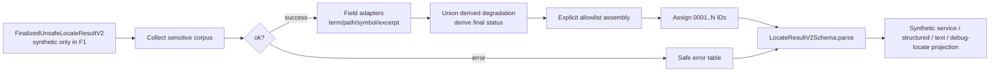

# public-output-boundary-v2 feature design

## 0. 术语约定

| 术语 | 定义 | 防冲突结论 |
|---|---|---|
| `LocateResultV2` | `ok=true` 的 EvidencePack v2 与 `ok=false` 的 safe tool error 严格联合 | 与当前 production `LocateResult` v1 并存；F1 不替换、不导出为正式 package surface |
| `FinalizedUnsafeLocateResultV2` | 已由后续 field owner 完成排序与非展示型 coverage facts、但仍可能含 raw term/path/symbol/excerpt 的内部输入 | “Finalized”只表示数组顺序与上游事实已完成；它禁止 public ID/status/schemaVersion/repositoryRef/redaction metadata，展示型 degradation 与最终 status 由 assembler 派生 |
| `PublicResultAssemblerV2` | 把 unsafe internal result allowlist 物化为 strict `LocateResultV2` 的纯函数边界 | 不等同于当前 v1 `redactLocateResult` 或 MCP serializer；F9 才负责生产 cutover |
| `SensitiveValuePolicyV2` | 对 term、path、symbol、excerpt 和控制字符执行字段适配、corpus propagation 与 metadata 生成的纯策略 | 不复用 v1 excerpt-only shape；v1 redactor 保持 production 行为不变 |
| response-local ID | 按最终 confirmed 后 candidate 顺序生成的 `evidence:v2:0001..N` | 不含 raw hash/Git object ID，只在单次 response 内有效 |
| synthetic projection | 由完整合成 raw result 经 assembler 得到的 service/MCP text/debug-locate 等值观察 | 只是 F1 test seam，不代表生产 service、MCP 或 CLI 已切换 v2 |

代码与历史 feature 中已经使用 `EvidencePack`、`EvidenceRedactor`、`LocateToolOutput`、`safe public error policy` 等名称；本设计统一加 `V2` 或 `PublicResultAssemblerV2`，不把新旧契约混为同一对象。

## 1. 决策与约束

### 需求摘要

F1 为后续 public-beta features 建立一条真实、可执行的 v2 安全边界：完整 strict schema、字段级 redaction、控制字符处理、response-local ordinal ID、safe error allowlist 和 synthetic parity/forbidden scan。成功标准是同一个完整 raw input 只能经 assembler 产生符合 `public-contract-v2.md` 的 public result，任何 raw root、Git object ID、discovery key、content hash、测试 secret 或不可信控制字符都不能穿过边界。

### 明确不做

- 不修改 `RepositoryEvidenceEngine` 的 production v1 return，不把 MCP/debug CLI locate 切换为 v2。
- 不从 v1 result 临时拼装假 v2 coverage，不为缺失的 F2/F3/F5/F6/F7/F8 facts 填空数组或 `unknown`。
- 不实现 relevance ranking、request snapshot、backend termination、scope policy 或 language adapter；只校验并安全物化调用方提供的完整 facts。
- 不改变 v1 schema、v1 evidence ID、v1 Golden snapshots、public JSON Schema、package exports 或 public docs 示例。
- 不新增 Nest provider、DI token、远程 adapter、持久化、日志或 diagnostic stderr policy。
- 不把通用 `[REDACTED]` 当作“识别全部业务私密数据”的承诺。

### 方案深度 pre-pass

| 候选 | 结论 | 原因 |
|---|---|---|
| 直接扩展 v1 schema/redactor 并用 flag 控制 v2 | 拒绝 | 会让 production v1 与未就绪 coverage producer 共享半成品语义，且无法证明没有提前 cutover |
| 只写 v2 TypeScript 类型和文档，等 F9 再实现 | 拒绝 | redaction、allowlist、ID 与 cross-field invariant 是本 feature 的安全核心，使用占位会把风险推迟到 release |
| 隔离的完整 v2 Zod schema + 纯 assembler + synthetic test seam | 采用 | 核心安全逻辑做实，同时通过 import/export guard 保持 production v1 完全不变；后续 features 只需提供真实 facts |

本能力是长期公共契约和安全边界，不使用 fake/mock 替代 assembler 核心逻辑。synthetic raw input 只替代尚未接入的 production producer，转正条件固定为 F9 完成全部依赖后原子 cutover。

### 复杂度档位

- Security = `hardened`：跨越不可信 repository 内容边界，按 threat model 覆盖 secret、path、control/bidi/ANSI 和 hash side channel。
- Testability = `verified`：strict schema、cross-field invariant、字段策略和 forbidden corpus 都必须有正反例及 completeness owner。
- Determinism = `deterministic`：相同 finalized raw facts 必须生成相同字段顺序、metadata 和连续 ID。
- Compatibility = `current-only internal v2`：production 保持 schema v1；不提供 v1/v2 双写。
- Observability = `opaque by design`：纯 assembler 不写日志，所有可观测事实只来自返回值和测试报告，避免 raw value 进入 diagnostic。
- 其余维度采用对外发布库的默认档位。

### 关键决策

1. **Schema 与组装分离但共同形成一个边界**：v2 Zod schema 定义 caller 可见约束，assembler 负责 allowlist、redaction、ordinal 和最终 parse；schema 不承担 secret 检测。
2. **assembler 接收完整、已排序但不安全的内部事实**：F1 保留数组顺序，不实现 F2 ranking；输入不携带 public ID、public status 或 output-owned metadata，避免调用方绕过连续 ID 与 status invariant。
3. **字段适配而不是单一字符串 replace**：term/symbol/excerpt 可局部替换，file 任一敏感 token 命中时整体变为 `[REDACTED_PATH]` 且 `resolvable=false`。
4. **corpus propagation 是 response 级纯计算**：先从全部 raw terms、locations 收集可证明的 sensitive token，再按字段处理，避免同一 secret 在 assignment 中被识别却从另一 excerpt/term 泄露。
5. **最终 status 由 assembler 唯一派生**：后续 features 提供 abort/backend/snapshot/scope/language 等事实；assembler union 自己产生的 `LOCATION_REDACTED`，再按 roadmap precedence 计算 status。caller 提供 status 或 `LOCATION_REDACTED` 都是 raw contract violation。
6. **错误使用固定 code policy**：unsafe message、stack、path 或 backend detail 不进入 raw error interface；四个 code 直接映射 roadmap 冻结的 message/recoverable/action。
7. **F1 不建立假 adapter seam**：assembler 是 in-process pure function；production 与 test 不需要两个 adapter，测试直接穿过同一函数。
8. **F1 的 no-cutover 是可执行契约**：production locate 仍返回 `schemaVersion='1.0'`，v2 schema/assembler 不从 package root、MCP、CLI 或 Evidence Engine 导入。

### Top 3 风险与缓解

| 风险 | 缓解 |
|---|---|
| v2 schema 已存在后被误接入 production，并以占位 coverage 冒充完成 | S1/S5 增加 import/export/no-cutover guards；full MCP/docs 继续观察 v1 |
| identifier 分词、跨字段 propagation、path/control 字符存在 false negative | S2 使用固定 hostile corpus、字段 truth table、mutation/forbidden scan；每个 reason/field 都有 owner case |
| assembler 使用 object spread 或双重 redaction，让 raw internal 字段/metadata 漂移穿过边界 | S3/S4 使用显式 allowlist construction、cross-field superRefine、placeholder collision 和 exact projection tests |

### 非显然依赖与关键假设

- 假设：F2 会向 assembler 提供最终 confirmed/candidate 顺序；F1 不验证“相关性正确”，只保序并分配 ID。
- 假设：F3/F5/F6/F7/F8 会按 roadmap contract 提供真实 coverage facts；在此之前只允许 synthetic complete input。
- F9 独占 production cutover、package export、MCP JSON Schema、CLI/docs 和 v1 retirement。
- 当前 v1 full baseline 在安装 lockfile 依赖后通过：build、typecheck、168 unit、64 active Golden、39 MCP 和 docs smoke；`npm audit` 的 2 moderate/1 high 仅记录为依赖基线，不在本 feature 运行自动修复。
- `codestable-doctor` 的既有 debug-cli review P1 不属于本 feature diff，不能用它掩盖本 feature 新 finding。

## 2. 名词与编排

### 2.1 名词层

#### 现状

- `src/contracts/evidence.ts` 的 strict Zod schema 只描述 v1，并要求 `repositoryRoot`、`evidence:v1:{sha256}` 和 excerpt-only redaction。
- `src/contracts/evidence-id.ts` 同时拥有 internal discovery hash、public v1 hash ID 与当前稳定排序。
- `src/evidence/evidence-redactor.ts` 只修改 excerpt；`redactLocateResult` 通过 evidence object spread 保留其他 v1 字段。
- `src/contracts/public-errors.ts` 已拥有四个 safe message/recoverability/action 白名单。
- `src/mcp/locate-tool-output.ts` 对 v1 service result 再执行 error policy、redaction 和 strict parse；MCP 与 CLI 共用它。

#### 变化

新增隔离的 v2 contract、strict raw-input contract 与公共输出模块：

```ts
interface UnsafeEvidenceLocationV2 {
  readonly file: string;
  readonly symbol?: string;
  readonly lines: readonly [number, number];
  readonly excerpt: string;
}

type UnsafeConfirmedEvidenceDraftV2 = Omit<
  ConfirmedEvidenceV2,
  'id' | 'location'
> & Readonly<{ location: UnsafeEvidenceLocationV2 }>;

type UnsafeCandidateEvidenceDraftV2 = Omit<
  CandidateEvidenceV2,
  'id' | 'location'
> & Readonly<{ location: UnsafeEvidenceLocationV2 }>;

type UpstreamDegradationCode = Exclude<
  CoverageDegradationCode,
  'LOCATION_REDACTED'
>;

interface FinalizedUnsafeEvidencePackV2 {
  readonly normalizedTerms: readonly NormalizedSearchTerm[];
  readonly confirmed: readonly UnsafeConfirmedEvidenceDraftV2[];
  readonly candidates: readonly UnsafeCandidateEvidenceDraftV2[];
  readonly coverage: Omit<CoverageReportV2, 'degradations'> &
    Readonly<{ degradations: readonly UpstreamDegradationCode[] }>;
  readonly nextActions: readonly NextActionCode[];
}

interface UnsafeToolErrorV2 {
  readonly code:
    | 'INVALID_INPUT'
    | 'INVALID_REPOSITORY'
    | 'PATH_OUTSIDE_ROOT'
    | 'INTERNAL_ERROR';
  readonly suggestedAction?: 'ADD_TERM';
}

type FinalizedUnsafeLocateResultV2 =
  | Readonly<{ ok: true; evidence: FinalizedUnsafeEvidencePackV2 }>
  | Readonly<{ ok: false; error: UnsafeToolErrorV2 }>;

function assemblePublicLocateResultV2(
  input: FinalizedUnsafeLocateResultV2,
): LocateResultV2;
```

`FinalizedUnsafeLocateResultV2Schema` 对以上 raw shape 逐层使用 strict object。成功输入必须包含完整上游 coverage facts 和已排序、无 public ID 的 evidence drafts；明确禁止输入 `schemaVersion`、`repositoryRef`、`status`、`id`、`resolvable`、redaction metadata 及 `LOCATION_REDACTED`。任意 extra field、非法 path invariant 或 contradictory coverage 都 fail-closed 为 safe `INTERNAL_ERROR`，不产生部分 success。

assembler 显式构造每一个 public field，固定 `schemaVersion='2.0'` 与 `repositoryRef='local-repository'`；字段策略完成后，把是否存在隐藏路径派生为 `LOCATION_REDACTED`，与 upstream degradations 作 canonical union，再按 roadmap status precedence 唯一计算 status，最后用 `LocateResultV2Schema.parse` 自校验。

错误输入只允许 code 和受限 suggested action；message/recoverable 由 v2 safe error table 产生。message、stack、path 和 backend detail 是 extra field，会 fail-closed 为 safe `INTERNAL_ERROR`。assembler 对数据/策略/schema failure 不向 caller 抛 raw detail，也不写日志。

示例：

```ts
// 来源：roadmap public-contract-v2.md；F1 synthetic seam
assemblePublicLocateResultV2({
  ok: true,
  evidence: {
    normalizedTerms: [{ value: 'password=do-not-publish', caseSensitive: false }],
    confirmed: [{
      evidenceClass: 'confirmed',
      role: 'value-mapping',
      location: {
        file: 'src/customer-do-not-publish/config.ts',
        lines: [1, 1],
        excerpt: 'password=do-not-publish',
      },
      provenance: {
        discoveredBy: ['ripgrep'],
        verifiedBy: 'filesystem',
        operations: ['RIPGREP_SEARCH', 'FILESYSTEM_READ_RANGE'],
      },
      reasonCodes: ['DIRECT_ALIAS_MAPPING'],
    }],
    candidates: [],
    coverage: {
      ...completeSyntheticCoverage,
      degradations: [], // raw contract 禁止 caller 填 LOCATION_REDACTED
    },
    nextActions: [],
  },
});
// → term/excerpt 脱敏；file='[REDACTED_PATH]'、resolvable=false；
//   coverage.degradations=['LOCATION_REDACTED']；status='partial'；
//   id='evidence:v2:0001'；输出中没有 raw root/hash/token。
```

```ts
// 来源：src/contracts/public-errors.ts 的现有 safe policy 与 v2 contract
assemblePublicLocateResultV2({
  ok: false,
  error: { code: 'INVALID_INPUT', suggestedAction: 'ADD_TERM' },
});
// → 固定 message、recoverable=true、无 stack/path/backend detail。
```

如果 raw success 自带 `status`、`LOCATION_REDACTED`、ID/redaction metadata，或把绝对/逃逸/backslash path 当成 verified repository-relative location，strict raw parse 失败并只返回 safe `INTERNAL_ERROR`。

##### Interface 设计检查

- Module：`PublicResultAssemblerV2`，全新、纯 in-process 安全边界。
- Interface：caller 只提供完整 upstream facts；数组必须已按 F2 最终顺序排列，evidence 不带 ID/status/output metadata；返回值总是 strict `LocateResultV2`，programmer contract violation 归一为 safe `INTERNAL_ERROR`。
- Seam：位于 internal result 与任何 public locate projection 之间；F1 unit/Golden 直接穿过该函数，F9 的 service/error factories 也只能穿过同一 seam。
- Depth / locality：schema parse、allowlist、response-level token collection、字段策略、metadata、ordinal 和 safe error 都隐藏在 module 内；删除它会让同样逻辑重新散到 service/MCP/CLI。
- Dependency strategy：in-process pure computation；不引入 port、DI token 或 external adapter。
- Adapter：无。单 production adapter 没有替换需求，新增 interface/class 只会形成假 seam。
- Test surface：strict raw/public mutation、status derivation、hostile corpus、ID continuity、safe error、synthetic parity、no-cutover 均通过该 interface 观察。

##### Schema ownership 与 mutation families

| Family | Raw input invariant | Public output invariant / owner case |
|---|---|---|
| Raw/public boundary | raw strict object 禁止 output-owned 与 extra fields | assembler 固定 version/ref/status/ID/metadata；`raw-boundary-contract` |
| Backend ledger | backend 唯一、真实顺序；status/completion/termination/reason/hitCount 组合符合 contract | public canonical copy；`backend-ledger-contract` |
| Canonical collections | reason/operation/source/limit/degradation/scope/nextAction arrays unique 且使用契约顺序 | assembler canonicalize 后 public strict parse；`canonical-collections` |
| Snapshot | `stable` 至少一 file、discard=0；`unknown` 要求 files/discard/evidence 全零；`changed` 要求 degradation 且受影响 evidence 已在上游 discard | `snapshot-contract`；F1 不生成 snapshot facts |
| Scope | requested/effective/unmatched 唯一；unmatched 是 effective 子集；默认与显式 shape 不混淆 | `scope-contract` |
| Capability | `unsupportedLanguageHits>0` 当且仅当 upstream 含 `SEMANTIC_LANGUAGE_UNSUPPORTED` | `capability-contract` |
| Abort/status | caller/deadline 只能派生 `timeout`；`TIMEOUT_REACHED` 与 deadline/caller 规则一致 | `status-precedence` |
| Backend/status | 无 evidence、strategy incomplete、全部真实策略 unavailable/failed 才派生 `backend_unavailable`；否则按 partial/ok/no_result 顺序 | `status-precedence` |
| Anchor/status | `BUDGET_EXCEEDED/UNVERIFIED` 在更高优先级未命中时派生 partial；`NOT_FOUND` 只要求 strategy complete，不单独降级 | `anchor-status-contract` |
| Location/degradation | `resolvable=false` iff path placeholder + file metadata；任一隐藏 path iff 最终含 `LOCATION_REDACTED`，并令非 timeout/backend-unavailable result 至少 partial | `location-status-contract` |
| Evidence/ID | lines 正序；两类 ID 统一连续 `0001..N`，无空洞/重复 | `ordinal-ids` |
| Safe error | 四 code fixed message/recoverable；只有 INVALID_INPUT 可带 ADD_TERM | `safe-errors` |

每个 family 必须同时有一条正例和至少一条 deliberate contradictory mutation；case inventory 逐 family 对账，不能用单一 `schema-contract` 名称宣称覆盖整份 v2。

### 2.2 编排层

#### 现状

当前 production 是线性主干加 error 分支：

```text
RepositoryEvidenceEngine v1 finalization
→ v1 result
→ redactLocateResult
→ MCP/CLI createLocateToolOutput 再防御性 redaction + safe error + parse
→ structured/text 或 CLI stdout
```

它没有 raw/public model separation；service 与 serializer 都能接触 v1 public shape，且 public ID 在 redaction 前由 raw excerpt hash 生成。

#### 变化

F1 只新增下列 dormant flow，不连接 production：



顺序约束：

1. 对完整 raw response 收集 sensitive corpus，不持久化、不输出 token/hash。
2. success 分支按字段 adapter 处理；path 命中时整体隐藏。
3. canonical-union upstream degradation 与 assembler-owned `LOCATION_REDACTED`，按 public contract precedence 派生唯一 status。
4. 用显式字段构造 public result，禁止 raw object spread。
5. 保留上游最终数组顺序，先 confirmed 后 candidate 分配连续 ordinal。
6. strict schema parse 执行 cross-field invariant。
7. synthetic projections 只能消费 parsed public result，不能再次 redaction、派生 status 或分配 ID。

零个隐藏 path 不增加 `LOCATION_REDACTED`；一个或多个隐藏 path 都只 canonical-union 一次该 code。raw degradations 若自行包含该 code 会被拒绝。status evaluator 使用 redaction 后 retained evidence 与最终 degradations，严格执行 `abort → backend_unavailable → partial gap/degradation/anchor → ok/no_result`；因此 caller 无法提供与 location degradation 矛盾的 status。

错误与失败语义：

- repository 内容无法安全展示时 fail-closed 为 placeholder + metadata，不抛出 raw detail。
- 输入违反 enum、coverage、ordering metadata 或 cross-field programmer contract 时 assembler 返回 fixed safe `INTERNAL_ERROR`；F1 测试必须观察 fail-closed，不能自动补默认值。
- error code 不在四值集合时 schema/assembler 失败；合法 code 不使用调用方 message。
- 本 module 无重试、异步、共享状态或日志；同一 frozen input 幂等且确定。

##### 字段安全 truth table

统一处理顺序：严格 raw/path 校验 → 收集完整 raw response sensitive corpus → excerpt 换行 canonicalization → oversized/malformed fail-closed → secret/connection/PII replacement → ANSI/control/bidi replacement → 按 `SECRET_LIKE_VALUE, CONNECTION_STRING, PERSONAL_DATA, BINARY_OR_OVERSIZED_CONTENT, UNTRUSTED_CONTROL_CHARACTERS` 输出 metadata。

固定 placeholder：

- token/control/ANSI/bidi replacement：`[REDACTED]`。
- 无法安全局部处理的 malformed/oversized field：`[REDACTED:BINARY_OR_OVERSIZED_CONTENT]`。
- 任一需要隐藏的 file：`[REDACTED_PATH]`。

| Field | Secret / inherited token | Control / ANSI / bidi | malformed / oversized | Path/status effect |
|---|---|---|---|---|
| term | 只替换命中 value；敏感 identifier segment 自身也替换 | CR/LF/TAB、C0、DEL、ESC-led ANSI sequence、bidi control 的每个连续 run 替换为 `[REDACTED]` | 整字段 oversized placeholder | FieldRedaction exact；不单独改变 status |
| symbol | 与 term 相同 | 与 term 相同 | 整字段 oversized placeholder | location metadata 含 symbol；不单独改变 status |
| excerpt | assignment RHS、credential、connection secret、PII 与 inherited token 局部替换 | `CRLF/CR → LF` 是无 metadata 的 canonicalization；LF/TAB 允许；其余 C0、DEL、ESC-led ANSI sequence、bidi run 替换并记录 control reason | malformed secret/template 或单 token > 2048 UTF-8 bytes 时整字段 fail-closed placeholder | location metadata 含 excerpt；不单独改变 status |
| file | 任一 segment/token 命中即隐藏整个 path | LF/TAB/CR、其他 C0（NUL 除外）、DEL、ANSI、bidi 任一命中即隐藏整个 path | 任一 segment > 2048 UTF-8 bytes 时隐藏整个 path | `resolvable=false` + file metadata + derived `LOCATION_REDACTED`；最终 status 至少 partial，除非更高优先级 timeout/backend_unavailable |

identifier key 先按 underscore、hyphen、camelCase、PascalCase 分段并 lowercase；`password|passwd|secret|token` 单 token，或 `api+key|client+secret|auth+token` 相邻组合视为 sensitive key。assignment excerpt 保留 key 只隐藏 RHS；term/symbol/file 中敏感 identifier segment 本身属于待隐藏 token。

raw `location.file` 必须非空、repository-relative、已是 normalized POSIX locator，拒绝 absolute、drive/UNC、反斜杠、`.`、`..`/root escape 和 NUL。违反结构 invariant 不做“脱敏后继续”，而是整个 assembler fail-closed 为 safe `INTERNAL_ERROR`。合法 POSIX newline path 属 display threat，按表整体隐藏。

### 2.3 挂载点清单

本 feature **不引入 production 挂载点**。v2 schema 与 assembler 通过 internal test import 可达，但不注册 Nest provider、MCP tool、CLI command、package export 或 feature flag；删除新 v2 module/tests/feature artifacts 后，production 用户可见行为完全消失。

F9 的未来挂载位置已经由 roadmap 冻结，但不属于 F1 checklist。

### 2.4 推进策略

1. **契约骨架**：把 roadmap 的完整 raw/public v2 success/error/schema/cross-field invariant 变成可执行 Zod contract，并登记 runner group/case identity。
   退出信号：schema ownership matrix 每个 family 都有正例与 deliberate negative mutation，定向命令不出现 unknown group/case。
2. **安全计算节点**：实现 response-level corpus 与 term/path/symbol/excerpt 字段策略。
   退出信号：hostile corpus 中每个原值都被禁止，metadata 与 placeholder/resolvable truth table exact。
3. **组装节点**：实现 strict raw parse、显式 allowlist、derived location degradation/status、固定 repository ref、保序和连续 ID。
   退出信号：非法 extra/output-owned field fail-closed；0/1/多 hidden path 的 degradation/status exact，ID 严格为 `0001..N` 且无 hash。
4. **错误与 projection 节点**：实现 safe error table 与 synthetic surface parity。
   退出信号：四个 error code 和 success projection 在 parsed structured/text/debug-locate 观察中等值且无 unsafe detail。
5. **边界硬化**：补 completeness、placeholder collision、determinism、direct import inventory、all-projection forbidden scan、no-cutover 和 aggregate regression。
   退出信号：F1 case inventory 完整；package barrels、engine、MCP、CLI 没有 v2 reachability；production full MCP/docs 仍为 v1。

### 2.5 结构健康度与微重构

##### 评估

- 文件级 — `src/evidence/repository-evidence-engine.ts`：748 行且承担完整 v1 编排；F1 不向其中加入 dormant v2 分支，避免继续增胖。
- 文件级 — `src/evidence/evidence-redactor.ts`：291 行，职责是 v1 excerpt policy；F1 不混入字段级 v2 shape，避免一组正则同时服务两份不兼容契约。
- 文件级 — `src/contracts/evidence.ts`：217 行且是 production v1 schema owner；F1 不在同文件加入双版本 union。
- 目录级 — `src/contracts/` 已有 9 个同层文件；v2 schema 应进入版本化子目录，不能继续摊平。
- 目录级 — `src/evidence/` 已有 10 个同层文件；公共安全组装不是检索/分类职责，应进入独立、聚焦的 public-output 子目录。
- Compound 检索没有命中既有目录归属/命名 convention。

##### 结论：不做

不移动现有 v1 文件，也不先做行为等价重构。新 v2 contract 与 public-output 逻辑直接进入各自聚焦子目录；这属于新 module 的正确归属，不是对既有目录的重组。

##### 超出范围的观察

- `RepositoryEvidenceEngine` 已超过结构健康度行数触发器，但拆分会改变编排接口和调用关系，应由 F2/F3 在真实 producer 接入时评估独立 refactor，本 feature 不顺手拆。

## 3. 验收契约

### 3.1 关键场景

| ID | 输入 / 触发 | 期望可观察结果 |
|---|---|---|
| F1-SCHEMA-001 | 完整 raw/public success/error fixture 与 schema ownership matrix 的逐 family mutation | 正例 strict parse；raw/output-owned/extra field、backend/snapshot/scope/capability/anchor/abort/location/array/ID/error 矛盾组合全部 fail-closed |
| F1-REDACTION-001 | `_`、`-`、camel/Pascal secret key、credential、connection、email/phone、malformed/oversized 值跨 term/symbol/excerpt 出现 | 原值不在 public JSON；reasonCodes 唯一并按 schema order |
| F1-LOCATION-001 | 敏感 path segment/token 与安全路径 | 敏感路径整体为 `[REDACTED_PATH]`、`resolvable=false`、file metadata 存在；安全路径保持 POSIX relative、`resolvable=true` |
| F1-LOCATION-STATUS-001 | 0/1/多个敏感 path，以及 raw 自带 `LOCATION_REDACTED`/status 的矛盾输入 | 0 个不增加 degradation；1/多个只增加一次并派生 partial；caller-owned code/status 被 raw schema 拒绝为 safe INTERNAL_ERROR |
| F1-PATH-INVARIANT-001 | absolute、drive/UNC、backslash、`.`、root escape、NUL 与合法 newline path | 结构非法 path 整体 fail-closed 为 safe INTERNAL_ERROR；合法 newline path 整体 redacted 并派生 location degradation |
| F1-CONTROL-001 | C0、DEL、ESC-led ANSI、bidi control、换行路径/符号/term/excerpt | 按字段 truth table 使用固定 placeholder；禁止字符不原样穿过并带 `UNTRUSTED_CONTROL_CHARACTERS` |
| F1-PLACEHOLDER-001 | 源码或真实安全 path 字面量为 `[REDACTED]` / `[REDACTED_PATH]` | 无 metadata 时仍视为普通内容；metadata 只对应 assembler 实际替换字段 |
| F1-ID-001 | confirmed/candidate 混合数组及 raw discovery/content hash | ID 严格连续 `0001..N`、两类不重复；输出无 raw hash/Git object ID |
| F1-ALLOWLIST-001 | raw input 注入 root、remote、branch、discoveryKey、unsafe error message、public ID/status/metadata 和任意 extra field | strict raw parse fail-closed 为 safe INTERNAL_ERROR；没有部分 success 或注入值输出 |
| F1-ERROR-001 | 四个 error code、合法/非法 suggested action、throwable detail | message/recoverable/action exact；只有 INVALID_INPUT 可带 ADD_TERM；无 stack/path/backend detail |
| F1-PARITY-001 | 同一 parsed success/error 投影为 synthetic service、structuredContent、JSON text、debug-locate stdout 并扫描 hostile corpus | parse 后严格等值；error 的 synthetic `isError=true`，success 为 false；所有 projection 无 forbidden raw value |
| F1-NOCUTOVER-001 | registered import-inventory case + production service/MCP/docs | `src/index.ts`、`src/contracts/index.ts`、Evidence Engine、MCP、CLI graph 不 import/export v2；production 仍返回 schema v1 |
| F1-DETERMINISM-001 | 同一 frozen raw input 重复组装，以及等价 object key insertion order | public bytes 稳定；任何 extra/internal-only 字段另由 raw strict schema 拒绝 |

F1 dormant seam 不产生 stderr，也不修改 `DiagnosticScrubber`，因此 locate-related stderr forbidden scan 在 F1 标为 **N/A（无 F1 stderr producer）**；F9 接入 production 时必须把真实 stderr 纳入同一 forbidden corpus。F1 仍对 error projection 和“invalid raw → safe INTERNAL_ERROR”路径执行 forbidden scan，不能用 N/A 跳过错误面。

### 3.2 明确不做的反向核对

- production Evidence Engine、MCP output schema、debug CLI locate 和 docs snapshots 不应出现 `schemaVersion: "2.0"`。
- F1 diff 不应出现 scope/language/snapshot/backend completion 的 producer 逻辑或默认填充 helper。
- package root 不应 export v2 contract/assembler。
- production import inventory 不应存在从 `src/index.ts`、`src/contracts/index.ts`、Evidence Engine、MCP 或 CLI 到 v2 module 的可达路径。
- 不应新增 Nest token/provider、HTTP/remote transport、数据库/Redis/文件持久化或 assembler 日志。
- v1 contract snapshots、v1 public ID regex 和 v1 redactor行为不应被改写。

### 3.3 Acceptance Coverage Matrix

| Scenario | Covered By Step | Evidence Type | Command / Action | Core? |
|---|---|---|---|---|
| F1-SCHEMA-001 | S1 | unit + family mutation inventory | `npm test -- --group public-output-v2 --case schema-contract-families` | yes |
| F1-REDACTION-001 / F1-LOCATION-001 | S2 | unit + forbidden corpus | `npm test -- --group public-output-v2 --case field-redaction --case location-redaction` | yes |
| F1-CONTROL-001 / F1-PLACEHOLDER-001 / F1-PATH-INVARIANT-001 | S2/S5 | unit + Golden | `npm run test:golden -- --group public-output-v2` | yes |
| F1-ID-001 / F1-ALLOWLIST-001 / F1-LOCATION-STATUS-001 | S3 | unit + exact projection | `npm test -- --group public-output-v2 --case assembler-allowlist --case ordinal-ids --case derived-status` | yes |
| F1-ERROR-001 / F1-PARITY-001 | S4 | unit + Golden projection | `npm test -- --group public-output-v2 --case safe-errors --case synthetic-parity` | yes |
| F1-NOCUTOVER-001 | S5 | registered import inventory + real aggregate suites | `npm test -- --group public-output-v2 --case no-cutover-import-inventory && npm run test:mcp -- --all && npm run test:docs` | yes |
| F1-DETERMINISM-001 | S5 | repeat/permutation test | `npm run test:golden -- --group public-output-v2` | yes |
| v1 无回归 | S5 | full command suites | `npm test && npm run test:golden -- --all && npm run test:mcp -- --all && npm run test:docs` | yes |

### 3.4 DoD Contract

| ID | 要求 | 证据 | 阻塞级别 |
|---|---|---|---|
| DOD-DESIGN-001 | design/checklist 与 roadmap contract 完整对齐 | independent design review | blocking |
| DOD-IMPL-001 | S1-S5 全部完成，无 production v2 cutover | checklist + diff + case inventory | blocking |
| DOD-REVIEW-001 | 独立 code review 覆盖 spec/security/quality/verification 且无 unresolved blocking | review report | blocking |
| DOD-QA-001 | hostile corpus、strict mutation、synthetic parity 和 full v1 aggregate 通过 | QA report + command logs | blocking |
| DOD-ACCEPT-001 | acceptance 核对 no-cutover、artifact inventory、roadmap/architecture 回写 | acceptance report | blocking |

Validation Commands：

| ID | 命令 | 目的 | 核心性 | 失败处理 |
|---|---|---|---|---|
| CMD-BUILD | `npm run build` | 编译 production 与 debug CLI graph | core | fix-or-block |
| CMD-TYPECHECK | `npm run typecheck` | strict TypeScript contract | core | fix-or-block |
| CMD-V2-UNIT | `npm test -- --group public-output-v2` | schema/field/assembler/error cases | core | fix-or-block |
| CMD-V2-GOLDEN | `npm run test:golden -- --group public-output-v2` | exact projection、forbidden corpus、determinism | core | fix-or-block |
| CMD-NOCUTOVER | `npm test -- --group public-output-v2 --case no-cutover-import-inventory` | package/engine/MCP/CLI import inventory | core | fix-or-block |
| CMD-UNIT-ALL | `npm test` | v1 unit regression | core | fix-or-block |
| CMD-GOLDEN-ALL | `npm run test:golden -- --all` | v1 Golden regression | core | fix-or-block |
| CMD-MCP-ALL | `npm run test:mcp -- --all` | real stdio no-cutover 与 parity regression | core | fix-or-block |
| CMD-DOCS | `npm run test:docs` | public docs/schema/import inventory 仍为 v1 | core | fix-or-block |
| CMD-DOCTOR | `python .codestable/tools/codestable-doctor.py --root .` | CodeStable artifact hygiene | supporting | document-baseline |

Required Artifacts：v2 strict schema、assembler/sensitive-value policy、case/fixture inventory、exact synthetic projection、forbidden scan report、command logs、independent review、QA、acceptance。

清洁度规则：禁止新增调试输出、临时 TODO/FIXME、注释掉代码、无用 import、raw secret fixture artifact 和未声明 snapshot 更新。hostile corpus 只使用明确测试值，不使用真实凭证或本机路径。

### 3.5 自我批判结论

- 可证伪性：所有核心要求已改写为 case ID、exact projection、forbidden scan 或 no-import/no-cutover 断言。
- 步骤原子性：schema、安全策略、assembler、error/projection、hardening 分开；没有把 F2/F3 coverage producer 混入 F1。
- 最弱依赖：完整 raw facts 尚未由 production 产生，因此 no-cutover 是第一等契约，而不是临时说明。
- 证据完整性：每个 core scenario 同时有 step、命令和 artifact；安全结论不只依赖 snapshot 更新。
- 基线可执行性：lockfile 依赖安装后 full baseline 已通过；Doctor 既有 P1 单独归因。
- 接口深度：一个 pure assembler 隐藏多字段安全与 cross-field 复杂度；未引入单 adapter 假 seam。

## 4. 与项目级架构文档的关系

F1 acceptance 后应把以下“当前代码已存在但 production 未挂载”的事实提炼进 `system-repo-nav-foundation.md`：

- `LocateResultV2` strict contract 和 `PublicResultAssemblerV2` 的 dormant internal boundary。
- v2 raw/public separation、字段级 redaction、response-local ID 与 no-cutover invariant。
- v1 仍是唯一 production service/MCP/CLI contract；F9 才拥有原子切换。

现有 requirement 的用户故事和产品边界不变，不新增 requirement 或 ADR。若实现必须改变 roadmap v2 字段、ordering、error、redaction 或 cutover 语义，应停止并回到 roadmap/contract review，不在 feature design 内静默修订。
