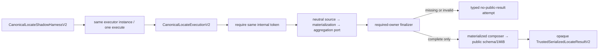

# canonical-locate-facts-bridge feature design

## 0. 术语约定

| 术语 | 定义 | 防冲突结论 |
|---|---|---|
| canonical execution | 一次且仅一次调用 backend/reader/verification pipeline 后形成的 success envelope 或 typed failure | 不等同于 v2 public result；它先于任何版本 projector |
| mandatory base | success execution 必须真实拥有的 `repositoryRoot`、`NormalizedSearchTerm[]` 与同次执行的 `legacyV1Projection` | `legacyV1Projection` 位于 execution，不伪装成 owner fragment |
| owner fragment | `snapshot/ranking/backend/request-outcome/scope/capability` 六个后续 feature 各自拥有的 tagged typed fact | 缺失用 property absence 表示，不用空数组、`unknown` 或假 complete |
| required-owner finalizer | 按冻结 owner 顺序先检查缺失，再检查 tag/cross invariant并组合trusted materialized v2的纯边界 | 缺 owner/invalid facts 时不调用 materialized composer/serializer |
| v1 projector | F9 前唯一 production binding，原样返回 canonical execution 自带的 legacy v1 projection | 是有删除期限的 migration adapter，不是第二条业务管线 |
| shadow projection attempt | test-only harness对同一次canonical input/capability/internal token尝试neutral source/materialization/aggregation、finalizer、composer、schema与serialization的内部结果 | real pipeline 在 F8 前只能得到 missing-owner / execution-error，不产生 public v2 success |
| transport reachability | 从 package、`RepositoryEvidenceService`、MCP host/output 与 debug CLI roots 沿 runtime import/DI edge 可到达的模块集合 | type-only internal fact imports允许；neutral preparation port/stage registrar/materialized composer/shadow/output schema在 F9 前禁止可达 |

## 1. 决策与约束

### 需求摘要

F1C 把当前 `RepositoryEvidenceEngine.locate()` 的真实执行体迁移到单一 canonical executor，在 execution 与 public representation 之间建立长期 seam。production 仍经 v1 projector 返回完全相同的 `LocateResult`；test-only shadow harness 复用同一个 executor，但六个 owner 尚未交付时必须按 canonical 顺序 fail closed，不能填假 coverage 或提前输出 schema v2。

成功标准：

1. production service、test shadow 与未来 F3–F8 producers 共用一个 `CanonicalLocateExecutorV2`，一次 request 不重复 backend、reader、verification 或 redaction。
2. success execution 真实保留 root 与 `{value, caseSensitive}` terms；sensitive/insensitive/smart 三种模式的 v1 output deep-exact 不变。
3. fragments 初始为真正空的 frozen map；pre-stage inspector 对 F1C real success 只返回
   `snapshot/ranking/scope/capability`四个canonical missing prerequisites且所有stage/finalizer为0；
   real failure返回execution-error。finalizer没有接受partial envelope的ABI，只能消费completion-bearing
   aggregation token。
4. synthetic complete envelope + test-only neutral three-stage registrar/token链能通过同一finalizer/composer/schema/F1B final public guards；owner tag错配、重复、缺失、registration identity/value/class/order、stage token/input/execution/order或public schema矛盾统一 fail closed。
5. production DI 只有 v1 projector binding；MCP/debug/service runtime graph不能到达 v2 shadow projector、neutral preparation port/stage registrar、materialized composer/serializer或 v2 public output schema。

### 明确不做

- 不实现 snapshot cache、stable evidence pool、ranking、backend outcome、request outcome、scope 或 capability 的真实 fragments；分别由 F3/F2/F5/F6/F7/F8 拥有。
- 不从已脱敏 v1 result 反向推导 owner fragments，不运行第二次 backend/reader来“补”v2。
- 不在 production request 中双写 v1/v2，不新增 feature flag、header、CLI flag或第二个 MCP tool。
- 不把缺失 owner写成空数组、`unknown`、默认 scope、假 `strategyComplete=true` 或 synthetic snapshot。
- 不改变 v1 request/schema/status/error/redaction/ID/order/Golden。
- 不复制F1/F1A/F1B安全语义，也不import后序F3/F2/F6 owner APIs；F1C只拥有neutral preparation
  port/registration views/registrars/tokens、owner finalizer、materialized composer、projector过渡seam，以及复用上游安全契约的
  projection capability/internal execution token registry与trusted serialized
  success/fixed-safe-error seam。
- 不提前执行 F6 input/cancellation 语义或 F9 service return-type/cutover。

### 方案深度 pre-pass

| 候选 | 结论 | 原因 |
|---|---|---|
| 在现有 `locate()` 末尾把 v1 result 转成 v2 | 拒绝 | 已脱敏 v1 丢失 owner facts，会形成 reverse derivation 与假 coverage |
| production 每次同时调用 v1 engine 和 v2 engine | 拒绝 | backend/reader执行两次，snapshot和abort时序可能不同，也形成双公共输出 |
| 仅增加一个可选 `v2?: boolean` 分支 | 拒绝 | transport在 F9 前即可选择v2，违反原子 projector-edge cutover |
| canonical executor + typed envelope + v1 production projector + test-only shadow attempt | 采用 | execution只发生一次，owner可逐项接入，transport edge保持唯一且可静态证明 |

### 复杂度档位

- Architecture = `migration-seam`：建立未来 F3–F9 共用的执行/表示边界。
- Determinism = `deep-exact`：v1 object、Golden、MCP structured/text与三种term mode保持一致。
- Failure = `fail-closed`：missing/invalid facts绝不物化public v2。
- Security = `no-cutover-reachability`：不再用“production不得import任何v2”粗规则，而是证明危险runtime edge不可达。
- Testability = `single-execution-observable`：counting backend/reader和projector spies证明无第二次执行。
- 其余维度采用当前 NestJS/TypeScript in-process module 的长期维护默认档位。

### 关键决策

1. **existing class 变为薄 service façade**：`RepositoryEvidenceEngine` 继续实现 `RepositoryEvidenceService`，但只执行 `executor.execute(request,context,capability)` 一次并调用注入的 production projector；每个typed service调用先由F1C issuer创建一个request-local projection capability与其private internal execution token，把同一capability传给executor和projector。executor在任何owner工作前取得该token并把exact terminal input原子登记；v1 projector只以input+capability accessor验证同次execution，不读取或派生业务语义。原 748 行执行体与私有 terminal builders迁到 `CanonicalRepositoryLocateExecutorV2`。
2. **canonical failure与legacy failure同源**：executor先裁决 canonical tool error code/action，再同时构造 unsafe v2 error facts和v1 safe error projection；不得从v1 message/object反解析v2 error。
3. **mandatory base不冒充fragment**：success envelope只含root、normalized terms、frozen fragments；`legacyV1Projection`是execution sibling。F1C real success的`Object.keys(fragments)`严格为空。
4. **term reference与case semantics保真**：executor对positive `request.terms`只调用一次`normalizeSearchTerms`，同一 frozen array同时进入envelope和legacy v1 pack；`negativeTerms`独立normalize一次，anchors独立调用`normalizeLocateAnchors`一次。三种mode覆盖三类输入的NFKC、dedupe、value和`caseSensitive`，projector不再次normalize任何输入。
5. **request-local builder只接受一次owner写入**：`LocateFactEnvelopeBuilderV2.add(owner,value)`校验key/tag一致且owner未存在；重复或错配使本次execution转fixed internal failure，不能last-write-wins。
6. **base冻结“先决 owner admission → 中性三阶段 → completion-bearing aggregation → finalizer”唯一生命周期**：F1C定义F1C-owned opaque prerequisite/source/materialization/aggregation token、`LocateProjectionPreparationPortV2`以及三个exact deep-internal registrar；base production/type graph不import F3 snapshot proof、F2 ranking outcome、F6 aggregation proof或其accessor。pre-stage inspector只要求`['snapshot','ranking','scope','capability']`四个先决 owner，并要求base envelope中`backend/request-outcome`尚未出现；缺任一先决 owner或预置后两owner时七stage全0。F2 source registrar必须消费该opaque prerequisite token，随后F2验证业务proof/order与F1A/F1B guards并登记source/materialization。F8 aggregation wrapper exact一次用F2 core accessor与F6 aggregator生成`backend/request-outcome/status`，把两fragment与`{identity,statusV2}`一并提交第三registrar；registrar从先决token绑定的base envelope创建新的冻结complete envelope，拒绝caller提交complete envelope、预置/重复owner或第二真值，并把complete envelope、materialization与status私有绑定进completion-bearing aggregation token。required-owner finalizer只消费该aggregation token与execution，在registry内恢复新complete envelope后按六owner canonical order做最终完整性/tag/cross-invariant检查并签`TrustedFinalizedLocateFactsV2`。F1C分别冻结zero-argument deep-internal `createRequiredOwnerFinalizerV2()`与`createMaterializedLocateResultComposerV2()`作为唯一runtime acquisition ABI；二者返回各自窄接口且不导出concrete class、service locator或package-barrel symbol。composer只消费finalized token并合并owner、分配ID/ordinal；独立`validateComposedLocateResultV2ForSerialization`执行public strict schema并签schema token，`serializeTrustedMaterializedLocateResultV2`最后执行F1B compact 1 MiB guard并签opaque serialization token。finalizer、composer、schema、serialization四个边界可独立计数，不能被一个万能callback折叠。
7. **F1C只实现单一中性composition底座**：canonical missing order、tag/duplicate、stage-token provenance、确定性的synthetic materialized composition、ID/ordinal与input immutability在本项冻结；source view只保存opaque identity，materialization view只保存public term与`{identity,value}`，aggregation view保存opaque identity、public-neutral `statusV2`与typed `backend/requestOutcome` fragments。F1C拥有fragment shape与fresh-builder规则但不拥有其业务推导：F8必须先经F6 trusted accessors取得exact fragments，registrar只验证shape/provenance并创建new complete envelope。identity仅用于pairing/provenance，不参与membership、比较、排序或ID。F1C不得反射identity、重算owner truth或从old envelope复制预置generated owner；composer exact复制F6-owned attempts与registered status。synthetic complete必须由test-only four-prerequisite provider经同一registrars产生，手写token/complete envelope不算proof。
8. **shadow result不是公共fallback**：shadow projector返回内部`V2ShadowProjectionAttemptV2`。canonical failure、missing owner、neutral stage failure或invalid facts均无serialized token；F1C base real empty envelope在任何stage callback前停止，只有test-only synthetic complete fixture以及F8后的真实complete provider才能调用四层finalizer/composer/schema/serializer。success只返回opaque `TrustedSerializedLocateResultV2`，不能直接返回或clone `LocateResultV2`。
9. **v1 binding只有一个**：`EvidenceModule`把`LOCATE_RESULT_PROJECTOR`唯一绑定到`V1LocateResultProjector`；shadow projector/harness不注册provider、不export token、不进入App/MCP/CLI module。
10. **runtime reachability替代目录禁令**：import graph用TypeScript AST区分runtime与type-only edges；production roots允许到达internal fact contract/canonical executor/execution registry，禁止到达shadow projector、neutral preparation port、materialized composer/serializer和`locate-result-v2.ts` runtime schema。deliberate mutation必须被检出。
11. **直接构造测试统一迁移**：现有直接`new RepositoryEvidenceEngine(backends,reader)`的unit/Golden改用一个testkit harness组装executor→v1 projector→façade；不保留双签名constructor或隐藏fallback wiring。
12. **F9删除边界明确**：F9切换projector并更新`RepositoryEvidenceService` output type后删除`legacyV1Projection`与`V1LocateResultProjector`；canonical executor/envelope/finalizer继续保留。
13. **concrete façade退出package surface**：F1C从`src/index.ts`移除`RepositoryEvidenceEngine` export；package继续提供application factory、`RepositoryEvidenceService` port与既有public tokens/backends，但不公开可绕过DI的concrete constructor。build后的`dist/index.d.ts`依赖闭包不得引用private executor/projector token、fact envelope、finalizer或shadow类型。
14. **projection capability、internal token与trusted serialization是上游中性seam**：F1C在
    `src/evidence/locate-execution/locate-projection-execution-capability-v2.ts`独占无own-property
    `LocateProjectionExecutionCapabilityV2`与`LocateExecutionTokenV2` issuer/registry。issuer同时
    建立capability→token；canonical executor接收capability、取得token并在返回前建立
    exact input→capability+token；F1C/F8 internal-only
    `requireCanonicalLocateExecutionTokenV2(input,capability)`在任何facts/value暴露前验证三者，
    input/capability/token clone、swap、stale或cross-execution一律失败。F9不得import该accessor。
    在
    `src/evidence/canonical/trusted-serialized-locate-result-v2.ts`独占serialization token、
    success serializer、fixed-safe error serializer与共同accessor。error入口exact为
    `createTrustedSerializedPublicToolErrorV2(code,suggestedAction,execution)`：只接受四个public
    code，`ADD_TERM`只允许搭配`INVALID_INPUT`，内部复用F1 strict mapping、public schema与F1B
    compact 1 MiB guard，返回同一种opaque `TrustedSerializedLocateResultV2`；不接受raw message、
    path、exception、stage或caller-built result。projector exact ABI从本项开始固定为
    `project(input, execution)`；v1 projector先通过canonical input/capability accessor恢复同一internal
    token再返回原legacy引用，test-only shadow与F8 accepted façade也必须先恢复同一token并把它用于
    全部stage owner，最后把同一capability绑定到serialized token。F8可消费该中性seam完成real accepted
    orchestration，F1C不import任何F8 module；F9再把issuer移动到validation之前的唯一application
    boundary，并只通过该fixed-safe error入口与共同accessor处理error，切换projector edge时不得
    另造capability、error mapper或serializer。F1C本项不把该error入口接到production v1或shadow
    failure path。

### Top 3 风险与缓解

| 风险 | 缓解 |
|---|---|
| 为兼容v1而执行两次backend/reader | counting backend/reader + 同一execution双projector case；projector接口不接收request/context |
| 空fragment被误解释为完整coverage | required-owner canonical missing test、composer/serializer spy零调用、real envelope Golden summary |
| F1C允许internal v2后旧no-cutover门禁失效 | AST runtime graph、危险模块精确denylist、DI inventory与deliberate reachability mutation |

### 非显然依赖、关键假设与基线风险

- design admission依赖 F1B design review passed；implementation admission要求 F1A/F1B acceptance为`done`，用于冻结既有public boundary ABI；F1C base synthetic provider只验证neutral stage token、finalizer/composer/schema/serialization seam，不要求或import未来F3/F2/F6实现。
- 现有 `RepositoryEvidenceEngine` 由大量unit/Golden直接构造；迁移testkit harness是本feature的必要scope，不是顺手测试重构。
- current `LocateExecutionContext`只含AbortSignal，F6以后扩展input/request outcome但不改变executor/projector seam。
- F1C不会真实产生任何owner fragment；因此base envelope实际缺全部六owner，但pre-stage inspector只报告
  `[snapshot, ranking, scope, capability]`四prerequisite，backend/request-outcome由aggregation负责产生，
  不得把它们计入source admission blocker。
- synthetic complete fixture只证明neutral source/materialization/aggregation token与finalizer/composer/schema/serialization接口可工作，不是producer完成证据；不得把它记录为real shadow readiness。
- current no-cutover inventory把所有`contracts/v2`视为危险；本项必须升级为runtime-edge语义，否则会误报合法type-only/internal facts。
- 当前v1 timeout/backend-unavailable quirks保持原样；F5/F6后续通过owner facts修正v2语义，F1C不借迁移改变v1。
- F4前仍只有当前平台/Node事实；F1C本地不能替代后续matrix。

### 必跑验证、交付物与清洁度

- 必跑：build、typecheck、全部F1C cases、public-output-v2、full unit/Golden/MCP/docs、transport reachability、scope/spec/Doctor。
- 交付物：fact contract、request-local builder、neutral three-stage preparation port/token、exact registrar
  ABI/importer inventory与test-only synthetic provider、required-owner finalizer/materialized composer、canonical input-capability-internal-token
  registry/accessor、capability-bound success与fixed-safe-error serialization/common accessor、
  canonical executor、v1 exact projector/façade/DI、shadow attempt harness、AST runtime graph、test
  trusted-core harness、package root export/declaration inventory、exact case ownership/registry、
  architecture/scope/review/QA/acceptance。
- 清洁度：禁止第二次execution、placeholder owner、production shadow provider、v2 transport flag、未登记case、未解释Golden漂移、TODO/FIXME、debug envelope/root输出、真实路径/凭证。

## 2. 名词与编排

### 2.1 名词层

#### 现状

- `RepositoryEvidenceEngine` 同时拥有DI service façade、request lifecycle、backend编排、verification/classification、v1 status/coverage、redaction与terminal error构造。
- `EvidenceModule` 直接把该class以`useExisting`绑定为`REPOSITORY_EVIDENCE_SERVICE`，没有executor/projector seam。
- dormant v2只有synthetic raw fixture→assembler路径；真实service既不能暴露owner facts，也没有required-owner finalizer。
- no-cutover spec按目录拒绝所有v2 imports，无法容纳F1C合法internal facts。

#### 变化

新增内部契约：

```ts
// src/contracts/v2/locate-fact-envelope-v2.ts
export const LOCATE_FACT_OWNER_ORDER_V2 = Object.freeze([
  'snapshot',
  'ranking',
  'backend',
  'request-outcome',
  'scope',
  'capability',
] as const);

export interface LocateFactEnvelopeV2 {
  readonly repositoryRoot: string;
  readonly normalizedTerms: readonly NormalizedSearchTerm[];
  readonly fragments: LocateFactFragmentsV2;
}

export type CompleteLocateFactFragmentsV2 = Readonly<{
  [K in LocateFactOwnerV2]-?: Readonly<{
    owner: K;
    value: LocateFactPayloadsV2[K];
  }>;
}>;

export type CompleteLocateFactEnvelopeV2 = Readonly<
  Omit<LocateFactEnvelopeV2, 'fragments'> & {
    readonly fragments: CompleteLocateFactFragmentsV2;
  }
>;

export const LOCATE_PROJECTION_PREREQUISITE_OWNER_ORDER_V2 = [
  'snapshot',
  'ranking',
  'scope',
  'capability',
] as const;

export type LocateProjectionPrerequisiteOwnerV2 =
  (typeof LOCATE_PROJECTION_PREREQUISITE_OWNER_ORDER_V2)[number];

declare const TRUSTED_LOCATE_PROJECTION_PREREQUISITES_V2: unique symbol;
export type TrustedLocateProjectionPrerequisitesV2 = Readonly<{
  readonly [TRUSTED_LOCATE_PROJECTION_PREREQUISITES_V2]: never;
}>;

export type LocateProjectionPrerequisitePresenceV2 =
  | Readonly<{
      ok: true;
      prerequisites: TrustedLocateProjectionPrerequisitesV2;
    }>
  | Readonly<{
      ok: false;
      missingOwners: readonly LocateProjectionPrerequisiteOwnerV2[];
      reason: 'missing-prerequisite-owner' | 'invalid-prerequisite-envelope';
    }>;

export function inspectLocateProjectionPrerequisiteOwnersV2(
  envelope: LocateFactEnvelopeV2,
  input: Extract<CanonicalLocateExecutionV2, Readonly<{ ok: true }>>,
  execution: LocateExecutionTokenV2,
): LocateProjectionPrerequisitePresenceV2;

export type CanonicalLocateExecutionV2 =
  | Readonly<{
      ok: true;
      envelope: LocateFactEnvelopeV2;
      legacyV1Projection: LegacyV1LocateSuccess;
    }>
  | Readonly<{
      ok: false;
      error: UnsafeToolErrorFactsV2;
      legacyV1Projection: LegacyV1LocateFailure;
    }>;

declare const LOCATE_PROJECTION_EXECUTION_CAPABILITY_V2: unique symbol;
export type LocateProjectionExecutionCapabilityV2 = Readonly<{
  readonly [LOCATE_PROJECTION_EXECUTION_CAPABILITY_V2]: never;
}>;

declare const LOCATE_EXECUTION_TOKEN_V2: unique symbol;
export type LocateExecutionTokenV2 = Readonly<{
  readonly [LOCATE_EXECUTION_TOKEN_V2]: never;
}>;

export function issueLocateProjectionExecutionCapabilityV2():
  LocateProjectionExecutionCapabilityV2;

export interface CanonicalLocateExecutorV2 {
  execute(
    request: LocateRequest,
    context: LocateExecutionContext,
    projectionExecution: LocateProjectionExecutionCapabilityV2,
  ): Promise<CanonicalLocateExecutionV2>;
}

export function requireCanonicalLocateExecutionTokenV2(
  input: CanonicalLocateExecutionV2,
  projectionExecution: LocateProjectionExecutionCapabilityV2,
): LocateExecutionTokenV2;

export interface LocateResultProjector<TOutput> {
  project(
    input: CanonicalLocateExecutionV2,
    execution: LocateProjectionExecutionCapabilityV2,
  ): TOutput;
}
```

完整 owner payload与roadmap `public-contract-v2.md`一致；F1C只声明type与builder slot，不生成实例。`BackendExecutionOutcomeV2`也按roadmap完整shape冻结，但直到F5才有real producer。

finalizer与shadow接口：

```ts
type FinalizeLocateFactsV2Result =
  | Readonly<{ ok: true; value: TrustedFinalizedLocateFactsV2 }>
  | Readonly<{
      ok: false;
      reason: 'missing-owner';
      missingOwners: readonly LocateFactOwnerV2[];
    }>
  | Readonly<{
      ok: false;
      reason: 'invalid-facts';
      missingOwners: readonly [];
    }>;

declare const TRUSTED_FINALIZED_LOCATE_FACTS_V2: unique symbol;
export type TrustedFinalizedLocateFactsV2 = Readonly<{
  readonly [TRUSTED_FINALIZED_LOCATE_FACTS_V2]: never;
}>;

export interface RequiredOwnerFinalizerV2 {
  finalize(
    aggregation: TrustedLocateProjectionAggregationV2,
    execution: LocateExecutionTokenV2,
  ): FinalizeLocateFactsV2Result;
}

// Deep-internal runtime acquisition ABI. This symbol is exported only from
// src/evidence/canonical/required-owner-finalizer-v2.ts.
export function createRequiredOwnerFinalizerV2(): RequiredOwnerFinalizerV2;

declare const TRUSTED_LOCATE_PROJECTION_SOURCE_V2: unique symbol;
export type TrustedLocateProjectionSourceV2 = Readonly<{
  readonly [TRUSTED_LOCATE_PROJECTION_SOURCE_V2]: never;
}>;

declare const TRUSTED_LOCATE_PROJECTION_MATERIALIZATION_V2: unique symbol;
export type TrustedLocateProjectionMaterializationV2 = Readonly<{
  readonly [TRUSTED_LOCATE_PROJECTION_MATERIALIZATION_V2]: never;
}>;

declare const TRUSTED_LOCATE_PROJECTION_AGGREGATION_V2: unique symbol;
export type TrustedLocateProjectionAggregationV2 = Readonly<{
  readonly [TRUSTED_LOCATE_PROJECTION_AGGREGATION_V2]: never;
}>;

type LocateProjectionPreparationFailureV2 = Readonly<{
  ok: false;
  reason: 'invalid-facts';
}>;

type LocateProjectionStageRegistrationResultV2<TValue> = Readonly<
  | { ok: true; value: TValue }
  | LocateProjectionPreparationFailureV2
>;

export interface LocateProjectionSourceRegistrationV2 {
  readonly identity: Readonly<object>;
}

export interface LocateProjectionMaterializedConfirmedRegistrationV2 {
  readonly identity: Readonly<object>;
  readonly value: Readonly<Omit<ConfirmedEvidenceV2, 'id'>>;
}

export interface LocateProjectionMaterializedCandidateRegistrationV2 {
  readonly identity: Readonly<object>;
  readonly value: Readonly<Omit<CandidateEvidenceV2, 'id'>>;
}

export interface LocateProjectionMaterializationRegistrationV2 {
  readonly normalizedTerms: readonly PublicSearchTerm[];
  readonly confirmed:
    readonly LocateProjectionMaterializedConfirmedRegistrationV2[];
  readonly candidates:
    readonly LocateProjectionMaterializedCandidateRegistrationV2[];
}

export interface LocateProjectionAggregationRegistrationV2 {
  readonly identity: Readonly<object>;
  readonly statusV2: LocateStatus;
  readonly backend: Readonly<BackendFactsV2>;
  readonly requestOutcome: Readonly<RequestOutcomeFactsV2>;
}

// Deep-internal registrar ABI. The implementation is owned by
// src/evidence/canonical/locate-projection-stage-registrar-v2.ts and is not
// exported from any package barrel.
export function registerTrustedLocateProjectionSourceV2(
  registration: LocateProjectionSourceRegistrationV2,
  prerequisites: TrustedLocateProjectionPrerequisitesV2,
  input: Extract<CanonicalLocateExecutionV2, Readonly<{ ok: true }>>,
  execution: LocateExecutionTokenV2,
): LocateProjectionStageRegistrationResultV2<
  TrustedLocateProjectionSourceV2
>;

export function registerTrustedLocateProjectionMaterializationV2(
  registration: LocateProjectionMaterializationRegistrationV2,
  source: TrustedLocateProjectionSourceV2,
  input: Extract<CanonicalLocateExecutionV2, Readonly<{ ok: true }>>,
  execution: LocateExecutionTokenV2,
): LocateProjectionStageRegistrationResultV2<
  TrustedLocateProjectionMaterializationV2
>;

export function registerTrustedLocateProjectionAggregationV2(
  registration: LocateProjectionAggregationRegistrationV2,
  materialization: TrustedLocateProjectionMaterializationV2,
  input: Extract<CanonicalLocateExecutionV2, Readonly<{ ok: true }>>,
  execution: LocateExecutionTokenV2,
): LocateProjectionStageRegistrationResultV2<
  TrustedLocateProjectionAggregationV2
>;

export interface LocateProjectionPreparationPortV2 {
  createSource(
    prerequisites: TrustedLocateProjectionPrerequisitesV2,
    input: Extract<CanonicalLocateExecutionV2, Readonly<{ ok: true }>>,
    execution: LocateExecutionTokenV2,
  ): Readonly<
    | { ok: true; value: TrustedLocateProjectionSourceV2 }
    | LocateProjectionPreparationFailureV2
  >;
  materialize(
    source: TrustedLocateProjectionSourceV2,
    input: Extract<CanonicalLocateExecutionV2, Readonly<{ ok: true }>>,
    execution: LocateExecutionTokenV2,
  ): Readonly<
    | { ok: true; value: TrustedLocateProjectionMaterializationV2 }
    | LocateProjectionPreparationFailureV2
  >;
  aggregate(
    materialization: TrustedLocateProjectionMaterializationV2,
    input: Extract<CanonicalLocateExecutionV2, Readonly<{ ok: true }>>,
    execution: LocateExecutionTokenV2,
  ): Readonly<
    | { ok: true; value: TrustedLocateProjectionAggregationV2 }
    | LocateProjectionPreparationFailureV2
  >;
}

declare const TRUSTED_MATERIALIZED_LOCATE_RESULT_V2: unique symbol;
export type TrustedMaterializedLocateResultV2 = Readonly<{
  readonly [TRUSTED_MATERIALIZED_LOCATE_RESULT_V2]: never;
}>;

export interface MaterializedLocateResultComposerV2 {
  compose(
    finalized: TrustedFinalizedLocateFactsV2,
  ): Readonly<
    | { ok: true; value: TrustedMaterializedLocateResultV2 }
    | { ok: false; reason: 'invalid-facts' }
  >;
}

// Deep-internal runtime acquisition ABI. This symbol is exported only from
// src/evidence/canonical/materialized-locate-result-composer-v2.ts.
export function createMaterializedLocateResultComposerV2():
  MaterializedLocateResultComposerV2;

declare const TRUSTED_SERIALIZED_LOCATE_RESULT_V2: unique symbol;
export type TrustedSerializedLocateResultV2 = Readonly<{
  readonly [TRUSTED_SERIALIZED_LOCATE_RESULT_V2]: never;
}>;

interface TrustedSerializedLocateResultViewV2 {
  readonly value: LocateResultV2;
  readonly compactJson: string;
  readonly utf8Bytes: number;
}

declare const TRUSTED_SCHEMA_VALIDATED_LOCATE_RESULT_V2: unique symbol;
export type TrustedSchemaValidatedLocateResultV2 = Readonly<{
  readonly [TRUSTED_SCHEMA_VALIDATED_LOCATE_RESULT_V2]: never;
}>;

export function validateComposedLocateResultV2ForSerialization(
  value: TrustedMaterializedLocateResultV2,
): TrustedSchemaValidatedLocateResultV2;

export function serializeTrustedMaterializedLocateResultV2(
  value: TrustedSchemaValidatedLocateResultV2,
  execution: LocateProjectionExecutionCapabilityV2,
): TrustedSerializedLocateResultV2;

type PublicToolErrorCodeV2 =
  | 'INVALID_INPUT'
  | 'INVALID_REPOSITORY'
  | 'PATH_OUTSIDE_ROOT'
  | 'INTERNAL_ERROR';

export function createTrustedSerializedPublicToolErrorV2(
  code: PublicToolErrorCodeV2,
  suggestedAction: 'ADD_TERM' | undefined,
  execution: LocateProjectionExecutionCapabilityV2,
): TrustedSerializedLocateResultV2;

export function requireTrustedSerializedLocateResultV2(
  serialized: TrustedSerializedLocateResultV2,
  expectedExecution: LocateProjectionExecutionCapabilityV2,
): TrustedSerializedLocateResultViewV2;

type V2ShadowProjectionAttemptV2 =
  | Readonly<{
      ok: true;
      serialized: TrustedSerializedLocateResultV2;
    }>
  | Readonly<{
      ok: false;
      reason: 'execution-error' | 'missing-owner' | 'invalid-facts';
      missingOwners: readonly LocateFactOwnerV2[];
    }>;
```

`inspectLocateProjectionPrerequisiteOwnersV2`只用`Object.hasOwn`按
`snapshot,ranking,scope,capability`顺序计算pre-stage presence；missing时不读取任何present fragment
value。它同时拒绝base envelope预置`backend/request-outcome`，防止F8再次聚合形成第二真值。success
只返回绑定exact input/internal execution/base envelope的opaque prerequisite token，不向caller返回
可替换的envelope。F1C base、F2-stage shadow与F8 accepted orchestrator都在source前调用它；仅前四
owner齐全才可启动七stage。最终完整性检查不复用pre-stage inspector，而由finalizer从completion-bearing
aggregation registry恢复第三registrar创建的新complete envelope并按六owner顺序执行。

issuer registry以两个private WeakMap维护capability→internal token与terminal input→
`{capability,token}`。canonical executor接收capability后在任何owner work前取回token，并在每个
terminal return前把新建的exact input原子登记；重复登记、未由issuer签发、input/capability/token
clone、swap、stale或cross-execution固定失败。`requireCanonicalLocateExecutionTokenV2`是F1C/F8
internal-only single-purpose accessor，v1 projector、test-only shadow与F8 accepted orchestrator都先
调用它；F9及package barrel不可达。

`TrustedFinalizedLocateFactsV2` private registry绑定第三registrar创建的complete envelope、neutral
materialization、neutral aggregation与same internal execution token；
composer accessor内部取值，caller不能提交四者或绕过finalizer。schema token registry绑定composer
返回的exact value；success serializer只能消费该token。fixed-safe error serializer只接受上述
code/action/capability参数并拒绝`ADD_TERM`与非`INVALID_INPUT`组合，不能接收caller value或raw
diagnostic。`execution-error`的`missingOwners=[]`；shadow attempt不携带raw error、root、terms、
fragment、public value、JSON、byte count或detail。source/materialization/aggregation/missing/invalid
路径不调用materialized composer/success serializer，shadow failure也不调用fixed-safe error
serializer。两类serialization token与capability都由private WeakMap校验，使用
`Object.freeze(Object.create(null))`创建且无own-property；accessor在返回任何value/JSON/bytes前要求
token + expected capability exact匹配，clone/swap/cross-execution固定失败。上述types/functions只在
internal canonical/F8 seam与tests使用，不export package public barrel。

neutral preparation port的唯一base contract：

| Stage token | F1C base authority | Real owner revision |
|---|---|---|
| `TrustedLocateProjectionSourceV2` | `registerTrustedLocateProjectionSourceV2`只登记冻结、无可反射业务字段的source identity、exact prerequisite token、canonical success input与internal token；test-only provider走同一API | F2在四个先决owner齐全后实现real source stage并在F1A/F1B source guards与strict schema通过后调用registrar |
| `TrustedLocateProjectionMaterializationV2` | `registerTrustedLocateProjectionMaterializationV2`只接受同input/token的registered source，以及strict neutral `normalizedTerms/confirmed/candidates` registration view；每条evidence把opaque identity与无ID public value分开 | F2 child revision接入F1A single materializer与F1B public-field budgets，验证record pairing后调用registrar |
| `TrustedLocateProjectionAggregationV2` | `registerTrustedLocateProjectionAggregationV2`只接受同input/token的registered materialization、冻结opaque aggregation identity、public-neutral `statusV2`及exact `backend/request-outcome` fragments；从prerequisite registry恢复base envelope，新增两owner并冻结complete envelope，token私有绑定该complete envelope；caller不得提交envelope | F8 accepted-orchestrator aggregation wrapper先用F2 core accessor与F6 real aggregator验证owner-specific proof，再把exact fragments/status调用registrar |

F1C production base只拥有`LocateProjectionPreparationPortV2`接口、opaque tokens、上述neutral
registration types/registrars、registry验证与
`testkit/testing/create-synthetic-locate-projection-preparation-port-v2.ts`；`src/**`没有default、
placeholder或real provider，也不type/runtime import `EvidenceRankingOutcomeV2`、
`SnapshotTrustProofV2`、`TrustedMaterializedEvidenceCoreV2`、
`TrustedRequestOutcomeAggregationV2`及其owner accessors。registrar实现的exact owner是
`src/evidence/canonical/locate-projection-stage-registrar-v2.ts`；runtime importer inventory只允许
`src/evidence/public-output/f2-locate-projection-stages-v2.ts`调用source/materialization、
`src/evidence/canonical/accepted-complete-real-locate-shadow-orchestrator-v2.ts`的aggregation wrapper
调用aggregation，以及test-only synthetic provider调用三者。F8除该exact wrapper外不得import
registrar，F9完全不得import。real empty/partial envelope先做
prerequisite-owner precheck，缺`scope/capability`等先决owner时三个port callback与三个registrar均为0；
`backend/request-outcome`缺失本身不会阻断source，它们必须由aggregation registrar exact一次补齐。
synthetic complete从四先决owner base开始，逐stage验证exact prior token/input/internal execution与strict
registration view；identity、value、array或token clone、
删项、reorder、跳stage、duplicate registration或cross-execution在下个stage/finalizer暴露任何facts前
失败。F2/F6后续各自拥有real adapter的业务proof验证；F8只组装已验收的complete real port，不改变
F1C base。

complete envelope + materialized core到public v2的唯一composition：

| Public v2 target | Fact source |
|---|---|
| `normalizedTerms/confirmed/candidates` display fields | registered materialization stage view；real provider在F2 revision证明其F1 trusted materialized evidence core与ranking exact |
| evidence `id/ordinal` | F1C按F2冻结数组order和现有canonical ID contract分配；identity只验证pairing/provenance，不参与比较、排序或ID内容 |
| top-level `status` | registered neutral aggregation `statusV2`，由F8从F6 trusted aggregation exact提交；F1C只复制且不派生 |
| `coverage.unsatisfiedAnchors` | `ranking` |
| `coverage.snapshot` | `snapshot.coverage` |
| `coverage.backends` | F6-owned `backend.outcomes: BackendAttemptV2[]`按真实启动顺序exact copy；internal `retainedHits`/`selectionEligibility`已由F5 accessor在F6 owner边界前移除，F1C不得接收、strip或解释internal outcome |
| `coverage.indexState/indexFreshness` | `backend` |
| `strategyComplete/fallbackChecked/abortSource/limitsReached/degradations/exclusionSummary/nextActions` | `request-outcome` |
| `coverage.scope` | `scope` |
| `coverage.capabilities` | `capability` |

`repositoryRoot`、raw drafts、private refs与`snapshot.finalStableEvidence`只服务internal invariant，不进入
public v2。materialization registrar把每条`identity`与对应无ID `value`按class和顺序绑定；F1C只检查
identity是冻结对象、数组/值是冻结的exact shape且confirmed/candidate class匹配，不读取identity属性。
finalizer把完整owner/neutral materialization/neutral aggregation/internal execution绑定进opaque
token；composer只经该token accessor读取registration view，为每条value按confirmed后candidate的
冻结顺序与数组index分配ID/ordinal，并exact复制F6-owned public-neutral backend attempts及registered
`statusV2`；不接收caller提供的envelope/stage tokens，不读取`legacyV1Projection`，不得接收或strip
internal backend字段、构建corpus、redact、应用public-field replacement或derive status。

F1C finalizer invariant ownership：

| Invariant | F1C behavior | 后续owner gate |
|---|---|---|
| allowed owner key、tag匹配、缺失顺序、duplicate拒绝 | 本项blocking | none |
| neutral stage token的input/internal-execution authority、顺序与materialized composition owner唯一且public strict schema通过 | 本项blocking | real source/materialization/aggregation业务truth由F2/F6同步mutation |
| ranking元素来自final stable pool且confirmed/candidate互斥 | synthetic fixture共享引用但不宣称real proof | F3引入stable identity，F2完成subset/anchor ledger |
| backend outcome到attempt/request status truth table | 只验证synthetic schema-compatible shape | F5产outcome，F6完成唯一聚合 |
| scope/capability真实性 | 不填值、不声称complete、不在F1C重算 | F7/F8 owner accessor各自完成；F1C只组合accessor返回的view |

因此F1C的`invalid-facts`能拒绝tag/composition/strict-schema矛盾；尚无real owner的业务矛盾保持dependency-gated，而不是以空值通过。

typed absence与precedence truth table：

| fragments runtime state | 判定 |
|---|---|
| 任一pre-stage prerequisite owner（`snapshot/ranking/scope/capability`）没有own property（包括只存在于prototype） | source前立即按prerequisite constant顺序返回全部absent prerequisite owners；不读取任何present fragment value；七stage全0 |
| 尚有absent prerequisite owner，同时存在unknown key、错tag或own `undefined` | 仍先返回canonical `missing-owner`；invalid内容留到prerequisite全部present后检查 |
| prerequisite全部present但base envelope已预置`backend`或`request-outcome` | `invalid-facts`；禁止再次aggregate或接受第二真值，七stage全0 |
| prerequisite全部present，但任一value为`undefined`、tag错、key未知、own symbol或额外key | `invalid-facts`，七stage全0 |
| builder对同一owner执行第二次`add` | 在finalizer前把本次canonical execution转fixed internal failure；不覆盖、不产生partial envelope |
| prerequisite合法，source/materialization成功，aggregation registrar收到同execution的exact `backend/request-outcome/status` | registrar向private fresh builder各add一次后冻结`CompleteLocateFactEnvelopeV2`，把它绑定进aggregation token；不回写原始input envelope |
| finalizer消费completion-bearing aggregation token，registry中的六owner own-present、tag/value关联正确且无extra key | 验证same-input/token的registered materialization/aggregation并签finalized token；caller随后独立调用materialized composer |

pre-stage missing与finalizer final-completeness都使用`Object.hasOwn(fragments, owner)`，不是
`value !== undefined`；前者只检查四个prerequisite，后者只读取第三registrar私有绑定的新complete
envelope。任一missing路径不得枚举/读取未获授权的fragment value。

依赖与文件方向：

```text
contracts/request + ports + contracts/v2 source/public types
                     ↓ type-only
        locate-fact-envelope-v2.ts
                     ↓
 canonical-locate-executor-v2.ts ← backends / reader / v1 policies
                     ↓
 repository-evidence-engine.ts → V1LocateResultProjector

 locate-projection-execution-capability-v2.ts
       capability ↔ internal token ↔ canonical input
                          ↓
 locate-projection-preparation-port-v2.ts
                          ↓
 locate-projection-stage-registrar-v2.ts ← test-only synthetic provider
                          ↓
 locate-fact-envelope-v2.ts → required-owner-finalizer-v2.ts
                         ↓ only after complete
             materialized-locate-result-composer-v2.ts
                         ↓ schema → serialization
                 v2-shadow-locate-projector.ts

 production EvidenceModule ─X→ v2-shadow-locate-projector.ts
```

`repository-evidence-engine.ts`和production DI不runtime-import shadow/preparation port/materialized composer/public v2 schema；fact contract对public v2只使用type-only imports。neutral port/finalizer/composer可runtime-importprivate guards/schema，但不在production v1 reachability roots，且F1C `src/**`不import后序F3/F2/F6 owner modules。实际root集合至少包含真实MCP executable `src/main.ts`、`src/index.ts`、`src/app/create-application-context.ts`、`src/app/app.module.ts`、`src/evidence/evidence.module.ts`、`src/evidence/repository-evidence-engine.ts`、`src/mcp/mcp.module.ts`、MCP host/output/server以及`tools/cli/main.ts`/`execute.ts`；DI provider inventory与runtime import graph共同构成reachability证据。

`CANONICAL_LOCATE_EXECUTOR_V2`与`LOCATE_RESULT_PROJECTOR`由private `src/evidence/locate-execution/locate-execution.tokens.ts`拥有。该文件、fact contract、preparation port、stage registrar、finalizer、composer、两个zero-argument runtime acquisition factories和shadow types/classes都不从`src/index.ts`、`src/contracts/index.ts`或任何package barrel导出；不能把新tokens放进当前被`src/index.ts` wildcard export的`src/runtime/tokens.ts`。`registerTrustedLocateProjectionSourceV2`、`registerTrustedLocateProjectionMaterializationV2`与`registerTrustedLocateProjectionAggregationV2`只能从`src/evidence/canonical/locate-projection-stage-registrar-v2.ts`导入并受上述exact importer inventory约束。`createRequiredOwnerFinalizerV2()`与`createMaterializedLocateResultComposerV2()`只能从各自exact deep module导入；每次调用都返回不暴露concrete class的窄接口实例，不接收参数、DI container或service locator。

##### Interface 设计检查

- Module：`CanonicalLocateFactsBridgeV2`，全新deep migration module。
- Interface：executor接收现有request/context与issued projection capability；projector只接收canonical input与同一capability，物理上不能重跑backend。internal accessor从exact input+capability唯一恢复同次`LocateExecutionTokenV2`。
- Seam：execution facts与版本表示之间；未来owner只写fragment，不触碰transport。
- Depth / locality：owner ordering、absence、duplicate/tag policy、finalization、trusted serialization/capability和reachability集中，删除会让F3–F8各自双写v1/v2。
- Dependency strategy：Nest DI仅用于production executor/projector/façade；builder/finalizer/shadow保持纯in-process。
- Adapter：v1 projector是临时migration adapter，F9有明确删除条件；不是永久pass-through。
- Test surface：execution counters、legacy object identity、canonical input/capability/internal-token provenance、
  success/fixed-safe-error serialization token与cross-execution access、四code/action truth、三个registrar
  exact signature/importer inventory、neutral registration identity/value/class/order与stage token链、
  missing order、composer/schema/serializer spy、DI provider graph、runtime reachability path均可观察。

### 2.2 编排层

#### production

```mermaid
flowchart LR
  T["MCP / debug CLI"] --> S["RepositoryEvidenceService.locate"]
  S --> C["issue projection capability + internal token"]
  C --> E["CanonicalLocateExecutorV2.execute(request, context, capability) exactly once"]
  E --> X["CanonicalLocateExecutionV2"]
  X --> R["require canonical input + capability → same token"]
  R --> P["LOCATE_RESULT_PROJECTOR.project(input, capability)"]
  P --> V1["unchanged LocateResult v1"]
```



#### explicit test-only shadow



流程级约束：

- production façade不catch并重试executor；executor继续独占deadline/caller listener cleanup和现有exception→safe error mapping。
- success builder在resolve root后持有root/terms；所有terminal success（ok/no_result/partial/timeout/backend_unavailable）都返回envelope + same-run legacy success。
- invalid repository/path/internal failure返回canonical failure + legacy failure，没有envelope；shadow不把failure直接组装成v2。
- v1 projector先以exact input+capability恢复canonical executor登记的same internal token，再返回`legacyV1Projection`同一对象引用，不clone、
  parse、redact、normalize或从capability读取业务数据。
- shadow harness每次自行显式构造或由test module解析；production `EvidenceModule.exports`不含其token/class。
- pre-stage inspector只按四个prerequisite常量顺序做missing-first；aggregation registrar以fresh builder exact add `backend/request-outcome`并冻结complete envelope；finalizer再按六owner常量顺序检查complete token，与fragment insertion order无关。unknown/extra/tag mismatch归`invalid-facts`，duplicate在freeze前失败，mixed状态严格遵循双gate truth table。
- complete synthetic envelope必须配套test-only neutral provider依次调用三个production registrar签发source/materialization/aggregation token；synthetic materialization registration把opaque identity与无ID public value分离，synthetic aggregation registration把同一opaque identity与schema-valid `statusV2`绑定；composer只exact copy已登记的public value与trusted status，合并后通过public strict schema与1MiB guard，任一registration或后续失败归`invalid-facts`。
- source/materialization/aggregation/owner-finalization/composition/schema/serialization失败只改变shadow attempt；v1 projector在同一execution上始终返回exact `legacyV1Projection`引用。
- finalizer与projectors不得修改execution/envelope/fragment/value；freeze/immutability有mutation probe。
- import graph只计算runtime edges；type-only edges另列inventory但不构成cutover。任何dynamic import或value import仍是runtime edge。

### 2.3 挂载点清单

| 挂载点 | 变更 | 可达性 |
|---|---|---|
| `CANONICAL_LOCATE_EXECUTOR_V2` | `EvidenceModule`绑定`CanonicalRepositoryLocateExecutorV2` | production internal |
| `LOCATE_RESULT_PROJECTOR` | 唯一绑定`V1LocateResultProjector` | production internal，F9切换点 |
| `REPOSITORY_EVIDENCE_SERVICE` | 继续绑定薄`RepositoryEvidenceEngine` | public internal port不变 |
| execution registry/accessor | issuer与executor私有使用；F8只import `requireCanonicalLocateExecutionTokenV2` | package/F9不可达 |
| `LocateProjectionPreparationPortV2` / stage registrar | F1C `src/**`只定义接口、neutral registration views、opaque tokens与三个deep registrar，无default/real provider；registrar importer inventory固定为F2前两段、F8 aggregation wrapper与test synthetic | test synthetic；F2 child-owned real source/materialization；F8取得factory并以F6 proof登记aggregation |
| `CanonicalLocateShadowHarnessV2` | 只由tests显式构造，不注册Nest provider | transport不可达 |
| `src/index.ts` / package declaration | 移除concrete `RepositoryEvidenceEngine` export；不exportprivate tokens、fact bridge、finalizer或shadow类型/class | public package不可达 |
| runner registry | 新增F1C unit/Golden cases | test only |

### 2.4 推进策略

1. **fact contract + neutral preparation/registrar/finalizer/composer**：冻结owner order、payload types、typed absence、duplicate/tag、三个registrar exact ABI/importer inventory、opaque source/materialization/aggregation token provenance、source identity、`{identity,value}` materialization view、`{identity,statusV2}` aggregation view与materialized composition规则。退出信号：empty/partial/permuted/complete synthetic cases、registration identity/value/status/class/order、input/internal-token/stage-order/importer mutation与missing路径callback/registrar/composer零调用证据通过；本步不建立serialization seam。
2. **single canonical executor + execution registry**：建立capability→internal token→canonical input issuer/registry/accessor，把现有locate执行体迁移并在每个terminal path构造并登记canonical execution。退出信号：input/capability/token hostile matrix在executor边界通过，counting backend/reader只执行一次，success/failure/abort cleanup与三种term mode parity通过；本步不依赖v1或shadow projector。
3. **v1 projector + façade + DI/test migration**：建立唯一production v1 binding并迁移直接constructor tests。退出信号：v1 exact object identity、DI inventory、package declaration与full v1 unit/Golden无漂移。
4. **shadow attempt + neutral serialization + runtime reachability**：复用S1 test-only synthetic provider并建立shadow harness、
   capability-bound success/fixed-safe-error serialization seam和AST runtime import gate。退出信号：
   real success缺四个prerequisite且composer零调用；synthetic从四prerequisite base经aggregation补齐两owner并只返回opaque token；四code/error
   action/1MiB/capability hostile matrix通过且未接production；每类v2 failure不影响v1；deliberate
   transport mutation被发现。
5. **hardening + architecture/scope**：完成MCP/docs/full regression、architecture current-state update与完整changed-path对账。退出信号：production仍v1且所有artifact/commands通过。

### 2.5 结构健康度与微重构

#### 评估

- 文件级：`repository-evidence-engine.ts`约748行并混合service façade和execution；迁移执行体是F1C核心，不是额外微重构。
- 目录级：`src/evidence/`已有10个顶层文件；新增`locate-execution/`子目录只承载executor/projectors/execution registry，`src/evidence/canonical/`承载neutral preparation port/stage registrar、finalizer、composer与serialization，避免职责交叉或继续摊平。
- 新executor仍可能较长，但其职责收敛为一次request orchestration；本项不同时重写candidate/backend算法。
- current tests有多处直接constructor；集中testkit harness消除新DI形状的重复，但保留各测试既有业务assertions。

#### 结论：执行边界迁移，拒绝额外算法重构

把原helper和执行体原语义移动到`locate-execution/canonical-locate-executor-v2.ts`；不顺手拆candidate policy、status、redaction或backend transition。若迁移后executor仍需进一步按phase拆分，单独走`cs-refactor`，不能与F1C行为门禁混合。

## 3. 验收契约

### 3.1 关键场景清单

| ID | 输入 / 触发 | 期望可观察结果 |
|---|---|---|
| F1C-CONTRACT-001 | owner常量、空/partial/permuted fragments、inherited/own-undefined、unknown/extra/symbol key、duplicate add、key/tag mismatch | owner顺序固定；absence按own property；duplicate/tag mismatch fail closed且不覆盖 |
| F1C-FINALIZER-001 | real empty/partial prerequisite envelope、mixed missing+invalid、每次缺单个prerequisite、base预置backend/request-outcome、synthetic aggregation补齐complete、neutral materialization/aggregation矛盾；两个zero-argument acquisition factory signature与返回实例 | prerequisite missing-first顺序canonical且任一缺失时port callbacks/registrars全0；预置generated owner fail closed；aggregation registrar exact add backend/request-outcome并冻结private complete envelope；finalizer只消费completion-bearing aggregation token并执行六owner final completeness；两个factory各exact调用一次，complete且registered chain一致才由finalizer与composer各一次返回trusted materialized v2；本case不调用schema或serializer |
| F1C-SINGLE-EXEC-001 | issued capability/internal token下调用executor一次并覆盖counting codegraph/ripgrep/reader、所有terminal input registration及canonical input/capability/internal-token clone swap stale cross-execution mutation | search/read/verify只执行一次且terminal input只登记一次；exact input+capability只恢复同一token，forged/swap在任何canonical input或token值暴露前失败；本case不构造v1或shadow projector |
| F1C-V1-PARITY-001 | success/no_result/partial/timeout/backend unavailable/invalid root与现有fixtures；S2三种term-mode terminal outputs及normalize helper spy | projector结果与迁移前v1 deep-exact且同一对象引用；error code/action不漂移；projector normalize调用为0 |
| F1C-TERM-CASE-001 | `sensitive/insensitive/smart`下含NFKC、大小写和dedupe的positive terms、negative terms与anchors | executor只normalize一次；backend request看到的三类normalized value/caseSensitive逐项exact，canonical envelope与same-run legacy payload复用exact arrays；本case不构造或调用projector |
| F1C-REAL-SHADOW-001 | real executor success/failure进入shadow harness | F1C base success缺四个pre-stage prerequisite且neutral preparation三个callback均0；failure为execution-error；二者都无publicResult且composer/schema/serializer调用0 |
| F1C-SYNTHETIC-SHADOW-001 | test-only四prerequisite base与neutral three-stage provider；registration identity/value/status/generated-owner/class/order及serialized token clone/swap/wrong capability | valid先取得opaque prerequisite token，再以同input/internal token依次经三个registrar签source/materialization/completion-bearing aggregation；第三registrar exact add backend/request-outcome并冻结新complete envelope，随后finalizer/composer/schema/serializer各一次；opaque identity只用于跨stage pairing/provenance，不参与membership/order/ID；ID只由class与各自array index生成；composer exact copy materialization value/backend/status，不反射identity且只返回opaque token；preseed/duplicate/missing/swap不暴露任何值/detail |
| F1C-SAFE-ERROR-SERIALIZATION-001 | 四code、`INVALID_INPUT`有/无`ADD_TERM`、其他code+`ADD_TERM`、forged code/action、1MiB mutation、token clone/swap/wrong capability | 只接受fixed F1 v2 error truth；factory与F1B serializer各一次；返回同一种opaque token；共同accessor仅以same capability暴露exact value/compact JSON/bytes；非法组合在value前失败且无raw detail |
| F1C-MATERIALIZATION-SEAM-001 | prerequisite inspector、三个registrar exact signature、deep owner与runtime importer inventory；F1C-owned synthetic provider按prerequisite→source→materialization→aggregation-completion签neutral token；identity/value/status/generated-owner/class/order/array、callback skip/reorder/duplicate，input/token clone、删项、cross-execution与handwritten token mutation | base `src/**`无F3/F2/F6 business type/import或real/default provider；source/materialization registrar只允许F2与test synthetic，aggregation只允许F8 exact wrapper与test synthetic，F8其他模块/F9 direct import mutation失败；缺任一snapshot/ranking/scope/capability或base预置backend/request-outcome时三个callback和registrar均0；只有same-input/internal-token registered chain可进入第三registrar；它必须登记same identity、schema-valid trusted `statusV2`与exact两个generated fragments并创建private complete envelope，finalizer不得再读原始input envelope；hostile路径later stage/composer为0 |
| F1C-V1-SHADOW-ISOLATION-001 | issued capability下只执行一次executor，再以同一个terminal input/capability依次调用v1与shadow；source、materialization、aggregation、missing-owner、owner-finalization、composition、schema、serialization分别失败 | backend/search/read/verify counters在两次projection前后不增加；v1 projector每次返回same-run `legacyV1Projection` exact引用且deep-exact，shadow failure不改变production result |
| F1C-DI-001 | Nest testing module解析service/executor/projector tokens | production只有v1 projector；shadow class/token不在providers/exports |
| F1C-PACKAGE-001 | source root export snapshot与build后的`dist/index.d.ts`依赖闭包 | concrete engine和全部private bridge types/tokens不可从package访问；application factory/service port保持 |
| F1C-REACHABILITY-001 | actual graph与synthetic service→shadow→materialized composer mutation | actual roots无危险runtime path；mutation返回完整path；type-only fact edge不误报 |
| F1C-V1-GOLDEN-001 | dedicated bridge fixture + existing full Golden/MCP/docs | v1 snapshots/structured/text/CLI保持一致，schemaVersion仍1.0 |

### 3.2 Stable case / fixture / assertion / runner ownership

每个stable ID只登记一次，fixture、assertion、runner/manifest与contract owner都必须是下表exact path；
禁止`same spec`、`existing fixture`、`harness`或抽象模块名。所有unit/Golden登记同时写入
`testkit/manifests/coverage/fixture-ownership.yaml`，unknown/duplicate/zero-run case必须失败。

| Stable ID / group-case | Fixture owner | Assertion owner | Runner / manifest owner | Contract owner |
|---|---|---|---|---|
| `F1C-CONTRACT-001` / `canonical-locate-bridge/canonical-fact-contract` | `testkit/fixtures/canonical-locate-bridge-v2/fact-contract-v2.ts` | `test/unit/canonical-locate-facts-bridge.spec.ts` | `testkit/runners/runner-registry.ts`; `testkit/manifests/coverage/fixture-ownership.yaml` | `src/contracts/v2/locate-fact-envelope-v2.ts` |
| `F1C-FINALIZER-001` / `canonical-locate-bridge/canonical-required-owner-finalizer` | `testkit/fixtures/canonical-locate-bridge-v2/required-owner-finalizer-v2.ts` | `test/unit/canonical-locate-facts-bridge.spec.ts` | `testkit/runners/runner-registry.ts`; `testkit/manifests/coverage/fixture-ownership.yaml` | `src/evidence/canonical/required-owner-finalizer-v2.ts`; `src/evidence/canonical/materialized-locate-result-composer-v2.ts` |
| `F1C-SINGLE-EXEC-001` / `canonical-locate-bridge/canonical-single-execution` | `testkit/fixtures/canonical-locate-bridge-v2/single-execution-v2.ts` | `test/unit/canonical-locate-execution.spec.ts` | `testkit/runners/runner-registry.ts`; `testkit/manifests/coverage/fixture-ownership.yaml` | `src/evidence/locate-execution/canonical-locate-executor-v2.ts`; `src/evidence/locate-execution/locate-projection-execution-capability-v2.ts` |
| `F1C-V1-PARITY-001` / `canonical-locate-bridge/canonical-v1-projector-parity` | `testkit/fixtures/canonical-locate-bridge-v2/v1-projector-parity-v2.ts` | `test/unit/canonical-locate-execution.spec.ts` | `testkit/runners/runner-registry.ts`; `testkit/manifests/coverage/fixture-ownership.yaml` | `src/evidence/locate-execution/v1-locate-result-projector.ts`; `src/contracts/evidence.ts` |
| `F1C-TERM-CASE-001` / `canonical-locate-bridge/canonical-term-case-parity` | `testkit/fixtures/canonical-locate-bridge-v2/term-case-v2.ts` | `test/unit/canonical-locate-execution.spec.ts` | `testkit/runners/runner-registry.ts`; `testkit/manifests/coverage/fixture-ownership.yaml` | `src/contracts/request.ts`; `src/evidence/locate-execution/canonical-locate-executor-v2.ts` |
| `F1C-REAL-SHADOW-001` / `canonical-locate-bridge/canonical-real-shadow-no-cutover` | `testkit/fixtures/canonical-locate-bridge-v2/real-shadow-no-cutover-v2.ts` | `test/unit/canonical-locate-facts-bridge.spec.ts` | `testkit/runners/runner-registry.ts`; `testkit/manifests/coverage/fixture-ownership.yaml` | `src/evidence/canonical/canonical-locate-shadow-harness-v2.ts`; `src/evidence/canonical/v2-shadow-locate-projector.ts` |
| `F1C-SYNTHETIC-SHADOW-001` / `canonical-locate-bridge/canonical-synthetic-shadow-serialization` | `testkit/fixtures/canonical-locate-bridge-v2/synthetic-shadow-serialization-v2.ts` | `test/unit/canonical-locate-facts-bridge.spec.ts` | `testkit/runners/runner-registry.ts`; `testkit/manifests/coverage/fixture-ownership.yaml` | `src/evidence/canonical/v2-shadow-locate-projector.ts`; `src/evidence/canonical/trusted-serialized-locate-result-v2.ts` |
| `F1C-SAFE-ERROR-SERIALIZATION-001` / `canonical-locate-bridge/canonical-safe-error-serialization` | `testkit/fixtures/canonical-locate-bridge-v2/safe-error-serialization-v2.ts` | `test/unit/canonical-locate-safe-error-serialization.spec.ts` | `testkit/runners/runner-registry.ts`; `testkit/manifests/coverage/fixture-ownership.yaml` | `src/evidence/public-output/public-result-assembler-v2.ts`; `src/evidence/canonical/trusted-serialized-locate-result-v2.ts` |
| `F1C-MATERIALIZATION-SEAM-001` / `canonical-locate-bridge/canonical-materialization-seam` | `testkit/fixtures/canonical-locate-bridge-v2/materialization-seam-v2.ts` | `test/unit/canonical-locate-facts-bridge.spec.ts` | `testkit/runners/runner-registry.ts`; `testkit/manifests/coverage/fixture-ownership.yaml` | `src/evidence/canonical/locate-projection-preparation-port-v2.ts`; `src/evidence/canonical/locate-projection-stage-registrar-v2.ts`; `testkit/testing/create-synthetic-locate-projection-preparation-port-v2.ts`; `src/evidence/canonical/materialized-locate-result-composer-v2.ts` |
| `F1C-V1-SHADOW-ISOLATION-001` / `canonical-locate-bridge/canonical-v1-shadow-isolation` | `testkit/fixtures/canonical-locate-bridge-v2/v1-shadow-isolation-v2.ts` | `test/unit/canonical-locate-execution.spec.ts`; `test/golden/canonical-locate-bridge.spec.ts` | `testkit/runners/runner-registry.ts`; `testkit/runners/golden-runner.ts`; `testkit/manifests/coverage/fixture-ownership.yaml` | `src/evidence/locate-execution/canonical-locate-executor-v2.ts`; `src/evidence/locate-execution/locate-projection-execution-capability-v2.ts`; `src/evidence/locate-execution/v1-locate-result-projector.ts`; `src/evidence/canonical/v2-shadow-locate-projector.ts` |
| `F1C-DI-001` / `canonical-locate-bridge/canonical-di-wiring` | `testkit/fixtures/canonical-locate-bridge-v2/di-wiring-v2.ts` | `test/unit/di.spec.ts` | `testkit/runners/runner-registry.ts`; `testkit/manifests/coverage/fixture-ownership.yaml` | `src/evidence/evidence.module.ts`; `src/evidence/locate-execution/locate-execution.tokens.ts` |
| `F1C-REACHABILITY-001` / `canonical-locate-bridge/canonical-transport-reachability` | `testkit/fixtures/canonical-locate-bridge-v2/runtime-reachability-v2.ts` | `test/unit/public-output-v2-no-cutover.spec.ts` | `testkit/runners/runner-registry.ts`; `testkit/manifests/coverage/fixture-ownership.yaml` | `tools/quality/check-public-output-reachability.mjs` |
| `F1C-PACKAGE-001` / `canonical-locate-bridge/canonical-package-declaration-boundary` | `testkit/fixtures/canonical-locate-bridge-v2/package-declaration-boundary-v2.ts` | `test/unit/canonical-locate-package-boundary.spec.ts` | `testkit/runners/runner-registry.ts`; `testkit/manifests/coverage/fixture-ownership.yaml` | `src/index.ts`; `dist/index.d.ts` |
| `F1C-V1-GOLDEN-001` / `canonical-locate-bridge/canonical-v1-bridge-parity` | `testkit/fixtures/canonical-locate-bridge-v2/v1-bridge-golden-v2.ts` | `test/golden/canonical-locate-bridge.spec.ts` | `testkit/runners/golden-runner.ts`; `testkit/manifests/golden/canonical-locate-bridge-v1.yaml`; `testkit/manifests/coverage/fixture-ownership.yaml` | `src/evidence/locate-execution/v1-locate-result-projector.ts` |

`testkit/runners/runner-registry.ts`登记新增unit group/cases，
`testkit/runners/golden-runner.ts`登记dedicated Golden；testkit engine harness的exact owner为
`testkit/testing/create-canonical-locate-engine-harness-v2.ts`，所有迁移测试仍保留原case IDs与
assertions。

### 3.3 明确不做的反向核对

- production v1 roots不应import shadow projector、neutral preparation port/stage registrar、materialized composer或public v2 schema。
- `RepositoryEvidenceEngine.locate()`不应调用executor两次、fallback到旧engine或自行normalize/project。
- owner fragments不应从`legacyV1Projection`读取/映射，不应出现默认owner factory。
- real F1C envelope不应有任何fragment key。
- source/materialization/aggregation/missing/invalid/execution-error shadow attempt不应携带serialized token、
  publicResult、raw error/root/terms/detail；success attempt也不应直接携带public value/JSON/bytes。
- materialized composer/serializer不应接受corpus、raw draft或调用redactor/public-field replacer/status deriver；registrar不应import或反射F2/F3/F6 business proof/identity；v1 projector不应读取任何shadow verdict。
- 不应新增v2 flag、第二MCP tool、第二service token、package export或docs public v2示例。
- `src/index.ts`不应继续export concrete `RepositoryEvidenceEngine`，generated package declaration不应通过constructor签名闭包泄露private bridge。
- v1 snapshots、schemaVersion、status、IDs、errors、redaction和ordering不应改变。

### 3.4 Acceptance Coverage Matrix

| Scenario | Covered By Step | Evidence Type | Command / Action | Core? |
|---|---|---|---|---|
| F1C-CONTRACT-001 / FINALIZER-001 | S1 | unit mutation + finalizer/composer spies；schema/serializer out-of-scope assertion | `npm test -- --group canonical-locate-bridge --case canonical-fact-contract --case canonical-required-owner-finalizer` | yes |
| F1C-SINGLE-EXEC-001 | S2 | counting integration | `npm test -- --group canonical-locate-bridge --case canonical-single-execution` | yes |
| F1C-V1-PARITY-001 | S3 | deep-exact unit + projector normalize-call spy + full Golden | `npm test -- --group canonical-locate-bridge --case canonical-v1-projector-parity && npm run test:golden -- --all` | yes |
| F1C-TERM-CASE-001 | S2 | executor-only three-mode truth table + canonical/legacy array identity | `npm test -- --group canonical-locate-bridge --case canonical-term-case-parity` | yes |
| F1C-REAL-SHADOW-001 | S4 | real counting + exact missing-owner set | `npm test -- --group canonical-locate-bridge --case canonical-real-shadow-no-cutover` | yes |
| F1C-SYNTHETIC-SHADOW-001 | S4 | synthetic complete + token/capability hostile matrix | `npm test -- --group canonical-locate-bridge --case canonical-synthetic-shadow-serialization` | yes |
| F1C-SAFE-ERROR-SERIALIZATION-001 | S4 | four-code/action/budget/token/capability matrix | `npm test -- --group canonical-locate-bridge --case canonical-safe-error-serialization` | yes |
| F1C-MATERIALIZATION-SEAM-001 | S1 | neutral stage/input/internal-token hostile matrix + callback/composer spies；schema/serializer out-of-scope assertion | `npm test -- --group canonical-locate-bridge --case canonical-materialization-seam` | yes |
| F1C-V1-SHADOW-ISOLATION-001 | S4 | one-execution counters + each-stage failure + exact reference Golden | `npm test -- --group canonical-locate-bridge --case canonical-v1-shadow-isolation && npm run test:golden -- --all` | yes |
| F1C-DI-001 | S3 | Nest provider/exports inventory | `npm test -- --group canonical-locate-bridge --case canonical-di-wiring` | yes |
| F1C-REACHABILITY-001 | S4 | AST graph + deliberate mutation | `npm test -- --group canonical-locate-bridge --case canonical-transport-reachability` | yes |
| F1C-PACKAGE-001 | S3/S5 | root export + generated declaration closure | `npm run build && npm test -- --group canonical-locate-bridge --case canonical-package-declaration-boundary` | yes |
| F1C-V1-GOLDEN-001 | S5 | dedicated + full Golden/MCP/docs | `npm run test:golden -- --group canonical-locate-bridge && npm run test:mcp -- --all && npm run test:docs` | yes |
| full regression | S5 | aggregate logs | `npm test && npm run test:golden -- --all` | yes |

### 3.5 DoD Contract

| ID | 要求 | 证据 | 阻塞级别 |
|---|---|---|---|
| DOD-DESIGN-001 | executor/envelope/exact neutral registrars/finalizer/projector/no-cutover与roadmap一致 | independent design review | blocking |
| DOD-IMPL-001 | S1-S5完成且不存在第二execution/placeholder owner/production shadow edge | checklist + dependency/DI inventories | blocking |
| DOD-REVIEW-001 | 独立review覆盖execution migration、absence/finalizer、error同源、runtime reachability | code review report | blocking |
| DOD-QA-001 | targeted、v1 Golden/MCP/docs与full suites全部通过 | QA report + command logs | blocking |
| DOD-ACCEPT-001 | owner确认v1唯一可达、architecture/scope/items回写 | acceptance report | blocking |

Validation Commands：

| ID | 命令 | 目的 | 核心性 | 失败处理 |
|---|---|---|---|---|
| CMD-BUILD | `npm run build` | production/CLI compile | core | fix-or-block |
| CMD-TYPECHECK | `npm run typecheck` | strict generic/fact types | core | fix-or-block |
| CMD-F1C-UNIT | `npm test -- --group canonical-locate-bridge --case canonical-fact-contract --case canonical-required-owner-finalizer --case canonical-materialization-seam --case canonical-single-execution --case canonical-v1-projector-parity --case canonical-v1-shadow-isolation --case canonical-term-case-parity --case canonical-real-shadow-no-cutover --case canonical-synthetic-shadow-serialization --case canonical-safe-error-serialization --case canonical-di-wiring --case canonical-transport-reachability` | F1C targeted unit stable cases；package-build与Golden另门验证 | core | fix-or-block |
| CMD-F1C-GOLDEN | `npm run test:golden -- --group canonical-locate-bridge --case canonical-v1-bridge-parity` | dedicated v1 bridge Golden | core | fix-or-block |
| CMD-PUBLIC-V2 | `npm test -- --group public-output-v2 && npm run test:golden -- --group public-output-v2` | F1/F1A/F1B source/materializer/composer regression | core | fix-or-block |
| CMD-UNIT-ALL | `npm test` | full unit regression | core | fix-or-block |
| CMD-GOLDEN-ALL | `npm run test:golden -- --all` | full v1/v2 Golden | core | fix-or-block |
| CMD-MCP-ALL | `npm run test:mcp -- --all` | production v1 MCP | core | fix-or-block |
| CMD-DOCS | `npm run test:docs` | public v1 docs/schema | core | fix-or-block |
| CMD-DOCTOR | `python .codestable/tools/codestable-doctor.py --root .` | artifact hygiene | supporting | document-baseline |
| CMD-DIFF-CHECK | `git diff --check` | patch cleanliness | supporting | fix-or-block |
| CMD-SPEC | `python .codestable/tools/codestable-spec-governance.py --root . analyze` | spec drift | supporting | fix-or-block |
| CMD-REACHABILITY | `npm test -- --group canonical-locate-bridge --case canonical-transport-reachability` | production危险runtime edge | core | fix-or-block |
| CMD-PACKAGE-BOUNDARY | `npm run build && npm test -- --group canonical-locate-bridge --case canonical-package-declaration-boundary` | public root/declaration closure | core | fix-or-block |
| CMD-SCOPE-CHECK | `python .codestable/tools/codestable-scope-gate.py --feature-dir .codestable/features/2026-07-24-canonical-locate-facts-bridge --allow-file .codestable/features/2026-07-24-canonical-locate-facts-bridge/canonical-locate-facts-bridge-scope-allow.txt --check-path . --cleanliness-path src/contracts/v2 --cleanliness-path src/evidence/locate-execution --cleanliness-path src/evidence/canonical --cleanliness-path src/evidence/repository-evidence-engine.ts --cleanliness-path test/unit --cleanliness-path test/golden --stage implementation.before_review` | full changed-path scope including neutral registrar/finalizer/composer owners | core | fix-or-block |

Required Actions：

| ID | 动作 | 证据 | 阻塞级别 |
|---|---|---|---|
| ACT-ARCH-UPDATE | acceptance前更新`system-repo-nav-foundation.md`中的engine/DI/v2 no-cutover现状、图与source pointers | architecture diff + cs-arch check | blocking |
| ACT-SCOPE-CHECK | implementation preflight捕获完整ambient baseline，scope allow逐条列出批准baseline与F1C exact paths；`--check-path .`阻止未登记夹带 | scope JSON + allow manifest + staged/unstaged/untracked inventory | blocking |

Required Artifacts: fact contract、owner/payload inventory、four-prerequisite order/inspector/opaque token、F1C-owned neutral source/materialization/aggregation port与opaque tokens、三个stage registrar exact signature/deep owner/importer inventory、source `{identity}`、materialization `{identity,value}`与aggregation `{identity,statusV2,backend,requestOutcome}` registration matrix、aggregation fresh-builder exact-add/freeze/new-complete-envelope registry与old-partial-envelope forbidden proof、identity仅作pairing/provenance且ID仅由class+array index生成、test-only four-prerequisite provider及no-F3-F2-F6-business-import proof、prerequisite missing/preseed-generated-owner/stage/input/token/order/status hostile matrix、finalizer只消费completion-bearing aggregation token的type/AST proof、两个zero-argument acquisition factory、projection capability/internal execution token registry、trusted serialization、canonical executor/v1 exact projector、single-execution counters、seven-boundary failure isolation、runtime reachability、stable case ownership、package declarations、v1 Golden/MCP/docs、architecture/scope/review/QA/acceptance。

### 3.6 自我批判结论

- 可证伪性：第二次execution由backend/reader counters直接揭示；placeholder owner由exact fragment keys揭示；cutover由runtime path揭示。
- 步骤原子性：contract/finalizer、executor、production projection、shadow/reachability、hardening分开。
- 最弱依赖：F1A/F1B implementation尚未完成；F1C实现不得只凭design review越过acceptance。
- 证据完整性：同时覆盖success/failure、三种case mode、missing/invalid、DI/runtime graph、Golden/MCP/docs。
- 过渡诚实性：synthetic只证明“four-prerequisite base→aggregation completion”接口；F1C base仍缺四个prerequisite，F2阶段仍缺scope/capability，F6只证明direct aggregator seam；直到F8才形成首个真实complete envelope且仍不切transport。
- 接口深度：projector不接request/context，结构上不能重跑pipeline；exact input+capability唯一恢复internal token，owner order/absence/finalization不泄露到transport。

## 4. 与项目级架构文档的关系

本feature会改变当前系统地图中的真实execution owner、Nest provider graph和v2 no-cutover定义，因此acceptance必须更新`.codestable/architecture/system-repo-nav-foundation.md`：`RepositoryEvidenceEngine`从全编排者变为façade，canonical executor成为真实管线owner，issuer registry把capability/internal token/canonical input绑定，production继续v1 exact projector，neutral preparation/stage registrar/shadow/composer保持transport不可达。requirement愿景与本次同步后的roadmap contract已冻结，不新增ADR；F9删除migration adapter属于既有roadmap决定。
