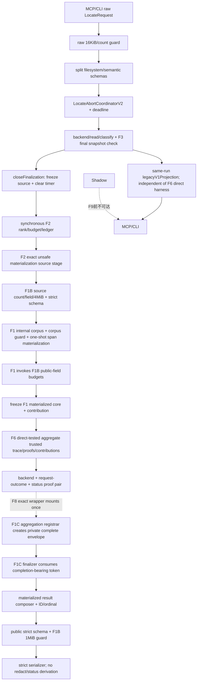

# input-abort-contract-v2 feature design

## 0. 术语约定

| 术语 | 定义 | 边界 |
|---|---|---|
| raw filesystem string | caller提供的`repoPath`或file anchor原始JS string | 不做NFKC、trim或反斜杠修复 |
| semantic string | question、terms、negative terms、non-file anchors | 按各自契约NFKC/trim |
| caller abort | SDK cancellation、MCP host shutdown、CLI interrupt等外部请求生命周期终止 | v2 status=`cancelled` |
| request deadline | canonical executor按resolved `timeoutMs`创建的唯一内部timer | v2 status=`timeout`且唯一拥有`TIMEOUT_REACHED` |
| backend local termination | F5 outcome中的timeout/output/early-stop/process error | 不自动成为request abortSource |
| finalization latch | 最后一次async snapshot final check返回后，进入纯同步finalize前一次性冻结abort source并清timer | 关闭后abort不改变当前response |
| backend owner | F6从F5 trusted execution trace中的public-neutral telemetry与typed index observation构造的`BackendFactsV2` fragment | `outcomes` exact为`BackendAttemptV2[]`，不含retainedHits或selectionEligibility |
| request-outcome owner | F6聚合strategy、abort、limits、degradations、exclusions与nextActions的fragment | status由同facts纯函数派生 |
| trusted materialized evidence core | F1从同execution的exact normalized terms与F2 retained drafts内部构建corpus并完成一次字段脱敏后签发的evidence-only core | 保留F2顺序与private record refs；不含status/coverage/ID |
| public materialization contribution | 上述F1 core同时签发的owner-specific contribution | 只携带`locationRedacted`，不派生coverage/status |
| snapshot observation contribution | F3从同次snapshot trust proof签发的read-limit与exclusion计数 | 不暴露path、identity、raw hit或caller可写数组 |
| legacy abort projection | F9前把caller/deadline都映射为v1 timeout的兼容视图 | caller的v2 facts不含TIMEOUT；legacy adapter可保留旧TIMEOUT code |

## 1. 决策与约束

### 需求摘要

本feature将`LocateRequestV2`输入/abort语义接入canonical executor，并实现
`RequestOutcomeAggregatorV2`。实现期production orchestration仍不导入F2 core accessor：F6 acceptance用
testkit合法取得同execution的trusted F5 trace、F2 proof、F3/F1 contributions与verified core，direct
调用aggregator证明`backend/request-outcome/status/proof`。F8 future exact wrapper才是F2 no-source core
accessor的首个production caller，也是把F6输出提交F1C completion registrar的唯一mount owner。F6不
导入core accessor、materialization token或F1C registrar，不把future mount/finalizer计作本feature证据。

成功标准：

1. `repoPath`保留原值，不NFKC/trim；相对路径以process cwd解析，拒绝NUL和`>4096` UTF-8 bytes，安全root resolver继续负责realpath/readable directory。
2. file anchor不NFKC/trim/反斜杠转换；拒绝`\`、NUL、POSIX/Windows absolute、drive/UNC、空/`.`/`..` segment、root escape与`>512` bytes。
3. `question`可省略；存在时NFKC/trim且`<=4096` bytes。任意question变化/省略不改变normalized terms、backend argv、selection、ranking、IDs或outcomes。
4. terms/negative terms/non-file anchors延续NFKC/trim/smart-case/去重；raw request count先于element访问，16KiB总预算复用F1B bounded compact JSON counter并在Zod/transform前生效。
5. latch关闭前caller/deadline first-writer-wins；关闭时冻结source并清timer；关闭后abort不改变当前response且同步finalize不得await。
6. v2 caller=`cancelled`且无`TIMEOUT_REACHED`/retry；deadline=`timeout`且有`TIMEOUT_REACHED`，低于最大timeout才retry。
7. backend local timeout只留在attempt termination；完整fallback等价满足时request可`ok|no_result`。
8. F5 trusted trace中的outcomes按真实启动顺序映射backend attempts；F6不重新解析stdout/exit/cleanup，也不接收caller手写的outcome/index数组。
9. F6 acceptance以direct integration harness证明aggregator exact-once产生真实`backend/request-outcome/status`与opaque proof，但不声称已挂入real canonical envelope；F8是F2 core accessor的首个production importer，也是把两fragment提交F1C completion-bearing aggregation registrar的唯一owner。production output仍为v1。
10. MCP/CLI输入schema/help同步optional question与file path规则；MCP SDK cancel和host shutdown都显式作为caller。
11. `LOCATION_REDACTED`只能来自F1 pre-aggregation materialization contribution；最终serializer不再补degradation或重算status。
12. production v1始终返回canonical execution中已存在的exact `legacyV1Projection`引用；任何v2 source/corpus/materialization/contribution/aggregation failure只使shadow失败，不能阻断或改写v1。

### 明确不做

- 不从question提取terms/anchors/layers，不做自然语言理解。
- 不在F6重写F5 stream parser、process termination或retained-hit eligibility。
- 不改变F2 ranking或F3 snapshot算法；未来scope与language capability extension只保留在§2.1 non-executable forward ledger，本feature不import未来owner类型、accessor、fixture或positive behavior。
- 不在F9前让MCP/CLI返回v2；本feature只提前迁移input contract与internal facts。
- 不把repoPath、question、abort reason、timer error、backend stderr写入public result/log/artifact。
- 当前不允许F1/F3直接手写request-outcome fragment；它们只能由各自private factory签发owner-specific contribution，由F6 owner重算。未来child revision仍不得直接构造fragment。
- 不新增第三方依赖。

### 方案深度 pre-pass

| 方案 | 结论 | 原因 |
|---|---|---|
| 继续用一个`normalizedString` | 拒绝 | filesystem语义被trim/NFKC/反斜杠修复改变 |
| 仅把question改optional，不做使用面扫描 | 拒绝 | future code可能继续读取question影响plan |
| 用`AbortSignal.any`后只看aborted boolean | 拒绝 | 无法区分caller/deadline及first writer |
| 在response组装末尾读取live signal | 拒绝 | 同步finalize期间late abort会产生调度不确定性 |
| coordinator close + pure synchronous aggregator | 采用 | source、timer、status与owner proof可精确测试 |

### 复杂度档位

- Correctness：input/status/attempt/next-action finite truth tables。
- Determinism：barrier-driven latch races与question metamorphic tests。
- Security：raw path preserve + strict reject + no diagnostic echo。
- Compatibility：input在F6有意迁移；output仍v1，caller通过legacy adapter继续timeout。
- Performance：raw guard O(input bytes)，aggregator O(bounded outcomes/evidence facts)，finalize无I/O。

### 关键决策

1. **分离raw preflight与normalized DTO**：`LocateRequestRawGuardV2`先做root/known-field shallow descriptor gate，再只从Array固有`length` data descriptor读取terms、negative terms、anchors与layers数量；上限分别为contract冻结值，`layers`为7，任一count N+1在读取element descriptor/value前固定`INVALID_INPUT`。count通过后调用F1B唯一公开的internal guard `guardCompactJsonDataV2(input, 16 * 1024)`遍历完整raw graph，再进入strict Zod/transform；F6不得调用或导入private counter traversal。guard的accepted subset与F1B完全相同：record prototype只能为`Object.prototype|null`，只允许enumerable own string-keyed data property；Array只允许固有`length`和dense enumerable own data indexes；拒绝accessor、extra/non-enumerable/symbol key、custom `toJSON`、hole、cycle、BigInt、function、symbol、non-finite number与非plain object。unknown keys也参与byte计数，随后由strict schema拒绝；key顺序、escaping、lone surrogate、finite number与`-0`语义必须与compact `JSON.stringify`等价。不得声称raw guard无递归遍历，也不得用transform后的JSON计量。
2. **repoPath schema**：只检查non-empty、NUL与UTF-8`<=4096`，保留exact string。`NodeRepositoryReader.resolveRoot`使用`path.resolve(process.cwd(), raw)`处理相对输入，再执行既有realpath、directory/readability与typed error；whitespace是合法path code unit，不静默修复。
3. **file anchor schema**：在任何normalization前验证exact string；必须是非空repository-relative POSIX segments。拒绝反斜杠、NUL、leading slash、Windows absolute/drive/UNC、empty segment、`.`、`..`、trailing slash和`>512` bytes，输出值与输入逐code-unit相同且caseSensitive=true。
4. **semantic normalization**：question可选；存在时NFKC+trim后必须非空。terms/negative terms和anchors延续现行规则；anchor intent同时保留首次exact normalized `value`与case-aware `comparisonValue`，insensitive comparison使用`toLocaleLowerCase('und')`。结构dedupe key只编码kind/case/comparisonValue，projection与backend继续使用首次`value`；F2 `requestIndex`仍取dedupe后首次raw index。
5. **question non-interference**：canonical request model把question存入`displayIntent?: string`，但`SearchPlanInputV2`类型没有该字段。backend planner、classifier、ranker和ID builder不得import/读取displayIntent；metamorphic suite对missing/empty-before-trim?（present whitespace应invalid）/Unicode variants/secret-like text证明plan facts相同。
6. **transport migration**：MCP input schema与debug CLI help在F6将question从required改optional；CLI parser不再调用`required('--question')`。file anchor backslash从自动转换改reject。docs/compatibility明确这是F6 input migration，而output schemaVersion仍1.0至F9。
7. **显式caller context**：port改为`LocateExecutionContextV2 { callerSignal: AbortSignal }`。MCP SDK signal和shutdown controller合成的tracked signal、CLI interrupt都传callerSignal；backend local signals不得从该port冒充caller。
8. **coordinator拥有timer**：`LocateAbortCoordinatorV2.create(callerSignal, timeoutMs, scheduler)`同步处理pre-aborted caller，注册caller listener并创建唯一deadline timer；first writer把`source`由none改caller/deadline并abort内部signal。backend全部消费该signal。
9. **关闭态**：`closeFinalization()`只能成功一次，返回无payload branded `FinalizedAbortDecisionV2`绑定冻结source；同时clear deadline timer、移除caller listener并把state设closed。重复close、close后读取live source或用另execution decision均fail closed。
10. **latch位置**：canonical executor完成最后一次`await snapshot.finalCheck(...)`后立即close；后续调用`finalizeLocateSynchronouslyV2()`，其返回类型不是Promise且代码路径禁止await/I/O/timer。purge结果已经由F3完成，随后rank/budget/anchor ledger、source/materialization/public-field budgets、owner aggregation、facts freeze/ID/composer全部同步。
11. **error/early return cleanup**：invalid input在coordinator创建前失败；创建后任何tool error、repository error或early return都在`finally`调用`dispose()`清timer/listener。只有成功facts路径使用close token；tool error无envelope。
12. **聚合输入是typed真实facts**：`RequestOutcomeAggregationInputV2`携带同execution的F5 `BackendExecutionTraceV2`、`TrustedFallbackDecisionV2`、F2 `EvidenceRankingOutcomeV2`、F3 owned `SnapshotOutcomeContributionV2`、已经由F8 exact aggregation wrapper通过F2 no-source accessor验证的`TrustedMaterializedEvidenceCoreV2`及其F1-owned contribution、resolved limits与finalized abort decision。F6第一步调用F5 `requireBackendExecutionTraceV2(trace, execution)`，其返回值已是按expanded-related真实启动序排列且逐union member移除`retainedHits`与`selectionEligibility`、exact匹配`BackendAttemptV2[]`的public-neutral telemetry与`CodeGraphIndexObservationV2`；F6不再逐项调用outcome accessor，也没有第二次字段删除/投影。随后只调用F2 ranking fragment/budget与F3 observation owner accessors；public-materialization contribution必须与F2-verified core中的`contribution`为同一object identity，真实性已由F2 accessor在F6调用前通过F1 proof/source registry验证，F6不得导入F1 contribution accessor、F2 materialization token或`requireF2MaterializedEvidenceCoreV2`。F6 direct test fixture可在testkit owner中先调用F2 accessor取得core，但不得把该调用复制进aggregator。F6不重声明F3 branch/schema，不接收caller提供的status/completeness/limit/exclusion arrays。
13. **fallback/strategy算法**：`fallbackChecked`来自decision branch实际求值；primary满足verified skip条件且complete-safe-set时strategy complete；否则只有required fallback的complete-safe-set且标记等价覆盖时complete。未启动backend不进outcomes，caller在启动前取消时`outcomes=[]`。
14. **backend owner与index矩阵**：attempts保持F5 trace accessor给出的真实启动顺序并逐项exact复制public-neutral telemetry；每backend最多一条。`retainedHits`与`selectionEligibility`在F5 accessor返回类型中都不存在，结果exact为`BackendAttemptV2[]`，F6无字段删除/读取或eligibility重解释权限。index只按下表映射，不能从attempt reason或filesystem重探：

   | `CodeGraphIndexObservationV2` | `indexState` | `indexFreshness` |
   |---|---|---|
   | `{kind:'not-observed'}` | `unknown` | `unknown` |
   | `{kind:'available', possiblyStale:false}` | `available` | `unknown` |
   | `{kind:'available', possiblyStale:true}` | `available` | `possibly-stale` |
   | `{kind:'missing-index'}` | `missing` | `not-applicable` |
   | `{kind:'tool-unavailable'}` | `unavailable` | `not-applicable` |
   | `{kind:'error'}` | `error` | `unknown` |

15. **limits/exclusions聚合**：F2 trusted budget facts→`MAX_FILES/MAX_CONFIRMED/MAX_CANDIDATES`；F3 observation→file/excerpt limits及`NEGATIVE_TERM_MATCH/DUPLICATE_LOCATION/UNVERIFIED_FILE_CONTENT/SNAPSHOT_CHANGED` exact counts；任一early-stop→`MAX_BACKEND_HITS_REACHED`；只有finalized source deadline→`TIMEOUT_REACHED`。当前F6不产生任何future-owner limit，该事实只存在于§2.1 forward ledger。output-limit/backend timeout/process error不自造limit。零count省略，key/code去重并按contract enum order。
16. **degradation聚合与materialization顺序**：当前候选集合只含snapshot changed、backend early-stop、process output-limit与F1 materialization contribution；future-owner degradation只存在于§2.1 forward ledger。F2 `createF2LocateProjectionStagesV2().createSource`从exact normalized terms、F2 ranking与F3 stable-pool proof构造`UnsafePublicMaterializationSourceV2`，第一项element-aware操作由F1B依次完成source shallow count/type、field/4MiB compact guard；随后F2执行strict source schema与exact ranking pairing并通过F1C neutral registrar登记token。F2 materialization stage调用不接受caller corpus的F1 materializer，从source内部唯一构建`normalized terms + confirmed + candidates`的expanded corpus，立即执行F1B corpus guard并一次性产生span-materialized fields；随后在F1 factory内部逐字段调用F1B public-field budget，完成whole-field replacement后才冻结完全脱敏、保序、尚无request-outcome/coverage/ID的`TrustedMaterializedEvidenceCoreV2`及`{owner:'public-materialization', locationRedacted}`，再登记F1C neutral materialization token。F8 exact aggregation wrapper是`requireF2MaterializedEvidenceCoreV2(materialization,input,execution)`唯一runtime caller；它恢复并验证source/core后把core交给只接core的F6 aggregator，F6不得导入token/accessor。`locationRedacted`必须覆盖敏感路径整段隐藏与oversized file replacement两类最终事实；F6据此加入`LOCATION_REDACTED`并派生最终status。若完整fallback等价覆盖，primary early-stop/output-limit degradation可省略，但attempt与`MAX_BACKEND_HITS_REACHED`保留。backend timeout/process-error由attempt表达，不另造degradation。
17. **status唯一优先级**：caller→cancelled；deadline→timeout；无evidence、strategy incomplete且所有已启动/可用策略均unavailable或failed→backend_unavailable；否则strategy incomplete、degradation、未等价满足incomplete attempt或`BUDGET_EXCEEDED/UNVERIFIED` anchor→partial；完整无缺口有evidence→ok；完整无缺口零evidence→no_result。
18. **next actions**：严格按public truth table和enum order；cancelled只允许candidate action；deadline timeout仅在timeoutMs低于max时retry；MAX_BACKEND/output/backend local timeout不触发higher-limit。
19. **owner-specific contribution与同proof**：当前组合层只允许F1 `PublicMaterializationContributionV2`与F3 `SnapshotOutcomeContributionV2`，required tuple严格为这两个元素且顺序固定。F6不复制任一branch字段/schema：tuple第0项必须与F2-verified materialized core的`contribution`为同一object identity，F6不具备source proof且不重复调用F1 accessor；tuple第1项在读取任何字段前调用F3 `requireSnapshotOutcomeContributionV2(contribution,snapshotProof,execution)`。随后核对exact owner set。unknown/extra/duplicate、clone、cross-execution、字段篡改或proof swap均在读取值前拒绝。当前source/type/test graph只importF1 contribution/core types与F3 contribution type/accessor/fixture，不import F1 contribution accessor、F2 core accessor/token或未来owner；未来owner只存在于§2.1 ledger。aggregator以private WeakMap把exact inputs、materialized evidence core、backend fragment、request-outcome fragment与derived v2 status登记到`RequestOutcomeAggregationProofV2`；proof不含也不产生legacy projection。
20. **composer/serializer与budget边界**：F6 acceptance只由direct harness证明双fragment/status/proof算法，不执行production envelope mount。F8 aggregation wrapper是F2 core accessor和F1C第三registrar的唯一production caller：它把F6 trusted aggregation的opaque identity、exact `backend/request-outcome/statusV2`一起提交；registrar从four-prerequisite token绑定的base envelope创建fresh complete envelope并将其私有绑定进completion-bearing aggregation token，拒绝预置owner、重复add、clone/swap/cross-execution。F1C finalizer只消费该token，在任何composer/serializer前校验F1 materialized evidence core、owner contributions、F5 trace、F2/F3 proofs、双fragment和aggregation proof属于同execution。F5 trace accessor先逐union member移除`retainedHits/selectionEligibility`，F6只构造public-neutral `BackendAttemptV2[]`。composer exact复制该数组与registered status，按F2 order分配ID/ordinal，不得接收或strip internal backend字段、重跑corpus/redaction或derive status；随后才执行public strict schema与1MiB guard。
21. **legacy v1唯一来源且与shadow隔离**：v1没有cancelled/abortSource/degradations/strategyComplete。canonical executor沿现有legacy lane在同一次execution中生成唯一`legacyV1Projection`；v1 projector必须返回该exact对象引用，不clone/parse/redact，也不从F6 aggregation重建。input migration的caller/deadline兼容映射仍在该legacy lane中产生v1 timeout；caller旧`TIMEOUT_REACHED`不得污染v2 fragment，且不增加retry。source 4MiB、corpus、materialization、contribution、aggregation、owner缺失或v2 composer/serializer任一失败只记录shadow failure，production v1仍返回exact projection。F9删除该lane与字段。
22. **实现准入**：implementation等待F5 acceptance done；F3必须先把snapshot observation contribution纳入其accepted trust seam，F2 acceptance与F1C finalizer也必须可用。F6完成后shadow恰好缺scope/capability。
23. **F4 exact platform bindings**：先确认F4 closed `PlatformContractIdV1`已包含三个ID，再原子登记：
    - `{contractId:'F6-INPUT-001',surface:'unit',group:'input-abort-contract-v2',executableCaseId:'platform-input-boundary',applicableOs:['linux','win32','darwin'],requiredAssertionIds:['repo-path-code-units','file-anchor-backslash-rejected','raw-budget-boundary'],fixture:'testkit/fixtures/input-v2/platform-input-v2.ts',assertionOwner:'test/unit/locate-request-v2.spec.ts'}`
    - `{contractId:'F6-ABORT-001',surface:'unit',group:'input-abort-contract-v2',executableCaseId:'platform-abort-first-writer',applicableOs:['linux','win32','darwin'],requiredAssertionIds:['caller-first-writer','deadline-first-writer','local-timeout-not-abort-source'],fixture:'testkit/fixtures/request-outcome-v2/platform-abort-v2.ts',assertionOwner:'test/unit/locate-abort-coordinator-v2.spec.ts'}`
    - `{contractId:'F6-LATCH-001',surface:'unit',group:'input-abort-contract-v2',executableCaseId:'platform-finalization-latch',applicableOs:['linux','win32','darwin'],requiredAssertionIds:['before-close-observed','after-close-ignored','no-timer-listener-leak'],fixture:'testkit/fixtures/request-outcome-v2/platform-finalization-v2.ts',assertionOwner:'test/unit/canonical-locate-finalization-v2.spec.ts'}`
    三个owner都在现有Vitest `test/unit` surface，不创建`test/platform`。F4 self-test覆盖未扩union、
    漏fixture/owner、wrong-path/zero-marker、错tuple、重复case与缩小OS。

### Top 3 风险与缓解

| 风险 | 缓解 |
|---|---|
| late abort在finalize中改变status | close token + synchronous no-await finalize + barrier races |
| input normalization改变真实path | raw-preserve schemas + code-unit metamorphic + real temp paths |
| future child导致request-outcome多owner | typed contribution seam，fragment始终由F6唯一重算 |

### 非显然依赖与基线风险

- current v2 schema仍缺`cancelled`，`deriveLocateStatusV2`把所有abort映射timeout；本feature必须原子更新schema、deriver、materialized composer与fixtures。
- current v1 caller abort同时产生timeout和TIMEOUT limit；v2必须纠正，但legacy projection要隔离保留。
- current MCP把SDK cancel与shutdown合成单signal；两者都属于caller，所以不需公开更细source。
- CodeGraph index freshness不在F5 outcome字段中；F6只能消费existing typed health observation，不能重读backend output。

### 必跑验证、交付物与清洁度

- 输入：raw N/N+1、path whitespace/NFKC lookalike/backslash/segments、question non-interference、CLI/MCP schema。
- abort：pre-abort、caller/deadline顺序、snapshot barrier前/中/后、close前后、timer/listener counts。
- outcome：attempt/strategy/limits/degradation/status/actions全表与hostile proof。
- compatibility：v1 output parity + caller synthesis、v2 shadow owner inventory、no-cutover。
- 平台：F6-INPUT-001、F6-ABORT-001、F6-LATCH-001加入F4六格。

## 2. 名词与编排

### 2.1 名词层

#### 现状

- `normalizedString`同时处理repoPath、question、terms、anchors，全部NFKC+trim。
- file anchor先把`\`转`/`再`posix.normalize`；question为required。
- engine单独setTimeout并读取live coordinator source；coordinator无closed/finalized state。
- caller/deadline都映射v1 timeout，且任何abort都加入`TIMEOUT_REACHED`。
- backend attempts/status/limits/nextActions直接散落在`RepositoryEvidenceEngine`。

#### 变化

```ts
interface LocateExecutionContextV2 {
  readonly callerSignal: AbortSignal;
}

declare const FINALIZED_ABORT_DECISION_V2: unique symbol;
type FinalizedAbortDecisionV2 = Readonly<object> & {
  readonly [FINALIZED_ABORT_DECISION_V2]: never;
};

interface LocateAbortCoordinatorV2 {
  readonly signal: AbortSignal;
  abort(source: 'caller' | 'deadline'): boolean;
  closeFinalization(): FinalizedAbortDecisionV2;
  dispose(): void;
}

declare const TRUSTED_FALLBACK_DECISION_V2: unique symbol;
type TrustedFallbackDecisionV2 = Readonly<object> & {
  readonly [TRUSTED_FALLBACK_DECISION_V2]: never;
};

interface UnsafePublicMaterializationSourceV2 {
  readonly normalizedTerms: readonly NormalizedSearchTerm[];
  readonly rankedConfirmed: readonly RankedUnsafeEvidenceRefV2[];
  readonly rankedCandidates: readonly RankedUnsafeEvidenceRefV2[];
  readonly proof: UnsafePublicMaterializationSourceProofV2;
}

interface TrustedMaterializedEvidenceCoreV2 {
  readonly normalizedTerms: readonly MaterializedPublicTermV2[];
  readonly confirmed: readonly MaterializedEvidenceWithoutIdentityV2[];
  readonly candidates: readonly MaterializedEvidenceWithoutIdentityV2[];
  readonly contribution: PublicMaterializationContributionV2;
  readonly proof: PublicMaterializationProofV2;
}

interface RequestOutcomeAggregationInputV2 {
  readonly execution: LocateExecutionTokenV2;
  readonly backendTrace: BackendExecutionTraceV2;
  readonly fallback: TrustedFallbackDecisionV2;
  readonly ranking: EvidenceRankingOutcomeV2;
  readonly snapshotProof: SnapshotTrustProofV2;
  readonly materialization: TrustedMaterializedEvidenceCoreV2;
  readonly resolvedLimits: ResolvedLocateLimits;
  readonly abortDecision: FinalizedAbortDecisionV2;
  readonly contributions: readonly [
    PublicMaterializationContributionV2,
    SnapshotOutcomeContributionV2,
  ];
}

interface TrustedRequestOutcomeAggregationV2 {
  readonly backend: Readonly<{ owner: 'backend'; value: BackendFactsV2 }>;
  readonly requestOutcome: Readonly<{
    owner: 'request-outcome';
    value: RequestOutcomeFactsV2;
  }>;
  readonly statusV2: LocateStatus;
  readonly proof: RequestOutcomeAggregationProofV2;
}
```

`RankedUnsafeEvidenceRefV2`与`MaterializedEvidenceWithoutIdentityV2`都保留private
`StableRecordRefV2` object identity用于same-order pairing；前者引用F3 stable raw draft，后者只含
脱敏public fields/metadata且不含ID/ordinal。两者都不能从package barrel导出。F2 source stage
要求normalized terms为canonical execution中的exact frozen array，ranking为F2 exact proof，
confirmed/candidates refs逐项与ranking同引用同顺序且互斥；stage内部先调用F1B
`preflightUnsafePublicMaterializationSourceBudgetV2`完成shallow count/type及field/4MiB gate，再由F2执行strict source
schema与exact pairing，最后只通过F1C neutral registrar登记source token和private provenance。
caller不能手写source或删改/重排其中任一项，F1C不得import F2/F3 proof或构造业务source。
`SnapshotTrustProofV2`只从F3 deep module type-import，不从package root导出；aggregator在读取
`SnapshotOutcomeContributionV2`任何字段前，以该exact proof与`execution`调用
`requireSnapshotOutcomeContributionV2(contribution, snapshotProof, execution)`。该proof是
无own-property token，不是结构化record；F6不能读取stable keys、changed set、observation
ledger、canonical maps或bound selection，`Object.keys`/spread/JSON均为空。结构化
`SnapshotTrustRecordV2`只存在F3 private WeakMap，F6类型与runtime都不可见。

opaque close/proof token与F3一致采用factory-cast frozen no-own-property object；source metadata只在
private WeakMap。caller不能手写`FinalizedAbortDecisionV2`或在close后查询live source。
`TrustedFallbackDecisionV2`的private lookup固定返回
`{checked, required, completeEquivalentFallback}`并同时核对F5 trace/execution token；其clone或
另execution token在读取字段前拒绝。

当前owner factory与required集合固定如下：

| Current tuple index | owner | factory / source proof | F6 required |
|---|---|---|---|
| `0` | `public-materialization` | F1 `materializePublicEvidenceV2(source, execution)`只从exact source内部调用`collectSensitiveCorpusV2({normalizedTerms,confirmed,candidates})`，先经F1B corpus guard再一次性materialize并绑定core/source proof/execution/corpus identity/location truth；F2 materialization registry另行绑定ranking/snapshot/source token，F8 core accessor在F6前验证完整链 | yes |
| `1` | `snapshot-observation` | F3 `createSnapshotOutcomeContributionV2(snapshotProof, execution)`；registry从完整execution ledger投影read limits/exclusions | yes |

`contributions`按上述owner canonical order传入；不是arbitrary plugin list。exact required set由当前
owner inventory决定，多、少、重复或顺序错误均拒绝。各branch结构由owner schema独占；F6只
导入F1 contribution/core type和F3 type/accessor。materialization字段中的contribution与tuple第一项
必须是同一object identity；F1 authenticity/source proof已由F8调用的F2 core accessor验证，F6不重复
导入或调用F1/F2 materialization accessors。空corpus、删除/reorder entry、caller-supplied corpus、
clone、cross-execution source/core/corpus、ranking proof或snapshot proof swap全部在F6读取
materialized fields前由F2 accessor或F6 own gates拒绝。

#### Non-executable forward ABI ledger

下表不是当前TypeScript union/tuple、case、check、artifact或implementation gate；状态统一为
`N/A-forward`。对应child只有在其依赖acceptance为`done`后，才可用child-owned revision扩展
compile-time tuple、exact owner inventory、truth table与tests，并必须重新执行F6相关独立design
review。当前F6不得为了未来项提供optional slot、placeholder、unknown union或dead import。

| Future child revision | Proposed owner/type | Proposed effect | Current F6 state |
|---|---|---|---|
| F7 | `scope` / `ScopeOutcomeContributionV2` | tuple index 2；`OUTSIDE_LAYER_HINT`与scope-owned status input | `N/A-forward`; no import, no case, no check, no artifact |
| F8 | `capability` / `CapabilityOutcomeContributionV2` | tuple index 3 after F7；`SEMANTIC_LANGUAGE_UNSUPPORTED`与capability-owned status input | `N/A-forward`; no import, no case, no check, no artifact |

#### Aggregation truth table

| Facts | status | 必要limit/action |
|---|---|---|
| abort caller | cancelled | 无TIMEOUT；仅candidate action |
| abort deadline | timeout | TIMEOUT；timeout可调时retry |
| local backend timeout + complete fallback | ok/no_result | attempt保留；无TIMEOUT |
| early-stop primary + complete equivalent fallback | ok/no_result或其他真实缺口状态 | MAX_BACKEND保留；可省early-stop degradation |
| no evidence + all attempts unavailable/failed + incomplete strategy | backend_unavailable | index missing时可initialize |
| incomplete used strategy / degradation / budget-unverified anchor | partial | 只对可调request budget retry |
| complete无缺口 + evidence | ok | candidate存在则confirm |
| complete无缺口 + no evidence | no_result | add term/symbol；index missing可initialize |

### 2.2 编排层



异步阶段的最后一个await必须是F3 final check；若后续owner需要I/O，必须移到latch前并形成typed
fact，不能在同步finalize内await。F1 materialization只消费同execution source并在内部构建
corpus，不接受外部corpus、不执行I/O；同步顺序固定为`source 4MiB → corpus 128/32KiB →
single span materialization → public-field budgets → F1 core/contribution freeze →
F6 request-outcome aggregation → F1C required-owner finalizer/composer/ID → public strict schema →
serialized 1MiB`。serializer只接受已经带最终request-outcome/status的trusted materialized result。

### 2.3 挂载点清单

1. `src/contracts/request.ts`及v2 request schema/raw guard。
2. CLI parser/help与MCP tool input schema。
3. `src/evidence/abort-source.ts` coordinator close/dispose。
4. canonical locate executor的last-await/latch/sync finalize seam。
5. `src/evidence/request-outcome/` aggregator、status、limits、next-actions、contribution registry与proof。
6. F2 source/materialization stages与no-source core accessor、F1C neutral registrars/finalizer/materialized composer、F1 materialization port与既有v1 exact projector。
7. F1B internal JSON/source/corpus/public guards与v2 strict serializer（移除assembler内redaction/status derivation）。
8. F4 platform registry F6 bindings。

### 2.4 推进策略

#### S1：拆分input schemas并证明question不干预

先实现raw guard、filesystem/semantic validators与normalizers，再更新MCP/CLI input surface及compat docs。

#### S2：引入closeable abort coordinator

建立caller/deadline first-writer、timer/listener ownership、close/dispose token和全部barrier race tests。

#### S3：冻结trusted contribution并集中backend/request outcome聚合

先由F2 direct harness把F3 snapshot observation、F2 unsafe source、F1 internal corpus/materialization
绑定到同execution proof；F8 complete aggregation wrapper后续独占no-source core accessor并把已验证core
交给F6。F6本项只从该core、F5 trace和typed facts构造attempt/index/strategy/limits/degradations/
status/actions，删除engine与assembler散落mapping，不导入F2 materialization token/accessor。

#### S4：验收双owner direct seam与legacy/no-cutover

testkit合法取得F2-verified core并direct-call F6 aggregator，证明materialized
core/contributions/backend/request-outcome/status绑定同一proof；production import graph必须保持F2
core accessor与F1C aggregation registrar caller均为0。real envelope mount/finalizer/composer证据明确
defer到F8，不得在F6 acceptance伪记完成；v1 exact projection与所有v2 failure隔离。

#### S5：跨平台、transport与全链hardening

六格input/abort/latch cases、full unit/Golden/MCP/docs、architecture/scope、review/QA/acceptance。

### 2.5 结构健康度与微重构

`repository-evidence-engine.ts`当前同时负责deadline、backend fallback、verification、classification、budgets、status与DTO组装，继续内联F6会形成双重真值。S3把纯聚合迁入`src/evidence/request-outcome/`，engine仅编排typed inputs。`request.ts`拆出`filesystem-input.ts`和`semantic-input.ts`但保留兼容exports；不顺手重构reader、ranker或MCP lifecycle。

## 3. 验收契约

### 3.1 关键场景清单

| ID | 输入 / 触发 | 期望 |
|---|---|---|
| F6-INPUT-001 | repoPath带首尾空格、NFKC lookalike、relative/absolute、NUL、4096/N+1 | exact preserve并安全resolve；非法固定INVALID_INPUT/REPOSITORY，不echo |
| F6-FILE-001 | file anchor反斜杠、drive/UNC、leading/trailing slash、empty/dot/dotdot、Unicode lookalike | reject或exact preserve，无normalize/trim |
| F6-SEMANTIC-001 | terms/non-file anchors/question Unicode/whitespace/case/duplicates | semantic rules exact；question optional但present-empty invalid |
| F6-QUESTION-001 | missing及多组不同question，其他字段相同 | search plan/backend argv/selection/ranking/outcomes/IDs deep-exact |
| F6-RAW-001 | request 16KiB N/N+1；terms/negativeTerms/anchors各N/N+1、layers 7/8且第8项poison；多字节、unknown key、F1B accepted/rejected graph corpus | count N+1不读element；随后`guardCompactJsonDataV2`在Zod/transform前exact计量，unknown key计量后strict reject |
| F6-TRANSPORT-001 | MCP schema与CLI missing question/file backslash | missing通过，backslash拒绝，help/docs一致，output仍1.0 |
| F6-ABORT-001 | pre-abort、caller-first/deadline-first、backend local timeout | source first-writer；local timeout不设置source |
| F6-LATCH-001 | snapshot barrier前/中、return→close间、close后abort | close前caller/deadline生效；close后当前response不变；无timer/listener leak |
| F6-ATTEMPT-001 | F5全outcome permutations、未启动backend、duplicate backend、trace clone/cross-execution | attempts exact；未启动不记录；duplicate或untrusted trace拒绝 |
| F6-INDEX-001 | F5六种`CodeGraphIndexObservationV2`与attempt reason反向mutation | state/freshness严格匹配六行矩阵且不从reason猜测 |
| F6-STRATEGY-001 | primary complete/incomplete/unavailable与fallback checked/equivalent permutations | strategy/fallback truth table exact |
| F6-CONTRIB-001 | 当前F1 materialization与F3 snapshot两类contribution的missing/extra/duplicate/order/clone/cross-execution/source-proof swap；F6导入F1 accessor或F2 core accessor mutation | F6不重声明branch schema，required tuple exact为materialization→snapshot；第0项必须与F2-verified core contribution同一identity且不重复调用F1 accessor，第1项调用F3 accessor；读取值前fail closed且无optional/placeholder |
| F6-MATERIALIZE-001 | location局部/整体redaction、无redaction；source/core/contribution/ranking/snapshot swap；caller传空corpus、删项/reorder、clone/cross-execution corpus；F6导入core accessor mutation | F2 source先过4MiB/strict pairing且F1只从exact source内部构建/guard corpus并一次materialize；F8 wrapper唯一调用no-source core accessor并在F6前拒绝source/core swap，F6只接core、唯一加入LOCATION_REDACTED并派生status；composer/serializer不补写或重算 |
| F6-STATUS-001 | 六级priority与anchors/degradations/evidence combinations | status唯一且v2 caller cancelled |
| F6-NEXT-001 | status/index/candidate/request limits/max values | actions exact enum order；backend caps/local timeout不retry |
| F6-TRUST-001 | clone/cross-execution/fragment/materialized core/contribution/source swap、live abort source、forged close token | finalizer前fail closed，composer/serializer调用0 |
| F6-V1-001 | existing success/no-result/partial/unavailable/caller/deadline fixtures；逐一注入v2 source/corpus/materialization/contribution/aggregation/finalizer/serializer failure | v1 projector始终返回same-run exact object引用且deep-exact；所有v2 failure只影响shadow，caller legacy timeout不污染v2 |
| F6-ENVELOPE-001 | direct integration harness从testkit合法取得F2-verified core并调用F6 aggregator；production import graph仍无F2 core accessor consumer | backend/request-outcome/status/proof真实且exact once；F6 acceptance不宣称real envelope insertion，F8 future wrapper是唯一production mount owner |
| F6-LARGE-001 | bounded max outcomes/anchors/exclusions与race repetitions | pure aggregator有界、五次hash一致 |

### 3.2 Case / fixture ownership inventory

| Stable ID | Exact group / case | Exact fixture owner | Exact assertion owner | Exact runner / manifest owner | Exact contract / Golden owner |
|---|---|---|---|---|---|
| `F6-INPUT-001` | `input-abort-contract-v2/repository-path-input`; `input-abort-contract-v2/platform-input-boundary` | `testkit/fixtures/input-v2/repository-path-input-v2.ts`; `testkit/fixtures/input-v2/platform-input-v2.ts` | `test/unit/locate-request-v2.spec.ts` | `testkit/runners/runner-registry.ts`; `testkit/manifests/coverage/fixture-ownership.yaml` | `src/contracts/request.ts`; `src/repository/node-repository-reader.ts`; `testkit/contracts/platform-contract.ts` |
| `F6-FILE-001` | `input-abort-contract-v2/file-anchor-input` | `testkit/fixtures/input-v2/file-anchor-input-v2.ts` | `test/unit/locate-request-v2.spec.ts` | `testkit/runners/runner-registry.ts`; `testkit/manifests/coverage/fixture-ownership.yaml` | `src/contracts/request.ts`; `src/contracts/v2/filesystem-input.ts` |
| `F6-SEMANTIC-001` | `input-abort-contract-v2/semantic-input` | `testkit/fixtures/input-v2/semantic-input-v2.ts` | `test/unit/locate-request-v2.spec.ts` | `testkit/runners/runner-registry.ts`; `testkit/manifests/coverage/fixture-ownership.yaml` | `src/contracts/request.ts`; `src/contracts/v2/semantic-input.ts` |
| `F6-QUESTION-001` | `input-abort-contract-v2/question-non-interference` | `testkit/fixtures/input-v2/question-non-interference-v2.ts` | `test/unit/locate-request-v2.spec.ts`; `test/unit/canonical-locate-execution.spec.ts` | `testkit/runners/runner-registry.ts`; `testkit/manifests/coverage/fixture-ownership.yaml` | `src/contracts/request.ts`; `src/evidence/locate-execution/canonical-locate-executor-v2.ts` |
| `F6-RAW-001` | `input-abort-contract-v2/raw-budget` | `testkit/fixtures/input-v2/raw-request-budget-v2.ts` | `test/unit/locate-request-v2.spec.ts` | `testkit/runners/runner-registry.ts`; `testkit/manifests/coverage/fixture-ownership.yaml` | `src/contracts/request.ts`; `src/evidence/public-output/result-resource-budget-guards-v2.ts` |
| `F6-TRANSPORT-001` | `input-abort-contract-v2/mcp-input-and-cancel`; `input-abort-contract-v2/cli-input-contract` | `testkit/manifests/mcp/input-abort-contract-v2.yaml`; `testkit/fixtures/input-v2/cli-argv-v2.ts` | `test/mcp/tool-surface.spec.ts`; `test/mcp/request-cancellation-v2.spec.ts`; `test/unit/cli-input-contract-v2.spec.ts`; `test/docs/cli-input-contract-v2.spec.ts` | `testkit/runners/mcp-runner.ts`; `testkit/runners/runner-registry.ts`; `testkit/docs/docs-smoke-runner.ts`; `testkit/manifests/coverage/fixture-ownership.yaml` | `src/mcp/locate-tool-schema.ts`; `src/mcp/repo-nav-mcp-server.ts`; `tools/cli/contracts.ts`; `tools/cli/parser.ts` |
| `F6-ABORT-001` | `input-abort-contract-v2/abort-first-writer`; `input-abort-contract-v2/platform-abort-first-writer` | `testkit/fixtures/request-outcome-v2/abort-first-writer-v2.ts`; `testkit/fixtures/request-outcome-v2/platform-abort-v2.ts` | `test/unit/locate-abort-coordinator-v2.spec.ts` | `testkit/runners/runner-registry.ts`; `testkit/manifests/coverage/fixture-ownership.yaml` | `src/evidence/abort-source.ts`; `testkit/contracts/platform-contract.ts` |
| `F6-LATCH-001` | `input-abort-contract-v2/finalization-latch`; `input-abort-contract-v2/platform-finalization-latch` | `testkit/fixtures/request-outcome-v2/finalization-latch-v2.ts`; `testkit/fixtures/request-outcome-v2/platform-finalization-v2.ts` | `test/unit/canonical-locate-finalization-v2.spec.ts` | `testkit/runners/runner-registry.ts`; `testkit/manifests/coverage/fixture-ownership.yaml` | `src/evidence/abort-source.ts`; `src/evidence/locate-execution/canonical-locate-executor-v2.ts`; `testkit/contracts/platform-contract.ts` |
| `F6-ATTEMPT-001` | `input-abort-contract-v2/backend-attempt-aggregation` | `testkit/fixtures/request-outcome-v2/backend-outcomes-v2.ts` | `test/unit/request-outcome-aggregator-v2.spec.ts` | `testkit/runners/runner-registry.ts`; `testkit/manifests/coverage/fixture-ownership.yaml` | `src/process/backend-execution-context-v2.ts`; `src/evidence/request-outcome/request-outcome-aggregator-v2.ts` |
| `F6-INDEX-001` | `input-abort-contract-v2/index-observation-matrix` | `testkit/fixtures/request-outcome-v2/index-observations-v2.ts` | `test/unit/request-outcome-aggregator-v2.spec.ts` | `testkit/runners/runner-registry.ts`; `testkit/manifests/coverage/fixture-ownership.yaml` | `src/process/backend-execution-context-v2.ts`; `src/evidence/request-outcome/request-outcome-aggregator-v2.ts` |
| `F6-STRATEGY-001` | `input-abort-contract-v2/strategy-completeness` | `testkit/fixtures/request-outcome-v2/strategy-completeness-v2.ts` | `test/unit/request-outcome-aggregator-v2.spec.ts` | `testkit/runners/runner-registry.ts`; `testkit/manifests/coverage/fixture-ownership.yaml` | `src/evidence/request-outcome/request-outcome-aggregator-v2.ts` |
| `F6-CONTRIB-001` | `input-abort-contract-v2/contribution-trust` | `testkit/fixtures/request-outcome-v2/contribution-mutations-v2.ts` | `test/unit/request-outcome-aggregator-v2.spec.ts` | `testkit/runners/runner-registry.ts`; `testkit/manifests/coverage/fixture-ownership.yaml` | `src/evidence/request-outcome/request-outcome-contribution-registry-v2.ts`; `src/evidence/request-outcome/request-outcome-aggregator-v2.ts` |
| `F6-MATERIALIZE-001` | `input-abort-contract-v2/public-materialization-order` | `testkit/fixtures/request-outcome-v2/materialization-v2.ts` | `test/unit/f2-public-materialization-stages-v2.spec.ts`; `test/unit/request-outcome-aggregator-v2.spec.ts`; `test/unit/canonical-locate-execution.spec.ts` | `testkit/runners/runner-registry.ts`; `testkit/manifests/coverage/fixture-ownership.yaml` | `src/evidence/public-output/f2-locate-projection-stages-v2.ts`; `src/evidence/public-output/materialized-evidence-core-v2.ts`; `src/evidence/request-outcome/request-outcome-aggregator-v2.ts`; `src/evidence/canonical/locate-projection-stage-registrar-v2.ts` |
| `F6-STATUS-001` | `input-abort-contract-v2/status-priority` | `testkit/fixtures/request-outcome-v2/status-priority-v2.ts` | `test/unit/request-outcome-aggregator-v2.spec.ts` | `testkit/runners/runner-registry.ts`; `testkit/manifests/coverage/fixture-ownership.yaml` | `src/evidence/request-outcome/locate-status-v2.ts`; `src/evidence/request-outcome/request-outcome-aggregator-v2.ts` |
| `F6-NEXT-001` | `input-abort-contract-v2/next-action-policy` | `testkit/fixtures/request-outcome-v2/next-action-policy-v2.ts` | `test/unit/request-outcome-aggregator-v2.spec.ts` | `testkit/runners/runner-registry.ts`; `testkit/manifests/coverage/fixture-ownership.yaml` | `src/evidence/request-outcome/next-action-policy-v2.ts`; `src/evidence/request-outcome/request-outcome-aggregator-v2.ts` |
| `F6-TRUST-001` | `input-abort-contract-v2/outcome-proof` | `testkit/fixtures/request-outcome-v2/outcome-proof-mutations-v2.ts` | `test/unit/canonical-locate-facts-bridge.spec.ts` | `testkit/runners/runner-registry.ts`; `testkit/manifests/coverage/fixture-ownership.yaml` | `src/evidence/request-outcome/request-outcome-aggregator-v2.ts`; `src/contracts/v2/locate-fact-envelope-v2.ts` |
| `F6-V1-001` | `input-abort-contract-v2/v1-compatibility` | `testkit/fixtures/request-outcome-v2/v1-compatibility-v2.ts` | `test/unit/canonical-locate-execution.spec.ts`; `test/golden/input-abort-contract-v2.spec.ts` | `testkit/runners/runner-registry.ts`; `testkit/runners/golden-runner.ts`; `testkit/manifests/golden/input-abort-contract-v2.yaml`; `testkit/manifests/coverage/fixture-ownership.yaml` | `src/evidence/locate-execution/v1-locate-result-projector.ts`; `testkit/manifests/golden/input-abort-contract-v2.yaml` |
| `F6-ENVELOPE-001` | `input-abort-contract-v2/aggregator-owner-direct-integration` | `testkit/fixtures/request-outcome-v2/aggregator-owner-direct-integration-v2.ts` | `test/unit/request-outcome-aggregator-v2.spec.ts` | `testkit/runners/runner-registry.ts`; `testkit/manifests/coverage/fixture-ownership.yaml` | `src/evidence/request-outcome/request-outcome-aggregator-v2.ts`; `src/evidence/request-outcome/request-outcome-contribution-registry-v2.ts` |
| `F6-LARGE-001` | `input-abort-contract-v2/large-request-outcome-permutation` | `testkit/manifests/performance/large-synthetic-repository-v1.yaml` | `test/golden/large-synthetic-repository.spec.ts` | `testkit/runners/golden-runner.ts`; `testkit/manifests/coverage/fixture-ownership.yaml` | `src/evidence/request-outcome/request-outcome-aggregator-v2.ts`; `testkit/manifests/performance/large-synthetic-repository-v1.yaml` |

19个stable ID严格对应上表19行；每个ID只出现一次，每个exact group/case只归属一个ID。所有
fixture、assertion、runner/manifest与contract/Golden owner都是实现期exact路径；不得以
`same`、`existing`或抽象owner替换，unknown/duplicate/zero-run case必须失败。三个platform
case分别归属`F6-INPUT-001`、`F6-ABORT-001`、`F6-LATCH-001`，并与§1决策23的exact tuple保持一致。

### 3.3 明确不做的反向核对

- grep/AST inventory证明question不进入backend/classifier/ranker/ID/next-action。
- filesystem strings不得调用normalize/trim/replaceAll backslash/posix.normalize。
- latch关闭后的同步finalize不得有`await`、Promise-returning owner、I/O或timer。
- F6不得读raw stdout/stderr/exit code；只消费F5 typed outcomes。
- caller v2不得含TIMEOUT；backend local timeout不得设置abortSource或retry。
- materialized composer/serializer不得构建或接收corpus、redact、canonicalize coverage、追加LOCATION_REDACTED或derive status。
- 当前F1/F3不得直接构造request-outcome fragment；§2.1 forward ledger同样不授权未来child构造该fragment。production仍无v2 transport reachability。
- production v1 projector不得等待或读取v2 shadow success/failure，也不得从F6 proof重建legacy outcome。

### 3.4 Acceptance Coverage Matrix

| 目标 | Cases | Step | Evidence | Core |
|---|---|---|---|---|
| input/transport | INPUT/FILE/SEMANTIC/QUESTION/RAW/TRANSPORT | S1 | schemas + metamorphic + MCP/CLI | yes |
| abort/latch | ABORT/LATCH | S2 | scheduler + real integration | yes |
| aggregator | ATTEMPT/INDEX/STRATEGY/CONTRIB/MATERIALIZE/STATUS/NEXT | S3 | exhaustive tables + hostile proofs | yes |
| trust/compat/envelope | TRUST/V1/ENVELOPE | S4 | hostile + Golden + serializer spy | yes |
| bounded/platform | LARGE + F6 bindings | S5 | counters + six-cell | yes |

### 3.5 DoD Contract

**Design DoD**：输入字段语义、latch位置、owner truth tables、legacy/v2差异与extension seam均冻结。

**Implementation DoD**：S1–S5 evidence齐全；无question plan dependency、无late-abort漂移、无双owner。

**Review DoD**：独立复核raw budget/path、coordinator race、aggregator、proof、transport/no-cutover。

**QA DoD**：本地全量、MCP/CLI真实输入与F4六格通过。

**Acceptance DoD**：architecture/scope/compatibility/docs与当前双contribution tuple及§2.1 non-executable forward ledger同步。

**Validation Commands**

| ID | Command | Purpose | Core | failure_handling |
|---|---|---|---|---|
| CMD-BUILD | `npm run build` | production/CLI compile | core | fix-or-block |
| CMD-TYPECHECK | `npm run typecheck` | strict input/contribution/proof types | core | fix-or-block |
| CMD-F6-UNIT | `npm test -- --group input-abort-contract-v2` | F6 stable cases | core | fix-or-block |
| CMD-UPSTREAM-REGRESSION | `npm test -- --group locate-status --group streaming-ripgrep --group request-snapshot-cache --group relevance-ranking-budget --group canonical-locate-bridge --group public-output-v2` | F1/F2/F3/F5/F1C seams | core | fix-or-block |
| CMD-UNIT-ALL | `npm test` | full unit regression | core | fix-or-block |
| CMD-F6-GOLDEN | `npm run test:golden -- --group input-abort-contract-v2` | input/v1 compatibility Golden | core | fix-or-block |
| CMD-GOLDEN-ALL | `npm run test:golden -- --all` | full Golden | core | fix-or-block |
| CMD-MCP-ALL | `npm run test:mcp -- --all` | MCP input migration + production v1 | core | fix-or-block |
| CMD-DOCS | `npm run test:docs` | CLI/schema/docs consistency | core | fix-or-block |
| CMD-PLATFORM | `npm run test:platform` | F6 bindings in six cells | core | fix-or-block |
| CMD-YAML | `python .codestable/tools/validate-yaml.py --file .codestable/features/2026-07-24-input-abort-contract-v2/input-abort-contract-v2-checklist.yaml --yaml-only` | checklist syntax | supporting | fix-or-block |
| CMD-DOD-GATE | `python .codestable/tools/codestable-dod-contract-gate.py --design .codestable/features/2026-07-24-input-abort-contract-v2/input-abort-contract-v2-design.md --stage design` | machine DoD structure | core | fix-or-block |
| CMD-SCOPE-CHECK | `python .codestable/tools/codestable-scope-gate.py --feature-dir .codestable/features/2026-07-24-input-abort-contract-v2 --allow-file .codestable/features/2026-07-24-input-abort-contract-v2/input-abort-contract-v2-scope-allow.txt --check-path . --cleanliness-path src/contracts --cleanliness-path src/evidence --cleanliness-path src/mcp --cleanliness-path tools/cli --cleanliness-path test/unit --cleanliness-path test/golden --cleanliness-path test/mcp --cleanliness-path testkit --stage implementation.before_review` | exact full-root changed-path scope | core | fix-or-block |
| CMD-SPEC | `python .codestable/tools/codestable-spec-governance.py --root . analyze` | spec drift | supporting | fix-or-block |
| CMD-DIFF-CHECK | `git diff --check` | patch cleanliness | supporting | fix-or-block |

**Required Actions**

1. `ACT-ARCH-UPDATE`：记录input schema、abort latch、当前materialization+snapshot双contribution tuple、§2.1 non-executable forward ledger、v1 synthesis与F9删除条件。
2. `ACT-COMPAT-DOC`：更新v1-to-v2 compatibility、MCP schema与CLI help，明确input先迁移/output仍v1。
3. `ACT-SCOPE-CHECK`：维护machine-readable exact allow manifest，并执行`CMD-SCOPE-CHECK`核对root changed-path inventory。
4. `ACT-PLATFORM-EVIDENCE`：owner授权后取得F4同revision六格F6 markers。

**Required Artifacts:** raw/input/path/semantic count truth tables（含layers 7/8 poison）与F1B compact-guard parity、question non-interference report、MCP/CLI schema/help/compat diff、abort first-writer/latch/timer-listener cleanup reports、F5 trace/index matrix、F1 materialization与F3 snapshot双contribution trust mutation report、unsafe source/core/corpus/public-field ordering report、backend/strategy/limits/degradation/exclusion/status/next-action truth tables、aggregation proof mutation、aggregator owner direct integration inventory、F2 core accessor与F1C registrar production importer=0报告、future F8 mount ABI、19 stable ID exact ownership inventory、v1 exact-reference与v2-failure isolation Golden、large bounded/permutation、F4 platform reports、runner registry、architecture/scope、review/QA/acceptance。

### 3.6 自我批判结论

- F6提前迁移input而不切output是显式过渡状态；docs必须避免把schemaVersion 1.0误称完整v2。
- v1 caller继续显示timeout/TIMEOUT是compatibility debt，仅存在legacy adapter；internal v2从本feature起已正确区分cancelled。
- `merge_group`等CI事实不属于runtime；F4只验证F6跨平台行为。
- 当前contribution seam只允许F1/F3提供各自事实；未来extension必须由对应child revision扩展compile-time inventory并重审。exact owner set、private provenance与F6唯一request-outcome owner保持不变；F1先完成materialization与public-field budgets再聚合，关闭了composer事后改变status的第二真值。

## 4. 与项目级架构文档的关系

本feature把F6责任收敛为`typed request/abort → trusted F5/F2/F3/F1 inputs → RequestOutcomeAggregatorV2 direct integration → backend/request-outcome/status/proof`。F6 acceptance不执行production F2 core accessor或canonical envelope insertion；testkit可先合法取得core验证算法。future F8在four-prerequisite admission后exact-once运行F2 source/materialization，作为唯一production core accessor caller把core交给F6，再把F6双fragment/status交给F1C aggregation registrar创建private complete envelope，finalizer只消费completion-bearing token。architecture需明确“aggregator implemented/accepted”与“real envelope mounted”是两个gate；F6只拥有算法与proof，F8拥有production mount。production v1直接返回same-run legacy exact object且不依赖shadow。
