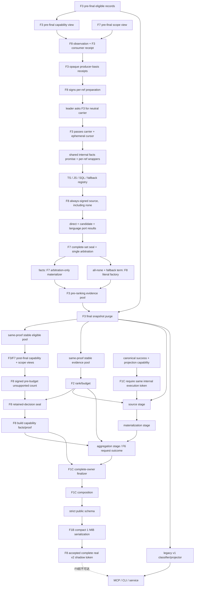

# language-capability-boundary feature design

## 0. 术语约定

| 术语 | 定义 | 边界 |
|---|---|---|
| language extension view | F3在验证same-execution pre-final capability membership后，通过opaque eligible ref只提供private-basename-derived last extension与opaque context ref | F8没有POSIX segments、identity、locator、public/redacted file或post-final extension accessor，不调用path normalize，不创建第二locator |
| semantic adapter | 只对一个已验证、scope-included record执行语言相关direct classification与derived candidate proposal的deep module | 不负责搜索、读文件、scope、negative filter、ranking或public redaction |
| shared ECMAScript lexical kernel | TypeScript与JavaScript adapter复用的comment/string/template masking、identifier与balanced-scope基础设施 | mode-specific definition/type规则仍由各adapter拥有，不把任意文本当JavaScript |
| unsupported fallback adapter | 对其他bounded UTF-8文本文件只保留verified literal hit的adapter | 不做syntax/alias/definition/sibling推断，不产生confirmed |
| language capability observation | F8把每个pre-final eligible ref、exact capability view、extension、context ref、adapter/mode decision、F7 pre-final scope confirmation与execution绑定后签发的opaque token | caller不能看到identity/locator、提交mode/context、按display file或post-final view重选adapter，或提交unsupported count |
| stable unsupported record | final snapshot purge后仍位于same-proof stable eligible discovery pool且adapter decision为fallback的唯一record | 即使classification为undefined或evidence budget未保留也计数 |
| capability owner | F8产出的`CapabilityCoverage` fragment、owner-specific contribution与proof | F6只聚合contribution；F1C只组合完整owner，不重算语言 |

## 1. 决策与约束

### 需求摘要

本feature把当前散落在`direct-mapping-classifier.ts`与`candidate-policy.ts`中的
JavaScript-like/SQL启发式拆成唯一`LanguageEvidenceAdapterRegistryV2`。v2 lane只为
TypeScript、JavaScript与SQL提供semantic classification；其他已验证文本文件进入严格literal
fallback，只能产生candidate。F8还从F3 same-proof stable eligible discovery pool计算
`unsupportedLanguageHits`，签发最后一个真实fact owner，使canonical pipeline首次可以完成真实
v2 shadow composition，但production service/MCP/CLI仍由v1 projector拥有。

成功标准：

1. adapter选择只依赖F3验证的最后extension，固定支持TypeScript、JavaScript、SQL三组，其余为fallback。
2. TypeScript/JavaScript复用一个lexical kernel，但mode-specific syntax不能互相冒充。
3. SQL adapter只执行冻结的SQL alias/table语义；embedded SQL只由TS/JS adapter现有受控call-string规则处理。
4. fallback record永不confirmed、永不派生neighbor；有verified literal term时只产生`UNSUPPORTED_LANGUAGE_LITERAL` candidate与`SUPPORTED_LANGUAGE_ADAPTER_REQUIRED`。
5. F7 `candidate-only`是所有adapter之上的hard ceiling；任何adapter都不能提升显式test/docs为confirmed。
6. `unsupportedLanguageHits`只从negative/merge/dedupe/final snapshot purge后的stable eligible pool计算，发生在F2 evidence budget前。
7. fallback classification为undefined、candidate被F2预算丢弃或public field被替换都不改变unsupported count。
8. capability fragment、contribution、language observation、stable eligible pool、F3 snapshot/fold proof与F7 scope proof绑定同一execution。
9. F8先使snapshot/ranking/scope/capability四prerequisite齐全，随后source/materialization exact-once；aggregation exact-once产生backend/request-outcome/status并经F1C registrar创建新的private complete envelope，finalizer只消费completion-bearing token。F1C composer/serializer第一次对真实pipeline各调用一次并通过v2 Golden/forbidden scan。
10. F9前production继续返回same-run exact v1 projection；完整real v2 shadow仍不能从transport roots到达。

### 明确不做

- 不新增Python、Go、Rust、Java、C#、HTML、CSS或Markdown semantic adapter。
- 不引入Tree-sitter、TypeScript compiler API、SQL parser或其他第三方parser。
- 不从`question`、excerpt内容、backend source、scope layer或Git状态猜测语言。
- 不把fallback literal candidate称为semantic result，不给它confidence，不允许promotion绕过adapter requirement。
- 不从F2 retained evidence、public DTO、scope fragment或redacted file反推unsupported count。
- 不改变F2 ranking tier/budget、F3 snapshot/identity、F6 status truth table或F7 path policy。
- 不在F8注册v2 MCP/CLI output、修改production projector binding、移除`private`或发布package。

### 方案深度 pre-pass

| 候选 | 结论 | 原因 |
|---|---|---|
| 继续用`.sql`分支，其余全部走同一JS-like regex | 拒绝 | 任意文本会被误宣称semantic capable，fallback无法保持candidate-only |
| 每个语言复制mask/token/candidate代码 | 拒绝 | TS/JS修复会漂移，candidate reason与resource bound出现多真值 |
| extension registry + shared lexical kernel + mode adapter + literal fallback | 采用 | adapter选择、能力声明与fallback ceiling集中且可逐项卸载 |
| 先按最终retained evidence统计unsupported | 拒绝 | evidence budget会隐藏真实能力缺口，违反public contract |

### 复杂度档位

- Correctness：有限extension表、四种adapter decision与candidate/confirmed ceiling真值表。
- Determinism：ASCII extension fold、one-record-one-decision、enum-order capability tuple与permutation hash。
- Security：只读F3/F7 trusted views；fallback不运行semantic regex；无raw path/public反推。
- Compatibility：expanded-v2采用新adapter lane；legacy-v1在F9前保持当前classifier/candidate lane deep-exact。
- Performance：每个pre-final eligible ref选择adapter一次；shared lexical kernel每个verified context + mode最多物化一次。

### 关键决策

1. **extension authority只在F3 capability trust domain**：canonical executor先取得F3
   `TrustedPreFinalCapabilityViewV2`，F8只可枚举其
   `records(): {eligibleRef,fileBucketRef}[]`并对exact `eligibleRef`调用
   `verifiedLastExtension(ref)`与`verifiedLanguageContext(ref)`。F8没有POSIX segments、
   identity、locator、root、raw native path或public/redacted file accessor，也不得从display file
   重建extension。F3从private locator的verified POSIX basename按code unit寻找最后一个`.`；
   dot必须既不是首字符也不是末字符，
   extension才存在。只把ASCII `A..Z`折为小写，不做locale/Unicode fold、NFKC、trim、
   separator conversion或`path.extname` normalize。`.ts`、`file.`、全角dot与无dot均fallback；
   `file.d.ts`按最后`.ts`识别TypeScript；`file.ts.txt`为fallback。
2. **registry表与冲突失败**：唯一冻结表为
   `typescript=.ts|.tsx|.mts|.cts`、
   `javascript=.js|.jsx|.mjs|.cjs`、`sql=.sql`，最后是无extension集合的fallback。
   registry构造时检查ASCII-fold后extension非空、带单个leading dot、全局唯一；重复、重叠、
   非ASCII或fallback提前出现直接失败。public `semanticClassification`固定输出
   `['typescript','javascript','sql']`，不从运行时注册顺序生成。
3. **F8 observation factory是唯一adapter decision authority且注入F3 consumer receipt**：
   composition root先用F3 `language-capability` owner admission登记F8
   `VerifiedLanguageCursorConsumerV2`并取得exact `RegisteredVerifiedLanguageConsumerV2`；普通caller
   不能创建或替换receipt。唯一
   `createTrustedLanguageCapabilityObservationV2(capabilityView,scopeView,registeredConsumer,
   execution)`只接受exact `TrustedPreFinalCapabilityViewV2`、F7
   `TrustedPreFinalScopeClassificationViewV2`、该receipt与execution，
   逐`eligibleRef`读取extension/context ref并调用F7 pre-final accessor；`excluded`在此接口不可出现。
   registrar还必须为每个ref调用F3 `requirePreFinalProducerBasisReceiptsV2`，所得
    `VerifiedProducerBasisReceiptsV2`只含basis、matched-term、anchor、symbol、record-source opaque
   receipts，F8没有path/location/provenance accessor。registrar验证两个view覆盖同一pre-final
   eligible pool、每个ref恰好一次、file bucket一致、extension/adapter/mode/context/scope与basis
   receipt映射、registered consumer及execution后签发无own-property
   `TrustedLanguageCapabilityObservationV2`。
   missing/extra/swap ref、伪造extension/decision、basis/term/anchor/symbol/source receipt clone或swap、
   cross-view、cross-pool或cross-execution在classification前拒绝。
4. **F3-neutral carrier + shared internal facts promise + distinct per-ref wrapper**：把当前
   `maskNonCode`、identifier tokenization、balanced structure与SQL mask抽入
   `src/evidence/language/*-lexical-kernel-v2.ts`。F8只type-import F3
   `VerifiedLanguagePreparationCarrierV2`、registered consumer与consumption proof，不让F3 import
   `LanguageLexicalPreparationRefV2`或任何F8 type/factory。F8先调用唯一
   `createLanguageLexicalPreparationRefV2(observation,eligibleRef,execution)`，从observation private
   record派生并绑定exact eligible ref、context、adapter、`ts|tsx|js|jsx|sql` mode与execution；
   caller不提供context、mode、scope decision或lexical facts。随后
   `prepareLanguageClassificationInputV2`只接受
   `{kind:'semantic',preparationRef}|{kind:'fallback'}`并与observation adapter exact匹配；semantic
   分支在`context ref + mode + execution`首次leader出现时，才用observation内F3 capability view/
   context ref/registered consumer调用F3
   `issueVerifiedLanguagePreparationCarrierV2`；F8 private registry把neutral carrier绑定leader
   observation/ref/context/mode/runtime provenance，再调用F3
   `consumeVerifiedLanguageContextV2`。F3 callback只回传exact carrier与有界ephemeral code-unit
   cursor并签one-shot consumption proof，不认识或透传F8 preparation ref，也不暴露string/lines/
   source accessor。fallback分支禁止创建carrier且不调用resolver。
   F8 private lexical registry以`exact context ref + mode + execution`为key，preparation registry另以
   `observation + eligibleRef + context + mode + execution`绑定leader/follower，状态严格为
   `pending|fulfilled|failed|disposed`：首调用原子登记并启动一个private shared lexical-facts
   promise；same context+mode并发/双eligible ref只允许leader发行/消费一个F3 carrier并调用一次
   resolver/kernel。每次`prepareLanguageClassificationInputV2`必须返回distinct per-ref wrapper
   promise；wrapper只await同一internal promise，再签绑定自己observation/ref/preparation/scope/basis的
   input，不能把leader input token或同一public promise交给follower。
   `fulfilled`返回同一facts token，`failed`为terminal且不重试；abort-before-start直接登记
   disposed且kernel计数0，abort-during/dispose把pending原子terminalize为disposed，late resolve/
   reject不得publish，后续同key调用固定失败。tombstone不删除，保留到execution registry整体
   不可达；旧token与consumption proof立即失效。followers只复用internal facts promise并由F8把
   自身preparation ref绑定到leader carrier/proof；相同context的两个合法mode分别有一个leader。
   任意两个per-ref wrapper promise identity相同、直接重复F3 resolver、carrier/preparation/ref/context/mode swap或
   late follower settlement均失败。最终签发的
   `VerifiedSemanticLanguageClassificationInputV2`绑定observation/ref/context/mode/facts/
   preparation ref/leader consumption proof/F7 scope view与decision/execution；fallback input绑定同一
   observation/ref/scope/basis receipts与verified literal facts但不消费lexical cursor。wrong-mode、
   preparation/context/ref/scope swap、read-before-verify、cross-execution、duplicate resolver、
   bare kernel import与post-dispose reentry都在adapter前失败。adapter只能经input accessor读取
   consumer-neutral facts，不能再次reader/window/mask/tokenize。
5. **TypeScript/JavaScript与JSX模式冻结**：`.ts|.mts|.cts`使用`ts`，`.tsx`使用`tsx`；
   `.js|.mjs|.cjs`使用`js`，`.jsx`使用`jsx`。TS允许现有assignment/object、
   class/function/method execution definition，以及`interface|type|enum`与type-position suppression；
   JS只允许共同runtime规则，TS-only declaration/type position不得成为definition。`tsx|jsx`
   lexical state把tag name、JSX text、attribute name与quoted/unquoted attribute value全部mask为
   non-semantic；只有balanced `{...}` expression内部恢复相应TS/JS lexical facts。generic-vs-JSX
   ambiguity、未闭合tag/attribute/string/brace均令`structureComplete=false`，整条只能进入
   literal/reference candidate路径且不得confirmed；TSX type syntax只在TS expression mode有效。
6. **embedded SQL调用与JavaScript literal decode合同完整冻结**：TS/JS adapter只识别callee exact为
   `query|select|addSelect`的bare call或非computed、非optional的完整member-chain call。
   调用必须恰有一个参数，参数必须是闭合的single/double-quoted literal。bounded、无`eval`/
   `Function`/`JSON.parse`的scanner直接消费raw source slice；仅接受普通非line-terminator code
   units及safe escapes `\\`、`\'`、`\"`、`\n`、`\r`、`\t`，并先解码为exact JS string payload
   再交SQL masker。escaped quote/backslash与上述控制escape可进入semantic；line continuation、
   `\xNN`、`\uNNNN`、`\u{...}`、legacy octal、`\0`、identity escape、trailing backslash或非法
   escape均把`structureComplete`置false且不调用SQL helper。template/tag/interpolation、
   computed/optional callee、额外参数、未闭合quote、未配平paren或嵌套不完整同样false。
   false只能进入F7 verified-literal分支；有filesystem-verified matched term时为literal candidate，
   无term时为undefined，绝不保证每个不完整调用都产candidate。
   `requireCompleteEmbeddedSqlLiteralFactsV2`返回opaque complete fact后，SQL helper才可读取alias
   mapping；不能从partial string猜测semantic。
7. **SQL adapter**：`.sql`使用同一fatal-bounded verified context上的one-time SQL facts，支持
   `source AS target`、`CREATE TABLE`同table column sibling与冻结identifier规则；
   comment/string/dollar-quote和nested block comment均不参与semantic match。SQL helper显式返回
   `structureComplete`；paren、quote、dollar quote或nested comment未闭合时只能literal candidate。
   JavaScript assignment/object/function语法不得当SQL semantic。
8. **三semantic adapter + 一fallback policy使用总是signed的dispatch contract**：
   `LanguageEvidenceAdapterV2`是discriminated union；semantic三分支只能消费对应verified lexical
   facts并返回F8-private `LanguageAdapterProducerSourceRefV2`；即使supported adapter没有合法facts，
   也必须返回绑定observation/ref/context/mode/basis/execution的signed source，`producerKind:'none'`，
   不得用TypeScript `undefined`跳过F7 port。fallback分支只消费verified literal facts，但dispatch
   同样总是返回带signed source的
   `fallback-literal|fallback-none`。registry dispatch一次并返回闭合
   `LanguageAdapterProducerResultV2`，不得让fallback假装实现semantic `classify`或让caller绕过
   registry直调adapter。`.sql` structure incomplete且无verified term必须得到supported signed
   `none`；有term才是`verified-literal`。
   F7 acceptance时同一registrar只有direct/candidate两个base ports；F8本revision从composition
   root接收F7 `ScopeBoundProducerChildPortAdmissionV2`，由F8-owned
   `createLanguageAdapterScopeProducerResolverV2(observation,execution)`构造neutral resolver，再
   `registerLanguageAdapterScopeProducerPortV2(registrar,admission,resolver,execution)`原子登记为
   第三个owner，不建立平行registry或runtime flag。该resolver只识别F8 private WeakMap source ref并
   严格返回`{kind:'facts',view}|{kind:'none'}`；fallback source与supported `producerKind:'none'`
   都返回signed none。facts view只携带producer kind、exact
   `VerifiedProducerBasisReceiptsV2` bundle及必要definition/derived enum，不携带path/location/
   provenance。F8不能签F7 arbitration/facts token，forged或wrong-owner source不能降级成合法none。
9. **完整三port arbitration与唯一零或一draft composition**：每条record的F8 dispatch result都必须
   调用`registerLanguageAdapterProducerSourceV2`进入F7 registrar；direct/candidate/language三个
   registered ports各有一个signed result后，canonical root只能调用F7 complete-set seal与single
   cross-port arbitration。supported source由arbitrator调用F3 basis verifier后，与base proposals按
   F7 precedence/owner tie共同选择；F7 `materializeScopeBoundEvidenceV2`只接opaque arbitration。
   `materializeLanguageCapabilityRecordV2(result,arbitration,scopeView,record,observation,execution)`
   是F8 revision的唯一零或一draft composition：若F7 arbitration已有facts，直接返回F7 materializer
   结果并抑制fallback；若arbitration为none且result为`fallback-literal`，才调用F8单一fallback
   factory；supported none或fallback-none返回undefined。这样任一record不可能由base与language/
   fallback双物化，异常source固定fail closed，F8不得自建supported downgrade mapper。
   direct alias + anchored symbol、direct alias + term、anchored definition/execution、anchored
   reference only、verified literal、secondary backend、derived neighbor与undefined在
   `allowed|candidate-only`下的role/reason/promotion/symbol必须逐格等于F7八行表。
   F8 dispatch `producerKind`必须与F7 port解析source得到的kind exact相等；source/port/ref/
   basis/term/anchor/symbol/source receipt、location/provenance/term/anchor/reason/symbol swap在facts或
   draft前失败。adapter-specific logic
   不能改变输出shape；`candidate-only`由F7 factory/materializer在draft前阻止confirmed，不允许先
   confirmed后DTO降级。
10. **fallback严格literal**：fallback不调用ECMAScript/SQL kernel、不读neighbor context、不创建
   derived draft。唯一F8 `materializeFallbackLiteralCandidateV2`只接受registry签发的opaque
   fallback-literal facts；record至少有一个filesystem-verified exact matched term时生成恰好一个
   `{evidenceClass:'candidate',role:'reference',
   reasonCodes:['UNSUPPORTED_LANGUAGE_LITERAL'],
   promotionRequirements:['SUPPORTED_LANGUAGE_ADAPTER_REQUIRED']}` draft；location只保留该record
   已验证的file/lines/excerpt及已有exact symbol，不改写symbol。无matched term时classification
   为undefined，但record仍留在eligible pool并计unsupported。多个terms/reasons不复制candidate。
11. **pre-final双lane与v1隔离**：expanded-v2只消费F8 observation/adapter结果；legacy-v1继续当前
    `classifyDiscoveryRecords`与`applyCandidatePolicy`行为，包括当前任意非SQL文本的legacy
    JS-like处理。两lane共享F3 decoded snapshot与允许的consumer-neutral tokens，但拥有独立
    classification/candidate record universe；expanded fallback不得删除、保留或抑制legacy
    candidate。F9前v1 IDs/order/coverage/Golden deep-exact。
12. **exact pre-budget count producer/accessor**：final snapshot check同步purge eligible/evidence pools后，
   F8只接受F3 `TrustedStableEligibleCapabilityViewV2`与F7
   `TrustedStableEligibleScopeViewV2`；二者必须绑定exact eligible pool、snapshot proof、
   fold proof与execution。F8逐`eligibleRef`用F7 stable accessor验证included/confirmation，
   再从private observation registry读取pre-final adapter decision；post-final capability view只有
   stable `eligibleRef/fileBucketRef` records，没有extension、context或path accessor，不能重新选adapter。
    `createCapabilityPreBudgetCountV2(observation,stableCapabilityView,stableScopeView,
    eligiblePool,snapshotProof,foldProof,scopeProof,execution)`是唯一producer；它在任何F2 evidence
    budget前计算adapter=`fallback`的globally unique eligibleRef set并签无own-property
    `CapabilityPreBudgetCountV2`。`requireCapabilityPreBudgetCountV2`用同一完整expected tuple验证后
    只暴露nonnegative safe `unsupportedLanguageHits`；不要求classification成功或candidate retained，
    caller不能提交count/ref array。
13. **product truth table冻结最终membership**：每条record必须同时满足
    `semantic adapter/fallback decision × F7 producer kind × confirmation × structure completeness ×
    exact matched-term presence × post-final stable membership`；producer kind闭合为
    `direct-anchored|direct-term|anchored-definition|anchored-reference|verified-literal|secondary|
    derived-neighbor|none`。非stable永不进入
    count或retained evidence；
    supported + complete按F7 producer表materialize；supported + incomplete只允许verified literal
    candidate；fallback + term只允许fallback literal candidate；fallback + no term为undefined但计
    unsupported；任何adapter + `candidate-only`都不能confirmed。非法组合（fallback semantic
    producer、incomplete semantic producer、verified-literal without term、none with term、
    complete supported term-only却未登记verified-literal等）在materializer前fail closed。
    F8-ADAPTER-PRODUCT-001覆盖adapter/mode × F7八行 × confirmation × completeness × term ×
    membership及合法/不适用约束与每格role/reasons/promotions/symbol，作为唯一跨adapter
    acceptance oracle。
14. **fragment与contribution单向派生且build API完整**：F8-owned strict Zod schema定义
    `CapabilityOutcomeContributionV2 {owner:'capability',unsupportedLanguageHits}`，TypeScript
    type从`z.output`递归readonly派生。`buildCapabilityCoverageV2`一次把固定
    `CapabilityCoverage` fragment、同值contribution与opaque `CapabilityCoverageProofV2`
    封存在无own-property `CapabilityCoverageFactsV2`。唯一
    `buildCapabilityCoverageV2(preBudgetCount,retainedDecisionSeal,observation,eligiblePool,
    snapshotProof,foldProof,scopeProof,execution)`只能读取已验证pre-budget count与seal；count为
    `0..Number.MAX_SAFE_INTEGER`。F6只调用F8 accessor，count>0时唯一加入
    `SEMANTIC_LANGUAGE_UNSUPPORTED`并影响既有status truth table；F8不构造request-outcome。
15. **F8独占retained-decision seal与coverage验证**：F2 ranking完成后，只有
    `src/evidence/language/capability-coverage-v2.ts`中的唯一
    `sealCapabilityRetainedDecisionsV2(preBudgetCount,rankingOutcome,observation,eligiblePool,
    snapshotProof,foldProof,scopeProof,execution)`第一步调用F2
    `requireEvidenceRankingRetainedDecisionViewV2(rankingOutcome,snapshotProof,execution)`，只取得
    confirmed/candidate两组`StableRecordRefV2[]`，再逐项核对这些retained refs与pre-final
    adapter/arbitration/materialized decision ledger，签无own-property
    `CapabilityRetainedDecisionSealV2`；caller不能提交decision/ref array。随后decision 14 builder
    封存`CapabilityCoverageFactsV2`。private registry绑定fragment、contribution、observation、
    exact stable eligible pool、snapshot/fold/scope proofs、unsupported ref set、每条retained
    evidence的exact adapter/producer/materialized decision与execution。唯一
    `requireCapabilityCoverageFactsV2(facts,expectedPreBudgetCount,
    expectedRetainedDecisionSeal,expectedObservation,expectedEligiblePool,
    expectedSnapshotProof,expectedFoldProof,expectedScopeProof,expectedExecution)`在暴露值前由F8
    重验固定tuple `['typescript','javascript','sql']`、count、unsupported set与retained decision：
    fallback retained evidence必须candidate且fallback reason/promotion exact，supported evidence
    不得带fallback reason，所有输出必须符合F7 materializer表。F1C只调用该accessor并组合完整
    owner，不重算tuple/count/adapter/output mapping。pool/record/decision/count/fragment/
    contribution/proof swap统一`invalid-facts`，composer/serializer调用0。F8不得import
    `EvidenceRankingSourceViewV2`、`RankedUnsafeEvidenceRefV2`、raw drafts、file bucket、budget/trace
    internals；accepted orchestrator、F6与package barrel不得import该retained-decision accessor。
    F8 child revision同时、原子地把F7 accepted三项
    `RequestOutcomeAggregationContributionTupleV2`扩为exact readonly四项：
    `[PublicMaterializationContributionV2, SnapshotOutcomeContributionV2,
    ScopeOutcomeContributionV2, CapabilityOutcomeContributionV2]`，index固定
    `0=materialization,1=snapshot,2=scope,3=capability`。F6 aggregator在读取任何值前按此顺序对四项
    各调用exact owner accessor一次；F7三项tuple、missing/extra/duplicate/reorder、index3 clone、
    cross-execution与capability proof swap均fail closed且所有fragment/status输出为0。该原子revision
    是F8-owned type/accessor/test delta，不回写F7 acceptance，也不允许optional/future slot。
16. **首个真实完整v2 shadow与accepted orchestration**：F8先由canonical fact builder在调用accepted
    orchestrator前，把decision 14 accessor验证的capability fragment向base envelope exact add一次；
    F7 scope、F3 snapshot、F2 ranking已由各自owner挂载，因此此时base inventory恰好是
    `snapshot/ranking/scope/capability`四prerequisite且没有backend/request-outcome。add duplicate、
    wrong proof或在source后late-add均失败。aggregation registrar随后补齐后两owner，最终private
    complete inventory才恰好为六项。F8在
    `src/evidence/canonical/accepted-complete-real-locate-shadow-orchestrator-v2.ts`实现唯一
    `AcceptedCompleteRealLocateShadowOrchestratorV2`，按冻结七stage调用F1C/F1A/F1B/F6 seams，
    产出capability-bound opaque accepted token或typed failure；success accessor返回F1C已预算的
    exact value/compact JSON/bytes与`TrustedSerializedLocateResultV2`，不重新serialize。real
    shadow据此产出首个完整v2 Golden/forbidden scan。同一文件独占internal
    `ACCEPTED_COMPLETE_REAL_LOCATE_SHADOW_ORCHESTRATOR_V2` DI token、
    `createAcceptedCompleteRealLocateShadowOrchestratorV2()` factory与七个私有stage wrapper；
    outer factory在构造时还必须exact一次调用F2
    `createF2LocateProjectionStagesV2()`，把返回对象的`createSource/materialize`方法分别闭包绑定到
    前两个wrapper，禁止F8重建F1B preflight、source schema、F1 corpus/materializer或字段budget。
    `src/evidence/evidence.module.ts`只登记一个`useFactory` provider，不export该token，且
    `LOCATE_RESULT_PROJECTOR`继续唯一绑定v1。factory/token/interface只允许internal deep import，
    不进入package barrel。这不改变`RepositoryEvidenceService.locate()`、MCP或debug CLI的v1
    projector binding。
17. **有界确定性**：一个eligible ref一次adapter decision、一个context + mode一次lexical
    materialization；最大stable
    eligible set在五种backend/input permutation下adapter membership、unsupported count、
    fragment/contribution hash、v2 shadow arrays与v1 hash稳定。artifact只记录fixture IDs、
    adapter kind/count/hash，不记录raw path、excerpt、term、symbol、identity或locator。
18. **F4 platform binding按child-owned revision扩展**：F4 base与F7 revision均不要求F8
    ID/fixture/owner/marker；F8 implementation在已通过F4/F7后于本feature同一revision先扩展F4唯一
    `testkit/contracts/platform-contract.ts`中的`PlatformContractIdV1` union，再增加exact
    `{contractId:'F8-LANG-001',surface:'unit',group:'language-capability-boundary',
    executableCaseId:'language-extension-and-fallback',
    applicableOs:['linux','win32','darwin'],
    requiredAssertionIds:['typescript-extension','javascript-extension','sql-extension',
    'fallback-candidate-only','unsupported-count-before-budget'],
    fixture:'testkit/fixtures/language-capability-v2/extension-matrix-v2.ts',
    assertionOwner:'test/unit/language-capability-platform.spec.ts'}`。unit owner必须位于Vitest
    include可达路径，不创建`test/platform`或第四surface。F4 self-test覆盖删除binding/assertion、
    漏fixture/assertionOwner、wrong-path/zero-marker、错tuple、未扩展union或缩小OS集合。
19. **实现准入与复用**：implementation等待F7 acceptance done，因此F1A/F1B/F1C/F3/F2/F5/F6
    也已通过依赖链。必须复用F3 stable eligible/evidence双池、F7 scope accessor、F6 contribution
    registry与F4 platform registry；actual signature/proof/order漂移时重跑F8独立design review，
    不创建平行path mapper、eligible pool、coverage aggregator或public composer。
20. **F9只消费一个冻结的upstream façade**：stage顺序literal固定为
    `source → materialization → aggregation → owner-finalization → composition → schema →
    serialization-budget`。每stage有唯一fixed failure code与exact 0/1 counter；stage `i`失败后
    `i+1..n`为0。F1C finalizer只签`TrustedFinalizedLocateFactsV2`，composition、schema与
    serialization必须分别调用F1C冻结的composer/schema validator/serializer，禁止在一个callback内
    折叠。F8-owned zero-argument factory先从F2 exact deep module调用
    `createF2LocateProjectionStagesV2()`一次，再从F1C exact deep modules分别调用
    `createRequiredOwnerFinalizerV2()`与`createMaterializedLocateResultComposerV2()`各一次；
    将F2返回对象的两个exact methods以及F1C返回的两个窄接口实例分别闭包绑定到对应private
    wrapper，再把七个exact wrapper一次装配成ready singleton；
    `EvidenceModule`的provider inventory对missing、duplicate、wrong token、wrong factory及export
    mutation fail closed。accepted orchestrator收到canonical success与F1C-issued
    `LocateProjectionExecutionCapabilityV2`后，第一步且只一次调用F1C
    `requireCanonicalLocateExecutionTokenV2(input,capability)`恢复canonical executor登记的同次
    `LocateExecutionTokenV2`，随后以
    `inspectLocateProjectionPrerequisiteOwnersV2(input.envelope,input,execution)`确认
    snapshot/ranking/scope/capability四prerequisite且base未预置backend/request-outcome；任一pre-stage
    gate失败时七stage counters全0。success返回opaque prerequisite token并写入shared context；
    backend/request-outcome缺失不阻止source。七个exact stage callbacks全部接收同一个只读context，不能重建token、
    依赖隐式global state或让F9补参数。F8 private registry把accepted/failure token绑定canonical
    success object、projection capability、internal token、stage terminal与serialized token；F9 production只可
    internal deep import DI token、orchestrator interface、attempt union和
    `requireAcceptedCompleteRealLocateShadowV2`，不得import factory、provider descriptor、stage owners、
    counter probe或F1C `createRequiredOwnerFinalizerV2`、
    `createMaterializedLocateResultComposerV2`、internal-token accessor/serializer。canonical input、
    projection capability与internal token的
    clone/swap/stale/cross-execution matrix必须在source callback或任何facts/value暴露前失败。
    aggregation wrapper必须调用
    `requireF2MaterializedEvidenceCoreV2(materialization,context.input,context.execution)`从F2 private
    registry反向恢复并验证source/core，不得要求source参数；再调用F6 real
    `RequestOutcomeAggregatorV2`及owner accessors，最后以F1C
    `registerTrustedLocateProjectionAggregationV2({identity: aggregation, statusV2:
    aggregation.statusV2, backend: aggregation.backend, requestOutcome:
    aggregation.requestOutcome},materialization,
    context.input,context.execution)`登记第三段。exact stage counter harness owner为
    `testkit/testing/complete-real-locate-shadow-stage-probe-v2.ts`，production token/accessor不暴露
    stage、owner facts、root、terms、proof、JSON byte budget或registry detail。

adapter product truth source分为“合法坐标”与“输出”两张闭合表；“F7 exact row”指F7八行
producer真值表中的完整`class/role/reasons/promotions/symbol`，不是F8自定义近似映射。
`term=任意`表示该producer自己的F7 receipt决定term事实且不会由F8猜测：

| adapter / mode | producer kind | structure | exact matched term | 合法性 |
|---|---|---|---|---|
| TypeScript `ts|tsx`、JavaScript `js|jsx`、SQL `sql` | `direct-anchored` | complete | yes | 合法；对应F7 direct mapping + anchored symbol |
| 同上 | `direct-term` | complete | yes | 合法；对应F7 direct mapping + matched term |
| 同上 | `anchored-definition` | complete | 任意 | 合法；对应F7 anchored definition/execution |
| 同上 | `anchored-reference` | complete | 任意 | 合法；对应F7 anchored symbol reference only |
| 同上 | `secondary` | complete | 任意 | 合法；对应F7 secondary backend candidate |
| 同上 | `derived-neighbor` | complete | 任意 | 合法；对应F7 verified candidate context/token neighbor |
| 同上 | `verified-literal` | complete或incomplete/ambiguous | yes | 合法；只对应F7 verified literal row |
| 同上 | `none` | complete或incomplete/ambiguous | no | 合法；undefined |
| 同上 | 任一semantic producer kind | incomplete/ambiguous | 任意 | 非法；semantic facts不得从不完整结构发布 |
| 同上 | `verified-literal` + no term，或`none` + term | 任意 | 对应矛盾值 | 非法；在materializer前拒绝 |
| fallback | `none` + result `fallback-literal` | not-applicable | yes | 合法；language port签none，且仅全port arbitration none后进F8 fallback factory |
| fallback | `none` + result `fallback-none` | not-applicable | no | 合法；language port签none，undefined |
| fallback | 任一semantic producer kind，或result/term矛盾 | 任意 | 任意 | 非法；在source registration/materializer前拒绝 |

supported adapter在自己的language port内必须先使用与F7相同的互斥first-match precedence，不得按
adapter各自重排；随后F7 record-set arbitrator还会把该唯一language proposal与direct/candidate
ports按同一kind precedence及owner tie统一裁决：

| overlap | selected producer kind | suppressed |
|---|---|---|
| direct mapping + anchor（可同时有literal/secondary/derived） | `direct-anchored` | 其余全部 |
| direct mapping + term、无anchor | `direct-term` | literal/secondary/derived |
| anchored definition/execution + literal、无direct | `anchored-definition` | reference/literal/secondary/derived |
| anchored reference + literal、无direct/definition | `anchored-reference` | literal/secondary/derived |
| literal + secondary、无direct/anchor | `verified-literal` | secondary/derived |
| secondary + derived、无更高facts | `secondary` | derived |
| 任一base semantic/candidate + derived | 更高base kind | derived |
| 仅derived / 无facts | `derived-neighbor` / `none` | none / 其他facts |

F8-ADAPTER-PRODUCT-001必须把上述每个intra-port overlap与single-fact对照成对执行，并另覆盖
direct/candidate/language三port overlap与same-kind owner tie；任何漏port、同record双source、
双draft或把derived提前的实现都失败。

对每个合法坐标再与`scope confirmation × post-final membership`做exact product：

| producer kind / adapter | `allowed` + stable | `candidate-only` + stable | purged / non-stable | unsupported count |
|---|---|---|---|---|
| supported `direct-anchored` | F7该producer的`allowed` exact row | F7该producer的`candidate-only` exact row | 无输出 | 0 |
| supported `direct-term` | F7该producer的`allowed` exact row | F7该producer的`candidate-only` exact row | 无输出 | 0 |
| supported `anchored-definition` | F7该producer的`allowed` exact row | F7该producer的`candidate-only` exact row | 无输出 | 0 |
| supported `anchored-reference` | F7 reference-only candidate exact row | 同一F7 reference-only candidate exact row | 无输出 | 0 |
| supported `verified-literal` | F7 literal candidate exact row | 同一F7 literal candidate exact row | 无输出 | 0 |
| supported `secondary` | F7 secondary candidate exact row | 同一F7 secondary candidate exact row | 无输出 | 0 |
| supported `derived-neighbor` | F7 derived-neighbor candidate exact row | 同一F7 derived-neighbor candidate exact row | 无输出 | 0 |
| supported `none` | undefined | undefined | 无输出 | 0 |
| fallback result `fallback-literal` + F7 arbitration none | 单个fallback literal candidate，reason/promotion exact | 完全相同；永不confirmed | 无输出 | stable为1，否则0 |
| fallback result `fallback-literal` + F7 arbitration facts | F7 winning base row；fallback抑制 | 同一F7 winning base row | 无输出 | stable为1，否则0 |
| fallback result `fallback-none` | undefined | undefined | 无输出 | stable为1，否则0 |

因此`complete + term=yes`但没有semantic facts的supported record必须显式登记
`verified-literal`，不能落入`none`；`complete + term=no`且无semantic facts才是`none`。post-final
view只过滤stable membership并读取pre-final ledger，不可改变producer kind、mode或adapter。

one-time lexical registry的状态迁移也是验收真值，而不是cache实现提示：

| 当前状态 / 事件 | 下一状态 | kernel调用 | facts发布 / 后续调用 |
|---|---|---:|---|
| absent + active prepare | pending | 1 | 创建一个private shared facts promise；返回该ref独立wrapper |
| absent + already aborted/disposed | disposed tombstone | 0 | fixed `language-context-disposed` |
| pending + duplicate/concurrent prepare | pending | 0新增 | 复用internal promise但每ref wrapper promise identity不同 |
| pending + resolve且execution active | fulfilled | 0新增 | 发布同一opaque facts token，各ref另签input token |
| pending + reject且execution active | failed | 0新增 | terminal fixed internal failure，不重试 |
| pending/fulfilled/failed + abort或dispose | disposed tombstone | 0新增 | 已发布token/proof失效；后续固定失败 |
| disposed + late resolve/reject | disposed tombstone | 0新增 | 丢弃settlement，禁止publish |
| disposed/failed + reentry | 原状态 | 0 | fixed failure；不得重新登记 |

tombstone随request-scoped execution registry一起变为不可达，不在execution存活期间删除key。

embedded SQL safe decoder逐类冻结如下；“literal branch”仍由exact matched-term事实决定candidate
或undefined：

| raw JS literal内容 | decode结果 | `structureComplete` | SQL helper |
|---|---|---|---|
| 普通非line-terminator code units | 原code units | true | 调用 |
| `\\`、`\'`、`\"` | 单个backslash或quote | true | 调用 |
| `\n`、`\r`、`\t` | 对应控制code unit | true | 调用 |
| physical line continuation | 无payload | false | 不调用；literal branch |
| `\xNN`、`\uNNNN`、`\u{...}` | 不解码 | false | 不调用；literal branch |
| octal、`\0`、identity/unknown escape | 不解码 | false | 不调用；literal branch |
| trailing backslash、未闭合quote | 不解码 | false | 不调用；literal branch |

### Top 3 风险与缓解

| 风险 | 缓解 |
|---|---|
| extension从redacted/public path选择导致adapter漂移 | F3 same-execution locator accessor + F8 observation proof |
| unsupported count被evidence budget压低 | 独立stable eligible pool，count先于F2 budget |
| fallback或test/docs被semantic helper提升为confirmed | fallback无semantic kernel + F7 confirmation hard ceiling + finalizer反查 |

### 非显然依赖与基线风险

- 当前`direct-mapping-classifier.ts`约754行，把scope、JS-like、SQL与public evidence物化混在一起。
- 当前`candidate-policy.ts`约1004行，对除`.sql`外的任意file都运行同一JS-like token逻辑，F8会只在v2 lane收窄。
- current v2 schema已含capability tuple、fallback reason/promotion与degradation enum，但真实owner不存在。
- F3必须先交付stable eligible/evidence双池；F7必须交付same-proof scope observation和candidate-only ceiling。
- F6 aggregator必须已登记F8 contribution type，F1C finalizer必须允许real complete envelope。

### 必跑验证、交付物与清洁度

- extension：支持表、ASCII case、compound/hidden/trailing dot、Unicode lookalike与adapter registry mutation。
- semantic：`ts|tsx|js|jsx` shared/different/JSX states、one-time lexical facts、SQL mask/alias/table、
  embedded SQL complete-call grammar与incomplete structures。
- fallback：literal/undefined、candidate-only、no-neighbor、reason/promotion exact、candidate budget zero。
- counting：scope/negative/merge/dedupe/changed purge、classification undefined、evidence budget N/N+1。
- trust：eligible ref/view/extension/context/registered consumer/consumption proof/decision/input/lexical token/pool/proof/count/fragment/contribution clone与swap，以及pre/post capability API absence probe。
- compatibility：legacy v1 deep-exact、real complete v2 shadow、transport reachability no-cutover。
- platform：F8-LANG-001 exact registry tuple、unit owner与五marker六格。

## 2. 名词与编排

### 2.1 名词层

#### 现状

- `direct-mapping-classifier.ts`以`.sql`特判SQL，其余record都运行同一code matcher。
- `candidate-policy.ts`以`.sql`切SQL mask，否则对任意extension运行JS-like token/scope规则。
- v2 schema静态声明TS/JS/SQL能力与unsupported字段，但没有producer、proof或真实fragment。
- F1C real shadow在F7后只缺capability。

#### 变化

```ts
type LanguageAdapterKindV2 =
  | 'typescript'
  | 'javascript'
  | 'sql'
  | 'fallback';

type EcmaLexicalModeV2 = 'ts' | 'tsx' | 'js' | 'jsx';
type LanguageLexicalModeV2 = EcmaLexicalModeV2 | 'sql';
type LexicalRegistryStateV2 = 'pending' | 'fulfilled' | 'failed' | 'disposed';
type LanguageProducerKindV2 =
  | 'direct-anchored'
  | 'direct-term'
  | 'anchored-definition'
  | 'anchored-reference'
  | 'verified-literal'
  | 'secondary'
  | 'derived-neighbor'
  | 'none';

interface LanguageAdapterDecisionEntryV2 {
  readonly eligibleRef: EligibleDiscoveryRefV2;
  readonly adapter: LanguageAdapterKindV2;
  readonly scopeConfirmation: 'allowed' | 'candidate-only';
  readonly producerBasis: VerifiedProducerBasisReceiptsV2;
}

declare const TRUSTED_LANGUAGE_CAPABILITY_OBSERVATION_V2: unique symbol;
type TrustedLanguageCapabilityObservationV2 = Readonly<object> & {
  readonly [TRUSTED_LANGUAGE_CAPABILITY_OBSERVATION_V2]: never;
};

function createTrustedLanguageCapabilityObservationV2(
  capabilityView: TrustedPreFinalCapabilityViewV2,
  scopeView: TrustedPreFinalScopeClassificationViewV2,
  registeredConsumer: RegisteredVerifiedLanguageConsumerV2,
  execution: LocateExecutionTokenV2,
): TrustedLanguageCapabilityObservationV2;

declare const VERIFIED_ECMA_LEXICAL_FACTS_V2: unique symbol;
type VerifiedEcmaLexicalFactsV2 = Readonly<object> & {
  readonly [VERIFIED_ECMA_LEXICAL_FACTS_V2]: never;
};

declare const VERIFIED_SQL_LEXICAL_FACTS_V2: unique symbol;
type VerifiedSqlLexicalFactsV2 = Readonly<object> & {
  readonly [VERIFIED_SQL_LEXICAL_FACTS_V2]: never;
};

declare const FALLBACK_LITERAL_CANDIDATE_FACTS_V2: unique symbol;
type FallbackLiteralCandidateFactsV2 = Readonly<object> & {
  readonly [FALLBACK_LITERAL_CANDIDATE_FACTS_V2]: never;
};

declare const LANGUAGE_ADAPTER_PRODUCER_SOURCE_REF_V2: unique symbol;
type LanguageAdapterProducerSourceRefV2 = Readonly<object> & {
  readonly [LANGUAGE_ADAPTER_PRODUCER_SOURCE_REF_V2]: never;
};

declare const LANGUAGE_LEXICAL_PREPARATION_REF_V2: unique symbol;
type LanguageLexicalPreparationRefV2 = Readonly<object> & {
  readonly [LANGUAGE_LEXICAL_PREPARATION_REF_V2]: never;
};

type LanguageClassificationPreparationV2 =
  | Readonly<{
      kind: 'semantic';
      preparationRef: LanguageLexicalPreparationRefV2;
    }>
  | Readonly<{ kind: 'fallback' }>;

declare const VERIFIED_SEMANTIC_LANGUAGE_CLASSIFICATION_INPUT_V2: unique symbol;
type VerifiedSemanticLanguageClassificationInputV2 = Readonly<object> & {
  readonly [VERIFIED_SEMANTIC_LANGUAGE_CLASSIFICATION_INPUT_V2]: never;
};

declare const VERIFIED_FALLBACK_LANGUAGE_CLASSIFICATION_INPUT_V2: unique symbol;
type VerifiedFallbackLanguageClassificationInputV2 = Readonly<object> & {
  readonly [VERIFIED_FALLBACK_LANGUAGE_CLASSIFICATION_INPUT_V2]: never;
};

type LanguageAdapterProducerResultV2 =
  | Readonly<{
      kind: 'supported-source';
      producerKind: LanguageProducerKindV2;
      sourceRef: LanguageAdapterProducerSourceRefV2;
    }>
  | Readonly<{
      kind: 'fallback-literal';
      producerKind: 'none';
      sourceRef: LanguageAdapterProducerSourceRefV2;
      facts: FallbackLiteralCandidateFactsV2;
    }>
  | Readonly<{
      kind: 'fallback-none';
      producerKind: 'none';
      sourceRef: LanguageAdapterProducerSourceRefV2;
    }>;

type LanguageEvidenceAdapterV2 =
  | Readonly<{
      kind: 'typescript' | 'javascript' | 'sql';
      classifySemantic(
        input: VerifiedSemanticLanguageClassificationInputV2,
      ): Readonly<{
        producerKind: LanguageProducerKindV2;
        sourceRef: LanguageAdapterProducerSourceRefV2;
      }>;
    }>
  | Readonly<{
      kind: 'fallback';
      classifyLiteral(
        input: VerifiedFallbackLanguageClassificationInputV2,
      ): FallbackLiteralCandidateFactsV2 | undefined;
    }>;

function createLanguageLexicalPreparationRefV2(
  observation: TrustedLanguageCapabilityObservationV2,
  eligibleRef: EligibleDiscoveryRefV2,
  execution: LocateExecutionTokenV2,
): LanguageLexicalPreparationRefV2;

function prepareLanguageClassificationInputV2(
  observation: TrustedLanguageCapabilityObservationV2,
  eligibleRef: EligibleDiscoveryRefV2,
  preparation: LanguageClassificationPreparationV2,
  execution: LocateExecutionTokenV2,
): Promise<
  | VerifiedSemanticLanguageClassificationInputV2
  | VerifiedFallbackLanguageClassificationInputV2
>;

function dispatchLanguageEvidenceV2(
  input:
    | VerifiedSemanticLanguageClassificationInputV2
    | VerifiedFallbackLanguageClassificationInputV2,
  observation: TrustedLanguageCapabilityObservationV2,
  execution: LocateExecutionTokenV2,
): LanguageAdapterProducerResultV2;

function createLanguageAdapterScopeProducerResolverV2(
  observation: TrustedLanguageCapabilityObservationV2,
  execution: LocateExecutionTokenV2,
): ScopeBoundProducerChildResolverV2;

function registerLanguageAdapterScopeProducerPortV2(
  registrar: ScopeBoundProducerRegistrarV2,
  admission: ScopeBoundProducerChildPortAdmissionV2,
  resolver: ScopeBoundProducerChildResolverV2,
  execution: LocateExecutionTokenV2,
): RegisteredScopeBoundProducerPortV2;

function registerLanguageAdapterProducerSourceV2(
  result: LanguageAdapterProducerResultV2,
  registrar: ScopeBoundProducerRegistrarV2,
  registeredLanguagePort: RegisteredScopeBoundProducerPortV2,
  scopeView: TrustedPreFinalScopeClassificationViewV2,
  record: EligibleDiscoveryRefV2,
  execution: LocateExecutionTokenV2,
): ScopeBoundProducerSourceReceiptV2;

function materializeLanguageCapabilityRecordV2(
  result: LanguageAdapterProducerResultV2,
  arbitration: ScopeBoundProducerArbitrationV2,
  scopeView: TrustedPreFinalScopeClassificationViewV2,
  record: EligibleDiscoveryRefV2,
  observation: TrustedLanguageCapabilityObservationV2,
  execution: LocateExecutionTokenV2,
): UnsafeEvidenceDraftV2 | undefined;

function materializeFallbackLiteralCandidateV2(
  facts: FallbackLiteralCandidateFactsV2,
  arbitration: ScopeBoundProducerArbitrationV2,
  scopeView: TrustedPreFinalScopeClassificationViewV2,
  record: EligibleDiscoveryRefV2,
  observation: TrustedLanguageCapabilityObservationV2,
  execution: LocateExecutionTokenV2,
): UnsafeEvidenceDraftV2;

interface CapabilityCoverageFactsViewV2 {
  readonly semanticClassification: readonly [
    'typescript',
    'javascript',
    'sql',
  ];
  readonly unsupportedLanguageHits: number;
  readonly fragment: Readonly<{
    owner: 'capability';
    value: CapabilityCoverage;
  }>;
  readonly contribution: CapabilityOutcomeContributionV2;
  readonly proof: CapabilityCoverageProofV2;
}

const CapabilityOutcomeContributionV2Schema = z.object({
  owner: z.literal('capability'),
  unsupportedLanguageHits: z.number().int().nonnegative().max(Number.MAX_SAFE_INTEGER),
}).strict();

type DeepReadonlyCapabilityV2<T> =
  T extends readonly unknown[]
    ? { readonly [K in keyof T]: DeepReadonlyCapabilityV2<T[K]> }
    : T extends object
      ? { readonly [K in keyof T]: DeepReadonlyCapabilityV2<T[K]> }
      : T;

type CapabilityOutcomeContributionV2 = DeepReadonlyCapabilityV2<
  z.output<typeof CapabilityOutcomeContributionV2Schema>
>;

declare const CAPABILITY_COVERAGE_FACTS_V2: unique symbol;
type CapabilityCoverageFactsV2 = Readonly<object> & {
  readonly [CAPABILITY_COVERAGE_FACTS_V2]: never;
};

declare const CAPABILITY_PRE_BUDGET_COUNT_V2: unique symbol;
type CapabilityPreBudgetCountV2 = Readonly<object> & {
  readonly [CAPABILITY_PRE_BUDGET_COUNT_V2]: never;
};

interface CapabilityPreBudgetCountViewV2 {
  readonly unsupportedLanguageHits: number;
}

declare const CAPABILITY_RETAINED_DECISION_SEAL_V2: unique symbol;
type CapabilityRetainedDecisionSealV2 = Readonly<object> & {
  readonly [CAPABILITY_RETAINED_DECISION_SEAL_V2]: never;
};

declare const CAPABILITY_COVERAGE_PROOF_V2: unique symbol;
type CapabilityCoverageProofV2 = Readonly<object> & {
  readonly [CAPABILITY_COVERAGE_PROOF_V2]: never;
};

function createCapabilityPreBudgetCountV2(
  observation: TrustedLanguageCapabilityObservationV2,
  stableCapabilityView: TrustedStableEligibleCapabilityViewV2,
  stableScopeView: TrustedStableEligibleScopeViewV2,
  eligiblePool: TrustedStableEligibleDiscoveryPoolV2,
  snapshotProof: SnapshotTrustProofV2,
  foldProof: ScopeFoldedSafePoolProofV2,
  scopeProof: ScopeCoverageProofV1,
  execution: LocateExecutionTokenV2,
): CapabilityPreBudgetCountV2;

function requireCapabilityPreBudgetCountV2(
  count: CapabilityPreBudgetCountV2,
  expectedObservation: TrustedLanguageCapabilityObservationV2,
  expectedStableCapabilityView: TrustedStableEligibleCapabilityViewV2,
  expectedStableScopeView: TrustedStableEligibleScopeViewV2,
  expectedEligiblePool: TrustedStableEligibleDiscoveryPoolV2,
  expectedSnapshotProof: SnapshotTrustProofV2,
  expectedFoldProof: ScopeFoldedSafePoolProofV2,
  expectedScopeProof: ScopeCoverageProofV1,
  expectedExecution: LocateExecutionTokenV2,
): CapabilityPreBudgetCountViewV2;

function sealCapabilityRetainedDecisionsV2(
  preBudgetCount: CapabilityPreBudgetCountV2,
  rankingOutcome: EvidenceRankingOutcomeV2,
  observation: TrustedLanguageCapabilityObservationV2,
  eligiblePool: TrustedStableEligibleDiscoveryPoolV2,
  snapshotProof: SnapshotTrustProofV2,
  foldProof: ScopeFoldedSafePoolProofV2,
  scopeProof: ScopeCoverageProofV1,
  execution: LocateExecutionTokenV2,
): CapabilityRetainedDecisionSealV2;

function buildCapabilityCoverageV2(
  preBudgetCount: CapabilityPreBudgetCountV2,
  retainedDecisionSeal: CapabilityRetainedDecisionSealV2,
  observation: TrustedLanguageCapabilityObservationV2,
  eligiblePool: TrustedStableEligibleDiscoveryPoolV2,
  snapshotProof: SnapshotTrustProofV2,
  foldProof: ScopeFoldedSafePoolProofV2,
  scopeProof: ScopeCoverageProofV1,
  execution: LocateExecutionTokenV2,
): CapabilityCoverageFactsV2;

function requireCapabilityCoverageFactsV2(
  facts: CapabilityCoverageFactsV2,
  expectedPreBudgetCount: CapabilityPreBudgetCountV2,
  expectedRetainedDecisionSeal: CapabilityRetainedDecisionSealV2,
  expectedObservation: TrustedLanguageCapabilityObservationV2,
  expectedEligiblePool: TrustedStableEligibleDiscoveryPoolV2,
  expectedSnapshotProof: SnapshotTrustProofV2,
  expectedFoldProof: ScopeFoldedSafePoolProofV2,
  expectedScopeProof: ScopeCoverageProofV1,
  expectedExecution: LocateExecutionTokenV2,
): CapabilityCoverageFactsViewV2;

const COMPLETE_REAL_LOCATE_SHADOW_STAGE_ORDER_V2 = Object.freeze([
  'source',
  'materialization',
  'aggregation',
  'owner-finalization',
  'composition',
  'schema',
  'serialization-budget',
] as const);

type CompleteRealLocateShadowStageV2 =
  (typeof COMPLETE_REAL_LOCATE_SHADOW_STAGE_ORDER_V2)[number];

type CompleteRealLocateShadowFailureCodeV2 =
  | 'SOURCE_INVALID'
  | 'MATERIALIZATION_INVALID'
  | 'AGGREGATION_INVALID'
  | 'OWNER_FINALIZATION_INVALID'
  | 'COMPOSITION_INVALID'
  | 'SCHEMA_INVALID'
  | 'SERIALIZATION_BUDGET_EXCEEDED';

interface CompleteRealLocateShadowStageContextV2 {
  readonly input: Extract<
    CanonicalLocateExecutionV2,
    Readonly<{ ok: true }>
  >;
  readonly projectionExecution: LocateProjectionExecutionCapabilityV2;
  readonly execution: LocateExecutionTokenV2;
  readonly prerequisites: TrustedLocateProjectionPrerequisitesV2;
}

type CompleteRealLocateShadowStageResultV2<
  TValue,
  TCode extends CompleteRealLocateShadowFailureCodeV2,
> =
  | Readonly<{ ok: true; value: TValue }>
  | Readonly<{ ok: false; code: TCode }>;

interface CompleteRealLocateShadowStageOwnersV2 {
  readonly runSource: (
    context: CompleteRealLocateShadowStageContextV2,
  ) => CompleteRealLocateShadowStageResultV2<
    TrustedLocateProjectionSourceV2,
    'SOURCE_INVALID'
  >;
  readonly runMaterialization: (
    source: TrustedLocateProjectionSourceV2,
    context: CompleteRealLocateShadowStageContextV2,
  ) => CompleteRealLocateShadowStageResultV2<
    TrustedLocateProjectionMaterializationV2,
    'MATERIALIZATION_INVALID'
  >;
  readonly runAggregation: (
    materialization: TrustedLocateProjectionMaterializationV2,
    context: CompleteRealLocateShadowStageContextV2,
  ) => CompleteRealLocateShadowStageResultV2<
    TrustedLocateProjectionAggregationV2,
    'AGGREGATION_INVALID'
  >;
  readonly runOwnerFinalization: (
    aggregation: TrustedLocateProjectionAggregationV2,
    context: CompleteRealLocateShadowStageContextV2,
  ) => CompleteRealLocateShadowStageResultV2<
    TrustedFinalizedLocateFactsV2,
    'OWNER_FINALIZATION_INVALID'
  >;
  readonly runComposition: (
    finalized: TrustedFinalizedLocateFactsV2,
    context: CompleteRealLocateShadowStageContextV2,
  ) => CompleteRealLocateShadowStageResultV2<
    TrustedMaterializedLocateResultV2,
    'COMPOSITION_INVALID'
  >;
  readonly runSchema: (
    materialized: TrustedMaterializedLocateResultV2,
    context: CompleteRealLocateShadowStageContextV2,
  ) => CompleteRealLocateShadowStageResultV2<
    TrustedSchemaValidatedLocateResultV2,
    'SCHEMA_INVALID'
  >;
  readonly runSerializationBudget: (
    validated: TrustedSchemaValidatedLocateResultV2,
    context: CompleteRealLocateShadowStageContextV2,
  ) => CompleteRealLocateShadowStageResultV2<
    TrustedSerializedLocateResultV2,
    'SERIALIZATION_BUDGET_EXCEEDED'
  >;
}

declare const ACCEPTED_COMPLETE_REAL_LOCATE_SHADOW_V2: unique symbol;
export type AcceptedCompleteRealLocateShadowV2 = Readonly<{
  readonly [ACCEPTED_COMPLETE_REAL_LOCATE_SHADOW_V2]: never;
}>;

declare const COMPLETE_REAL_LOCATE_SHADOW_FAILURE_V2: unique symbol;
type CompleteRealLocateShadowFailureV2 = Readonly<{
  readonly [COMPLETE_REAL_LOCATE_SHADOW_FAILURE_V2]: never;
}>;

export type AcceptedCompleteRealLocateShadowAttemptV2 =
  | Readonly<{
      ok: true;
      accepted: AcceptedCompleteRealLocateShadowV2;
    }>
  | Readonly<{
      ok: false;
      failure: CompleteRealLocateShadowFailureV2;
    }>;

export interface AcceptedCompleteRealLocateShadowViewV2 {
  readonly value: LocateResultV2;
  readonly compactJson: string;
  readonly utf8Bytes: number;
  readonly serialized: TrustedSerializedLocateResultV2;
}

export interface AcceptedCompleteRealLocateShadowOrchestratorV2 {
  projectAcceptedExecution(
    input: Extract<CanonicalLocateExecutionV2, Readonly<{ ok: true }>>,
    execution: LocateProjectionExecutionCapabilityV2,
  ): AcceptedCompleteRealLocateShadowAttemptV2;
}

export const ACCEPTED_COMPLETE_REAL_LOCATE_SHADOW_ORCHESTRATOR_V2 =
  Symbol('ACCEPTED_COMPLETE_REAL_LOCATE_SHADOW_ORCHESTRATOR_V2');

// Internal deep export for EvidenceModule registration only. It is not a
// package-barrel export and F9 may not import or invoke the factory.
export function createAcceptedCompleteRealLocateShadowOrchestratorV2():
  AcceptedCompleteRealLocateShadowOrchestratorV2;

export function requireAcceptedCompleteRealLocateShadowV2(
  accepted: AcceptedCompleteRealLocateShadowV2,
  expectedInput: Extract<
    CanonicalLocateExecutionV2,
    Readonly<{ ok: true }>
  >,
  expectedExecution: LocateProjectionExecutionCapabilityV2,
): AcceptedCompleteRealLocateShadowViewV2;

type CompleteRealLocateShadowStageCountersV2 = Readonly<
  Record<CompleteRealLocateShadowStageV2, 0 | 1>
>;

interface CompleteRealLocateShadowFailureObservationV2 {
  readonly terminalStage: CompleteRealLocateShadowStageV2;
  readonly code: CompleteRealLocateShadowFailureCodeV2;
  readonly counters: CompleteRealLocateShadowStageCountersV2;
}
```

F8对外只暴露opaque observation/count/seal/proof及owner-specific accessors。extension、
eligible membership、adapter/mode/context decisions、lexical registry state/facts、classification
input/preparation/carrier binding、producer kind/source ref与F7 source receipt、retained-decision ledger与
unsupported set保存在private WeakMap；runtime token由`Object.freeze(Object.create(null))`创建且
无own-property。observation private record保存F3 `VerifiedProducerBasisReceiptsV2`，F8 API只能看到
opaque basis/term/anchor/symbol/source tokens；supported adapter输出的F8-private source ref绑定exact
receipt set且不从package barrel导出。F8-owned resolver经F7 child admission扩展同一registrar，
port不返回path/location/provenance；F7 complete-set arbitration先调用F3 basis verifier，再由只接
arbitration token的唯一F7 materializer产supported/base draft。
`VerifiedLanguageContextRefV2`只从F3 type-import，F8不重声明其brand或
factory；F3 `RegisteredVerifiedLanguageConsumerV2`、neutral
`VerifiedLanguagePreparationCarrierV2`与consumption proof只在composition seam和F8 private registry
出现。`LanguageLexicalPreparationRefV2`由F8创建且F3完全未知；leader carrier由F3发行，F8把它绑定
runtime provenance，adapter registry不能直接接收结构化input或caller-provided mode。
legacy classifier继续使用现有类型直到F9删除lane。

accepted orchestrator从F2 exact deep modules只导入
`createF2LocateProjectionStagesV2`、`F2LocateProjectionStagesV2`与
`requireF2MaterializedEvidenceCoreV2`；不得导入retained-decision accessor、F2 source schema实现、owner-private
`EvidenceRankingSourceViewV2`、`RankedUnsafeEvidenceRefV2`、raw draft/file/budget registry或F1
materializer。它从F1C internal modules只导入
`LocateProjectionExecutionCapabilityV2`、`LocateExecutionTokenV2`、
`requireCanonicalLocateExecutionTokenV2`、`inspectLocateProjectionPrerequisiteOwnersV2`、
`TrustedLocateProjectionPrerequisitesV2`、neutral preparation stage tokens、
`registerTrustedLocateProjectionAggregationV2`、
`createRequiredOwnerFinalizerV2`、`RequiredOwnerFinalizerV2`、
`createMaterializedLocateResultComposerV2`、`MaterializedLocateResultComposerV2`、
`TrustedFinalizedLocateFactsV2`、`TrustedMaterializedLocateResultV2`、
`TrustedSchemaValidatedLocateResultV2`、`TrustedSerializedLocateResultV2`及其single-purpose functions。
`projectAcceptedExecution`先调用internal token accessor与four-prerequisite inspector各exact一次。inspector
只要求`snapshot/ranking/scope/capability`且拒绝base envelope预置`backend/request-outcome`；success
返回opaque prerequisite token，F8把它写入冻结的`CompleteRealLocateShadowStageContextV2`；每个stage owner按
`CompleteRealLocateShadowStageOwnersV2`在构造时注入并由orchestrator以literal order调用，所有callback
收到同一context且必须验证其previous-stage token。test harness用counting wrappers产生
`CompleteRealLocateShadowFailureObservationV2`，该observation不是production export且只能观察
F8 registry已登记的attempt。internal-token accessor或prerequisite inspector失败时七stage counters全0；
`backend/request-outcome`缺失不阻止source；success时F8用同一
capability调用F1C serialized accessor一次，再把exact view、serialized token与internal token登记到
accepted token；`requireAcceptedCompleteRealLocateShadowV2`验证accepted + expected canonical input +
expected capability并从F1C registry重验其same internal token，不能接收caller token/value/string/bytes。

同一owner文件还必须定义且只定义下列七个非export wrapper；zero-argument factory在构造时必须先
调用F2 stage factory一次、两个F1C runtime acquisition factories各一次，并把exact返回methods/实例
闭包绑定到对应wrapper，然后只能按此表装配，不能接受caller-supplied callback、stage array或
service locator。compile/AST mutation必须拒绝给outer factory加参数、临时new concrete owner、重复
调用任一acquisition factory、在F8重写F1B/F1/F2逻辑或从F9导入任一acquisition symbol：

| Private wrapper | Exact consumed owner API | Exact module owner |
|---|---|---|
| `runAcceptedCompleteRealLocateSourceV2` | outer factory取得的exact `F2LocateProjectionStagesV2.createSource(context.prerequisites, context.input, context.execution)`；pure delegation | `src/evidence/public-output/f2-locate-projection-stages-v2.ts` |
| `runAcceptedCompleteRealLocateMaterializationV2` | outer factory取得的exact `F2LocateProjectionStagesV2.materialize(source, context.input, context.execution)`；pure delegation | `src/evidence/public-output/f2-locate-projection-stages-v2.ts` |
| `runAcceptedCompleteRealLocateAggregationV2` | `requireF2MaterializedEvidenceCoreV2(materialization, context.input, context.execution)` → F6 `RequestOutcomeAggregatorV2`及owner accessors → F1C `registerTrustedLocateProjectionAggregationV2({identity,statusV2,backend,requestOutcome}, materialization, input, execution)`；registrar从prerequisite registry恢复base、fresh-add两owner、freeze complete envelope并把它私有绑定进aggregation token；无caller envelope/source | `src/evidence/public-output/f2-locate-projection-stages-v2.ts` + `src/evidence/request-outcome/request-outcome-aggregator-v2.ts` + `src/evidence/canonical/locate-projection-stage-registrar-v2.ts` |
| `runAcceptedCompleteRealLocateOwnerFinalizationV2` | `createRequiredOwnerFinalizerV2()`在outer factory构造时exact一次；返回的`RequiredOwnerFinalizerV2.finalize(aggregation, execution)`只从aggregation registry恢复new complete envelope，不读取`context.input.envelope` | `src/evidence/canonical/required-owner-finalizer-v2.ts` |
| `runAcceptedCompleteRealLocateCompositionV2` | `createMaterializedLocateResultComposerV2()`在outer factory构造时exact一次；返回的`MaterializedLocateResultComposerV2.compose` | `src/evidence/canonical/materialized-locate-result-composer-v2.ts` |
| `runAcceptedCompleteRealLocateSchemaV2` | `validateComposedLocateResultV2ForSerialization` | `src/evidence/canonical/trusted-serialized-locate-result-v2.ts` |
| `runAcceptedCompleteRealLocateSerializationBudgetV2` | `serializeTrustedMaterializedLocateResultV2` | `src/evidence/canonical/trusted-serialized-locate-result-v2.ts` |

F8在orchestrator owner文件内用F2返回的两个methods与本文件aggregation wrapper构造唯一real
`LocateProjectionPreparationPortV2`，并在同一次zero-argument orchestrator factory构造中取得唯一
F2 stages、finalizer/composer窄接口实例：source wrapper必须把opaque prerequisite token原样传给F2，
source/materialization wrappers必须是对F2 exact methods的pure delegation，不得读取或复制F1B source
guard/schema、F1 corpus/materializer、public-field budgets或F2 private registries；aggregation wrapper
只消费F2 public core accessor、F6 aggregator、F7/F8已登记contributions及F1C aggregation registrar，
并从F6 trusted aggregation exact复制`backend/requestOutcome/statusV2`到neutral completion
registration；不得derive status、把F5 internal eligibility带入public owner、预先写generated owners
或把原始partial envelope传给finalizer。F1C registrar importer inventory只允许本文件的
aggregation wrapper，不允许其他F8/F9 module；这些owner API不得重新暴露给F9。
`src/evidence/evidence.module.ts`的exact binding为
`{ provide: ACCEPTED_COMPLETE_REAL_LOCATE_SHADOW_ORCHESTRATOR_V2, useFactory:
createAcceptedCompleteRealLocateShadowOrchestratorV2 }`，provider count必须为1且不出现在
`exports`。F8会修订上游`F1C-REACHABILITY-001`同一个case的allowlist：允许这个ready provider在
module graph存在，但`REPOSITORY_EVIDENCE_SERVICE`、`LOCATE_RESULT_PROJECTOR`、MCP与CLI consumer/DI
edge仍不得到达或注入它；F9前general transport projection仍为v1。不得登记F8 reachability alias。

### 2.2 编排层



adapter observation在任何semantic classification前完成；post-final view只验证stable membership，
不能重选adapter。unsupported count必须等待final snapshot purge但不能等待F2 evidence budget；
facts封存可等待ranking以登记retained-decision ledger。real shadow与v1 projector共享一次
backend/read/snapshot execution，不双跑repository。accepted orchestrator在source前以canonical
input+projection capability恢复一次internal execution token，并把同一冻结context传给七stage。

### 2.3 挂载点清单

1. `src/evidence/language/` registry、observation/basis-derived preparation/input factory、one-time lexical state registries、safe JS literal decoder、TS/JS/SQL adapters与fallback policy。
2. F3 pre-final/stable eligible capability narrow accessors、opaque producer-basis/context refs、neutral
   registered consumer/carrier与ephemeral cursor resolver。
3. F7 exact pre/stable included/confirmation accessors、execution registrar/child admission/resolver、
   three-port complete-set seal/arbitration、F3 record/derived-proposal basis verifier与唯一supported/base
   materializer；F8唯一post-arbitration fallback literal-only factory。
4. F3 evidence draft pool与F2 ranking input seam。
5. F8 observation、pre-budget count、retained-decision seal与capability fragment/contribution/proof registry。
6. F6 owner-specific contribution registry/status aggregation。
7. F1C canonical input/capability→internal token accessor、neutral preparation tokens、
   required-owner finalizer/composer/schema validator/trusted serializer以及F8 accepted complete-real
   orchestrator、exact seven-stage callback interface、stage counter harness与no-cutover reachability gate。
8. F4 platform registry。

### 2.4 推进策略

#### S1：只搬不改行为地抽出shared lexical kernels

从两个胖文件抽ECMAScript/SQL mask、token与pure predicates，保留legacy exports；用existing
classifier/candidate characterization证明v1输出deep-exact。

#### S2：冻结extension registry与四adapter v2 lane

实现trusted extension selector、registry conflict gate、F3 registered-consumer/neutral carrier/
ephemeral-cursor seam、F8 runtime-provenance carrier registry与leader/follower registry、
`ts|tsx|js|jsx` one-time lexical state machine、shared internal facts promise + distinct per-ref wrappers、
observation-derived input、safe embedded-SQL literal decoder、SQL adapter和literal fallback，覆盖
same-context dual-mode/dual-ref/duplicate/late-settlement，不接owner或transport。

#### S3：接入F3/F7 observation、双池与pre-budget count

composition root把F3 registered consumer receipt注入exact observation factory；本revision从F7 child
admission创建F8 resolver并把language port加入同一registrar。每record总是产生signed language source
（含supported/fallback none），与direct/candidate source一起完成三port set seal；supported
record/derived-proposal basis经F3 verifier后由F7 single arbitration/materializer，fallback只在
arbitration none时经F8 literal factory，full product包含cross-port precedence/owner tie、facts/none及
forged-source fixed error。final purge后从post-final stable capability + scope views经exact
`create/requireCapabilityPreBudgetCountV2`计算pre-budget unsupported set，证明evidence pool/budget
不能替代且post-final不能重选adapter。

#### S4：产出contribution/capability owner并完成真实v2 shadow

ranking后由F8 `sealCapabilityRetainedDecisionsV2`先经F2 least-privilege accessor取得两组stable
record refs并封存exact retained-decision ledger，再以
`buildCapabilityCoverageV2`从pre-budget count + seal产facts/proof并接F6 contribution与F1C
   finalizer；由`EvidenceModule`唯一provider解析F8-owned ready
   `AcceptedCompleteRealLocateShadowOrchestratorV2`。outer factory构造时exact一次取得F2两段及两个
F1C窄实例；source/materialization wrappers只委托F2 methods，aggregation wrapper用无source参数的
F2 core accessor → F6 aggregator → F1C aggregation registrar
`{identity,statusV2,backend,requestOutcome}`，由registrar创建completion-bearing token。orchestrator先从exact canonical input+projection
capability恢复same internal token，再以同一`CompleteRealLocateShadowStageContextV2`逐项调用
source/materialization/aggregation/finalizer/composer/schema/serializer，验证F1C只调用F8 owner
accessor、不重算tuple/count/mapping，four-prerequisite base经aggregation产生real complete six-owner
private envelope、七stage各一次、finalizer不读取old partial envelope、input/capability/token
hostile swap在source前失败、accepted accessor重验same internal token、v2
contract/Golden/forbidden scan通过，同时production v1 exact且transport unreachable。

#### S5：完成platform、large、architecture与全链hardening

执行五marker六格binding、large permutation、full unit/Golden/MCP/docs、scope、architecture、review、QA、
acceptance。

### 2.5 结构健康度与微重构

`direct-mapping-classifier.ts`与`candidate-policy.ts`已同时承担scope、language detection、
mask/token、classification、candidate materialization与legacy排序。S1只把consumer-neutral lexical
facts迁到`src/evidence/language/`并保留兼容export；不在F8重写regex、不改F2 ranker、不拆1137行
v2 contract。新adapter只组合这些deep helpers，F9再删除legacy exports/lane，避免本feature同时
承担cutover清理。

## 3. 验收契约

### 3.1 关键场景清单

| ID | 输入 / 触发 | 期望 |
|---|---|---|
| F8-MOVE-001 | S1前后existing direct/candidate fixtures | legacy arrays/IDs/order/reasons/limits与v1 Golden deep-exact |
| F8-EXT-001 | 全部支持extension大小写、`.d.ts`、`.ts`、`file.`、`file.ts.txt`、全角dot、duplicate registry | exact adapter或fallback；registry mutation fail closed |
| F8-TS-001 | assignment/object/class/function/interface/type/enum、type position、TSX tag/text/attr/brace expression/generic ambiguity | `ts|tsx` truth exact；只有balanced expression恢复TS facts，不完整JSX不confirmed |
| F8-JS-001 | assignment/object/class/function、JSX tag/text/attr/brace expression、TS-only declaration/type decoys | `js|jsx`支持共同runtime规则但不认TS-only semantics或JSX文本 |
| F8-LEXICAL-001 | F8 preparation ref绑定observation/ref/context/mode/execution；same-context same-mode并发与双eligible ref、same-context dual-mode；neutral carrier/runtime provenance/preparation/context/ref/mode/scope/consumer/consumption-proof swap、直接重复F3 resolver、read-before-verify；abort-before-start、abort-during-promise、late resolve/follower settle、post-dispose reentry；bare kernel import、cross-execution token；public wrapper promise identity | caller无mode/context/callback参数且F3从不import F8；leader从F3取得exact neutral carrier并由F8绑定runtime provenance；same context+mode只有一个internal facts promise与一个leader resolver/kernel，但每ref wrapper promise与input token distinct，dual mode各一次；state/tombstone与0/1 counters exact，旧token/duplicate/late/绕过路径fail closed |
| F8-EMBEDDED-SQL-001 | bare/member `query|select|addSelect`、single/double；plain、escaped quote/backslash、`\n|\r|\t`、line continuation、hex/unicode/octal/null/identity/trailing escapes；template/interpolation、computed/optional callee、extra arg、未闭合quote/paren | 仅exact single complete且safe-decoded literal进入SQL helper；其余进入verified-literal branch，有term为candidate，无term产supported signed none并仍走F7 language port |
| F8-SQL-001 | alias、CREATE TABLE columns、comments/strings/dollar quote/nested comment、不完整paren/quote/comment、JS decoy、有term/无term | SQL semantic/candidate truth exact且无跨语言提升；malformed `.sql`无term必须是signed none/undefined draft |
| F8-FALLBACK-001 | `.py/.go/.md/no-ext` verified term、无matched term、symbol/file anchor、neighbor-like syntax、multiple terms、base direct/candidate proposal overlap | fallback source先向F7 language port登记none；仅F7全port arbitration none且有term时每record最多一个literal candidate，base facts存在时fallback抑制；undefined仍eligible；无confirmed/neighbor |
| F8-SCOPE-001 | allowed/candidate-only/excluded、mixed fold、test/docs显式请求 | excluded不可达；candidate-only全adapter不confirmed；fallback仍literal candidate |
| F8-ADAPTER-PRODUCT-001 | adapter/mode × `direct-anchored|direct-term|anchored-definition|anchored-reference|verified-literal|secondary|derived-neighbor|none` × confirmation × complete/incomplete × term/no-term × stable/purged；direct/candidate/language cross-port overlaps与same-kind owner tie；missing/duplicate/late source；F8 signed facts/none、forged source、record/derived-proposal basis bundle、record/kind/definition/derived/location/provenance override | F8只经F7 child admission/resolver扩展同一registrar；三个ports每record恰一result并由private complete-set seal/arbitration选一次；合法格严格等于F7 precedence/八行或post-arbitration F8 fallback factory，F3 verifier独占record/proposal-specific location/provenance；supported none与fallback source仍走port，forged source固定失败；矛盾/hostile格在draft前拒绝，非stable无输出/计数 |
| F8-COUNT-001 | fallback records经negative、merge/dedupe、changed purge、classification undefined、candidate budget 0/N；count/ref array注入及view/pool/snapshot/fold/scope proof swaps | create/requireCapabilityPreBudgetCountV2只签same-proof stable eligible fallback refs，先于budget且无双计，caller只能读取count |
| F8-TRUST-001 | eligible ref/pre-post view/extension/context/producer-basis receipts/preparation ref/neutral carrier/runtime provenance/registered consumer/consumption proof/mode/decision/classification input/lexical token/F7 registrar child admission resolver language port source receipt set seal arbitration/F8 observation/prebudget count/retained seal/pool/snapshot/fold/scope/contribution/fragment proof clone/swap；F2 retained-decision accessor return/import mutation；compile/API probe path/segments/location/provenance和post-final extension/context accessor | 任一不可信组合在任何source/facts/value暴露或composer前fail closed，serializer调用0；普通caller不能拿source或选mode，F3不import F8，F8不能供应path/location/provenance，post-final不能重选；只有`capability-coverage-v2.ts`取得两组stable record refs且不能importF2 raw source view，accepted orchestrator/F6/package不能import该accessor；F1C无语言重算 |
| F8-CONTRIBUTION-001 | count 0/1/N与invalid count；F2 retained view/decision swaps；F7三项tuple、F8四项tuple的missing/extra/duplicate/reorder、index3 clone/cross-execution/capability-proof swap | exact prebudget→retained seal→capability contribution；F8 revision原子冻结`[materialization,snapshot,scope,capability]`，F6按index 0..3各exact accessor一次，hostile tuple读取前失败且无fragment/status |
| F8-REAL-SHADOW-001 | EvidenceModule ready-provider inventory；real four-prerequisite base success/no-result/partial/cancelled/timeout/unavailable；preseed generated-owner、missing prerequisite；F2 stage factory及两个F1C acquisition factory signature/count/method-instance binding；source/materialization delegation；aggregation无source core accessor、F6 proof、F1C completion registration；finalizer old-envelope mutation；七stage逐项failure与token swaps | outer factory/provider恰好一个且不export，三项factory各exact一次；pre-stage inspector只要求snapshot/ranking/scope/capability并返回opaque token，缺任一或预置backend/request-outcome时全stage 0；source原样传prerequisite token且前两wrapper pure delegate；aggregation只调用F2 core accessor、F6 aggregator与F1C registrar，exact提交backend/requestOutcome/status，registrar fresh-add后冻结private complete envelope；owner-finalization只消费completion-bearing aggregation token且不读取context.input.envelope；success只返回capability-bound accepted token，任一失败v1 exact；stage `i` failure时later counters为0 |
| F8-V1-001 | supported/unsupported existing fixtures与每类v2-stage fault | production v1 same-run exact引用/deep-exact，shadow fault不改v1 |
| F8-LARGE-001 | 最大eligible set、四adapter、四lexical modes、五次input/backend permutation、candidate budget 0/N | decision与context+mode materialization次数有界，count/fragment/v2/v1 hashes稳定 |
| F8-LANG-001 | exact F4 tuple在Node22/24三OS；删除binding/assertion、漏owner、wrong path/zero marker、错tuple/union、缩小OS集合 | 五个required assertions六格一致且self-test mutation失败 |

### 3.2 Case / fixture ownership inventory

下表每行都是exact owner；implementation不得用目录、`same`、prose owner或动态发现替代。

| Stable ID | Surface | Exact group / case | Exact fixture owner | Exact assertion owner | Exact runner owner | Exact contract owner |
|---|---|---|---|---|---|---|
| F8-MOVE-001 | unit characterization | `language-capability-boundary/move-only-characterization` | `testkit/fixtures/language-capability-v2/move-only-characterization-v2.ts` | `test/unit/direct-mapping-classifier.spec.ts` + `test/unit/candidate-policy.spec.ts` | `testkit/runners/runner-registry.ts` | `src/evidence/direct-mapping-classifier.ts` + `src/evidence/candidate-policy.ts` |
| F8-EXT-001 | unit | `language-capability-boundary/extension-registry` | `testkit/fixtures/language-capability-v2/extension-matrix-v2.ts` | `test/unit/language-adapter-registry-v2.spec.ts` | `testkit/runners/runner-registry.ts` | `src/evidence/language/language-adapter-registry-v2.ts` |
| F8-TS-001 | unit | `language-capability-boundary/typescript-adapter` | `testkit/fixtures/language-capability-v2/typescript-v2.ts` | `test/unit/language-evidence-adapters-v2.spec.ts` | `testkit/runners/runner-registry.ts` | `src/evidence/language/typescript-language-adapter-v2.ts` |
| F8-JS-001 | unit | `language-capability-boundary/javascript-adapter` | `testkit/fixtures/language-capability-v2/javascript-v2.ts` | `test/unit/language-evidence-adapters-v2.spec.ts` | `testkit/runners/runner-registry.ts` | `src/evidence/language/javascript-language-adapter-v2.ts` |
| F8-LEXICAL-001 | unit | `language-capability-boundary/one-time-lexical-facts` | `testkit/fixtures/language-capability-v2/lexical-lifecycle-v2.ts` | `test/unit/language-lexical-facts-v2.spec.ts` | `testkit/runners/runner-registry.ts` | `src/evidence/language/language-lexical-coordinator-v2.ts` + `src/evidence/request-snapshot/verified-language-consumer-v2.ts` |
| F8-EMBEDDED-SQL-001 | unit | `language-capability-boundary/embedded-sql-completeness` | `testkit/fixtures/language-capability-v2/embedded-sql-v2.ts` | `test/unit/language-evidence-adapters-v2.spec.ts` | `testkit/runners/runner-registry.ts` | `src/evidence/language/embedded-sql-literal-decoder-v2.ts` |
| F8-SQL-001 | unit | `language-capability-boundary/sql-adapter` | `testkit/fixtures/language-capability-v2/sql-v2.ts` | `test/unit/language-evidence-adapters-v2.spec.ts` | `testkit/runners/runner-registry.ts` | `src/evidence/language/sql-language-adapter-v2.ts` |
| F8-FALLBACK-001 | unit | `language-capability-boundary/fallback-literal` | `testkit/fixtures/language-capability-v2/fallback-v2.ts` | `test/unit/language-evidence-adapters-v2.spec.ts` | `testkit/runners/runner-registry.ts` | `src/evidence/language/fallback-language-policy-v2.ts` |
| F8-SCOPE-001 | integration | `language-capability-boundary/scope-candidate-ceiling` | `testkit/fixtures/language-capability-v2/scope-adapter-matrix-v2.ts` | `test/unit/language-capability-integration-v2.spec.ts` | `testkit/runners/runner-registry.ts` | `src/evidence/language/language-capability-observation-v2.ts` |
| F8-ADAPTER-PRODUCT-001 | integration | `language-capability-boundary/adapter-product-table` | `testkit/fixtures/language-capability-v2/adapter-product-matrix-v2.ts` | `test/unit/language-capability-integration-v2.spec.ts` | `testkit/runners/runner-registry.ts` | `src/evidence/language/language-scope-producer-v2.ts` + `src/evidence/scope/scope-bound-producer-registrar-v2.ts` |
| F8-COUNT-001 | integration | `language-capability-boundary/stable-eligible-count` | `testkit/fixtures/language-capability-v2/stable-eligible-count-v2.ts` | `test/unit/language-capability-integration-v2.spec.ts` | `testkit/runners/runner-registry.ts` | `src/evidence/language/capability-coverage-v2.ts` |
| F8-TRUST-001 | hostile | `language-capability-boundary/capability-proof` | `testkit/fixtures/language-capability-v2/proof-mutations-v2.ts` | `test/unit/canonical-locate-facts-bridge.spec.ts` | `testkit/runners/runner-registry.ts` | `src/evidence/language/capability-coverage-v2.ts` + `src/evidence/ranking/evidence-ranking-retained-decision-view-v2.ts` + `src/contracts/v2/locate-fact-envelope-v2.ts` |
| F8-CONTRIBUTION-001 | integration | `language-capability-boundary/capability-contribution` | `testkit/fixtures/language-capability-v2/contribution-v2.ts` | `test/unit/language-capability-integration-v2.spec.ts` | `testkit/runners/runner-registry.ts` | `src/evidence/language/capability-coverage-v2.ts` + `src/evidence/request-outcome/request-outcome-aggregator-v2.ts` |
| F8-REAL-SHADOW-001 | integration | `language-capability-boundary/real-complete-shadow` | `testkit/fixtures/language-capability-v2/real-shadow-v2.ts` | `test/unit/canonical-locate-execution.spec.ts`; `test/unit/di.spec.ts` | `testkit/runners/runner-registry.ts` | `src/evidence/canonical/accepted-complete-real-locate-shadow-orchestrator-v2.ts` + `src/evidence/public-output/f2-locate-projection-stages-v2.ts` + `src/evidence/request-outcome/request-outcome-aggregator-v2.ts` + `src/evidence/canonical/locate-projection-stage-registrar-v2.ts` + `src/evidence/canonical/required-owner-finalizer-v2.ts` + `src/evidence/canonical/materialized-locate-result-composer-v2.ts` + `src/evidence/canonical/trusted-serialized-locate-result-v2.ts` + `src/evidence/evidence.module.ts` + `testkit/testing/complete-real-locate-shadow-stage-probe-v2.ts` |
| F8-V1-001 | Golden | `language-capability-boundary/v2-shadow-and-v1-parity` | `testkit/fixtures/language-capability-v2/real-shadow-v2.ts` | `test/golden/language-capability-boundary.spec.ts` | `testkit/runners/runner-registry.ts` | `src/evidence/repository-evidence-engine.ts` + `src/evidence/locate-execution/canonical-locate-executor-v2.ts` |
| F8-LARGE-001 | performance | `language-capability-boundary/large-adapter-set` | `testkit/fixtures/language-capability-v2/large-adapter-set-v2.ts` | `test/golden/large-synthetic-repository.spec.ts` | `testkit/runners/runner-registry.ts` | `src/evidence/language/language-capability-observation-v2.ts` + `src/evidence/language/language-lexical-coordinator-v2.ts` |
| F8-LANG-001 | platform | `language-capability-boundary/language-extension-and-fallback` | `testkit/fixtures/language-capability-v2/extension-matrix-v2.ts` | `test/unit/language-capability-platform.spec.ts` | `testkit/runners/runner-registry.ts` | `testkit/contracts/platform-contract.ts` |

#### F8-LANG-001 exact executable assertion inventory

同一executable case `language-extension-and-fallback`必须在每个适用cell执行下列五项，不得按OS
skip或靠聚合marker暗示。fixture export与assertion export都必须按下表存在：

| Assertion ID | Exact fixture export | Exact assertion export | Exact marker |
|---|---|---|---|
| `typescript-extension` | `testkit/fixtures/language-capability-v2/extension-matrix-v2.ts#typescriptExtensionCasesV2` | `test/unit/language-capability-platform.spec.ts#assertTypescriptExtensionV2` | `platform::F8-LANG-001::typescript-extension` |
| `javascript-extension` | `testkit/fixtures/language-capability-v2/extension-matrix-v2.ts#javascriptExtensionCasesV2` | `test/unit/language-capability-platform.spec.ts#assertJavascriptExtensionV2` | `platform::F8-LANG-001::javascript-extension` |
| `sql-extension` | `testkit/fixtures/language-capability-v2/extension-matrix-v2.ts#sqlExtensionCasesV2` | `test/unit/language-capability-platform.spec.ts#assertSqlExtensionV2` | `platform::F8-LANG-001::sql-extension` |
| `fallback-candidate-only` | `testkit/fixtures/language-capability-v2/extension-matrix-v2.ts#fallbackCandidateCasesV2` | `test/unit/language-capability-platform.spec.ts#assertFallbackCandidateOnlyV2` | `platform::F8-LANG-001::fallback-candidate-only` |
| `unsupported-count-before-budget` | `testkit/fixtures/language-capability-v2/extension-matrix-v2.ts#unsupportedCountCasesV2` | `test/unit/language-capability-platform.spec.ts#assertUnsupportedCountBeforeBudgetV2` | `platform::F8-LANG-001::unsupported-count-before-budget` |

`test/unit/platform-contract-registry.spec.ts`精确拥有删除任一fixture/assertion export、wrong path、
zero marker、wrong tuple、未扩union及缩小OS集合的self-test mutations。

### 3.3 明确不做的反向核对

- F8不得读取public/redacted file、question、backend source、Git state或raw absolute path选择adapter。
- fallback不得import ECMAScript/SQL semantic helpers、candidate neighbor collector或confirmed factory。
- adapter不得重复物化lexical facts或绕过F8 registry；F8不得复制F7 supported candidate/confirmed
  materializer，fallback不得存在第二literal factory。
- F3不得import `LanguageLexicalPreparationRefV2`或任何F8 module；F8不得向F3提交裸mode/F8 preparation
  token，只能用F3 neutral carrier。不得对同一context+mode重复调用F3 resolver/kernel、向不同ref
  返回同一个wrapper promise，或让follower/late settlement publish第二facts token。
- F8 language port不得携带path/location/provenance、绕过F7 child admission接受任意resolver、把
  forged source当none，或建立平行F7 registrar；producer overlap不得产生双source/双draft。
- supported/fallback none不得用TypeScript `undefined`跳过language port；caller不得提交port result
  array、arbitration、pre-budget count/ref set或retained-decision array。
- fallback literal factory只能在完整三port arbitration为none时调用；base facts存在时不得追加
  fallback candidate。
- supported adapter不得自行重算scope、negative filter、snapshot stability或ranking。
- `unsupportedLanguageHits`不得从evidence pool、retained arrays、public candidates或fragment scalar反推。
- F8不得import F2 owner-private ranking source view、raw drafts、file buckets或budget/trace registry；只有
  `src/evidence/language/capability-coverage-v2.ts`可经
  `requireEvidenceRankingRetainedDecisionViewV2`取得stable record refs。accepted orchestrator、F6与
  package barrel不得import该accessor。
- F8 source/materialization wrappers不得重建source、F1B preflight/schema、F1 corpus/materializer或
  public-field budgets，必须委托outer factory exact一次取得的F2 methods；aggregation不得要求caller
  source，且除该exact wrapper外F8不得import F1C aggregation registrar；wrapper只能把trusted
  aggregation的exact `statusV2`随opaque identity登记，status clone/swap/cross-execution必须失败。
- legacy view不得由v2 adapter结果投影；v2 fallback不得改变legacy record universe或candidate budget。
- F1C/composer/serializer不得选择adapter、补fallback reason、重算tuple/count/output mapping或追加degradation/status。
- F9 success path不得直接import七stage owners、F8 factory/provider descriptor、F1C
  `createRequiredOwnerFinalizerV2`、`createMaterializedLocateResultComposerV2`、
  F2 `createF2LocateProjectionStagesV2`、
  finalized/composer/schema/success serializer functions、internal execution token accessor或test counter
  probe；只能internal deep import F8 DI token、accepted orchestrator interface/attempt/accessor。F1C独立冻结的
  fixed-safe error factory/common accessor不属于F8 success orchestration。F8不得把accepted token改成
  public DTO或让failure暴露stage/code。
- production roots在F9前不得runtime到达v2 projector/public result。
- F8不得登记`language-capability-boundary/no-cutover`第三alias；必须复用
  `canonical-locate-bridge/canonical-transport-reachability`及
  `test/unit/public-output-v2-no-cutover.spec.ts`。

### 3.4 Acceptance Coverage Matrix

| 目标 | Cases | Step | Evidence | Core |
|---|---|---|---|---|
| move-only baseline | MOVE | S1 | characterization + v1 Golden | yes |
| extension/semantic/fallback | EXT/TS/JS/LEXICAL/EMBEDDED-SQL/SQL/FALLBACK | S2 | exhaustive truth tables + one-time/mutation evidence | yes |
| scope/materializer/eligible count | SCOPE/ADAPTER-PRODUCT/COUNT | S3 | F3/F7 integration + full product + dual-pool budget matrix | yes |
| proof/owner/real shadow | TRUST/CONTRIBUTION/REAL-SHADOW/V1 + reused upstream `F1C-REACHABILITY-001` | S4 | F2 least-privilege retained view + hostile finalizer + exact-once F2/F1C acquisitions + source/materialization pure delegation + no-source aggregation registration + unique ready-provider inventory + seven-stage counters + capability-bound accepted token/accessor + real Golden + AST/DI graph | yes |
| bounded/platform | LARGE/LANG | S5 | counters/permutation + six-cell | yes |

### 3.5 DoD Contract

**Design DoD**：extension registry、四lexical modes、F3 neutral carrier/F8 runtime provenance、
preparation-ref leader/follower shared internal facts promise与distinct per-ref wrapper、exact observation
factory + injected F3 consumer receipt、F3 record/derived-proposal producer-basis opaque bundles、F7 child
admission/F8 resolver/always-signed language source→three-port complete-set seal/single arbitration→F7
arbitration-only八行materializer或post-arbitration F8 fallback、exact pre-budget count producer/accessor、
  F2 least-privilege retained-decision view→retained-decision seal、coverage builder/accessor、17项F8 exact
  case owners与F8-LANG五assertion inventory及复用canonical no-cutover case，以及exact F8 accepted
  complete-real orchestrator、F2/F1C exact-once acquisition、source/materialization pure delegation、
  no-source F2 core accessor→F6 aggregator→F1C registration、七stage/failure/counter、
F1C capability-bound serialized accessor全部冻结。

**Implementation DoD**：S1–S5证据齐全；F3不import F8，F8不得签F7 facts/seal/arbitration或返回
path/location/provenance，七种supported source与supported/fallback signed none完整覆盖，forged source
固定失败，same-context+mode carrier/resolver/kernel一次且per-ref wrappers distinct；无第二path/scope/port
  mapper、无fallback semantic promotion、无evidence-budget count；F8无第二source/schema/materializer且
  不导入F2 raw ranking view。

**Review DoD**：独立审查JSX/embedded SQL false confirmation与malformed SQL no-term signed none、
neutral carrier/preparation dual-mode/dual-ref/internal-vs-wrapper promise/late settlement、record与
derived-proposal basis/no-F8-path、F7 child admission/three-port complete set/facts-none/fixed error/global
  precedence、arbitration-only materializer/fallback suppression、F3 dual-pool、count→F2 retained-ref
  accessor→retained seal→coverage owner accessor，以及F2 stage exact-once acquisition/delegation、
  no-source core accessor/F6 aggregation/F1C registrar与real shadow/canonical no-cutover。

**QA DoD**：targeted、large、全量Golden/MCP/docs与owner-authorized F4六格通过。

**Acceptance DoD**：真实four-prerequisite admission→F2 source/materialization→F6 aggregation→F1C private complete-envelope token→finalizer v2 shadow、v1 exact projector、architecture/scope/compatibility/threat与F9 admission同步。

**Validation Commands**

| ID | Command | Purpose | Core | failure_handling |
|---|---|---|---|---|
| CMD-BUILD | `npm run build` | production/CLI compile | core | fix-or-block |
| CMD-TYPECHECK | `npm run typecheck` | adapter/observation/proof types | core | fix-or-block |
| CMD-F8-UNIT | `npm test -- --group language-capability-boundary` | F8 stable cases | core | fix-or-block |
| CMD-UPSTREAM-REGRESSION | `npm test -- --group direct-mapping-classifier --group candidate-truth-table --group candidate-discovery --group candidate-context --group candidate-classification --group candidate-budget --group candidate-permutation --group request-snapshot-cache --group repository-scope-policy --group input-abort-contract-v2 --group canonical-locate-bridge` | legacy/F3/F7/F6/F1C seams | core | fix-or-block |
| CMD-UNIT-ALL | `npm test` | full unit regression | core | fix-or-block |
| CMD-F8-GOLDEN | `npm run test:golden -- --group language-capability-boundary` | real v2 shadow/v1 parity | core | fix-or-block |
| CMD-GOLDEN-ALL | `npm run test:golden -- --all` | full v1/v2 Golden | core | fix-or-block |
| CMD-MCP-ALL | `npm run test:mcp -- --all` | production v1 MCP | core | fix-or-block |
| CMD-DOCS | `npm run test:docs` | v2 schema/docs + v1 transport | core | fix-or-block |
| CMD-PLATFORM | `npm run test:platform` | F8 exact binding in six cells | core | fix-or-block |
| CMD-YAML | `python .codestable/tools/validate-yaml.py --file .codestable/features/2026-07-24-language-capability-boundary/language-capability-boundary-checklist.yaml --yaml-only` | checklist syntax | supporting | fix-or-block |
| CMD-DOD-GATE | `python .codestable/tools/codestable-dod-contract-gate.py --design .codestable/features/2026-07-24-language-capability-boundary/language-capability-boundary-design.md --stage design` | machine DoD structure | core | fix-or-block |
| CMD-PACKAGE-BOUNDARY | `npm run build && npm test -- --group canonical-locate-bridge --case canonical-package-declaration-boundary --case canonical-transport-reachability` | internal types + exact upstream no-cutover case | core | fix-or-block |
| CMD-SCOPE-CHECK | `python .codestable/tools/codestable-scope-gate.py --feature-dir .codestable/features/2026-07-24-language-capability-boundary --allow-file .codestable/features/2026-07-24-language-capability-boundary/language-capability-boundary-scope-allow.txt --check-path . --cleanliness-path src/evidence/language --cleanliness-path src/evidence/direct-mapping-classifier.ts --cleanliness-path src/evidence/candidate-policy.ts --cleanliness-path src/evidence/request-snapshot --cleanliness-path src/evidence/scope --cleanliness-path src/evidence/request-outcome --cleanliness-path src/evidence/public-output --cleanliness-path src/evidence/canonical --cleanliness-path src/evidence/evidence.module.ts --cleanliness-path src/contracts/v2 --cleanliness-path test/unit --cleanliness-path test/golden --cleanliness-path testkit --stage implementation.before_review` | exact full-root scope including F2/F1C orchestration owners | core | fix-or-block |
| CMD-SPEC | `python .codestable/tools/codestable-spec-governance.py --root . analyze` | spec drift | supporting | fix-or-block |
| CMD-DIFF-CHECK | `git diff --check` | patch cleanliness | supporting | fix-or-block |

**Required Actions**

1. `ACT-ARCH-UPDATE`：记录无segments且post-final无extension/context的capability views、F3 record/
   derived-proposal basis receipts/no-F8-path verifier、registered lexical consumer/neutral carrier/
   ephemeral cursor、F8 runtime provenance + shared facts/distinct wrapper leader/follower state、
   observation factory、F7 child admission/resolver/three-port seal/arbitration-only materializer、fallback
   suppression、prebudget count→retained seal→coverage owner accessor、首个real v2 shadow与F9 no-cutover
   edge。
2. `ACT-CONTRACT-DOC`：同步public contract、compatibility、threat model与migration guide中的exact adapter/count语义。
3. `ACT-SCOPE-CHECK`：创建exact allow manifest并执行`CMD-SCOPE-CHECK`对账root changed paths。
4. `ACT-PLATFORM-EVIDENCE`：在已通过F4/F7上由F8同revision加入union/binding/fixture/owner/markers，owner授权后取得六格F8 markers；F4/F7 base不得要求F8资产。

**Required Artifacts:** move-only v1 characterization、extension registry/conflict matrix与no-segments/no-post-final-extension API probe、`ts|tsx|js|jsx` shared-and-different/JSX state truth tables、exact observation factory + injected F3 registered consumer receipt、F8 preparation refs + F3 neutral carrier/ephemeral cursor + F8 runtime provenance + shared internal facts/distinct per-ref wrapper + same-context dual-mode/dual-ref/duplicate/late-settlement + `pending|fulfilled|failed|disposed` lifecycle/counters/tombstones及no-F3-to-F8-import inventory、observation-derived input hostile swap matrix、embedded SQL safe-decoder complete-call/escape matrix、SQL mask/alias/table/malformed-no-term signed-none truth table、fallback literal/none/base-winner suppression与single-factory report、F3 record/derived-proposal producer-basis opaque receipt registry与proposal-specific no-F8-path/location/provenance API probe、F8 child admission/resolver language port + always-signed strict facts-none/forged-source fixed-error → F7 three-port complete-set seal/single arbitration → F3 location/provenance verifier → F7 arbitration-only八行materializer或post-arbitration F8 fallback full product hostile matrix、F3/F7 pre-post view observation exact binding与hostile mapping、exact prebudget count producer/accessor + stable eligible/evidence budget/purge report、F2 least-privilege retained-stable-ref accessor/import graph → retained-decision seal → buildCapabilityCoverageV2 + schema-derived contribution与F6 degradation/status report、F8 owner accessor expected token/no-F1C-recompute mutation、`src/evidence/canonical/accepted-complete-real-locate-shadow-orchestrator-v2.ts` exact DI token/interface/attempt/accessor/zero-argument factory与七个private wrapper、F2 `createF2LocateProjectionStagesV2()`及F1C `createRequiredOwnerFinalizerV2()`/`createMaterializedLocateResultComposerV2()`三项zero-argument signature/exact-once acquisition/returned-method-or-instance wrapper binding、source/materialization pure-delegation与duplicate F1B/schema/materializer mutation、`requireF2MaterializedEvidenceCoreV2(materialization,input,execution)` no-caller-source → F6 aggregator/accessors → F1C aggregation registrar exact generated-fragment/status importer、fresh complete-envelope registration与no-F9-import mutation、`src/evidence/evidence.module.ts`唯一non-exported ready-provider及missing/duplicate/wrong-token/wrong-factory/export mutation proof、F1C canonical input-capability-internal-token accessor、four-prerequisite inspector/token与clone-swap-stale-cross-execution/preseed-generated-owner matrix、`CompleteRealLocateShadowStageContextV2`和`CompleteRealLocateShadowStageOwnersV2` exact callbacks、七stage literal order/fixed failure/counter probe、capability-bound accepted/token/input swaps、F1C finalized→composer→schema→serialized exact seam、four-prerequisite base→aggregation fresh complete-envelope token→finalizer的real v2 shadow Golden/forbidden scan、each-stage v2-failure/v1 exact-reference isolation、复用`F1C-REACHABILITY-001`的`canonical-locate-bridge/canonical-transport-reachability`与`test/unit/public-output-v2-no-cutover.spec.ts` transport/DI consumer graph mutation、`test/golden/large-synthetic-repository.spec.ts` large adapter counters/permutation hashes、17项F8 stable-case exact owner/runner inventory、F4/F7 base nondependency + F8 child-owned exact unit tuple含五fixture/assertion exports、union/wrong-path/zero-marker self-test mutations与五marker六格、runner registry、roadmap/architecture/contract/threat/compatibility、scope inventory、review/QA/acceptance。

### 3.6 自我批判结论

- extension不是语言证明；它只选择public-beta明确声明的adapter，fallback仍依赖filesystem verification。
- “unsupported candidate没保留”不等于没有能力缺口；stable eligible pool让count独立于evidence budget。
- TS/JS共享kernel不能演变为共享语义真值；mode-specific negative fixtures必须阻止TS syntax污染JS。
- JSX mask不是parser替代品；一旦结构或generic/JSX分歧不确定就降到literal candidate，而不是猜测。
- F1C验证owner完整性但不拥有语言真值；tuple/count/mapping只允许F8 accessor验证。
- F8完整shadow不是cutover；transport reachability与v1 exact-reference测试仍是blocking。

## 4. 与项目级架构文档的关系

本feature把language capability从schema常量提升为
`F3 pre-final capability view + F7 pre-final scope view → F8 adapter observation →
one-time TS/TSX/JS/JSX/SQL lexical facts → F8 private producer source → F7 registered language port/facts factory → F7 unique supported materializer
or F8 single fallback literal factory →
F3 dual-pool final purge → F3/F7 post-final views → F8 pre-budget unsupported count →
F8 retained-decision seal/contribution/capability accessor → F6/F1C complete real shadow`
的共享deep seam。acceptance必须更新`.codestable/architecture/system-repo-nav-foundation.md`，
并同步roadmap/public contract/threat/compatibility，明确F8是最后producer、F9只切projector edge。
新增semantic语言、改变extension表/fallback promotion/count时点或让transport提前选择v2都必须先回
Epic重审，而不能在adapter内部静默扩张。
