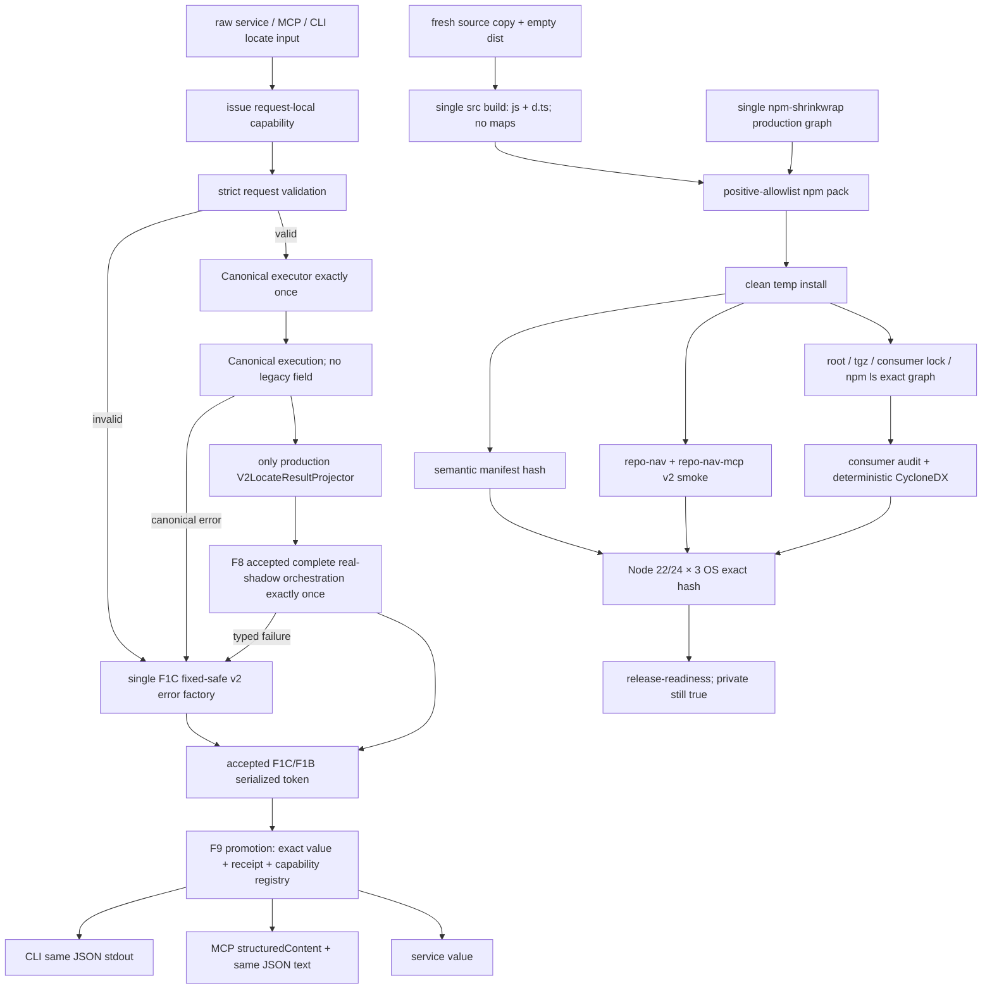

# public-beta-release feature design

## 0. 术语约定

| 术语 | 定义 | 边界 |
|---|---|---|
| projection-edge cutover | `RepositoryEvidenceService`完成同一次canonical execution后，唯一production projector从v1切为v2 | 不增加flag、双写、第二tool、第二service token或fallback-to-v1 |
| release candidate | version=`0.2.0-beta.1`、`private:true`仍保留，并由design/source/semantic-manifest/production-closure hashes形成唯一identity的可重复pack/install本地候选 | 同version不同identity不是同一candidate；不等于npm publish、GitHub Release、tag、merge或push |
| package semantic manifest | 从tarball安装后的package目录排除`node_modules`，按POSIX relative path排序的`{path,byteLength,sha256}`数组及其hash | 不比较gzip/tar header、mtime、uid/gid或Windows mode |
| package runtime closure | root shrinkwrap、tgz shrinkwrap、actual consumer lock与`npm ls`规范化production multigraph exact，且两个bin/root export只依赖该closure | root override或checkout的`src/tools/test/testkit`/devDependency不是consumer authority |
| trusted public transport receipt | F8/F1 accepted serialization后，将exact `LocateResultV2`、compact JSON、F1B proof与request-local execution capability绑定的opaque receipt | MCP/CLI不得clone、跨execution复用、再次redact、重算status或重新选择字段 |
| release governance gate | license、npm name/ownership、移除`private:true`、publish/tag/release的独立owner动作 | feature acceptance和roadmap完成不会自动执行这些动作 |
| real consumer confirmation | owner在未跟踪runtime文件中明确目标仓库、预期branch/HEAD与敏感输出边界，并接受全工作树before/after postcondition | path、remote、branch/HEAD、文件清单、terms、输出正文与凭证不得进入artifact |

## 1. 决策与约束

### 1.1 需求摘要

F9在F8完成首个真实六owner v2 shadow后，只把F8已验收的完整orchestration提升到唯一production
projector edge，不重新接线其内部materializer/composer；同时删除整个v1 compatibility lane，并让
service、MCP与debug CLI的locate出口共享same-execution exact `LocateResultV2`。同一feature补齐
公开beta所需的Node engines、version authority、single publishable shrinkwrap、fresh
source→emit package、installed closure、lint/format、安全文档、SBOM、迁移指南与全工作树只读
真实消费者E2E。

F9只形成`0.2.0-beta.1` release candidate。license必须由owner在实现前单独选定；`private:true`
始终保留到另一次明确授权。merge、push、tag、npm publish和GitHub Release都不属于本feature的
自动动作。

### 1.2 当前source-of-truth基线

- `package.json`当前为`0.1.0`、`private:true`、engines `>=20.0.0`；MCP serverInfo又硬编码
  `0.1.0`。
- `package-lock.json`根版本仍为`0.1.0`，且lock根bin只含`repo-nav-mcp`，已与manifest中的
  两个bin漂移。
- 当前`npm pack --dry-run --json`会发出缺少`.npmignore`警告并包含约752项、约1.27 MiB
  packed / 5.12 MiB unpacked；`.codestable`、source、tests与testkit均可进入tarball。
- `tools/cli/execute.ts` runtime-import `testkit` Golden runner；第二份CLI tsconfig还会形成重复
  `dist/src` runtime tree，因此当前tarball无法在不携带dev/test surface时自洽。
- 当前MCP/CLI output在service结果上再次执行v1 error policy与redactor；v2 cutover后继续该路径
  会形成双redaction与status/field drift。
- 当前production audit基线包含`fast-uri@3.1.3` high advisory；`@hono/node-server`还有moderate
  advisory。F9不得用audit flag、删报告或“stdio大概不可达”隐藏high/critical。
- 2026-07-24未认证`npm view repo-nav`返回404；这既不证明名称永久可用，也不证明owner拥有
  publish权限。

### 1.3 明确不做

- 不新增v1/v2协商参数、环境变量、feature flag、双MCP tool或content negotiation。
- 不保留production `legacyV1Projection`、`V1LocateResultProjector`、v1 redactor/error mapper
  作为fallback。
- 不把package tarball、SBOM、consumer path/输出、npm token或registry identity提交到Git。
- 不自动移除`private:true`，不运行`npm publish`，不创建tag/GitHub Release，不merge或push。
- 不新增Python/Go/Rust semantic adapter，不改变F1A-F8已验收的business truth。
- 不把source-checkout-only Golden runner及其Vitest/testkit依赖包装成公开CLI能力。

### 1.4 方案比较

| 方案 | 结论 | 原因 |
|---|---|---|
| service增加`v2?: boolean`并保留v1 fallback | 拒绝 | 形成两个production truth与不可证明的降级 |
| MCP/CLI各自组装v2 | 拒绝 | 重复redaction/status/size逻辑，无法保证transport parity |
| 保留`tools/cli`第二编译树并把testkit打包 | 拒绝 | dev/test dependency泄漏且出现两份runtime module identity |
| 单一v2 projector + exact trusted serialization registry + 单一`src` build | 采用 | cutover原子、package closure可验证、transport不重算 |
| 以raw tarball hash跨OS判定可复现 | 拒绝 | npm/tar metadata跨平台不稳定，不能代表内容漂移 |
| 比较提取后的semantic manifest | 采用 | 只比较实际消费者得到的路径、bytes与内容hash |

### 1.5 复杂度档位

- Correctness：single-execution、six-owner finalizer、error truth、service/MCP/CLI parity。
- Security：F1A/F1B public boundary、tarball allowlist、audit/SBOM、SECURITY reporting、no secrets。
- Compatibility：schema v1→v2、Node 20→22/24、CLI Golden removal、root exports与migration guide。
- Operations：six-cell package smoke、release candidate artifacts、真实MCP consumer confirmation。
- Governance：license/private/name/publish/tag/release均有独立owner gate。

### 1.6 关键决策

1. **implementation准入是F1A-F8 acceptance，不是“design存在”**：F9开始实现前，
   `span-redaction-corpus-policy-v2`、`public-result-resource-budgets-v2`、
   `canonical-locate-facts-bridge`、`request-snapshot-cache`、`relevance-ranking-budget`、
   `cross-platform-ci-baseline`、`streaming-ripgrep`、`input-abort-contract-v2`、
   `repository-scope-policy`与`language-capability-boundary`必须全部`done`且当前revision独立
   review/QA/acceptance通过。F8必须已产真实六owner完整shadow；任何placeholder owner或
   dependency-gated N/A都会block。
2. **cutover只改一个production binding**：保留F1C的`CanonicalLocateExecutorV2`、
   `LocateResultProjector` seam及F8已验收的完整real-shadow orchestration；F9不得重新排列或直接
   调用六owner accessor、materializer、F6、finalizer、composer或serializer。
   `LOCATE_RESULT_PROJECTOR`唯一绑定从`V1LocateResultProjector`原子替换为
   `V2LocateResultProjector`；后者在同一个`EvidenceModule`内只通过F8冻结的
   `ACCEPTED_COMPLETE_REAL_LOCATE_SHADOW_ORCHESTRATOR_V2`注入已装配ready singleton，再把其
   accepted orchestration结果提升为production transport bundle。F8 token/provider在F8 acceptance
   已唯一登记且不export，F9不调用factory或重登记provider。不并存projector，不按request、env、
   error、backend或transport选择projector。
   counting backend/reader证明每个请求只执行一次。
3. **canonical execution删除legacy sibling**：成功只保留`{ok:true,envelope}`，失败只保留
   `{ok:false,error}`；删除`legacyV1Projection`字段、builder slot、legacy lane evaluator和
   `V1LocateResultProjector`。所有call site在同一revision迁移，禁止optional legacy field。
4. **v2 projector只提升F8完整shadow，不建立第二套orchestration**：
   `src/evidence/canonical/accepted-complete-real-locate-shadow-orchestrator-v2.ts`中的
   internal DI token、`AcceptedCompleteRealLocateShadowOrchestratorV2` interface、
   `AcceptedCompleteRealLocateShadowAttemptV2`与
   `requireAcceptedCompleteRealLocateShadowV2`是F8 current-revision acceptance冻结的唯一F9
   success依赖；`V2LocateResultProjector`constructor只注入该token对应interface，并调用
   `projectAcceptedExecution(input,execution)`。其内部先以input+capability调用F1C
   internal accessor恢复canonical executor登记的same `LocateExecutionTokenV2`，再以同一frozen
   stage context执行既有顺序owner accessors →
   F1A/F1B materializer → F6 aggregation → F1C required-owner finalizer → composer → strict schema →
   F1B compact 1 MiB serializer。F9 projector对canonical success只调用该injected interface一次，再调用同文件
   `requireAcceptedCompleteRealLocateShadowV2(accepted,input,execution)`一次；对canonical failure调用
   F1C冻结的`createTrustedSerializedPublicToolErrorV2(code,action,execution)`一次，再由F9 error
   promotion调用共同`requireTrustedSerializedLocateResultV2`一次。它没有任何stage-level dependency，
   也不import F1C internal execution token/accessor、`createRequiredOwnerFinalizerV2`、
   `createMaterializedLocateResultComposerV2`、finalized/composer/schema/success serializer或test
   counter probe，也不import
   `createAcceptedCompleteRealLocateShadowOrchestratorV2`或任何provider descriptor。
   F8入口返回typed failure时，F9只调用fixed safe v2 `INTERNAL_ERROR` factory一次，不重跑shadow、
   不返回partial owner、不删末尾evidence、不退v1。F9-CUTOVER-001冻结完整call graph及每类失败的
   调用计数；actual F8 signature或顺序漂移必须回F8修订并重新review，不能在F9写adapter绕过。
5. **tool error只有一个v2 factory**：canonical `UnsafeToolErrorFactsV2`、MCP invalid input和
   programmatic facade input validation最终都必须经F1C current-revision frozen
   `createTrustedSerializedPublicToolErrorV2(code,suggestedAction,execution)`；该factory内部独占F1
   strict mapping、public schema与F1B 1 MiB serializer registry。允许映射仅为
   `INVALID_INPUT|INVALID_REPOSITORY|PATH_OUTSIDE_ROOT|INTERNAL_ERROR`；message、recoverable与
   `INVALID_INPUT`唯一可选`ADD_TERM`完全按public contract，不携带exception、path、root、
   backend output、stage或size。
6. **trusted serialization同时绑定request capability**：每个service/MCP/CLI ingress由唯一
   internal application seam在任何request validation之前调用F1C
   `issueLocateProjectionExecutionCapabilityV2()`创建无own-property
   `LocateProjectionExecutionCapabilityV2`及其private internal token；validation success才把同一
   capability传给canonical executor，executor在返回前登记exact canonical input，随后把同一
   capability传给F8 accepted orchestration；validation或canonical failure把同一capability传给F1C
   fixed-safe error factory。success projector取得F8 accepted view，error path取得F1C serialized token并通过
   common accessor取得view；两条F9 promotion把exact `LocateResultV2`、compact JSON、byte proof、
   F1B serialization proof与该capability登记到private WeakMap并返回opaque
   `PublicLocateTransportReceiptV2`。transport只能调用
   `requirePublicLocateTransportValueV2(value, receipt, expectedExecution)`；三者必须来自同一次
   ingress，验证成功才返回同一object与已预算JSON。clone、手写shape、registered stale value、
   receipt/value swap、cross-execution capability或重新`JSON.stringify`作为新authority均失败，
   且失败时只抛private fixed `PUBLIC_LOCATE_TRANSPORT_INVARIANT`，不暴露value/JSON/byte count或
   registry detail，也不触发error factory/serializer重试；adapter将其视为unexpected transport
   failure（CLI exit 1，MCP protocol failure），不能伪装为已认证public result。service返回
   view中的value；MCP `structuredContent`引用
   exact value，text使用已登记JSON，parse后deep-equal；CLI stdout使用同一JSON加单个换行。
   invalid ingress固定capability issue=1、validation=1、executor/F8/stage=0、error factory/
   internal serializer/common accessor/promotion各1；没有“validated ingress后才mint”或专用第二
   capability factory。
7. **locate transport完全同义**：service、MCP structuredContent、MCP text JSON和debug CLI
   locate在同一fixture/request上deep-equal exact v2。MCP `isError=!value.ok`；CLI成功/no-result/
   partial/cancelled/timeout/backend-unavailable退出0，tool error退出3，启动/意外transport错误
   退出1，纯命令语法错误退出2。已识别的`debug locate` request schema错误返回v2
   `INVALID_INPUT`而不是CLI私有error。
8. **删除double redaction与synthetic-only seam**：`createLocateToolOutput`不再调用v1
   `redactLocateResult`或`applyPublicErrorPolicy`；删除v1 locate output schema/production imports。
   F8 real projector成为production后删除`v2-shadow-locate-projector.ts`与
   `synthetic-locate-projection-v2.ts`，testkit改为组装真实v2 projector与owner fixtures。
   v1 snapshots可作为迁移fixture保留在testkit，但v1 runtime schema/projector/redactor不得从
   production或package root可达。
9. **package.json是唯一version authoring source，npm-shrinkwrap是唯一installation lock**：
   目标version固定`0.2.0-beta.1`。
   `src/runtime/package-metadata.ts`从相对自身位置严格读取同一package根`package.json`，只返回
   bounded name/version；MCP serverInfo、`repo-nav --version`和`repo-nav-mcp --version`都读取它，
   禁止硬编码。F9初次用pinned local npm把现有`package-lock.json`原子转换为可发布的
   `npm-shrinkwrap.json`并删除前者；此后`npm ci`、metadata、audit、SBOM、pack与六格全部只接受
   shrinkwrap，不允许双lock并存。`package:metadata:check`验证manifest、shrinkwrap根两处version、
   name、engines、bin/main/types/exports与runtime server/CLI version probe一致。
10. **beta runtime support精确为Node `^22.0.0 || ^24.0.0`**：package engines、README、
    migration、F4 workflow与installed package metadata必须literal一致。Node 20与23不是承诺范围；
    不用`>=22`扩大到未来major。F4继续提供Node22/24 × 三OS六格blocking证据。
11. **production CLI进入单一`src` build**：把`tools/cli` move-only迁到`src/cli`，删除
    `tsconfig.cli.json`与第二编译树；`tsconfig.build.json`一次生成`dist`。先characterize help/
    locate/probe/exit/stdout/stderr，再做明确delta：公开CLI删除`debug golden`，Golden只保留
    source checkout的`npm run test:golden`。bin固定为
    `repo-nav-mcp=dist/main.js`、`repo-nav=dist/cli/main.js`。
12. **root package API显式且不开放deep imports**：新增
    `main=./dist/index.js`、`types=./dist/index.d.ts`及`exports`仅
    `"."={types,import}`与`"./package.json"`。root symbols严格等于F1C accepted public export
    manifest：application factory、`RepositoryEvidenceService` port、public request/result
    contracts及既有approved tokens/backends；private executor/projector/fact/proof/registrar、
    concrete façade、testkit与internal redaction helper不得进入`dist/index.d.ts` dependency closure。
13. **manifest metadata只写可验证事实**：保留name/description/type，新增
    `repository={type:'git',url:'git+https://github.com/gchigoo/repo-nav.git'}`、
    `bugs.url=https://github.com/gchigoo/repo-nav/issues`、
    `homepage=https://github.com/gchigoo/repo-nav#readme`及固定keywords
    `['repository-navigation','mcp','code-search','developer-tools']`。不虚构author、funding、
    organization、support SLA或registry ownership。新增`packageManager:'npm@11.12.1'`并exact pin
    devDependency `npm@11.12.1`；bootstrap后所有release命令只通过
    `node node_modules/npm/bin/npm-cli.js`执行，tool-version mismatch在任何lock/pack前失败。
    manifest/shrinkwrap由该pinned npm同revision更新，禁止手改dependency graph。
14. **tarball由positive allowlist控制**：package `files`只允许`dist/**/*.js`、
    `dist/**/*.d.ts`、README、SECURITY、owner-approved LICENSE、条件性NOTICE与四份public docs；npm自动包含
    package.json与`npm-shrinkwrap.json`。`tsconfig.build.json`显式设置
    `sourceMap:false`、`declarationMap:false`、`newLine:'lf'`，因此allowlist不含map且每个JS不得有
    dangling `sourceMappingURL`。显式禁止`.codestable/.github/src/tools/test/testkit/
    test-artifacts/node_modules`、map、tsconfig、logs、runtime confirmation、secrets及任意absolute
    path。候选上限为entries≤512、packed≤1.5 MiB、unpacked≤4 MiB、单文件≤512 KiB；任一N+1
    整包失败，不截断。release large contract另固定declaration files≤512、declaration dependency
    edges≤2048、production graph nodes≤512/edges≤2048、SBOM components≤512/edges≤2048/
    serialized bytes≤2 MiB；public compact JSON复用F1B 1 MiB。所有常量只由
    `tools/release/release-boundaries-v1.mjs`导出并与上文`RELEASE_BOUNDARIES_V1` compile fixture
    deep-exact。
15. **candidate可复现要求fresh source→emit closure**：package script
    `clean='node tools/release/clean-build-output.mjs'`只允许删除resolved repository root下exact
    `dist`；`npm run build`固定先执行该clean，再以单一`tsconfig.build.json`编译；build前/后gate
    要求所有outDir先空、
    每个non-declaration `src` program source恰好对应一个`.js`和一个`.d.ts`、每个emit都有唯一
    source owner、无第二`dist/src`树、无map/dangling source-map引用。测试先注入stale v1/synthetic
    emit再build，若clean未删除立即失败。同一source state从两个全新temp source copy分别
    clean→build→pack→install，产生exact相同semantic manifest；六个F4 cell上同revision manifest
    hash也必须一致。`.gitattributes`与compiler共同固定所有packaged text为LF，pack gate逐entry
    拒绝CRLF。manifest只记录relative path/byteLength/content sha256，不记录temp path、mtime、
    mode、uid/gid；raw tgz只在temp目录存在并在结束后清理，不提交。
16. **installed smoke不借用checkout**：每次从actual tgz在全新temp project执行
    pinned npm `install --ignore-scripts --no-audit --no-fund <tgz>`并生成consumer
    `package-lock.json`，随后从package bin运行
    `repo-nav --help`、`repo-nav --version`、`repo-nav debug locate --help`、`repo-nav debug probe
    --help`，并通过stdio initialize/list tools/call locate验证MCP v2。cwd设为temp，PATH只添加
    temp `node_modules/.bin`与系统必需项；checkout `dist/src/tools/test/testkit`故意rename/unreachable。
17. **lint与format是阻断门而非自动改写**：精确pin devDependencies
    `eslint@9.39.5`、`@eslint/js@9.39.5`、`typescript-eslint@8.65.0`、
    `prettier@3.9.6`。`eslint.config.mjs`使用flat config、
    `strictTypeChecked`/`stylisticTypeChecked`与`projectService:true`，
    `@typescript-eslint/no-explicit-any=error`、unused disable=error、warnings=0。
    lint覆盖`src/tools/test/testkit/**/*.ts`与root release `.mjs`；format覆盖同一TS、
    root JSON/MD/MJS、public docs与workflow YAML，排除`.codestable`、generated snapshots、
    dist、node_modules与test-artifacts。`format:check`只检查；实现中的格式修复必须是可审diff。
18. **actual installed production closure是security authority，四图来源职责不同**：release tooling
    先从canonical package semantic manifest计算candidate root sentinel
    `root:repo-nav@0.2.0-beta.1#<semanticManifestSha256>`；raw tgz SRI只在同一cell的pack→consumer
    lock链验证，不进入跨OS node identity或closure hash。root/tgz `npm-shrinkwrap.json`与consumer
    `package-lock.json`提供package-path、name、version、resolved/integrity和edge authority；
    consumer `npm ls --omit=dev --all --json`只提供installed topology/status，不要求其节点含
    `integrity`，也不把dedup空对象当新node。normalizer按normalized lock package key与Node ancestor
    resolution把npm-ls edge关联回consumer-lock node；任一无法唯一关联、name/version不等或ghost
    edge都失败。

    非root node key固定为
    `pkg:<normalized-install-key>#<name>@<version>#<lock-integrity-or-link-target-digest>`，因此同一
    name/version的多实例不合并；canonical edge key固定
    `{parentNodeKey,dependencyName,childNodeKey,kind}`，kind=`prod|optional|peer|link`，相同tuple只保留
    一条而不同kind/multiedge保留。dedup edge必须按真实ancestor resolution指向既有child；peer只建
    host edge、不复制component；optional node/edge保留lock中的`os/cpu/libc` applicability metadata；
    每个cell只在该projection内比较installed graph；F4固定x64，Linux cell固定`libc=glibc`，
    Windows/macOS固定`libc=null`，runtime probe mismatch先失败。inapplicable absent必须进入cell
    absence ledger；
    该ledger进入`cellProjectionSha256`但不进入跨OS `productionClosureSha256`，applicable缺失失败；
    除candidate root外任何`link:`/workspace/file dependency均禁止，candidate
    root link只映射root sentinel。`productionClosureSha256`对包含完整optional applicability的
    canonical lock graph计算，因此跨三OS exact；root/tgz/consumer-lock full semantic graph必须exact，
    npm-ls关联后的installed graph必须与当前cell projection exact。绝对temp path、hoist presentation与dev-only节点不参与hash，但重复实例、缺edge、
    额外prod node、root name/version/semantic digest或任一lock integrity漂移均失败。root
    `overrides`不算consumer约束；只有四图职责联合验证通过才可继续。在actual installed consumer执行pinned npm
    `audit --omit=dev --audit-level=high`，high/critical零容忍。当前
    `fast-uri@3.1.3`必须通过正常upstream resolution或已进shrinkwrap且四图证明的最小reviewed
    resolution升级，并用runtime regression证明；不用`--force`、`--legacy-peer-deps`或
    suppression。moderate/low逐项记录advisory ID、resolved version、runtime reachability、
    owner disposition与`verified_at`；不可达不能伪装为已修复。
19. **SBOM从同一actual installed closure确定性生成，而不信任npm遗漏**：
    `tools/release/generate-installed-sbom.mjs`只接收上一步canonical consumer graph，生成
    CycloneDX JSON 1.5：root application的name/version/purl/bom-ref exact，library components与
    dependency edges恰好等于production graph，组件按purl、edge按ref排序，不写timestamp、
    serialNumber、absolute path或environment。root ref固定
    `pkg:npm/repo-nav@0.2.0-beta.1`；普通package为`pkg:npm/<name>@<version>`，scoped package
    例如`@nestjs/common`为`pkg:npm/%40nestjs/common@<version>`；bom-ref exact等于purl。同一purl
    的重复安装component合并、dependency edge取集合并，但integrity不一致立即失败。pinned
    `npm sbom --package-lock-only --omit=dev --sbom-format cyclonedx --sbom-type application`
    仅作为independent differential probe；其曾经遗漏的`ajv`/`fast-uri`类节点或任意缺/多
    component/edge都会阻断，不能用npm输出覆盖canonical graph。strict schema/graph validator重验
    root name/version/purl/bom-ref、full component set与full edge set；forbidden scan后artifact只
    保留command、tool versions、counts、advisory summary、canonical graph hash与SBOM hash，
    不提交完整SBOM或本机路径。
20. **license是实现前owner blocking decision**：仅支持owner在owner-preflight中选择`MIT`或
    `Apache-2.0`；未选择时F9 implementation blocked。若选MIT，同一machine-readable preflight
    还必须给出exact copyright year与holder；若选Apache-2.0，preflight必须确认是否需要
    `NOTICE`及其真实attribution inputs。选择后使用官方完整文本，package `license` SPDX值与
    LICENSE正文exact一致并进入tarball。MIT或Apache `noticeRequired:false`时`NOTICE`必须不存在；
    Apache `noticeRequired:true`时preflight按原顺序提供非空attributions，generator以固定header、
    LF和单个末尾换行生成exact `NOTICE`。初次fresh build/pack只消费current-design preflight；
    candidate冻结后final owner action必须引用该preflight、逐字段重申相同choice/year/holder或
    noticeRequired/attributions，并写入generated NOTICE sha256；随后以同一source重新pack的semantic
    manifest必须不变。missing、unexpected、顺序、字段或正文漂移均fail closed。不得由agent默认
    选择、改成`UNLICENSED`后假装public-ready，或因为选择license自动移除`private:true`。
21. **SECURITY.md不虚构联系渠道或SLA**：supported table固定`0.2.0-beta.x=supported`、
    `<0.2.0=unsupported`；要求不要在public issue提交漏洞/secret。报告入口只能在owner确认
    repository private vulnerability reporting可用后写为GitHub Security Advisory；若不可用，
    owner必须提供真实私密渠道并触发design delta。owner-preflight必须记录channel type、exact
    public-safe channel text、owner与`verified_at`以生成SECURITY；candidate冻结后的final action
    必须引用preflight并逐字段重申相同channel type/text。实现不从remote猜测，文档不承诺响应/
    修复时限。
22. **migration与public docs是package contract**：新增`docs/migration-v1-to-v2.md`，逐项覆盖
    schema shape、error/status、ID、scope、file-anchor backslash、unsupported language、Node范围、
    package exports与CLI Golden removal；给出v1/v2 machine examples但不含真实路径/terms。
    README、MCP getting-started、debug CLI、locate reference与docs smoke全部切到v2，禁止并排宣传
    两个production schema。
23. **真实consumer E2E以全工作树read-only postcondition为authority**：只读run前读取未跟踪
    `.codestable/runtime/public-beta-real-consumer-confirmation.json`，验证owner指定repo存在、
    branch、HEAD、请求intent与敏感输出policy。随后对target创建canonical before snapshot：
    branch/HEAD、`git status --porcelain=v2 --branch --untracked-files=all --ignored=matching`、
    `git ls-files -s`、通过
    `git rev-parse --path-format=absolute --git-path index`解析后验证位于该repository真实git-dir/
    common-dir authority内的index absolute path及content hash，以及除`.git`外每个
    tracked/untracked/ignored file或symlink的relative path/type/length/content hash；不得字面拼接
    `.git/index`。普通checkout、linked worktree、index missing、symlink/reparse或run中替换resolved
    index均有synthetic fixture；无法解析或非regular file在启动前失败。`.codegraph`无论ignored与否
    必须递归纳入。runner从
    installed tgz启动真实MCP，不初始化CodeGraph、不写索引；结束后重建after snapshot并要求
    aggregate与每个分量exact相同。synthetic temp Git repo中的tracked/untracked/ignored/
    `.codegraph` write与resolved Git index mutation必须使gate失败并由fixture cleanup恢复，绝不对真实
    target做mutation test。输出正文只在内存做strict schema/forbidden scan/parity，sanitized
    report只含intent ID、exact candidate、confirmation decision hash、冻结的sensitive-policy enum、
    boolean gates、counts、before/after aggregate equality与semantic manifest hash；confirmation、
    target identity、branch/HEAD、request hash、文件清单和snapshot hash分量在结束后不得进入
    stage/artifact。

    未跟踪confirmation由strict `RealConsumerConfirmationV1`唯一描述：
    `schemaVersion=1`、exact `candidate`、`repository:{canonicalRepositoryPath,branch,headSha}`、
    `intent:{intentId,requestSha256,expectedSchemaVersion:'2.0'}`、
    `sensitiveOutputPolicy:'memory-only-v2-strict-forbidden-scan-no-persist'`、owner、`verified_at`与
    self-excluding `decisionSha256`。`canonicalRepositoryPath`必须是owner给定path经`realpath`与
    `git rev-parse --show-toplevel`后同一code-unit canonical root；输入含symlink/junction/reparse
    alias、非canonical分隔/尾段、root不等或运行中authority变化均在MCP启动前拒绝。branch/HEAD与
    intent request hash逐字段exact绑定；placeholder/extra/missing/wrong-candidate、future timestamp、
    超24小时、path alias、symlink/reparse、branch/HEAD/request/policy swap都有mutation。
    `SanitizedRealConsumerEvidenceV1`只保存exact candidate、confirmation decision hash、intent ID、
    policy enum、完成时间、stable counts/booleans、semantic hash与self-excluding evidence hash；
    readiness要求confirmation≤evidence≤24小时且二者same candidate。schema拒绝owner、path、branch、
    HEAD、request hash、文件/hash分量、stdout/stderr或raw output字段。
24. **F4 package binding是child-owned extension**：F9同revision向F4 closed union/registry加入
    `{contractId:'F9-PACK-001',surface:'unit',group:'public-beta-release',
    executableCaseId:'package-install-and-bin-smoke',
    applicableOs:['linux','win32','darwin'],
    requiredAssertionIds:['tarball-allowlist-exact','package-bins-executable',
    'node-engine-range-declared','mcp-v2-installed-parity','package-runtime-closure'],
    requiredEvidenceHashIds:['candidate-id','semantic-manifest','production-closure'],
    fixture:'testkit/fixtures/release-v2/package-install-v2.ts',
    assertionOwner:'test/unit/public-beta-release-platform.spec.ts'}`。五marker在Node22/24三OS六格
    非零；`node-engine-range-declared`只证明manifest exact range及semver边界
    `21=false,22=true,23=false,24=true,25=false`，不声称npm install hard fail。漏
    union/binding/fixture/assertion owner/evidence owner、wrong path、zero marker/evidence、
    invalid/duplicate/unknown evidence、错tuple或缩小OS均失败。三个
    `PlatformEvidenceHashOwnerV1`都固定由
    `test/unit/public-beta-release-platform.spec.ts`拥有；case只在actual tgz完成clean install、
    semantic manifest和full production closure验证后各调用一次
    `recordPlatformContractEvidenceHash`，分别写入candidate ID、semantic manifest与production
    closure的64位小写hex，不能从环境变量或expected fixture伪回填。

    F4每格strict report必须含exact `run:{workflowRunId,runAttempt}`、`F9-PACK-001` required case、
    上述五个`passedAssertionMarkers`及三个`contractEvidenceHashes`；
    `tools/ci/assert-public-beta-package-evidence.mjs`与
    `testkit/contracts/platform-evidence-report.ts`读取同一workflow run/attempt family的六份
    safe cell report，要求canonical六cell恰好各一份、九项command均success、F9 required case与
    五marker集合exact、`workflowRunId/runAttempt/workflowSha/sourceSha/eventName`逐格相同，并把三个hash与同一
    `ReleaseCandidateIdentityV1`逐项重算对账。它输出strict
    `PublicBetaSixCellEvidenceV1`；aggregate顶层只保存single exact run/revision，cell按F4 canonical
    order且逐条保存`{cellId,requiredCaseId,passedAssertionIds,candidateIdSha256,
    semanticManifestSha256,productionClosureSha256}`。`sixCellEvidenceSha256`对
    `{schemaVersion,run,cells}`的strict compact JSON做sha256并排除hash自身。
    漏格、同revision跨run/attempt拼接、marker缺失/额外/换序、revision或任一hash漂移、
    extra report/field都失败；raw tgz SRI和
    report正文不进入aggregate hash。
25. **release governance与acceptance分开**：F9 acceptance要求license文件已按owner选择落地、
    `private:true`仍为true、候选包/文档/E2E全部通过，并生成`release-readiness` verdict。
    后续如要发布，必须再次验证clean revision、authenticated npm identity与package name ownership，
    owner分别批准移除private、`npm publish --dry-run`、actual publish、tag/push与GitHub Release。
    任一批准不能推导下一项；404、local pack成功或roadmap done都不能代替授权。
26. **artifact与日志最小化**：package/test报告允许candidate version、fixture/case IDs、
    stable counts、relative tar entries、semantic hashes、advisory IDs和boolean verdict；禁止raw
    locate output、consumer identity、absolute/temp paths、remote、branch、Git object ID、npm user、
    token、environment dump、SBOM component purl外的任意凭证型字符串。所有spawn使用argv数组与
    `shell:false`，stderr经固定scrubber且不进入public result。
27. **所有release证据绑定同一个不可变candidate**：F9 implementation前的license选择/生成所需
    year-holder或NOTICE attribution inputs，以及SECURITY private channel public-safe text，只存在于
    `ReleaseOwnerPreflightDecisionV1`，绑定由下述exact manifest计算的
    `designRevisionSha256`并授权开始工作/生成LICENSE、NOTICE、
    SECURITY，不得用于readiness。
    source freeze后由
    `testkit/manifests/release-v2/release-candidate-source-paths-v1.json`正向枚举candidate source
    path classes：package/build/quality root configs，`src/**`、`tools/**`、`test/**`、`testkit/**`、
    public docs/LICENSE/conditional NOTICE与F4 workflow；manifest自身也在集合。`.codestable/**`
    CodeStable lifecycle artifacts不进入source hash；其中只有下述F9 design/checklist exact tuple进入
    design revision，其余review/approval/QA/acceptance/runtime artifacts按各自lifecycle gate约束；
    dist、未跟踪owner actions/confirmation、temp/tgz/SBOM同样排除。
    `RELEASE_DESIGN_REVISION_PATHS_V1`按固定顺序exact为F9 design与checklist两个POSIX path。
    两者必须是Git tracked、clean regular file且非symlink/reparse；逐项读取working-tree raw bytes，
    不做BOM、Unicode、LF/CRLF或尾空白normalize，形成
    `{path,byteLength,sha256}`。`ReleaseDesignRevisionV1`的hash输入是
    `{schemaVersion:1,algorithm:'sha256-raw-bytes-v1',entries}`按schema字段序的strict compact JSON；
    entries保持tuple顺序，`designRevisionSha256`排除自身。design-review、approval/QA/acceptance、
    roadmap item status与runtime decisions明确不在输入，避免self-reference和post-candidate生命周期
    写回；它们不能修改已冻结design/checklist。missing/extra/reorder path、design/checklist任一byte、
    LF/CRLF、BOM、symlink/reparse、dirty index/worktree或self-hash输入mutation均失败。preflight、
    source freeze、candidate与readiness每次重算同一manifest；任何漂移使旧preflight/candidate失效。

    该exact tracked-source manifest计算`sourceTreeSha256`；fresh pack先计算只描述package content的
    `semanticManifestSha256`，再以该hash作为root sentinel完成四图并计算
    `productionClosureSha256`，最后才由version、design revision及上述三个hash生成
    `ReleaseCandidateIdentityV1`与`candidateIdSha256`。semantic manifest不得反向包含closure hash，
    closure也不得包含candidate ID，因而不存在hash cycle。source任一byte、mode/type、manifest、
    closure或design drift都会形成新candidate并使旧证据失效。pack、semantic manifest、closure、
    audit、SBOM、six-cell、real-consumer、owner actions与readiness每一份schema都必须携带并验证
    同一candidate identity；不得只按`0.2.0-beta.1`关联。

    final license/security action必须由owner针对该candidate再次确认，并包含preflight decision hash；
    license choice/year/holder/noticeRequired/attributions及security channelType/publicSafeText必须与
    被引用preflight逐字段exact；
    license action对exact candidate无时间过期但candidate/design drift即失效；security-channel
    `verified_at`在readiness时不得早于7×24小时；real-consumer confirmation/证据不得早于24小时；
    residual advisory disposition绑定candidate + exact audit report hash，只有audit/candidate exact
    相同才有效，不以时间延长旧audit。readiness逐项保存semantic manifest、closure、SBOM、six-cell、
    audit与real-consumer evidence hash，并重算candidate/evidence association；owner自由文本、
    仅有timestamp或旧version布尔值不能通过。

### 1.7 production cutover真值表

| canonical input | F8 accepted orchestration | F9 action | production result | v1 fallback |
|---|---|---|---|---|
| success + six owners valid | exact accepted serialized success | promotion/sign一次 | exact trusted v2 success | 不存在 |
| success + missing owner | typed `owner-finalization` failure | error factory + common accessor + promotion各一次 | fixed v2 INTERNAL_ERROR | 不存在 |
| success + invalid/swap proof | 对应stage typed failure | error factory + common accessor + promotion各一次 | fixed v2 INTERNAL_ERROR | 不存在 |
| success + public boundary/1MiB fail | `schema`或`serialization-budget` failure | error factory + common accessor + promotion各一次 | fixed v2 INTERNAL_ERROR | 不存在 |
| canonical INVALID_REPOSITORY | 调用0 | error factory + common accessor + promotion各一次 | exact v2 INVALID_REPOSITORY | 不存在 |
| canonical PATH_OUTSIDE_ROOT | 调用0 | error factory + common accessor + promotion各一次 | exact v2 PATH_OUTSIDE_ROOT | 不存在 |
| canonical internal/unknown failure | 调用0 | error factory + common accessor + promotion各一次 | exact v2 INTERNAL_ERROR | 不存在 |
| service/MCP/CLI locate invalid request | capability issue与validation各1；executor与F8入口均0 | 同capability error factory + common accessor + promotion各一次 | exact v2 INVALID_INPUT | 不存在 |

冻结的success内部stage顺序为
`source → materialization → aggregation → owner-finalization → composition → schema →
serialization-budget`。F9-CUTOVER-001以spy matrix证明：canonical executor每个valid request恰好1次；
success时F8 accepted入口恰好1次；每个已到达stage恰好1次；stage `i`失败后所有`i+1..n`为0；
accepted success时error factory为0、F8 accessor与promotion各1；accepted failure或canonical error时
error factory/common accessor/promotion各1；invalid ingress时capability issue/validation/error
factory/common accessor/promotion各1且
executor/F8/stage全0。promotion只消费F8 accepted view，
不调用任何stage或`JSON.stringify`。receipt/value/execution mismatch只使transport accessor失败，
不会触发executor、F8、error factory、promotion或serializer重试。

### 1.8 package positive allowlist

| Path class | 允许 | 约束 |
|---|---|---|
| `package.json` | 是 | npm自动包含；metadata/exports/bin/version/engines/license exact |
| `npm-shrinkwrap.json` | 是 | npm自动包含；tgz graph与root/consumer production graph exact；`package-lock.json`不存在 |
| `README.md`、`SECURITY.md`、owner-approved `LICENSE` | 是 | 三者必存在；无真实path/secret |
| `NOTICE` | 条件允许 | 初次pack仅在current-design preflight为Apache-2.0且`noticeRequired:true`时必须存在；candidate冻结后final action必须逐字段匹配并确认generated LF正文/hash；其他分支必须不存在 |
| `docs/getting-started-mcp.md` | 是 | v2 installed-package guide |
| `docs/debug-cli.md` | 是 | 无Golden public command |
| `docs/reference/repo-nav-locate.md` | 是 | schema 2.0 |
| `docs/migration-v1-to-v2.md` | 是 | breaking change matrix |
| `dist/**/*.js`、`dist/**/*.d.ts` | 是 | 单一fresh src build；LF；无map/sourceMappingURL、testkit或private declaration leak |
| 其他任意path | 否 | pack gate fail closed |

### 1.9 Top 3风险与缓解

| 风险 | 缓解 |
|---|---|
| F9重写F8 orchestration或cross-execution复用serialized value | only-accepted-entry dependency graph + stage counters + value/receipt/execution三元registry |
| tarball/override/root audit通过但consumer安装另一套依赖或旧emit | single shrinkwrap + four-graph closure + fresh source→emit/no-stale/no-map/LF gates |
| 候选通过后发布抢跑或真实consumer被隐式写入 | machine owner actions + `private:true` + 独立publish gates + full-worktree before/after postcondition |

### 1.10 非显然依赖与baseline风险

- F9依赖F1C two-argument projector/capability seam与F8 exact owner
  `src/evidence/canonical/accepted-complete-real-locate-shadow-orchestrator-v2.ts`的orchestrator、
  internal DI token、interface、attempt、accessor及serialized-view contract；F8 zero-argument factory和
  `src/evidence/evidence.module.ts`唯一non-exported provider已由F8 acceptance冻结，F9只注入token，
  不import factory/provider descriptor。七stage/counters及F1C finalizer/composer runtime acquisition
  已由F8 acceptance冻结，F9不得直接适配owner accessor/proof、导入
  `createRequiredOwnerFinalizerV2`/`createMaterializedLocateResultComposerV2`、或访问finalized
  facts/composer/schema/serializer/test probe。
  Error path只额外依赖F1C exact
  `createTrustedSerializedPublicToolErrorV2`与`requireTrustedSerializedLocateResultV2`；不得直接调用
  success schema/serializer或另写error mapper。
  任一drift都必须先回上游feature修复并重做独立review。
- F4 current child-extension revision必须先以base-only ownership闭环；F9只在自身revision加入
  `F9-PACK-001`，不要求F4 base预先拥有不存在的F9 fixture。
- npm registry、GitHub security setting与advisory状态会变化；implementation/acceptance和publish
  authorization前均需live重新验证，planning快照不算当前真值。
- `npm-shrinkwrap.json`只能约束其被实际打入tgz且consumer honoring后的图；root override或root
  `npm ls`单独通过均不是证据。npm SBOM也不是closure authority，必须与canonical installed graph
  做full component/edge differential。
- read-only consumer不能只靠“脚本意图不写”；before/after全工作树与index postcondition才是
  authority，`.codegraph`无论ignored状态都必须纳入。
- semantic manifest不证明行为正确；它只证明六格安装内容一致，仍必须运行bin/MCP/public
  contract/forbidden scan。

## 2. 名词与编排

### 2.1 核心类型与接口

```ts
type PublicBetaVersionV1 = '0.2.0-beta.1';
type PublicBetaNodeRangeV1 = '^22.0.0 || ^24.0.0';

// F9 cutover replaces F1C's legacy-bearing union with this exact shape.
type CanonicalLocateExecutionV2 =
  | Readonly<{
      ok: true;
      envelope: LocateFactEnvelopeV2;
    }>
  | Readonly<{
      ok: false;
      error: UnsafeToolErrorFactsV2;
    }>;

// Imported only from F1C:
// LocateProjectionExecutionCapabilityV2,
// issueLocateProjectionExecutionCapabilityV2,
// TrustedSerializedLocateResultV2,
// createTrustedSerializedPublicToolErrorV2,
// requireTrustedSerializedLocateResultV2.
// Imported only from F8 exact façade owner:
// ACCEPTED_COMPLETE_REAL_LOCATE_SHADOW_ORCHESTRATOR_V2,
// AcceptedCompleteRealLocateShadowOrchestratorV2,
// AcceptedCompleteRealLocateShadowAttemptV2,
// AcceptedCompleteRealLocateShadowViewV2,
// requireAcceptedCompleteRealLocateShadowV2.

declare const PUBLIC_LOCATE_TRANSPORT_RECEIPT_V2: unique symbol;
type PublicLocateTransportReceiptV2 = Readonly<{
  readonly [PUBLIC_LOCATE_TRANSPORT_RECEIPT_V2]: never;
}>;

interface TrustedPublicLocateTransportBundleV2 {
  readonly value: LocateResultV2;
  readonly receipt: PublicLocateTransportReceiptV2;
}

interface V2LocateResultProjector
  extends LocateResultProjector<TrustedPublicLocateTransportBundleV2> {
  project(
    input: CanonicalLocateExecutionV2,
    execution: LocateProjectionExecutionCapabilityV2,
  ): TrustedPublicLocateTransportBundleV2;
}

interface PublicLocateTransportViewV2 {
  readonly value: LocateResultV2;
  readonly compactJson: string;
  readonly utf8Bytes: number;
}

function requirePublicLocateTransportValueV2(
  value: LocateResultV2,
  receipt: PublicLocateTransportReceiptV2,
  expectedExecution: LocateProjectionExecutionCapabilityV2,
): PublicLocateTransportViewV2;

function promoteAcceptedCompleteRealLocateShadowV2(
  accepted: AcceptedCompleteRealLocateShadowViewV2,
  input: Extract<CanonicalLocateExecutionV2, Readonly<{ ok: true }>>,
  execution: LocateProjectionExecutionCapabilityV2,
): TrustedPublicLocateTransportBundleV2;

function promoteTrustedSerializedPublicToolErrorV2(
  serialized: TrustedSerializedLocateResultV2,
  execution: LocateProjectionExecutionCapabilityV2,
): TrustedPublicLocateTransportBundleV2;

interface PublicLocateExecutionApplicationV2 {
  execute(
    rawRequest: unknown,
    context: LocateExecutionContext,
  ): Promise<PublicLocateTransportViewV2>;
}

interface PackageSemanticManifestEntryV1 {
  readonly path: string;
  readonly byteLength: number;
  readonly sha256: string;
}

interface PackageSemanticManifestV1 {
  readonly version: PublicBetaVersionV1;
  readonly npmVersion: '11.12.1';
  readonly packagedTextLineEnding: 'lf';
  readonly entries: readonly PackageSemanticManifestEntryV1[];
  readonly entryCount: number;
  readonly unpackedBytes: number;
  readonly sourceEmitSha256: string;
  readonly manifestSha256: string;
}

const RELEASE_DESIGN_REVISION_PATHS_V1 = [
  '.codestable/features/2026-07-24-public-beta-release/public-beta-release-design.md',
  '.codestable/features/2026-07-24-public-beta-release/public-beta-release-checklist.yaml',
] as const;

interface ReleaseDesignRevisionEntryV1 {
  readonly path: (typeof RELEASE_DESIGN_REVISION_PATHS_V1)[number];
  readonly byteLength: number;
  readonly sha256: string;
}

interface ReleaseDesignRevisionV1 {
  readonly schemaVersion: 1;
  readonly algorithm: 'sha256-raw-bytes-v1';
  readonly entries: readonly [
    ReleaseDesignRevisionEntryV1,
    ReleaseDesignRevisionEntryV1,
  ];
  readonly designRevisionSha256: string;
}

interface ReleaseCandidateIdentityV1 {
  readonly version: PublicBetaVersionV1;
  readonly designRevisionSha256: string;
  readonly sourceTreeSha256: string;
  readonly semanticManifestSha256: string;
  readonly productionClosureSha256: string;
  readonly candidateIdSha256: string;
}

type RealConsumerSensitiveOutputPolicyV1 =
  'memory-only-v2-strict-forbidden-scan-no-persist';

interface RealConsumerConfirmationV1 {
  readonly schemaVersion: 1;
  readonly candidate: ReleaseCandidateIdentityV1;
  readonly repository: Readonly<{
    readonly canonicalRepositoryPath: string;
    readonly branch: string;
    readonly headSha: string;
  }>;
  readonly intent: Readonly<{
    readonly intentId: string;
    readonly requestSha256: string;
    readonly expectedSchemaVersion: '2.0';
  }>;
  readonly sensitiveOutputPolicy: RealConsumerSensitiveOutputPolicyV1;
  readonly owner: string;
  readonly verified_at: string;
  readonly decisionSha256: string;
}

interface SanitizedRealConsumerEvidenceV1 {
  readonly schemaVersion: 1;
  readonly candidate: ReleaseCandidateIdentityV1;
  readonly confirmationDecisionSha256: string;
  readonly intentId: string;
  readonly sensitiveOutputPolicy: RealConsumerSensitiveOutputPolicyV1;
  readonly verified_at: string;
  readonly semanticManifestSha256: string;
  readonly trackedCount: number;
  readonly untrackedCount: number;
  readonly ignoredCount: number;
  readonly codegraphEntryCount: number;
  readonly branchHeadUnchanged: true;
  readonly resolvedIndexUnchanged: true;
  readonly worktreeEntriesUnchanged: true;
  readonly beforeAfterAggregateEqual: true;
  readonly serviceMcpCliParity: true;
  readonly strictForbiddenScanPassed: true;
  readonly evidenceSha256: string;
}

type PublicBetaPlatformCellIdV1 =
  | 'linux-node22'
  | 'linux-node24'
  | 'windows-node22'
  | 'windows-node24'
  | 'macos-intel-node22'
  | 'macos-intel-node24';

const PUBLIC_BETA_PACKAGE_ASSERTION_IDS_V1 = [
  'tarball-allowlist-exact',
  'package-bins-executable',
  'node-engine-range-declared',
  'mcp-v2-installed-parity',
  'package-runtime-closure',
] as const;

interface PublicBetaWorkflowRunV1 {
  readonly workflowRunId: string;
  readonly runAttempt: number;
  readonly revision: Readonly<{
    readonly workflowSha: string;
    readonly sourceSha: string;
    readonly eventName:
      | 'pull_request'
      | 'merge_group'
      | 'push'
      | 'workflow_dispatch';
  }>;
}

interface PublicBetaPlatformCellEvidenceV1 {
  readonly cellId: PublicBetaPlatformCellIdV1;
  readonly requiredCaseId: 'F9-PACK-001';
  readonly passedAssertionIds:
    typeof PUBLIC_BETA_PACKAGE_ASSERTION_IDS_V1;
  readonly candidateIdSha256: string;
  readonly semanticManifestSha256: string;
  readonly productionClosureSha256: string;
}

interface PublicBetaSixCellEvidenceV1 {
  readonly schemaVersion: 1;
  readonly run: PublicBetaWorkflowRunV1;
  readonly cells: readonly PublicBetaPlatformCellEvidenceV1[];
  readonly sixCellEvidenceSha256: string;
}

type ProductionClosureEdgeKindV1 =
  | 'prod'
  | 'optional'
  | 'peer'
  | 'link';

interface ProductionClosureNodeV1 {
  readonly nodeKey: string;
  readonly name: string;
  readonly version: string;
  readonly normalizedInstallKey: string;
  readonly integrityAuthority:
    | Readonly<{ kind: 'root-semantic'; sha256: string }>
    | Readonly<{ kind: 'lock-integrity'; sri: string }>
    | Readonly<{ kind: 'link-target'; sha256: string }>;
  readonly applicability: Readonly<{
    os: readonly string[];
    cpu: readonly string[];
    libc: readonly string[];
  }>;
}

interface ProductionClosureEdgeV1 {
  readonly parentNodeKey: string;
  readonly dependencyName: string;
  readonly childNodeKey: string;
  readonly kind: ProductionClosureEdgeKindV1;
}

interface ProductionClosureGraphV1 {
  readonly rootNodeKey: string;
  readonly nodes: readonly ProductionClosureNodeV1[];
  readonly edges: readonly ProductionClosureEdgeV1[];
  readonly productionClosureSha256: string;
}

interface ProductionClosureCellProjectionV1 {
  readonly os: 'linux' | 'win32' | 'darwin';
  readonly cpu: 'x64';
  readonly libc: 'glibc' | null;
  readonly installedNodeKeys: readonly string[];
  readonly installedEdgeKeys: readonly string[];
  readonly inapplicableOptionalAbsenceNodeKeys: readonly string[];
  readonly cellProjectionSha256: string;
}

const RELEASE_BOUNDARIES_V1 = Object.freeze({
  packageEntries: 512,
  packedBytes: 1_572_864,
  unpackedBytes: 4_194_304,
  singleFileBytes: 524_288,
  declarationFiles: 512,
  declarationEdges: 2_048,
  productionGraphNodes: 512,
  productionGraphEdges: 2_048,
  sbomComponents: 512,
  sbomEdges: 2_048,
  sbomBytes: 2_097_152,
  publicCompactJsonBytes: 1_048_576,
  determinismPermutations: 5,
} as const);

type ReleaseOwnerPreflightDecisionV1 =
  | Readonly<{
      action: 'license-preflight';
      designRevisionSha256: string;
      choice: 'MIT';
      copyrightYear: string;
      copyrightHolder: string;
      decisionSha256: string;
      owner: string;
      approved_at: string;
    }>
  | Readonly<{
      action: 'license-preflight';
      designRevisionSha256: string;
      choice: 'Apache-2.0';
      noticeRequired: false;
      decisionSha256: string;
      owner: string;
      approved_at: string;
    }>
  | Readonly<{
      action: 'license-preflight';
      designRevisionSha256: string;
      choice: 'Apache-2.0';
      noticeRequired: true;
      noticeAttributions: readonly [string, ...string[]];
      decisionSha256: string;
      owner: string;
      approved_at: string;
    }>
  | Readonly<{
      action: 'security-channel-preflight';
      designRevisionSha256: string;
      channelType: 'github-private-vulnerability-reporting' | 'owner-provided-private-channel';
      publicSafeText: string;
      decisionSha256: string;
      owner: string;
      verified_at: string;
    }>;

interface ReleaseOwnerPreflightFileV1 {
  readonly license: Extract<
    ReleaseOwnerPreflightDecisionV1,
    Readonly<{ action: 'license-preflight' }>
  >;
  readonly securityChannel: Extract<
    ReleaseOwnerPreflightDecisionV1,
    Readonly<{ action: 'security-channel-preflight' }>
  >;
}

type ReleaseOwnerActionV1 =
  | Readonly<{
      action: 'license';
      choice: 'MIT';
      copyrightYear: string;
      copyrightHolder: string;
      candidate: ReleaseCandidateIdentityV1;
      preflightDecisionSha256: string;
      owner: string;
      approved_at: string;
    }>
  | Readonly<{
      action: 'license';
      choice: 'Apache-2.0';
      noticeRequired: false;
      candidate: ReleaseCandidateIdentityV1;
      preflightDecisionSha256: string;
      owner: string;
      approved_at: string;
    }>
  | Readonly<{
      action: 'license';
      choice: 'Apache-2.0';
      noticeRequired: true;
      noticeAttributions: readonly [string, ...string[]];
      noticeSha256: string;
      candidate: ReleaseCandidateIdentityV1;
      preflightDecisionSha256: string;
      owner: string;
      approved_at: string;
    }>
  | Readonly<{
      action: 'security-channel';
      channelType: 'github-private-vulnerability-reporting' | 'owner-provided-private-channel';
      publicSafeText: string;
      candidate: ReleaseCandidateIdentityV1;
      preflightDecisionSha256: string;
      owner: string;
      verified_at: string;
    }>;

interface ReleaseOwnerActionsFileV1 {
  readonly license: Extract<
    ReleaseOwnerActionV1,
    Readonly<{ action: 'license' }>
  >;
  readonly securityChannel: Extract<
    ReleaseOwnerActionV1,
    Readonly<{ action: 'security-channel' }>
  >;
}

interface ResidualAdvisoryDispositionV1 {
  readonly candidate: ReleaseCandidateIdentityV1;
  readonly auditReportSha256: string;
  readonly advisoryId: string;
  readonly resolvedVersion: string;
  readonly runtimeReachability: 'reachable' | 'unreachable';
  readonly disposition: 'accept-beta-risk' | 'block-release' | 'upgrade-required';
  readonly owner: string;
  readonly verified_at: string;
}

interface CandidateBoundEvidenceV1 {
  readonly candidate: ReleaseCandidateIdentityV1;
  readonly kind:
    | 'pack'
    | 'closure'
    | 'audit'
    | 'sbom'
    | 'six-cell'
    | 'real-consumer';
  readonly evidenceSha256: string;
}

interface ReleaseReadinessV1 {
  readonly candidate: ReleaseCandidateIdentityV1;
  readonly private: true;
  readonly license: 'MIT' | 'Apache-2.0';
  readonly nodeRange: PublicBetaNodeRangeV1;
  readonly semanticManifestSha256: string;
  readonly productionClosureSha256: string;
  readonly auditReportSha256: string;
  readonly sbomSha256: string;
  readonly sixCellEvidenceSha256: string;
  readonly realConsumerEvidenceSha256: string;
  readonly ownerActionsValidated: true;
  readonly freshEmitClosure: true;
  readonly installedProductionClosure: true;
  readonly sixCellPackageSmoke: true;
  readonly serviceMcpCliParity: true;
  readonly productionAuditHighCritical: 0;
  readonly sbomValidated: true;
  readonly realConsumerE2e: true;
  readonly realConsumerStateUnchanged: true;
  readonly publishPerformed: false;
}
```

capability与trusted serialized/accepted/failure tokens由F1C/F8拥有，F9不重声明；这些上游tokens、
F9 receipt与bundle均不从package导出，runtime token都由
`Object.freeze(Object.create(null))`创建且无own-property。F8 accepted accessor已验证并返回exact
value/compact JSON/bytes/serialized token；F9不能读取failure stage，stage只通过F8 test-only counter
harness观察。F1C fixed-safe error factory返回同一种capability-bound serialized token，F9 error
promotion只调用共同accessor，不映射或重新serialize。F9 promotion registry再把exact value + receipt
绑定到accepted/error view、canonical input或invalid-ingress decision与execution capability。
`LocateResultV2`仍是正常公开
readonly结构，programmatic consumer不需要内部brand。service/MCP/CLI ingress各自保留其
`expectedExecution`直到accessor成功；transport只有验证能力，没有token factory、registry writer、
重构value或stringify authority。

`PublicLocateExecutionApplicationV2`是唯一internal request seam：它先issue capability及其private
internal token，再对`rawRequest`执行唯一validation。validation成功才以同一capability调用canonical
executor一次并以
`project(input,capability)`调用唯一projector；validation失败不调用executor/F8而以同一capability
调用`createTrustedSerializedPublicToolErrorV2('INVALID_INPUT',action,capability)`和error promotion。
最后它以自己保留的capability调用transport accessor。programmatic service adapter只返回
`view.value`；MCP/CLI adapter在同一个view上分别取exact value/compact JSON。该application/token
不从Nest public exports或package barrel暴露，也没有“传入已有capability”的公共重载，因此普通
caller不能选择或复用execution identity。

`tools/release/owner-action-schema.mjs`以strict runtime schema实现exact-one license + exact-one
security-channel的preflight、candidate-bound action与disposition，并拒绝missing/duplicate/
extra/empty/placeholder/non-ISO/非64位小写hex字段；final action必须引用current-design preflight
decision hash，且所有license/security内容字段与被引用preflight deep-exact。Apache
`noticeRequired:false`分支没有attributions/NOTICE字段，true分支要求nonempty tuple且generated
NOTICE hash exact。`ResidualAdvisoryDispositionV1[]`按advisoryId排序且必须与同candidate
`auditReportSha256`的moderate/low ID集合exact相等。action/disposition文件只供gate消费并保持未跟踪，
sanitized readiness保存candidate与evidence hashes/boolean/count，不保存owner/channel/attribution正文。
每项`decisionSha256`固定为该项除`decisionSha256`自身外所有字段按schema字段ASCII序形成的strict
compact JSON之sha256；数组保留owner给定顺序，时间规范为带`Z`的ISO-8601 UTC。任何重排、额外字段、
自包含hash或不同canonicalizer都失败。

`tools/release/design-revision.mjs`只接受
`RELEASE_DESIGN_REVISION_PATHS_V1`的exact tuple并实现§1决策27的raw-byte manifest/hash；它拒绝
review report或runtime文件进入tuple。`tools/release/real-consumer-contracts.mjs`实现strict
`RealConsumerConfirmationV1`与`SanitizedRealConsumerEvidenceV1`：
confirmation `decisionSha256`对除自身外的schema字段按ASCII字段序strict compact JSON计算；
evidence `evidenceSha256`同样排除自身。confirmation中的repository path、branch/HEAD、
requestSha256与owner仅在内存/未跟踪文件中使用；sanitized evidence只携带confirmation hash、
intent ID、policy enum与安全字段。任何missing/extra/placeholder、wrong candidate、非canonical path、
symlink/reparse alias、branch/HEAD/request/policy swap、时间倒置/超24小时、把敏感字段加入evidence，
或hash canonicalizer漂移均fail closed。

`sourceTreeSha256`的输入是上述positive path manifest与Git tracked candidate paths交集的exact
集合，按POSIX relative path排序形成
`{path,type:'file'|'symlink',mode,byteLength,sha256}` strict compact JSON；未跟踪runtime actions、
dist/tgz/SBOM/temp、`.git`与CodeStable lifecycle artifacts不在集合；candidate path manifest
漏掉任一实际package/build/release/test/platform input，或集合内dirty/untracked implementation path，
必须由scope/source-path gate拒绝或纳入manifest并重新review。regular file的length/hash取
working-tree raw bytes，mode取Git index而非OS filesystem；symlink不解引用，
取UTF-8 link-target bytes；Gitlink、reparse ambiguity、missing tracked path或index/working-tree type
不一致均在pack前失败。顺序固定为source tree → package semantic manifest → production
closure → candidate identity；`candidateIdSha256`固定为下列五项按字段名ASCII序compact JSON的
sha256：`version/designRevisionSha256/sourceTreeSha256/semanticManifestSha256/
productionClosureSha256`，不包含自身、wall clock、absolute path或raw tgz SRI。所有hash schema要求
64位小写hex，任何重算不等即candidate mismatch。

所有self-named hash都排除自身字段：`PackageSemanticManifestV1.manifestSha256`对
`version/npmVersion/packagedTextLineEnding/entries/entryCount/unpackedBytes/sourceEmitSha256`
按schema字段序的strict compact JSON计算；`ProductionClosureGraphV1.productionClosureSha256`对
sorted `rootNodeKey/nodes/edges`计算；`ProductionClosureCellProjectionV1.cellProjectionSha256`对
该cell除自身hash外的字段计算。semantic manifest不含closure/candidate字段，closure不含candidate
字段，任何实现若把self hash或下游hash放回输入立即失败。

### 2.2 production与package编排



顺序约束：

1. owner acceptance与exact-one license + exact-one security-channel preflight在任何F9
   implementation前完成。
2. cutover、legacy deletion、service/MCP/CLI parity先于public docs snapshot更新，不能靠改snapshot
   定义新行为。
3. single-src fresh build、source→emit closure与no-map/LF gate先于`files` allowlist；不能用tarball
   额外包含testkit掩盖broken imports。
4. metadata/shrinkwrap先于actual pack；actual consumer四图closure先于audit/SBOM；
   pack/install semantic manifest先于six-cell marker。
5. real consumer只使用已通过本地与six-cell gates的actual tgz。
6. acceptance最终断言`private:true`，且publish/tag/release调用计数为0。

### 2.3 挂载点清单

| 挂载点 | 变化 | Owner |
|---|---|---|
| `src/evidence/locate-execution/` | production v2 projector、legacy删除、request capability/receipt registry；只消费F8 accepted orchestrator | F9 + F1C/F8 seam |
| `src/contracts/` | service output改v2、v1 runtime/public exports退出 | F9 contract cutover |
| `src/mcp/` | v2 invalid error、same-object structured/text serializer、server version | F9 transport |
| `src/cli/` | 从tools move、v2 locate、version、Golden removal | F9 CLI |
| `src/runtime/package-metadata.ts` | strict bounded manifest metadata loader | F9 version authority |
| `src/index.ts` | F1C approved root manifest + v2 public types，禁止private/deep leaks | F9 package API |
| `package.json` / `npm-shrinkwrap.json` | version、engines、metadata、exports、files、scripts、pinned npm与single publishable installation lock | F9 package |
| `tsconfig.build.json` / `.gitattributes` | fresh single emit、no source maps、LF packaged text | F9 build |
| `tools/release/` | metadata/fresh emit/pack/semantic manifest/four-graph closure/install/audit/SBOM/read-only consumer gates | F9 tooling |
| `eslint.config.mjs` / `.prettierrc.json` | blocking quality gates | F9 quality |
| public docs / SECURITY / LICENSE / conditional NOTICE | migration、usage、reporting、owner-governed license/channel | F9 docs/governance |
| F4 registry/workflow report | child-owned `F9-PACK-001`五marker、candidate/semantic/closure三hash与六格aggregate | F9 + accepted F4 |

### 2.4 推进策略

#### S1：原子production v2 cutover并删除v1 lane

更新canonical execution/projector/service types；让V2 projector在EvidenceModule内只注入F8
`ACCEPTED_COMPLETE_REAL_LOCATE_SHADOW_ORCHESTRATOR_V2`对应ready singleton，把accepted complete-shadow orchestration经
request capability/receipt registry注册为唯一production edge，F9不重新编排任何内部stage；
迁移MCP/CLI accessor；删除legacy field/projector/lane、double redaction与synthetic-only seam。
退出信号：single execution、stage-by-stage exact counters、cross-execution receipt hostile matrix、
完整success/error truth、service/MCP/CLI exact parity、v1 runtime reachability mutation全部通过。

#### S2：单一build与manifest/version/license/metadata闭环

move CLI到`src`、删除Golden public command和第二tsconfig，落fresh clean/no-map/LF build、
package version/engines/exports/files/metadata、single `npm-shrinkwrap.json`与owner-selected LICENSE，
使用package.json runtime version。退出信号：manifest/shrinkwrap/bin/server/CLI exact，
source→emit bijection与stale-output mutation通过，`private:true`保持，root declarations无private
leak。

#### S3：质量、owner-preflight内容与文档闭环

接入exact ESLint/Prettier gates；按owner-preflight生成并验证LICENSE/conditional NOTICE/SECURITY，
完成migration、README/MCP/CLI/reference docs与docs smoke，同时完成四图/audit/SBOM tooling的
fixture/mutation自测但不把synthetic图当candidate证据。退出信号：quality/docs/preflight内容与
tooling self-test通过，无虚构channel/SLA、双schema说明或未冻结candidate的安全结论。

#### S4：实际tarball、closure/security证据与六格package contract

两个fresh source copy分别clean/build/pack/install生成exact semantic manifest，执行bin/MCP
installed smoke；以semantic root sentinel证明root/tgz/consumer-lock/npm-ls四图一致并冻结
`ReleaseCandidateIdentityV1`，随后在same candidate actual consumer关闭production high/critical、
生成canonical SBOM与audit report；F9同revision扩展F4 union/registry，每格记录candidate ID、
semantic manifest、production closure三项contract evidence hash，并由六份same-run safe report
聚合五marker与`PublicBetaSixCellEvidenceV1`。退出信号：
allowlist/budgets/runtime closure/no-stale/no-map/LF、four-graph/audit/SBOM、每格三hash与六格
`sixCellEvidenceSha256` exact，所有tgz/temp清理；moderate/low等待S5 same-candidate owner
disposition。

#### S5：真实consumer、全量aggregate与release-readiness

校验owner-preflight与same-candidate final license/security/advisory actions，读取owner runtime
confirmation，对已验证tgz执行before/after全工作树snapshot约束的只读真实MCP E2E；运行21-ID
full aggregate、scope、architecture、review、QA、acceptance，生成publish=false readiness。
退出信号：target branch/HEAD/index/tracked/untracked/ignored/`.codegraph` exact不变、所有candidate/
evidence hash association与freshness通过、artifact sanitized、`private:true`、无stage外文件与无
publish/tag/push动作。

### 2.5 结构健康度与微重构

当前CLI的production命令与Golden test runner同文件，且第二编译树会复制`src`。S2只做一次
move-only characterization后建立`src/cli`单一runtime；不顺带重写parser框架。v1 locate output与
redactor在cutover后若无production/runtime consumer则删除；若仅迁移fixture仍需移入testkit并退出
package/reachability。release scripts按metadata、pack、install、security、consumer五个deep module
拆分，共享一个safe spawn和sanitized report helper，不创建一个千行万能release脚本。

## 3. 验收契约

### 3.1 关键场景清单

| ID | 输入 / 触发 | 期望 |
|---|---|---|
| F9-CUTOVER-001 | success/no-result/partial/cancelled/timeout/backend-unavailable六owner真实execution，F8 DI token/provider singleton identity及actual two-argument signature/accessor drift；F1C acquisition-symbol import mutation | 只切projector binding；V2 projector只注入F8 ready token且不import factory/provider descriptor、`createRequiredOwnerFinalizerV2`或`createMaterializedLocateResultComposerV2`，accepted入口与accessor各一次；七stage固定顺序/各一次；F9无stage dependency；strict schema 2.0；无v1 field/provider/flag |
| F9-FAIL-CLOSED-001 | 四类tool error、七stage逐一失败、missing/invalid owner、invalid ingress | fixed v2 error truth；失败stage后续调用0；valid失败error factory/common accessor/promotion各一次；invalid先issue capability且validation一次、executor/F8/stage零、error factory/internal serializer/common accessor/promotion各一次；无detail、重跑或v1 fallback |
| F9-SINGLE-EXEC-001 | counting backend/reader与deliberate projector failure | 每request execution恰好一次，projector不重试repository |
| F9-TRANSPORT-001 | exact fixture经service、MCP structured/text、CLI locate；clone/stale registered value/receipt-value/execution swaps | valid三者deep-equal v2且same registered bytes；hostile组合在value/JSON暴露前拒绝；MCP isError/CLI exit exact |
| F9-NO-V1-001 | runtime AST/DI/package declaration graph与deliberate v1 import/provider/flag mutation | production/package无v1 projector/redactor/schema/synthetic seam；mutation给完整forbidden path |
| F9-VERSION-001 | manifest/shrinkwrap/serverInfo/two bin `--version` drift、双lock与hardcoded old version mutation | package.json唯一version authority；shrinkwrap唯一install lock；全部`0.2.0-beta.1`；drift fail |
| F9-NODE-001 | engines/README/migration/workflow与21/22/23/24/25 semver boundary | exact `^22.0.0 || ^24.0.0`；只声明22/24受支持，不声称npm hard fail |
| F9-CLI-CLOSURE-001 | move前后help/locate/probe；installed package调用Golden或checkout被rename | approved behavior deep-exact；Golden public command明确移除；无testkit/dev fallback |
| F9-PACKAGE-API-001 | root import、package.json export、deep import、declaration closure | approved F1C public symbols可用；private bridge/concrete façade/deep imports拒绝 |
| F9-METADATA-001 | repository/bugs/homepage/keywords/bin/main/types/exports/files/npm tool/license/private；owner-preflight/final action choice或字段swap；MIT/Apache NOTICE missing/unexpected/order/body/hash mutation | exact manifest；private=true；pinned npm；preflight先生成且final action与其逐字段exact；LICENSE official；NOTICE仅Apache required分支存在且generated hash exact |
| F9-PACK-REPRO-001 | exact source-path manifest漏package/build/release/test/platform input或纳入post-candidate CodeStable lifecycle artifact；两个fresh source copy、nonempty/stale-v1 dist mutation、source/emit add-delete、六格semantic manifest | source set exact且manifest自身入hash；clean先清空；source→emit bijection；sorted path/bytes/hash exact；raw tgz hash不作跨OS判据 |
| F9-INSTALL-001 | clean temp install、cwd/PATH隔离、checkout dirs不可达；root sentinel、lock path/integrity、npm-ls missing integrity/dedup empty object、peer/optional/link/multiedge/ancestor resolution mutations | 两bin/root import/MCP call工作；lock graphs提供identity/integrity且npm-ls只供topology，关联后semantic multigraph exact；raw tgz SRI仅同cell；只用prod deps |
| F9-QUALITY-001 | lint typed rules、explicit any、unused disable、format drift、warning | lint/format:check fail closed；不会自动改写 |
| F9-AUDIT-001 | actual consumer high/critical、moderate/low residual、四图/lock drift、override-only、force/legacy flags、candidate/audit hash swap | high/critical=0；residual有candidate/audit hash/ID/version/reachability/disposition/owner/time；禁用逃生flags且旧candidate action无效 |
| F9-SBOM-001 | candidate-bound canonical installed graph、wrong root/version/purl/bom-ref、missing `ajv`/`fast-uri`类node或edge、dev/extra component、npm differential omission | deterministic CycloneDX 1.5 root/full components/full edges exact；sanitized candidate/hash/count artifact |
| F9-SECURITY-001 | supported version、public issue warning、missing/wrong-design preflight、wrong-candidate/超过7天final channel action、preflight/action字段swap、fake SLA | SECURITY先由current-design preflight生成；只接受与其逐字段exact且同candidate/fresh的final private channel action；无SLA；truth exact |
| F9-MIGRATION-001 | v1→v2 contract、Node、path/scope/language/CLI/API changes | guide逐项可执行，examples过strict schemas，docs无双production版本 |
| F9-REAL-MCP-001 | strict owner confirmation的candidate/canonical repo/branch/HEAD/intent/request hash/policy/time与decision hash；before/after target snapshot、actual tgz；path alias/symlink/reparse、普通checkout/linked-worktree/index missing/replaced与synthetic tracked/untracked/ignored/`.codegraph`/resolved-index writes；sanitized evidence extra-sensitive-field mutation | confirmation与evidence same candidate且≤24h；canonical root/index只经realpath/Git authority解析；mismatch在MCP启动前或postcondition拒绝；匹配时只读v2 E2E通过；sanitized report只有confirmation hash/intent/policy/safe counts/booleans/semantic hash且无identity/list/hash分量/output |
| F9-PACK-001 | allowlisted package/shrinkwrap、conditional NOTICE missing/extra/body、forbidden path/CRLF/map/dangling map、size N/N+1及F4 exact tuple/actual-owner/marker/evidence六格mutation | 只positive/conditional allowlist；N通过、N+1整包失败；LF/no-map；五marker六格exact，candidate/semantic/closure三hash逐格exact且同workflowRunId/runAttempt六格aggregate hash可重算；同revision跨run splice失败；engine marker只验证declared semver边界 |
| F9-LARGE-001 | manifest逐项构造entries 512/513、packed 1572864/1572865、unpacked 4194304/4194305、file 524288/524289、declaration files 512/513/edges 2048/2049、production nodes 512/513/edges 2048/2049、SBOM components 512/513/edges 2048/2049/bytes 2097152/2097153、public JSON 1048576/1048577及五次build/input permutation | 每个N通过/N+1在继续深读前fail closed且不截断；semantic/package/closure/SBOM/public hashes五次稳定，无raw output |
| F9-RELEASE-001 | design/checklist exact raw-byte revision manifest的missing/extra/reorder/LF-CRLF/BOM/symlink/dirty/self-hash mutation；readiness完成、混用same-version不同candidate/旧license-security-audit-six-cell-real-consumer证据、尝试移除private/publish/tag/push/release或把404当ownership | preflight/source freeze/candidate/readiness重算同一design revision；任一planning byte drift使旧证据失效；readiness重验candidate与六类evidence hash association/freshness，只产publish=false；所有外部动作保持0并需新批准 |

### 3.2 Stable case / fixture / assertion / runner ownership

所有unit/build/package/security case必须同时登记到
`testkit/runners/runner-registry.ts`与
`testkit/manifests/coverage/fixture-ownership.yaml`；表中给出的路径是唯一owner，禁止用“existing
harness”“mutation table”“actual tgz”等描述替代文件。platform、docs、Golden或external有额外
runner/manifest时也在同一行冻结。另由
`testkit/manifests/release-v2/release-case-manifest-v2.json`逐ID登记
`surface/commandId/group/case/fixture/assertion/runner/contractOwners`，唯一aggregate
`tools/release/run-public-beta-release-contracts.mjs --all`先验证ID set恰好等于下表21项、所有path
存在且与runner/fixture ownership manifests deep-exact，再按manifest调用unit/docs/Golden/MCP/
platform/package/security/real-consumer commands；任一ID零次、重复、alias或只在错误surface通过均
失败。`CMD-F9-UNIT`只承诺unit surface，21项总覆盖由`CMD-F9-CASE-AGGREGATE`负责。

| Stable ID / group | Fixture owner | Assertion owner | Runner / manifest owner | Contract owner |
|---|---|---|---|---|
| `F9-CUTOVER-001` / `public-beta-release/projector-cutover` | `testkit/fixtures/release-v2/cutover-truth-v2.ts` | `test/unit/public-beta-release-cutover.spec.ts`; `test/unit/di.spec.ts` | `testkit/runners/runner-registry.ts`; `testkit/manifests/coverage/fixture-ownership.yaml` | `src/evidence/locate-execution/public-locate-execution-application-v2.ts`; `src/evidence/locate-execution/v2-locate-result-projector.ts`; `src/evidence/canonical/accepted-complete-real-locate-shadow-orchestrator-v2.ts`; `src/evidence/evidence.module.ts` |
| `F9-TRANSPORT-001` / `public-beta-release/transport-receipt-parity` | `testkit/fixtures/release-v2/transport-receipt-v2.ts` | `test/unit/public-beta-release-transport.spec.ts` | `testkit/runners/runner-registry.ts`; `testkit/runners/mcp-runner.ts`; `testkit/manifests/coverage/fixture-ownership.yaml` | `src/evidence/locate-execution/public-locate-execution-application-v2.ts`; `src/evidence/locate-execution/public-locate-transport-registry-v2.ts` |
| `F9-SINGLE-EXEC-001` / `public-beta-release/single-execution` | `testkit/fixtures/release-v2/single-execution-v2.ts` | `test/unit/public-beta-release-cutover.spec.ts` | `testkit/runners/runner-registry.ts`; `testkit/manifests/coverage/fixture-ownership.yaml` | `src/evidence/locate-execution/canonical-locate-executor-v2.ts` |
| `F9-FAIL-CLOSED-001` / `public-beta-release/failure-order` | `testkit/fixtures/release-v2/cutover-failure-order-v2.ts` | `test/unit/public-beta-release-cutover.spec.ts` | `testkit/runners/runner-registry.ts`; `testkit/manifests/coverage/fixture-ownership.yaml` | `src/evidence/locate-execution/public-locate-execution-application-v2.ts`; `src/evidence/canonical/accepted-complete-real-locate-shadow-orchestrator-v2.ts`; `src/evidence/canonical/trusted-serialized-locate-result-v2.ts`; `src/evidence/locate-execution/v2-locate-result-projector.ts`; `testkit/testing/complete-real-locate-shadow-stage-probe-v2.ts` |
| `F9-NO-V1-001` / `public-beta-release/no-v1-runtime` | `testkit/fixtures/release-v2/runtime-graph-mutations-v2.ts` | `test/unit/public-beta-release-boundary.spec.ts` | `testkit/runners/runner-registry.ts`; `testkit/manifests/coverage/fixture-ownership.yaml` | `src/index.ts`; `src/evidence/evidence.module.ts`; `tools/release/assert-production-runtime-boundary.mjs` |
| `F9-VERSION-001` / `public-beta-release/version-sources` | `testkit/fixtures/release-v2/version-sources-v2.ts` | `test/unit/public-beta-release-metadata.spec.ts` | `testkit/runners/runner-registry.ts`; `testkit/manifests/coverage/fixture-ownership.yaml` | `package.json`; `npm-shrinkwrap.json`; `src/runtime/package-metadata.ts` |
| `F9-NODE-001` / `public-beta-release/node-range-declared` | `testkit/fixtures/release-v2/node-range-v2.ts` | `test/unit/public-beta-release-metadata.spec.ts` | `testkit/runners/runner-registry.ts`; `testkit/manifests/coverage/fixture-ownership.yaml` | `package.json`; `.github/workflows/cross-platform-ci.yml` |
| `F9-CLI-CLOSURE-001` / `public-beta-release/cli-runtime-closure` | `testkit/fixtures/release-v2/cli-closure-v2.ts` | `test/unit/public-beta-release-cli-closure.spec.ts` | `testkit/runners/runner-registry.ts`; `testkit/manifests/coverage/fixture-ownership.yaml` | `src/cli/main.ts`; `src/cli/execute.ts`; `tsconfig.build.json` |
| `F9-PACKAGE-API-001` / `public-beta-release/package-api` | `testkit/fixtures/release-v2/package-api-snapshot-v2.ts` | `test/unit/public-beta-release-package-api.spec.ts` | `testkit/runners/runner-registry.ts`; `testkit/manifests/coverage/fixture-ownership.yaml` | `src/index.ts`; `package.json` |
| `F9-METADATA-001` / `public-beta-release/package-metadata` | `testkit/fixtures/release-v2/package-metadata-v2.ts` | `test/unit/public-beta-release-metadata.spec.ts` | `testkit/runners/runner-registry.ts`; `testkit/manifests/coverage/fixture-ownership.yaml` | `package.json`; `tools/release/check-package-metadata.mjs` |
| `F9-QUALITY-001` / `public-beta-release/quality-gates` | `testkit/fixtures/release-v2/quality-config-v2.ts` | `test/unit/public-beta-release-quality.spec.ts` | `testkit/runners/runner-registry.ts`; `testkit/manifests/coverage/fixture-ownership.yaml` | `eslint.config.mjs`; `.prettierrc.json` |
| `F9-PACK-001` / `public-beta-release/package-install-and-bin-smoke` | `testkit/fixtures/release-v2/package-allowlist-v2.ts`; `testkit/fixtures/release-v2/package-install-v2.ts` | `test/unit/public-beta-release-package.spec.ts`; `test/unit/public-beta-release-platform.spec.ts` | `testkit/runners/runner-registry.ts`; `testkit/contracts/platform-contract.ts`; `testkit/contracts/platform-evidence-report.ts`; `tools/ci/run-platform-contracts.mjs`; `tools/ci/assert-public-beta-package-evidence.mjs`; `testkit/manifests/coverage/fixture-ownership.yaml` | `tools/release/pack-candidate.mjs`; `testkit/contracts/platform-contract.ts`; `testkit/contracts/platform-evidence-report.ts`; `tools/ci/assert-public-beta-package-evidence.mjs` |
| `F9-PACK-REPRO-001` / `public-beta-release/package-reproducibility` | `testkit/fixtures/release-v2/reproducibility-v2.ts` | `test/unit/public-beta-release-package.spec.ts` | `testkit/runners/runner-registry.ts`; `testkit/manifests/coverage/fixture-ownership.yaml` | `tools/release/build-package-candidate.mjs`; `testkit/manifests/release-v2/release-candidate-source-paths-v1.json`; `.gitattributes`; `tsconfig.build.json` |
| `F9-INSTALL-001` / `public-beta-release/installed-closure` | `testkit/fixtures/release-v2/package-install-v2.ts` | `test/unit/public-beta-release-install.spec.ts` | `testkit/runners/runner-registry.ts`; `testkit/manifests/coverage/fixture-ownership.yaml` | `tools/release/verify-installed-closure.mjs` |
| `F9-AUDIT-001` / `public-beta-release/installed-audit` | `testkit/fixtures/release-v2/dependency-closure-v2.ts` | `test/unit/public-beta-release-security.spec.ts` | `testkit/runners/runner-registry.ts`; `testkit/manifests/coverage/fixture-ownership.yaml` | `tools/release/audit-installed-closure.mjs` |
| `F9-SBOM-001` / `public-beta-release/installed-sbom` | `testkit/fixtures/release-v2/dependency-closure-v2.ts` | `test/unit/public-beta-release-security.spec.ts` | `testkit/runners/runner-registry.ts`; `testkit/manifests/coverage/fixture-ownership.yaml` | `tools/release/generate-installed-sbom.mjs`; `tools/release/verify-installed-sbom.mjs` |
| `F9-SECURITY-001` / `public-beta-release/security-document` | `testkit/fixtures/release-v2/security-metadata-v2.ts` | `test/docs/public-beta-release.spec.ts` | `testkit/docs/docs-smoke-runner.ts`; `testkit/manifests/coverage/fixture-ownership.yaml` | `SECURITY.md`; `tools/release/owner-action-schema.mjs` |
| `F9-MIGRATION-001` / `public-beta-release/migration-document` | `testkit/fixtures/release-v2/migration-v2.ts` | `test/docs/public-beta-release.spec.ts` | `testkit/docs/docs-smoke-runner.ts`; `testkit/manifests/coverage/fixture-ownership.yaml` | `docs/migration-v1-to-v2.md` |
| `F9-REAL-MCP-001` / `public-beta-release/real-consumer-read-only` | `testkit/fixtures/release-v2/real-consumer-confirmation-schema-v2.ts`; `testkit/fixtures/release-v2/git-index-layout-v2.ts` | `test/unit/public-beta-real-consumer-gate.spec.ts` | `tools/release/run-real-consumer-e2e.mjs`; `testkit/runners/runner-registry.ts`; `testkit/manifests/coverage/fixture-ownership.yaml` | `tools/release/real-consumer-contracts.mjs`; `tools/release/real-consumer-snapshot.mjs`; `tools/release/run-real-consumer-e2e.mjs` |
| `F9-LARGE-001` / `public-beta-release/large-release-boundaries` | `testkit/fixtures/release-v2/large-release-v2.ts`; `testkit/manifests/release-v2/release-boundary-mutations-v1.json` | `test/golden/large-synthetic-repository.spec.ts` | `testkit/runners/golden-runner.ts`; `testkit/manifests/performance/large-synthetic-repository-v2.yaml`; `testkit/manifests/coverage/fixture-ownership.yaml` | `tools/release/release-boundaries-v1.mjs` |
| `F9-RELEASE-001` / `public-beta-release/release-readiness` | `testkit/fixtures/release-v2/release-readiness-v2.ts` | `test/unit/public-beta-release-readiness.spec.ts` | `testkit/runners/runner-registry.ts`; `testkit/manifests/coverage/fixture-ownership.yaml` | `tools/release/design-revision.mjs`; `tools/release/create-release-readiness.mjs`; `tools/release/owner-action-schema.mjs`; `testkit/manifests/release-v2/release-candidate-source-paths-v1.json` |

command-to-case accounting也冻结，aggregate manifest必须与下表deep-exact：

| Command ID | Required stable IDs |
|---|---|
| `CMD-F9-UNIT` | `F9-CUTOVER-001`, `F9-TRANSPORT-001`, `F9-SINGLE-EXEC-001`, `F9-FAIL-CLOSED-001`, `F9-NO-V1-001`, `F9-VERSION-001`, `F9-NODE-001`, `F9-CLI-CLOSURE-001`, `F9-PACKAGE-API-001`, `F9-METADATA-001`, `F9-QUALITY-001`, `F9-PACK-001`, `F9-PACK-REPRO-001`, `F9-INSTALL-001`, `F9-AUDIT-001`, `F9-SBOM-001`, `F9-REAL-MCP-001`, `F9-RELEASE-001` |
| `CMD-DOCS` | `F9-SECURITY-001`, `F9-MIGRATION-001` |
| `CMD-LARGE` | `F9-LARGE-001` |
| `CMD-PLATFORM` / `CMD-F4-REGISTRY` | `F9-PACK-001` |
| `CMD-PACK-SMOKE` | `F9-PACK-001`, `F9-PACK-REPRO-001`, `F9-INSTALL-001` |
| `CMD-PROD-CLOSURE` | `F9-INSTALL-001`, `F9-AUDIT-001`, `F9-SBOM-001` |
| `CMD-AUDIT` | `F9-AUDIT-001` |
| `CMD-SBOM` | `F9-SBOM-001` |
| `CMD-OWNER-ACTIONS` | `F9-METADATA-001`, `F9-AUDIT-001`, `F9-SECURITY-001`, `F9-RELEASE-001` |
| `CMD-REAL-CONSUMER` | `F9-REAL-MCP-001` |
| `CMD-F9-CASE-AGGREGATE` | 上表全部21项；逐项还必须完成其所有required command IDs |

### 3.3 明确不做的反向核对

- package/search code不得出现`schemaVersion === '1.0' ? ... : ...`、`LOCATE_V2` env或v1 fallback。
- MCP/CLI不得import v1 `evidence-redactor`、`applyPublicErrorPolicy`或另写status/ID mapper。
- tarball不得通过加入`testkit`、Vitest、tsx、TypeScript、ESLint或Prettier production dependency来
  修复broken runtime。
- public docs不得写“Node 20+”、`debug golden`或同时提供v1/v2 production examples。
- SECURITY不得写未验证email、个人帐号、公开issue为漏洞渠道或虚构response SLA。
- release tooling不得调用`git push`、`npm publish`、GitHub release/tag API，或读取/打印npm token。
- acceptance artifact不得保存real consumer path/remote/branch/request/output或完整SBOM。

### 3.4 Acceptance Coverage Matrix

| Phase | Cases | Blocking evidence |
|---|---|---|
| S1 cutover | CUTOVER / FAIL-CLOSED / SINGLE-EXEC / TRANSPORT / NO-V1 | accepted F8 call graph、request receipt、same JSON、AST/DI/package mutation |
| S2 package metadata | VERSION / NODE / CLI-CLOSURE / PACKAGE-API / METADATA | manifest-shrinkwrap-runtime parity、fresh single emit、private/license |
| S3 quality/preflight/docs | QUALITY / SECURITY / MIGRATION | zero warnings、owner-preflight生成内容、tooling mutations、docs smoke |
| S4 package/closure/platform | PACK / PACK-REPRO / INSTALL / AUDIT / SBOM / LARGE | actual tgz、semantic-root four-graph、candidate identity、audit/SBOM、five-marker six-cell、N/N+1 |
| S5 release readiness | REAL-MCP / RELEASE + full aggregate | exact preflight/final actions、advisory dispositions、read-only before/after snapshot、candidate evidence association、sanitized E2E、publish=false |

### 3.5 DoD Contract

**Validation Commands**

| ID | Command | 证明 | core | failure_handling |
|---|---|---|---|---|
| CMD-BUILD | `npm run build` | clean-first single production build、source→emit bijection、no stale/map与LF | core | fix-or-block |
| CMD-TYPECHECK | `npm run typecheck` | strict interfaces / no legacy optional seam | core | fix-or-block |
| CMD-LINT | `npm run lint` | typed lint / no any / zero warnings | core | fix-or-block |
| CMD-FORMAT | `npm run format:check` | deterministic checked formatting | core | fix-or-block |
| CMD-F9-UNIT | `npm test -- --group public-beta-release` | F9 unit-surface stable cases与unit mutations | core | fix-or-block |
| CMD-F9-CASE-AGGREGATE | `node tools/release/run-public-beta-release-contracts.mjs --all` | exact 21-ID manifest跨unit/docs/Golden/MCP/platform/package/security/real-consumer逐项执行与owner对账 | core | fix-or-block |
| CMD-UPSTREAM-UNIT | `npm test` | full unit regression | core | fix-or-block |
| CMD-GOLDEN | `npm run test:golden -- --all` | v2 public Golden与迁移fixtures | core | fix-or-block |
| CMD-MCP | `npm run test:mcp -- --all` | MCP lifecycle/stdio/v2 parity | core | fix-or-block |
| CMD-DOCS | `npm run test:docs` | README/MCP/CLI/reference/migration smoke | core | fix-or-block |
| CMD-PLATFORM | `npm run test:platform` | F4 registry含F9五marker与candidate/semantic/closure三hash当前cell | core | fix-or-block |
| CMD-METADATA | `npm run package:metadata:check` | version/engines/bin/exports/pinned npm/single shrinkwrap/runtime exact | core | fix-or-block |
| CMD-LOCK | `npm run package:lock:check` | no package-lock、root/tgz shrinkwrap production projection与tool version exact | core | fix-or-block |
| CMD-EMIT | `npm run package:emit:check` | two fresh copies、empty outDir、source→emit/no-map/LF/stale-output mutation | core | fix-or-block |
| CMD-PACK-DRY | `npm run package:dry-run` | allowlist、shrinkwrap、LF/no-map与size N/N+1 | core | fix-or-block |
| CMD-PACK-SMOKE | `npm run package:smoke` | actual tgz clean install、two-run manifest、bins/MCP | core | fix-or-block |
| CMD-PROD-CLOSURE | `npm run package:closure:check` | root/tgz/consumer lock/npm-ls production multigraph exact | core | fix-or-block |
| CMD-AUDIT | `npm run security:audit` | actual consumer production high/critical zero及moderate/low disposition | core | fix-or-block |
| CMD-SBOM | `npm run security:sbom:check` | installed canonical graph→CycloneDX root/purl/bom-ref/full components/edges exact | core | fix-or-block |
| CMD-LARGE | `npm run test:golden -- --group public-beta-release --case large-release-boundaries` | release/package/public/SBOM N/N+1与有界确定性 | core | fix-or-block |
| CMD-OWNER-ACTIONS | `npm run release:owner-actions:check` | exact-one owner preflight、same-candidate license/security、audit-bound advisory与real-consumer machine actions完整且current | core | block-owner-action |
| CMD-NO-V1 | `npm test -- --group public-beta-release --case no-v1-runtime` | no legacy runtime/package reachability | core | fix-or-block |
| CMD-REAL-CONSUMER | `node tools/release/run-real-consumer-e2e.mjs --confirmation .codestable/runtime/public-beta-real-consumer-confirmation.json` | owner-confirmed installed MCP E2E且target全工作树before/after exact | core | block-owner-confirmation |
| CMD-F4-REGISTRY | `node tools/ci/run-platform-contracts.mjs --self-test` | F9 closed union/binding/assertion/evidence owner、marker/hash与六格aggregate mutations | core | fix-or-block |
| CMD-YAML | `python .codestable/tools/validate-yaml.py --file .codestable/features/2026-07-24-public-beta-release/public-beta-release-checklist.yaml --yaml-only` | checklist syntax | supporting | fix-or-block |
| CMD-DOD-GATE | `python .codestable/tools/codestable-dod-contract-gate.py --design .codestable/features/2026-07-24-public-beta-release/public-beta-release-design.md --stage design` | machine DoD structure | core | fix-or-block |
| CMD-SPEC | `python .codestable/tools/codestable-spec-governance.py --root . analyze` | spec/roadmap drift | supporting | fix-or-block |
| CMD-DOCTOR | `python .codestable/tools/codestable-doctor.py --root .` | CodeStable health | supporting | record-baseline-or-block-new-regression |
| CMD-SCOPE | `python .codestable/tools/codestable-scope-gate.py --feature-dir .codestable/features/2026-07-24-public-beta-release --allow-file .codestable/features/2026-07-24-public-beta-release/public-beta-release-scope-allow.txt --check-path . --cleanliness-path src --cleanliness-path tools --cleanliness-path test --cleanliness-path testkit --cleanliness-path docs --cleanliness-path .github --stage implementation.before_review` | exact full-root scope与runtime确认文件排除 | core | fix-or-block |
| CMD-DIFF-CHECK | `git diff --check` | patch cleanliness | supporting | fix-or-block |

**Required Actions**

1. `ACT-OWNER-PREFLIGHT`：repository owner在未跟踪
   `.codestable/runtime/public-beta-release-owner-preflight.json`写入exact-one license preflight与
   exact-one security-channel preflight。license为
   `{action:'license-preflight',designRevisionSha256,choice,...,decisionSha256,owner,approved_at}`；
   MIT必须给year/holder，Apache必须给noticeRequired及true时的nonempty attributions，使实现可在
   candidate freeze前确定性生成LICENSE/NOTICE。security项必须给live verified private channel的
   exact `channelType/publicSafeText/decisionSha256/owner/verified_at`以生成SECURITY。任一schema/hash
   缺失或design drift时不得开始F9 implementation；preflight本身不进入readiness。
2. `ACT-CANDIDATE-OWNER-ACTIONS`：source/semantic manifest/closure冻结并产生
   `ReleaseCandidateIdentityV1`后，owner在未跟踪
   `.codestable/runtime/public-beta-release-owner-actions.json`针对exact candidate再次确认license与
   security channel。两项都必须引用各自preflight decision hash并与其choice/year/holder/
   noticeRequired/attributions或channelType/publicSafeText逐字段exact；MIT含exact year/holder，
   Apache notice-required分支含nonempty attributions与generated NOTICE hash；security action含
   candidate、channelType/publicSafeText/owner/verified_at且readiness时≤7天。禁止placeholder、
   public issue、个人未确认帐号或SLA。
3. `ACT-ADVISORY-DISPOSITION`：actual consumer audit后，为每个moderate/low advisory在未跟踪
   `.codestable/runtime/public-beta-advisory-dispositions.json`写入
   `{candidate,auditReportSha256,advisoryId,resolvedVersion,runtimeReachability,disposition,owner,
   verified_at}`；集合必须与同candidate audit exact，不得以“unreachable”冒充fixed。
4. `ACT-ARCH-UPDATE`：更新F8 accepted-orchestration-only projector、request capability/receipt、
   legacy deletion、fresh single build、shrinkwrap/actual closure/security/release governance边界。
5. `ACT-CONTRACT-DOC`：同步public contract、compatibility、threat model、roadmap、migration与README。
6. `ACT-PLATFORM-EVIDENCE`：取得F9 exact tuple五marker、每格
   `candidate-id/semantic-manifest/production-closure`三hash的same-run/attempt六格safe reports，
   由`tools/ci/assert-public-beta-package-evidence.mjs`对账同一candidate/revision并生成可重算的
   `sixCellEvidenceSha256`。
7. `ACT-REAL-CONSUMER`：owner创建绑定exact candidate且≤24小时的未跟踪confirmation，并批准按
   `git rev-parse --path-format=absolute --git-path index`解析index及全工作树before/after
   postcondition约束的只读真实MCP E2E。
8. `ACT-RELEASE-GOVERNANCE`：acceptance重验candidate与semantic/closure/audit/SBOM/six-cell/
   real-consumer hashes、freshness、private=true且publish/tag/push/release调用均为0。

**Required Artifacts:** upstream F1A-F8 current-revision acceptance inventory、F1C two-argument projector/capability issuer/fixed-safe error factory/common serialized accessor与F8 exact internal DI token/accepted orchestrator interface/attempt/accessor signature/call-order hash、F8 zero-argument factory及EvidenceModule唯一non-exported ready-provider acceptance evidence、F9 only-token-injection/no-factory-provider-descriptor/no-stage-dependency/no-`createRequiredOwnerFinalizerV2`-or-`createMaterializedLocateResultComposerV2`-import graph、single-execution/stage-by-stage v2 cutover/fail-closed truth、pre-validation request capability + receipt/value/execution hostile matrix及service/MCP structured/text/CLI compact-JSON parity、legacy field/projector/redactor/synthetic seam deletion与AST/DI/package mutation graph、package version/Node/manifest/single-shrinkwrap/pinned-npm/server/bin parity、fresh empty-outDir/source→emit/no-map/LF/stale-v1 mutation、single-src CLI move characterization与Golden-command migration、F1C approved root export/declaration closure、exact-one owner preflight + same-candidate owner actions及逐字段关联证据、owner-approved LICENSE与conditional NOTICE mutations、verified/fresh SECURITY channel、ESLint typed/no-any和Prettier zero-warning logs、exact release-candidate-source-path manifest与acyclic source→semantic-manifest→production-closure→candidate hash chain、root semantic sentinel + lock path/integrity + npm-ls topology关联后的peer/optional/link/dedupe/multiedge production graph、actual-consumer audit high-critical zero与candidate/audit-bound moderate/low disposition、canonical installed CycloneDX root/purl/bom-ref/full component+edge proof及npm-differential omission mutation、sanitized candidate-bound SBOM counts/hash、positive tarball allowlist与entry/packed/unpacked/file N/N+1、two-fresh-run及six-cell same-candidate semantic manifests、actual tgz clean-install bin/root/MCP smoke、F9 exact union/binding/fixture/assertion+evidence owner五marker和candidate/semantic/closure三hash六格、same-run safe report聚合器与可重算`PublicBetaSixCellEvidenceV1`、21-ID cross-surface aggregate manifest/runner evidence、exact numeric large release mutation manifest/counters/hashes、v2 README/MCP/CLI/reference/migration docs smoke、`git rev-parse --path-format=absolute --git-path index`普通/linked-worktree/missing/replaced mutations、owner-confirmed target全工作树before/after exact的same-candidate real consumer sanitized E2E、candidate/evidence-hash-bound release-readiness private=true publish=false、roadmap/architecture/contract/threat/compatibility、scope inventory、review/QA/acceptance。

### 3.6 自我批判结论

- “v2 shadow已通过”不等于production cutover安全；必须删除v1 fallback并证明所有transport共享exact
  same-execution value/receipt，且F9没有重新实现shadow stage。
- “npm pack成功”不等于package可用；必须从actual tgz clean install且切断checkout/dev依赖。
- “root lock/audit通过”不等于consumer closure安全；shrinkwrap必须实际进tgz，且四图、actual audit与
  canonical SBOM full graph一致。
- “脚本没有显式write调用”不等于真实consumer只读；全工作树、index与`.codegraph` before/after才是
  postcondition。
- raw tgz hash不同不一定是内容漂移；semantic manifest才是本feature的跨平台内容真值。
- audit无high并不等于无风险；moderate/low仍要有advisory/reachability/disposition。
- license选择不等于publish授权，release candidate也不等于registry name ownership。
- real consumer通过不允许保留真实输入/输出作为“更强证据”；最小sanitized truth才符合public
  boundary。

## 4. Design / Review / QA / Acceptance DoD

- Design：本文件与checklist通过YAML、DoD gate、spec governance和独立design review；F8 accepted
  orchestration、21个stable case owner、machine license/security/advisory/real-consumer actions均
  exact，不以placeholder值通过。
- Review：cutover、fail-closed、execution receipt、fresh emit、shrinkwrap/installed closure、
  security/SBOM、docs、large、platform与governance每项有exact stable ID/fixture/assertion/
  runner/manifest/contract owner；review hash必须覆盖F4 child extension。
- QA：全部core commands、actual tgz、four-graph closure、six-cell evidence与owner-confirmed
  full-worktree-before/after consumer E2E在same candidate version通过；artifact先过forbidden scan。
- Acceptance：所有checks完成、scope exact、architecture/docs同步，`private:true`仍在，
  `npm publish`/tag/push/release均未执行；owner另行决定后续发布动作。
