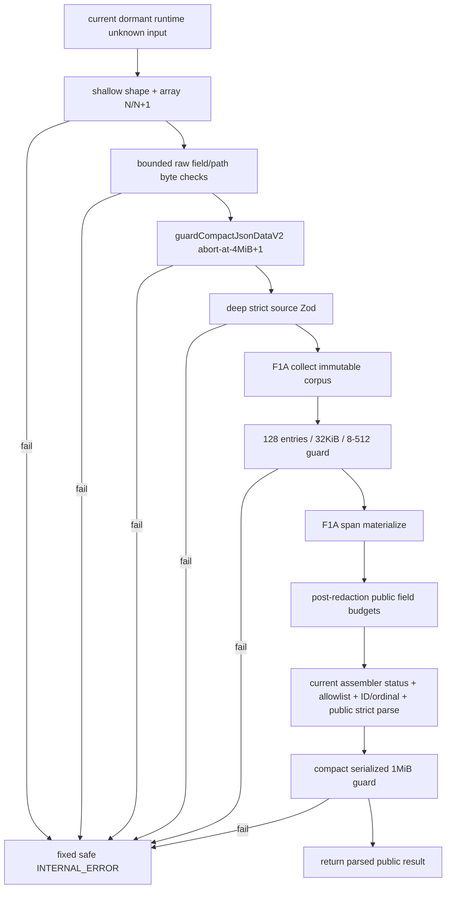

# public-result-resource-budgets-v2 feature design

## 0. 术语约定

| 术语 | 定义 | 防冲突结论 |
|---|---|---|
| `LocateResultResourceBudgetsV2` | roadmap 冻结的全部 count、field、corpus 与 aggregate 常量的唯一内部来源 | 不等同于请求侧 `LocateLimits`；二者数值有关联但 owner 不同 |
| shallow raw preflight | 只读取 known success/error shape、顶层/证据数组长度和有界 raw display 字段，不运行 Zod、corpus 或完整 stringify | “shallow”不表示不读任何 evidence；最多读通过 20/20/40 count gate 的已知字段 |
| bounded JSON byte counter | 不构造完整 JSON string、达到 limit+1 立即停止的 compact JSON UTF-8 精确计数器 | 最终计量与 `JSON.stringify` compact bytes 等价；不使用 UTF-16 length |
| public field budget | F1A span materialize 完成后对 term/file/symbol/excerpt 再执行的 UTF-8 上限 | 超限字段使用固定 placeholder，不截断原值 |
| aggregate failure | corpus entry/count bytes、unsafe source JSON 或 serialized public JSON 超限 | 整个 v2 shadow返回固定 safe `INTERNAL_ERROR`，不泄露 stage/value/size且不影响v1 |
| maximum-structure fixture | 在所有单项/数组上限内构造的最大合法 source/public 结构 | 用于验证 4 MiB / 1 MiB 预算依据，不作为自动放宽常量的反馈回路 |

现有 `result-budget-selector.ts` 负责 evidence 选择，`RepositoryReadLimits` 负责文件读取，`SafeProcessRequest` 负责 stdout/stderr；本 feature 只拥有 dormant v2 public boundary 的资源合同，不复用这些名称。

## 1. 决策与约束

### 需求摘要

F1B 阻止类型正确但异常巨大的 dormant assembler input 在deep Zod、递归corpus或完整JSON materialization前耗尽CPU/内存，并保证redaction后字段和最终response仍有硬上限。它与F1A materializer及当前 `PublicResultAssemblerV2` 共同形成dormant public-boundary最小安全闭环，但继续不切换production v1；F2 real source/materialization、F6 request outcome与F1C neutral registrar/composer真实接线属于后续 child。

成功标准：

1. raw counts、单字段、path segments、raw aggregate 在任何 deep schema/corpus 前按 N/N+1 与 UTF-8 bytes fail closed。
2. F1A corpus 超过 128 entries、32 KiB 或单 entry 8–512 bytes 时整次失败，不截断 corpus。
3. public field 超限使用固定 placeholder 与精确 metadata，不改变 evidence 数量、顺序或 ordinal。
4. strict public result compact JSON 超过 1 MiB 时返回无尺寸/detail 的 fixed safe `INTERNAL_ERROR`。
5. 最大合法结构 fixture 在冻结预算内通过；证据若不符只能回 roadmap update。

### 明确不做

- 不通过 budget 选择/丢弃 evidence；不修改 F2 ranking 或 request `maxConfirmed/maxCandidates`。
- 不截断 raw field、corpus、public array、coverage、nextActions 或 serialized JSON 后继续 success。
- 不把 4 MiB raw cap 实现成“先 `JSON.stringify` 再测量”，也不把单 token 长度当作完整 field 长度。
- 不修改 F1A detector、eligibility、span、phone、placeholder 或 propagation 语义。
- 不新增 stream transport、压缩、分页、持久化、Redis、远程服务或可配置 budget。
- 不输出内部 failure stage、实际 bytes、字段 path 或 raw 内容。
- 不实现、调用或等待 F2 real source/materialization、F1C canonical execution/neutral registrar/composer 或 F6 request-outcome aggregation；只冻结它们后续消费 guard 的 ABI。
- 不切换 package/service/MCP/CLI/docs 到 schema v2。

### 方案深度 pre-pass

| 候选 | 结论 | 原因 |
|---|---|---|
| 仅给 Zod strings/arrays 加 `.max()` | 拒绝 | Zod 已经深遍历；无法在 corpus/完整 JSON 前阻止大结构成本 |
| 先完整 stringify，再按 4 MiB 比较 | 拒绝 | 为检查预算先物化无界输出，正是 threat model 要阻止的路径 |
| 只依赖未来 Evidence Engine 通常最多返回 20/20 | 拒绝 | source/materializer 是独立安全边界，不能信任未接入 producer |
| shallow preflight + bounded byte counter + schema defense-in-depth + post-redaction/public aggregate guards | 采用 | 每层 owner 和执行顺序可观察，且不会用截断破坏安全 corpus 或 ordinal |

预算是长期公共安全合同，不使用 fake/mock 替代计数核心。最大结构 fixture 是对冻结常量的真实测量；若超过，只触发 roadmap 重新决策，不能在实现里提高上限。

### 复杂度档位

- Security = `hardened`：覆盖内存/CPU/响应放大型拒绝服务与 detail leak。
- Determinism = `deterministic`：同一 JSON data input 的 gate/stage/final bytes 稳定。
- Correctness = `exact-byte-contract`：统一 `Buffer.byteLength(..., 'utf8')` 与 compact JSON 语义。
- Failure = `fail-closed`：aggregate/corpus failure 不返回部分 success。
- Testability = `verified`：每个预算有 N/N+1、multi-byte、mutation owner，并验证 ordering。
- 其余维度采用长期维护的本地 TypeScript 库默认档位。

### 冻结预算

| Boundary | Limit |
|---|---:|
| normalized terms | 16 items；单项 128 bytes；累计 1024 bytes |
| confirmed / candidates / total evidence | 20 / 20 / 40 |
| raw file / path segments | 4096 bytes / 128 segments |
| raw symbol / excerpt | 2048 bytes / 16 KiB |
| unsafe public materialization source compact JSON | 4 MiB |
| expanded sensitive corpus | 128 entries；累计 32 KiB；单项 8–512 bytes |
| public term / file / symbol / excerpt | 128 / 2048 / 2048 / 2048 bytes |
| compact serialized public result JSON | 1 MiB |

所有 bytes 使用 `Buffer.byteLength(value, 'utf8')`。F1A 已冻结同一 eligible value 展开 `exact-text` 与 `path-segment` 两条 entry，因此 corpus count 与 total bytes 按展开后的 entries 计量；F1B 不重新按 value 去重。

### 关键决策

1. **当前 guard 顺序是 public contract**：dormant assembler runtime input shallow count/type → raw field/segment → bounded source JSON bytes → current deep source Zod → F1A internal corpus → corpus aggregate → F1A span materialize → public field budget → current assembler status/ID/ordinal/allowlist composition → public strict Zod → serialized public bytes。任一aggregate failure只使dormant v2 shadow失败，不能阻断production v1 exact projection。F2/F6/F1C接入后的目标顺序另列入forward ABI ledger，不是F1B当前可执行依赖。
2. **source preflight 接受 runtime `unknown`**：安全边界必须能拒绝JS/internal注入的非预期值；当前typed `FinalizedUnsafeLocateResultV2`及后续F2 `UnsafePublicMaterializationSourceV2`都天然可赋给`unknown`，不增加只为类型外观服务的overload，也不让F1B import未来F2类型。
3. **bounded counter 只接受冻结的 JSON data 子集**：
   - 顶层必须是 plain record；object/array/primitive 中任何显式 `undefined` 都 invalid，optional property 必须缺省而不是写 `undefined`；array 必须 dense，hole invalid。
   - plain record prototype 只能是 `Object.prototype` 或 `null`，只允许 enumerable own string-keyed data properties；record accessor、own symbol、任意 non-enumerable own property或custom `toJSON`直接invalid。
   - Array只允许固有non-enumerable own `length` data descriptor，以及`0..length-1`每个dense、enumerable own data index；index accessor、额外string key、own symbol及除`length`外的non-enumerable property都invalid。counter按index递增序列化，不把`array.foo`计入或默默忽略。
   - cycle、BigInt、function、symbol、non-finite number或其他object直接invalid。
   - property顺序与`Object.keys`/compact `JSON.stringify`一致；key和string value按well-formed JSON escaping计数，lone surrogate固定计为`\uXXXX`；有限number按ECMAScript JSON number格式，`-0`计为`0`。
   - 在该accepted subset内，key/quote/escape/comma/colon和UTF-8 bytes与compact `JSON.stringify`精确等价；达到N+1停止。容器Proxy可能触发必要的prototype/descriptor/length traps，任一trap异常fail closed，不承诺零side effect。
4. **常量leaf与guards单向依赖**：contract-owned leaf只导出预算常量和无业务类型的UTF-8 refinement primitives；source/public Zod只依赖leaf。guards module依赖leaf，并仅type-import当前F1/F1A types；dormant assembler/materializer依赖guards。leaf/contract不反向import guards，guards不runtime-import Zod schemas。后续F2 source/materialization、F6 request guard与F1C public/serialized composition只能单向deep-import已验收guard API。
5. **Zod 继续拥有 defense-in-depth**：source/public schemas 复用leaf常量设置array/count/field refinements；preflight先挡成本，schema再挡contract drift。
6. **corpus aggregate 不可截断且不信任derived total**：guard对expanded entries逐项abort-at-N+1重算count/bytes，不按value去重；`totalUtf8Bytes`必须是有限非负safe integer并与重算相等。任一entry invalid、129th entry、32KiB+1或derived mismatch都映射fixed error。
7. **post-redaction public field 是第二道展示预算**：N bytes保留；N+1用whole-field oversized placeholder。最终whole-field replacement的metadata只含`BINARY_OR_OVERSIZED_CONTENT`；file同时`resolvable=false`并派生一次`LOCATION_REDACTED`。
8. **aggregate failure 不改变原数组且不污染legacy**：在1MiB gate前当前assembler已分配ordinal；若超限整次v2 shadow返回error，不删尾、不重排、不重新编号。source/corpus/public/serialized任一failure都不能改变同一fixture的existing production v1 engine result或其bytes；F1B不创建尚未交付的canonical execution/`legacyV1Projection`对象。
9. **public cap 以 parsed object 的 compact serialization 为准**：synthetic text/debug projection已使用同一`JSON.stringify(parsed)`。当前schema最大合法结构必须实测低于cap；1MiB N/N+1由serialized guard primitive直接证明，guard failure到safe error的mapper单独证明，不伪造一个当前schema不可能产生的1MiB+1 success。
10. **forward ABI ledger不等于当前交付**：F2未来在real `UnsafePublicMaterializationSourceV2` stage调用F1B shallow count/type、raw field/segment与4 MiB guard，并在通过后自行执行strict source schema/pairing；F6未来以`guardCompactJsonDataV2(..., 16 * 1024)`保护request raw并聚合只接已验证core的request outcome；F1C只在neutral stage tokens完整后执行public strict parse与1 MiB serialized guard，不拥有real source/preflight/schema。F1B当前只交付leaf、guards、schema refinements与dormant assembler integration；不得创建F2/F1C/F6 owner文件、case、runner或runtime/type import。后续child必须独立review其调用边。

### Top 3 风险与缓解

| 风险 | 缓解 |
|---|---|
| “预算检查”自身先遍历/分配无界结构 | S1/S2 建 bounded counter、array length short-circuit 与 poison-tail ordering fixture |
| JSON escaping/Unicode 使字符数与实际 bytes 偏离 | S1/S4 用 ASCII、CJK、emoji、quote/backslash/control 的 exact N/N+1 table 和 compact serializer parity |
| 超限后静默截断 corpus/evidence，造成泄露或 ID 漂移 | S3/S4 exact failure projection + input immutability/ordinal regression，任何 aggregate failure 只返回 safe error |

### 非显然依赖、关键假设与基线风险

- 仅依赖已完成的F1 dormant `PublicResultAssemblerV2`/strict source-public schema/safe error table，以及F1A `SensitiveCorpusV2`/single materialization；implementation admission只要求F1A对应seam acceptance为`done`，不得等待F1C。
- F1B 是 items.yaml 唯一 `minimal_loop=true`；完成只代表 dormant boundary 闭环，不授权 v2 production cutover。
- 假设source/request raw是JSON data；拒绝getter/custom serialization是内部安全收紧，不影响typed plain-object producers。
- 4 MiB/1 MiB 依据必须由最大结构 fixture测量。合法最大 fixture如果超过，implementation 立即 block 并回 roadmap，不允许调常量或删字段。
- `coverage.unsatisfiedAnchors` 由request最多16 anchors推导为最多16项，`requestIndex`范围0..15；F2仍负责证明它对应本次实际normalized anchor列表。backends及其余enum/unique arrays由有限enum上界约束，maximum fixture据此可定义。
- roadmap canonical envelope 对 F1B 是 dependency-gated N/A；F1C 才创建 canonical envelope，因此F1B当前case/owner不得引用该类型或文件。
- 当前 build/typecheck/public-output-v2 定向基线已通过；400,000-byte `"x "` excerpt 当前会绕过旧单 token 检查，是本 feature 必须转红再转绿的 probe。
- F4 前没有多 OS/Node matrix；F1B 本地只提供当前平台事实。

### 必跑验证、交付物与清洁度

- 必跑：build、typecheck、F1B cases、完整 public-output-v2 unit/Golden、full unit/Golden、MCP/docs/no-cutover、scope/spec/Doctor。
- 交付物：预算常量与类型、bounded JSON counter、raw/schema/corpus/public/serialized guards、最大结构与 poison-tail fixtures、case ownership/runner registry、failure projection/forbidden scan、architecture/scope evidence、review/QA/acceptance。
- 清洁度：禁止 debug bytes/path/value 输出、真实凭证、本机路径、临时 TODO/FIXME、注释掉代码、无用 import、未登记 snapshot 更新、自动放宽常量。

## 2. 名词与编排

### 2.1 名词层

#### 现状

- `assemblePublicLocateResultV2` 首先对任意 runtime input 执行 deep `FinalizedUnsafeLocateResultV2Schema.safeParse`，随后递归收 corpus；没有 raw count/aggregate preflight。
- `src/contracts/v2/locate-result-v2.ts` 的 raw terms 只有 `.min(1)`，confirmed/candidates 和多数字符串没有 roadmap byte/count上限；public schema也未统一按 UTF-8 上限 refine。
- `sensitive-value-policy-v2.ts` 只用单个 2 KiB 常量和“oversized non-whitespace token”判断；400,000-byte `"x "`会通过。
- `PublicResultAssemblerV2` 不检查 corpus count/bytes，也不检查完整 compact public JSON。
- synthetic projection 对 parsed public result 使用 `JSON.stringify`，可作为 1 MiB bytes 的同语义出口。

#### 变化

新增内部预算契约与纯 guards：

```ts
// contract-owned leaf: src/contracts/v2/locate-result-resource-budget-contract-v2.ts
interface LocateResultResourceBudgetsV2 {
  readonly normalizedTerms: Readonly<{
    maxItems: 16;
    maxItemUtf8Bytes: 128;
    maxTotalUtf8Bytes: 1024;
  }>;
  readonly evidence: Readonly<{
    maxConfirmed: 20;
    maxCandidates: 20;
    maxTotal: 40;
  }>;
  readonly raw: Readonly<{
    maxFileUtf8Bytes: 4096;
    maxPathSegments: 128;
    maxSymbolUtf8Bytes: 2048;
    maxExcerptUtf8Bytes: 16384;
    maxJsonUtf8Bytes: 4194304;
  }>;
  readonly corpus: Readonly<{
    maxEntries: 128;
    minEntryUtf8Bytes: 8;
    maxEntryUtf8Bytes: 512;
    maxTotalUtf8Bytes: 32768;
  }>;
  readonly public: Readonly<{
    maxTermUtf8Bytes: 128;
    maxFileUtf8Bytes: 2048;
    maxSymbolUtf8Bytes: 2048;
    maxExcerptUtf8Bytes: 2048;
    maxJsonUtf8Bytes: 1048576;
  }>;
}
```

```ts
// F1B guard-owned implementation:
// src/evidence/public-output/result-resource-budget-guards-v2.ts
type ResourceBudgetStageV2 =
  | 'raw-shape'
  | 'raw-field'
  | 'raw-json'
  | 'corpus'
  | 'public-field'
  | 'public-json';

type ResourceBudgetCheckV2 =
  | Readonly<{ ok: true }>
  | Readonly<{ ok: false; stage: ResourceBudgetStageV2 }>;

function guardCompactJsonDataV2(
  input: unknown,
  maxUtf8Bytes: number,
): ResourceBudgetCheckV2;

function preflightUnsafePublicMaterializationSourceBudgetV2(
  input: unknown,
): ResourceBudgetCheckV2;

function guardSensitiveCorpusBudgetV2(
  corpus: SensitiveCorpusV2,
): ResourceBudgetCheckV2;

function applyPublicFieldBudgetV2(
  field: PublicFieldKindV2,
  redaction: PublicFieldRedactionV2,
): PublicFieldRedactionV2;

function guardSerializedPublicResultBudgetV2(
  result: LocateResultV2,
): ResourceBudgetCheckV2;
```

`guardCompactJsonDataV2`是F1B唯一允许跨deep module复用的参数化internal guard；它封装private
abort-at-N+1 traversal且接受的`maxUtf8Bytes`必须是positive safe integer。当前 dormant source
preflight用固定4MiB常量调用；F6后续request raw guard只能用`16 * 1024`调用，F2后续real source
stage复用固定4MiB preflight。当前F1B不创建这些未来caller。caller只能得到
`ResourceBudgetCheckV2`，不能访问counter、partial byte count或遍历状态。

`stage` 只供同模块测试/current dormant assembler分支，不进入 public error、日志或 diagnostic。v2
shadow public interface仍返回`LocateResultV2`，所有budget failure映射同一个
`createSafeErrorResultV2('INTERNAL_ERROR')`；production v1 projector不读取该结果。

依赖方向：

```text
locate-result-resource-budget-contract-v2.ts
          ↑                         ↑
locate-result-v2.ts     result-resource-budget-guards-v2.ts
          ↑                         ↑
          └──── public-result-assembler-v2.ts
```

budget contract leaf只导出冻结常量和不引用业务 DTO 的UTF-8 string refinement primitives，不import Zod schema、composer或F1A policy；`ResourceBudgetStageV2`、`ResourceBudgetCheckV2`和guards只属于guards module。guards当前只对F1/F1A使用type-only import，且不得importF1C/F2/F6。这样schema refinement与runtime guards共享数值但没有cycle。

示例：

```ts
// 来源：public-contract-v2 §4 resource budgets
assemblePublicLocateResultV2({
  ok: true,
  evidence: {
    ...validRawEvidence,
    confirmed: Array.from({ length: 21 }, createRawConfirmed),
  },
});
// → shallow length gate 直接返回 fixed safe INTERNAL_ERROR；
//   不读取 confirmed elements，不进入 Zod/corpus/JSON materialization。
```

```ts
// 来源：public-contract-v2 post-redaction/public aggregate contract
const result = assemblePublicLocateResultV2(
  rawWithExcerpt('x '.repeat(200_000)),
);
// → raw excerpt 超过 16 KiB，fixed safe INTERNAL_ERROR；
//   不能因每个 token 只有 1 byte 而通过。
```

public field N+1 与 aggregate N+1 的语义不同：field N+1 产生固定 whole-field placeholder并继续 strict success；corpus/source/public JSON aggregate N+1 使整次v2 shadow变 fixed safe error。

##### Interface 设计检查

- Module：`ResultResourceBudgetV2`，全新 in-process deep module；当前strict source/public schema、F1A materializer与dormant assembler共用常量/guards，F1C/F2/F6只保留后续单向消费约束。
- Module ownership：`LocateResultResourceBudgetContractV2`是无依赖leaf；`ResultResourceBudgetGuardsV2`是deep计算module。二者是同一capability的contract/implementation分层，不是平行budget owner。
- Interface：当前caller只提交unknown/current dormant raw input、F1A内部corpus、materialized field、parsed dormant public result；知道hard limits和pass/fail，不知道byte counter traversal。参数化compact guard作为forward ABI存在，但当前不接F6。
- Seam：current dormant raw input进入deep schema前、F1A内部corpus后、field materialize后、current public strict parse后四个固定点；未来F2/F6/F1C只能在roadmap指定阶段复用同一guard，不把业务source guard散到MCP/CLI。
- Depth / locality：JSON escaping、N+1 abort、schema defense、field replacement 和 aggregate failure集中；删除模块会把相同上限逻辑散到 schema/policy/materializer/composer/transport。
- Dependency strategy：纯in-process；leaf无业务依赖，guards依赖Node `Buffer.byteLength`并type-import F1/F1A types，不runtime-import Zod schema。
- Adapter：无 adapter；counter 不是 I/O port。当前测试穿同一 guards/materializer/dormant assembler。
- Test surface：各 stage N/N+1、poison tail、multi-byte/escaping、field placeholder、aggregate safe error 和 maximum fixture均可观察。

### 2.2 编排层

#### 现状

当前流程是 `deep raw Zod → recursive corpus → repeated field policy → allowlist/public Zod → return object`。没有前置 source guard、corpus aggregate或最终 serialization gate；超长 field 只看单 non-whitespace token。

#### 变化



流程级约束：

- count N+1必须在读取array element之前返回；poison value放在array element本身（getter/accessor object或读取即抛的element）证明21/21/41不访问elements。容器Proxy读取length/descriptor/keys可能触发trap，异常统一fail closed但不承诺零trap。
- shallow preflight读取任何known raw field前先用own property descriptor验证它是data property；accessor field直接fail closed且getter不得执行。正常Array的固有`length`是唯一允许的non-enumerable array property；count gate从其data descriptor取值，不读取任何index。
- 对通过 count gate 的最多40 evidence，只读取known raw display fields做UTF-8/segment计量；source不含coverage/status，后续owner facts只能是bounded enums/booleans/safe integers。
- bounded counter达到 limit+1立刻停止，不产生完整 string/chunk collection；invalid JSON data graph与超限一样 fail closed。
- source Zod和public Zod复用同一预算常量；preflight 与 schema结果不一致是 blocking contract bug。
- corpus guard对F1A expanded entries重算count/bytes并校验derived total一致；超限/不一致不截断、不继续field matcher。
- public field budget不重新运行detector/corpus；只检查已materialize value，必要时一次whole-field replacement。当前assembler必须在replacement后从最终field truth派生`locationRedacted`，保证oversized file也产生一次location degradation；F1 contribution/core属于后续真实materialization adapter。
- public field replacement不删 evidence、不改数组顺序/lines/provenance/reasons；file replacement仍按 F1 derived degradation/status。
- final compact JSON gate在current dormant assembler完成status/ID/ordinal/allowlist composition与public strict parse后执行；失败结果本身必须再次通过 public error schema且显著低于1MiB。后续F6/F1C调用点只在forward ABI ledger中冻结。
- 所有 guards纯函数、无共享状态/日志；相同 input/key insertion order等价时 verdict与public bytes稳定。

### 2.3 挂载点清单

本 feature 不增加外部挂载点。current internal guards固定挂在dormant assembler raw preflight、
F1A corpus/materializer与current public strict parse后四处；v2 source/public schema引用同一constants
module。`guardCompactJsonDataV2`只作为internal deep export冻结给后续F2/F6/F1C child，不从package
barrel导出；F1B不创建未来caller，production service、MCP、CLI、docs继续不可达v2 output。

### 2.4 推进策略

1. **预算契约与 byte primitive**：建立唯一常量、UTF-8 string/path计量和 bounded compact JSON counter。退出信号：exact bytes、escaping、invalid graph与 N/N+1 cases通过并登记runner。
2. **dormant source preflight + schema defense**：在current assembler接入 count/field/aggregate前置顺序，并让current source Zod复核同一预算；同时以pure synthetic input冻结`guardCompactJsonDataV2(...,16KiB)` forward ABI，不创建F6 caller。退出信号：poison-tail证明超限不深读，所有current source与generic guard边界/mutation有F1B owner。
3. **corpus + public field guards**：消费F1A expanded corpus并在materialize后执行四字段预算。退出信号：corpus不截断；field N/N+1 placeholder/metadata/status exact。
4. **dormant serialized aggregate + maximum fixture**：current assembler/public strict parse后检查compact JSON，验证最大合法source/public结构估算，并对existing production v1 engine输出做隔离回归。退出信号：1MiB N/N+1、fixed error、legacy isolation与max fixture report通过；F1C/F6 callsite保持N/A。
5. **integration hardening**：完成determinism、forbidden/detail scan、no-cutover、full regression、architecture/scope证据。退出信号：全部核心命令通过且无预算stage/value/bytes泄露。

### 2.5 结构健康度与微重构

#### 评估

- 文件级 — `src/contracts/v2/locate-result-v2.ts`：1137行且包含多个schema family；本feature只import无依赖budget leaf并增加refinement，不把counter/guard计算写入该文件。
- 文件级 — `src/evidence/public-output/public-result-assembler-v2.ts`：当前261行；F1B只在此接入dormant raw/corpus/field/serialized guard；未来F6/F1C会替换真实执行编排，但本轮不得提前创建其文件或调用边。
- 文件级 — `sensitive-value-policy-v2.ts` 当前547行；F1A设计已要求先拆分，F1B implementation admission时必须基于F1A已验收布局重测，不再重复拆。
- 目录级 — 当前`src/evidence/public-output/`有3个文件；新增guards module未达到摊平阈值。contract leaf落`src/contracts/v2/`，该目录当前只有1个文件。F1A未来布局可能改变，implementation preflight需复核实际文件数。
- compound检索无目录/命名convention命中。

#### 结论：不做额外微重构

预算计算默认落新deep module；schema只引用常量/refinement，current dormant assembler/materializer只在固定阶段调用guards。未来source factory/F6/F1C composer按forward ABI单向复用。对1137行contract做family拆分会引入大范围纯移动与import churn，且不是F1B完成预算闭环所必需。

##### 超出范围的观察

- `locate-result-v2.ts` 已明显偏胖；待v2 contract稳定后应单独走 `cs-refactor` 按request/evidence/coverage/raw/public拆分，不能把该结构债夹进资源安全feature。

## 3. 验收契约

### 3.1 关键场景清单

| ID | 输入 / 触发 | 期望可观察结果 |
|---|---|---|
| F1B-TERM-001 | terms 15/16/17、item 127/128/129 bytes、total 1023/1024/1025，含CJK/emoji | N以内进入deep schema；N+1 fixed error；计量按UTF-8 |
| F1B-EVIDENCE-001 | confirmed/candidate 19/20/21及total 39/40/41，超限数组含poison element | N通过；N+1在读取element前fixed error，poison不触发 |
| F1B-RAW-FIELD-001 | file 4095/4096/4097 bytes与127/128/129 segments；symbol 2047/2048/2049；excerpt 16383/16384/16385及400k `"x "` | raw N通过preflight；N+1在Zod/corpus前fixed error |
| F1B-RAW-JSON-001 | compact source JSON 4MiB-1/4MiB/4MiB+1与parameterized request 16KiB N/N+1；accepted subset覆盖正常Array intrinsic `length`、dense data indexes、key escaping、quote/backslash/control、CJK/emoji、lone surrogate、finite number与-0；rejected subset覆盖object/array/top-level undefined、array hole、accessor index、extra array string key、array symbol/extra non-enumerable、record accessor/toJSON/symbol/non-enumerable、nonplain/cycle/BigInt/function/nonfinite | `guardCompactJsonDataV2`在accepted subset与compact JSON bytes一致；Array只按0..length-1计量；N+1停止；rejected graph fixed error且不物化完整JSON，caller看不到counter |
| F1B-CORPUS-001 | F1A collector产出的双mode entries 127/128/129、重算total 32767/32768/32769、entry 7/8/512/513，以及derived total一致/少1/多1/非整数 | guard不按value去重；只有重算值与derived完全一致且全部满足时继续；任一N+1/mismatch整次fixed error |
| F1B-PUBLIC-FIELD-001 | materialized term 127/128/129，file/symbol/excerpt 2047/2048/2049 bytes，含placeholder amplification与多字节 | N保留；N+1 whole-field placeholder；metadata仅binary reason；file不可解析并派生一次location degradation |
| F1B-ORDINAL-001 | current dormant assembler某中间/尾部field超限与多个oversized fields | evidence数量/顺序/record refs不变；current assembler在whole-field replacement后派生location degradation并按原顺序分配ordinal，aggregate failure只返回shadow error而非删尾/重编号；F1 contribution/F1C composer为后续N/A |
| F1B-PUBLIC-JSON-001 | serialized guard primitive输入compact JSON value 1MiB-1/1MiB/1MiB+1；另让assembler最大schema-valid result通过guard，并对synthetic guard-failure执行safe mapper | N通过、N+1 guard failure；mapper只生成fixed safe INTERNAL_ERROR且无stage/size/path/detail；不伪造schema-valid 1MiB+1 success |
| F1B-MAX-STRUCTURE-001 | current source含16 terms、20+20 evidence与max raw fields/provenance；current dormant public含最多2 backends、16 unsatisfiedAnchors且index 0..15、所有finite enum/unique arrays与worst-case escaping | 唯一最大合法fixture在4MiB source和1MiB public内；实测报告记录headroom，不自动调常量；F2后续验证index与实际request anchors对应但不进入当前runner |
| F1B-LEGACY-ISOLATION-001 | current dormant source/corpus/public-field/public-schema/serialized各stage故障注入，并以同一synthetic repository fixture调用existing production v1 engine | 每个failure只使v2 shadow fixed error；existing production v1 result exact object graph/bytes与未运行v2 shadow时相同；不创建canonical execution或`legacyV1Projection` |
| F1B-ORDERING-001 | raw count已超限且array element内getter/poison读取会抛；count以内known raw field改为getter并记录调用；container Proxy trap单独测试fail closed；另置换object key顺序 | count超限不访问elements；known accessor field在getter执行前被descriptor gate拒绝；Proxy异常不泄露；等价accepted data的verdict/public bytes稳定 |
| F1B-PROJECTION-001 | raw/corpus/public/aggregate每个failure stage经过service/structured/text/debug synthetic projection | 全部等值fixed error，forbidden scan无raw值、bytes、stage或stack |
| F1B-NOCUTOVER-001 | package/service/MCP/CLI reachability与full production suites | production仍为schema v1，无新增v2 transport edge |

### 3.2 Case / fixture ownership inventory

| Runner surface | Group / case | Fixture owner | Assertion owner | Runner / manifest owner | Contract / Golden owner |
|---|---|---|---|---|---|
| unit | `public-output-v2/resource-budget-primitives` | `testkit/fixtures/public-output-v2/resource-budgets-v2.ts` | `test/unit/public-result-resource-budgets-v2.spec.ts` | `testkit/runners/runner-registry.ts`; `testkit/manifests/coverage/fixture-ownership.yaml` | `src/contracts/v2/locate-result-resource-budget-contract-v2.ts`; `src/evidence/public-output/result-resource-budget-guards-v2.ts` |
| unit | `public-output-v2/raw-resource-budgets` | `testkit/fixtures/public-output-v2/resource-budgets-v2.ts` | `test/unit/public-result-resource-budgets-v2.spec.ts`; `test/unit/public-output-v2-contract.spec.ts` | `testkit/runners/runner-registry.ts`; `testkit/manifests/coverage/fixture-ownership.yaml` | `src/contracts/v2/locate-result-v2.ts`; `src/evidence/public-output/result-resource-budget-guards-v2.ts` |
| unit | `public-output-v2/corpus-resource-budgets` | `testkit/fixtures/public-output-v2/corpus-resource-budgets-v2.ts` | `test/unit/public-result-resource-budgets-v2.spec.ts`; `test/unit/public-output-v2-redaction.spec.ts` | `testkit/runners/runner-registry.ts`; `testkit/manifests/coverage/fixture-ownership.yaml` | `src/evidence/public-output/sensitive-value-policy-v2.ts`; `src/evidence/public-output/result-resource-budget-guards-v2.ts` |
| unit | `public-output-v2/public-field-resource-budgets` | `testkit/fixtures/public-output-v2/public-field-resource-budgets-v2.ts` | `test/unit/public-result-resource-budgets-v2.spec.ts`; `test/unit/public-result-assembler-v2.spec.ts` | `testkit/runners/runner-registry.ts`; `testkit/manifests/coverage/fixture-ownership.yaml` | `src/evidence/public-output/result-resource-budget-guards-v2.ts`; `src/evidence/public-output/public-result-assembler-v2.ts` |
| unit | `public-output-v2/serialized-resource-budget` | `testkit/fixtures/public-output-v2/serialized-resource-budget-v2.ts` | `test/unit/public-result-resource-budgets-v2.spec.ts`; `test/unit/public-result-assembler-v2.spec.ts` | `testkit/runners/runner-registry.ts`; `testkit/manifests/coverage/fixture-ownership.yaml` | `src/evidence/public-output/result-resource-budget-guards-v2.ts`; `test/golden/public-output-v2.spec.ts` |
| unit + Golden | `public-output-v2/maximum-structure-budget` | `testkit/fixtures/public-output-v2/maximum-structure-v2.ts` | `test/unit/public-result-resource-budgets-v2.spec.ts`; `test/golden/public-output-v2.spec.ts` | `testkit/runners/runner-registry.ts`; `testkit/runners/golden-runner.ts`; `testkit/manifests/coverage/fixture-ownership.yaml` | `src/contracts/v2/locate-result-resource-budget-contract-v2.ts`; `test/golden/public-output-v2.spec.ts` |
| unit | `public-output-v2/resource-budget-ordering` | `testkit/fixtures/public-output-v2/resource-budget-ordering-v2.ts` | `test/unit/public-result-resource-budgets-v2.spec.ts`; `test/unit/public-result-assembler-v2.spec.ts` | `testkit/runners/runner-registry.ts`; `testkit/manifests/coverage/fixture-ownership.yaml` | `src/evidence/public-output/result-resource-budget-guards-v2.ts`; `src/evidence/public-output/public-result-assembler-v2.ts` |
| unit + Golden | `public-output-v2/resource-budget-projection` | `testkit/fixtures/public-output-v2/resource-budget-projection-v2.ts` | `test/unit/public-result-assembler-v2.spec.ts`; `test/unit/public-output-v2-errors-projection.spec.ts`; `test/golden/public-output-v2.spec.ts` | `testkit/runners/runner-registry.ts`; `testkit/runners/golden-runner.ts`; `testkit/manifests/coverage/fixture-ownership.yaml` | `src/evidence/public-output/public-result-assembler-v2.ts`; `test/golden/public-output-v2.spec.ts` |
| unit + Golden | `public-output-v2/resource-budget-legacy-isolation` | `testkit/fixtures/public-output-v2/resource-budget-legacy-isolation-v2.ts` | `test/unit/public-result-resource-budgets-v2.spec.ts`; `test/unit/public-output-v2-no-cutover.spec.ts`; `test/golden/public-output-v2.spec.ts` | `testkit/runners/runner-registry.ts`; `testkit/runners/golden-runner.ts`; `testkit/manifests/coverage/fixture-ownership.yaml` | `src/evidence/repository-evidence-engine.ts`; `src/evidence/public-output/public-result-assembler-v2.ts`; `test/golden/public-output-v2.spec.ts` |
| unit + MCP/docs | `public-output-v2/no-cutover-import-inventory` | `testkit/fixtures/public-output-v2/no-cutover-import-inventory-v2.ts` | `test/unit/public-output-v2-no-cutover.spec.ts`; `test/mcp/tool-output-parity.spec.ts`; `test/docs/public-output-v2.spec.ts` | `testkit/runners/runner-registry.ts`; `testkit/runners/mcp-runner.ts`; `testkit/docs/docs-smoke-runner.ts`; `testkit/manifests/coverage/fixture-ownership.yaml` | `src/index.ts`; `src/evidence/evidence.module.ts`; `test/unit/public-output-v2-no-cutover.spec.ts` |

`testkit/runners/runner-registry.ts`登记所有新增case；unknown case必须失败。fixture不得包含真实credential或本机path。实现必须落到表中exact owner路径；任何路径变更先返回design/design-review修订，禁止在implementation中以同上、existing owner或动态发现替代。

### 3.3 明确不做的反向核对

- 不应出现budget超限后 `.slice(0, limit)`、删尾evidence/corpus或重排ID的代码。
- source 4MiB gate前不应调用完整`JSON.stringify(input)`、deep Zod或F1A corpus collector。
- F1B当前不得创建F2/F6/F1C caller或import其owner文件；后续caller不得importprivate bounded counter，只能调用`guardCompactJsonDataV2`。F1 contribution/core不属于F1B当前交付。
- 不应使用`.length`、字符数、token数代替任何UTF-8 byte budget。
- 不应修改F1A eligibility/span/detector/phone/propagation常量。
- 不应新增config/env budget、分页/压缩/stream transport、日志或public failure detail。
- production package/service/MCP/CLI/docs不应输出schema v2。

### 3.4 Acceptance Coverage Matrix

| Scenario | Covered By Step | Evidence Type | Command / Action | Core? |
|---|---|---|---|---|
| F1B-TERM-001 / EVIDENCE-001 | S2 | unit boundary + poison fixture | `npm test -- --group public-output-v2 --case raw-resource-budgets` | yes |
| F1B-RAW-FIELD-001 | S2 | unit UTF-8/segment matrix | `npm test -- --group public-output-v2 --case raw-resource-budgets` | yes |
| F1B-RAW-JSON-001 | S1/S2 | byte-counter parity + mutation | `npm test -- --group public-output-v2 --case resource-budget-primitives --case raw-resource-budgets` | yes |
| F1B-CORPUS-001 | S3 | expanded corpus N/N+1 | `npm test -- --group public-output-v2 --case corpus-resource-budgets` | yes |
| F1B-PUBLIC-FIELD-001 / ORDINAL-001 | S3 | assembler exact projection | `npm test -- --group public-output-v2 --case public-field-resource-budgets` | yes |
| F1B-PUBLIC-JSON-001 | S4 | guard N/N+1 + maximum assembler integration + safe mapper | `npm test -- --group public-output-v2 --case serialized-resource-budget` | yes |
| F1B-MAX-STRUCTURE-001 | S4 | measured fixture report + Golden | `npm test -- --group public-output-v2 --case maximum-structure-budget && npm run test:golden -- --group public-output-v2` | yes |
| F1B-ORDERING-001 | S2/S5 | poison/permutation | `npm test -- --group public-output-v2 --case resource-budget-ordering` | yes |
| F1B-PROJECTION-001 | S5 | exact projection + forbidden scan | `npm test -- --group public-output-v2 --case resource-budget-projection && npm run test:golden -- --group public-output-v2` | yes |
| F1B-LEGACY-ISOLATION-001 | S4/S5 | each-stage failure + exact object identity | `npm test -- --group public-output-v2 --case resource-budget-legacy-isolation` | yes |
| F1B-NOCUTOVER-001 | S5 | reachability + MCP/docs | `npm test -- --group public-output-v2 --case no-cutover-import-inventory && npm run test:mcp -- --all && npm run test:docs` | yes |
| full regression | S5 | command logs | `npm test && npm run test:golden -- --all` | yes |

### 3.5 DoD Contract

| ID | 要求 | 证据 | 阻塞级别 |
|---|---|---|---|
| DOD-DESIGN-001 | 四层预算、顺序、failure和owners与roadmap一致 | independent design review | blocking |
| DOD-IMPL-001 | S1-S5完成，无budget truncation/no-cutover | checklist + artifact inventory + ordering evidence | blocking |
| DOD-REVIEW-001 | 独立review覆盖bounded counter、ordering、schema parity与detail leak | review report | blocking |
| DOD-QA-001 | 全部N/N+1、Unicode/escaping、maximum fixture、projection与full suites通过 | QA report + command logs | blocking |
| DOD-ACCEPT-001 | acceptance核对minimal loop、architecture/scope/roadmap回写 | acceptance report | blocking |

Validation Commands：

| ID | 命令 | 目的 | 核心性 | 失败处理 |
|---|---|---|---|---|
| CMD-BUILD | `npm run build` | production/CLI compile | core | fix-or-block |
| CMD-TYPECHECK | `npm run typecheck` | strict types/budget constants | core | fix-or-block |
| CMD-F1B-UNIT | `npm test -- --group public-output-v2 --case resource-budget-primitives --case raw-resource-budgets --case corpus-resource-budgets --case public-field-resource-budgets --case serialized-resource-budget --case maximum-structure-budget --case resource-budget-ordering --case resource-budget-projection --case resource-budget-legacy-isolation` | F1B全部case | core | fix-or-block |
| CMD-V2-UNIT | `npm test -- --group public-output-v2` | dormant v2 regression | core | fix-or-block |
| CMD-V2-GOLDEN | `npm run test:golden -- --group public-output-v2` | exact bytes/failure/forbidden | core | fix-or-block |
| CMD-NOCUTOVER | `npm test -- --group public-output-v2 --case no-cutover-import-inventory` | transport reachability | core | fix-or-block |
| CMD-UNIT-ALL | `npm test` | full unit regression | core | fix-or-block |
| CMD-GOLDEN-ALL | `npm run test:golden -- --all` | full Golden regression | core | fix-or-block |
| CMD-MCP-ALL | `npm run test:mcp -- --all` | production v1 MCP | core | fix-or-block |
| CMD-DOCS | `npm run test:docs` | docs/schema v1 | core | fix-or-block |
| CMD-DOCTOR | `python .codestable/tools/codestable-doctor.py --root .` | artifact hygiene | supporting | document-baseline |
| CMD-DIFF-CHECK | `git diff --check` | patch cleanliness | supporting | fix-or-block |
| CMD-SPEC | `python .codestable/tools/codestable-spec-governance.py --root . analyze` | spec drift | supporting | fix-or-block |
| CMD-SCOPE-CHECK | `python .codestable/tools/codestable-scope-gate.py --feature-dir .codestable/features/2026-07-24-public-result-resource-budgets-v2 --allow-file .codestable/features/2026-07-24-public-result-resource-budgets-v2/public-result-resource-budgets-v2-scope-allow.txt --check-path . --cleanliness-path src/contracts/v2 --cleanliness-path src/evidence/public-output --cleanliness-path test/unit --cleanliness-path test/golden --stage implementation.before_review` | scope/cleanliness | core | fix-or-block |

Required Actions：

| ID | 动作 | 证据 | 阻塞级别 |
|---|---|---|---|
| ACT-ARCH-CHECK | acceptance前核对budget capability/current code与architecture；有漂移则update，无变化记录no-change | architecture check/update | blocking |
| ACT-SCOPE-CHECK | 将scope gate与完整staged/unstaged/untracked changed paths对账，排除ambient夹带 | scope JSON + changed-path inventory | blocking |

Required Artifacts: budget contract leaf与无环dependency inventory、private bounded counter与public-internal `guardCompactJsonDataV2` API、current source/public schema refinements、dormant source/corpus/public-field/serialized四层guards、N/N+1/Unicode/escaping/poison fixtures、F1A corpus derived-total与current assembler post-field status/ordinal report、forward ABI/current executable owner separation proof、maximum current source/public structure measurement、v2 failure/existing v1 engine exact-reference-and-bytes isolation、case ownership/registry、fixed-error/forbidden report、scope allow manifest与完整changed-path inventory、architecture/scope evidence、review/QA/acceptance。

### 3.6 自我批判结论

- 可证伪性：每个数值都有N/N+1/multi-byte owner；ordering用poison fixture，不依赖耗时猜测。
- 步骤原子性：primitive、raw、corpus/public field、aggregate/max fixture、hardening分开。
- 最弱依赖：只有F1A corpus形状必须先实现并accept；implementation admission会重新检查done，不凭design-review进入代码，也不等待F1C/F6。
- 证据完整性：同时覆盖fail closed、field replacement、no truncation、no detail、最大合法结构与no-cutover。
- 基线可执行性：新增case必须登记；full suites与现有runner命令真实。
- 接口深度：caller只见预算结果，JSON escaping与stage ordering藏在module内。

## 4. 与项目级架构文档的关系

acceptance后应把`ResultResourceBudgetV2`在current dormant assembler中的四层guard、固定顺序与fail-closed语义提炼到public result boundary架构；F1+F1A+F1B组成dormant最小安全闭环。F2/F6/F1C真实接线继续标为forward，待对应child acceptance后再写为当前事实。public schema字段不新增，requirement不变，不新增ADR。若maximum fixture证明冻结预算不足，必须回Epic roadmap update并重新review，不能在feature内静默放宽。
