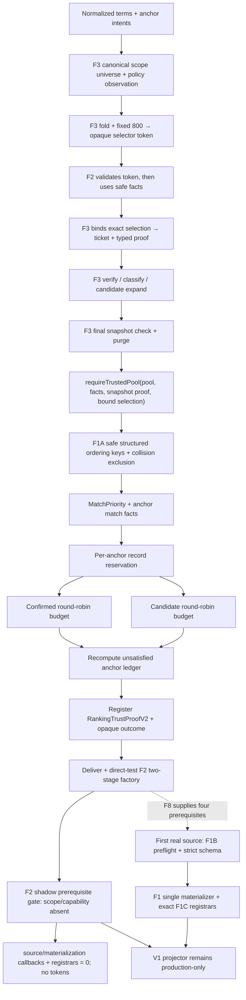

# relevance-ranking-budget feature design

## 0. 术语约定

| 术语 | 定义 | 防冲突结论 |
|---|---|---|
| anchor intent | 原始anchor首次出现的`requestIndex`与规范化后的`kind/value/caseSensitive`绑定 | 不等同于现有只保留值的`NormalizedLocateAnchor`；只在request内部存在 |
| discovery reservation | 文件读取前由F3 public-safe candidate view决定的“每个anchor最多一个opaque locator ref或safe等价组” | F2不接收raw hit/locator；不是anchor已满足，也不证明文件内容 |
| trusted stable pool | F3 final checker构造并与exact `SnapshotFactsV2`绑定的`TrustedStableEvidencePoolV2` | F2不能接收裸records、pre-purge pool或另一execution的facts |
| expanded intent provenance | F3 accessor返回safe candidate的`querySeedKeys/matchedAnchorKeys` canonical union | selector只用明确origin keys，不读取semantic identity、reason、raw matchedText或短symbol |
| tracked discovery ref | selector选中opaque locator ref后由F3 snapshot登记的同次execution ref | raw locator留在F3 WeakMap；ranker只读取outcome与proof completeness |
| opaque file bucket ref | F3为成功canonical binding创建的无payload object token | aliases共享object；F2只能按object identity分桶，不能读取branded path string |
| public-safe ranking key | F1A policy在pre-ID阶段生成的保守`file/symbol`投影 | 可比最终display更保守但不能包含任意合法corpus可能隐藏的raw code units；raw locator/symbol不得作secondary comparator |
| ranking fact | stable record与`eligible + MatchPriorityV2`或`ineligible`、命中的anchor keys和regular-term数量的请求内判别结果 | priority是内部顺序常量，不是confidence，不进入公共DTO |
| anchor reservation record | 最终evidence预算中，为一个尚未被已选记录覆盖的anchor最多新增的一条record | 与读取前file reservation是两个阶段；同一record可满足多个anchor |
| safe ordering class | priority、F1A safe file/symbol、lines与canonical public enum/source vector完全相同的record组 | distinct records碰撞时整组`selection-ambiguous`排除，禁止用discoveryKey/hash破平局 |
| ordinary round-robin | anchor reservation后，对confirmed与candidate分别按opaque file token分桶，每轮每文件最多取一条 | 只有唯一完整safe ordering key的record可进入；无raw tie-break |
| ranking trust proof | ranker为exact ranking fragment、trusted pool/facts、retained record refs与ledger登记的private provenance | finalizer不从公共字段反推内部key，也不接受手写fragment |
| ranking outcome token | F2为同execution的ranking fragment、budget facts与ranked unsafe refs签发的无own-property token | F6只能经`requireEvidenceRankingOutcomeV2`读取fragment/budget facts；F2 source stage使用更窄的owner-private source view |
| unsafe materialization source | exact normalized terms、F2 retained顺序下的raw evidence refs与F2/F3 proofs绑定的private evidence-only source | 先经F1B source preflight与strict schema；不含corpus、coverage、status、public ID或caller materialized fields |
| trusted materialized core | F1 single materializer从exact source内部构建唯一corpus并完成F1B corpus/public-field budgets后的保序结果 | 只含已脱敏terms/evidence、private stable refs、F1 contribution/proof；不做F6 aggregation或F1C composition |

## 1. 决策与约束

### 需求摘要

本feature替换v2 expanded lane中的纯字典序文件/evidence截断。读取前，`DiscoveryHitSelectorV2`只消费F3在任何cap前生成的public-safe opaque candidate view与结构化anchor/scope eligibility；F3私下把被选opaque refs解析为locator并完成verification、classification、candidate expansion与final purge。`EvidenceRankerV2`只消费同proof trusted view，按固定tier、safe ordering class与opaque file token执行anchor reservation/round-robin，最后生成真实`ranking` owner fragment与私有budget facts。production仍由legacy v1 projector输出。

成功标准：

1. `requestIndex`在anchor去重后保留首次原始索引；相同`kind + normalized value + case`只有一个intent。
2. anchor数不超过`maxFiles`时，anchor输入排列不改变expanded lane最终文件集合；超过时只有读取前reservation允许按首次请求顺序产生集合差异。
3. 在存在明确matched-anchor provenance、相关discovery策略完整且file/class budget允许时，显式file/symbol/table/route/term anchor不会被无关文件或records挤出；`>maxFiles`、incomplete/unobserved与budget-deferred必须诚实进入ledger。同一record可覆盖多个anchor，每个anchor最多额外预留一条。
4. `MatchPriorityV2`严格使用`100/96/95/94/92/88/87/80/70/60/40`，不公开score、confidence或内部discovery key。
5. confirmed与candidate分别应用`maxConfirmed/maxCandidates`和跨文件round-robin；一个文件不能在一轮内独占多个普通名额。
6. `unsatisfiedAnchors`由purge后的同一stable pool与最终retained arrays重新计算，candidate只能使用`UNVERIFIED`；无法证明完整搜索的none使用`BUDGET_EXCEEDED`，只有相关策略完整且无截断/变化影响时使用`NOT_FOUND`。
7. ranking arrays只含trusted pool中exact draft refs，class互斥、无重复、无public ID；F1C finalizer对clone、池外、pre-purge、cross-execution与伪造ledger fail closed。
8. F2为真实success登记opaque ranking outcome，并实现、直接测试F1C neutral port的真实source/materialization两段factory；pre-stage admission只要求`snapshot/ranking/scope/capability`四个prerequisite且拒绝预置`backend/request-outcome`。F2 acceptance时真实shadow只有snapshot/ranking，仍缺scope/capability，因此两个callback和F1C registrar均为0；F8补齐scope/capability后才第一次取得factory并运行两段，随后由aggregation exact-once产生backend/request-outcome。F2不得伪造aggregation，production v1全量回归deep-exact。
9. expanded cap、maxFiles selector、comparator与round-robin只消费F1A/F3 public-safe view；bucket membership只消费F3无payload object token。distinct refs的完整safe key碰撞整组推迟/排除并进入budget truth；raw file/symbol/matchedText、canonical path、discoveryKey/hash、response-wide corpus与assembler重排均不参与membership/order/ID。

### 明确不做

- 不解析自然语言`question`，不做概率相关性、embedding、模糊搜索、学习排序或confidence。
- 不重新读取filesystem、不调用backend、不重新verification/classification/candidate expansion，也不从display excerpt推断focus命中。
- 不实现F5 process/backend outcome、F6 status/abort/limits/nextActions聚合、F7 scope policy或F8 language adapter；F2只交付可由F8 exact-once取得并装配的真实source/materialization stages，不提供aggregation placeholder，也不在owner不完整的F2 shadow上提前运行两段。
- 不改变public v1/v2 schema、tier常量、anchor kind、reason枚举、预算上限或ID分配规则。
- 不把generic derived relationship candidate静默塞入未定义的新tier；它只有在命中现有file/symbol/table/route/term谓词时才进入对应tier。非anchor且不命中固定tier的stable record不进入v2 retained arrays，legacy v1 candidate行为保持不变。
- 不在snapshot purge后重读或refill；不在public ID分配后重排。
- 不让assembler在response-wide redaction后重新排序或替换retained records；F2是唯一rank/budget/order owner。
- 不把absolute path、canonical file key、content hash、Git identity、raw excerpt、matched term值或discovery key写入公共输出、日志或验收artifact。
- 不提前切换production projector，不修改`private: true`，不commit、merge、push、publish、release或deploy。

### 方案深度 pre-pass

| 候选 | 结论 | 原因 |
|---|---|---|
| 延续`sort(comparePublicEvidence).slice()`并只把anchor文件放前面 | 拒绝 | 无法表达五类anchor satisfaction，单文件仍可独占，变化文件也可能先影响预算 |
| 在backend query中提高anchor权重并直接认为满足 | 拒绝 | hit尚未filesystem verified，且backend返回顺序不是公共truth |
| 给每条record算浮点相关性/confidence | 拒绝 | 不可解释、难做permutation证明，并违反approved contract |
| 读取前file reservation + purge后固定tier/anchor reservation/分class round-robin | 采用 | 两阶段职责清晰，能在不重读的前提下证明anchor、预算和snapshot一致 |
| 为所有未列出的candidate增加隐式tier 0/40 | 拒绝 | 会静默改写approved `MatchPriority`；若产品要保留generic derived candidate，必须回Epic修改contract并重审 |

### 复杂度档位

- Correctness = `contract truth table`：所有tier、anchor satisfaction与reason通过穷举表，不靠snapshot文本猜测。
- Determinism = `permutation-proof`：backend hits、regular terms和预算后的record顺序有独立permutation suite。
- Performance = `bounded in-memory pure ranking`：输入上限来自F3 pool，rank阶段不得I/O；复杂度以固定上限数组排序与分桶为主。
- Security = `opaque trusted input`：rank前验证pool/facts同proof；排序键不读取absolute/canonical path或excerpt。
- Compatibility = `expanded v2 facts + untouched legacy v1`：F2不成为production output edge。
- 其余维度沿用当前NestJS/TypeScript本地工具的默认长期维护档位。

### 关键决策

1. **保留首次request index、display value与现行case-aware去重**：新增private `normalizeAnchorIntentsV2`，使用与当前`normalizeLocateAnchors`相同的NFKC/trim/file/case语义并保留首次索引。intent同时保存首次exact normalized `value`与`comparisonValue`；insensitive comparison严格使用`value.toLocaleLowerCase('und')`，其余模式保持`value`。key固定为`kind-byte + case-byte + utf8-byte-length + comparisonValue bytes`的结构编码，不使用分隔符拼接。现有helper改为该结果的`value` projection，因此insensitive `Foo/foo`仍只保留首个`Foo`并保持v1/backend请求deep-exact。F6以后可替换filesystem path normalization实现，但不得改变该comparison/display split。
2. **regular terms仅在rank view稳定排序**：canonical executor继续把现有normalized terms原顺序交legacy/backend；ranker另按`value comparison key + caseSensitive`去重排序。`question`和negative terms不进入priority。
3. **selector只接收F3 opaque scope-folded token**：caller不标记、不筛选eligible files，也不能传candidate array。F3先对canonical expanded/legacy lane universe直接调用trusted scope adapter、完成safe-group fold与固定800 cap，再签`TrustedScopeFoldedSelectorViewV2`。`DiscoveryHitSelectorV2.select(selectorView, anchorIntents, maxFiles, execution)`是唯一入口；它必须先调用F3 `readScopeFoldedSelectorFactsV2`，token clone/mapping/cross-execution时pre-observation spy保持0。F7替换policy adapter只改变F3 observation，不改变F2 seam或算法。
4. **accessor返回值才是F2 public-safe candidate facts**：通过验证后，F3 accessor只返回opaque`hitRef/locatorRef`、F1A safe key、lines/source与结构化origins，不含semantic identity/ref、raw file/symbol/matchedText/reason/discoveryKey。F2不得接收或反射`ExpandedBackendHitV2.hit`、`PreCapPublicSafeDiscoveryPoolV2`、folded pool结构或caller过滤结果；legacy `BackendHit`保持原样。
5. **anchor-to-candidate只信明确origin**：selector只以safe candidate的`matchedAnchorKeys`关联anchor；不得从source/reason/display/safe symbol猜origin。该关系只决定opaque locator refs，不能产tier或satisfaction。
6. **maxFiles reservation按完整safe selector key和原子等价类冻结**：`matchedAnchorKeys`只过滤某anchor可见的candidate membership，不参与排序或等价类；候选key精确为`safe file + lineStart + lineEnd + safe symbol + canonical source enum order`。distinct locator refs同key形成等价类；若剩余file容量可容纳整组，整组加入并可服务多个anchor，否则整组`budget-deferred`且`filesTruncated=true`，禁止raw/arrival/discoveryKey/origin挑一个。anchors `<=maxFiles`按canonical anchor key遍历；`>maxFiles`才按首次requestIndex。selector完成后返回冻结`SafeDiscoverySelectionDraftV2`；canonical executor在任何reader调用前用F3 `bindDiscoverySelection(draft)`换取exact ticket与typed `SafeDiscoverySelectionProofV2`，F3 WeakMap私下解析raw locator。
7. **非anchor容量同样只按safe等价类补齐**：anchor reservation后按完整safe selector key遍历其余等价类；能整组装入才加入，否则整组略过并记truncated。selection保留opaque hit/locator refs，不含raw hit或locator；aliases在读取前按不同locator refs计`maxFiles`，成功解析后stable records通过共享`OpaqueFileBucketRefV2`合桶。
8. **F3 trust gate先于selector与ranking的任何观察**：selector先验证opaque folded token；`EvidenceRankerV2.rank()`另接收pool/facts、opaque snapshot proof与exact `BoundSafeDiscoverySelectionV2`，先调用F3 trust lookup取得`TrustedSnapshotRankingViewV2`。任一失败都不得读取candidate/records/file outcomes/anchor completeness、生成rank facts或ledger。view records只有`recordRef/fileBucketRef/draft/rankingSignals`；任何semantic identity、branded canonical string或discoveryKey均不在F2接口。selector/snapshot/selection proof clone、reservation篡改、cross-pool/ticket/execution混配均在观察前拒绝。
9. **priority取一条record命中的最高tier**：tier数字越大越优先；一个record可以匹配多个anchor和regular terms，但只有一个最高`MatchPriorityV2`用于排序，完整matched anchor keys单独保留供reservation/ledger。
10. **tier 100–87使用verified focus与classification**：
    - 100：任一class的record位于exact file anchor。
    - 96：`direct`、confirmed、role为definition/execution-site且exact canonical symbol anchor。
    - 95：`direct`、confirmed、role为definition/execution-site且verified matched term命中exact route anchor。
    - 94：`direct`、confirmed、role为definition/value-mapping且verified matched term命中exact table anchor。
    - 92：任一class的verified literal focus命中exact term anchor；是否达到confirmed satisfaction仍由class/reason谓词决定。
    - 88：candidate role为reference/related，exact canonical symbol或derived `draft.location.symbol`命中symbol anchor；derived symbol只表示candidate relation。
    - 87：candidate的verified literal focus或derived token exact命中route/table anchor。
11. **tier 80–40不从display window猜测**：
    - 80：不命中上述explicit anchor，`direct`且CodeGraph provenance与structured symbol discovery事实同时存在。
    - 70/60：`direct.rankingSignals.matchedTerms`与排序后的regular request terms交集分别大于等于2或等于1；anchor-only verification term不计。
    - 40：candidate明确带`SECONDARY_BACKEND_HIT`且未命中更高tier。
    - 不满足任何固定tier的record标为`ineligible`，不参与v2 budget；不得创建隐式0分。
12. **完整safe ordering key必须唯一，禁止private raw tie-break或字符串codec**：每条trusted view record调用F1A生成safe file/symbol，并构造结构化只读`PublicSafeEvidenceOrderingKeyV2`，字段精确为priority、safe file、lineStart/lineEnd、safe symbol、class/role/reason/operation/source canonical enum vectors。matched anchor keys与regular-term count仍可作为tier/rank fact，但不属于ordering key。比较器精确为priority数值descending；其余scalar按code-point/enum ascending；vector逐元素ascending后按长度ascending。禁止delimiter join、`JSON.stringify`或自由字符串codec。F2先按结构化key equality分组；同一recordRef重复由proof拒绝，distinct recordRefs仍同key则全组标`selection-ambiguous`、从retained候选排除并写budget/completeness truth。只有唯一key records进入comparator。跨tier pair必须明确证明100先于40，逆序输入、delimiter、多字节、空vector与vector-boundary mutation必须证明方向和tuple边界稳定；raw file/symbol/excerpt/matchedText、canonical/absolute path、discoveryKey、content/Git hash与public ID均不参与；assembler保留本顺序。
13. **anchor record reservation先于普通容量**：按canonical anchor key遍历，不使用requestIndex决定最终evidence优先级。若已选record已达到该anchor最佳可用satisfaction，不新增；否则在相应class仍有容量时选最佳record。每个anchor最多新增一条，但一条record可以同时覆盖多个anchor。
14. **confirmed优先、candidate保底且class budget独立**：对同一anchor先尝试能达到confirmed satisfaction的record；对应class容量不可用时可选candidate satisfaction record。file anchor由任一verified retained record达到confirmed satisfaction，但该record仍消费其自身confirmed/candidate class budget。
15. **普通round-robin只按无payloadbucket object与唯一safe head排序**：anchor records移除后按class和F3 `OpaqueFileBucketRefV2` object identity分桶；token无payload且只判断membership。桶内及active bucket head都只按已证明唯一的完整safe ordering key排序，每轮每bucket取一条。distinct files即使safe path相同仍是不同bucket，但若head完整key碰撞已在decision 12整组排除；aliases共享同一个bucket object。
16. **最终数组顺序等于选择顺序**：每个class先输出按stable comparator排序的anchor reservation records，再追加ordinary round-robin序列；confirmed数组与candidate数组互相独立。PublicResultAssembler以后只按`confirmed`后`candidate`分配连续ID，不得重新排序。
17. **anchor satisfaction从retained arrays重算**：
    - file：exact file中任一verified retained record即confirmed。
    - symbol：confirmed definition/execution；否则exact reference/related candidate为candidate。
    - table：confirmed definition/value-mapping；否则exact literal/reference candidate为candidate。
    - route：confirmed definition/execution；否则exact literal/reference candidate为candidate。
    - term：confirmed且`EXACT_TERM_MATCH`或`DIRECT_ALIAS_MAPPING`的semantic evidence为confirmed；否则exact verified literal candidate为candidate。
18. **unsatisfied reason同时消费F3 completeness与F2 collision-anchor proof**：candidate固定`UNVERIFIED`。`selection-ambiguous` fact必须保留proof-bound pre-exclusion priority、ordering key与`matchedAnchorKeys`，但绝不进入retained/public；F2把exact collision refs及collision→anchor relation登记进`RankingTrustProofV2`。none若matching stable record被class budget或safe collision移除、selector等价组deferred、file/pool截断，或F3 `anchorCompleteness(anchorKey, boundSelection.proof).state='incomplete'`，统一`BUDGET_EXCEEDED`。F3 API已把backend telemetry-only/pre-safe truncation、selector deferred、pre-ranking truncation和任何selected locator `unobserved`纳入incomplete；F2不得把post-ranking collision truth伪装成F3 proof或接收孤立boolean。exact ref `purged`也为BUDGET。只有exact typed proof返回complete、collision relation无match、相关refs stable或无reservation、且stable pool无match才`NOT_FOUND`。删除/替换/cross-execution collision-anchor relation必须fail closed；global snapshot changed/discard count不污染unrelated anchor。
19. **limit facts与ranking fragment分层**：F2产出private `EvidenceBudgetFactsV2`，记录`maxFiles/maxConfirmed/maxCandidates`是否真正截断以及`preRankingPoolTruncated`；它供F6唯一聚合`limitsReached/status/nextActions`，F2不提前添加request-outcome owner。
20. **ranking fragment与opaque outcome有独立trust proof**：ranker把exact fragment、pool/facts/bound selection及其ticket/proof/trusted view、terms/anchors/limits、structured safe ordering keys、collision exclusions、rank facts、trace、retained refs、每anchor proof completeness与limit facts登记到private WeakMap，并签发无own-property `EvidenceRankingOutcomeV2`。F6唯一可导入的`requireEvidenceRankingOutcomeV2(outcome, expectedSnapshotProof, expectedExecution)`在返回fragment/budget facts前核对exact proof与execution；F2 source module使用owner-private accessor取得同顺序`RankedUnsafeEvidenceRefV2[]`。finalizer验证全部exact inputs同execution、arrays exact refs/class互斥/无重复、ledger一致；safe pool/selection/proof/completeness/outcome clone替换、reservation篡改或cross-pool/cross-ticket/cross-execution混配均拒绝。没有caller-owned `ExpandedDiscoveryCompletenessV2`。
21. **F2拥有真实source/materialization stages而不越权聚合**：F2实现`createF2LocateProjectionStagesV2()`，精确返回`Pick<LocateProjectionPreparationPortV2, 'createSource' | 'materialize'>`；factory本项由direct harness完整测试。F2-stage real shadow因缺scope/capability两个prerequisite而在`inspectLocateProjectionPrerequisiteOwnersV2`停止，两个callback和三个F1C registrar均为0且没有stage token；backend/request-outcome缺失不是pre-stage blocker，它们由未来aggregation产生。只有F8把scope/capability补齐后才exact一次取得本factory，并把两个方法逐一委托给source/materialization wrappers。`createSource`必须先消费same input/execution的`TrustedLocateProjectionPrerequisitesV2`，再验证opaque F2 outcome、F3 snapshot proof以及source container/array identity descriptor；第一项element-aware操作仍是F1B shallow/4MiB preflight。通过后用`registerTrustedLocateProjectionSourceV2({identity: source}, prerequisites, input, execution)`登记F1C token。`materialize`只接受同input/execution且由前一步登记的source token，exact一次调用F1 materializer并经F1B corpus/public-field budgets，验证core/contribution后调用materialization registrar。任一source/core/proof/guard/registration/clone/reorder/cross-execution失败只返回`invalid-facts`并使later stage为0；F2不实现、占位或调用`aggregate`，F8只把已取得的F2两段与F6真实aggregation装配成唯一完整port。
22. **legacy v1完全隔离**：读取前selector、tier、round-robin、unsatisfied ledger和ranking fragment只作用于expanded v2 lane。legacy继续消费F3冻结的legacy backend/record/budget view，现有ID、order、limits/status、Golden、MCP/docs deep-exact。
23. **当前executable gate与未来F8 importer ledger分离**：F5只有`selectionEligibility='complete-safe-set'`的完整backend/fallback outcome可进入F3 safe pool与本selector；incomplete retained hits只作为bounded attempt telemetry，绝不进入ranking。F6只用`requireEvidenceRankingOutcomeV2`读取F2 fragment/budget facts，其`RequestOutcomeAggregatorV2`输入直接接收已经验证的`TrustedMaterializedEvidenceCoreV2`，不得导入或调用materialization token accessor。F2 acceptance时`requireF2MaterializedEvidenceCoreV2`与`requireEvidenceRankingRetainedDecisionViewV2`的production runtime importer count都必须为0；compile/AST gate冻结未来exact allowlist并拒绝所有现存或未授权 importer。F8 acceptance才原子把core accessor importer从0变为1（exact aggregation wrapper），把retained-decision accessor importer从0变为1（exact `src/evidence/language/capability-coverage-v2.ts`），并验证accepted orchestrator、F6、package barrel及其他F8/F9模块仍不可导入。future aggregation wrapper调用core accessor后把core交给F6，caller不提交source token；future capability consumer只取得confirmed/candidate `StableRecordRefV2[]`。后续item不得重做evidence排序、修改tier、构建caller corpus或替换materialized fields。

### Priority与satisfaction核对表

| 输入事实 | Priority | satisfaction |
|---|---:|---|
| candidate位于exact file anchor | 100 | file confirmed；record仍在candidate数组 |
| direct confirmed exact symbol definition | 96 | symbol confirmed |
| derived related exact symbol token | 88 | symbol candidate / `UNVERIFIED` |
| direct confirmed exact route execution | 95 | route confirmed |
| candidate exact route literal | 87 | route candidate / `UNVERIFIED` |
| direct confirmed exact table mapping | 94 | table confirmed |
| candidate exact table literal | 87 | table candidate / `UNVERIFIED` |
| confirmed semantic exact term | 92 | term confirmed |
| candidate verified literal exact term | 92 | term candidate / `UNVERIFIED` |
| nonanchor structured CodeGraph record | 80 | 不影响anchor |
| direct focus命中2个regular terms | 70 | 不影响anchor |
| direct focus命中1个regular term | 60 | 不影响anchor |
| `SECONDARY_BACKEND_HIT` candidate | 40 | 仅在同时exact命中anchor谓词时影响对应anchor |
| generic derived relation且无explicit anchor match | ineligible | 不进入v2 retained；v1不变 |

### Top 3 风险与缓解

| 风险 | 后果 | 缓解 |
|---|---|---|
| 把display window邻行或derived symbol当成direct match | 错误提升tier/anchor satisfaction | F3判别signals + F2-TIER-001逐格mutation，ranker禁止excerpt推断 |
| raw file/symbol或丢失的query origin仍影响file/evidence budget | 显式目标被挤出、顺序/ID形成敏感侧信道 | F1A safe-key superset、F3 origin/tracking、F2-DISCOVERY-001/RR-001与全排列/小预算Golden |
| ranking fragment与snapshot pool跨execution混配 | stale record可先影响ledger再被finalizer发现 | rank前trust lookup、RankingTrustProof与pre-observation spy |

### 非显然依赖、关键假设与基线风险

- Design admission依赖F3 design-review passed；implementation admission要求F1A、F1B、F1C与F3 acceptance均为`done`，不能以设计通过替代trusted pool、resource guards、neutral tokens或single materializer实现。
- F1A必须提供经独立review的`PublicSafeRankingKeyV2` superset projection；F3必须提供expanded intent provenance、opaque selected-file tracking、`TrustedSnapshotRankingViewV2`、`direct|derived` ranking signals和pre-ranking truncation metadata。任一接口漂移先回对应F1A/F3/F2 design review。
- F7尚未交付统一scope policy；F2只消费现有scope eligibility seam并登记temporary dependency，不能复制最终mapping。F7替换时必须重跑F2全部cases。
- F5/F6尚未交付backend/request outcome owners；F2可以交付真实ranking outcome与可直接测试的source/materialization stage factory，但owner不完整的real shadow必须在precheck停止且没有neutral stage token；F2只能产private completeness/limit inputs，不填placeholder aggregation或request-outcome fragment。
- `MatchPriority`对generic derived relation没有固定tier；本design选择contract-exact的ineligible，而不是自造tier。这是统一用户review需重点确认的可见行为边界。
- 当前`repository-evidence-engine.ts`仍含字典序`selectBackendHits`与`result-budget-selector.ts`；F1C/F3尚未实现，implementation preflight必须基于依赖完成后的真实拓扑重新确认挂载点。
- 本轮不把历史full suite通过当成当前实现证据；implementation开始前先跑轻量build/typecheck与现有ranking/budget groups区分ambient红灯。

### 必跑验证、交付物与清洁度

- 必跑：build、typecheck与exact ABI fixture、F2 targeted unit/Golden（含source/materialization/v1-no-cutover）、F1A/F1B public-output、F3 snapshot/trust、F1C bridge、full unit/Golden/MCP/docs、package/no-cutover、spec/Doctor/diff/scope。
- 交付物：anchor intent contract、expanded origin union、discovery reservation/tracking selector、public-safe key report、priority truth table、真实classifier integration、anchor matcher/reservation、opaque-file round-robin budget、anchor-specific purge ledger、budget facts、opaque ranking outcome/F6 accessor与F8 least-privilege retained-ref accessor、real unsafe source exact schema/proofs与F1B missing-first preflight报告、F1 single materializer/core/contribution provenance、F1C exact registrar/token chain direct-harness报告、F2-stage missing-first callback/registrar零调用与real envelope owner inventory、v1 parity、Golden/permutation、architecture与scope证据。
- 清洁度：禁止debug输出、临时TODO/FIXME、注释掉代码、无用import、概率score/confidence、raw ranking values artifact、raw file/symbol comparator、absolute/canonical path、content hash、第二次filesystem read、post-ID reorder、placeholder owner与production v2 edge。

## 2. 名词与编排

### 2.1 名词层

#### 现状

- `normalizeLocateAnchors`按输入顺序去重但丢失首次原始`requestIndex`；无法生成`unsatisfiedAnchors`。
- `selectBackendHits`按canonical hit tuple取前`maxFiles`，显式anchor和无关hit没有区别。
- classifier立即生成v1 content-derived ID；`selectConfirmedBudget/selectCandidateBudget`只做全局sort+slice。
- F3设计将提供无ID、purge后的trusted stable pool与ranking signals，但尚无消费者。
- F1C envelope有`ranking` owner slot；真实execution在F3后仍缺该fragment。

#### 变化

新增private contracts：

```ts
interface NormalizedAnchorIntentV2 {
  readonly requestIndex: number;
  readonly key: string;
  readonly anchor: NormalizedLocateAnchor;
}

type DiscoveryHitSelectionDraftV2 = SafeDiscoverySelectionDraftV2;

interface DiscoveryHitSelectorV2 {
  select(
    selectorView: TrustedScopeFoldedSelectorViewV2,
    anchorIntents: readonly NormalizedAnchorIntentV2[],
    maxFiles: number,
    execution: LocateExecutionTokenV2,
  ): DiscoveryHitSelectionDraftV2;
}

interface DiscoveryHitSelectionV2 {
  readonly bound: BoundSafeDiscoverySelectionV2;
}

type MatchPriorityV2 = 100 | 96 | 95 | 94 | 92 | 88 | 87 | 80 | 70 | 60 | 40;

interface PublicSafeEvidenceOrderingKeyV2 {
  readonly priority: MatchPriorityV2;
  readonly file: string;
  readonly lineStart: number;
  readonly lineEnd: number;
  readonly symbol: string;
  readonly classOrder: number;
  readonly roleOrders: readonly number[];
  readonly reasonOrders: readonly number[];
  readonly operationOrders: readonly number[];
  readonly sourceOrders: readonly number[];
}

type StableRecordRankingFactV2 =
  | Readonly<{
      readonly kind: 'eligible';
      readonly record: TrustedStableRecordViewV2;
      readonly priority: MatchPriorityV2;
      readonly safeKey: PublicSafeRankingKeyV2;
      readonly orderingKey: PublicSafeEvidenceOrderingKeyV2;
      readonly matchedAnchorKeys: readonly string[];
      readonly regularTermCount: number;
    }>
  | Readonly<{
      readonly kind: 'ineligible';
      readonly record: TrustedStableRecordViewV2;
      readonly reason: 'no-tier';
      readonly matchedAnchorKeys: readonly [];
      readonly regularTermCount: 0;
    }>
  | Readonly<{
      readonly kind: 'selection-ambiguous';
      readonly record: TrustedStableRecordViewV2;
      readonly priority: MatchPriorityV2;
      readonly orderingKey: PublicSafeEvidenceOrderingKeyV2;
      readonly matchedAnchorKeys: readonly string[];
      readonly regularTermCount: number;
    }>;

interface RankingSelectionTraceV2 {
  readonly anchorSelections: readonly Readonly<{
    readonly anchorKey: string;
    readonly record?: TrustedStableRecordViewV2;
  }>[];
  readonly ordinaryConfirmed: readonly TrustedStableRecordViewV2[];
  readonly ordinaryCandidates: readonly TrustedStableRecordViewV2[];
}

interface EvidenceBudgetFactsV2 {
  readonly maxFilesReached: boolean;
  readonly maxConfirmedReached: boolean;
  readonly maxCandidatesReached: boolean;
  readonly preRankingPoolTruncated: boolean;
  readonly safeSelectorCollision: boolean;
  readonly safeOrderingCollision: boolean;
}

interface EvidenceRankingInputV2 {
  readonly pool: TrustedStableEvidencePoolV2;
  readonly snapshotFacts: SnapshotFactsV2;
  readonly snapshotProof: SnapshotTrustProofV2;
  readonly normalizedTerms: readonly NormalizedSearchTerm[];
  readonly anchorIntents: readonly NormalizedAnchorIntentV2[];
  readonly limits: Pick<ResolvedLocateLimits, 'maxFiles' | 'maxConfirmed' | 'maxCandidates'>;
  readonly discoverySelection: DiscoveryHitSelectionV2;
  readonly execution: LocateExecutionTokenV2;
}

declare const EVIDENCE_RANKING_OUTCOME_V2: unique symbol;
type EvidenceRankingOutcomeV2 = Readonly<{
  readonly [EVIDENCE_RANKING_OUTCOME_V2]: never;
}>;

interface EvidenceRankingOutcomeViewV2 {
  readonly fragment: Readonly<{
    owner: 'ranking';
    value: RankedEvidenceFactsV2;
  }>;
  readonly budgetFacts: EvidenceBudgetFactsV2;
}

interface EvidenceRankingSourceViewV2 extends EvidenceRankingOutcomeViewV2 {
  readonly rankedConfirmed: readonly RankedUnsafeEvidenceRefV2[];
  readonly rankedCandidates: readonly RankedUnsafeEvidenceRefV2[];
}

interface RankedUnsafeEvidenceRefV2 {
  readonly recordRef: StableRecordRefV2;
  readonly draft: UnsafeEvidenceDraftV2;
}

interface EvidenceRankingRetainedDecisionViewV2 {
  readonly confirmedRecordRefs: readonly StableRecordRefV2[];
  readonly candidateRecordRefs: readonly StableRecordRefV2[];
}

function requireEvidenceRankingOutcomeV2(
  outcome: EvidenceRankingOutcomeV2,
  expectedSnapshotProof: SnapshotTrustProofV2,
  expectedExecution: LocateExecutionTokenV2,
): EvidenceRankingOutcomeViewV2;

function requireEvidenceRankingRetainedDecisionViewV2(
  outcome: EvidenceRankingOutcomeV2,
  expectedSnapshotProof: SnapshotTrustProofV2,
  expectedExecution: LocateExecutionTokenV2,
): EvidenceRankingRetainedDecisionViewV2;

declare const UNSAFE_PUBLIC_MATERIALIZATION_SOURCE_PROOF_V2: unique symbol;
type UnsafePublicMaterializationSourceProofV2 = Readonly<object> & {
  readonly [UNSAFE_PUBLIC_MATERIALIZATION_SOURCE_PROOF_V2]: never;
};

interface UnsafePublicMaterializationSourceV2 {
  readonly normalizedTerms: readonly NormalizedSearchTerm[];
  readonly rankedConfirmed: readonly RankedUnsafeEvidenceRefV2[];
  readonly rankedCandidates: readonly RankedUnsafeEvidenceRefV2[];
  readonly proof: UnsafePublicMaterializationSourceProofV2;
}

const UnsafePublicMaterializationSourceV2Schema:
  z.ZodType<UnsafePublicMaterializationSourceV2>;

declare const PUBLIC_MATERIALIZATION_PROOF_V2: unique symbol;
type PublicMaterializationProofV2 = Readonly<object> & {
  readonly [PUBLIC_MATERIALIZATION_PROOF_V2]: never;
};

type MaterializedPublicTermV2 = PublicSearchTerm;

type MaterializedEvidenceWithoutIdentityV2 =
  | Readonly<
      Omit<ConfirmedEvidenceV2, 'id'> & {
        readonly recordRef: StableRecordRefV2;
      }
    >
  | Readonly<
      Omit<CandidateEvidenceV2, 'id'> & {
        readonly recordRef: StableRecordRefV2;
      }
    >;

interface PublicMaterializationContributionV2 {
  readonly owner: 'public-materialization';
  readonly locationRedacted: boolean;
}

interface TrustedMaterializedEvidenceCoreV2 {
  readonly normalizedTerms: readonly MaterializedPublicTermV2[];
  readonly confirmed: readonly MaterializedEvidenceWithoutIdentityV2[];
  readonly candidates: readonly MaterializedEvidenceWithoutIdentityV2[];
  readonly contribution: PublicMaterializationContributionV2;
  readonly proof: PublicMaterializationProofV2;
}

function materializePublicEvidenceV2(
  source: UnsafePublicMaterializationSourceV2,
  execution: LocateExecutionTokenV2,
): TrustedMaterializedEvidenceCoreV2;

function requirePublicMaterializationContributionV2(
  contribution: PublicMaterializationContributionV2,
  expectedSourceProof: UnsafePublicMaterializationSourceProofV2,
  expectedExecution: LocateExecutionTokenV2,
): PublicMaterializationContributionV2;

type F2LocateProjectionStagesV2 = Pick<
  LocateProjectionPreparationPortV2,
  'createSource' | 'materialize'
>;

function createF2LocateProjectionStagesV2(): F2LocateProjectionStagesV2;

function requireF2MaterializedEvidenceCoreV2(
  materialization: TrustedLocateProjectionMaterializationV2,
  expectedInput: Extract<CanonicalLocateExecutionV2, Readonly<{ ok: true }>>,
  expectedExecution: LocateExecutionTokenV2,
): TrustedMaterializedEvidenceCoreV2;
```

`fragment.value.confirmed/candidates`严格等于对应trusted record views按顺序映射出的
exact `draft` refs；owner-private `EvidenceRankingSourceViewV2`再把相同顺序冻结为带
`StableRecordRefV2` identity的`RankedUnsafeEvidenceRefV2[]`。`recordRef/fileBucketRef`
只用于proof/equality，不进入fragment。`EvidenceRankingOutcomeV2`本身以
`Object.freeze(Object.create(null))`创建且无own-property；F6只能导入
`requireEvidenceRankingOutcomeV2`与`EvidenceRankingOutcomeViewV2`，不得导入source view、
ranking registry或retained raw refs。F8只能从
`src/evidence/ranking/evidence-ranking-retained-decision-view-v2.ts`导入
`requireEvidenceRankingRetainedDecisionViewV2`与其只含两组`StableRecordRefV2[]`的view；
该accessor与F6 accessor都先核对exact snapshot proof/execution。F8 accessor不返回raw draft、
file bucket、budget、trace或source proof；F6、package barrel与其他owner不得import它，F8也不得
import owner-private `EvidenceRankingSourceViewV2`。
`SnapshotFactsV2.finalStableEvidence`保持完整stable pool，不被最终evidence budget修改。
`EvidenceBudgetFactsV2`不是public coverage，也不是owner fragment。

`createF2LocateProjectionStagesV2()`是F2唯一zero-argument runtime acquisition ABI，返回的
对象没有`aggregate`。F2 direct harness用testkit four-prerequisite token验证真实两段；real canonical
shadow在F8前因scope/capability prerequisite缺失而停止，factory/callback/F1C registrar均为0。
`createSource(prerequisites, input, execution)`先通过F1C seam核对opaque prerequisite token与exact
success input/execution，再从F2/F3 registries恢复同execution的opaque ranking outcome与snapshot
proof。此时只允许核对
opaque token、execution、source container/array object identity descriptor并把owner-private exact
arrays按引用装入source；不得读取`length`、索引、迭代器或任一ranked element。第一项
element-aware操作必须是F1B
`preflightUnsafePublicMaterializationSourceBudgetV2(source)`：它先完成shallow count/type gate，
使N+1在读取任一element前失败，随后才可读取raw field/segment并做4 MiB bounded compact检查。
preflight成功后才调用strict、无passthrough/catchall且只允许
`normalizedTerms/rankedConfirmed/rankedCandidates/proof`四个own fields的
`UnsafePublicMaterializationSourceV2Schema.safeParse(source)`；随后才逐项验证normalized terms与
canonical frozen array的source provenance/index，以及confirmed/candidate与owner-private ranking
source view的`recordRef`、class、order、count、互斥。最后调用F1C
`registerTrustedLocateProjectionSourceV2({identity: source}, prerequisites, input, execution)`并在F2
private WeakMap绑定token→prerequisites/source/outcome/snapshot proof/input/execution。该stage不得构建、接受或缓存
`SensitiveCorpusV2`。

`materialize(sourceToken, input, execution)`先验证source token、input与execution同一，并恢复
exact `UnsafePublicMaterializationSourceV2`；随后exact一次调用F1
`materializePublicEvidenceV2(source, execution)`。F1内部顺序固定为唯一corpus collector →
F1B corpus aggregate guard → single span materialization → F1B term/file/symbol/excerpt budgets
与whole-field replacement → 冻结core/contribution/proof。F2再验证raw与materialized wrapper
object逐项distinct，evidence只以`StableRecordRefV2` identity、evidence class、order、count
一一对应，terms只以source provenance/index对应；materialized arrays不得含ID/coverage/status。
随后调用F1
`requirePublicMaterializationContributionV2(contribution, source.proof, execution)`，把每条core
evidence投影为F1C neutral `{identity: recordRef, value: withoutRecordRef}`，并调用
`registerTrustedLocateProjectionMaterializationV2(registration, sourceToken, input, execution)`。
F2 private WeakMap登记
`materialization → {sourceToken, source, core, input, execution}`。
`requireF2MaterializedEvidenceCoreV2(materialization,input,execution)`是F8 exact aggregation wrapper
取得core的唯一F2 accessor；F6 aggregator只接收返回的core，不导入该accessor。caller不传source，
该accessor在暴露任一materialized value前从WeakMap反向恢复
source token/source并重新核对F1C、F2与F1 provenance。source budget、schema、corpus、field、proof、
registration、`locationRedacted`或顺序任一失败都只返回`{ok:false, reason:'invalid-facts'}`，later
stage调用为0，production v1 exact projection不受影响。

`DiscoveryHitSelectorV2`只接收opaque `TrustedScopeFoldedSelectorViewV2`并在任何branch、
`length`或iteration前调用`readScopeFoldedSelectorFactsV2(view, execution)`；验证后的facts
仅在本次同步调用栈可见，不能缓存或回传。selector直接产出F3-owned
`SafeDiscoverySelectionDraftV2`。canonical
executor立即调用`bindDiscoverySelection()`并用返回的
`BoundSafeDiscoverySelectionV2`构造`DiscoveryHitSelectionV2`；ticket与typed proof不由
F2复制。`PublicSafeEvidenceOrderingKeyV2`先按priority数值descending比较，其余scalar按
code-point/enum ascending，array component逐元素ascending后按长度ascending；实现不得把它
join/serialize成string后比较或判等。

ranking proof：

```ts
interface RankingTrustProofV2 {
  readonly outcome: EvidenceRankingOutcomeV2;
  readonly fragment: RankedEvidenceFactsV2;
  readonly pool: TrustedStableEvidencePoolV2;
  readonly snapshotFacts: SnapshotFactsV2;
  readonly snapshotProof: SnapshotTrustProofV2;
  readonly trustedSnapshotView: TrustedSnapshotRankingViewV2;
  readonly normalizedTerms: readonly NormalizedSearchTerm[];
  readonly anchorIntents: readonly NormalizedAnchorIntentV2[];
  readonly limits: Pick<ResolvedLocateLimits, 'maxFiles' | 'maxConfirmed' | 'maxCandidates'>;
  readonly discoverySelection: DiscoveryHitSelectionV2;
  readonly rankFacts: readonly StableRecordRankingFactV2[];
  readonly safeOrderingCollisionRefs: readonly StableRecordRefV2[];
  readonly safeOrderingCollisionAnchorRelations: readonly Readonly<{
    readonly recordRef: StableRecordRefV2;
    readonly matchedAnchorKeys: readonly string[];
  }>[];
  readonly anchorCompleteness: ReadonlyMap<string, AnchorCompletenessV2>;
  readonly selectionTrace: RankingSelectionTraceV2;
  readonly retainedConfirmed: readonly TrustedStableRecordViewV2[];
  readonly retainedCandidates: readonly TrustedStableRecordViewV2[];
  readonly budgetFacts: EvidenceBudgetFactsV2;
  readonly execution: LocateExecutionTokenV2;
}
```

##### Interface 设计检查

- Module：`DiscoveryHitSelectorV2`、`EvidenceRankerV2`、`EvidenceRankingOutcomeV2`与`F2LocateProjectionStagesV2`，均为新增private deep module；F2不复制F1 materializer或F1B guards。
- Interface：selector只知道opaque F3 selector token/anchor intents/maxFiles/execution，先通过F3 accessor取得eligible public-safe facts并产F3-owned selection draft；canonical executor用F3 binding把exact token/anchors/locator reservations绑定为ticket+typed proof。ranker只知道trusted pool/facts/opaque snapshot proof/bound selection、结构化terms/anchors、proof completeness、evidence budgets与execution，并返回opaque outcome。F6 ranking accessor只给fragment/budget facts；future F8 capability-coverage模块可按allowlist导入只返回两组stable record refs的retained-decision accessor；source/materialization stages精确实现F1C port前两段、调用exact registrars。F2 acceptance时两个future accessors都没有production importer；F8 acceptance才允许aggregation wrapper通过不要求caller source的core accessor取得F1 core后交给F6。
- Seam：canonical executor是ranking唯一caller；F5只让complete-safe-set进入F3。F2 direct harness以synthetic
  four-prerequisite token测试zero-arg两段；real shadow缺scope/capability prerequisite时callback/registrar为0。
  F8补齐four-prerequisite后才exact一次取得F2 stages并逐method委托，与F6 `aggregate`组装F1C
  completion registrar；F2没有aggregation callback，F8也不重写F1B/F1/F2逻辑。
- Depth / locality：删除selector会让每个backend重做anchor/file budget；删除ranker会让assembler、candidate和engine分别重做tier/ledger/round-robin，均通过deletion test。
- Dependency strategy：纯in-process计算；不新增adapter或第三方依赖。trust registry是F3/F1C已有private provenance seam的延伸。
- Test surface：所有tier、intent-origin reservation、safe-key、tracking outcome、permutation、round-robin、ledger、budget、F6/F8最小accessors、source missing-first preflight/schema、single materializer的distinct-wrapper/stable-identity pairing、F1C registrar与hostile trust cases直接穿过interfaces；compile fixture锁定duplicate-property-free exact ABI、closed provenance types、materialization accessor无source参数与`Pick<..., 'createSource'|'materialize'>`无`aggregate`。

### 2.2 编排层

#### 现状

当前expanded/legacy尚未分离；backend hits按字典序选文件，verification/classification后立即按v1 comparator slice，候选扩展只围绕已预算seed，随后分配v1 ID并输出。没有最终anchor ledger或ranking owner。

#### 变化



详细顺序：

1. normalize阶段一次产生anchor intents，并投影现有normalized anchors给backend/legacy。
2. F3在任何expanded cap前只从complete-safe-set outcome产生safe candidate pool，构建canonical lane universe并直接调用trusted scope adapter；fold与fixed 800 cap后签opaque selector token。F2先验证token再用matchedAnchorKeys过滤membership，按不含origin的safe等价类执行anchor/file预留，返回冻结selection draft并在读取前由F3绑定ticket+typed proof。
3. F3私下解析被选refs，形成public-safe bounded pre-ranking pool并完成final purge；legacy view独立不受selector影响。
4. ranker先验证pool/facts/opaque snapshot proof/exact bound selection及typed proof，再取得无payloadrecord/file refs；为每条record生成完整结构化safe ordering key，distinct collision整组ineligible。
5. 每个anchor最多新增一条唯一safe-key record，随后confirmed/candidate按opaque bucket object round-robin填满剩余预算。
6. 从最终arrays、proof-bound anchor completeness与exact outcomes重算ledger/budget facts，登记全部derivations，签opaque ranking outcome并add一次ranking fragment。
7. F2交付zero-arg两段factory并以direct harness覆盖真实source/materialization；F2阶段的real shadow先因四owner缺失返回canonical missing list，两个callback、三个F1C registrar与stage token数量均为0。
8. F8在snapshot/ranking/scope/capability四prerequisite齐全后第一次exact一次取得F2 factory：source消费opaque prerequisite token，先让F1B完成shallow/raw/4 MiB preflight与strict schema，再调用source registrar；materialization随后exact一次调用F1 single materializer并调用materialization registrar。F2不提供aggregation；backend/request-outcome由下一stage exact-once产生；任何失败只改变shadow，v1 projector返回legacy同一对象。

流程级约束：

- rank阶段同步、纯函数化且不得观察AbortSignal；F6 finalization latch以后会保证其在冻结abort source后执行。
- selector和ranker都不得修改input arrays/maps/records/drafts；输出全部冻结。
- comparator只对唯一完整结构化public-safe ordering key逐component使用code-point/enum稳定比较；禁止join或serialize字符串比较，raw locator/symbol/matchedText/canonical/discoveryKey/hash均无fallback资格。
- anchor intent canonical order使用approved anchor enum order、normalized comparison value与case flag；`requestIndex`只用于`>maxFiles`读取前遍历及最终ledger排序。
- class budget为0时不得创建dummy candidate；matching candidate只影响`BUDGET_EXCEEDED`账本。
- proof注册、source preflight、F1C registration或materialization任一invariant失败转fixed internal shadow failure，不产partial token、不调用later stage；missing-owner路径在两段之前停止。F1 materializer只保序materialize，F1C composer以后才assign ID且不得post-redaction reorder。

### 2.3 挂载点清单

| 挂载点 | 变更 | 删除测试 |
|---|---|---|
| canonical request normalization | 产生anchor intents并保留现有normalized anchor projection | 删除后无法恢复requestIndex与去重账本 |
| expanded discovery lane | 只消费F3 complete-safe-set candidate pool，挂`DiscoveryHitSelectorV2`并把exact selection draft绑定ticket+typed proof | 删除后显式anchor再次被unsafe maxFiles挤出且purge无法anchor-specific归因 |
| F3 final-check后 | 先取trusted ranking view与F1A public-safe keys，再挂`EvidenceRankerV2`并产retained arrays/budget facts | 删除后没有安全comparator、固定tier、round-robin或ledger |
| canonical ranking outcome | add真实ranking owner并签opaque outcome；F6 accessor只给fragment/budget，F8 accessor只给retained stable refs | 删除后F6/F8只能接收caller结构对象、导入raw source view或重算budget/retained truth |
| F1C source/materialization stages | F2 zero-arg factory实现neutral port前两段并由direct harness测试：F1B missing-first source preflight/schema后调用F1 single materializer及exact F1C registrars；real shadow缺owner时两段为0 | 删除后F8七stage没有真实source/core，或被迫由F6/F8重做F2/F1 provenance |
| F8 complete orchestrator（下游挂载） | F8 outer factory exact一次取得F2 stages并逐method委托；第一次运行两段只发生在四prerequisite admission通过后 | 删除后F8可能复制source/materializer或在prerequisite-missing path提前生成token |
| canonical envelope/finalizer | four-prerequisite gate先于stage；aggregation产生后两owner并返回completion-bearing token；finalizer只消费该token；F2仍不调用aggregation placeholder | 删除后clone/reorder/cross-execution可能进入F6，或finalizer读取旧partial envelope |
| Verification Kit | 注册稳定case/fixture/assertion/Golden owners | 删除后permutation与小预算差异不可证伪 |

### 2.4 推进策略

#### S1：冻结anchor intent、intent provenance与读取前file reservation

- 建立首次requestIndex key、safe candidate origins、safe等价类原子`maxFiles`、scope seam与opaque tracking。
- 退出信号：selector无I/O/raw字段，raw逆序/matchedText mutation/safe collision不改变非歧义membership，cross-execution ref拒绝。

#### S2：实现public-safe key、固定priority与anchor relation truth table

- 只消费trusted view与F1A投影，生成完整safe ordering key、collision-ineligible与最高tier/anchor facts。
- 退出信号：safe-key superset、distinct record collision整组排除、11个tier、真实classifier与term permutation全部通过。

#### S3：实现anchor reservation、分class round-robin与ledger/budget

- 先覆盖anchor，再按opaque bucket object分桶、唯一safe head轮转，最后从F3 proof completeness重算ledger/budget facts。
- 退出信号：small budgets、aliases、safe collision、unobserved直接incomplete、unrelated mutation与reason truth table通过。

#### S4：接入opaque ranking outcome与真实source/materialization stages

- 加包含safe pool/selection/ticket、exact snapshot proof、proof-derived completeness、collision refs、terms/limits/trace/execution的RankingTrustProof、F6 fragment/budget accessor与F8 retained-stable-ref accessor；闭合source/core/contribution/proof/schema exact ABI。实现并direct-test F2 zero-arg source/materialization stages，按opaque prerequisite token → F1B shallow/raw guard → strict schema → F1 unique corpus/single materialization/public-field budgets → F1C exact registrars固定顺序接线；real F2 shadow仍在scope/capability prerequisite gate停止。
- 退出信号：ABI compile fixture无重复字段且F2 stages没有`aggregate`、materialization accessor不接source、F8 accessor不泄露raw view；全部exact-input mixing hostile cases、N+1零element-read与4 MiB短路/poison、caller-corpus拒绝、raw/materialized wrapper distinct而stable record identity/class/order/count一致、term provenance/index一致、`locationRedacted`双来源、F1C registration、missing-owner callback/registrar-zero、later-stage-zero、real envelope owner inventory、v1 parity通过。

#### S5：完成Golden/permutation/full regression与文档治理

- 固定`z-target`小预算、多anchor、5-run backend/term permutation、exact `v1-no-cutover` case、package/transport、architecture和完整scope。
- 退出信号：全部core命令通过，Golden只在truth table通过后更新，architecture/action闭环。

### 2.5 结构健康度与微重构

#### 评估

- 当前`repository-evidence-engine.ts`约748行且同时拥有backend、verification、budget/status；但F1C/F3设计已经把执行体和snapshot/candidate边界迁出，F2 implementation必须以依赖完成后的代码为准，不能再次预设拆法。
- `result-budget-selector.ts`很小但语义将被v2 ranker替代；legacy selector仍需保留到F9，不能原地改造成双版本条件分支。
- 新逻辑属于`src/evidence/ranking/`一类集中目录，避免把priority、anchor matcher、round-robin和proof摊平到`src/evidence/`根。
- compound未命中ranking目录或micro-refactor convention。

#### 结论：不做独立微重构

本feature直接新增private deep modules并通过canonical executor挂载；不先做“只搬不改行为”的额外step。legacy selector保持原文件/语义，F9再按删除条件清理。若依赖完成后发现rank逻辑只能塞回胖executor，必须先修订本design而不是临场扩散。

#### 超出范围的观察

F9以后可删除legacy `result-budget-selector`、v1 comparator/ID路径；这是cutover清理，不属于F2。

## 3. 验收契约

### 3.1 关键场景清单

| ID | 输入 / 触发 | 期望可观察结果 |
|---|---|---|
| F2-ANCHOR-001 | duplicate file/symbol/table/route/term anchors、case modes、包含分隔字符/多字节值与不同request位置 | 以长度前缀结构key按kind+normalized value/case去重，保留首次requestIndex且无碰撞；v1/backend normalized values deep-exact |
| F2-DISCOVERY-001 | F3 exact opaque selector token、clone/mapping/cross-execution、pre-observation spy；`z-target.ts`大量hits、qualified/same-value/multi-anchor origins、raw/arrival/origin permutations、distinct locator safe collision、telemetry-only prefix与完整fallback；anchors少于/等于/大于maxFiles | selector签名没有candidate array或caller eligibility；invalid token在length/iteration/safe-key前拒绝且spy=0；validated facts无identity/raw；collision整组装入或deferred，telemetry hits不可见；`<=maxFiles` invariant，`>`只按requestIndex；exact selection在read前绑定ticket+typed proof |
| F2-TIER-001 | 每个100..40 tier、multi-tier record、focus-vs-window、direct-vs-derived、generic derived relation | 最高固定tier exact；邻行不加分；derived不冒充canonical symbol；无固定tier为ineligible且不出现隐式0 |
| F2-CLASSIFIER-001 | 真实backend hit→verification→current classifier→F3 stable pool：symbol definition/execution、route literal+definition、table mapping、term candidate、structured CodeGraph与secondary candidate | 不用手写draft即可真实产出96/95/94/92/80/40及candidate tiers；若某格当前producer不可达则明确dependency-dormant并不得在F2 acceptance宣称real-pipeline覆盖 |
| F2-SAFEKEY-001 | F1A 7/8/512/513-byte fixtures；raw-safe逆序；distinct record完整safe ordering key collision；delimiter、多字节、空vector与vector-boundary tuples；raw discoveryKey/hash相反；aliases共享bucket | comparator只逐component比较结构化key且不join/serialize，不读取raw/discoveryKey；matched anchors与term count不在key；distinct collision全部`selection-ambiguous`并进入budget truth；aliases合桶；assembler保序 |
| F2-SAT-001 | 五类anchor各自confirmed/candidate/none，file anchor由candidate evidence命中 | satisfaction truth table exact；file无candidate态；candidate固定`UNVERIFIED` |
| F2-BUDGET-001 | maxConfirmed 1/20、maxCandidates 0/1/20、shared record多anchor、同anchor多record | 每anchor最多新增一record；shared record覆盖多个；额外records回普通池；class预算独立 |
| F2-RR-001 | 一个文件10条、另外3文件多条、distinct safe-path files、aliases与完整head collision | 每轮每opaque bucket object最多一条；aliases合桶；head collision records全排除而非raw tie-break；单file不连续挤出其他file |
| F2-LEDGER-001 | class/file/pool/safe-collision丢弃；refs stable/purged/unobserved、alias/unrelated mutation；伪造complete boolean；完整search无match | completeness只由F3 proof API；unobserved直接incomplete/BUDGET，purged BUDGET，unrelated不污染；只有proof complete无match为NOT_FOUND |
| F2-PERM-001 | backend hit、regular terms、同tier records、anchor输入全排列与5-run重复 | 除`anchorCount>maxFiles`已声明差异外，retained refs/order、ledger、limit facts稳定 |
| F2-TRUST-001 | trusted pool/facts/opaque snapshot proof/bound selection/ticket/typed proof/view、terms/anchors/limits/execution、object token枚举/伪造、selector/snapshot/selection/outcome clone、reservation篡改、cross-pool/ticket/execution、伪造structured safe ordering/collision/completeness/ledger；F6/F8 accessor import与return-shape mutation | selector与rank分别在任何value observation前拒绝不可信inputs；identity/canonical/discovery string与F3 private ledger不可取得；F6窄accessor只返回fragment/budget，F8窄accessor只返回两组stable record refs且不能被F6/package导入；finalizer拒绝derivation混配且later stage调用0 |
| F2-ABI-001 | typecheck fixture对`EvidenceRankingInputV2`、opaque outcome/accessors、`RankedUnsafeEvidenceRefV2`、source/materialization proofs、`UnsafePublicMaterializationSourceV2Schema`、materialized term/evidence/core/contribution、F1 materializer/contribution accessor、`F2LocateProjectionStagesV2`与F2 core accessor做exact/surplus/duplicate-property mutation | `snapshotProof`在input与trust proof各exact一次；outcome/proofs无own-property且不能结构伪造；source schema strict exact；F2 factory是zero-arg并精确只含`createSource/materialize`，core accessor精确只接materialization/input/execution；增加`aggregate`、caller source或放宽任一proof/execution参数均编译失败 |
| F2-SOURCE-001 | exact canonical success + ranking outcome + F3 snapshot proof；normalized terms/retained refs clone、删项、重排、cross-execution；source container identity与count/field/4 MiB N/N+1、getter/iterator poison tail；caller corpus/coverage/status/ID/extra-key注入 | opaque proof与container identity可先验，但第一项element-aware操作必须是F1B preflight；shallow count/type使N+1在element getter/iterator调用0时失败，随后raw/4 MiB，最后strict schema与exact ranking pairing；source只含exact terms、ranked refs与proof并经F1C exact registrar登记；失败固定`invalid-facts`且materialize/aggregate均0 |
| F2-MATERIALIZATION-001 | exact F1C source token、source proof swap/clone、caller corpus、corpus 128/129与32 KiB边界、field N/N+1、敏感路径与oversized file、raw/materialized wrapper same-object、recordRef/class/order/count mismatch、term provenance/index mismatch、F1 core/proof/contribution/F1C registration clone/reorder/cross-execution | exact一次调用F1 `materializePublicEvidenceV2`；内部唯一corpus经F1B guard后single materialize，field replacement完成后才冻结core；wrapper必须distinct但evidence stable record identity/class/order/count一致，term provenance/index一致且无ID/status/coverage；contribution accessor与F1C neutral `{identity,value}` registrar通过，reverse core accessor不接caller source；`locationRedacted`覆盖两类事实；失败不登记materialization token且later stage 0 |
| F2-ENVELOPE-001 | real success/no_result/partial/backend-unavailable/timeout进入F2-stage shadow；direct harness以synthetic four-prerequisite token执行F2 source/materialization success或逐段失败；F8 acquisition留作下游mutation | snapshot+ranking owner真实，但因仍缺scope/capability prerequisite先返回canonical missing且source/materialization callback、F1C registrar、token数量均0；direct harness证明真实两段可执行而无F2 aggregation placeholder；只有F8补齐四prerequisite后可exact一次取得两段；无public v2 result且任一v2 shadow failure不改变v1 exact projection |
| F2-V1-001 | 现有unit/Golden/MCP/docs及candidate fixtures经F1C/F3/F2执行，并对shadow assembler施加post-redaction reorder spy | production schema 1.0、IDs/order/status/limits/coverage deep-exact；shadow assembler保持F2 arrays顺序后分配ordinal IDs；无v2 transport edge |
| F2-LARGE-001 | fixed large synthetic、多文件同tier、small budgets与5-run permutations | rank不产生I/O；有界时间/内存趋势，结果hash和ledger稳定，cleanup无request state残留 |
| F2-GOLDEN-SMALL-001 | `z-target.ts`小预算repository fixture | Golden同时锁定selected discovery fixture IDs、tier、ledger、limits与v1 bytes，不以文本snapshot代替truth assertions |
| F2-GOLDEN-MULTI-001 | multi-anchor、多file、aliases与round-robin repository fixture | Golden锁定anchor reservation、每轮bucket顺序、candidate 0/N、ledger与v1 bytes |

### 3.2 Case / fixture ownership inventory

| Stable ID | Runner surface | Group / case | Fixture owner | Assertion owner | Runner / manifest owner | Contract / Golden owner |
|---|---|---|---|---|---|---|
| F2-ANCHOR-001 | unit | `relevance-ranking-budget/anchor-intent-normalization` | `testkit/fixtures/ranking-v2/anchor-intents-v2.ts` | `test/unit/anchor-intent-v2.spec.ts` | `testkit/runners/runner-registry.ts`; `testkit/manifests/coverage/fixture-ownership.yaml` | `src/contracts/request.ts`; `src/evidence/ranking/anchor-intent-normalizer-v2.ts` |
| F2-DISCOVERY-001 | unit | `relevance-ranking-budget/discovery-anchor-file-reservation` | `testkit/fixtures/ranking-v2/discovery-intent-provenance-v2.ts` | `test/unit/discovery-hit-selector-v2.spec.ts` | `testkit/runners/runner-registry.ts`; `testkit/manifests/coverage/fixture-ownership.yaml` | `src/evidence/ranking/discovery-hit-selector-v2.ts`; `src/evidence/request-snapshot/scope-folded-discovery-selector-v2.ts` |
| F2-TIER-001 | unit | `relevance-ranking-budget/match-priority-truth-table` | `testkit/fixtures/ranking-v2/match-priority-v2.ts` | `test/unit/evidence-ranker-v2.spec.ts` | `testkit/runners/runner-registry.ts`; `testkit/manifests/coverage/fixture-ownership.yaml` | `src/evidence/ranking/match-priority-v2.ts`; `.codestable/roadmap/repo-nav-public-beta/public-contract-v2.md` |
| F2-CLASSIFIER-001 | unit integration | `relevance-ranking-budget/real-classifier-ranking` | `testkit/fixtures/ranking-v2/real-classifier-ranking-v2.ts` | `test/unit/ranking-classifier-integration-v2.spec.ts` | `testkit/runners/runner-registry.ts`; `testkit/manifests/coverage/fixture-ownership.yaml` | `src/evidence/direct-mapping-classifier.ts`; `src/evidence/ranking/evidence-ranker-v2.ts` |
| F2-SAFEKEY-001 | unit | `relevance-ranking-budget/public-safe-ranking-order` | `testkit/fixtures/public-output-v2/public-safe-ranking-key-v2.ts` | `test/unit/evidence-round-robin-v2.spec.ts` | `testkit/runners/runner-registry.ts`; `testkit/manifests/coverage/fixture-ownership.yaml` | `src/evidence/public-output/sensitive-value-policy-v2.ts`; `src/evidence/ranking/evidence-round-robin-v2.ts` |
| F2-SAT-001 | unit | `relevance-ranking-budget/anchor-satisfaction-truth-table` | `testkit/fixtures/ranking-v2/anchor-satisfaction-v2.ts` | `test/unit/evidence-ranker-v2.spec.ts` | `testkit/runners/runner-registry.ts`; `testkit/manifests/coverage/fixture-ownership.yaml` | `src/evidence/ranking/anchor-satisfaction-v2.ts`; `.codestable/roadmap/repo-nav-public-beta/public-contract-v2.md` |
| F2-BUDGET-001 | unit | `relevance-ranking-budget/anchor-record-reservation` | `testkit/fixtures/ranking-v2/anchor-record-reservation-v2.ts` | `test/unit/evidence-ranker-v2.spec.ts` | `testkit/runners/runner-registry.ts`; `testkit/manifests/coverage/fixture-ownership.yaml` | `src/evidence/ranking/evidence-ranker-v2.ts`; `src/evidence/ranking/anchor-satisfaction-v2.ts` |
| F2-RR-001 | unit | `relevance-ranking-budget/cross-file-round-robin` | `testkit/fixtures/ranking-v2/round-robin-v2.ts` | `test/unit/evidence-round-robin-v2.spec.ts` | `testkit/runners/runner-registry.ts`; `testkit/manifests/coverage/fixture-ownership.yaml` | `src/evidence/ranking/evidence-round-robin-v2.ts`; `src/evidence/ranking/evidence-ranker-v2.ts` |
| F2-LEDGER-001 | unit | `relevance-ranking-budget/unsatisfied-anchor-ledger` | `testkit/fixtures/ranking-v2/anchor-ledger-v2.ts` | `test/unit/anchor-ledger-v2.spec.ts` | `testkit/runners/runner-registry.ts`; `testkit/manifests/coverage/fixture-ownership.yaml` | `src/contracts/v2/locate-result-v2.ts`; `src/evidence/ranking/anchor-satisfaction-v2.ts` |
| F2-PERM-001 | unit | `relevance-ranking-budget/ranking-permutation` | `testkit/fixtures/ranking-v2/ranking-permutation-v2.ts` | `test/unit/ranking-permutation-v2.spec.ts` | `testkit/runners/runner-registry.ts`; `testkit/manifests/coverage/fixture-ownership.yaml` | `src/evidence/ranking/evidence-ranker-v2.ts`; `src/evidence/ranking/evidence-round-robin-v2.ts` |
| F2-TRUST-001 | unit | `relevance-ranking-budget/ranking-trust-finalizer` | `testkit/fixtures/ranking-v2/ranking-trust-mutations-v2.ts` | `test/unit/canonical-locate-facts-bridge.spec.ts` | `testkit/runners/runner-registry.ts`; `testkit/manifests/coverage/fixture-ownership.yaml` | `src/evidence/ranking/evidence-ranking-outcome-v2.ts`; `src/evidence/ranking/evidence-ranking-retained-decision-view-v2.ts`; `src/evidence/ranking/ranking-trust-finalizer-v2.ts` |
| F2-ABI-001 | typecheck | `typecheck/f2-ranking-materialization-abi-v2` | `testkit/fixtures/ranking-v2/ranking-materialization-abi-v2.ts` | `test/unit/ranking-materialization-abi-v2.type-spec.ts` | `tsconfig.json`; `package.json#scripts.typecheck` | `src/evidence/ranking/evidence-ranking-outcome-v2.ts`; `src/evidence/public-output/unsafe-public-materialization-source-v2.ts`; `src/evidence/public-output/materialized-evidence-core-v2.ts`; `src/evidence/public-output/f2-locate-projection-stages-v2.ts`; `src/evidence/canonical/locate-projection-stage-registrar-v2.ts` |
| F2-SOURCE-001 | unit | `relevance-ranking-budget/public-materialization-source-stage` | `testkit/fixtures/ranking-v2/public-materialization-source-v2.ts` | `test/unit/f2-public-materialization-stages-v2.spec.ts` | `testkit/runners/runner-registry.ts`; `testkit/manifests/coverage/fixture-ownership.yaml` | `src/evidence/public-output/unsafe-public-materialization-source-v2.ts`; `src/evidence/public-output/f2-locate-projection-stages-v2.ts`; `src/evidence/public-output/result-resource-budget-guards-v2.ts`; `src/evidence/canonical/locate-projection-stage-registrar-v2.ts` |
| F2-MATERIALIZATION-001 | unit | `relevance-ranking-budget/public-materialization-real-adapter` | `testkit/fixtures/ranking-v2/public-materialization-real-adapter-v2.ts` | `test/unit/f2-public-materialization-stages-v2.spec.ts` | `testkit/runners/runner-registry.ts`; `testkit/manifests/coverage/fixture-ownership.yaml` | `src/evidence/public-output/materialized-evidence-core-v2.ts`; `src/evidence/public-output/f2-locate-projection-stages-v2.ts`; `src/evidence/public-output/sensitive-value-policy-v2.ts`; `src/evidence/canonical/locate-projection-stage-registrar-v2.ts` |
| F2-ENVELOPE-001 | unit | `relevance-ranking-budget/ranking-real-envelope` | `testkit/fixtures/ranking-v2/canonical-ranking-envelope-v2.ts` | `test/unit/canonical-locate-execution.spec.ts` | `testkit/runners/runner-registry.ts`; `testkit/manifests/coverage/fixture-ownership.yaml` | `src/evidence/locate-execution/canonical-locate-executor-v2.ts`; `src/evidence/public-output/f2-locate-projection-stages-v2.ts`; `src/evidence/canonical/locate-projection-stage-registrar-v2.ts` |
| F2-GOLDEN-SMALL-001 | Golden | `relevance-ranking-budget/z-target-small-budget` | `testkit/fixtures/ranking-v2/z-target-small-budget-repository/` | `test/golden/relevance-ranking-budget.spec.ts` | `testkit/runners/golden-runner.ts`; `testkit/manifests/golden/relevance-ranking-budget-v2.yaml`; `testkit/manifests/coverage/fixture-ownership.yaml` | `test/golden/relevance-ranking-budget.spec.ts`; `src/evidence/ranking/evidence-ranker-v2.ts` |
| F2-GOLDEN-MULTI-001 | Golden | `relevance-ranking-budget/multi-anchor-round-robin` | `testkit/fixtures/ranking-v2/multi-anchor-repository/` | `test/golden/relevance-ranking-budget.spec.ts` | `testkit/runners/golden-runner.ts`; `testkit/manifests/golden/relevance-ranking-budget-v2.yaml`; `testkit/manifests/coverage/fixture-ownership.yaml` | `test/golden/relevance-ranking-budget.spec.ts`; `src/evidence/ranking/evidence-round-robin-v2.ts` |
| F2-LARGE-001 | performance/Golden | `relevance-ranking-budget/large-ranking-permutation` | `testkit/manifests/performance/large-synthetic-repository-v1.yaml` | `test/golden/large-synthetic-repository.spec.ts` | `testkit/runners/golden-runner.ts`; `testkit/manifests/coverage/fixture-ownership.yaml` | `testkit/manifests/performance/large-synthetic-repository-v1.yaml`; `src/evidence/ranking/evidence-ranker-v2.ts` |
| F2-V1-001 | unit + MCP/docs | `relevance-ranking-budget/v1-no-cutover` | `testkit/fixtures/ranking-v2/v1-no-cutover-v2.ts` | `test/unit/canonical-locate-execution.spec.ts`; `test/mcp/tool-output-parity.spec.ts`; `test/docs/public-output-v2.spec.ts` | `testkit/runners/runner-registry.ts`; `testkit/runners/mcp-runner.ts`; `testkit/docs/docs-smoke-runner.ts`; `testkit/manifests/coverage/fixture-ownership.yaml` | `src/evidence/locate-execution/v1-locate-result-projector.ts`; `src/index.ts` |

上表是19个Stable ID到唯一group/case、fixture、assertion、runner与contract owner的一对一登记；除
`F2-ABI-001`由`npm run typecheck`及`tsconfig.json`直接拥有外，所有新增unit case登记
`testkit/runners/runner-registry.ts`与coverage ownership，unknown group/case继续失败。实现必须落到
表中exact owner路径；任何路径变更先返回design/design-review修订，禁止以same、existing或抽象owner
替代。`F2-V1-001`必须在`CMD-F2-UNIT`以exact `--case v1-no-cutover`执行，不能只依赖full suite。
Golden必须同时断言tier/selected discovery fixture IDs/ledger，不能只更新文本snapshot。

### 3.3 明确不做的反向核对

- production source不应出现floating score、confidence、embedding、question tokenizer或locale-dependent sort。
- selector不应接收raw backend hit/locator/file/symbol/matchedText/reason、调用reader/classifier或把candidate当confirmed。
- ranker不应接受裸stable array、`SnapshotFactsV2.finalStableEvidence`反推key、pre-purge pool、untracked ref或cross-execution pool/facts/bound selection/ticket/proof。
- ranking comparator不应读取raw file/symbol/excerpt/matchedText、absolute/canonical path、discoveryKey、content/Git hash或public ID；opaque object token只允许bucket membership。
- generic derived candidate不应通过隐式tier 0/40进入v2；若产品决策改变必须回roadmap contract。
- unsatisfied candidate不应使用NOT_FOUND/BUDGET，none不应使用UNVERIFIED。
- snapshot-changed record不应占budget；不得重读、post-ID refill或second ranking pass。
- assembler不应在response-wide corpus materialization后reorder、refill或替换F2 retained arrays。
- source stage不应接收caller corpus、materialized fields、coverage/status/ID；除opaque token/container identity外，不应在F1B shallow count/type gate前读取`length`或任何element，也不应在完整F1B preflight前做deep schema或corpus扫描。
- F2 materialization adapter不应复制F1 collector/redactor/field budget，不应接受未登记source token、把raw/materialized wrapper当同一对象、重排refs、要求caller再次提交source或绕过F1 contribution/proof与F1C registrar。
- F2不应实现`aggregate`或add backend/request-outcome/scope/capability owner，F6/F8不应导入F2 owner-private ranking source view或重算ranking；F8只能经最小retained-ref accessor核对decisions并exact-once取得F2 stages，不能复制source/schema/materializer。任一four-prerequisite缺失时任何stage token都不应存在；backend/request-outcome缺失必须由aggregation补齐而非阻止source；任何stage都不应修改v1 projector/transport。
- artifacts不应包含真实focus excerpt、term/symbol、absolute path、discovery key或secret fixture值。

### 3.4 Acceptance Coverage Matrix

| Scenario | Covered By Step | Evidence Type | Command / Action | Core? |
|---|---|---|---|---|
| F2-ANCHOR-001 / DISCOVERY-001 | S1 | unit truth/permutation | `npm test -- --group relevance-ranking-budget --case anchor-intent-normalization --case discovery-anchor-file-reservation` | yes |
| F2-TIER-001 / SAT-001 | S2 | exhaustive unit + negative mutation | `npm test -- --group relevance-ranking-budget --case match-priority-truth-table --case anchor-satisfaction-truth-table` | yes |
| F2-CLASSIFIER-001 / SAFEKEY-001 | S2 | real classifier integration + F1A superset/collapse mutation | `npm test -- --group relevance-ranking-budget --case real-classifier-ranking --case public-safe-ranking-order` | yes |
| F2-BUDGET-001 / RR-001 | S3 | bounded unit matrix | `npm test -- --group relevance-ranking-budget --case anchor-record-reservation --case cross-file-round-robin` | yes |
| F2-LEDGER-001 / PERM-001 | S3 | truth table + seeded permutations | `npm test -- --group relevance-ranking-budget --case unsatisfied-anchor-ledger --case ranking-permutation` | yes |
| F2-TRUST-001 / ABI-001 | S4 | hostile proof mutation + exact compile ABI fixture | `npm test -- --group relevance-ranking-budget --case ranking-trust-finalizer && npm run typecheck` | yes |
| F2-SOURCE-001 / MATERIALIZATION-001 | S4 | missing-first source guard/schema poison + closed provenance ABI + distinct-wrapper/stable-record pairing + single materializer/core/contribution/F1C registrar hostile matrix | `npm test -- --group relevance-ranking-budget --case public-materialization-source-stage --case public-materialization-real-adapter` | yes |
| F2-ENVELOPE-001 / V1-001 | S4/S5 | direct two-stage token chain + F2-shadow missing-first zero-call/token report + exact no-cutover case + MCP/docs | `npm test -- --group relevance-ranking-budget --case ranking-real-envelope --case v1-no-cutover` plus aggregate commands | yes |
| F2-GOLDEN-SMALL-001 / GOLDEN-MULTI-001 | S5 | truth-backed small budget Goldens | `npm run test:golden -- --group relevance-ranking-budget --case z-target-small-budget --case multi-anchor-round-robin` | yes |
| F2-LARGE-001 | S5 | counting performance Golden | `npm run test:golden -- --group relevance-ranking-budget --case large-ranking-permutation` | yes |

### 3.5 DoD Contract

| ID | 要求 | 证据 | 阻塞级别 |
|---|---|---|---|
| DOD-DESIGN-001 | selector intent provenance/public-safe comparator/tier/satisfaction/opaque round-robin/anchor-specific ledger、F6/F8最小ranking accessors、闭合provenance ABI、missing-first真实source/materialization、exact F1C registrar、no-aggregate与no-cutover与contract一致 | independent design review | blocking |
| DOD-IMPL-001 | S1-S5完成且无I/O rank、raw comparator、隐式tier、caller corpus、guard bypass、post-ID refill/reorder或placeholder aggregation | checklist + source/artifact inventory | blocking |
| DOD-REVIEW-001 | 独立code review覆盖所有truth tables、permutation、cross-execution proof、F1B source/corpus/field顺序与F1C token chain | review report | blocking |
| DOD-QA-001 | typecheck ABI、targeted（含source/materialization/v1-no-cutover）、small-budget Golden、large permutation与full suites通过 | QA report + command logs | blocking |
| DOD-ACCEPT-001 | ranking outcome/F6-F8 accessors真实；direct harness的source/materialization tokens与F1 core/contribution/F1C registrations真实；F2-stage real shadow因四owner absence保持callback/registrar/token全0；F2 aggregate缺席、v1 no-cutover、architecture/scope/items回写 | acceptance report | blocking |

Validation Commands：

| ID | 命令 | 目的 | 核心性 | 失败处理 |
|---|---|---|---|---|
| CMD-BUILD | `npm run build` | compile | core | fix-or-block |
| CMD-TYPECHECK | `npm run typecheck` | strict intent/rank/proof/source/materialization exact ABI fixture | core | fix-or-block |
| CMD-F2-UNIT | `npm test -- --group relevance-ranking-budget --case anchor-intent-normalization --case discovery-anchor-file-reservation --case match-priority-truth-table --case real-classifier-ranking --case public-safe-ranking-order --case anchor-satisfaction-truth-table --case anchor-record-reservation --case cross-file-round-robin --case unsatisfied-anchor-ledger --case ranking-permutation --case ranking-trust-finalizer --case public-materialization-source-stage --case public-materialization-real-adapter --case ranking-real-envelope --case v1-no-cutover` | F2全部15个unit cases，含exact v1 no-cutover | core | fix-or-block |
| CMD-F2-GOLDEN | `npm run test:golden -- --group relevance-ranking-budget --case z-target-small-budget --case multi-anchor-round-robin --case large-ranking-permutation` | small/large ranking Golden | core | fix-or-block |
| CMD-F3 | `npm test -- --group request-snapshot-cache` | trusted stable pool/purge回归 | core | fix-or-block |
| CMD-F1C | `npm test -- --group canonical-locate-bridge` | envelope/finalizer回归 | core | fix-or-block |
| CMD-PUBLIC-V2 | `npm test -- --group public-output-v2 --case public-safe-ranking-key && npm test -- --group public-output-v2 && npm run test:golden -- --group public-output-v2` | safe-key、F1B source/corpus/field guards、F1 single materializer与assembler保序 | core | fix-or-block |
| CMD-UNIT-ALL | `npm test` | full unit | core | fix-or-block |
| CMD-GOLDEN-ALL | `npm run test:golden -- --all` | full Golden | core | fix-or-block |
| CMD-MCP-ALL | `npm run test:mcp -- --all` | production v1 MCP | core | fix-or-block |
| CMD-DOCS | `npm run test:docs` | v1 docs/schema | core | fix-or-block |
| CMD-PACKAGE-NOCUTOVER | `npm run build && npm test -- --group canonical-locate-bridge --case canonical-package-declaration-boundary --case canonical-transport-reachability` | package/private/no-cutover | core | fix-or-block |
| CMD-DOCTOR | `python .codestable/tools/codestable-doctor.py --root .` | artifact hygiene | supporting | document-baseline |
| CMD-SPEC | `python .codestable/tools/codestable-spec-governance.py --root . analyze` | spec drift | supporting | fix-or-block |
| CMD-DIFF-CHECK | `git diff --check` | patch cleanliness | supporting | fix-or-block |
| CMD-SCOPE-CHECK | `python .codestable/tools/codestable-scope-gate.py --feature-dir .codestable/features/2026-07-24-relevance-ranking-budget --allow-file .codestable/features/2026-07-24-relevance-ranking-budget/relevance-ranking-budget-scope-allow.txt --check-path . --cleanliness-path src/contracts/request.ts --cleanliness-path src/contracts/v2 --cleanliness-path src/evidence/direct-mapping-classifier.ts --cleanliness-path src/evidence/request-snapshot --cleanliness-path src/evidence/ranking --cleanliness-path src/evidence/public-output --cleanliness-path src/evidence/canonical --cleanliness-path src/evidence/locate-execution --cleanliness-path test/unit --cleanliness-path test/golden --cleanliness-path testkit --stage implementation.before_review` | full changed-path scope including anchor/classifier/snapshot/F1C registrar owners | core | fix-or-block |

Required Actions：

| ID | 动作 | 证据 | 阻塞级别 |
|---|---|---|---|
| ACT-ARCH-UPDATE | acceptance前更新architecture的two-stage discovery/ranking、trusted fragment、legacy删除条件与source pointers | architecture diff + cs-arch check | blocking |
| ACT-SCOPE-CHECK | implementation preflight冻结ambient baseline；exact allow manifest与`--check-path .`核对全部路径 | scope JSON + full inventory | blocking |

Required Artifacts: anchor intent normalization table、F3 opaque scope-folded selector pre-observation report、validated safe candidate/origin union与raw-order permutation report、safe-equivalence maxFiles reservation/tracking matrix、public-safe ordering/collision与raw-comparator-forbidden report、real classifier integration coverage、MatchPriority/anchor satisfaction truth tables、anchor record reservation、opaque-object per-class round-robin、proof completeness/unrelated-mutation ledger、budget facts、opaque snapshot proof/full exact-input ranking trust mutations、opaque outcome/F6 fragment-budget accessor与F8 retained-stable-ref least-privilege accessor/import graph、closed ranking/source/materialization proof/schema/core/contribution ABI compile fixture、F1B shallow N+1 zero-element-read → raw/4 MiB → strict schema preflight/poison report、caller-corpus forbidden与unique corpus report、F1 single materializer/public-field replacement/core-contribution provenance、raw/materialized distinct wrapper + stable record identity/class/order/count + term provenance/index pairing matrix、F1C source/materialization exact registrar/token chain direct harness、F2-stage missing-first callback/registrar/token-zero与no-aggregate/later-stage-zero report、F8 exact-once stage acquisition/delegation contract、assembler order preservation、real envelope owner inventory、v1 exact case/no-cutover、Golden/permutation、19项Stable ID registry/fixture ownership、package/reachability、architecture/scope、review/QA/acceptance。

### 3.6 自我批判结论

- 可证伪性：每个tier、satisfaction与reason都是有限truth table；ineligible record有明确负例。
- 步骤原子性：读取前selector、purge后match、最终budget/ledger、opaque ranking outcome、source preflight、single materialization与full hardening分离。
- 最弱依赖：F1A/F1B/F1C/F3任一未验收时source/materialization stage无合法依赖；implementation admission严格等待四者done。
- 证据完整性：覆盖小预算、跨文件/alias、safe-key collapse、真实classifier、全排列、anchor-specific snapshot purge、unrelated mutation、backend incomplete、candidate 0、ABI compile、4 MiB poison、caller-corpus拒绝、field replacement、token chain与真实envelope。
- 契约诚实性：不为generic derived candidate自造tier；统一review可精确决定是否回Epic改contract。
- 兼容诚实性：v1与expanded v2 lane彻底分离，F2 passed不代表public schema已切换。
- 接口深度：selector隐藏intent-origin、两种anchor遍历与tracking binding，ranker隐藏safe-key/tier/reservation/opaque RR/ledger/full-input proof；opaque outcome把F6限制为fragment/budget view，F2 stages隐藏source schema、F1B guard顺序、F1 single materializer与F1C token provenance，caller只传canonical input/token。

## 4. 与项目级架构文档的关系

本feature会把future architecture中的finalization policies从“字典序selector”升级为`expanded intent provenance → DiscoveryHitSelectorV2 + F3 tracking → public-safe EvidenceRankerV2 → opaque ranking outcome → F2 real source stage → F1 single materializer/F1B budgets → F1C materialization token`，并使真实canonical envelope首次拥有`ranking` owner与可供F8七stage装配的真实前两段。acceptance必须更新`.codestable/architecture/system-repo-nav-foundation.md`，记录selector/tracking在read前、ranker在F3 purge后、F6 request-outcome前的顺序，记录F1A safe-key、opaque file buckets、anchor-specific purge、trusted ranking proof/F6窄accessor、F1B source/corpus/field guard顺序、F1 core/contribution、F1C tokens、F2无aggregate、assembler保序、F9前legacy v1-only edge及F9删除legacy selector的条件。本轮对public contract补充pre-ID conservative key定义，必须进入epic统一owner确认；若需要为generic derived candidate增加tier或更改anchor permutation边界，仍须返回`cs-epic`重审而不是在implementation中调整常量。
