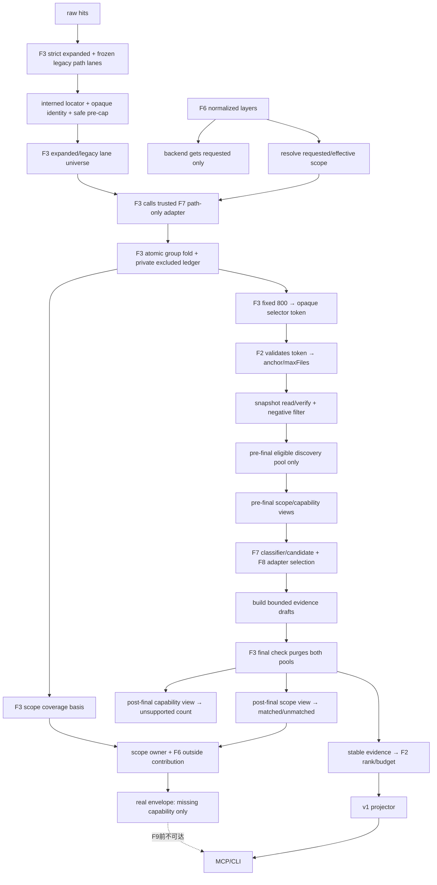

# repository-scope-policy feature design

## 0. 术语约定

| 术语 | 定义 | 边界 |
|---|---|---|
| scope locator | F3 discriminated expanded factory从backend-native或request-anchor-posix raw value签发的interned `DiscoveryLocatorRefV2` | F7不创建第二ref；legacy normalization仅在独立V1 adapter，不回填expanded |
| comparison path | scope locator私有POSIX value仅为policy比较生成的ASCII lowercase视图 | 不做NFKC、trim、`posix.normalize`或locale lowercase |
| requested scope | caller显式layers去重并按`REPO_LAYERS`枚举顺序排列；省略/空均为`[]` | 不保留重复或输入排列差异 |
| effective scope | requested非空时与其相同；否则固定`client,server,db,config,unknown` | 默认排除test/docs |
| scope decision | 单一policy对一个safe locator产生的layer、included、confirmation mode与reason | confirmed/candidate/selector/F8共同消费 |
| candidate-only | 显式请求test/docs后允许检索和候选，但禁止confirmed及semantic promotion | 不是“低confidence confirmed” |
| scope observation | F3对canonical expanded/legacy lane universe的unique locator直接调用trusted F7 path-only callback、验证并fan-out后签发的opaque token | caller没有裸decisions；F7不能签token，F2不能从脱敏file重算 |
| scope discovery identity | F3 private file-anchor/range/line/symbol metadata对应的无payload identity ref | 每identity exact一个interned locator ref；backend/source/origin不参与且不向consumer暴露 |
| scope-safe group fold | F3对expanded pre-cap public-safe完整等价组执行的原子eligibility裁决与proof | group整体进或不进selector；fold先于fixed 800与F2 `maxFiles` |
| pre-final scope view | observation + fold eligible subset + exact selection + verified record + execution绑定的classification view | 驱动classifier/candidate/F8 adapter，不声明coverage count |
| stable eligible discovery | scope included、read/verification成功、经过negative/merge/dedupe与final snapshot purge的唯一discovery record | 与可否分类成evidence、最终evidence budget是否保留无关 |
| matched layer | effective layer至少存在一个stable eligible discovery record | classification undefined仍matched；与最终evidence budget无关 |
| scope owner | F7提供的`ScopeCoverage` fragment | F8完成前shadow仍不能finalize完整v2 |

## 1. 决策与约束

### 需求摘要

本feature把当前散落在`direct-mapping-classifier.ts`中的layer判断升级为唯一
`RepositoryScopePolicyV1`。policy只读取F3验证的path-only view，并按固定冲突优先级分类；
同一scope observation通过pre-final views服务classification/candidate/F8 adapter，再通过
post-final views服务matched/unmatched与F8 unsupported count；F2只消费F3 fold后的opaque
selector token。F7同时产出真实`scope` owner
fragment，并通过F6的typed contribution seam提供`OUTSIDE_LAYER_HINT`，不自行构造
`request-outcome`。

成功标准：

1. F3 strict expanded factory在任何lossy normalize前验证discriminated source/flavor并拒绝drive-relative/absolute/UNC/device；仅Windows backend native反斜杠转`/`，Linux/darwin native backslash与caller POSIX backslash拒绝；legacy独立保持旧结果，policy仅ASCII lowercase。
2. layer冲突严格为`test > docs > longest explicit prefix > leftmost ordinary segment > unknown`。
3. 默认scope固定包含`client/server/db/config/unknown`并排除test/docs；显式layers去重并按枚举顺序输出。
4. 显式test/docs可被selector保留，但direct mapping、symbol definition及derived semantic结果都只能candidate。
5. F3在fixed 800、F2 `maxFiles`和anchor reservation前完成同一scope observation与safe-group fold并签opaque selector token；F2不得接收caller eligibility或从public-safe file重算。
6. negative filter、candidate policy、classification和F8 adapter selection只消费pre-final scope-included records；excluded record不进入任何evidence budget。
7. `unmatchedLayers`与F8 unsupported count基于final snapshot check后的post-final `TrustedStableEligibleDiscoveryPoolV2`，在evidence budget前计算；不得使用pre-final或F2 evidence pool替代。
8. `OUTSIDE_LAYER_HINT`严格等于F3 fold proof中globally unique excluded opaque identity ledger条目数；scope exclusion优先发生于所有expanded cap，不因多个backend或safe-key collision重复计数。
9. scope fragment、scope contribution、fold proof与stable eligible discovery pool由同一snapshot/execution proof绑定；clone、cross-execution、pool substitution或重算差异fail closed。
10. F7完成后真实shadow拥有scope fragment并且只缺capability；production locate仍使用v1 projector。
11. mixed safe-key等价组按fail-closed truth table整组排除；只有真实excluded members计outside，included但因group ambiguity丢弃的members只记safe-collision/incomplete。

### 明确不做

- 不支持用户自定义prefix/segment配置、glob、ignore文件或动态policy version。
- 不把scope当ACL或security boundary；repository root/handle/path safety仍由RepositoryReader拥有。
- 不根据question、excerpt内容、Git状态、语言或backend来源推断layer。
- 不允许backend用自有近似layer过滤造成false negative；backend planner只能把layers视为完整性提示，authoritative decision在共享policy。
- 不在F7实现language extension识别、fallback adapter或unsupported count；这些属于F8。
- 不改变F2 ranking tier、F3 snapshot identity、F5 process outcome或F6 status truth table。
- 不在F9前注册v2 MCP/CLI transport，不用空capability假装完整shadow。
- 不新增第三方依赖。

### 方案深度 pre-pass

| 候选 | 结论 | 原因 |
|---|---|---|
| 继续在classifier内补更多`if` | 拒绝 | selector、candidate与F8会继续各自重算并漂移 |
| 让CodeGraph/ripgrep按各自glob过滤 | 拒绝 | 两个backend表达能力不同，可能在authoritative policy前丢失合法hit |
| 依据public-safe file重新分类 | 拒绝 | redaction可能改变segment，且会把raw locator泄漏风险带入排序层 |
| pure policy + F3私有observation + typed proof | 采用 | 一次分类可跨阶段复用，边界可被hostile mutation验证 |

### 复杂度档位

- Correctness：有限prefix/segment表、固定priority与canonical array规则。
- Determinism：ASCII-only comparison、enum-order输出、unique-record计数与permutation hash。
- Security：policy只接收safe relative locator；不输出root/raw path，不把scope包装成授权控制。
- Compatibility：既有已覆盖路径保持deep-exact；新增prefix/nested/doc/e2e冲突按已确认roadmap contract改变。
- Performance：每个唯一locator至多一次O(path segments)决策；不得在每个ranking comparator中重算。

### 关键决策

1. **F3-owned discriminated raw locator与legacy lane**：F7 policy不接受string且不声明locator type。backend raw path只能调用F3 `{source:'backend',backend,pathFlavor:'native',rawPath}` factory，request file anchor只能用`{source:'request-anchor',pathFlavor:'posix',rawPath}`；非法source/flavor组合在类型层不存在。factory在任何separator转换前拒绝NUL、POSIX/drive/UNC/device absolute与所有`^[A-Za-z]:` drive-relative forms；Windows native才把`\`转`/`，非Windows native与request POSIX backslash拒绝，再拒绝empty/dot/dotdot/trailing/duplicate segments且不normalize。同raw value另交独立`LegacyBackendPathAdapterV1`执行冻结旧`replaceAll + posix.normalize`；expanded rejection只使expanded empty/incomplete，不改legacy normalize/skip/hit。F7只消费F3验证后的path-only view，任意string、clone或cross-execution ref在policy读取前拒绝。
2. **comparison view**：F3 private accessor仅在验证locator/execution后把exact POSIX segments交给F7 adapter；policy只逐code unit把ASCII`A..Z`映射到`a..z`，不调用`toLowerCase`、`toLocaleLowerCase`、NFKC、trim、separator replacement或`posix.normalize`。comparison结束后不回写locator。Windows/POSIX等价性由raw parser integration证明，不允许绕过F3 accessor直接喂policy。
3. **test规则**：任一segment精确命中`test|tests|__tests__|spec|specs|fixtures|__fixtures__|e2e`，或basename包含`.spec.`/`.test.`即为test；该规则先于所有docs/production规则。
4. **docs规则**：任一segment精确命中`doc|docs|documentation|examples`，或basename extension为`.md|.mdx|.rst|.adoc`即为docs；因此根`README.md`为docs，但`mydocs/a.ts`不是。
5. **explicit prefix规则**：只从repository root开始匹配segment vector；候选为`apps/web|packages/frontend|src/client→client`、`apps/api|packages/backend|src/server→server`、`db|database|migrations→db`、`.config|config|configs→config`。选择最长vector；初始化时若相同vector或同长度同path产生冲突mapping，policy构造直接失败。
6. **ordinary segment规则**：prefix未命中时从root向basename逐segment扫描，首个精确命中的`client|frontend|web|ui→client`、`server|backend|api→server`、`db|database|migration|migrations→db`、`config|configs→config`获胜。例如`packages/foo/server/client/a.ts→server`。
7. **request scope canonicalization**：raw layers已由F6 schema验证为enum；F7按`REPO_LAYERS`顺序去重。省略或空得到`requested=[]`和固定default effective；非空得到`effective=requested`。coverage三组array都按同一enum order。
8. **decision语义**：`included=effective.includes(layer)`；included test/docs为`confirmation='candidate-only'`，included production/unknown为`confirmation='allowed'`，excluded为`confirmation='excluded'`。candidate-only是所有classifier/adapter的hard ceiling。
9. **F3 registrar是唯一trust authority且直接调用adapter**：F7 pure callback只接收F3 `VerifiedScopePolicyPathViewV2 {posixSegments,basename}`与exact resolved scope，看不到identity/ref/symbol。F7通过F3 `registerTrustedScopePolicyAdapterV2('repo-scope-v1', callback, execution)`取得无own-property adapter token；temporary adapter也走同一factory。frozen legacy selector先签完整selected-set proof，F3逐ordinal生成policy-only receipts并seal trusted pool；F3把expanded pre-cap opaque identities与该pool登记为带lane membership的`CanonicalScopeDecisionUniverseV2`，而不是接收caller裸locator数组。registrar按unique interned locator直接调用exact callback一次、验证decision并向private opaque identities fan-out；legacy-only ref永不回填expanded。adapter/universe/pool/receipt token clone、callback swap、selected membership增删、scope或execution swap在任何consumer读取前拒绝。
10. **F3-owned safe-key group fold真值表**：F3 `scopeFoldSafeCandidatePoolV2(preCapPool,observation,execution)`先验证decision 9的exact universe绑定，再按完整safe-key group产出opaque `TrustedScopeFoldedSafePoolV2`与globally unique excluded ledger；F3随后以唯一executor constant 800签发`TrustedScopeFoldedSelectorViewV2`，F2只接收该token并通过验证型accessor读facts：

   | group decisions | selector | outside count | collision/completeness | matched/unmatched |
   |---|---|---:|---|---|
   | 全部included且confirmation相同 | 整组原子保留；容量不足仍按F2整组deferred | 0 | 只保留既有safe-key collision/容量truth | stable后每record按自身layer计matched |
   | 任一excluded，且其余均excluded | 整组在anchor/file budget前排除 | unique excluded identities数 | 所有关联anchor incomplete→`BUDGET_EXCEEDED` | 无stable record，不matched |
   | included与excluded混合 | 整组排除 | 只计unique excluded identities；included members不冒充outside | 强制`safeSelectionCollision=true`，所有关联anchor incomplete→`BUDGET_EXCEEDED` | 全组不进入stable eligible pool |
   | 全部included但`allowed/candidate-only`混合 | 整组排除 | 0 | 强制collision/incomplete，所有关联anchor→`BUDGET_EXCEEDED` | 全组不进入stable eligible pool |

   group内排列、backend arrival、raw locator、origin和discovery key不得改变fold；fold先于F3 fixed 800，F2 `maxFiles`只在opaque selector accessor结果上执行。excluded group不占reservation/file/evidence budget，matched/unmatched只看后续stable eligible discovery records。fold proof绑定original pre-cap pool、universe、全部group、eligible subset、excluded ledger、collision/completeness、resolved scope与execution；F3 selection binder只接受exact selector token与该proof。
11. **backend requested/effective边界**：backend planner继续只接收normalized `requested` layers；missing/empty传`[]`，因此保持当前CodeGraph默认规划。`effective`只进入F7 authoritative policy与一个`authoritative:false`的private completeness hint，不传给backend过滤器。显式nonempty requested继续使CodeGraph planner按既有unsupported-dimension规则决定fallback；任何backend不得删除hit或声称scope-complete。
12. **pre-read opaque identity、unique locator decision与计数**：F3 private WeakMap保存file-anchor/range/line/symbol semantic identity，consumer只见无payload identity ref；同execution逐code-unit相同POSIX locator跨backend/occurrenceintern为exact同一`DiscoveryLocatorRefV2`，每个identity private record绑定exact一个locator ref。scope policy按unique locator决策一次再fan-out到identities，backend/source/reason/arrival不参与identity或决策。F7 `outsideLayerHintCount`只读取F3 fold proof的globally unique excluded opaque identity ledger并计一次；safe-key mixed group中的included identity只记collision/incomplete，不进outside。negative-term按F3 contract计且不进stable eligible pool；成功read后的canonical bucket合并不回写pre-read outside count。
13. **pre-final direct classifier seam**：verification后、final check前，classifier只能从F3 `requirePreFinalScopeClassificationViewV2(pool,observation,foldedPool,boundSelection,execution)`取得绑定fold eligible subset + exact selection + verified record + execution的decision；不要求尚未存在的snapshot proof。candidate-only时所有原本confirmed分支在producer处输出candidate并复用冻结reason/promotion/role/symbol真值表，不得先confirmed再DTO降级。只看observation而未验证fold/selection的accessor非法，mixed group included member不能重新进入。
14. **pre-final candidate/F8 seam与双池边界**：candidate policy与F8 adapter选择同样只用pre-final narrow views；default test/docs不参与，显式test/docs受candidate-only ceiling。F3维护`PreFinalEligibleDiscoveryPoolV2`与evidence draft pool，negative/merge/dedupe/final check同步purge；classification undefined只留eligible池。pre-final view可以决定classifier/candidate/language adapter，但不能声明matched或unsupported count。
15. **post-final matched/unmatched算法**：final snapshot purge后、F2 evidence budget前，只从F3 `requireStableEligibleScopeViewV2(eligiblePool,snapshotProof,foldProof,execution)`取得绑定stable pool + opaque snapshot proof + fold proof的post-final view，按每个unique record trusted layer建立matched set；classification undefined仍算matched。`unmatched=effective-matched`按enum order输出。post-final view不得驱动classifier/candidate/F8 adapter选择；F2 evidence pool、ranking arrays与public evidence不是合法输入。
16. **scope owner fragment与F3 narrow coverage authority**：
    `buildScopeCoverageV1(eligiblePool,snapshotProof,foldProof,coverageBasis,resolvedScope,execution)`
    先通过F3 `requireStableEligibleScopeViewV2`取得same-proof eligible records，再调用F3
    `requireScopeCoverageBasisV2(coverageBasis,eligiblePool,snapshotProof,foldProof,execution)`取得唯一
    可见标量`outsideLayerHintCount`；F7不得读取fold excluded ledger、identity array或接受caller count。
    builder返回opaque `ScopeCoverageFactsV1` token，private record内含strict fragment、F7-owned strict
    `ScopeOutcomeContributionV2 {owner:'scope',outsideLayerHintCount}`与opaque
    `ScopeCoverageProofV1`。matched/unmatched来自stable eligible pool。
    `requireScopeCoverageFactsV1`与
    `requireScopeOutcomeContributionV2(contribution,proof,expectedEligiblePool,
    expectedSnapshotProof,expectedFoldProof,expectedCoverageBasis,expectedResolvedScope,
    expectedExecution)`是唯一读口；按execution→proof/pool/basis→stable membership/matched→F3
    coverage basis/outside→strict schema固定顺序验证，任一失败统一为无detail的
    `SCOPE_COVERAGE_INVARIANT`→canonical `INTERNAL_ERROR`。fragment、contribution、coverage/fold/
    eligible/snapshot proofs、matched set、resolved scope与execution都在private registry绑定；F6只
    调用F7 accessor，F7不得写request-outcome。F7 child revision必须原子把F6
    `RequestOutcomeAggregationInputV2.contributions`从F1+F3双tuple改为exact
    `[PublicMaterializationContributionV2, SnapshotOutcomeContributionV2,
    ScopeOutcomeContributionV2]`；scope固定index 2。required owner set、canonical order和三个
    owner accessor都由compile/runtime inventory验证；missing/extra/duplicate/reorder、clone、
    cross-execution或source proof swap在读取值前拒绝。当前revision没有index 3、capability
    owner type/accessor/fixture/case/check/artifact/import；该slot只能由后续child revision原子增加。
17. **proof与finalizer及missing-first测试**：F1C finalizer验证scope proof与opaque snapshot/ranking/fold proofs同execution、requested与normalized layers一致、unmatched由post-final eligible view重算相等、所有retained evidence属于同proof evidence pool且有pre-final included decision、confirmed均非candidate-only。用post-final view驱动classifier、pre-final view宣称matched、evidence pool冒充eligible pool、excluded ledger删项或proof clone/cross-execution一律拒绝。real F7 envelope仍先返回`missing-owner(capability)`；synthetic capability只用于完整hostile envelope。
18. **F8双生命周期seam与exact decision ABI**：adapter选择阶段F8只能调用F3
    `requirePreFinalCapabilityViewV2(...)`并通过F7 exact函数
    `requirePreFinalScopeDecisionV1(scopeView,eligibleRef,execution)`确认included/confirmation；
    unsupported count阶段只能调用post-final `requireStableEligibleCapabilityViewV2(...)`与
    `requireStableScopeDecisionV1(scopeView,eligibleRef,snapshotProof,execution)`；legacy唯一入口为
    `requireLegacyScopeDecisionV1(scopeView,locatorRef,execution)`。F7不再暴露可替换的宽
    `ScopeDecisionAccessorV1`对象。两个view共享exact observation/fold decision但生命周期与职责不同；
    F8不能用evidence pool/scope fragment、复制path policy或从post-final重新分类。任一view/pool/proof
    clone/cross-execution时fail closed。
19. **expanded-v2 / legacy-v1 lane matrix**：

   | phase | expanded-v2 | legacy-v1 |
   |---|---|---|
   | backend request | `requested` layers；missing/empty为`[]` | exact同一request与旧fallback裁决 |
   | pre-read selection | canonical universe中expanded subset经F3 direct adapter registrar与fold，fixed 800先于F2 anchor/`maxFiles` | frozen selector proof→policy-only receipt/pool进入universe；保持旧selector/budget/arrival-sort，不回填expanded |
   | post-read classification | 消费绑定fold/selection/verified record的pre-final decision与candidate-only ceiling | 通过legacy subset accessor消费同一locator policy decision；既有top-level mappings deep-exact，新增prefix/nested/doc/e2e为approved delta |
   | owner/count | F7 scope fragment/outside contribution | 不生成v2 owner/count；legacy coverage沿旧投影 |

   `maxFiles=1`且默认excluded docs先到、in-scope server后到的case必须证明expanded选择server而legacy保持旧结果。v1 projector不运行第二套mapping helper，但保留独立legacy selection lane；schema仍1.0。
20. **shadow/no-cutover**：真实service envelope新增`scope`后required-owner inventory仅缺`capability`；F1C finalizer仍返回missing-owner且strict serializer调用零次。production service/MCP/CLI仍只能选择v1 projector。
21. **有界确定性**：最大backend hit set上每个unique locator只决策一次；五种input/backend permutation产生相同scope fragment、outside count、selected opaque refs和public v1 hash。
22. **复用F4唯一platform registry且不反向阻塞F4 base**：F4 base只验收其base IDs与`TEST-EXT-001` synthetic extension protocol，不要求F7文件、ID或marker。F7 implementation在F4 acceptance后于本feature同一revision原子扩展`PlatformContractIdV1` union并增加exact `PlatformCaseBindingV1`：
    `{contractId:'F7-SCOPE-001', surface:'unit', group:'repository-scope-policy', executableCaseId:'platform-path-flavor-and-priority', applicableOs:['linux','win32','darwin'], requiredAssertionIds:['backend-native-path-flavor','scope-priority','caller-backslash-rejected','drive-relative-rejected'], fixture:'testkit/fixtures/scope-v1/path-source-matrix-v1.ts', assertionOwner:'test/unit/scope-policy-platform.spec.ts'}`。
    `backend-native-path-flavor`的逐OS真值固定为Windows接受`a\b`并得到`a/b`，Linux/darwin拒绝；backend/request POSIX `a/b`三OS接受，caller backslash与`C:foo|C:|C:/foo|UNC/device`三OS拒绝。unit owner位于Vitest include可达路径，不创建`test/platform`或第四surface。F4 self-test覆盖删除binding/assertion、漏`fixture`/`assertionOwner`、wrong-path/zero-marker、错tuple、未扩展union与缩小OS集合。
23. **record-local complete port set与单一cross-port arbitration**：F7 composition root先创建
    execution-scoped `ScopeBoundProducerRegistrarV2`并登记direct-classifier与candidate-collector两个
    base ports。每个registered port对每个pre-final record必须恰好登记一个owner-signed source
    resolution；合法无facts也登记signed `none`，漏项、重复项、wrong owner或forged source均不能seal。
    `sealScopeBoundProducerRecordSetV2`只从registrar private registry读取当时全部registered ports及其
    results，不接caller数组，并永久关闭该record set；seal后late port/source失败。唯一
    `arbitrateScopeBoundEvidenceProducerV2`先对每个facts resolution调用F3
    `requireScopeBoundProducerBasisV2`，再按
    `direct-anchored → direct-term → anchored-definition → anchored-reference → verified-literal →
    secondary → derived-neighbor → none`选择一次；同kind tie固定
    `direct-classifier → language-adapter → candidate-collector`。输出只有opaque
    `ScopeBoundProducerArbitrationV2`；`materializeScopeBoundEvidenceV2`只接受该arbitration token，
    不再接受port facts。derived facts必须使用F3
    `DerivedEvidenceProposalRefV2 → requirePreFinalDerivedProducerBasisReceiptsV2`签出的
    proposal-specific receipt bundle，location/provenance来自proposal而非seed record。F8 revision只
    能使用F7-issued `ScopeBoundProducerChildPortAdmissionV2`与neutral
    `ScopeBoundProducerChildResolverV2`登记language owner，不能修改precedence或另建registrar。
24. **实现准入**：implementation等待F6 acceptance done；并在F3/F2/F6 acceptance后核对actual
    trusted接口与本设计exact一致，任一签名/proof/ordering漂移必须重跑F7独立design review。必须
    复用F3 trust domain、F2 selector seam、已验收F4 base extension protocol和F6 contribution owner，
    不得创建平行locator/proof/platform registry或coverage mapper。F7 acceptance只要求两个F7-owned
    producer ports与neutral child admission/resolver protocol；F8 language port属于后续F8 revision，
    不得作为F7 admission或DoD依赖。

candidate-only producer真值源冻结为下表；F7 base的两个registered producer先把owner-signed
source登记到record-local registrar，完整port set seal后由唯一arbitrator产生opaque
`ScopeBoundProducerArbitrationV2`，再由只接受该token的
`materializeScopeBoundEvidenceV2`按此表materialize，不能自建downgrade mapper：

| producer facts | `allowed` | `candidate-only` |
|---|---|---|
| direct mapping + anchored symbol | confirmed / `value-mapping` / `DIRECT_ALIAS_MAPPING,EXACT_TERM_MATCH` / 无promotion / canonical symbol沿现有first规则 | candidate / `reference` / `SYMBOL_REFERENCE_ONLY` / `DIRECT_REFERENCE_REQUIRED,CALL_PATH_REQUIRED` / exact anchored symbol |
| direct mapping + matched term、无anchored symbol | confirmed / `value-mapping` / `DIRECT_ALIAS_MAPPING,EXACT_TERM_MATCH` / 无promotion / 现有canonical symbol optional | candidate / `reference` / `EXACT_TERM_WITHOUT_DIRECT_MAPPING` / `USER_SEMANTIC_CONFIRMATION,DIRECT_REFERENCE_REQUIRED` / 不新增symbol |
| anchored definition或execution、无direct mapping | confirmed / exact detected role / `EXACT_SYMBOL_ANCHOR` / 无promotion / exact symbol | candidate / `reference` / `SYMBOL_REFERENCE_ONLY` / `DIRECT_REFERENCE_REQUIRED,CALL_PATH_REQUIRED` / exact symbol |
| anchored symbol reference only、无direct mapping/definition/execution | candidate / `reference` / `SYMBOL_REFERENCE_ONLY` / `DIRECT_REFERENCE_REQUIRED,CALL_PATH_REQUIRED` / exact primary anchored symbol | 完全相同 |
| verified literal matched term only | candidate / `reference` / `EXACT_TERM_WITHOUT_DIRECT_MAPPING` / `USER_SEMANTIC_CONFIRMATION,DIRECT_REFERENCE_REQUIRED` | 完全相同 |
| secondary backend candidate only | candidate / `related` / exact `secondaryBackendCandidateReasons` / `DIRECT_REFERENCE_REQUIRED` | 完全相同 |
| derived neighbor | candidate / `related` / exact canonical nonempty subset of `ALIAS_SOURCE_NEIGHBOR,SAME_ENTITY_SIBLING,SAME_SCOPE_SIMILAR_IDENTIFIER` / `USER_SEMANTIC_CONFIRMATION,DIRECT_REFERENCE_REQUIRED` / exact verified token symbol | 完全相同 |
| 无上述facts | undefined | undefined |

producer selection是互斥的first-match state machine，优先级固定为
`direct mapping → anchored definition/execution or anchored reference → verified literal →
secondary backend → derived neighbor → none`；direct mapping内先选anchored symbol，再选matched
term。重叠坐标必须按下表选中唯一kind并抑制其余facts，不能为同一record物化两条：

| overlap input | selected kind | 必须抑制 |
|---|---|---|
| direct mapping + anchored symbol（可同时有term/secondary/derived） | `direct-anchored` | `direct-term`、全部anchor-only/literal/secondary/derived |
| direct mapping + matched term、无anchored symbol（可同时有secondary/derived） | `direct-term` | literal/secondary/derived |
| anchored definition/execution + matched literal（无direct） | `anchored-definition` | anchored-reference/literal/secondary/derived |
| anchored reference + matched literal（无direct/definition/execution） | `anchored-reference` | literal/secondary/derived |
| matched literal + secondary（无direct/anchor） | `verified-literal` | secondary/derived |
| secondary + derived（无direct/anchor/literal） | `secondary` | derived |
| 任一base semantic/candidate facts + derived | 上述最早base kind | `derived-neighbor` |
| 仅derived | `derived-neighbor` | none |
| 无任何合法facts | `none` | materializer调用 |

reason与promotion arrays继续使用现有canonical enum order；scope ceiling不能添加
`SCOPE_*` public reason、改role、伪造symbol或把SQL/JS/TS分支映射成新的输出shape。

### Top 3 风险与缓解

| 风险 | 缓解 |
|---|---|
| selector按safe file、classifier按raw file导致scope漂移 | F3一次scope observation + F2/F7/F8 trusted accessor |
| default排除项先占满maxFiles造成合法结果缺失 | scope等价类在anchor reservation/file budget前剔除 |
| test/docs在后续semantic adapter被重新提升 | candidate-only hard ceiling进入shared observation并由finalizer反查 |

### 非显然依赖与基线风险

- 当前`resolveRepositoryLayer`使用`posix.normalize`、locale-insensitive普通lowercase，仅识别top-level production layer，缺少`doc/e2e`和prefix/nested规则。
- 当前classifier在verification后才过滤scope，backend selection可能先让excluded路径占用`maxFiles`；F7必须把可信decision前移到F2/F3 seam。
- 当前CodeGraph planner把非空requested layers标为unsupported dimension，并未自行实现authoritative过滤；missing/empty必须继续传`[]`而非default effective，保留既有fallback行为。
- F6必须先提供真实request scope和typed contribution seam；F8依赖F7 observation，不能反向复制path rules。

### 必跑验证、交付物与清洁度

- policy：ASCII/non-ASCII case、separator、basename、extension、segment、prefix、priority和unknown truth table。
- request：missing/empty/duplicate/permutation layers与canonical requested/effective/unmatched arrays。
- integration：selector-before-budget、anchor、classifier、candidate policy、snapshot purge、F8 accessor contract。
- trust：forged/clone/cross-execution observation、fragment swap、retained out-of-scope/confirmed candidate-only。
- compatibility：v1 existing Golden deep-exact + intentional policy delta，real envelope仅缺capability，no-cutover。
- platform：`F7-SCOPE-001`按decision 22 exact tuple加入F4唯一registry；Windows native backend path与POSIX path产生相同decision，POSIX literal backslash及F6 caller backslash拒绝，删除binding/assertion mutation失败。

## 2. 名词与编排

### 2.1 名词层

#### 现状

- `resolveRepositoryLayer(file)`位于direct classifier，内部直接normalizes string。
- selector与candidate policy没有共享scope object；classifier使用raw`context.layers`重复判断。
- v2 schema已经声明`ScopeCoverage`，但真实canonical envelope没有scope owner。
- F8所需unsupported count还没有可信scope eligibility输入。

#### 变化

```ts
type ScopeConfirmationModeV1 = 'allowed' | 'candidate-only' | 'excluded';

interface ResolvedRepositoryScopeV1 {
  readonly requested: readonly RepoLayer[];
  readonly effective: readonly RepoLayer[];
  readonly policyVersion: 'repo-scope-v1';
}

interface RepositoryScopeDecisionV1 {
  readonly layer: RepoLayer;
  readonly included: boolean;
  readonly confirmation: ScopeConfirmationModeV1;
  readonly rule:
    | 'test-segment'
    | 'test-basename'
    | 'docs-segment'
    | 'docs-extension'
    | 'explicit-prefix'
    | 'ordinary-segment'
    | 'unknown';
}

interface RepositoryScopePolicyV1 {
  decide(
    path: VerifiedScopePolicyPathViewV2,
    scope: ResolvedRepositoryScopeV1,
  ): RepositoryScopeDecisionV1;
}

function createTrustedRepositoryScopePolicyAdapterV1(
  policy: RepositoryScopePolicyV1,
  execution: LocateExecutionTokenV2,
): TrustedScopePolicyAdapterV2;

function requirePreFinalScopeDecisionV1(
  scopeView: TrustedPreFinalScopeClassificationViewV2,
  record: EligibleDiscoveryRefV2,
  execution: LocateExecutionTokenV2,
): ScopeEligibilityDecisionV2;

function requireLegacyScopeDecisionV1(
  scopeView: TrustedLegacyScopeClassificationViewV2,
  locatorRef: DiscoveryLocatorRefV2,
  execution: LocateExecutionTokenV2,
): ScopeEligibilityDecisionV2;

function requireStableScopeDecisionV1(
  scopeView: TrustedStableEligibleScopeViewV2,
  record: EligibleDiscoveryRefV2,
  snapshotProof: SnapshotTrustProofV2,
  execution: LocateExecutionTokenV2,
): ScopeEligibilityDecisionV2;

type ScopeBoundProducerOwnerV2 =
  | 'direct-classifier'
  | 'candidate-collector'
  | 'language-adapter';

type ScopeBoundProducerKindV2 =
  | 'direct-anchored'
  | 'direct-term'
  | 'anchored-definition'
  | 'anchored-reference'
  | 'verified-literal'
  | 'secondary'
  | 'derived-neighbor';

interface ScopeBoundProducerCanonicalViewV2 {
  readonly owner: ScopeBoundProducerOwnerV2;
  readonly producerKind: ScopeBoundProducerKindV2;
  readonly record: EligibleDiscoveryRefV2;
  readonly location: UnsafeEvidenceLocationV2;
  readonly provenance: EvidenceProvenance;
  readonly matchedTermPresent: boolean;
  readonly anchoredSymbol?: string;
  readonly canonicalSymbol?: string;
  readonly definitionRole?: 'definition' | 'execution-site';
  readonly derivedReasonCodes?: readonly (
    | 'ALIAS_SOURCE_NEIGHBOR'
    | 'SAME_ENTITY_SIBLING'
    | 'SAME_SCOPE_SIMILAR_IDENTIFIER'
  )[];
}

interface ScopeBoundProducerPortFactsViewV2 {
  readonly owner: ScopeBoundProducerOwnerV2;
  readonly producerKind: ScopeBoundProducerKindV2;
  readonly producerBasis: VerifiedProducerBasisReceiptsV2;
  readonly definitionRole?: 'definition' | 'execution-site';
  readonly derivedReasonCodes?: readonly (
    | 'ALIAS_SOURCE_NEIGHBOR'
    | 'SAME_ENTITY_SIBLING'
    | 'SAME_SCOPE_SIMILAR_IDENTIFIER'
  )[];
}

type ScopeBoundProducerPortResolutionV2 =
  | Readonly<{ kind: 'facts'; view: ScopeBoundProducerPortFactsViewV2 }>
  | Readonly<{ kind: 'none' }>;

declare const SCOPE_BOUND_PRODUCER_REGISTRAR_V2: unique symbol;
type ScopeBoundProducerRegistrarV2 = Readonly<object> & {
  readonly [SCOPE_BOUND_PRODUCER_REGISTRAR_V2]: never;
};

declare const SCOPE_BOUND_PRODUCER_CHILD_PORT_ADMISSION_V2: unique symbol;
type ScopeBoundProducerChildPortAdmissionV2 = Readonly<object> & {
  readonly [SCOPE_BOUND_PRODUCER_CHILD_PORT_ADMISSION_V2]: never;
};

type ScopeBoundProducerChildOwnerV2 = 'language-adapter';

interface ScopeBoundProducerChildResolverV2 {
  readonly owner: ScopeBoundProducerChildOwnerV2;
  resolve(
    source: unknown,
    scopeView: TrustedPreFinalScopeClassificationViewV2,
    record: EligibleDiscoveryRefV2,
    execution: LocateExecutionTokenV2,
  ): ScopeBoundProducerPortResolutionV2;
}

declare const REGISTERED_SCOPE_BOUND_PRODUCER_PORT_V2: unique symbol;
type RegisteredScopeBoundProducerPortV2 = Readonly<object> & {
  readonly [REGISTERED_SCOPE_BOUND_PRODUCER_PORT_V2]: never;
};

declare const SCOPE_BOUND_PRODUCER_SOURCE_RECEIPT_V2: unique symbol;
type ScopeBoundProducerSourceReceiptV2 = Readonly<object> & {
  readonly [SCOPE_BOUND_PRODUCER_SOURCE_RECEIPT_V2]: never;
};

declare const SCOPE_BOUND_PRODUCER_RECORD_SET_SEAL_V2: unique symbol;
type ScopeBoundProducerRecordSetSealV2 = Readonly<object> & {
  readonly [SCOPE_BOUND_PRODUCER_RECORD_SET_SEAL_V2]: never;
};

declare const SCOPE_BOUND_PRODUCER_ARBITRATION_V2: unique symbol;
type ScopeBoundProducerArbitrationV2 = Readonly<object> & {
  readonly [SCOPE_BOUND_PRODUCER_ARBITRATION_V2]: never;
};

type ScopeBoundProducerArbitrationViewV2 =
  | Readonly<{
      kind: 'facts';
      owner: ScopeBoundProducerOwnerV2;
      producerKind: ScopeBoundProducerKindV2;
    }>
  | Readonly<{ kind: 'none' }>;

function createScopeBoundProducerRegistrarV2(
  execution: LocateExecutionTokenV2,
): ScopeBoundProducerRegistrarV2;

function createDirectClassifierScopeProducerPortV2(
  registrar: ScopeBoundProducerRegistrarV2,
  execution: LocateExecutionTokenV2,
): RegisteredScopeBoundProducerPortV2;

function createCandidateCollectorScopeProducerPortV2(
  registrar: ScopeBoundProducerRegistrarV2,
  execution: LocateExecutionTokenV2,
): RegisteredScopeBoundProducerPortV2;

function issueScopeBoundProducerChildPortAdmissionV2(
  registrar: ScopeBoundProducerRegistrarV2,
  owner: ScopeBoundProducerChildOwnerV2,
  execution: LocateExecutionTokenV2,
): ScopeBoundProducerChildPortAdmissionV2;

function registerScopeBoundProducerChildPortV2(
  registrar: ScopeBoundProducerRegistrarV2,
  admission: ScopeBoundProducerChildPortAdmissionV2,
  resolver: ScopeBoundProducerChildResolverV2,
  execution: LocateExecutionTokenV2,
): RegisteredScopeBoundProducerPortV2;

function registerScopeBoundProducerSourceV2(
  registrar: ScopeBoundProducerRegistrarV2,
  source: unknown,
  producerPort: RegisteredScopeBoundProducerPortV2,
  scopeView: TrustedPreFinalScopeClassificationViewV2,
  record: EligibleDiscoveryRefV2,
  execution: LocateExecutionTokenV2,
): ScopeBoundProducerSourceReceiptV2;

function sealScopeBoundProducerRecordSetV2(
  registrar: ScopeBoundProducerRegistrarV2,
  scopeView: TrustedPreFinalScopeClassificationViewV2,
  record: EligibleDiscoveryRefV2,
  execution: LocateExecutionTokenV2,
): ScopeBoundProducerRecordSetSealV2;

function arbitrateScopeBoundEvidenceProducerV2(
  seal: ScopeBoundProducerRecordSetSealV2,
  scopeView: TrustedPreFinalScopeClassificationViewV2,
  record: EligibleDiscoveryRefV2,
  execution: LocateExecutionTokenV2,
): ScopeBoundProducerArbitrationV2;

function requireScopeBoundProducerArbitrationV2(
  arbitration: ScopeBoundProducerArbitrationV2,
  scopeView: TrustedPreFinalScopeClassificationViewV2,
  record: EligibleDiscoveryRefV2,
  execution: LocateExecutionTokenV2,
): ScopeBoundProducerArbitrationViewV2;

function materializeScopeBoundEvidenceV2(
  arbitration: ScopeBoundProducerArbitrationV2,
  scopeView: TrustedPreFinalScopeClassificationViewV2,
  record: EligibleDiscoveryRefV2,
  execution: LocateExecutionTokenV2,
): UnsafeEvidenceDraftV2 | undefined;

type DeepReadonlyScopeV1<T> =
  T extends readonly unknown[]
    ? { readonly [K in keyof T]: DeepReadonlyScopeV1<T[K]> }
    : T extends object
      ? { readonly [K in keyof T]: DeepReadonlyScopeV1<T[K]> }
      : T;

const ScopeOutcomeContributionV2Schema = z.object({
  owner: z.literal('scope'),
  outsideLayerHintCount: z.number().int().nonnegative().max(Number.MAX_SAFE_INTEGER),
}).strict();

type ScopeOutcomeContributionV2 = DeepReadonlyScopeV1<
  z.output<typeof ScopeOutcomeContributionV2Schema>
>;

const REQUEST_OUTCOME_CONTRIBUTION_OWNER_ORDER_V2 = [
  'public-materialization',
  'snapshot-observation',
  'scope',
] as const;

type RequestOutcomeAggregationContributionTupleV2 = readonly [
  PublicMaterializationContributionV2,
  SnapshotOutcomeContributionV2,
  ScopeOutcomeContributionV2,
];

declare const SCOPE_COVERAGE_PROOF_V1: unique symbol;
type ScopeCoverageProofV1 = Readonly<object> & {
  readonly [SCOPE_COVERAGE_PROOF_V1]: never;
};

declare const SCOPE_COVERAGE_FACTS_V1: unique symbol;
type ScopeCoverageFactsV1 = Readonly<object> & {
  readonly [SCOPE_COVERAGE_FACTS_V1]: never;
};

interface ScopeCoverageFactsViewV1 {
  readonly fragment: Readonly<{
    owner: 'scope';
    value: ScopeCoverage;
  }>;
  readonly contribution: ScopeOutcomeContributionV2;
  readonly proof: ScopeCoverageProofV1;
}

function buildScopeCoverageV1(
  eligiblePool: TrustedStableEligibleDiscoveryPoolV2,
  snapshotProof: SnapshotTrustProofV2,
  foldProof: ScopeFoldedSafePoolProofV2,
  coverageBasis: ScopeCoverageBasisV2,
  resolvedScope: ResolvedRepositoryScopeV1,
  execution: LocateExecutionTokenV2,
): ScopeCoverageFactsV1;

function requireScopeCoverageFactsV1(
  facts: ScopeCoverageFactsV1,
  expectedEligiblePool: TrustedStableEligibleDiscoveryPoolV2,
  expectedSnapshotProof: SnapshotTrustProofV2,
  expectedFoldProof: ScopeFoldedSafePoolProofV2,
  expectedCoverageBasis: ScopeCoverageBasisV2,
  expectedResolvedScope: ResolvedRepositoryScopeV1,
  expectedExecution: LocateExecutionTokenV2,
): ScopeCoverageFactsViewV1;

function requireScopeOutcomeContributionV2(
  contribution: ScopeOutcomeContributionV2,
  proof: ScopeCoverageProofV1,
  expectedEligiblePool: TrustedStableEligibleDiscoveryPoolV2,
  expectedSnapshotProof: SnapshotTrustProofV2,
  expectedFoldProof: ScopeFoldedSafePoolProofV2,
  expectedCoverageBasis: ScopeCoverageBasisV2,
  expectedResolvedScope: ResolvedRepositoryScopeV1,
  expectedExecution: LocateExecutionTokenV2,
): ScopeOutcomeContributionV2;
```

F7 revision必须把F6 `RequestOutcomeAggregationInputV2.contributions`的property type替换为
`RequestOutcomeAggregationContributionTupleV2`，其余F6 input字段保持不变；不能把它实现成
optional tail、spread plugin list或caller-owned array。当前executable owner inventory固定为：

| Tuple index | Exact owner tag | Exact owner type | Exact owner accessor / proof |
|---:|---|---|---|
| `0` | `public-materialization` | `PublicMaterializationContributionV2` | F1 `requirePublicMaterializationContributionV2(..., expectedSourceProof, expectedExecution)` |
| `1` | `snapshot-observation` | `SnapshotOutcomeContributionV2` | F3 `requireSnapshotOutcomeContributionV2(..., expectedSnapshotProof, expectedExecution)` |
| `2` | `scope` | `ScopeOutcomeContributionV2` | F7 `requireScopeOutcomeContributionV2(..., expectedEligiblePool, expectedSnapshotProof, expectedFoldProof, expectedCoverageBasis, expectedResolvedScope, expectedExecution)` |

Non-executable forward ABI ledger：

| Future owner | Future index | Current F7 status |
|---|---:|---|
| capability owner | `3` after scope | `N/A-forward`; no current type, accessor, import, fixture, case, check, artifact or placeholder slot |

`DiscoveryLocatorRefV2`、opaque identity/universe、`TrustedScopePolicyAdapterV2`、
`TrustedScopeEligibilityObservationV2`、fold/selector proof、pre/post-final views、stable
eligible pool与snapshot proof全部由F3拥有；F7只type-import并通过F3 callback/accessor消费。
`createTrustedRepositoryScopePolicyAdapterV1`内部调用F3 registration，F7不能自己签adapter或
observation；pure policy只见`VerifiedScopePolicyPathViewV2`，看不到identity/ref/symbol。
pre-final accessor先验证fold/selection/verified membership，legacy accessor验证universe legacy
membership，stable accessor验证snapshot/fold/pool；三者均在读取decision前验证execution。scope
contribution schema/type/factory/accessor由F7独占并登记到private owner registry；
`buildScopeCoverageV1`返回无own-property facts token，只有
`requireScopeCoverageFactsV1`可暴露fragment/contribution/proof；F6只能type-import
`ScopeOutcomeContributionV2`并调用F7 `requireScopeOutcomeContributionV2`。两个accessor使用固定
验证顺序：token/proof registry与execution → exact eligible pool/snapshot/fold/coverage-basis/
resolved-scope identity → F3 stable-view membership与matched set → F3
`requireScopeCoverageBasisV2`返回的outside count → strict schema及fragment/contribution equality。
F7从不读取excluded ledger或接受caller count。任一步失败都抛同一个private
`SCOPE_COVERAGE_INVARIANT`并映射canonical fixed `INTERNAL_ERROR`，不返回部分值、path或差异detail。

F7 base composition root先调用`createScopeBoundProducerRegistrarV2(execution)`，再以exact registrar
登记F7-owned `createDirectClassifierScopeProducerPortV2(registrar,execution)`与
`createCandidateCollectorScopeProducerPortV2(registrar,execution)`。F8 acceptance后的单独revision
只能使用
`issueScopeBoundProducerChildPortAdmissionV2(registrar,'language-adapter',execution)`与
`registerScopeBoundProducerChildPortV2(registrar,admission,resolver,execution)`原子扩展同一
registrar；F7 base只定义neutral admission/resolver protocol，不实现、不登记也不要求language
resolver，两个版本不得靠runtime flag切换。admission one-use并绑定owner/registrar/execution；
resolver只能返回strict `{kind:'facts',view}|{kind:'none'}`。每个port仍只识别自己private WeakMap
签发的source token；`none`只表示已验证source在该owner下无producer facts，
unregistered/forged/wrong-owner source固定抛`SCOPE_PRODUCER_SOURCE_INVARIANT`，绝不伪装成
`undefined/none`。

`registerScopeBoundProducerSourceV2`提交source + registered port并先验证exact registrar/pre-final
scope view/record/execution，再立即调用绑定resolver并把signed resolution写入record-local private
registry；返回的receipt只是审计token，seal不接receipt数组。facts view只能携带producer kind、F3
`VerifiedProducerBasisReceiptsV2`完整opaque bundle及必要definition/derived enum，不能携带
location/path/provenance。`sealScopeBoundProducerRecordSetV2`要求当时全部registered ports各恰有
一次resolution并禁止late registration/source；随后`arbitrateScopeBoundEvidenceProducerV2`对每个
facts bundle调用F3 `requireScopeBoundProducerBasisV2`，取得exact record或proposal-specific
location/provenance与safe term/anchor/symbol view，再验证owner允许的kind及definition/derived reason
组合并按全局precedence签无own-property arbitration token。F8永远不能返回或覆盖path/location/
provenance，caller也没有role/reason/promotion/symbol override参数。

owner/kind闭合关系为：direct classifier可产
`direct-anchored|direct-term|anchored-definition|anchored-reference|verified-literal|secondary`，
candidate collector只可产`derived-neighbor`；F7 base因此已覆盖全部七种facts row及合法none。
F8 language adapter后续可产全部七种与signed none，但必须复用同一receipt verifier/arbitrator/
materializer。arbitrator把complete port set的合法全-none结果签为`kind:'none'`；否则按kind precedence
及owner tie-break只保留一个canonical facts record。`materializeScopeBoundEvidenceV2`是所有producer
共享的唯一arbitration→draft转换口；none返回`undefined`且内部draft mapper调用0，facts分支private
registry绑定registrar/port/source/port facts/basis canonical view/scope view/record/execution并严格
按下述八行表生成F3-private draft。source/ref/port/kind/basis receipt、derived proposal、
location/provenance/term/anchor/reason/symbol clone/swap或override均在draft前失败。

### 2.2 编排层



scope path decision/F3 group fold发生在fixed 800与file budget前；
`unmatchedLayers`与F8 unsupported count必须等待negative filter、merge/dedupe与最终snapshot
purge，并只读取same-proof post-final stable eligible discovery pool。classifier/candidate/F8 adapter
选择则发生在final check前且必须读取绑定fold/selection/verified record的pre-final views。两阶段复用
同一observation，但不能让pre-final提前宣称layer matched/unsupported count，也不能让post-final
回头选择adapter或从evidence pool反推。

### 2.3 挂载点清单

1. `src/evidence/scope/` pure policy、request scope resolver与truth table。
2. F3 safe-hit observation/trust domain及stable record accessor。
3. F2 pre-verification selector的opaque scope-folded token/accessor。
4. direct classifier、candidate policy与F8 adapter selection的pre-final shared scope input。
5. F7 scope owner/proof及F6 contribution seam。
6. F1C required-owner finalizer与real shadow harness。
7. F8 pre-final adapter与post-final count input ports。
8. F4 platform case registry。

### 2.4 推进策略

#### S1：只搬不改行为地抽出既有layer resolver

把现有constants/resolver从胖classifier移到`src/evidence/scope/`，用现有characterization fixtures
证明输出deep-exact，再开始policy语义改造。

#### S2：冻结repo-scope-v1 pure policy与request canonicalization

实现comparison、priority、prefix/segment表、resolved scope与完整contract fixture/mutation tests。

#### S3：把F7 decision接入F3 registrar/pre-cap fold与classification

F7 pure path-only callback先由F3登记成trusted adapter token；F3 raw双lane与interning后建立
canonical expanded/legacy universe并直接调用callback一次/unique locator，向opaque identities
fan-out并签observation。F3按mixed safe-key truth tablefold expanded subset、签fold proof与fixed-800
opaque selector token；F2只通过accessor读facts，legacy保持旧selector但从universe legacy subset
取同一decision。verification后F7创建execution registrar并只登记direct/candidate两个opaque base
ports；每record收齐两个signed resolution后从private registry seal完整port set，由单一arbitrator用
F3 producer-basis receipt verifier覆盖七种kind、合法none、proposal-specific derived location与
cross-port precedence；F8 language extension暂不存在。outside只经F3 `ScopeCoverageBasisV2`
narrow accessor读取。

#### S4：产出scope owner并接入proof、legacy与F8 seam

final purge后从post-final same-proof stable eligible scope view计算matched/unmatched；F3把private
excluded ledger绑定stable pool/snapshot/fold proof后签`ScopeCoverageBasisV2`，F7只读其count并由
`buildScopeCoverageV1`签opaque facts/proof；F1C/F6只经两个owner accessors按固定顺序读取fragment/
contribution。不得从stable evidence pool反推eligibility、让F7读取ledger，或用post-final view重跑
classification。finalizer用synthetic capability完整envelope验证pre/post lifecycle、coverage basis/
scope/fold/eligible pool substitution与固定错误语义，real envelope继续只缺capability。

#### S5：完成兼容、平台与全链hardening

覆盖大集合/permutation、v1 delta/Golden、六格source-factory separator case、docs/architecture/scope/review/QA/acceptance。

### 2.5 结构健康度与微重构

`direct-mapping-classifier.ts`已同时承载masking、mapping、symbol与scope，继续添加prefix/trust
会扩大职责。S1先做“只搬不改行为”的微重构：移动现有resolver/constants到
`src/evidence/scope/`并保留兼容export；现有unit/Golden必须deep-exact。新policy、owner和proof
随后都落在该子目录，不重组整个`src/evidence/`，也不顺手改classification regex。

## 3. 验收契约

### 3.1 关键场景清单

| ID | 输入 / 触发 | 期望 |
|---|---|---|
| F7-MOVE-001 | S1前后现有resolver与classifier fixtures | 输出、顺序、exclusion与v1 Golden deep-exact |
| F7-PATH-001 | ASCII case、非ASCII lookalike、raw backend POSIX/Windows path、`a\..\b`、`C:foo`、`C:`、drive/UNC/device absolute、`a//b`、trailing separator、caller反斜杠、非法source/flavor组合与空格 | F3 discriminated expanded factory在任何lossy normalize前拒绝危险输入，仅Windows backend native安全转换separator；legacy独立保持旧结果；caller POSIX反斜杠拒绝；policy只ASCII lower且不trim/NFKC/normalize |
| F7-TEST-001 | `src/server/a.spec.ts`、`packages/api/__fixtures__/a.ts`、`e2e/a.ts`、docs/tests conflict | 全部test，优先于docs/prefix |
| F7-DOCS-001 | `doc/a.ts`、`Examples/a.ts`、根`README.md`、`mydocs/a.ts` | 前三者docs；mydocs不按substring命中 |
| F7-PREFIX-001 |全部explicit prefixes、短/长冲突及root-only db/config | 最长prefix获胜，重复冲突table初始化失败 |
| F7-SEGMENT-001 | `packages/foo/server/client/a.ts`及反向组合 | 从root扫描首个ordinary segment，示例为server |
| F7-REQUEST-001 | layers missing/empty/duplicates/permutations/all layers | requested/effective canonical且default排除test/docs |
| F7-EXPLICIT-001 | 显式test/docs中direct mapping、symbol definition与derived candidate | 可检索但全部candidate；无confirmed |
| F7-SELECT-001 | 800个excluded docs排在in-scope server anchor前、fixed cap 800与`maxFiles=1`；799/800/801 eligible group边界；同输入走expanded/legacy两lane | F3 scope fold先于fixed cap与F2 maxFiles，expanded不让excluded占任一budget并选in-scope anchor；legacy保持旧selector结果；backend/fallback/caller不能改变cap |
| F7-COLLISION-001 | all-included same confirmation、all-excluded、included/excluded mixed、allowed/candidate-only mixed safe-key groups及组内全排列/799/800/801 | F3四行atomic fold truth table exact并签fold proof/selector token；整组保留或排除，不用raw path破平局；excluded ledger/collision/anchor reason/matched归属exact |
| F7-FILTER-001 | file-anchor/range opaque identities、同locator跨backend/occurrence interning、不同line/symbol、aliases、legacy-only/both lane membership、negative、scope exclusion与mixed collision；legacy selected-set proof的ordinal漏项/重复/换序、receipt/pool clone与把legacy-only ref回填expanded；ScopeCoverageBasis count±1、mixed included误计、pool/proof swap | F3按unique locator调用policy一次并向identities fan-out；每identity exact一个ref且backend permutation不选代表；legacy selector先签完整selected-set proof，F3逐ordinal生成policy-only receipt并seal exact pool，legacy-only永不回填expanded；outside只经F3 coverage-basis accessor，negative/collision按冻结precedence无双计 |
| F7-UNMATCHED-001 | pre-final classifier/F8 adapter、post-final effective多层、verified/undefined classification、changed purge、evidence budget truncation、pre/post view或eligible/evidence pool互换 | pre-final view绑定fold/selection/verified record且只分类；post-final view绑定stable pool/snapshot proof且只计matched/unmatched；不受evidence budget影响；lifecycle/pool替换失败 |
| F7-CANDIDATE-001 | default与显式test/docs作为candidate seed/neighbor | default完全不参与；显式只能candidate |
| F7-MATERIALIZER-001 | 七种producer kind与合法none逐一交叉`allowed|candidate-only`；direct+anchor、anchor+literal、literal+secondary、secondary+derived、semantic+derived overlap；base two-port complete set、missing/duplicate/late source、child admission/resolver staging、同kind owner tie；伪造/clone/cross-execution registrar/port/source/seal/arbitration、unregistered/wrong-owner source、`facts|none`混淆、record-basis与derived proposal-basis receipt、record、kind、definition role、derived reason及location/provenance override | F7 base只登记direct/candidate两个ports；每port每record恰一signed resolution且seal只读private complete set；F3 verifier提供record或proposal-specific location/provenance，唯一arbitrator按跨port precedence/tie-break选一次，materializer只接arbitration并按八行表产零或一draft；任一hostile mutation在draft前fail closed且none mapper调用零次 |
| F7-TRUST-001 | forged/clone/cross-execution adapter/universe/locator/observation/contribution、callback swap、lane membership增删、legacy selection proof/receipt/pool、producer registrar/admission/resolver/port/source/seal/arbitration/basis receipts、resolved-scope/fold/selector/pre-final/stable record view/eligible-pool/coverage-basis/fragment/proof swap；scope accessor fixed-order mutation；完整synthetic capability envelope | F3 direct registrar/fold/accessor/coverage-basis gates、F7 producer arbitration/materializer、scope facts/contribution accessors与F1C finalizer在任何decision/candidate/value/serializer观察前fail closed且调用零次；所有scope mismatch统一无detail `SCOPE_COVERAGE_INVARIANT`→`INTERNAL_ERROR`；neutral `EligibleDiscoveryRefV2`只能在对应pre-final或stable accessor验证后消费；real envelope仍missing capability |
| F7-ENVELOPE-001 | real canonical service执行；F6 contribution tuple的missing/extra/duplicate/reorder/clone/cross-execution/source-proof swap及尝试加入future index 3 | scope真实存在且required owner只缺capability；F6 current tuple exact为materialization→snapshot→scope并逐项调用owner accessor，任一hostile tuple在读取值前失败；当前revision无future slot |
| F7-V1-001 | existing与新policy fixture通过v1 projector | existing deep-exact，intentional delta固定，schema仍1.0 |
| F7-LARGE-001 | 最大hits、长segment与五次permutation | O(bounded locators)，hash/fragment/count稳定且无raw path artifact |
| F7-SCOPE-001 | F4 base已通过后由F7同revision加入含fixture/assertionOwner的exact unit tuple、raw backend native/POSIX与caller POSIX在Node22/24三OS；F4 base不含F7依赖；删除binding/assertion、漏字段、wrong-path/zero-marker、未扩展union、错tuple/缩小OS mutation | Windows native backslash接受而Linux/darwin拒绝；POSIX三OS接受，caller backslash及drive-relative/absolute/UNC/device三OS拒绝；四marker exact且任一mutation使F4 self-test失败，F7缺失不反向使F4 base失败 |

### 3.2 Stable case / fixture / assertion / runner ownership

每个stable ID必须恰好出现一次并映射唯一exact group/case；所有unit/Golden/platform case都登记到
`testkit/runners/runner-registry.ts`与`testkit/manifests/coverage/fixture-ownership.yaml`，Golden另登记
exact Golden runner/manifest。unknown、duplicate、zero-run ID或抽象owner cell必须使registry
self-test失败。

| Stable ID | Exact group / case | Exact fixture owner | Exact assertion owner | Exact runner / manifest owner | Exact contract / Golden owner |
|---|---|---|---|---|---|
| `F7-MOVE-001` | `repository-scope-policy/move-only-characterization` | `testkit/fixtures/scope-v1/existing-layer-characterization-v1.ts` | `test/unit/direct-mapping-classifier.spec.ts` | `testkit/runners/runner-registry.ts`; `testkit/manifests/coverage/fixture-ownership.yaml` | `src/evidence/direct-mapping-classifier.ts`; `test/golden/repository-scope-policy.spec.ts` |
| `F7-PATH-001` | `repository-scope-policy/path-comparison` | `testkit/fixtures/scope-v1/path-source-matrix-v1.ts` | `test/unit/repository-scope-policy.spec.ts` | `testkit/runners/runner-registry.ts`; `testkit/manifests/coverage/fixture-ownership.yaml` | `src/evidence/request-snapshot/discovery-locator-v2.ts`; `src/evidence/scope/repository-scope-policy-v1.ts` |
| `F7-TEST-001` | `repository-scope-policy/test-priority` | `testkit/fixtures/scope-v1/test-priority-v1.ts` | `test/unit/repository-scope-policy.spec.ts` | `testkit/runners/runner-registry.ts`; `testkit/manifests/coverage/fixture-ownership.yaml` | `src/evidence/scope/repository-scope-policy-v1.ts` |
| `F7-DOCS-001` | `repository-scope-policy/docs-priority` | `testkit/fixtures/scope-v1/docs-priority-v1.ts` | `test/unit/repository-scope-policy.spec.ts` | `testkit/runners/runner-registry.ts`; `testkit/manifests/coverage/fixture-ownership.yaml` | `src/evidence/scope/repository-scope-policy-v1.ts` |
| `F7-PREFIX-001` | `repository-scope-policy/explicit-prefix-priority` | `testkit/fixtures/scope-v1/explicit-prefix-priority-v1.ts` | `test/unit/repository-scope-policy.spec.ts` | `testkit/runners/runner-registry.ts`; `testkit/manifests/coverage/fixture-ownership.yaml` | `src/evidence/scope/repository-scope-policy-v1.ts` |
| `F7-SEGMENT-001` | `repository-scope-policy/ordinary-segment-priority` | `testkit/fixtures/scope-v1/ordinary-segment-priority-v1.ts` | `test/unit/repository-scope-policy.spec.ts` | `testkit/runners/runner-registry.ts`; `testkit/manifests/coverage/fixture-ownership.yaml` | `src/evidence/scope/repository-scope-policy-v1.ts` |
| `F7-REQUEST-001` | `repository-scope-policy/request-scope` | `testkit/fixtures/scope-v1/request-layers-v1.ts` | `test/unit/repository-scope-policy.spec.ts` | `testkit/runners/runner-registry.ts`; `testkit/manifests/coverage/fixture-ownership.yaml` | `src/evidence/scope/resolve-repository-scope-v1.ts`; `src/contracts/request.ts` |
| `F7-EXPLICIT-001` | `repository-scope-policy/explicit-test-docs` | `testkit/fixtures/scope-v1/candidate-ceiling-v1.ts` | `test/unit/direct-mapping-classifier.spec.ts` | `testkit/runners/runner-registry.ts`; `testkit/manifests/coverage/fixture-ownership.yaml` | `src/evidence/direct-mapping-classifier.ts`; `src/evidence/scope/repository-scope-policy-v1.ts` |
| `F7-SELECT-001` | `repository-scope-policy/pre-budget-selection` | `testkit/fixtures/scope-v1/expanded-legacy-selection-v1.ts` | `test/unit/discovery-hit-selector-v2.spec.ts` | `testkit/runners/runner-registry.ts`; `testkit/manifests/coverage/fixture-ownership.yaml` | `src/evidence/request-snapshot/scope-fold-safe-candidate-pool-v2.ts`; `src/evidence/ranking/discovery-hit-selector-v2.ts` |
| `F7-COLLISION-001` | `repository-scope-policy/safe-key-collision` | `testkit/fixtures/scope-v1/safe-group-fold-v1.ts` | `test/unit/request-snapshot-cache.spec.ts`; `test/unit/anchor-ledger-v2.spec.ts` | `testkit/runners/runner-registry.ts`; `testkit/manifests/coverage/fixture-ownership.yaml` | `src/evidence/request-snapshot/scope-fold-safe-candidate-pool-v2.ts`; `src/evidence/ranking/anchor-ledger-v2.ts` |
| `F7-FILTER-001` | `repository-scope-policy/filter-counts` | `testkit/fixtures/scope-v1/discovery-identities-v1.ts` | `test/unit/repository-scope-integration.spec.ts` | `testkit/runners/runner-registry.ts`; `testkit/manifests/coverage/fixture-ownership.yaml` | `src/evidence/request-snapshot/scope-coverage-basis-v2.ts`; `src/evidence/scope/scope-coverage-v1.ts` |
| `F7-UNMATCHED-001` | `repository-scope-policy/unmatched-stable-pool` | `testkit/fixtures/scope-v1/stable-pool-layers-v1.ts` | `test/unit/repository-scope-integration.spec.ts` | `testkit/runners/runner-registry.ts`; `testkit/manifests/coverage/fixture-ownership.yaml` | `src/evidence/request-snapshot/stable-eligible-discovery-pool-v2.ts`; `src/evidence/scope/scope-coverage-v1.ts` |
| `F7-CANDIDATE-001` | `repository-scope-policy/candidate-pool` | `testkit/fixtures/scope-v1/candidate-contexts-v1.ts` | `test/unit/candidate-policy.spec.ts` | `testkit/runners/runner-registry.ts`; `testkit/manifests/coverage/fixture-ownership.yaml` | `src/evidence/candidate-policy.ts`; `src/evidence/scope/repository-scope-policy-v1.ts` |
| `F7-MATERIALIZER-001` | `repository-scope-policy/scope-bound-evidence-materializer-v2` | `testkit/fixtures/scope-v1/producer-matrix-v2.ts` | `test/unit/scope-bound-evidence-materializer-v2.spec.ts` | `testkit/runners/runner-registry.ts`; `testkit/manifests/coverage/fixture-ownership.yaml` | `src/evidence/scope/scope-bound-producer-registrar-v2.ts`; `src/evidence/scope/scope-bound-evidence-materializer-v2.ts` |
| `F7-TRUST-001` | `repository-scope-policy/trust-proof` | `testkit/fixtures/scope-v1/scope-proof-mutations-v1.ts` | `test/unit/canonical-locate-facts-bridge.spec.ts` | `testkit/runners/runner-registry.ts`; `testkit/manifests/coverage/fixture-ownership.yaml` | `src/evidence/request-snapshot/scope-coverage-basis-v2.ts`; `src/evidence/scope/scope-coverage-v1.ts`; `src/contracts/v2/locate-fact-envelope-v2.ts` |
| `F7-ENVELOPE-001` | `repository-scope-policy/real-owner-envelope` | `testkit/fixtures/scope-v1/canonical-execution-v1.ts` | `test/unit/canonical-locate-execution.spec.ts` | `testkit/runners/runner-registry.ts`; `testkit/manifests/coverage/fixture-ownership.yaml` | `src/evidence/request-outcome/request-outcome-aggregator-v2.ts`; `src/contracts/v2/locate-fact-envelope-v2.ts` |
| `F7-V1-001` | `repository-scope-policy/v1-compatibility` | `testkit/fixtures/scope-v1/v1-policy-delta-v1.ts` | `test/unit/canonical-locate-execution.spec.ts`; `test/golden/repository-scope-policy.spec.ts` | `testkit/runners/runner-registry.ts`; `testkit/runners/golden-runner.ts`; `testkit/manifests/golden/repository-scope-policy-v1.yaml`; `testkit/manifests/coverage/fixture-ownership.yaml` | `src/evidence/locate-execution/v1-locate-result-projector.ts` |
| `F7-LARGE-001` | `repository-scope-policy/large-scope-permutation` | `testkit/fixtures/scope-v1/large-scope-permutation-v1.ts` | `test/golden/large-synthetic-repository.spec.ts` | `testkit/runners/golden-runner.ts`; `testkit/manifests/golden/repository-scope-policy-v1.yaml`; `testkit/manifests/coverage/fixture-ownership.yaml` | `src/evidence/scope/repository-scope-policy-v1.ts`; `src/evidence/request-snapshot/scope-fold-safe-candidate-pool-v2.ts` |
| `F7-SCOPE-001` | `repository-scope-policy/platform-path-flavor-and-priority` | `testkit/fixtures/scope-v1/path-source-matrix-v1.ts` | `test/unit/scope-policy-platform.spec.ts` | `testkit/runners/runner-registry.ts`; `testkit/manifests/coverage/fixture-ownership.yaml` | `testkit/contracts/platform-contract.ts` |

### 3.3 明确不做的反向核对

- repo-scope policy不得读取question、excerpt、language、backend source、Git状态或绝对root。
- policy comparison不得处理backslash，也不得调用Unicode/locale lowercase、NFKC、trim、`posix.normalize`或path resolve；separator conversion只能在F3 raw parser safe locator factory。
- backend不得把自有layer filter作为complete-safe-set依据；post-policy check不可删除。
- backend只能接收requested layers；不得把default effective layers回填给planner或用private completeness hint过滤hit。
- F2不得从public-safe/redacted file重算scope；F8不得复制mapping table。
- default test/docs不得进入selector/candidate neighbor；显式test/docs不得进入confirmed。
- F7不得构造request-outcome owner、capability placeholder或production v2 transport。
- F7 base不得实现或登记F8 language port，也不得因F8文件/ID/marker缺失而失败；neutral child
  resolver只能由one-use owner admission登记，F8 revision只能扩展同一registrar，不能建立平行port
  registry或runtime flag。
- base producer registrar不得接受任意callback；child resolver必须由F7 admission绑定closed owner并把
  strict result写入private registry。unregistered/forged/wrong-owner source不得返回合法`none`，F8
  source不得携带path/location/provenance。
- caller不得向arbitrator提交port/result/facts数组、跳过registered port、在seal后登记source或让
  materializer接受raw facts；derived location/provenance不得从seed record复制。
- scope coverage不得读取excluded ledger、接受caller count、把可见fragment/contribution当trust
  token，也不得改变fixed validation order或输出mismatch detail。

### 3.4 Acceptance Coverage Matrix

| 目标 | Cases | Step | Evidence | Core |
|---|---|---|---|---|
| 安全抽取基线 | MOVE | S1 | characterization + Golden | yes |
| policy/request truth | PATH/TEST/DOCS/PREFIX/SEGMENT/REQUEST | S2 | exhaustive tables + mutations | yes |
| shared decision | EXPLICIT/SELECT/COLLISION/FILTER/CANDIDATE/MATERIALIZER | S3 | expanded/legacy selector matrix + registered producer chain + classifier integration | yes |
| stable coverage/trust | UNMATCHED/TRUST/ENVELOPE | S4 | snapshot barrier + owner proof | yes |
| compat/bounded/platform | V1/LARGE/SCOPE | S5 | Golden + hash + six-cell | yes |

### 3.5 DoD Contract

**Design DoD**：path comparison、priority、request scope、candidate-only、F7 current exact
materialization→snapshot→scope contribution tuple与no-future-slot gate、execution registrar与两个F7
opaque base port、neutral child admission/resolver、每record complete port-set seal、`facts|none`与固定
source error、F3 record/derived-proposal producer-basis verifier、single cross-port arbitration/互斥
precedence/八行materializer、legacy proof/receipt/pool、pre-final/stable exact decision ABI、F3
ScopeCoverageBasis narrow count、opaque scope facts/proof/accessor固定验证顺序、matched/unmatched与计数
边界全部冻结；F8 language port与F7 platform binding均按child-owned revision staging，不反向阻塞base。

**Implementation DoD**：S1–S5证据齐全；F7只登记direct/candidate两个opaque base ports并覆盖七种kind
与合法none，complete-set seal不接caller数组，forged source不伪装none，materializer只接arbitration；
outside只经F3 coverage basis；所有消费者复用一个observation，无F8 real port依赖、backend
false-negative filter或第二scope mapper。

**Review DoD**：独立复核path safety/Unicode、selector-before-budget、candidate ceiling、producer opaque factory/facts-none/basis hostile mutation与precedence、legacy-only no-expanded-backfill、neutral ref lifecycle、scope accessor fixed ordering/error、stable unmatched、F4/F8 staging与proof/no-cutover。

**QA DoD**：本地全量、Golden/MCP、F4六格与large permutation通过。

**Acceptance DoD**：architecture/threat/compatibility/scope manifest、neutral F8 child-admission protocol、
19 stable ID exact owner inventory和F6 current三项tuple同步；不要求F8 concrete resolver/port。

**Validation Commands**

| ID | Command | Purpose | Core | failure_handling |
|---|---|---|---|---|
| CMD-BUILD | `npm run build` | production/CLI compile | core | fix-or-block |
| CMD-TYPECHECK | `npm run typecheck` | locator/observation/proof types | core | fix-or-block |
| CMD-F7-UNIT | `npm test -- --group repository-scope-policy` | F7 stable cases | core | fix-or-block |
| CMD-F7-MATERIALIZER | `npm test -- --group repository-scope-policy --case scope-bound-evidence-materializer-v2` | F7 registered producer and eight-row materializer contract | core | fix-or-block |
| CMD-UPSTREAM-REGRESSION | `npm test -- --group request-snapshot-cache --group relevance-ranking-budget --group input-abort-contract-v2 --group direct-mapping-classifier --group candidate-truth-table --group candidate-discovery --group candidate-context --group candidate-classification --group candidate-budget --group candidate-permutation` | F2/F3/F6/classifier/candidate seams | core | fix-or-block |
| CMD-UNIT-ALL | `npm test` | full unit regression | core | fix-or-block |
| CMD-F7-GOLDEN | `npm run test:golden -- --group repository-scope-policy` | expanded/legacy policy delta | core | fix-or-block |
| CMD-GOLDEN-ALL | `npm run test:golden -- --all` | full v1/v2 Golden | core | fix-or-block |
| CMD-MCP-ALL | `npm run test:mcp -- --all` | production v1 MCP | core | fix-or-block |
| CMD-DOCS | `npm run test:docs` | docs/schema contract | core | fix-or-block |
| CMD-PLATFORM | `npm run test:platform` | F7 source-factory binding in six cells | core | fix-or-block |
| CMD-YAML | `python .codestable/tools/validate-yaml.py --file .codestable/features/2026-07-24-repository-scope-policy/repository-scope-policy-checklist.yaml --yaml-only` | checklist syntax | supporting | fix-or-block |
| CMD-DOD-GATE | `python .codestable/tools/codestable-dod-contract-gate.py --design .codestable/features/2026-07-24-repository-scope-policy/repository-scope-policy-design.md --stage design` | machine DoD structure | core | fix-or-block |
| CMD-SCOPE-CHECK | `python .codestable/tools/codestable-scope-gate.py --feature-dir .codestable/features/2026-07-24-repository-scope-policy --allow-file .codestable/features/2026-07-24-repository-scope-policy/repository-scope-policy-scope-allow.txt --check-path . --cleanliness-path src/repository/codegraph-json.ts --cleanliness-path src/repository/ripgrep-backend.ts --cleanliness-path src/evidence/scope --cleanliness-path src/evidence/request-snapshot --cleanliness-path src/evidence/ranking --cleanliness-path src/evidence/candidate-policy.ts --cleanliness-path src/evidence/direct-mapping-classifier.ts --cleanliness-path src/contracts --cleanliness-path test/unit --cleanliness-path test/golden --cleanliness-path testkit --stage implementation.before_review` | exact full-root scope | core | fix-or-block |
| CMD-SPEC | `python .codestable/tools/codestable-spec-governance.py --root . analyze` | spec drift | supporting | fix-or-block |
| CMD-DIFF-CHECK | `git diff --check` | patch cleanliness | supporting | fix-or-block |

**Required Actions**

1. `ACT-ARCH-UPDATE`：记录F3 strict-expanded/frozen-legacy path lanes、interned locator/opaque
   identity/canonical lane universe、F3 direct adapter registrar/fold/fixed-800 opaque selector与
   ScopeCoverageBasis、F7 registrar/two-base-port/complete-set seal/arbitration→F8 child admission
   staging、record/derived-proposal producer-basis verifier/precedence、pre-final classifier/F8 adapter与
   post-final matched/count双生命周期、opaque scope facts/proof/accessors、F2 consumer及F9 no-cutover；
   同步修订Epic roadmap顶层编排图。
2. `ACT-CONTRACT-DOC`：同步public contract、compatibility与threat model中的exact policy和intentional v1 delta。
3. `ACT-SCOPE-CHECK`：创建exact allow manifest并执行`CMD-SCOPE-CHECK`核对root changed-path inventory。
4. `ACT-PLATFORM-EVIDENCE`：在已通过F4 base上由F7同revision加入union/binding/fixture/owner/markers，owner授权后取得六格F7 marker；F4 base不得要求F7资产。

**Required Artifacts:** S1 move-only characterization与v1 baseline、F3 discriminated strict-expanded/frozen-legacy raw path truth table、comparison/priority/prefix/segment/request-scope tables、interned locator/opaque identity/canonical lane universe、frozen legacy selection proof→policy-only receipt→trusted pool完整性与no-expanded-backfill hostile report、F3 direct trusted-adapter registrar exact binding与hostile callback/membership report、four-row pre-cap fold/proof及fixed-800全排列边界、opaque selector pre-observation与F2 maxFiles expanded-v2/legacy-v1 lane matrix、excluded ledger/anchor incomplete report、F7 execution registrar + direct/candidate两个opaque base port factory/registration + neutral F8 child admission/resolver staging inventory、per-record complete port set/late registration/source seal、strict facts-or-none/unregistered-source fixed-error report、F3 record/derived-proposal producer-basis term/anchor/symbol/source receipt verifier与proposal-specific location/provenance/no-F8-path API probe、cross-port互斥overlap precedence/owner tie + arbitration-only unique materializeScopeBoundEvidenceV2八行truth/mutation report、F7-owned materializer stable case、pre-final classifier/F8 adapter与post-final stable matched/count lifecycle substitution report、neutral eligible ref与distinct pre/stable record-view/exact decision ABI probe、F3 ScopeCoverageBasis count±1/mixed-included/pool-proof swap report、opaque ScopeCoverageFacts/Proof + two accessor exact signatures/fixed validation ordering/error + contribution mutation report、F6 current materialization→snapshot→scope exact tuple/owner-accessor inventory及missing/extra/duplicate/reorder/clone/cross-execution/source-proof-swap/no-future-index-3 mutation report、synthetic-complete hostile finalizer与real missing-capability evidence、19 stable ID到19 unique exact group/case/fixture/assertion/runner/manifest/contract/Golden owner inventory与unknown/duplicate/zero-run self-test、v1 compatibility Golden、large permutation/hash、F4 base nondependency + F7 child-owned exact unit registry tuple含fixture/assertionOwner、union/wrong-path/zero-marker self-test mutations与四assertion六格markers、roadmap/architecture/contract/threat/compatibility、scope inventory、review/QA/acceptance。

### 3.6 自我批判结论

- “同一个scope decision”不能只表示复制同一函数；本设计通过F3 observation与proof保证同一次执行同一结论。
- early selector filtering与late unmatched计算必须分开；前者节省budget，后者只声明final stable verified事实。
- scope是public-safe等价组的原子fold而非单个raw path属性；mixed group fail-closed牺牲召回但同时保持安全排序、candidate ceiling与预算确定性。
- expanded-v2前移scope，legacy-v1保留旧selector；共用policy observation不等于共用selection lane。
- scope不是权限系统；即使默认排除test/docs，也不能弱化RepositoryReader path safety。
- explicit test/docs candidate-only必须是跨adapter hard ceiling，否则F8会重新引入confirmed漏洞。

## 4. 与项目级架构文档的关系

本feature把scope从classifier局部helper提升为
`F3 strict-expanded/frozen-legacy raw lanes → interned locator/opaque identity/canonical lane universe → F3 calls trusted F7 path-only adapter → F3 observation/fold/fixed-800 opaque selector → F2 maxFiles → pre-final classifier/candidate/F8 adapter views → final purge → post-final matched/unmatched/F8 count views → scope owner`
的共享policy seam。architecture与roadmap需显式区分early eligibility和late coverage，记录
expanded/legacy lane matrix、F7完成后real shadow只缺capability、F6仍独占request-outcome owner、
production仍为v1。新增layer规则、动态配置、backend prefilter或任何candidate-only例外都必须先
更新`repo-scope-v1`契约并重跑独立设计审查。
