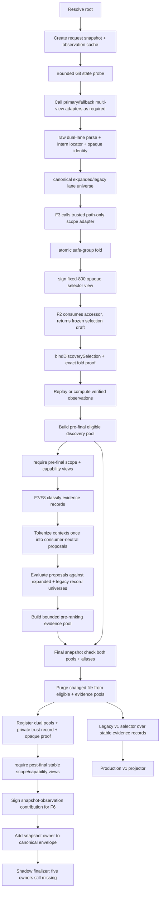

# request-snapshot-cache feature design

## 0. 术语约定

| 术语 | 定义 | 防冲突结论 |
|---|---|---|
| request file cache | 仅在一次 canonical locate execution 内存在，按 canonical target 复用已解码文本、初始 identity 与 alias binding 的缓存 | 不是跨请求 cache，不是索引，也不使用 Redis |
| canonical file key | resolved root 内部的真实 target 相对路径；仅用于请求内聚合、复核和 purge | 不等同于 public `location.file`；后者继续保留调用方命中的 repository-relative locator 以保持 v1 行为 |
| file identity | 从已打开 regular-file handle 取得的 `{dev, ino, size, mtimeMs}` tuple | 不含内容 hash、Git object ID 或 absolute path，且永不进入 public result |
| verified observation | 一次 filesystem verification 的冻结结果；与 backend hit 的 source/reason 分离 | CodeGraph 预验证与最终 merge 可重放同一 observation，但 duplicate/exclusion 聚合仍逐 hit 计算 |
| pre-ranking evidence pool | classification 与 candidate expansion 完成、final snapshot purge 之前的 `PreRankingEvidenceRecordV2` 集合 | “未预算”指不应用请求的 `maxConfirmed/maxCandidates` 或 F2 ranking；它不是 trusted input，仍受固定内部生成安全上限约束 |
| pre-final eligible discovery pool | scope included 且 read/verification 成功、negative/merge/dedupe 后但 final snapshot purge 前的唯一 discovery record 集合 | classification 返回 `undefined` 仍保留；不是 evidence pool，也不应用 F2 evidence budget |
| trusted stable evidence pool | final checker 对同次 pre-ranking pool 完成整文件 purge 后唯一构造并登记的 opaque/branded pool | 同时绑定 exact `SnapshotFactsV2`、stable record refs 与 pool metadata；F2 只接收该 pool，不能接收裸数组或 pre-purge records |
| trusted stable eligible discovery pool | final checker对pre-final eligible discovery pool做同一changed ledger purge后登记的独立opaque pool | F7 matched/unmatched与F8 unsupported count只消费该池；不得由stable evidence、public DTO或scope fragment反推 |
| internal stable evidence record | `{discoveryKey, canonicalFileKey, draft, rankingSignals}` 的 F3-private purge 后记录 | canonical key与discoveryKey只用于merge/purge/trust，不进入F2-visible view |
| trusted stable record view | `{recordRef,fileBucketRef,draft,rankingSignals}` 的无payload opaque refs视图 | F2只能用object identity做exact record/file membership，不能读取canonical path string或discoveryKey |
| snapshot trust proof | 由 final snapshot coordinator 为 exact `SnapshotFactsV2` / trusted pool pair 登记的弱引用证明，保存 draft→record 与 changed-file ledger | 只做同次 execution 的 provenance 校验，不按路径复用内容，不构成跨请求缓存 |
| snapshot outcome contribution | F3从snapshot trust proof与完整execution observation ledger投影出的F6 owner-specific trusted contribution | 只含read-limit booleans与四类exclusion counts，不是public owner fragment |
| expanded discovery intent provenance | expanded lane 在backend query seed与hit之间保留的private `querySeedKeys/matchedAnchorKeys` canonical union | reason code只表示命中类别，不能替代“哪个request intent产出该hit”；legacy `BackendHit` shape保持不变 |
| public-safe expanded candidate | F3在任何expanded cap前用F1A safe key把raw hit投影为`hitRef/locatorRef/safeKey/lines/source/origins` | 不含raw file/symbol/matchedText；safe-equivalent distinct locators按原子等价类处理 |
| tracked discovery locator ref | F2 selector选定opaque locator ref后由request snapshot登记的同次execution引用 | final proof只对该ref返回`stable/purged/unobserved`，raw locator只在F3 private WeakMap |
| opaque file bucket ref | 初始解析成功后为canonical target创建的无payload object token，aliases共享同一token | token→canonical metadata只在F3 private WeakMap；F2只能以`===`/Map membership使用 |
| safe discovery selection proof | F3在读取前把F2冻结的exact safe pool/anchors/selected refs/reservations绑定到同次ticket后签发的无payload object token | F2不能手写、clone或把另一次pool/ticket混入；anchor completeness只接受该typed proof |
| final snapshot check | classification 与 candidate expansion 后，对所有成功解码的唯一 canonical files 和其 alias bindings 做一次最终 identity 复核 | 位于任何最终 ranking/budget/anchor ledger、legacy v1 selection 与 public ID 分配之前 |

## 1. 决策与约束

### 需求摘要

本 feature 为真实 canonical locate execution 增加请求级文件快照。所有 verification、window expansion 与 candidate context 读取共用同一份已解码 canonical file；CodeGraph 为判断是否跳过 fallback 做过的验证结果，在最终 backend merge 时只重放、不重新读取或重新计算。classification 与 candidate expansion 形成未应用最终 evidence budget 的 typed pool 后，系统复核所有已读文件；任一文件变化、消失、不可读、alias 重定向或 identity/stat 失败时，整份 canonical file 的 confirmed/candidate records 都在最终选择和 ID 分配前被删除。

成功标准：

1. 同一 canonical file 在一次请求内最多 UTF-8 解码一次；不同 repository-relative alias 指向同一 target 时仍只解码一次。
2. CodeGraph preverification 与最终 merge 对相同 hit 的 filesystem observation 只计算一次，同时保持现有 duplicate、failure、unverified 与 provenance 聚合结果。
3. final check 严格位于 verification/classification/candidate expansion 之后、F2 rank/budget/anchor ledger 与 v1 compatibility selection 之前。
4. `SnapshotFactsV2.coverage` 精确实现 `stable/changed/unknown`、`filesChecked` 与 `discardedEvidenceCount` 真值表；变化路径、identity、Git revision 永不输出。
5. `finalStableEvidence` 是 trusted stable pool 对应的 purge 后稳定 draft refs；后续 ranking 必须在计算 tier/ledger/budget 前校验 opaque pool 与 exact snapshot facts 属于同次 execution，并只复用其中 exact draft references。pre-purge、跨 execution 混配、克隆、池外、重复或 changed-file record 均 fail closed。
6. 真实 success envelope 新增且仅新增 `snapshot` fragment；其余 owner 仍保持真正 absence，production transport 继续只返回 v1。
7. 无文件变化且无abort时，现有 v1 success/no-result/partial/backend-unavailable unit/Golden/MCP/docs deep-exact；在旧路径已有阶段发生abort的timeout projection也deep-exact。发生变化时删除受影响 evidence 并保守返回至少 `partial`。expanded-only工作期间发生caller/deadline时继续沿当前v1映射返回`timeout`，这是显式时间窗口兼容差异，但不新增v1字段或`SNAPSHOT_CHANGED` code。
8. expanded discovery 对同值不同anchor kind、qualified symbol query与多anchor同hit保留无碰撞intent provenance；raw hit在任何expanded cap前转换为public-safe candidate，F2登记的每个selected opaque locator ref都能通过同proof精确区分`stable/purged/unobserved`，unrelated mutation不得污染其他anchor ledger。
9. F2-visible record与file identity均为无payload、不可枚举、不可序列化的同次execution object token；canonical relative path与discoveryKey只留在F3 private cache/internal records/trust proof，token→metadata映射留在module-private WeakMap，branded string不能冒充opaque identity。
10. selected ref为`unobserved`时，F3 proof-bound anchor completeness必为`incomplete`；F2不能提交或伪造孤立`complete:boolean`，因此初读失败不会误产`NOT_FOUND`。
11. F3为F6签发同execution `snapshot-observation` contribution；read-limit与`NEGATIVE_TERM_MATCH/DUPLICATE_LOCATION/UNVERIFIED_FILE_CONTENT/SNAPSHOT_CHANGED`只从private ledger投影，clone、cross-execution、字段篡改或proof swap在读取值前拒绝。

### 明确不做

- 不实现跨请求、跨进程、磁盘、Redis 或 module-global path/content cache。
- 不承诺整个工作区、Git tree 或未读取文件的原子快照；只证明本次成功解码的文件集合。
- 不使用内容 hash、Git commit、branch、remote、absolute path 或 mtime 作为 public identity。
- 不在文件变化后重读、降级保留、从同文件补位，或在 ID 分配后 refill/reorder。
- 不实现 F2 relevance ranking、anchor satisfaction、跨文件 round-robin 或最终 v2 evidence budget。
- 不拥有 F5 backend fragment、F6 `SNAPSHOT_CHANGED` degradation/status/next-action 聚合、F7 scope 或 F8 capability；F3只签发snapshot observation contribution，不构造request-outcome。
- 不从reason code、aggregate snapshot consistency或discarded count反推anchor-specific purge；F3只保留query-intent provenance并提供selected-file snapshot outcome capability。
- 不改变 `LocateRequest`、public v1/v2 schema、MCP tool、debug CLI flag、package export 或 production projector binding。
- 不把 Git `clean` 当成 evidence truth；Git probe 失败也不能阻断 filesystem final check。
- 不引入第三方依赖，不用 fake content cache 替代真实 handle/stat/realpath 复核。

### 方案深度 pre-pass

| 候选 | 结论 | 原因 |
|---|---|---|
| 每次 reader 调用继续独立 open/decode，末尾只比较 mtime | 拒绝 | 同文件多次读取来自不同瞬间，且 mtime-only 无法证明 identity |
| 用 request path 作为 cache key | 拒绝 | symlink/reparse alias 可使同一 target 重复解码，也无法整文件 purge |
| 用内容 hash 或 Git object ID 作为 snapshot | 拒绝 | 增加全文件计算与稳定 oracle，并违反公共契约和 threat model |
| 只对最终已选 v1 evidence 做复核 | 拒绝 | final budget 已发生，变化文件会影响候选选择且无法为 F2 提供稳定未预算池 |
| canonical target + handle identity + request-local decode/observation cache + pre-budget final purge | 采用 | 与冻结 pipeline 顺序一致，可复用预验证并为 F2 提供真实 stable pool |

### 复杂度档位

- Consistency = `read-set snapshot`：只覆盖成功解码文件，不声称 repository-wide atomicity。
- Security = `fail-closed identity`：alias、realpath、regular-file、handle stat 或 final stat 任一异常都 purge。
- Performance = `bounded request-local reuse`：decode 与 verification promise memoization；所有 map 在 execution `finally` 释放。
- Determinism = `canonical record order`：cache 命中不改变 merge counters；pool/purge 顺序不依赖 completion timing。
- Compatibility = `dual fact views, single orchestration`：expanded discovery/pool lane 与 legacy v1 lane共享一次 canonical adapter orchestration、verification observation 与 candidate tokenization，但各自保存独立查询结果、fallback裁决、record-universe判定、预算/completion/limit事实；底层能力要求不同时允许adapter执行有界的lane-specific process invocation。
- 其余维度沿用当前 NestJS/TypeScript 本地工具的默认长期维护档位。

### 关键决策

1. **安全文件源与 reader 分层**：把 `NodeRepositoryReader` 当前 realpath→containment→open→fstat→bounded read→fatal UTF-8 decode 安全内核抽成内部 `VerifiedTextFileSourceV2`。公开 `NodeRepositoryReader` 仍是 stateless one-shot adapter；canonical executor 每次请求通过 factory 创建 `RequestRepositorySnapshotV2`，后者实现现有 `RepositoryReader` port 并复用同一安全源。
2. **visible locator 与 canonical identity 分离**：reader 返回的 `EvidenceLocation.file` 继续使用命中的 normalized relative locator，保证 v1 parity；cache 另外把每个 locator alias 绑定到 root 内 canonical target key。final check 必须同时验证 canonical target identity 和所有已使用 alias 仍解析到同一 target。
3. **单次解码由 canonical promise 拥有**：alias 先安全解析到 canonical key，再通过 `Map<CanonicalFileKey, Promise<DecodedFileSnapshot>>` 原子登记；并发 alias 只共享该 promise。失败结果按 alias/identity 阶段缓存，成功文本只存在于本次 execution，dispose 后不可访问。
4. **limit 语义不因 cache 漂移**：request snapshot 使用 canonical executor 已冻结的 file byte ceiling完成单次 decode；每次 `readRange/readWindow/findMatches` 仍独立执行该调用的 line/excerpt/max-match 检查。较小调用上限不得因较早较宽缓存命中而绕过，较早 limit failure也不得污染后续不同合法 view。
5. **verified observation 与 hit metadata 分离**：新增 request-local `VerifiedDiscoveryObservationCacheV2`，实例绑定 root、terms、read limits、maxMatches 与 signal；key只含会改变 filesystem verification 的 `file/lines/matchedText/symbol`。source/reason 在每次 merge replay 时重新组合，因此 CodeGraph/ripgrep provenance、duplicateLocations、unverifiedLocations 与 failures 保持现状。
6. **raw locator、legacy parse lane、scope universe 与 selector view 分层**：每个CodeGraph/Ripgrep raw path先进入discriminated F3 factory；backend source只能是`{source:'backend',backend,pathFlavor:'native'}`，request anchor只能是`{source:'request-anchor',pathFlavor:'posix'}`，不存在caller可拼的source/flavor组合。factory在任何separator转换前拒绝NUL、POSIX/drive/UNC/device absolute与所有`^[A-Za-z]:` drive-relative forms；Windows native才把`\`转换为`/`，非Windows native backslash与request POSIX backslash一律拒绝，随后拒绝empty/`.`/`..`/trailing/duplicate segments且不做normalize。expanded lane只保存opaque interned locator ref与opaque merged identity ref；同execution逐code-unit相同POSIX locator只产生一个canonical ref，file-anchor/range/symbol metadata与cross-backend origin union仅存在F3 WeakMap。独立`LegacyBackendPathAdapterV1`对同一raw value执行冻结的`replaceAll + posix.normalize`旧转换，expanded拒绝不改变v1；parser不得用legacy结果回填expanded。旧`selectBackendHits`被唯一`selectAndFreezeLegacyBackendHitsV1`替换：legacy primary/fallback裁决只读adapter-owned health/completeness facts，不再提前调用最终selector；全部legacy backend/fallback裁决完成后该函数对最终result set只执行一次，原子冻结`result`、`selectedCount=result.hits.length`与绑定exact result object、顺序、normalized path、`filesTruncated`、execution的opaque proof。0条选择同样得到合法proof且pool必须以空receipt集合seal。F3逐ordinal创建policy-only path receipts并要求trusted pool完整覆盖，caller不能提交裸locator数组，也不能为同一result另签proof。F3再把expanded exact pre-cap refs与trusted legacy selected path pool合成带lane membership的`CanonicalScopeDecisionUniverseV2`；code-unit相同ref复用，不同ref保持legacy-only且永不回填expanded。registrar直接调用trusted path-only policy adapter一次/unique locator并fan-out到identities；caller不提交裸decisions。scope fold只消费universe中的expanded complete-safe subset，legacy post-read accessor消费legacy subset，二者共享exact policy/version/locator decision而不谎称hit universe相同。fold后由F3签发opaque `TrustedScopeFoldedSelectorViewV2`；F2只能通过pre-observation accessor读public-safe candidate values。F3 base design、implementation、QA与acceptance只拥有并验证`PreF5MultiViewRepositorySearchBackendV2.searchViews(request,signal)`；不声明、import或要求`BackendExecutionContextV2`、F5 handoff、F5 fixture或F5 positive runtime evidence。未来F5 child revision在F5自身core gate中原子删除旧port并安装四参数trusted handoff seam，不能双port共存或runtime flag切换；该future delta不属于F3 base gate。F3 base仍验证不同cap的CodeGraph legacy-first有界plan、相同cap单次plan、Ripgrep每active group一次process/parse与每lane独立fallback；只要任一lane需要，fallback adapter最多调用一次并返回双view。
7. **classification 先产 internal record**：direct classifier 从“立即创建 v1 ID”拆成 `ClassifiedEvidenceRecordV2`，同时携带 discovery key、canonical file key、无 ID 的 unsafe v2 draft 与 legacy materialization facts。v1 adapter仍按原 discovery key/class/role创建 v1 hash ID；snapshot facts不从已脱敏 `legacyV1Projection` 反推。
8. **candidate expansion 共享token proposal，不共享依赖record universe的draft判定**：把现有 candidate policy 拆成 consumer-neutral `CandidateTokenProposalEnumeratorV2`、`PreRankingCandidateCollectorV2` 与 `LegacyCandidateReservationV1`。enumerator对每个已解码context只做一次mask/tokenize/offset与局部syntax facts，不能调用`isReservedToken(..., records)`或固化reason/provenance；两个consumer分别使用expanded与legacy record universe执行reserved-token、reason、provenance、collision和bounded merge。legacy只消费旧direct budgets得到的retained contexts，严格复现当前语义；expanded-only records不得抑制legacy proposal。两lane可重复纯predicate evaluation，但不得重复filesystem read、decode、window extraction或tokenize。
9. **三类预算分名、单一authority且scope先于所有expanded count**：executor-owned常量`DISCOVERY_RESERVATION_CAP_V2 = LOCATE_LIMIT_MAXIMUMS.maxFiles × (LOCATE_LIMIT_MAXIMUMS.maxConfirmed + LOCATE_LIMIT_MAXIMUMS.maxCandidates) = 800`是expanded backend hard ceiling与fold后reservation cap的唯一authority；backend response不回传cap，selector/fallback也不能提供cap。`PRE_RANKING_CANDIDATE_CAP_V2 = DISCOVERY_RESERVATION_CAP_V2 × LOCATE_LIMIT_MAXIMUMS.maxCandidates = 16000`约束scope-included derived safe groups，`publicEvidenceBudget`留给legacy/F2最终输出。两常量均不读取本次请求预算。scope excluded或mixed group先由F3 fold proof移出，因此不占任一cap；derived drafts先生成F1A safe file/symbol key与public enum/line/source tuple，再按完整safe key分组；边界collision整组纳入或整组排除并记录`preRankingPoolTruncated/safeSelectionCollision`，不得按canonical seed/file/discoveryKey选prefix。legacy `MAX_CANDIDATES_REACHED`只由legacy consumer当前真值产生；F6以后聚合真实expanded limit/degradation。
10. **pool identity 先于 purge 固定**：direct与derived draft按 discovery key互斥；confirmed优先，candidate collision删除。`discardedEvidenceCount`计数为此唯一 pre-ranking pool中因 changed canonical files 被删除的 draft数，不计 backend hits、aliases、files或legacy selection条数。
11. **final check覆盖完整 read set**：Git probe先完成，随后按 canonical key排序复核所有成功解码文件。每项重新走 containment/open/regular-file/post-open realpath，比较 `{dev,ino,size,mtimeMs}` 并核对aliases；只读 stat，不再次读取或解码内容。
12. **任一复核异常归一为 changed**：内容/identity变化、消失、不可读、非regular、alias重定向、stat失败或复核期间abort均把对应 canonical key加入changed ledger。abort时尚未复核的剩余文件也视为复核失败并 purge；已经成功复核的其他文件可保留。
13. **coverage真值表冻结**：至少解码一文件且全部复核成功才为`stable`；任一已读文件失败即`changed`；只有成功解码文件数为0且pool为空时为`unknown`。`filesChecked`只计final check成功的唯一 canonical files；changed files不计入。`discardedEvidenceCount`可为0，即变化文件没有产出draft。
14. **Git state只做独立环境事实**：通过现有 `SafeProcessRunner` 运行固定argv与1 KiB bounded output。Git识别成功后，porcelain为空为`clean`、非空为`dirty`；明确不是worktree为`not-git`；spawn/timeout/abort/output/malformed/status失败为`unknown`。stdout/stderr、branch、remote、revision和root不写日志或artifact。
15. **trusted scope fold、typed selection、producer basis与neutral language carrier都由F3闭环**：
    F2 selector只接收F3 `TrustedScopeFoldedSelectorViewV2`、canonical anchors、`maxFiles`与execution；
    accessor先验证exact universe/pre-cap pool/observation/fold/800-cap/execution才暴露不含identity的
    public-safe candidates。selector draft引用exact selector token；canonical executor在reader前调用
    `bindDiscoverySelection`，F3验证完整safe groups、opaque identity refs、globally unique excluded
    ledger、eligible subset与reservation后签同次ticket/proof。

    verification后、final check前，scope/capability consumers只从distinct-brand pre-final views取得
    observation + fold eligible subset + exact selection + verified record + execution；final后另签
    distinct stable views。scope view只暴露decision；capability record只有
    `eligibleRef/fileBucketRef`，按exact ref暴露F3-private basename派生extension与interned
    `VerifiedLanguageContextRefV2`，绝不暴露segments、identity、locator、decoded lines或path；
    post-final capability view连extension/context accessor也没有。

    `requirePreFinalProducerBasisReceiptsV2`为direct record签consumer-neutral
    `VerifiedProducerBasisReceiptsV2`。candidate enumerator另由F3签
    `VerifiedCandidateTokenProposalV2`；`registerDerivedEvidenceProposalRefV2`把proposal-specific
    token location、symbol、filesystem provenance、scope decision、seed eligible ref与execution
    绑定到opaque `DerivedEvidenceProposalRefV2`，但绝不把proposal加入stable eligible coverage pool；
    `requirePreFinalDerivedProducerBasisReceiptsV2`只为该proposal签receipt集合。
    `requireScopeBoundProducerBasisV2(receipts,scopeView,execution)`从basis private record区分record或
    derived-proposal subject并返回其exact location/provenance/safe term/anchor/symbol；caller不能用
    seed record location冒充proposal location，也不能逐字段拼receipt。

    F3还从fold private excluded ledger签`ScopeCoverageBasisV2`；唯一accessor绑定exact stable eligible
    pool、snapshot proof、fold proof与execution，只暴露nonnegative safe
    `outsideLayerHintCount=globally unique excluded identities`。mixed safe-key group中的included
    member只进入collision/incomplete，不计outside；identity数组仍不可达。count±1、ledger删项、
    mixed included member误计、pool/proof/execution swap均在值暴露前失败。

    language seam由F3-owned neutral `VerifiedLanguagePreparationCarrierV2`拥有，不import或要求任何
    F8 type/factory。composition root只能用F3-issued owner admission登记一个
    `VerifiedLanguageCursorConsumerV2`；F3 base以`request-snapshot-baseline` test consumer验证
    admission、carrier/context/ref/execution绑定、one-shot resolver、ephemeral cursor和settle后失效。
    后续F8只import carrier type，以自己的WeakMap把每个carrier绑定observation/mode/runtime provenance；
    dual-mode/dual-ref leader/follower promise语义完全属于F8 gate，不属于F3 base acceptance。

    final coordinator登记双stable pools与F3-private `SnapshotTrustRecordV2`，跨模块只传无own-property
    token。F2-visible evidence view只含record/file refs、draft/signals；所有token由
    `Object.freeze(Object.create(null))`创建；clone、spread、JSON、hostile identity映射、
    reservation篡改或cross-pool/ticket/execution在观察任何值前拒绝。
16. **finalizer增加dependency-gated invariant**：owner齐全后，F1C required-owner finalizer先确认snapshot facts与trusted pool来自同一trust proof；F2 ranking接入后再要求confirmed/candidates均为该 pool 的 exact stable record refs、class互斥且无重复。internal discovery key只在F3 proof验证merge identity，不向F2暴露也不参与排序。handcrafted/cloned facts、重复ref、池外ref、cross-execution ref或changed-file ref统一`invalid-facts`。missing-first规则不变。
17. **真实 envelope只增加snapshot**：canonical success在同次 execution的final purge后调用owner builder一次；real shadow恰好缺`[ranking, backend, request-outcome, scope, capability]`。canonical tool failure无envelope；零读取success使用可信`unknown` snapshot。
18. **v1变化边界明确**：无mutation且无abort时，legacy adapter deep-exact返回当前success/no-result/partial/backend-unavailable结果；在旧legacy路径已有阶段发生abort时，现有`timeout` projection也deep-exact。发生mutation时从同一purged record set选择v1 evidence并强制status至少`partial`；不向v1 `exclusionSummary/limitsReached`增加不存在的`SNAPSHOT_CHANGED` code，也不泄露changed path。F3新增的expanded discovery、expanded-only fallback与final check会延长当前abort coordinator仍可观察signal的阶段；在这些新增阶段出现caller或deadline时，沿当前v1语义返回`timeout`，即使旧legacy-only路径可能已返回。该显式时间窗口差异服从已批准public contract“final snapshot check完成前abort不得绕过复核”的方向；F3不区分caller/deadline、不新增abortSource、不抢占F6的request-outcome与finalization-latch所有权。
19. **生命周期由 canonical executor拥有**：root resolve成功后创建snapshot context；所有backend/verification/classification/candidate/final-check共享它；`finally`清除decoded lines、alias map、observation promises和draft catalog。Nest singleton只持factory，不持request maps。
20. **F2消费接口固定且completeness由typed proof派生**：F2首先只能接收F3的opaque scope-folded selector token并通过验证型accessor读取facts；final check后只能接收与exact `SnapshotFactsV2`、`TrustedStableEvidencePoolV2`、`BoundSafeDiscoverySelectionV2`、opaque snapshot proof及fold proof绑定并经trust lookup取得的`TrustedSnapshotRankingViewV2`。不能接收raw `ExpandedBackendHitV2`、raw locator、pre-cap/fold前pool、裸internal stable records、canonical/discovery key、eligible-discovery pool、clone或跨execution ref。每个trusted evidence view record冻结consumer-neutral判别联合`rankingSignals`；direct保留focus/matched terms/symbol facts，derived仅自身verified token focus且三个backend事实tuple为空。view提供`anchorCompleteness(anchorKey, selectionProof)`：backend/telemetry-only raw prefix、pre-safe truncation、scope-excluded/mixed group、safe collision exclusion、selector deferred、pre-ranking truncation或该anchor任一selected locator为`unobserved`时固定`incomplete`；只有所有相关refs已观察且策略无缺口才`complete`。proof必须是view内exact bound selection token，F2不得提交`complete:boolean`或替换selection。F3不计算tier/satisfaction/budget；F2输出保留exact draft refs供finalizer subset证明。
21. **F6 snapshot observation contribution来自同一opaque trust proof与完整ledger**：唯一阶段顺序冻结为
    `raw parse双lane → interned locator/opaque identity + canonical lane universe → F3调用trusted scope adapter签observation → expanded safe-group fold → fixed 800 cap/opaque F2 selector view → included read/verification → pre-final scope/capability views → classification/candidate → duplicate/negative/unverified/read-limit ledger → 双pool final snapshot check/purge → post-final views`。
    F3不得先cap、negative或read再补scope；temporary current-scope adapter与F7 authoritative
    adapter只实现registered path-only callback，F3对canonical universe的每个unique locator调用一次，
    验证decision并向exact opaque identities fan-out后签发`TrustedScopeEligibilityObservationV2`。
    相同scope decision下替换temporary/F7 adapter不得改变F3/F2/F6数字；adapter token/receipt clone、
    cross-execution、universe membership增删、decision replay/swap或scope mismatch在fold前拒绝。
    final check/purge完成后只调用一次
    `createSnapshotOutcomeContributionV2(snapshotProof, executionToken)`。private registry先验证
    `SnapshotObservationOutcomeLedgerV2`完整覆盖exact scope observation universe中的全部canonical locator ref、exact bound
    selection中的全部selected locator refs且没有额外ref，再从已冻结ledger投影：
    - `maxFileBytesReached`：任一scope-included、selected locator ledger entry记录typed `max-file-bytes` limit observation；初读直接失败也必须形成entry，不要求`kind='verified'`；
    - `maxExcerptBytesReached`：任一scope-included、selected locator entry记录typed `max-excerpt-bytes`，含line ceiling折叠；
    - `negativeTermMatchCount`：scope-included且verification成功后被negative-term policy排除的unique `discoveryKey`数；
    - `duplicateLocationCount`：scope-included且verification成功后的每个`discoveryKey` merge group中被折叠的额外record数，即`sum(max(inputRecordCount-1,0))`；
    - `unverifiedFileContentCount`：scope-included、selected locator refs中最终为`unobserved`且reason属于普通repository failure、`non-regular-file|binary-content|invalid-range|max-file-bytes|max-excerpt-bytes|content-mismatch|no-match`的unique ref数；`path-escape|request-aborted`属于fatal且不计；
    - `snapshotChangedCount`：严格等于`SnapshotFactsV2.coverage.discardedEvidenceCount`。

    contribution schema、从schema单向派生的recursive readonly type、factory与accessor全部由F3独占；F6只能导入类型并调用
    `requireSnapshotOutcomeContributionV2`，不得重复声明branch。schema逐层strict，boolean必须真
    boolean，count必须是`0..Number.MAX_SAFE_INTEGER`整数；factory深冻结并用private WeakMap绑定
    exact proof/execution/ledger。不包含raw path、canonical key、failure detail或records；clone、
    cross-execution、proof swap、missing/extra/nested extra、负数、小数、`NaN`、`Infinity`、超
    safe integer及count/boolean mutation均在任何值暴露前拒绝。`OUTSIDE_LAYER_HINT`仍只由F7从同一fold
    proof的excluded ledger贡献。
22. **stable eligible discovery与evidence pool严格分离**：scope-included identity在read/verification成功后先形成`PreFinalEligibleDiscoveryPoolV2`；negative命中、merge/dedupe与final snapshot purge作用于该pool，classification返回`undefined`的记录仍保留。direct/candidate classification另行产生`PreRankingEvidencePoolV2`，可以少于eligible pool。final check用同一changed-file ledger同时purge两者并签发`TrustedStableEligibleDiscoveryPoolV2`与`TrustedStableEvidencePoolV2`；F7 `unmatchedLayers`和F8 unsupported-language count只消费前者，且必须在F2 evidence budget前完成。F8 narrow accessor必须提交exact eligible pool、snapshot proof、scope fold proof与execution；不能从retained evidence、public DTO或scope fragment反推。

### Snapshot coverage 真值表

| 成功解码文件 | final check | stable pool | consistency | filesChecked | discardedEvidenceCount |
|---:|---|---:|---|---:|---:|
| 0 | 无目标 | 0 | `unknown` | 0 | 0 |
| N>0 | 全部成功且tuple/alias一致 | 可为0或N条 | `stable` | 唯一canonical file数 | 0 |
| N>0 | 任一变化/消失/不可读/identity/stat/alias/abort失败 | purge后可为0或保留其他文件 | `changed` | 仅成功复核的唯一canonical file数 | 被purge的唯一draft数 |

`unknown`与任何retained draft不可共存。`gitState`的四种值与上表正交，不能把`clean`升级为`stable`，也不能把`dirty/not-git/unknown`自动降为`changed`。

### Top 3 风险与缓解

| 风险 | 缓解 |
|---|---|
| cache按alias命中或并发登记不严，导致同一target重复decode或错误共享 | canonical-key promise、alias binding truth table、并发counting source与真实symlink/reparse fixtures |
| expanded discovery或pool cap改变现有v1 backend/candidate语义 | capability-specific multi-view adapter + consumer-neutral token proposals和双record-universe evaluator；跨1/0与20/20limits、Ripgrep mixed-case group、lane-specific fallback、expanded-only reserved record、超pool cap和seed permutation做deep-exact；late abort作为单列兼容差异验证 |
| changed record通过clone、旧引用或错误ranking重新进入composer | trust registry、exact reference membership、changed ledger mutation与composer/serializer spy零调用 |

### 非显然依赖、关键假设与基线风险

- design admission依赖 F1C design review passed；implementation admission仍要求 F1C acceptance为`done`，因为本项要接真实canonical executor、owner builder与finalizer。
- F1A corpus/field guard、F1B public budget与F1C materialization/composer实现也必须在F1C依赖链中完成；本项不复制其raw/public guards或ID/composition职责。
- 假设支持范围是本机稳定filesystem；攻击者若能在相同`dev/ino/size/mtimeMs`下回写内容，Node portable API不能证明内容未变，继续保留为threat-model residual risk。
- current backend `maxHits`直接依赖请求final evidence limits；F3必须用一个multi-view adapter orchestration同时提供expanded/legacy真值。Ripgrep的cap虽然不进入argv，却会在case group之间提前返回，因此只能共享仍被active lane需要的group process/parse并在group边界冻结各lane；CodeGraph必须承认`--limit`差异并执行至多两个cap-specific plan。两者都不能只把数字放大或从expanded最终结果猜legacy后宣称v1 parity。
- current candidate policy约990行，且`isReservedToken(..., records)`使draft集合依赖consumer的record universe；F3必须先行为等价拆出consumer-neutral token proposals，再由两个lane各自判定，不能共享expanded判定后的drafts或在同一步改变reason/promotion语义。
- current `NodeRepositoryReader`每次读取独立decode；公开class仍需保持one-shot行为和现有错误码，request reuse只由canonical executor factory启用。
- `maxFiles`限制unique selected locators而非physical inodes；hardlink路径视为不同canonical paths，symlink/reparse alias按realpath target合并。
- Windows真实unreadable/alias fixture受权限影响；确定性adapter failure matrix为blocking，平台可用时的真实reparse case由F4 matrix补齐。
- Git command availability不是evidence前置条件；任何Git异常只产生`gitState=unknown`。
- F3 real envelope仍缺五owner；任何完整v2 result都只能来自显式synthetic fixture，不能记为real readiness。
- 当前production v1没有snapshot degradation code；mutation后的`partial + evidence purge`是唯一诚实兼容表示。

### 必跑验证、交付物与清洁度

- 必跑：build、typecheck、request snapshot全部unit、dedicated Golden、large synthetic + mutation、F1C bridge/public-v2、full unit/Golden/MCP/docs、scope/spec/Doctor。
- 交付物：safe file source、request snapshot factory/cache、canonical identity/alias ledger、expanded/legacy multi-view backend truth table、verified observation cache、classified record、consumer-neutral token proposal enumerator、lane evaluators、stable pool、final checker、Git probe、trust registry/finalizer invariant、real envelope fragment、v1 compatibility adapter、case/runner registry、architecture/scope/review/QA/acceptance evidence。
- 清洁度：禁止module-global path/content map、第二次decode、第二套canonical backend orchestration、CodeGraph同cap重复query plan、Ripgrep同group重复process/parse、content/Git hash、changed path日志、placeholder owner、post-ID purge、未登记case、TODO/FIXME、debug dump、真实凭证/机器路径。一个adapter call内的CodeGraph不同cap有界plans与Ripgrep仍active case groups是显式允许边界。

## 2. 名词与编排

### 2.1 名词层

#### 现状

- `RepositoryReader` 提供root resolve、range/window/match读取；`NodeRepositoryReader`每个操作都重复realpath/open/read/decode，且不暴露初始identity或final recheck seam。
- `verifyAndMergeBackendHits`把读取、hit verification与aggregate merge放在同一循环；CodeGraph preverification后，最终merge会再次执行同一读取。
- classifier立即创建带v1内容hash ID的public evidence；candidate policy同时负责枚举和`maxCandidates` selection，无法形成无ID、未预算、可追踪canonical file的pool。
- canonical envelope在F1C后会有owner slots，但real execution尚无snapshot fragment或stable identity证明。

#### 变化

内部请求快照契约：

```ts
type CanonicalFileKeyV2 = string & { readonly __brand: 'CanonicalFileKeyV2' }; // F3 private
declare const DISCOVERY_LOCATOR_REF_V2: unique symbol;
declare const DISCOVERY_TRACKING_TICKET_V2: unique symbol;
declare const SAFE_DISCOVERY_SELECTION_PROOF_V2: unique symbol;
declare const FILE_BUCKET_REF_V2: unique symbol;
declare const STABLE_RECORD_REF_V2: unique symbol;
declare const ELIGIBLE_DISCOVERY_REF_V2: unique symbol;
declare const EXPANDED_HIT_REF_V2: unique symbol;
declare const MERGED_DISCOVERY_IDENTITY_REF_V2: unique symbol;
declare const CANONICAL_SCOPE_DECISION_UNIVERSE_V2: unique symbol;
declare const TRUSTED_SCOPE_POLICY_ADAPTER_V2: unique symbol;
declare const TRUSTED_SCOPE_ELIGIBILITY_OBSERVATION_V2: unique symbol;
declare const SCOPE_FOLDED_SAFE_POOL_PROOF_V2: unique symbol;
declare const TRUSTED_SCOPE_FOLDED_SELECTOR_VIEW_V2: unique symbol;
declare const TRUSTED_STABLE_ELIGIBLE_DISCOVERY_POOL_V2: unique symbol;
declare const SNAPSHOT_TRUST_PROOF_V2: unique symbol;
declare const TRUSTED_LEGACY_SELECTION_PROOF_V1: unique symbol;
declare const LEGACY_SELECTED_PATH_RECEIPT_V2: unique symbol;
declare const TRUSTED_LEGACY_SELECTED_PATH_POOL_V2: unique symbol;

type DiscoveryLocatorRefV2 = Readonly<object> & {
  readonly [DISCOVERY_LOCATOR_REF_V2]: never; // phantom brand
};

type RawDiscoveryLocatorInputV2 =
  | Readonly<{
      source: 'backend';
      backend: SearchBackendId;
      pathFlavor: 'native';
      rawPath: string;
    }>
  | Readonly<{
      source: 'request-anchor';
      pathFlavor: 'posix';
      rawPath: string;
    }>;

function bindRawDiscoveryLocatorV2(
  input: RawDiscoveryLocatorInputV2,
  execution: LocateExecutionTokenV2,
): DiscoveryLocatorRefV2;

type TrustedLegacySelectionProofV1 = Readonly<object> & {
  readonly [TRUSTED_LEGACY_SELECTION_PROOF_V1]: never;
};

interface LegacyDiscoverySelectionResultV1 {
  readonly hits: readonly BackendHit[];
  readonly filesTruncated: boolean;
}

interface FrozenLegacySelectionV1 {
  readonly result: LegacyDiscoverySelectionResultV1;
  readonly selectedCount: number;
  readonly proof: TrustedLegacySelectionProofV1;
}

function selectAndFreezeLegacyBackendHitsV1(
  results: readonly BackendSearchResult[],
  maxFiles: number,
  execution: LocateExecutionTokenV2,
): FrozenLegacySelectionV1;

type LegacySelectedPathReceiptV2 = Readonly<object> & {
  readonly [LEGACY_SELECTED_PATH_RECEIPT_V2]: never;
};

type TrustedLegacySelectedPathPoolV2 = Readonly<object> & {
  readonly [TRUSTED_LEGACY_SELECTED_PATH_POOL_V2]: never;
};

function registerLegacySelectedPathV2(
  proof: TrustedLegacySelectionProofV1,
  selectedOrdinal: number,
  execution: LocateExecutionTokenV2,
): LegacySelectedPathReceiptV2;

function sealTrustedLegacySelectedPathPoolV2(
  proof: TrustedLegacySelectionProofV1,
  receipts: readonly LegacySelectedPathReceiptV2[],
  execution: LocateExecutionTokenV2,
): TrustedLegacySelectedPathPoolV2;

type MergedDiscoveryIdentityRefV2 = Readonly<object> & {
  readonly [MERGED_DISCOVERY_IDENTITY_REF_V2]: never;
};

type CanonicalScopeDecisionUniverseV2 = Readonly<object> & {
  readonly [CANONICAL_SCOPE_DECISION_UNIVERSE_V2]: never;
};

type TrustedScopePolicyAdapterV2 = Readonly<object> & {
  readonly [TRUSTED_SCOPE_POLICY_ADAPTER_V2]: never;
};

interface VerifiedScopePolicyPathViewV2 {
  readonly posixSegments: readonly [string, ...string[]];
  readonly basename: string;
}

interface ScopePolicyDecisionCallbackV2 {
  decide(
    path: VerifiedScopePolicyPathViewV2,
    scope: ResolvedScopeBindingV2,
  ): ScopeEligibilityDecisionV2;
}

interface ResolvedScopeBindingV2 {
  readonly requested: readonly RepoLayer[];
  readonly effective: readonly RepoLayer[];
  readonly policyVersion: 'current-scope-adapter-v1' | 'repo-scope-v1';
}

function registerTrustedScopePolicyAdapterV2(
  policyVersion: ResolvedScopeBindingV2['policyVersion'],
  callback: ScopePolicyDecisionCallbackV2,
  execution: LocateExecutionTokenV2,
): TrustedScopePolicyAdapterV2;

interface ScopeEligibilityDecisionV2 {
  readonly layer: RepoLayer;
  readonly included: boolean;
  readonly confirmation: 'allowed' | 'candidate-only' | 'excluded';
}

type TrustedScopeEligibilityObservationV2 = Readonly<object> & {
  readonly [TRUSTED_SCOPE_ELIGIBILITY_OBSERVATION_V2]: never;
};

type ScopeFoldedSafePoolProofV2 = Readonly<object> & {
  readonly [SCOPE_FOLDED_SAFE_POOL_PROOF_V2]: never;
};

type TrustedScopeFoldedSelectorViewV2 = Readonly<object> & {
  readonly [TRUSTED_SCOPE_FOLDED_SELECTOR_VIEW_V2]: never;
};

type SnapshotTrustProofV2 = Readonly<object> & {
  readonly [SNAPSHOT_TRUST_PROOF_V2]: never;
};

interface TrackedDiscoveryFileV2 {
  readonly locatorRef: DiscoveryLocatorRefV2;
}

interface DiscoveryTrackingTicketV2 {
  readonly [DISCOVERY_TRACKING_TICKET_V2]: never; // phantom brand
  readonly files: readonly TrackedDiscoveryFileV2[];
}

type SafeDiscoverySelectionProofV2 = Readonly<object> & {
  readonly [SAFE_DISCOVERY_SELECTION_PROOF_V2]: never; // phantom brand
};

type OpaqueFileBucketRefV2 = Readonly<object> & {
  readonly [FILE_BUCKET_REF_V2]: never; // phantom brand
};

type StableRecordRefV2 = Readonly<object> & {
  readonly [STABLE_RECORD_REF_V2]: never; // phantom brand
};

type EligibleDiscoveryRefV2 = Readonly<object> & {
  readonly [ELIGIBLE_DISCOVERY_REF_V2]: never;
};

type VerifiedLanguageContextRefV2 = Readonly<object> & {
  readonly [VERIFIED_LANGUAGE_CONTEXT_REF_V2]: never;
};

declare const VERIFIED_PRODUCER_BASIS_RECEIPT_V2: unique symbol;
type VerifiedProducerBasisReceiptV2 = Readonly<object> & {
  readonly [VERIFIED_PRODUCER_BASIS_RECEIPT_V2]: never;
};

declare const VERIFIED_MATCHED_TERM_RECEIPT_V2: unique symbol;
type VerifiedMatchedTermReceiptV2 = Readonly<object> & {
  readonly [VERIFIED_MATCHED_TERM_RECEIPT_V2]: never;
};

declare const VERIFIED_ANCHOR_RECEIPT_V2: unique symbol;
type VerifiedAnchorReceiptV2 = Readonly<object> & {
  readonly [VERIFIED_ANCHOR_RECEIPT_V2]: never;
};

declare const VERIFIED_SYMBOL_RECEIPT_V2: unique symbol;
type VerifiedSymbolReceiptV2 = Readonly<object> & {
  readonly [VERIFIED_SYMBOL_RECEIPT_V2]: never;
};

declare const VERIFIED_RECORD_SOURCE_RECEIPT_V2: unique symbol;
type VerifiedRecordSourceReceiptV2 = Readonly<object> & {
  readonly [VERIFIED_RECORD_SOURCE_RECEIPT_V2]: never;
};

declare const DERIVED_EVIDENCE_PROPOSAL_REF_V2: unique symbol;
type DerivedEvidenceProposalRefV2 = Readonly<object> & {
  readonly [DERIVED_EVIDENCE_PROPOSAL_REF_V2]: never;
};

declare const VERIFIED_CANDIDATE_TOKEN_PROPOSAL_V2: unique symbol;
type VerifiedCandidateTokenProposalV2 = Readonly<object> & {
  readonly [VERIFIED_CANDIDATE_TOKEN_PROPOSAL_V2]: never;
};

interface VerifiedProducerBasisReceiptsV2 {
  readonly basis: VerifiedProducerBasisReceiptV2;
  readonly matchedTerm?: VerifiedMatchedTermReceiptV2;
  readonly anchor?: VerifiedAnchorReceiptV2;
  readonly symbol?: VerifiedSymbolReceiptV2;
  readonly source: VerifiedRecordSourceReceiptV2;
}

interface VerifiedScopeBoundProducerBasisViewV2 {
  readonly location: UnsafeEvidenceLocationV2;
  readonly provenance: EvidenceProvenance;
  readonly matchedTermPresent: boolean;
  readonly anchoredSymbol?: string;
  readonly canonicalSymbol?: string;
}

declare const VERIFIED_LANGUAGE_CONSUMER_ADMISSION_V2: unique symbol;
type VerifiedLanguageConsumerAdmissionV2 = Readonly<object> & {
  readonly [VERIFIED_LANGUAGE_CONSUMER_ADMISSION_V2]: never;
};

type VerifiedLanguageConsumerOwnerV2 =
  | 'request-snapshot-baseline'
  | 'language-capability';

declare const REGISTERED_VERIFIED_LANGUAGE_CONSUMER_V2: unique symbol;
type RegisteredVerifiedLanguageConsumerV2 = Readonly<object> & {
  readonly [REGISTERED_VERIFIED_LANGUAGE_CONSUMER_V2]: never;
};

declare const VERIFIED_LANGUAGE_PREPARATION_CARRIER_V2: unique symbol;
type VerifiedLanguagePreparationCarrierV2 = Readonly<object> & {
  readonly [VERIFIED_LANGUAGE_PREPARATION_CARRIER_V2]: never;
};

declare const VERIFIED_LANGUAGE_CONTEXT_CONSUMPTION_PROOF_V2: unique symbol;
type VerifiedLanguageContextConsumptionProofV2 = Readonly<object> & {
  readonly [VERIFIED_LANGUAGE_CONTEXT_CONSUMPTION_PROOF_V2]: never;
};

interface EphemeralVerifiedLanguageSourceCursorV2 {
  readonly codeUnitLength: number;
  codeUnitAt(index: number): number;
}

interface VerifiedLanguageCursorConsumerV2 {
  consumeVerifiedContext(
    contextRef: VerifiedLanguageContextRefV2,
    preparation: VerifiedLanguagePreparationCarrierV2,
    source: EphemeralVerifiedLanguageSourceCursorV2,
    execution: LocateExecutionTokenV2,
  ): Promise<void>;
}

declare const SCOPE_COVERAGE_BASIS_V2: unique symbol;
type ScopeCoverageBasisV2 = Readonly<object> & {
  readonly [SCOPE_COVERAGE_BASIS_V2]: never;
};

interface ScopeCoverageBasisViewV2 {
  readonly outsideLayerHintCount: number;
}

type ExpandedHitRefV2 = Readonly<object> & {
  readonly [EXPANDED_HIT_REF_V2]: never; // phantom brand
};

type TrackedDiscoveryFileOutcomeV2 = 'stable' | 'purged' | 'unobserved';

interface FileIdentityV2 {
  readonly dev: bigint;
  readonly ino: bigint;
  readonly size: bigint;
  readonly mtimeMs: bigint;
}

interface DecodedFileSnapshotV2 {
  readonly canonicalFileKey: CanonicalFileKeyV2;
  readonly identity: FileIdentityV2;
  readonly lines: readonly string[];
}

type EvidenceRankingSignalsV2 =
  | Readonly<{
      readonly kind: 'direct';
      readonly focusLines: readonly [number, number];
      readonly focusExcerpt: string;
      readonly matchedTerms: readonly NormalizedSearchTerm[];
      readonly canonicalSymbols: readonly string[];
      readonly discoveryReasonCodes: readonly DiscoveryReasonCode[];
    }>
  | Readonly<{
      readonly kind: 'derived';
      readonly focusLines: readonly [number, number];
      readonly focusExcerpt: string;
      readonly matchedTerms: readonly [];
      readonly canonicalSymbols: readonly [];
      readonly discoveryReasonCodes: readonly [];
    }>;

interface InternalPreRankingEvidenceRecordV2 {
  readonly discoveryKey: string;
  readonly canonicalFileKey: CanonicalFileKeyV2;
  readonly draft: UnsafeEvidenceDraftV2;
  readonly rankingSignals: EvidenceRankingSignalsV2;
}

interface PreRankingEvidencePoolV2 {
  readonly records: readonly InternalPreRankingEvidenceRecordV2[];
  readonly preRankingPoolTruncated: boolean;
  readonly safeSelectionCollision: boolean;
}

declare const TRUSTED_STABLE_EVIDENCE_POOL_V2: unique symbol;

interface InternalStableEvidenceRecordV2
  extends InternalPreRankingEvidenceRecordV2 {
  readonly recordRef: StableRecordRefV2;
  readonly fileBucketRef: OpaqueFileBucketRefV2;
}

type TrustedStableEvidencePoolV2 = Readonly<object> & {
  readonly [TRUSTED_STABLE_EVIDENCE_POOL_V2]: never;
};

interface InternalEligibleDiscoveryRecordV2 {
  readonly eligibleRef: EligibleDiscoveryRefV2;
  readonly identityRef: MergedDiscoveryIdentityRefV2;
  readonly locatorRef: DiscoveryLocatorRefV2;
  readonly discoveryKey: string;
  readonly canonicalFileKey: CanonicalFileKeyV2;
  readonly fileBucketRef: OpaqueFileBucketRefV2;
}

interface PreFinalEligibleDiscoveryPoolV2 {
  readonly records: readonly InternalEligibleDiscoveryRecordV2[];
}

type TrustedStableEligibleDiscoveryPoolV2 = Readonly<object> & {
  readonly [TRUSTED_STABLE_ELIGIBLE_DISCOVERY_POOL_V2]: never;
};

interface TrustedFinalSnapshotPoolsV2 {
  readonly evidence: TrustedStableEvidencePoolV2;
  readonly eligibleDiscovery: TrustedStableEligibleDiscoveryPoolV2;
  readonly facts: SnapshotFactsV2;
  readonly proof: SnapshotTrustProofV2;
}

interface ExpandedBackendHitV2 {
  readonly hit: BackendHit; // F3 private
  readonly querySeedKeys: readonly string[];
  readonly matchedAnchorKeys: readonly string[];
}

interface ExpandedBackendSearchResultV2
  extends Omit<BackendSearchResult, 'hits'> {
  readonly hits: readonly ExpandedBackendHitV2[];
  readonly selectionEligibility:
    BackendExecutionOutcomeV2['selectionEligibility'];
}

interface PublicSafeExpandedCandidateV2 {
  readonly hitRef: ExpandedHitRefV2;
  readonly locatorRef: DiscoveryLocatorRefV2;
  readonly safeKey: PublicSafeRankingKeyV2;
  readonly lineStart: number;
  readonly lineEnd: number;
  readonly source: SearchBackendId;
  readonly querySeedKeys: readonly string[];
  readonly matchedAnchorKeys: readonly string[];
}

interface PublicSafeDiscoverySelectorKeyV2 {
  readonly file: string; // safeKey.file
  readonly lineStart: number;
  readonly lineEnd: number;
  readonly symbol: string; // safeKey.symbol ?? ''
  readonly sourceOrder: number; // frozen SearchBackendId enum order
}

interface PreCapPublicSafeDiscoveryPoolV2 {
  readonly candidates: readonly PublicSafeExpandedCandidateV2[];
  readonly complete: boolean;
}

interface ScopeExcludedDiscoveryLedgerEntryV2 {
  readonly identityRef: MergedDiscoveryIdentityRefV2;
  readonly locatorRef: DiscoveryLocatorRefV2;
}

interface TrustedScopeFoldedSafePoolV2 {
  readonly proof: ScopeFoldedSafePoolProofV2;
}

interface ScopeFoldedSelectorCandidateViewV2 {
  readonly hitRef: ExpandedHitRefV2;
  readonly locatorRef: DiscoveryLocatorRefV2;
  readonly safeKey: PublicSafeRankingKeyV2;
  readonly lineStart: number;
  readonly lineEnd: number;
  readonly source: SearchBackendId;
  readonly querySeedKeys: readonly string[];
  readonly matchedAnchorKeys: readonly string[];
}

interface ScopeFoldedSelectorFactsViewV2 {
  readonly candidates: readonly ScopeFoldedSelectorCandidateViewV2[];
  readonly complete: boolean;
  readonly safeSelectionCollision: boolean;
  readonly filesTruncated: boolean;
}

interface SafeDiscoveryAnchorReservationV2 {
  readonly anchorKey: string;
  readonly state: 'reserved' | 'no-hit' | 'budget-deferred';
  readonly locatorRefs: readonly DiscoveryLocatorRefV2[];
}

interface SafeDiscoverySelectionDraftV2 {
  readonly selectorView: TrustedScopeFoldedSelectorViewV2;
  readonly anchorKeys: readonly string[];
  readonly selectedLocatorRefs: readonly DiscoveryLocatorRefV2[];
  readonly reservations: readonly SafeDiscoveryAnchorReservationV2[];
  readonly filesTruncated: boolean;
  readonly safeSelectionCollision: boolean;
}

interface BoundSafeDiscoverySelectionV2 {
  readonly selection: SafeDiscoverySelectionDraftV2;
  readonly ticket: DiscoveryTrackingTicketV2;
  readonly proof: SafeDiscoverySelectionProofV2;
}

interface RequestRepositorySnapshotV2 extends RepositoryReader {
  canonicalFileKeyFor(locator: string): CanonicalFileKeyV2 | undefined; // F3 private
  bindDiscoverySelection(
    selection: SafeDiscoverySelectionDraftV2,
  ): BoundSafeDiscoverySelectionV2;
  finalCheck(
    signal: AbortSignal,
    evidencePool: PreRankingEvidencePoolV2,
    eligibleDiscoveryPool: PreFinalEligibleDiscoveryPoolV2,
    gitState: RepositorySnapshotCoverage['gitState'],
    boundSelection: BoundSafeDiscoverySelectionV2,
  ): Promise<TrustedFinalSnapshotPoolsV2>;
  dispose(): void;
}

const DISCOVERY_RESERVATION_CAP_V2 = 800 as const;
const PRE_RANKING_CANDIDATE_CAP_V2 = 16_000 as const;

interface MultiViewBackendSearchRequestV2 {
  readonly base: Omit<BackendSearchRequest, 'maxHits'>;
  readonly expandedMaxHits: typeof DISCOVERY_RESERVATION_CAP_V2;
  readonly legacyMaxHits: number;
}

interface BackendDiscoveryViewsV2 {
  readonly expandedInternal: ExpandedBackendSearchResultV2;
  readonly expandedSafePreCap: PreCapPublicSafeDiscoveryPoolV2;
  readonly legacy: BackendSearchResult;
  readonly legacyCap: number;
}

interface PreF5MultiViewRepositorySearchBackendV2 {
  readonly id: SearchBackendId;
  searchViews(
    request: MultiViewBackendSearchRequestV2,
    signal: AbortSignal,
  ): Promise<BackendDiscoveryViewsV2>;
}

interface TrustedStableRecordViewV2 {
  readonly recordRef: StableRecordRefV2;
  readonly fileBucketRef: OpaqueFileBucketRefV2;
  readonly draft: UnsafeEvidenceDraftV2;
  readonly rankingSignals: EvidenceRankingSignalsV2;
}

interface AnchorCompletenessV2 {
  readonly state: 'complete' | 'incomplete';
  readonly reasons: readonly (
    | 'backend-incomplete'
    | 'pre-safe-truncation'
    | 'scope-excluded'
    | 'scope-group-ambiguous'
    | 'safe-selection-collision'
    | 'selector-deferred'
    | 'pre-ranking-truncated'
    | 'unobserved-file'
  )[];
}

interface TrustedSnapshotRankingViewV2 {
  readonly pool: TrustedStableEvidencePoolV2;
  readonly facts: SnapshotFactsV2;
  readonly boundSelection: BoundSafeDiscoverySelectionV2;
  records(): readonly TrustedStableRecordViewV2[];
  fileOutcome(ref: DiscoveryLocatorRefV2): TrackedDiscoveryFileOutcomeV2;
  anchorCompleteness(
    anchorKey: string,
    selectionProof: SafeDiscoverySelectionProofV2,
  ): AnchorCompletenessV2;
}

interface ScopeFoldedSafePoolFactsV2 {
  readonly preCapPool: PreCapPublicSafeDiscoveryPoolV2;
  readonly observation: TrustedScopeEligibilityObservationV2;
  readonly resolvedScope: ResolvedScopeBindingV2;
  readonly eligibleCandidates: readonly PublicSafeExpandedCandidateV2[];
  readonly excludedLedger: readonly ScopeExcludedDiscoveryLedgerEntryV2[];
  readonly safeSelectionCollision: boolean;
}

declare const TRUSTED_PRE_FINAL_ELIGIBLE_RECORD_VIEW_V2: unique symbol;
interface TrustedPreFinalEligibleRecordViewV2 {
  readonly [TRUSTED_PRE_FINAL_ELIGIBLE_RECORD_VIEW_V2]: never;
  readonly eligibleRef: EligibleDiscoveryRefV2;
  readonly fileBucketRef: OpaqueFileBucketRefV2;
}

declare const TRUSTED_PRE_FINAL_SCOPE_RECORD_VIEW_V2: unique symbol;
interface TrustedPreFinalScopeRecordViewV2 {
  readonly [TRUSTED_PRE_FINAL_SCOPE_RECORD_VIEW_V2]: never;
  readonly eligibleRef: EligibleDiscoveryRefV2;
  readonly fileBucketRef: OpaqueFileBucketRefV2;
  readonly decision: ScopeEligibilityDecisionV2;
}

declare const TRUSTED_PRE_FINAL_SCOPE_CLASSIFICATION_VIEW_V2: unique symbol;
interface TrustedPreFinalScopeClassificationViewV2 {
  readonly [TRUSTED_PRE_FINAL_SCOPE_CLASSIFICATION_VIEW_V2]: never;
  records(): readonly TrustedPreFinalScopeRecordViewV2[];
}

interface TrustedLegacyScopeRecordViewV2 {
  readonly locatorRef: DiscoveryLocatorRefV2;
  readonly decision: ScopeEligibilityDecisionV2;
}

interface TrustedLegacyScopeClassificationViewV2 {
  records(): readonly TrustedLegacyScopeRecordViewV2[];
}

declare const TRUSTED_PRE_FINAL_CAPABILITY_VIEW_V2: unique symbol;
interface TrustedPreFinalCapabilityViewV2 {
  readonly [TRUSTED_PRE_FINAL_CAPABILITY_VIEW_V2]: never;
  records(): readonly TrustedPreFinalEligibleRecordViewV2[];
  verifiedLanguageContext(
    ref: EligibleDiscoveryRefV2,
  ): VerifiedLanguageContextRefV2;
  verifiedLastExtension(
    ref: EligibleDiscoveryRefV2,
  ): string | undefined;
}

declare const TRUSTED_STABLE_SCOPE_RECORD_VIEW_V2: unique symbol;
interface TrustedStableScopeRecordViewV2 {
  readonly [TRUSTED_STABLE_SCOPE_RECORD_VIEW_V2]: never;
  readonly eligibleRef: EligibleDiscoveryRefV2;
  readonly fileBucketRef: OpaqueFileBucketRefV2;
  readonly decision: ScopeEligibilityDecisionV2;
}

declare const TRUSTED_STABLE_ELIGIBLE_RECORD_VIEW_V2: unique symbol;
interface TrustedStableEligibleRecordViewV2 {
  readonly [TRUSTED_STABLE_ELIGIBLE_RECORD_VIEW_V2]: never;
  readonly eligibleRef: EligibleDiscoveryRefV2;
  readonly fileBucketRef: OpaqueFileBucketRefV2;
}

declare const TRUSTED_STABLE_ELIGIBLE_SCOPE_VIEW_V2: unique symbol;
interface TrustedStableEligibleScopeViewV2 {
  readonly [TRUSTED_STABLE_ELIGIBLE_SCOPE_VIEW_V2]: never;
  readonly pool: TrustedStableEligibleDiscoveryPoolV2;
  readonly proof: SnapshotTrustProofV2;
  records(): readonly TrustedStableScopeRecordViewV2[];
}

declare const TRUSTED_STABLE_ELIGIBLE_CAPABILITY_VIEW_V2: unique symbol;
interface TrustedStableEligibleCapabilityViewV2 {
  readonly [TRUSTED_STABLE_ELIGIBLE_CAPABILITY_VIEW_V2]: never;
  readonly pool: TrustedStableEligibleDiscoveryPoolV2;
  readonly proof: SnapshotTrustProofV2;
  records(): readonly TrustedStableEligibleRecordViewV2[];
}

function createVerifiedLanguageConsumerAdmissionV2(
  owner: VerifiedLanguageConsumerOwnerV2,
  execution: LocateExecutionTokenV2,
): VerifiedLanguageConsumerAdmissionV2;

function registerVerifiedLanguageConsumerV2(
  admission: VerifiedLanguageConsumerAdmissionV2,
  consumer: VerifiedLanguageCursorConsumerV2,
  execution: LocateExecutionTokenV2,
): RegisteredVerifiedLanguageConsumerV2;

function issueVerifiedLanguagePreparationCarrierV2(
  capabilityView: TrustedPreFinalCapabilityViewV2,
  eligibleRef: EligibleDiscoveryRefV2,
  contextRef: VerifiedLanguageContextRefV2,
  registeredConsumer: RegisteredVerifiedLanguageConsumerV2,
  expectedExecution: LocateExecutionTokenV2,
): VerifiedLanguagePreparationCarrierV2;

function consumeVerifiedLanguageContextV2(
  capabilityView: TrustedPreFinalCapabilityViewV2,
  eligibleRef: EligibleDiscoveryRefV2,
  contextRef: VerifiedLanguageContextRefV2,
  preparation: VerifiedLanguagePreparationCarrierV2,
  registeredConsumer: RegisteredVerifiedLanguageConsumerV2,
  expectedExecution: LocateExecutionTokenV2,
): Promise<VerifiedLanguageContextConsumptionProofV2>;

function requirePreFinalProducerBasisReceiptsV2(
  capabilityView: TrustedPreFinalCapabilityViewV2,
  scopeView: TrustedPreFinalScopeClassificationViewV2,
  eligibleRef: EligibleDiscoveryRefV2,
  expectedExecution: LocateExecutionTokenV2,
): VerifiedProducerBasisReceiptsV2;

function registerDerivedEvidenceProposalRefV2(
  capabilityView: TrustedPreFinalCapabilityViewV2,
  scopeView: TrustedPreFinalScopeClassificationViewV2,
  seedEligibleRef: EligibleDiscoveryRefV2,
  proposal: VerifiedCandidateTokenProposalV2,
  expectedExecution: LocateExecutionTokenV2,
): DerivedEvidenceProposalRefV2;

function requirePreFinalDerivedProducerBasisReceiptsV2(
  capabilityView: TrustedPreFinalCapabilityViewV2,
  scopeView: TrustedPreFinalScopeClassificationViewV2,
  proposalRef: DerivedEvidenceProposalRefV2,
  expectedExecution: LocateExecutionTokenV2,
): VerifiedProducerBasisReceiptsV2;

function requireScopeBoundProducerBasisV2(
  receipts: VerifiedProducerBasisReceiptsV2,
  scopeView: TrustedPreFinalScopeClassificationViewV2,
  expectedExecution: LocateExecutionTokenV2,
): VerifiedScopeBoundProducerBasisViewV2;

function createScopeCoverageBasisV2(
  foldedPool: TrustedScopeFoldedSafePoolV2,
  stableEligiblePool: TrustedStableEligibleDiscoveryPoolV2,
  snapshotProof: SnapshotTrustProofV2,
  foldProof: ScopeFoldedSafePoolProofV2,
  expectedExecution: LocateExecutionTokenV2,
): ScopeCoverageBasisV2;

function requireScopeCoverageBasisV2(
  basis: ScopeCoverageBasisV2,
  expectedEligiblePool: TrustedStableEligibleDiscoveryPoolV2,
  expectedSnapshotProof: SnapshotTrustProofV2,
  expectedFoldProof: ScopeFoldedSafePoolProofV2,
  expectedExecution: LocateExecutionTokenV2,
): ScopeCoverageBasisViewV2;

function registerCanonicalScopeDecisionUniverseV2(
  preCapPool: PreCapPublicSafeDiscoveryPoolV2,
  legacySelectedPool: TrustedLegacySelectedPathPoolV2,
  execution: LocateExecutionTokenV2,
): CanonicalScopeDecisionUniverseV2;

function registerScopeEligibilityObservationV2(
  universe: CanonicalScopeDecisionUniverseV2,
  resolvedScope: ResolvedScopeBindingV2,
  policyAdapter: TrustedScopePolicyAdapterV2,
  execution: LocateExecutionTokenV2,
): TrustedScopeEligibilityObservationV2;

function scopeFoldSafeCandidatePoolV2(
  preCapPool: PreCapPublicSafeDiscoveryPoolV2,
  observation: TrustedScopeEligibilityObservationV2,
  execution: LocateExecutionTokenV2,
): TrustedScopeFoldedSafePoolV2;

function requireScopeFoldedSelectorViewV2(
  foldedPool: TrustedScopeFoldedSafePoolV2,
  preCapPool: PreCapPublicSafeDiscoveryPoolV2,
  observation: TrustedScopeEligibilityObservationV2,
  execution: LocateExecutionTokenV2,
): TrustedScopeFoldedSelectorViewV2;

function readScopeFoldedSelectorFactsV2(
  selectorView: TrustedScopeFoldedSelectorViewV2,
  expectedExecution: LocateExecutionTokenV2,
): ScopeFoldedSelectorFactsViewV2;

function requirePreFinalScopeClassificationViewV2(
  pool: PreFinalEligibleDiscoveryPoolV2,
  observation: TrustedScopeEligibilityObservationV2,
  foldedPool: TrustedScopeFoldedSafePoolV2,
  boundSelection: BoundSafeDiscoverySelectionV2,
  expectedExecution: LocateExecutionTokenV2,
): TrustedPreFinalScopeClassificationViewV2;

function requireLegacyScopeClassificationViewV2(
  universe: CanonicalScopeDecisionUniverseV2,
  observation: TrustedScopeEligibilityObservationV2,
  expectedExecution: LocateExecutionTokenV2,
): TrustedLegacyScopeClassificationViewV2;

function requirePreFinalCapabilityViewV2(
  pool: PreFinalEligibleDiscoveryPoolV2,
  observation: TrustedScopeEligibilityObservationV2,
  foldedPool: TrustedScopeFoldedSafePoolV2,
  boundSelection: BoundSafeDiscoverySelectionV2,
  expectedExecution: LocateExecutionTokenV2,
): TrustedPreFinalCapabilityViewV2;

function requireStableEligibleScopeViewV2(
  pool: TrustedStableEligibleDiscoveryPoolV2,
  proof: SnapshotTrustProofV2,
  foldProof: ScopeFoldedSafePoolProofV2,
  expectedExecution: LocateExecutionTokenV2,
): TrustedStableEligibleScopeViewV2;

function requireStableEligibleCapabilityViewV2(
  pool: TrustedStableEligibleDiscoveryPoolV2,
  proof: SnapshotTrustProofV2,
  foldProof: ScopeFoldedSafePoolProofV2,
  expectedExecution: LocateExecutionTokenV2,
): TrustedStableEligibleCapabilityViewV2;
```

`DiscoveryLocatorRefV2`、`MergedDiscoveryIdentityRefV2`、`ExpandedHitRefV2`、
`OpaqueFileBucketRefV2`、`StableRecordRefV2`、`EligibleDiscoveryRefV2`、
`VerifiedCandidateTokenProposalV2`、`DerivedEvidenceProposalRefV2`、
`VerifiedLanguageContextRefV2`、五种producer-basis receipt、
`VerifiedLanguageConsumerAdmissionV2`、`RegisteredVerifiedLanguageConsumerV2`、
`VerifiedLanguagePreparationCarrierV2`、`VerifiedLanguageContextConsumptionProofV2`、
`ScopeCoverageBasisV2`、universe、scope observation、fold/selector/snapshot proof在运行时都是
无own-property的冻结object。
真实POSIX locator、file-anchor/range/symbol identity metadata、raw hit、canonical key、record
metadata只保存在F3 private WeakMap。locator factory按execution + normalized POSIX code units
intern，因此同路径跨backend/occurrence返回exact同一个ref；semantic identity private record
只绑定exact一个locator ref，origin/occurrence排列不产生代表ref选择问题。`Object.keys`、
spread、`JSON.stringify`均只能观察空对象，任意cast或属性注入都无法命中trust registry。
`EligibleDiscoveryRefV2`是pre-final与post-final共用的record identity，不声明stability；只有
`TrustedStableEligibleDiscoveryPoolV2 + SnapshotTrustProofV2`以及stable record view才能证明
该ref通过final check。四种record entry和pre-final scope/capability、stable scope/capability
container分别带不同phantom brand；即使可见字段恰好相同，也不能按TypeScript结构兼容互换。

`createVerifiedLanguageConsumerAdmissionV2`与`registerVerifiedLanguageConsumerV2`都不是package
export；composition root按owner slot取得F3-issued admission，普通caller、结构相同callback、
重复owner或cross-execution admission无法登记。F3 base只解析
`request-snapshot-baseline` test consumer；`language-capability` slot只是neutral future admission，
不import或要求F8 module。`issueVerifiedLanguagePreparationCarrierV2`绑定exact pre-final
capability view、eligible ref、context、registered consumer与execution；随后
`consumeVerifiedLanguageContextV2`验证同一五元组，并在callback动态范围内交付carrier与只支持
有界`codeUnitAt`的ephemeral cursor。callback settle后cursor永久失效，F3不返回string、lines或
cursor；同一carrier只能进入resolver一次。base hostile case覆盖read-before-verify、
ref/context/carrier/consumer swap、duplicate consumption、callback泄漏后读取、late settlement与
cross-execution。F8未来把carrier映射到mode/facts的逻辑只在F8测试，不进入F3 base gate。

`requirePreFinalProducerBasisReceiptsV2`只接受same-pool/same-record pre-final views；
`requirePreFinalDerivedProducerBasisReceiptsV2`只接受由同一view、seed与verified token proposal
签出的`DerivedEvidenceProposalRefV2`。两者都只返回opaque basis、matched-term、anchor、symbol与
source receipts，不含path/location/provenance或字符串值；private record把subject区分为record
或proposal。direct/candidate/language source可以携带receipt却不能重写；F7在arbitration/
materializer前调用`requireScopeBoundProducerBasisV2(receipts,scopeView,execution)`，只有完整
receipt bundle与subject/scope/execution一致才取得record或proposal-specific location/provenance及
safe term/anchor/symbol view。derived proposal不会进入eligible pool或coverage count。

`createScopeCoverageBasisV2`从exact folded pool的globally unique excluded ledger签receipt，并与
stable eligible pool、snapshot/fold proofs、execution绑定。`requireScopeCoverageBasisV2`只暴露
count；all-excluded group计全部unique identities，included/excluded mixed group只计excluded
identities，all-included confirmation-mixed计0。caller不能读取ledger/identity，也不能提交count。

`selectAndFreezeLegacyBackendHitsV1`是最终legacy selector的唯一producer；它在所有legacy
backend/fallback裁决完成后只运行一次，并原子返回同一冻结`result`、严格等于
`result.hits.length`的`selectedCount`及`TrustedLegacySelectionProofV1`。proof private record
绑定exact result object、完整最终selected set、旧顺序、每个normalized legacy path、
`filesTruncated`与execution；caller看不到path数组，也没有单独proof factory。0条选择同样签proof，
且只允许空receipt集合完成seal。F3按ordinal调用
`registerLegacySelectedPathV2`，从proof private record取得exact path并在policy-only lane intern
locator：若code units与已有strict-expanded locator exact相同则复用同一ref，否则生成legacy-only
ref。`sealTrustedLegacySelectedPathPoolV2`要求receipts恰好覆盖`0..selectedCount-1`且proof/
result/execution一致，漏/重/换序/跨proof或result/selectedCount/filesTruncated swap均拒绝。
policy-only locator永不回填expanded hit、pre-cap、
selector、reader ticket或eligible pool，只能进入legacy scope accessor。

`registerCanonicalScopeDecisionUniverseV2`把expanded pre-cap identity refs与exact trusted legacy
selected path pool按interned locator ref union，并在private record冻结每个ref的
`expanded|legacy|both` lane membership。registrar只接受由temporary adapter或F7 factory登记的
`TrustedScopePolicyAdapterV2`；F3自身按canonical locator ref顺序迭代unique refs，把
`VerifiedScopePolicyPathViewV2`传入adapter，立即验证exact decision，再向该ref下的全部opaque
identities fan-out。adapter看不到identity/ref/symbol，caller也没有decisions参数可替换或交换。
`scopeFoldSafeCandidatePoolV2`再次验证exact universe/pre-cap pool/observation/execution，只对
expanded complete-safe subset按完整safe-key group折叠；excluded ledger按identity ref全局唯一，
mixed group中的included member不得写入outside ledger。`requireScopeFoldedSelectorViewV2`
在同一registry内应用固定800 cap并签发token；`readScopeFoldedSelectorFactsV2`先验证token和
execution再物化consumer值。backend response、F2 selector或fallback没有cap入参/回显authority。

`bindDiscoverySelection()`先验证exact opaque selector view、fold proof、anchors、selected refs与reservations，
包括selected/ref唯一性、reservation state的anchor-origin与complete语义、以及
`budget-deferred`非空ref所代表的完整selector-key等价组；再对选择graph制作内部
深冻结快照，登记selector选择的locator refs并同时签发ticket/proof。binding本身不
stat/open/realpath，实际
`stable/purged/unobserved`由后续初始读取/final check写入proof。成功解析为同一canonical
target的aliases在stable record view中得到同一个`fileBucketRef`。

`fileOutcome()`只接受bound ticket内locator ref；`anchorCompleteness()`同时验证typed
selection proof来自同一folded safe candidate pool/ticket/exact selection，并把scope
excluded/mixed、unobserved与所有expanded/pre-ranking缺口合并为
proof-bound truth，因此两者都不是path oracle，也不存在caller可伪造的孤立
`complete:boolean`。

expanded intent key统一使用长度前缀结构编码。anchor intent同时保存首次exact normalized
`value`与case-aware `comparisonValue`，insensitive严格使用`toLocaleLowerCase('und')`；
anchor key为`kind-byte + case-byte + utf8-byte-length + comparisonValue bytes`，但backend/display
继续使用首次`value`。regular term
和anchor分别带namespace，避免同值不同kind碰撞。`querySeedKeys`记录物理query origin，
`matchedAnchorKeys`只保留该seed关联的anchor keys；两者均canonical sort+union，空数组
合法但不能由reason code补推。legacy view继续使用现有strict `BackendHit`，不增加字段。
`expandedInternal`只在F3 adapter/proof内部存在；`selectionEligibility`不是
`complete-safe-set`，或raw result在safe投影前已被backend cap/early-stop/output-limit/
timeout/abort/process-error截断时，`expandedSafePreCap.candidates=[]`且`complete=false`，
其retained hits只属于F5 attempt telemetry。只有complete raw set才允许先
投影、按`PublicSafeDiscoverySelectorKeyV2`声明字段逐项比较形成pre-cap原子等价类；
scope registrar/fold完成后才由selector-view registry应用固定`DISCOVERY_RESERVATION_CAP_V2`。origin仅用于
anchor membership，origin增删或排列不得改变selector key、pre-cap group、scope fold或
非anchor补齐顺序。

raw path双lane fixture truth source固定如下；两lane都从未修改raw value开始，互不回填：

| raw / platform / source | expanded locator | legacy v1 path |
|---|---|---|
| `a/b.ts` / all / request POSIX或backend native | 接受为interned `a/b.ts` | 冻结旧normalization结果 |
| `a\b.ts` / win32 / backend native | 转为`a/b.ts`后接受 | 冻结旧`replaceAll + posix.normalize` |
| `a\b.ts` / linux或darwin / backend native | 拒绝expanded | 仍执行旧转换 |
| `a\b.ts` / all / request POSIX | 拒绝expanded | request anchor没有legacy backend materialization |
| `a/../b.ts`、`a//b.ts`、trailing slash | 拒绝expanded且不消耗800 cap | legacy独立得到当前源码旧结果 |
| `C:foo`、`C:`、`C:/foo`、`C:\foo`、UNC/device namespace、POSIX absolute | separator转换前拒绝expanded | legacy独立保持当前parser/result契约 |

legacy列只由`TrustedLegacySelectionProofV1 → LegacySelectedPathReceiptV2 → trusted pool`进入
policy universe；表中任何expanded拒绝但legacy保留的值都只能得到legacy-only policy ref，
不能借由共享`DiscoveryLocatorRefV2`类型进入expanded lane。

`LegacyBackendPathAdapterV1`是唯一允许调用`replaceAll/posix.normalize`的新增位置；CodeGraph与
Ripgrep raw parser、expanded factory和scope/ranking modules均禁止调用。parser先把raw value
分别交给expanded factory和legacy adapter；expanded locator rejection使该backend expanded
view固定为空/incomplete并登记pre-safe truncation telemetry，绝不throw出canonical executor，
同时legacy adapter仍按旧安全检查/normalization/skip-or-hit语义完成，不能被expanded rejection改写。

`FileIdentityV2`在实现中使用Node bigint stat归一为不丢精度的内部tuple；类型和数值不得出现在fact fragment、日志、Golden或package declaration surface。`SnapshotFactsV2`沿用roadmap冻结shape：

```ts
interface SnapshotFactsV2 {
  readonly coverage: {
    readonly gitState: 'clean' | 'dirty' | 'not-git' | 'unknown';
    readonly consistency: 'stable' | 'changed' | 'unknown';
    readonly filesChecked: number;
    readonly discardedEvidenceCount: number;
  };
  readonly finalStableEvidence: readonly UnsafeEvidenceDraftV2[];
}

const SnapshotOutcomeContributionV2Schema = z.object({
  owner: z.literal('snapshot-observation'),
  readLimits: z.object({
    maxFileBytesReached: z.boolean(),
    maxExcerptBytesReached: z.boolean(),
  }).strict(),
  exclusions: z.object({
    negativeTermMatchCount: z.number().int().nonnegative().max(Number.MAX_SAFE_INTEGER),
    duplicateLocationCount: z.number().int().nonnegative().max(Number.MAX_SAFE_INTEGER),
    unverifiedFileContentCount: z.number().int().nonnegative().max(Number.MAX_SAFE_INTEGER),
    snapshotChangedCount: z.number().int().nonnegative().max(Number.MAX_SAFE_INTEGER),
  }).strict(),
}).strict();

type DeepReadonlyV2<T> =
  T extends readonly unknown[]
    ? { readonly [K in keyof T]: DeepReadonlyV2<T[K]> }
    : T extends object
      ? { readonly [K in keyof T]: DeepReadonlyV2<T[K]> }
      : T;

type SnapshotOutcomeContributionV2 = DeepReadonlyV2<
  z.output<typeof SnapshotOutcomeContributionV2Schema>
>;

type SnapshotOutcomeFactsV2 = SnapshotOutcomeContributionV2;
```

固定命名表：public-private seam类型为`SnapshotOutcomeContributionV2`，owner tag为
`snapshot-observation`，factory为`createSnapshotOutcomeContributionV2`，唯一读取入口为
`requireSnapshotOutcomeContributionV2`；“snapshot observation ledger”只指factory背后的
private authority，不作为第二种contribution名称。

verified observation cache的value只描述filesystem观察：

```ts
type VerifiedDiscoveryObservationV2 =
  | Readonly<{
      kind: 'verified';
      focusLocations: readonly EvidenceLocation[];
      expandedLocations: readonly EvidenceLocation[];
      operations: readonly EvidenceOperationCode[];
      failures: readonly RepositoryAccessErrorCode[];
    }>
  | Readonly<{ kind: 'unverified' }>
  | Readonly<{ kind: 'aborted' }>;
```

该cache value仍只是可复用filesystem观察，不承担最终计数authority。最终authority必须把每次
scope/selection/verification/merge决策投影到以下private ledger；所有ref/key仅存在于F3 trust
domain：

```ts
type SnapshotUnobservedReasonV2 =
  | 'repository-unreadable'
  | 'non-regular-file'
  | 'binary-content'
  | 'invalid-range'
  | 'max-file-bytes'
  | 'max-excerpt-bytes'
  | 'content-mismatch'
  | 'no-match';

type SnapshotFatalObservationReasonV2 =
  | 'path-escape'
  | 'request-aborted';

interface SnapshotProducedDiscoveryOccurrenceV2 {
  readonly discoveryKey: string;
  readonly occurrenceCount: number;
}

interface SnapshotObservationLedgerEntryV2 {
  readonly locatorRef: DiscoveryLocatorRefV2;
  readonly scope: 'included' | 'excluded';
  readonly selected: boolean;
  readonly readLimits: Readonly<{
    readonly maxFileBytesReached: boolean;
    readonly maxExcerptBytesReached: boolean;
  }>;
  readonly verification:
    | Readonly<{
        readonly kind: 'verified';
        readonly producedDiscoveryOccurrences:
          readonly SnapshotProducedDiscoveryOccurrenceV2[];
        readonly negativeExcludedDiscoveryKeys: readonly string[];
      }>
    | Readonly<{ readonly kind: 'unobserved'; readonly reason: SnapshotUnobservedReasonV2 }>
    | Readonly<{ readonly kind: 'fatal'; readonly reason: SnapshotFatalObservationReasonV2 }>
    | Readonly<{ readonly kind: 'not-selected' }>;
}

interface SnapshotVerifiedMergeGroupLedgerV2 {
  readonly discoveryKey: string;
  readonly locatorRefs: readonly DiscoveryLocatorRefV2[];
  readonly inputRecordCount: number;
}

interface SnapshotObservationOutcomeLedgerV2 {
  readonly scopeObservation: TrustedScopeEligibilityObservationV2;
  readonly scopeFoldProof: ScopeFoldedSafePoolProofV2;
  readonly selectionProof: SafeDiscoverySelectionProofV2;
  readonly entries: readonly SnapshotObservationLedgerEntryV2[];
  readonly verifiedMergeGroups: readonly SnapshotVerifiedMergeGroupLedgerV2[];
}
```

ledger registrar执行以下完整性规则后才允许创建private `SnapshotTrustRecordV2`并签发
`SnapshotTrustProofV2` token：

1. ledger的`scopeObservation`与`scopeFoldProof`必须分别是private trust record中的exact token；fold
   registry证明其绑定同一个canonical lane universe、pre-cap pool、opaque identity fan-out、resolved scope与execution。
   `entries`按exact object identity恰好覆盖scope observation universe的unique canonical locator refs全集，
   不重复、不缺失、不多出；`scope`逐项等于trusted observation。`excluded`必须
   `selected=false`、`verification=not-selected`且两个limit为false。
2. `selected=true` refs恰好等于bound selection中的selected refs且全部scope included；
   included但未选中的entry只能`not-selected`，不能伪造limit/negative/unverified。
3. selected entry恰有一个`verified|unobserved|fatal`终态；typed repository failures映射到
   上述固定reason，当前无`RepositoryAccessErrorCode`的content mismatch与zero
   `findMatches`分别映射`content-mismatch`与`no-match`。`max-file-bytes`即使发生在初读前也
   必须记录limit与unobserved reason；line/excerpt ceiling映射`max-excerpt-bytes`。
4. 每个verified entry的`producedDiscoveryOccurrences`按`discoveryKey`唯一且
   `occurrenceCount`为`1..Number.MAX_SAFE_INTEGER`整数；`negativeExcludedDiscoveryKeys`
   是该entry occurrences key set的unique subset。`verifiedMergeGroups`必须对scope included +
   verified entries产出的**全部**key恰好一组，不只列multiplicity>1的key；group key全局唯一，
   `locatorRefs`必须逐项等于产生该key的entry refs canonical set，`inputRecordCount`必须等于这些
   entry occurrenceCount之和。missing/extra group、locator ref增删/交换、count±1/0、entry内重复
   key或空group一律拒绝，因此duplicate count可由registrar独立重算而非信任free scalar。
5. fatal path escape/request abort不进入普通unverified count；abort/fatal仍保留在ledger以证明
   selected ref覆盖完整，随后沿F3/F6既定failure precedence处理。

六字段投影矩阵是fixture与assertion的机读真值源：

| 字段 | ledger source | eligibility gate | 唯一计数身份 | 零值行为 | F6映射 |
|---|---|---|---|---|---|
| `maxFileBytesReached` | entry typed limit | scope included + selected | existential | `false` | `MAX_FILE_BYTES_REACHED` |
| `maxExcerptBytesReached` | entry typed limit | scope included + selected | existential | `false` | `MAX_EXCERPT_BYTES_REACHED` |
| `negativeTermMatchCount` | verified negative decision | scope included + verified | unique discoveryKey | count `0`不发code | `NEGATIVE_TERM_MATCH` |
| `duplicateLocationCount` | verified merge ledger | scope included + verified | `sum(inputRecordCount-1)` | count `0`不发code | `DUPLICATE_LOCATION` |
| `unverifiedFileContentCount` | typed unobserved outcome | scope included + selected | unique locator ref | count `0`不发code | `UNVERIFIED_FILE_CONTENT` |
| `snapshotChangedCount` | final purge facts | final check | discarded draft | count `0`不发code | `SNAPSHOT_CHANGED` |

aggregation仍以当前`BackendHit`附加source/reason并产生`DiscoveryRecord`；cache key实例绑定terms/limits/maxMatches，结构字段使用长度前缀编码而不是可碰撞字符串拼接。

`BackendDiscoveryViewsV2`是F3 base的private multi-view值，不是backend owner fragment。
`PreF5MultiViewRepositorySearchBackendV2`直接返回它；F3 base只验证该二参数ABI、expanded/
legacy独立cap、query-seed/matched-anchor provenance、health/completeness/fallback与no raw-prefix
public exposure。canonical executor对primary adapter调用一次，必要时对fallback adapter最多调用
一次；“一次adapter调用”不要求“一个OS process”。`legacy`必须等于旧
`maxHits=legacyMaxHits`真实调用返回值；`expandedInternal`按hard ceiling独立取证但永不交给F2，
只有full set且raw set未在safe投影前截断时才构造`expandedSafePreCap`。

F5后续替换的四参数ABI、started/no-start handoff union、logical-attempt authority与hostile matrix
完全由F5 design/checklist/acceptance拥有。F3 base artifact只记录future seam target，不把F5文件、
type、fixture、runner或positive behavior纳入core evidence。

能力策略冻结如下：

- Ripgrep沿用当前`searchSeeds → case-sensitive group → case-insensitive group`顺序。adapter只为至少一个active lane仍需要的group启动一次process并parse一次；legacy在旧边界冻结。expanded必须完成其声明的hard-ceiling取证；若group/process/output在F1A safe投影前截断，则该backend的`expandedSafePreCap`为空并incomplete，不能把raw prefix排序/slice后交给scope registrar或selector。零、一或两个group process都是合法计数。
- CodeGraph的`--limit`进入每个query-plan invocation。不同cap时先执行legacy plan，再执行expanded hard-ceiling plan并共享probe/base/plan skeleton/observation cache；相同cap时只执行一个plan。若expanded plan命中limit或报告不完整，其raw prefix只可保存在F3 internal attempt evidence，`expandedSafePreCap`为空。legacy plan failure后仍执行expanded plan；shared abort除外。
- lane-local状态显式编码；`expandedSafePreCap.complete`只由backend completeness与pre-safe truncation派生；scope fold和safe equivalence-group cap分别由后续F3 proof派生。任一阶段不能伪造`preRankingPoolTruncated`或重写legacy facts。
- 每个lane使用自己的已验证primary事实决定是否fallback。只要任一lane需要，fallback adapter调用一次并返回双view；expanded/legacy只在自己的decision为“需要”时纳入对应fallback view及attempt，另一lane即使触发了实际process也不得观察到该fallback。
- signal在legacy成功后、expanded或fallback期间abort时，终止尚未完成的lane且走现有top-level `timeout` precedence；未验证expanded hits不得进入pool。已解码文件仍进入final-check/purge，cleanup必达，但`timeout`不得被expanded incomplete或snapshot changed降写为`partial`。这是成功路径deep-exact之外的显式late-abort兼容差异；F3不新增caller/deadline分类。

Backend lane truth table：

| 触发 | legacy view | expanded view | fallback / 顶层结果 |
|---|---|---|---|
| shared probe不可用或adapter initialization不可恢复失败 | 同一真实failure | 同一真实failure | 两lane各自按failure裁决fallback；无可恢复初始化时fixed internal failure |
| CodeGraph legacy plan non-abort failure | 冻结failure/旧版bounded hits | 仍执行自己的plan，可success或failure | 两lane独立fallback；legacy failure不得缩窄expanded输入 |
| CodeGraph legacy success、expanded plan non-abort failure | 保持success facts | failure/bounded telemetry，`expandedSafePreCap=[]`且incomplete | expanded可fallback；legacy attempt/status/limits不变 |
| Ripgrep第一组后legacy按cap冻结、第二组non-abort failure | 保持第一组旧cap facts | failure/bounded telemetry，`expandedSafePreCap=[]`且incomplete | expanded可fallback；legacy不观察第二组或该fallback |
| 仅一个lane需要fallback | 不需要的lane保持primary-only | 需要的lane纳入对应fallback view | fallback adapter物理调用一次，只登记触发lane attempt |
| 任一active plan/group/fallback期间shared signal abort | 已冻结backend facts不被改写 | 未完成lane停止，未验证hits不入pool | 当前v1顶层`timeout`优先；final-check/purge与dispose cleanup必达 |

trust proof只在private模块存在：

```ts
interface SnapshotTrustRecordV2 {
  readonly pool: TrustedStableEvidencePoolV2;
  readonly eligibleDiscoveryPool: TrustedStableEligibleDiscoveryPoolV2;
  readonly facts: SnapshotFactsV2;
  readonly preCapSafePool: PreCapPublicSafeDiscoveryPoolV2;
  readonly scopeObservation: TrustedScopeEligibilityObservationV2;
  readonly scopeFoldedPool: TrustedScopeFoldedSafePoolV2;
  readonly stableByDraft: ReadonlyMap<
    UnsafeEvidenceDraftV2,
    InternalStableEvidenceRecordV2
  >;
  readonly stableDiscoveryKeys: ReadonlySet<string>;
  readonly changedCanonicalFileKeys: ReadonlySet<CanonicalFileKeyV2>;
  readonly observationOutcomeLedger: SnapshotObservationOutcomeLedgerV2;
  readonly boundSelection: BoundSafeDiscoverySelectionV2;
  readonly fileOutcomeByRef: ReadonlyMap<
    DiscoveryLocatorRefV2,
    TrackedDiscoveryFileOutcomeV2
  >;
  readonly canonicalByBucketRef: WeakMap<
    OpaqueFileBucketRefV2,
    CanonicalFileKeyV2
  >;
  readonly anchorCompletenessBySelection: WeakMap<
    SafeDiscoverySelectionProofV2,
    ReadonlyMap<string, AnchorCompletenessV2>
  >;
}
```

`register`只接受final checker内部result，创建无own-property `SnapshotTrustProofV2` token，
并在`WeakMap<SnapshotTrustProofV2, SnapshotTrustRecordV2>`登记evidence pool、eligible
discovery pool、facts、
pre-cap pool、scope observation/fold、bound selection及其ticket/proof的exact object identity
指向同一private record；`requireTrustedPool(pool,facts,boundSelection,proof)`
必须在rank计算前完成并返回`TrustedSnapshotRankingViewV2`，不允许先观察records、
file outcome或anchor completeness再验证。`anchorCompletenessBySelection`唯一key是
受控factory签发的selection proof token，value恰好覆盖selection draft中的canonical
anchor keys；clone proof、替换reservation数组或把safe pool/ticket跨execution拼接都
查不到proof。finalizer只有read-only validation能力。testkit synthetic complete fixture
通过非package-export的fixture factory创建同一proof绑定的可信facts/pool/bound
selection，不能手写brand、复制production registry或把两个execution的对象拼接。proof本身
对`Object.keys`、spread与JSON均为空；跨模块无法直接读取stable keys、changed set、ledger、
canonical maps或bound selection。
F7使用`requireStableEligibleScopeViewV2(eligiblePool,proof,foldProof,execution)`，F8使用更窄的
`requireStableEligibleCapabilityViewV2(...)`；两者都在返回records前核对同一个snapshot/fold
proof，且不得把eligible pool替换为F2 evidence pool。
`createSnapshotOutcomeContributionV2`只接受该registry返回的exact proof与execution token，
先以`SnapshotOutcomeContributionV2Schema.parse`验证投影、递归deep-freeze，再在第二个private
WeakMap登记contribution→proof/execution/ledger。`requireSnapshotOutcomeContributionV2(
contribution, expectedProof, expectedExecution)`先验证exact object identity、same proof、
same execution及ledger identity，成功才返回schema-derived recursive-readonly `SnapshotOutcomeFactsV2`；
production package root、public schema、日志与artifact均不导出ledger、schema、factory或accessor。

### 2.2 编排层

#### 现状

当前主路径为：

`backend search → optional CodeGraph preverify → selected hits verify again → classify → confirmed/candidate budget → retained seed window reads → candidate policy/budget → status/ID/redaction`

文件可能在focus读取与window读取之间变化；不存在完整read-set final check。CodeGraph预验证的工作也会在最终merge重复。

#### 变化



顺序约束：

1. Git probe是独立coverage采样，必须在final snapshot check前await；它不改变backend、pool或purge。
2. expanded/legacy backend views来自同一次multi-view adapter orchestration：raw value分别进入strict expanded locator factory与独立legacy normalizer；expanded hit只在F3内部保留origin union/opaque identity。canonical lane universe先让F3对unique locator调用trusted scope adapter，再由scope fold与固定800 cap签opaque selector view。F2必须先通过accessor取得不含identity的safe values并只返回opaque locator refs；canonical executor立即登记ticket，任何reader调用都在tracking之后。
3. optional preverification与每个view的最终merge共用observation cache，但每次aggregate对自己的hit sequence重放source/reason/counters。
4. verification后先取得绑定observation/fold/selection/verified-record/execution的pre-final scope/capability views；F7 classifier与token proposal enumerator只消费各自narrow view。F8 observation只能读取F3-private basename派生的last extension和opaque context ref；其one-time lexical registrar再用exact pre-final view/ref/context/registered-consumer/execution经F3 ephemeral cursor callback消费同一decoded snapshot，普通caller和adapter都拿不到decoded snapshot或mode参数。enumerator不读取record universe，expanded/legacy lane evaluators分别判断reserved-token/reason/provenance/collision并互不截断。
5. final check是最后一个evidence truth filesystem phase；它开始后不允许新增decoded file或draft。
6. purge按canonical file key分别删除v2 pool与legacy reservation中的全部aliases/confirmed/candidates；随后冻结stable records、facts和tracked-ref outcomes。unrelated changed key只能改变绑定到该key的refs，不能把global `consistency=changed`传播到其他refs。
7. final purge后才签opaque snapshot proof和post-final scope/capability views；它们只计算matched/unmatched/outside与unsupported count，禁止用于adapter选择/classification。F2未实现时不执行新的v2 ranking；legacy selector仅用于保持production v1。F2接入后也必须位于同一purge之后。
8. snapshot outcome factory只从同proof frozen observation ledger签发一次contribution；它不提前聚合request-outcome。owner builder接收已登记的exact `SnapshotFactsV2`；real shadow missing order从六项变为五项。
9. `finally`总是dispose request caches；failure cleanup不得把raw path、identity或Git output带入error。

终止路径：

- root resolve/tool error前：无snapshot context、canonical failure、v1 error保持原样。
- backend unavailable/no hits且零read：可信`unknown` snapshot、empty stable pool、real shadow仍missing五owner。
- expanded-only backend/fallback、verification或candidate期间abort：停止生成，final check把尚未复核read set归为changed并purge；当前v1顶层仍为`timeout`。因为F3扩大了final check前的工作窗口，旧legacy-only路径可能已结束的late signal也可能被观察到；这是显式compatibility delta，不纳入无abort deep-exact断言。
- final check部分失败：保留其他成功复核文件的records，但coverage为changed；不重读/补位。
- trust registration/finalizer invariant异常（含untracked/cross-execution ref或outcome map缺项）：fixed internal failure；composer/serializer调用0。

legacy v1 mutation precedence冻结为：

| 原本terminal状态 / 同时事件 | snapshot changed后的v1状态 | 证据处理 |
|---|---|---|
| canonical tool error | 原error，不生成snapshot envelope | 无success evidence |
| caller abort或deadline（当前v1均为`timeout`） | `timeout`优先 | 只保留final check已成功的其他文件；失败/未check文件purge |
| `backend_unavailable`且read set发生变化 | `partial` | purge后可为空；changed coverage gap优先于backend-unavailable terminal |
| `ok` | `partial` | purge affected，保留其他稳定evidence |
| `no_result` | `partial` | 变化文件即使无draft也证明coverage gap |
| 已是`partial` | `partial` | purge affected |

无changed file时完全沿用当前precedence。F3不把caller改名为`cancelled`，也不向v1添加snapshot/degradation字段。

### 2.3 挂载点清单

| 挂载点 | 变化 | 卸载方式 |
|---|---|---|
| canonical executor request lifecycle | root后创建request snapshot/observation cache，final check后生成snapshot owner | 恢复one-shot reader与原verification路径 |
| repository read boundary | 安全文件源提供canonical identity，request adapter复用decode、记录aliases并为selector登记opaque tracked refs | 删除request adapter，公开reader继续可独立工作 |
| expanded backend view | 在不改变legacy `BackendHit`的前提下保留query seed与matched anchor canonical union | 删除expanded wrapper，legacy backend仍可独立工作 |
| verification/classification/candidate seam | observation replay与internal record/catalog形成pre-ranking pool | 恢复直接merge/classify/materialize |
| fact envelope/finalizer | real success增加trusted snapshot fragment与cross invariant | 删除snapshot producer/validator，owner重新absence |
| testkit runner/large repository | 新增decode counters、mutation barrier、trust/Golden cases | 删除group/fixtures/registry entries |

不新增package root export、public token、MCP/CLI入口或第二production projector。

### 2.4 推进策略

#### S1：先做行为等价的深模块拆分

只抽离当前已有的root/target realpath、containment、open/fstat、regular-file、post-open containment、bounded decode以及candidate draft enumeration/selection seam；不在本步声称现有reader已比较pre/post target或handle identity。公开reader、current classifier/candidate exports和所有现有tests保持deep-exact。退出信号：还未启用cache/snapshot时full targeted regression全绿。

#### S2：建立request file cache、public-safe expanded view与verified observation cache

实现canonical promise、alias ledger、per-call limits、identity hardening与observation replay；只接入并
验证F3-owned pre-F5二参数multi-view adapter，按长度前缀key保留origins。raw expanded结果在任何
cap前经F1A投影；以`safe file/lineStart/lineEnd/safe symbol/canonical source order`逐项比较形成
safe等价类，origin只过滤membership，等价类原子纳入/排除，pre-safe backend truncation输出空safe
view+incomplete。legacy最终result由single-call selector原子签proof，F2只见opaque
refs/safe key/lines/source/origins；legacy view不加字段。退出信号覆盖raw逆序、origin
permutation、safe collision、backend hard ceiling、matchedText mutation与0/N legacy proof
chain；F5 replacement不在本step/core gate。

#### S3：建立无ID的bounded pre-ranking pool与legacy compatibility projection

internal classifier产出F3-private identity records；consumer-neutral proposal enumerator只执行一次。expanded derived drafts先生成完整public-safe ordering key，safe collision group原子纳入/排除；F2 view只暴露record/file object refs、draft与signals。legacy consumer拥有独立reservation并严格复现v1。退出信号覆盖safe collision、opaque token无own-property/不可序列化、expanded-only reserved record与legacy保留。

#### S4：实现final check、purge、trust proof与snapshot envelope

覆盖tuple/alias/failure/abort真值表；为selector opaque locator refs登记ticket，canonical aliases共享
无payload bucket ref，并冻结`stable/purged/unobserved`与proof-bound anchor completeness。签发四种
record entry/四种container distinct brands、record/derived-proposal basis receipts、F7-only
verifier、scope coverage count basis与F3-owned neutral language carrier。退出信号：unobserved固定
incomplete，changed records不在stable pool/v1/ranking result，canonical/discovery string不能从
consumer view取得；pre/stable替换、record/proposal basis swap、coverage count±1、carrier
duplicate/late settlement、cross-execution/untracked ref均在值暴露前拒绝。F8 dual-mode/
dual-ref leader behavior不属于F3 base。

#### S5：完成真实mutation、large repository与全链hardening

运行真实filesystem mutation/disappear/rename、bounded Git state、large synthetic decode/verification counters、full Golden/MCP/docs、architecture/scope。退出信号：production仍v1、无跨请求cache/路径泄漏、所有artifact和commands闭环。

### 2.5 结构健康度与微重构

#### 评估

- `node-repository-reader.ts`约427行，安全open/decode与range/window/match view混合；request cache若直接塞入会同时承担singleton与request state。
- `candidate-policy.ts`约990行，lexer、依赖全records的reserved判定、draft reason/provenance、merge与bounded selection混合；F3需要“一次token proposal enumeration、两个record-universe evaluator”，继续追加会使v1 parity不可审。
- F1C后的canonical executor预计仍是大编排文件；snapshot/file/verification/trust逻辑应位于独立`request-snapshot/` deep module。
- `src/evidence/`顶层已拥挤，新能力不能再用多个平铺文件扩散。

#### 结论：先微重构拆边界，再接行为

S1先把安全文件source与candidate enumeration/selection拆到各自子目录，保留兼容export和现有调用语义；只搬逻辑、不改签名、reason、顺序或错误码。pre/post target equality与handle identity comparison是S2 hardening，不伪装成S1已有行为。每次搬移后运行现有repository-safety、reader-limits、reader-failures、evidence-merge、direct-mapping与全部candidate groups，独立退出后才进入cache行为。新增snapshot组件统一放`src/evidence/request-snapshot/`，不把request map放进Nest singleton reader。

建议implement跑通后沉淀convention：有request生命周期和跨phase provenance的安全状态必须由request-scoped deep module拥有；public/stateless adapter不得隐式持有上次请求内容。

## 3. 验收契约

### 3.1 关键场景清单

| ID | 输入 / 触发 | 期望可观察结果 |
|---|---|---|
| F3-CACHE-001 | 同file的range/window/findMatches、并发调用与同一resolved root内两个locator aliases | open可多次安全解析但UTF-8 decode恰好1次；每个view仍执行自己的bytes/lines/matches限制 |
| F3-DISCOVERY-001 | request limits `1/0`、默认与`20/20`；qualified-name与同值跨kind origins；raw file/symbol/matchedText permutation、origin增删/排列、raw/safe order反转、distinct locators同safe key、group N/N+1；backend pre-safe ceiling/timeout/failure/abort；完整raw dual-lane表含`C:foo/C:/foo/UNC/device`、dot/duplicate/trailing与三平台native/request backslash | expanded factory在任何lossy normalize前按discriminated source签interned locator；pre-cap view只有opaque hit/locator refs、safe key、lines/source/origins且不泄露identity/symbol；invalid expanded path使expanded empty/incomplete但legacy独立冻结旧normalize/skip/hit；backend response无cap字段，executor exact expandedMaxHits=800 |
| F3-SCOPE-FOLD-001 | exact canonical lane universe、expanded file-anchor/range opaque identities、trusted legacy selected path pool中的legacy-only/both refs、all-included/all-excluded/included-excluded/allowed-candidate-only safe groups、fixed cap 799/800/801、temporary/F7 adapter；adapter/universe/observation/fold/selector clone、cross-execution、membership增删、decision replay/scope swap | F3按unique locator直接调用trusted path-only adapter并fan-out；fold只处理expanded subset且在fixed 800前原子处理完整group；legacy subset复用exact decision；universe不接收caller raw locator array；excluded不占cap，outside ledger全局唯一；hostile mapping在F2 accessor观察任何candidate前拒绝 |
| F3-LEGACY-POOL-001 | 唯一final selector对最终backend/fallback result set只调用一次并原子冻结result/selectedCount/proof；0/N ordinal注册、同code-unit strict-expanded locator复用、expanded拒绝但legacy接受的legacy-only path；result/filesTruncated/proof/receipt/pool clone、ordinal漏项/重复/换序、selected count/path/proof/execution swap、重复签proof、把legacy-only ref回填expanded | `selectedCount===result.hits.length`且proof与同一result object/顺序/path/filesTruncated/execution绑定；0条只接受空receipts；F3只从proof private record按exact ordinal建立policy-only receipts并seal完整pool；同code-unit复用ref，不同值仅留legacy policy lane；任何不完整或hostile pool在universe前拒绝且expanded hit/pre-cap/selector/reader/eligible membership保持0 |
| F3-VERIFY-001 | CodeGraph complete hit先preverify，随后skip或fallback最终merge；相同read-key不同source/reason | observation计算1次；每轮aggregate duplicate/unverified/failure与provenance和旧结果exact |
| F3-POOL-001 | scope-included verified records含classification undefined、negative/merge/dedupe、direct/derived evidence、同token多seed、pre-ranking safe-key等价组N/N+1、raw discoveryKey逆序、expanded-only reserved divergence与focus/邻行对照 | stable eligible discovery与stable evidence为同proof不同池；undefined classification只在eligible池；F2 view只含evidence refs/draft/signals，F7/F8 narrow view只含eligible refs；changed file同时从两池purge；legacy仍exact |
| F3-SNAPSHOT-001 | 0 read、全稳定、一个变化无draft、一个变化多draft、部分稳定 | truth table exact；filesChecked只计成功unique canonical files；discard count计purged unique drafts |
| F3-OUTCOME-001 | file/excerpt limit、negative exclusion、duplicate occurrences/groups、content-mismatch/no-match/typed repository unverified、snapshot purge及其零值/排列；outside overlap；merge group missing/extra、locator ref增删/交换、count±1/0、duplicate key/empty group；contribution clone/cross-execution/proof swap、missing/extra/nested extra、错误boolean、负数/小数/NaN/Infinity/超safe integer mutation | scope excluded只进入F7 outside而不进入F3 counts；verified groups恰好覆盖全部produced keys且count由per-entry occurrence重算；schema是contribution type唯一来源并recursive readonly；snapshotChangedCount等于discardedEvidenceCount；F6 accessor读取前验证same proof |
| F3-MUTATION-001 | size/mtime/ino替换、disappear、unreadable、nonregular、stat failure、alias retarget | 整canonical file所有aliases/confirmed/candidates purge，不重读、不补位、不泄露path |
| F3-ABORT-001 | legacy view完成后expanded-only fallback启动前/中分别发生caller abort与deadline，以及verification、proposal evaluation、final check各阶段abort；对照旧legacy-only projection | 未final-check records不穿边界；已成功复核的其他文件可保留；新路径显式为当前v1 `timeout`，不误判deep-exact或partial，cleanup必达 |
| F3-TRUST-001 | pre-cap/universe/scope/fold/opaque selector view、pre-final scope/capability views、dual stable pools/opaque snapshot proof/post-final views/bound selection/ticket、stable/purged/unobserved refs；neutral `EligibleDiscoveryRefV2`与四种record entry及四种container brand的生命周期替换；selected/ref重复与reservation hostile state；`Object.keys`/direct property/spread/JSON、proof clone、cross-pool/ticket/execution/untracked；用evidence池冒充eligible池；capability API compile probe | 所有refs/proof无own-property且不暴露identity/canonical/discovery/ledger；neutral ref自身不证明stable，pre-final/stable entry或container在TypeScript及runtime trust lookup都不能互换；pre-final capability无segments/path accessor且只含last-extension/context ref，post-final capability连extension/context也不可读；pre/post view职责不交叉；F2读取前验证selector token，unobserved使anchor incomplete；其余在观察前拒绝，composer/serializer调用0 |
| F3-PRODUCER-BASIS-001 | direct record与同seed多token derived proposals、record/proposal basis/term/anchor/symbol/source receipt swap、missing/extra、scope/execution clone及hostile seed-location/proposal-location/provenance override | F3只返回opaque receipts；proposal ref绑定exact token location/symbol/provenance且不进eligible pool；F7 verifier按subject取得exact view；任一hostile组合在arbitration/facts/draft前失败 |
| F3-LANGUAGE-CARRIER-001 | baseline owner admission、carrier/context/ref/consumer/execution swap、duplicate resolver、abort/late resolve与settle后cursor读取 | F3-owned neutral carrier one-shot；cursor只在callback动态范围有效；F3不import F8或要求mode/leader promise；hostile组合在cursor前拒绝 |
| F3-SCOPE-COVERAGE-BASIS-001 | all-excluded、included/excluded mixed、allowed/candidate-only mixed、count 0/N、count±1、ledger删项、included member误计及pool/snapshot/fold/execution swap | receipt只暴露globally unique excluded identity count；mixed included member不计outside；identity ledger不可达 |
| F3-GIT-001 | clean/dirty/non-git、spawn/nonzero/timeout/output/abort/malformed | 只映射四值且与snapshot truth正交；无Git output/revision/root进入result/log |
| F3-ENVELOPE-001 | real success/no-result/backend unavailable/tool error进入shadow | success含exact snapshot owner并缺五owner；tool error无envelope；均无真实v2 public result |
| F3-V1-001 | 无mutation且无abort的现有success/no_result/partial/backend unavailable fixtures；在旧legacy路径已有阶段发生abort的timeout fixtures | v1 deep-exact；schemaVersion/ID/order/coverage/MCP/CLI不漂移；expanded-only late abort由F3-ABORT-001单独作为compatibility delta断言 |
| F3-V1-MUTATION-001 | 在candidate expansion与final check之间改变文件，并分别与ok/no_result/partial/timeout/backend unavailable组合 | 按冻结precedence得到partial或timeout；受影响v1 evidence删除且不新增SNAPSHOT_CHANGED字段或path detail |
| F3-LARGE-001 | fixed large synthetic repository、重复CodeGraph hits、scope excluded/mixed groups、5-run permutation与中途mutation | decode count等于scope-included unique canonical files而非raw hits/read calls；fold/dual-pool hash稳定；mutation run只删除affected eligible/evidence records并完成cleanup |

### 3.2 Case / fixture ownership inventory

| Stable ID | Exact group / case | Exact fixture owner | Exact assertion owner | Exact runner / manifest owner | Exact contract / Golden owner |
|---|---|---|---|---|---|
| `F3-CACHE-001` | `request-snapshot-cache/request-file-cache-single-decode`; `request-snapshot-cache/request-file-cache-canonical-alias` | `testkit/fixtures/request-snapshot-v2/single-decode-v2.ts`; `testkit/fixtures/request-snapshot-v2/canonical-alias-v2.ts` | `test/unit/request-snapshot-cache.spec.ts` | `testkit/runners/runner-registry.ts`; `testkit/manifests/coverage/fixture-ownership.yaml` | `src/evidence/request-snapshot/request-file-cache-v2.ts`; `src/evidence/request-snapshot/canonical-file-identity-v2.ts`; `src/repository/node-repository-reader.ts` |
| `F3-DISCOVERY-001` | `request-snapshot-cache/discovery-reservation-budget-independence` | `testkit/fixtures/request-snapshot-v2/discovery-reservation-v2.ts` | `test/unit/discovery-reservation-v2.spec.ts` | `testkit/runners/runner-registry.ts`; `testkit/manifests/coverage/fixture-ownership.yaml` | `src/evidence/request-snapshot/discovery-reservation-v2.ts`; `src/evidence/locate-execution/canonical-locate-executor-v2.ts` |
| `F3-SCOPE-FOLD-001` | `request-snapshot-cache/scope-pre-cap-fold` | `testkit/fixtures/request-snapshot-v2/scope-pre-cap-fold-v2.ts` | `test/unit/discovery-scope-fold-v2.spec.ts` | `testkit/runners/runner-registry.ts`; `testkit/manifests/coverage/fixture-ownership.yaml` | `src/evidence/request-snapshot/discovery-lane-universe-v2.ts`; `src/evidence/request-snapshot/scope-folded-discovery-selector-v2.ts` |
| `F3-LEGACY-POOL-001` | `request-snapshot-cache/legacy-scope-policy-pool` | `testkit/fixtures/request-snapshot-v2/legacy-scope-policy-pool-v2.ts` | `test/unit/discovery-scope-fold-v2.spec.ts` | `testkit/runners/runner-registry.ts`; `testkit/manifests/coverage/fixture-ownership.yaml` | `src/evidence/request-snapshot/legacy-scope-policy-pool-v1.ts`; `src/evidence/request-snapshot/discovery-lane-universe-v2.ts` |
| `F3-VERIFY-001` | `request-snapshot-cache/verified-record-cache-preverification-reuse` | `testkit/fixtures/request-snapshot-v2/verified-record-cache-v2.ts` | `test/unit/verified-record-cache.spec.ts` | `testkit/runners/runner-registry.ts`; `testkit/manifests/coverage/fixture-ownership.yaml` | `src/evidence/request-snapshot/verified-record-cache-v2.ts`; `src/evidence/locate-execution/canonical-locate-executor-v2.ts` |
| `F3-POOL-001` | `request-snapshot-cache/pre-ranking-stable-pool` | `testkit/fixtures/request-snapshot-v2/pre-ranking-stable-pool-v2.ts` | `test/unit/pre-ranking-evidence-pool.spec.ts` | `testkit/runners/runner-registry.ts`; `testkit/manifests/coverage/fixture-ownership.yaml` | `src/evidence/request-snapshot/pre-ranking-evidence-pool-v2.ts`; `src/evidence/candidate-policy.ts` |
| `F3-SNAPSHOT-001` | `request-snapshot-cache/snapshot-coverage-truth-table` | `testkit/fixtures/request-snapshot-v2/snapshot-coverage-v2.ts` | `test/unit/final-snapshot-check.spec.ts` | `testkit/runners/runner-registry.ts`; `testkit/manifests/coverage/fixture-ownership.yaml` | `src/evidence/request-snapshot/final-snapshot-check-v2.ts`; `src/contracts/v2/locate-result-v2.ts` |
| `F3-OUTCOME-001` | `request-snapshot-cache/snapshot-outcome-contribution` | `testkit/fixtures/request-snapshot-v2/outcome-ledger-v2.ts` | `test/unit/snapshot-outcome-contribution-v2.spec.ts` | `testkit/runners/runner-registry.ts`; `testkit/manifests/coverage/fixture-ownership.yaml` | `src/evidence/request-snapshot/snapshot-outcome-contribution-v2.ts`; `src/contracts/v2/locate-result-v2.ts` |
| `F3-MUTATION-001` | `request-snapshot-cache/snapshot-mutation-purge` | `testkit/fixtures/request-snapshot-v2/snapshot-mutation-v2.ts` | `test/unit/final-snapshot-check.spec.ts` | `testkit/runners/runner-registry.ts`; `testkit/manifests/coverage/fixture-ownership.yaml` | `src/evidence/request-snapshot/final-snapshot-check-v2.ts`; `src/evidence/request-snapshot/canonical-file-identity-v2.ts` |
| `F3-ABORT-001` | `request-snapshot-cache/snapshot-failure-and-abort-purge` | `testkit/fixtures/request-snapshot-v2/snapshot-failure-abort-v2.ts` | `test/unit/final-snapshot-check.spec.ts` | `testkit/runners/runner-registry.ts`; `testkit/manifests/coverage/fixture-ownership.yaml` | `src/evidence/request-snapshot/final-snapshot-check-v2.ts`; `src/evidence/locate-execution/canonical-locate-executor-v2.ts` |
| `F3-TRUST-001` | `request-snapshot-cache/snapshot-trust-finalizer` | `testkit/fixtures/request-snapshot-v2/snapshot-trust-mutations-v2.ts` | `test/unit/canonical-locate-facts-bridge.spec.ts` | `testkit/runners/runner-registry.ts`; `testkit/manifests/coverage/fixture-ownership.yaml` | `src/evidence/request-snapshot/snapshot-trust-registry-v2.ts`; `src/contracts/v2/locate-fact-envelope-v2.ts` |
| `F3-PRODUCER-BASIS-001` | `request-snapshot-cache/producer-basis-receipts` | `testkit/fixtures/request-snapshot-v2/producer-basis-v2.ts` | `test/unit/request-snapshot-capability-seams-v2.spec.ts` | `testkit/runners/runner-registry.ts`; `testkit/manifests/coverage/fixture-ownership.yaml` | `src/evidence/request-snapshot/producer-basis-receipts-v2.ts` |
| `F3-LANGUAGE-CARRIER-001` | `request-snapshot-cache/verified-language-consumer-carrier` | `testkit/fixtures/request-snapshot-v2/language-consumer-carrier-v2.ts` | `test/unit/request-snapshot-capability-seams-v2.spec.ts` | `testkit/runners/runner-registry.ts`; `testkit/manifests/coverage/fixture-ownership.yaml` | `src/evidence/request-snapshot/verified-language-consumer-v2.ts` |
| `F3-SCOPE-COVERAGE-BASIS-001` | `request-snapshot-cache/scope-coverage-basis` | `testkit/fixtures/request-snapshot-v2/scope-coverage-basis-v2.ts` | `test/unit/request-snapshot-capability-seams-v2.spec.ts` | `testkit/runners/runner-registry.ts`; `testkit/manifests/coverage/fixture-ownership.yaml` | `src/evidence/request-snapshot/scope-coverage-basis-v2.ts` |
| `F3-GIT-001` | `request-snapshot-cache/snapshot-git-state` | `testkit/fixtures/request-snapshot-v2/git-state-v2.ts` | `test/unit/repository-git-state-probe.spec.ts` | `testkit/runners/runner-registry.ts`; `testkit/manifests/coverage/fixture-ownership.yaml` | `src/evidence/request-snapshot/repository-git-state-probe-v2.ts`; `src/contracts/v2/locate-result-v2.ts` |
| `F3-ENVELOPE-001` | `request-snapshot-cache/snapshot-real-envelope` | `testkit/fixtures/request-snapshot-v2/real-envelope-v2.ts` | `test/unit/canonical-locate-execution.spec.ts` | `testkit/runners/runner-registry.ts`; `testkit/manifests/coverage/fixture-ownership.yaml` | `src/evidence/locate-execution/canonical-locate-executor-v2.ts`; `src/contracts/v2/locate-fact-envelope-v2.ts` |
| `F3-V1-001` | `request-snapshot-cache/snapshot-v1-parity` | `testkit/fixtures/request-snapshot-v2/v1-parity-v2.ts` | `test/unit/canonical-locate-execution.spec.ts` | `testkit/runners/runner-registry.ts`; `testkit/manifests/coverage/fixture-ownership.yaml` | `src/evidence/locate-execution/v1-locate-result-projector.ts`; `src/contracts/evidence.ts` |
| `F3-V1-MUTATION-001` | `request-snapshot-cache/snapshot-v1-mutation-precedence`; `request-snapshot-cache/snapshot-mutation-golden` | `testkit/fixtures/request-snapshot-v2/v1-mutation-precedence-v2.ts`; `testkit/fixtures/request-snapshot-v2/mutation-golden-v2.ts` | `test/unit/canonical-locate-execution.spec.ts`; `test/golden/request-snapshot-cache.spec.ts` | `testkit/runners/runner-registry.ts`; `testkit/runners/golden-runner.ts`; `testkit/manifests/coverage/fixture-ownership.yaml`; `testkit/manifests/golden/request-snapshot-cache-v2.yaml` | `src/evidence/locate-execution/v1-locate-result-projector.ts`; `testkit/manifests/golden/request-snapshot-cache-v2.yaml` |
| `F3-LARGE-001` | `request-snapshot-cache/large-repository-request-cache` | `testkit/manifests/performance/large-synthetic-repository-v1.yaml` | `test/golden/large-synthetic-repository.spec.ts` | `testkit/runners/golden-runner.ts`; `testkit/manifests/coverage/fixture-ownership.yaml` | `src/evidence/request-snapshot/request-snapshot-context-v2.ts`; `testkit/manifests/performance/large-synthetic-repository-v1.yaml` |

19个stable ID严格对应上表19行和21个exact group/case；每个group/case只出现一次。所有新增
unit/Golden/performance cases分别登记`testkit/runners/runner-registry.ts`或
`testkit/runners/golden-runner.ts`并登记`testkit/manifests/coverage/fixture-ownership.yaml`；
unknown/duplicate/zero-run group/case必须失败。MCP/docs只作为既有全量回归，由
`testkit/runners/mcp-runner.ts`与`testkit/docs/docs-smoke-runner.ts`执行，不登记F3 stable alias。
mutation barrier由`testkit/fixtures/request-snapshot-v2/mutation-golden-v2.ts`注入的final-check port
拥有，不在production增加sleep、env flag或随机轮询。

### 3.3 明确不做的反向核对

- production source不应存在module-global `Map<string, decoded-content>`、TTL、LRU、Redis或磁盘cache。
- `NodeRepositoryReader` singleton不应保留request state；snapshot factory每次execute必须创建新实例并finally dispose。
- cache key不应只用input alias，也不应把absolute canonical path、identity tuple或Git output写入result/log/snapshot。
- final check不应读取content、重新decode、重新classify、重新expand、补位或分配public ID。
- stable pool不应由legacy v1 result去ID/反脱敏产生，也不应使用request final evidence budgets截断；F2不应接收raw expanded hit/locator、branded canonical string、discoveryKey、裸internal record或cross-execution facts。所有opaque refs必须无own-property；canonical/discovery strings与identity structures只在F3 private trust domain，token→metadata lookup只在WeakMap。
- legacy compatibility不应启动第二套canonical backend orchestration，也不应重复reader decode、filesystem observation或context mask/tokenize。CodeGraph不同cap的两个adapter-owned query plan、Ripgrep每个active case group的一次process/parse和两lane纯predicate evaluation是显式允许边界；相同cap重复query plan或同group重复process仍禁止。
- changed evidence不应留在snapshot facts、legacy v1 arrays或synthetic ranking；clone/handwritten facts不得绕过trust。
- snapshot observation contribution不应包含path、record、identity、failure detail或request-outcome；不得从public/legacy DTO、global consistency或caller count反推。
- expanded selector不应接收raw file/symbol/matchedText或从reason/short symbol猜intent；同value不同kind origins不得丢失。任何pre-safe truncation不得向selector暴露raw prefix；legacy `BackendHit`不得新增字段。
- selection draft的anchor/reservation、tracking ticket/ref/proof/outcome不得进入public fragment、日志或artifact；F2不得用raw locator、global consistency或discard count查询changed state。unobserved必须由`anchorCompleteness(anchorKey, exactProof)`直接派生incomplete，不得信任caller boolean；proof clone、reservation mutation、cross-safePool/cross-ticket必须fail closed。
- real shadow不应出现ranking/backend/request-outcome/scope/capability或publicResult。
- v1 schema不应新增snapshot字段、`SNAPSHOT_CHANGED` exclusion/degradation或changed path detail。
- Git dirty/not-git/unknown不应自动改变evidence truth，Git clean不应跳过final check。

### 3.4 Acceptance Coverage Matrix

| Scenario | Covered By Step | Evidence Type | Command / Action | Core? |
|---|---|---|---|---|
| F3-CACHE-001 | S2 | counting unit + real filesystem | `npm test -- --group request-snapshot-cache --case request-file-cache-single-decode --case request-file-cache-canonical-alias` | yes |
| F3-DISCOVERY-001 | S2 | multi-view invocation、lane failure/abort、fallback truth table + limit permutations | `npm test -- --group request-snapshot-cache --case discovery-reservation-budget-independence` | yes |
| F3-SCOPE-FOLD-001 | S2/S4 | raw path-flavor + exact identity/ref registrar + fold/cap hostile matrix | `npm test -- --group request-snapshot-cache --case scope-pre-cap-fold` | yes |
| F3-LEGACY-POOL-001 | S2/S4 | selected-set proof/ordinal/receipt/pool completeness + no-expanded-backfill hostile matrix | `npm test -- --group request-snapshot-cache --case legacy-scope-policy-pool` | yes |
| F3-VERIFY-001 | S2 | replay counter + parity mutation | `npm test -- --group request-snapshot-cache --case verified-record-cache-preverification-reuse` | yes |
| F3-POOL-001 | S3 | unit boundary/permutation | `npm test -- --group request-snapshot-cache --case pre-ranking-stable-pool` | yes |
| F3-SNAPSHOT-001 | S4 | exact truth table | `npm test -- --group request-snapshot-cache --case snapshot-coverage-truth-table` | yes |
| F3-OUTCOME-001 | S4 | exact ledger projection + hostile trust mutation | `npm test -- --group request-snapshot-cache --case snapshot-outcome-contribution` | yes |
| F3-MUTATION-001 / ABORT-001 | S4/S5 | deterministic adapter + real fs integration | `npm test -- --group request-snapshot-cache --case snapshot-mutation-purge --case snapshot-failure-and-abort-purge` | yes |
| F3-TRUST-001 | S4 | scope/dual-pool/complete-owner mutation + composer/serializer spies | `npm test -- --group request-snapshot-cache --case snapshot-trust-finalizer` | yes |
| F3-PRODUCER-BASIS-001 | S3/S4 | record/proposal opaque receipt API + F3 verifier hostile matrix | `npm test -- --group request-snapshot-cache --case producer-basis-receipts` | yes |
| F3-LANGUAGE-CARRIER-001 | S4 | F3-owned baseline admission/carrier one-shot + cursor lifetime spies | `npm test -- --group request-snapshot-cache --case verified-language-consumer-carrier` | yes |
| F3-SCOPE-COVERAGE-BASIS-001 | S4 | excluded-ledger count receipt + mixed-group/count/proof hostile matrix | `npm test -- --group request-snapshot-cache --case scope-coverage-basis` | yes |
| F3-GIT-001 | S4 | process-result truth table | `npm test -- --group request-snapshot-cache --case snapshot-git-state` | yes |
| F3-ENVELOPE-001 | S4 | real envelope owner inventory | `npm test -- --group request-snapshot-cache --case snapshot-real-envelope` | yes |
| F3-V1-001 | S1-S5 | no-mutation/no-abort与legacy-existing-timeout deep-exact unit + full Golden/MCP/docs | `npm test -- --group request-snapshot-cache --case snapshot-v1-parity && npm run test:golden -- --all` | yes |
| F3-V1-MUTATION-001 | S4/S5 | precedence unit + dedicated Golden + forbidden scan | `npm test -- --group request-snapshot-cache --case snapshot-v1-mutation-precedence && npm run test:golden -- --group request-snapshot-cache --case snapshot-mutation-golden` | yes |
| F3-LARGE-001 | S5 | fixed performance/Golden counters + cleanup | `npm run test:golden -- --group request-snapshot-cache --case large-repository-request-cache` | yes |
| no-cutover/package | S4/S5 | F1C reachability/declaration regression | `npm test -- --group canonical-locate-bridge --case canonical-transport-reachability --case canonical-package-declaration-boundary` | yes |

### 3.5 DoD Contract

| ID | 要求 | 证据 | 阻塞级别 |
|---|---|---|---|
| DOD-DESIGN-001 | cache/identity/purge/pool/trust/v1 compatibility、single-call legacy result→proof→receipt→pool/no-expanded-backfill、distinct lifecycle brands、record/proposal basis、coverage-count receipt与neutral language carrier均由F3 base闭环且不反向依赖F5/F8 | independent design review | blocking |
| DOD-IMPL-001 | S1-S5完成且无跨请求cache、第二decode、第二套canonical backend orchestration、重复legacy final selector/proof、post-ID purge、placeholder owner、F5/F8 import或downstream fixture | checklist + counters + source/port inventory | blocking |
| DOD-REVIEW-001 | 独立review覆盖alias/TOCTOU、CodeGraph reuse、pool bounds、legacy proof producer、pre/stable brands、record/proposal basis、coverage count、neutral carrier与v1 parity | code review report | blocking |
| DOD-QA-001 | targeted、real mutation、large synthetic、full Golden/MCP/docs全部通过 | QA report + command logs | blocking |
| DOD-ACCEPT-001 | owner确认真实snapshot fragment、五owner absence、architecture/scope/items回写 | acceptance report | blocking |

Validation Commands：

| ID | 命令 | 目的 | 核心性 | 失败处理 |
|---|---|---|---|---|
| CMD-BUILD | `npm run build` | production/CLI compile | core | fix-or-block |
| CMD-TYPECHECK | `npm run typecheck` | strict cache/brand/fact types | core | fix-or-block |
| CMD-F3-UNIT | `npm test -- --group request-snapshot-cache --case request-file-cache-single-decode --case request-file-cache-canonical-alias --case discovery-reservation-budget-independence --case scope-pre-cap-fold --case legacy-scope-policy-pool --case verified-record-cache-preverification-reuse --case pre-ranking-stable-pool --case snapshot-coverage-truth-table --case snapshot-outcome-contribution --case snapshot-mutation-purge --case snapshot-failure-and-abort-purge --case snapshot-trust-finalizer --case producer-basis-receipts --case verified-language-consumer-carrier --case scope-coverage-basis --case snapshot-git-state --case snapshot-real-envelope --case snapshot-v1-parity --case snapshot-v1-mutation-precedence` | F3 base全部unit cases，不读取F5/F8 fixture | core | fix-or-block |
| CMD-F3-GOLDEN | `npm run test:golden -- --group request-snapshot-cache --case snapshot-mutation-golden --case large-repository-request-cache` | mutation与large repo Golden | core | fix-or-block |
| CMD-F1C-BRIDGE | `npm test -- --group canonical-locate-bridge` | envelope/finalizer/v1 bridge回归 | core | fix-or-block |
| CMD-PUBLIC-V2 | `npm test -- --group public-output-v2 && npm run test:golden -- --group public-output-v2` | strict raw/materialization/composer回归 | core | fix-or-block |
| CMD-READER-REGRESSION | `npm test -- --group repository-safety --group reader-limits --group reader-failures --group evidence-merge --group direct-mapping-classifier --group candidate-truth-table --group candidate-discovery --group candidate-context --group candidate-classification --group candidate-budget --group candidate-permutation` | S1/S2现存registry行为等价门禁 | core | fix-or-block |
| CMD-UNIT-ALL | `npm test` | full unit regression | core | fix-or-block |
| CMD-GOLDEN-ALL | `npm run test:golden -- --all` | full v1/v2 Golden | core | fix-or-block |
| CMD-MCP-ALL | `npm run test:mcp -- --all` | production v1 MCP | core | fix-or-block |
| CMD-DOCS | `npm run test:docs` | public v1 docs/schema | core | fix-or-block |
| CMD-PACKAGE-BOUNDARY | `npm run build && npm test -- --group canonical-locate-bridge --case canonical-package-declaration-boundary` | request internals不泄露package declaration | core | fix-or-block |
| CMD-DOCTOR | `python .codestable/tools/codestable-doctor.py --root .` | artifact hygiene | supporting | document-baseline |
| CMD-SPEC | `python .codestable/tools/codestable-spec-governance.py --root . analyze` | spec drift | supporting | fix-or-block |
| CMD-DIFF-CHECK | `git diff --check` | patch cleanliness | supporting | fix-or-block |
| CMD-SCOPE-CHECK | `python .codestable/tools/codestable-scope-gate.py --feature-dir .codestable/features/2026-07-24-request-snapshot-cache --allow-file .codestable/features/2026-07-24-request-snapshot-cache/request-snapshot-cache-scope-allow.txt --check-path . --cleanliness-path src/repository --cleanliness-path src/evidence/request-snapshot --cleanliness-path src/evidence/candidate-policy.ts --cleanliness-path src/evidence/locate-execution --cleanliness-path src/contracts/v2 --cleanliness-path test/unit --cleanliness-path test/golden --cleanliness-path testkit --stage implementation.before_review` | full changed-path scope | core | fix-or-block |

Required Actions：

| ID | 动作 | 证据 | 阻塞级别 |
|---|---|---|---|
| ACT-ARCH-UPDATE | acceptance前更新`system-repo-nav-foundation.md`的request snapshot/cache/final purge、single-call legacy selection proof chain、pre/stable branded views、record/proposal producer basis、scope coverage count、neutral language carrier、F3-owned pre-F5 ABI、canonical envelope owner及residual risk/source pointers | architecture diff + cs-arch check | blocking |
| ACT-SCOPE-CHECK | implementation preflight捕获ambient baseline；scope allow逐条登记批准baseline与F3 exact paths，`--check-path .`核对全部staged/unstaged/untracked | scope JSON + allow manifest + full inventory | blocking |

Required Artifacts: safe source extraction parity、machine raw dual-lane/source-flavor truth table、legacy path adapter isolation report、decode/open counters、canonical alias/interned locator/opaque identity ledger、F3-owned pre-F5 multi-view ABI/plan invocation与expanded/legacy backend truth table、single-call frozen legacy result/selectedCount/proof→policy-only ordinal receipt→trusted pool completeness/ref-reuse/no-expanded-backfill hostile report、canonical expanded/legacy scope universe + F3 direct path-only adapter registrar hostile report、pre-cap fold + excluded ledger + fixed-800 opaque selector pre-observation report、expanded query-seed/matched-anchor provenance union report（只含fixture intent IDs与union结果，不含raw query value）、verified observation replay report、classification/token proposal enumerator/lane evaluator inventory、neutral `EligibleDiscoveryRefV2`与四种record entry/四种pre-stable container distinct-brand compile/runtime lifecycle probe、pre/post-final scope/capability accessor matrix + no-segments/no-post-final-extension API probe、record/derived-proposal basis term/anchor/symbol/source opaque receipts + proposal-specific location/provenance + F3-to-F7 verifier hostile report、F3 neutral language admission/carrier one-shot/ephemeral cursor lifecycle且no-F8-import probe、F3 scope coverage basis four-row/count±1/no-identity report、stable eligible-discovery/evidence dual-pool proof、stable ranking-signal provenance table（只含fixture ID、signal kind、presence/empty断言与结果，不含focus excerpt、真实term/symbol值）、fixed 800/16000/public budget boundary report、pre-ranking pool report、opaque snapshot proof/private trust record mutation与cross-execution mixing rejection report、tracked-file stable/purged/unobserved及unrelated-mutation isolation report、snapshot truth table、snapshot observation per-entry occurrence/exact merge-group/limit/exclusion projection与schema-derived contribution trust mutation report、mutation/failure/late-abort/status-precedence matrix、Git mapping table、real envelope owner inventory、v1 no-mutation/no-pre-final-abort parity与mutation Golden、large synthetic 5-run report、19 stable ID/19 owner row/21 exact group-case的fixture/assertion/runner/manifest/contract/Golden deep-equal inventory、runner registry delta、package/reachability regression、architecture/scope、review/QA/acceptance。

### 3.6 自我批判结论

- 可证伪性：decode/verification次数由counting adapters直接证明；purge与trust由changed ref injection和composer/serializer spies揭示。
- 步骤原子性：先搬边界，再cache/replay，再pool，再final check/trust，最后real mutation/full hardening。
- 最弱依赖：F1C executor/finalizer未实现前无法接owner；implementation admission必须等待dependency done。
- 证据完整性：覆盖zero-read、mixed stable/changed、alias、abort、Git失败、v1 compatibility、large repo与package boundary。
- 资源诚实性：未预算pool仍有固定generation safety cap并记录truncated fact，不宣称无限枚举。
- 兼容诚实性：v1没有snapshot字段；mutation只能用partial+purge表达，完整machine-readable degradation留给F6 v2 owner。
- 接口深度：后续F2只消费F1A投影后的safe expanded pool与同proof trusted ranking view；identity只通过无payload object refs表达，completeness只由proof API派生，不接reader、raw path/canonical/discovery oracle或裸records。

## 4. 与项目级架构文档的关系

本feature会改变current reader/verification/candidate执行拓扑，并首次让真实canonical envelope拥有`snapshot` owner，因此acceptance必须更新`.codestable/architecture/system-repo-nav-foundation.md`：记录request-scoped deep module、single-decode/observation replay、expanded intent provenance、tracked discovery refs、final snapshot purge位置、trusted stable pool、F3 proof-bound snapshot observation contribution与production v1 no-cutover。threat model既有T4/T11和roadmap contract已冻结，不新增ADR；若实现选择不同于“stateless public reader + request factory”的生命周期边界，必须先回到Epic规划而不是在代码中静默改写。
