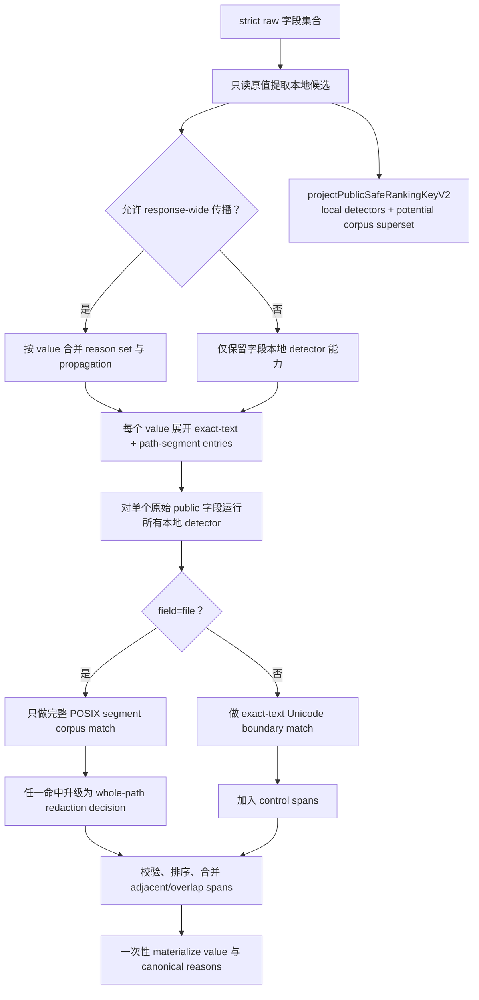

# span-redaction-corpus-policy-v2 feature design

## 0. 术语约定

| 术语 | 定义 | 防冲突结论 |
|---|---|---|
| `SensitiveSpanV2` | detector 针对收到的原始 JavaScript string 产生的 0-based UTF-16、half-open 敏感区间及 reason 集合 | 不等同于正则 match object，也不是已替换字符串上的位置 |
| local redaction | assignment、credential、connection、PII 或控制字符在其原字段内被隐藏 | 与是否获准进入 response-wide corpus 无关 |
| corpus propagation | 高置信原值从一个字段传播到其他字段的精确匹配 | 文本走 `exact-text`；路径只走 `path-segment` |
| comparison key | 仅用于判断通用 assignment 是否具备传播资格的 NFKC、trim、lower-case 值 | 不用于实际匹配或替换，不能改变 span 坐标 |
| single materialization | 所有 detector 和 corpus matcher 先在原值上产 span，canonical merge 后只构造一次输出 | placeholder 和中间输出永不重新进入 detector/corpus |
| phone corpus entry | 通过 10–15 位数字与负样本 truth table 的高置信个人数据原值 | “本地隐藏”不自动等于“允许跨字段传播” |
| `PublicSafeRankingKeyV2` | 为后续 F3/F2 冻结的保守 file/symbol 排序投影；隐藏任意合法 corpus 将来可能命中的原始 code units | 当前 F1A 只实现并验证投影函数，不接入未来 caller；不是最终 public display，也不执行 ranking |
| `SpanRedactionCorpusPolicy` | roadmap/architecture 中的 capability 名称 | 代码 façade 继续叫 `SensitiveValuePolicyV2`；二者不是平行实现 |

代码中已有 `SensitiveValuePolicyV2`、`SensitiveCorpusEntryV2`、`redactPublicFieldV2` 等名称；本 feature 保留公共 façade 名称，但把单 reason entry 升级为 reason set 与显式 propagation，不创建第二套 matcher。

## 1. 决策与约束

### 需求摘要

本 feature 修复 dormant v2 公共边界中会把 `password=a`、日期、版本号或 placeholder 放大成全响应误脱敏的问题。所有敏感检测必须基于原始字段产生 span；本地 assignment 即使低熵也始终隐藏，但只有满足冻结资格的值才进入跨字段 corpus。最终输出由一次 span merge/materialize 产生，并保持 reason provenance 与遍历顺序无关。

成功标准：

1. `password=a`、`token=1`、low-information literal 只在原 assignment 字段内隐藏，不污染其他 term/path/symbol/excerpt。
2. 合格长 secret 同时生成 text 与 path 两类传播 entry，能在文本完整边界和路径完整 segment 上传播；任意子串不得传播。
3. placeholder、Unicode、CRLF、重叠 detector 和多 reason 在不同输入遍历顺序下得到相同 bytes 与 metadata。
4. phone accept/reject truth table 可执行，日期、版本、timestamp、UUID 与短数字组不进入 phone corpus。
5. pre-ID ranking key 复用同一 policy 并对任意合法 8–512-byte corpus entry 做安全 superset：可能被最终 corpus 隐藏的 file segment 或 symbol code units 不出现在 key，且无需先知道最终 retained response。
6. 当前dormant `PublicResultAssemblerV2 → SensitiveValuePolicyV2`边界只从自身已有unsafe terms/evidence输入内部构建corpus并单次materialize，caller不能传空、删项或替换corpus；本项不要求尚未交付的F1B guard、F1C source/internal token或F6 aggregation。

### 明确不做

- 不改变 `LocateResultV2`、public placeholder、reason enum、字段 metadata 或 response-local ID 契约。
- 不实现或调用F1B的数值常量/guard算法；本feature只实现单corpus entry的8–512 byte传播资格、dormant assembler内部corpus构建与未来guard插入点的compile-only ABI ledger。
- 不修改 evidence confirmed/candidate 判定、snapshot、scope、language 或 backend 流程；只提供 F2 消费的 private public-safe key projection，不拥有 rank/budget/order。
- 不把匹配改成大小写不敏感、Unicode-normalized 或模糊搜索。
- 不引入第三方 secret/PII 扫描依赖、远程服务、可配置 low-information set 或 locale-specific phone library。
- 不切换 production v1 service/MCP/CLI 到 schema v2。

### 方案深度 pre-pass

| 候选 | 结论 | 原因 |
|---|---|---|
| 在现有顺序 `replaceAll/includes` 上增加几个负向正则 | 拒绝 | 核心安全逻辑长期维护，无法证明 placeholder 不被二次扫描、overlap reason 不丢失或 path 不做任意子串 |
| 先替换、再扫描结果以补 metadata | 拒绝 | 坐标已经失真，输出顺序会影响后续 detector，直接违反 single materialization |
| 原值 detector span + canonical merge + 单次 materialization | 采用 | 把检测、传播资格、匹配和输出构造分离；可对 Unicode 坐标、reason union 和 permutation 做精确验证 |

此处不使用fake/mock替代matcher核心；测试可直接构造corpus验证pure matcher，但当前dormant
assembler调用`SensitiveValuePolicyV2`时不暴露corpus参数。F1B/F1C/F6的未来真实integration仅记录
compile-only ABI与顺序，不属于本feature当前implementation、stable runner或DoD。

### 复杂度档位

- Security = `hardened`：处理不可信 repository 文本与跨字段 secret/PII 传播。
- Determinism = `deterministic`：span、reason、corpus entry 和最终 bytes 不受 detector/字段遍历顺序影响。
- Correctness = `contract-driven`：Unicode offset、边界谓词、phone truth table 和 low-information set 均来自 roadmap 冻结契约。
- Testability = `verified`：每类 detector、negative corpus、merge 规则和 projection 都有 owner case。
- 其余维度采用长期维护的本地 TypeScript 库默认档位。

### 关键决策

1. **detector 只返回 span，不返回已替换字符串**：所有 detector、control matcher 与 corpus matcher共享同一原始坐标系；materializer 是唯一写输出的位置。
2. **local 与 propagation 分开**：本地 assignment detector 始终产生 span；corpus builder 仅把满足 eligibility 的原值及高置信 credential/connection/email/phone 收为 entry。
3. **corpus 先按 value 聚合、再按 target mode 展开**：逻辑 registry 使用 `Map<value, Set<reason>>`；每个合格 value 固定展开为一条 `exact-text` 和一条 `path-segment` entry。两条 entry 共享同一 canonical reason set；预算的 entry count 与 `totalUtf8Bytes` 都按展开后的 entry 计量，因此同一 value 的 bytes 固定计两次，不存在实现时选择。
4. **文本边界按 Unicode code point 类别判断**：先找精确 code-unit 序列；首尾若为 `Letter|Number|Mark|Connector_Punctuation`，外侧不得紧邻同类 code point。
5. **路径传播只比较完整 POSIX segment**：inherited corpus 禁止 `includes`；路径自身 credential/PII/control detector 仍可整体隐藏路径。
6. **只有三类 reason 可以传播**：corpus entry 的 reasons 只能是 `SECRET_LIKE_VALUE | CONNECTION_STRING | PERSONAL_DATA`；`BINARY_OR_OVERSIZED_CONTENT` 与 `UNTRUSTED_CONTROL_CHARACTERS` 只属于字段本地 span。
7. **phone 分类先提取完整片段再判上下文**：固定排除日期、版本、UUID、timestamp/build cue 和不合结构的短横线数字；ambiguous Unix 数值只有存在 phone cue 才能传播。
8. **当前无双实现且dormant corpus provenance闭合**：pure matcher tests、dormant `PublicResultAssemblerV2`与Golden都调用同一`SensitiveValuePolicyV2` façade；assembler从自身已有的exact normalized terms、confirmed与candidates view内部调用唯一collector，再完成一次span materialization。API不接受caller corpus、retained array或`locationRedacted` boolean；private current-run registry把assembler input、生成的exact corpus与materialized field set绑定。空/删项/reorder/clone corpus不能作为替代输入，且F1A source/runtime graph不得import F1B/F1C/F6 future modules。
9. **pre-ID ranking key 是所有合法 corpus 的保守 superset**：`projectPublicSafeRankingKeyV2`先复用正式 local detector/control/path parser；随后不等待实际 corpus，直接把任意可能成为合法 `exact-text` target 的 symbol（原始 UTF-8 bytes `>=8`）整体投影为固定 token，并在 file 任一 POSIX segment UTF-8 bytes `>=8` 时把整个 key 投影为`[REDACTED_PATH]`。合法 corpus entry 的单项上限仍为512 bytes，但大于512 bytes的 symbol整体隐藏可覆盖其中任何可能的8–512-byte边界片段；file corpus只允许完整segment，因此大于512-byte segment不会因任意substring传播，但仍由local/oversized policy fail closed。该投影不收集corpus、不读取retained arrays、不输出reason metadata，也不回写最终public字段。F1A 当前只实现、导出 private façade并用 synthetic caller view 验证；F3/F2 实际调用边分别由其下游 child 拥有。façade不接收`matchedText`，未来调用方不得用它补secondary key。
10. **forward ABI ledger不等于当前交付**：`UnsafePublicMaterializationSourceV2 → F1A materializer → F1B field guards → F6 aggregation → F1C composer`的类型与顺序只在本design记录为compile-only下游约束；不进入F1A current stable case、runner、owner inventory、Required Artifacts或implementation scope。F1B接入dormant assembler guard由F1B拥有，F1C中性stage port与F2 real source/materialization adapter由对应后续child拥有，F6只拥有aggregation。任何下游接线都必须在其child revision独立review。

### Top 3 风险与缓解

| 风险 | 缓解 |
|---|---|
| UTF-16 span 切开 surrogate 或 CRLF，或错误处理 combining mark code point，造成输出损坏 | S2 建立 span validator/merge/materializer 与 emoji、combining mark、孤立 surrogate、LF/CRLF blocking fixtures；只承诺 code-point boundary，不宣称 grapheme-cluster segmentation |
| eligibility 或 phone 规则仍把低熵/日期传播到所有字段 | S3/S4 使用冻结 truth table、N/N±边界与 local-only 对照，Golden 做 forbidden/over-redaction scan |
| 多 detector overlap 或 corpus 遍历顺序改变 reason/bytes | S2/S5 做 reason set canonicalization、detector/corpus/field permutation 与 exact bytes 测试 |
| ranking key 低估未来 corpus 或反向读取最终 response，形成顺序侧信道/循环依赖 | F1A-RANKKEY-001 穷举合法 entry 边界与 mutation；key 只做保守 superset，F2/composer 禁止重排或回读 |

### 非显然依赖、关键假设与基线风险

- 依赖已完成的 F1 `PublicResultAssemblerV2`、strict v2 schema、metadata cross-field invariant 与 no-cutover test seam。
- 假设 reason enum 顺序继续以 `REDACTION_REASON_CODES_V2` 为唯一顺序来源；增加 reason 属于 roadmap contract change。
- 假设 low-information set 只能由 roadmap update 修改；实现不得从环境或配置扩展。
- F1B拥有source `4 MiB`、corpus `128 entries / 32 KiB`、public field与serialized budgets，但其guard尚未交付；F1A current implementation不import/call这些guards。F1B child负责把它们接到dormant assembler；F2/F6/F1C后续再完成real execution integration。
- 所有可传播 corpus value（包括 fixed credential、connection、email、phone）都必须满足原值 8–512 UTF-8 bytes；不足 8 或超过 512 时仍可本地隐藏，但不得生成 corpus entry。
- 后续 F3 expanded safe-candidate builder 与 F2 selector/ranker 只能消费本feature的private `PublicSafeRankingKeyV2`；F1A 当前验收不创建或调用这些未来 owner。opaque file/hit refs与canonical bucket identity由F3拥有。F1A不读取canonical identity、stable pool、anchor、tier、matchedText或budget，不解决safe-key collision，也不承诺ranking key等于最终display bytes。
- roadmap真实integration按F1C neutral preparation port、F2 real source/materialization adapter与F6 request-outcome owner串接；F1A本轮仅冻结forward ABI ledger，真实integration为dependency-gated N/A且不进入当前DoD。禁止为满足future接口提前创建下游文件、runner case或transport/v2 edge。
- 当前定向基线 `npm test -- --group public-output-v2` 为 46 passed / 168 skipped，build/typecheck 通过；现有误行为已用探针确认，不能把旧测试通过误当成 F1A 已满足。
- CodeStable doctor 的历史 debug-cli P1 与本 feature 无关，验证时单独归因。

### 必跑验证与交付物

- 必跑：build、typecheck、F1A unit cases、public-output-v2 Golden、完整 public-output-v2 group、全量 unit/Golden 与 no-cutover。
- 交付物：span/corpus类型与façade、detector/merge/dormant assembler single materializer、eligibility与phone truth table fixtures、current-run internal corpus provenance matrix、public-safe ranking key与superset mutation、current executable case/fixture ownership inventory、forward ABI ledger/current-scope separation inventory、permutation/amplification/forbidden scan、runner registry、architecture check/update、独立review/QA/acceptance证据。
- 清洁度：禁止真实凭证、本机路径、调试输出、临时 TODO/FIXME、注释掉代码、无用 import、未登记 snapshot 更新；所有 hostile 值必须是显式合成 fixture。

## 2. 名词与编排

### 2.1 名词层

#### 现状

- `src/evidence/public-output/sensitive-value-policy-v2.ts` 同时拥有常量、identifier 分词、assignment/credential/connection/PII detector、递归 corpus 收集、路径校验、逐次替换和 control sanitizer。
- 当前 `SensitiveCorpusEntryV2` 只有单个 `reasonCode`；相同值后写会覆盖先写，无法表达 reason set union。
- `redactText` 在已经修改的字符串上依次执行 assignment replacement、credential/connection/PII replacement、`replaceAll` corpus、identifier replacement 和 control replacement；placeholder 会再次进入后续 matcher。
- `redactFile` 对 inherited corpus 使用 `value.includes(token.value)`；当前 phone regex 会把日期/版本类数字视为 PII。
- `src/evidence/public-output/public-result-assembler-v2.ts` 先递归收 corpus，再逐字段调用 `redactPublicFieldV2`，是 F1 dormant public seam。

#### 变化

冻结并实现以下内部契约：

```ts
type CorpusPropagationModeV2 = 'exact-text' | 'path-segment';

type CorpusPropagationReasonCodeV2 = Extract<
  RedactionReasonCodeV2,
  'SECRET_LIKE_VALUE' | 'CONNECTION_STRING' | 'PERSONAL_DATA'
>;

interface SensitiveSpanV2 {
  readonly start: number;
  readonly end: number;
  readonly reasonCodes: readonly [
    RedactionReasonCodeV2,
    ...RedactionReasonCodeV2[],
  ];
}

interface SensitiveCorpusEntryV2 {
  readonly value: string;
  readonly reasonCodes: readonly [
    CorpusPropagationReasonCodeV2,
    ...CorpusPropagationReasonCodeV2[],
  ];
  readonly propagation: CorpusPropagationModeV2;
}

interface SensitiveCorpusV2 {
  readonly entries: readonly SensitiveCorpusEntryV2[];
  readonly totalUtf8Bytes: number;
}

function redactPublicFieldV2(
  original: string,
  field: PublicFieldKindV2,
  corpus: SensitiveCorpusV2,
): PublicFieldRedactionV2;

interface PublicSafeRankingKeyV2 {
  readonly file: string;
  readonly symbol: string;
}

function projectPublicSafeRankingKeyV2(input: Readonly<{
  readonly file: string;
  readonly symbol?: string;
}>): PublicSafeRankingKeyV2;
```

`collectSensitiveCorpusV2`与`redactPublicFieldV2`仍是同一 deep module 的 pure internal/test
surfaces；当前 F1A 可执行路径只把它们挂在 dormant `PublicResultAssemblerV2` 内部，并由 assembler
从同一次 synthetic raw input 内部收集 immutable corpus。caller 不能提交 corpus，collector/redactor
不从 package root 导出。当前 runner 只验证 assembler 内部 corpus 与同次输入 provenance、span
合并、一次 materialization、public-safe ranking-key 和 no-cutover，不拥有任何 F1B/F1C/F2/F6
文件、类型或运行时调用。

##### Forward ABI ledger（非可执行、由下游 child 拥有）

以下签名仅冻结后续 child 的对接形状，不属于 F1A 当前 implementation、stable case、runner owner、
Required Artifacts 或 DoD；F1A 源图不得 import 或实现这些符号：

```ts
interface PublicMaterializationContributionV2 {
  readonly owner: 'public-materialization';
  readonly locationRedacted: boolean;
}

interface TrustedMaterializedEvidenceCoreV2 {
  readonly normalizedTerms: readonly MaterializedPublicTermV2[];
  readonly confirmed: readonly MaterializedEvidenceWithoutIdentityV2[];
  readonly candidates: readonly MaterializedEvidenceWithoutIdentityV2[];
  readonly contribution: PublicMaterializationContributionV2;
  readonly proof: PublicMaterializationProofV2;
}

function materializePublicEvidenceV2(
  source: UnsafePublicMaterializationSourceV2,
  execution: LocateExecutionTokenV2,
): TrustedMaterializedEvidenceCoreV2;
```

| 下游 child | 后续 owner 边界 |
|---|---|
| F1B | 实现 corpus aggregate guard、逐字段 budget guard及 dormant assembler/schema 接入 |
| F1C | 实现 neutral preparation port、canonical execution/accessor 与 finalizer/composer 边界 |
| F2 | 在 snapshot/ranking proof 就绪后实现真实 unsafe source/materialization adapter |
| F6 | 实现 request-outcome aggregation 与 contribution 消费 |

目标态 pipeline 仍是“真实 source → 内部唯一 corpus → F1B budgets → trusted materialized core →
F6 aggregation → F1C composition”，但只能由上述下游 child 逐段实现和验收；F1A 不能提前创建
`UnsafePublicMaterializationSourceV2`、`LocateExecutionTokenV2`、ranking/snapshot proof registry、
F1B guard 或 F6 aggregator。未来 provenance hostile matrix 也必须登记在实际 owner child，不能
借 F1A 当前 runner 预占。

同一个 `projectPublicSafeRankingKeyV2` 同时服务 F3 的 pre-cap expanded candidate view、
F2 的 pre-read selector 与 purge 后 ranker；它只返回安全投影，不返回raw保留标志、
canonical identity或可用于从safe collision中挑选成员的fallback。distinct refs发生
safe-key collision时由 F3/F2 的原子等价类规则处理，F1A不得读取raw值破平局。

`SensitiveSpanV2` 必须满足 `0 <= start < end <= original.length`，起止均为 Unicode code-point boundary，且 `reasonCodes` 非空；空 reason、非法坐标或切开 code point 的 span 都是 programmer contract violation，F1 materializer最终 fail-closed 为 fixed safe `INTERNAL_ERROR`。span 按 `(start,end,reason enum order)` 排序，overlap 或 adjacent span 合并，reason set canonical union。

corpus 的 canonical pipeline 固定为：

1. 逻辑 registry 的 key 是原始 `value`，value 不 normalization；reason 只允许 `SECRET_LIKE_VALUE | CONNECTION_STRING | PERSONAL_DATA`。
2. 同一 value 的 reason 先 union 并按 `REDACTION_REASON_CODES_V2` 顺序投影。
3. 每个合格 value 按固定 mode 顺序 `exact-text, path-segment` 展开两条 entry。
4. entry comparator 为 `Buffer.byteLength(value, 'utf8')` 降序 → 原始 value 的 code-unit lexicographic 升序 → mode enum 顺序；reason 已在 entry 内 canonical。
5. `entries.length` 按展开后两条计数；`totalUtf8Bytes` 等于所有展开 entry 的 `Buffer.byteLength(value, 'utf8')` 之和。同一 value 固定计两次；后续 F1B guard 只能消费该口径。
6. 所有 entry 的 value 都满足 8–512 UTF-8 bytes。低熵 generic assignment 和不满足该 byte 区间的高置信 value 仍可产生 local span，但不进入 registry。

示例：

```ts
// 来源：roadmap §4.4 与 public-contract-v2 §4
const corpus = collectSensitiveCorpusV2({
  normalizedTerms: [{ value: 'password=a', caseSensitive: false }],
  confirmed: [{
    location: {
      file: 'src/catalog.ts',
      excerpt: 'password=a; token=LongSecret-42; use(LongSecret-42)',
    },
  }],
});

redactPublicFieldV2('password=a; cat', 'excerpt', corpus);
// → 'password=[REDACTED]; cat'
// `a` 不进入 corpus，`cat` 不因路径/文本子串被改写

redactPublicFieldV2('LongSecret-42', 'term', corpus);
// → '[REDACTED]'，reasonCodes 为 canonical reason set
```

```ts
// 来源：public-contract-v2 phone truth table
collectSensitiveCorpusV2({
  excerpt: 'phone=2125551234; build=20260723153000; timestamp=1690000000',
});
// → phone 值可进入 PERSONAL_DATA corpus；
//   build/timestamp 值不得成为 phone corpus entry
```

assignment extractor 只剥语法引号；local detector 使用原始捕获值产生 span。comparison key 只做 eligibility：原值 8–512 UTF-8 bytes、key 至少 4 个 distinct Unicode code point、非纯数字且不在冻结 low-information set。传播匹配继续使用原值、case-sensitive、无 normalization。

##### Interface 设计检查

- Module：`SensitiveValuePolicyV2`，改造为 façade + 内部 span/corpus/detector/materializer deep module。
- Interface：当前 dormant assembler caller 只提交 synthetic raw input，不知道/不能提供 corpus；pure field tests可提交原字段、field kind与immutable synthetic corpus。ranking caller只提交raw file/symbol并得到冻结safe key。trusted source/execution/core 仅见 forward ABI ledger，当前不实现。
- Seam：当前 seam 位于 dormant `PublicResultAssemblerV2` 内部 collector 与 field redactor 之间；F1B/F1C/F2/F6 的真实 source、guard、core、aggregation、composer/serializer 接线属于下游 child，不进入 F1A 当前 source graph。
- Depth / locality：跨字段传播和字段适配复杂度留在模块内；删除模块会迫使 term/file/symbol/excerpt 各自重写 detector、matcher 与 metadata 规则。
- Dependency strategy：纯 in-process、local-substitutable；无 remote-owned dependency。
- Adapter：无 adapter。只有一个本地实现，不制造 production/test 假 seam。
- Test surface：local-only、eligible propagation、path segment、phone truth table、placeholder stability、dormant assembler内部 corpus provenance与ranking-key superset从façade输出观察；非法span、merge、detector-output permutation与任意合法corpus-entry mutation通过同一实现内部pure surface观察，不复制matcher。真实 trusted source/core provenance由实际下游 owner 验收。

##### 四字段 adapter truth table

| Field | 本地 / corpus detector | control 与换行 | 命中后的输出 | metadata / status |
|---|---|---|---|---|
| term | assignment、credential/connection/PII、敏感 identifier segment、`exact-text` corpus | CR/LF/TAB、其他 C0/DEL、ANSI、bidi 均产生 control span | 每个 merged span 一个 `[REDACTED]`；malformed/oversized 保留 F1 固定 oversized placeholder，最终 byte 数值由 F1B 冻结 | 仅在实际替换时出现 term redaction，reason canonical；不单独改 status |
| symbol | 与 term 相同 | 与 term 相同 | 与 term 相同 | location metadata 精确含 symbol；不单独改 status |
| excerpt | assignment RHS、credential/connection/PII、`exact-text` corpus；不对普通 identifier 名称做全局隐藏 | `CRLF/CR → LF` 属同一次 materialization 的无 metadata canonicalization；LF/TAB 允许，其余 control/ANSI/bidi 产 span | 局部 merged span placeholder；malformed secret/template 或 oversized 走固定 oversized placeholder | location metadata 精确含 excerpt；不单独改 status |
| file | 路径自身 credential/connection/PII/敏感 identifier/control detector + `path-segment` corpus；raw locator invariant 先验证 | 任一 CR/LF/TAB/C0/DEL/ANSI/bidi 均视为 display threat | **任一敏感命中都升级为整个 `[REDACTED_PATH]`，绝不输出部分脱敏路径**；真实安全文件名 `[REDACTED_PATH]` 保持原值 | `resolvable=false`、file metadata、派生一次 `LOCATION_REDACTED`；无命中时 `resolvable=true` 且无 file metadata |

四字段 malformed/oversized 的“固定 placeholder + `BINARY_OR_OVERSIZED_CONTENT`”语义继承 F1；F1A 不改变最终 byte threshold，F1B 按资源合同替换 interim 数值。raw locator 结构不合法仍使 materializer/finalizer safe `INTERNAL_ERROR`，不能先隐藏路径后继续 success。

### 2.2 编排层

#### 现状

当前拓扑是“递归收字符串 → Map 单 reason → 每个字段按固定正则顺序反复替换 → 再扫描已修改值”。顺序同时决定输出和 provenance，且 path 使用任意子串。

#### 变化

主流程存在 corpus eligibility、字段类别分支、多个并行 detector 与 merge/materialize，采用流程图：



流程级约束：

- corpus 构建和字段 redaction 均为纯函数；不得写日志、读文件或访问环境。
- detector 全部读取相同原值；任何 detector 不得接收另一个 detector 的替换结果。
- span touching CR 或 LF 时覆盖整个 CRLF；孤立 surrogate 作为 unsafe span 处理，合法 pair 不得切开。
- 相同输入的对象 key 顺序、field iteration、detector 顺序和 corpus entry 顺序变化不得改变 public bytes。
- path corpus 只按 `/` 分段精确等值；本地 path detector 命中任一敏感内容时仍整体输出 `[REDACTED_PATH]`。
- phone negative 只禁止 corpus entry；若同字段的 assignment/credential rule 命中，local redaction 仍可发生。
- term/symbol/excerpt 使用 `exact-text` entries；file 只使用 `path-segment` entries。mode 不能由 caller 或字段运行时改写。
- text materializer 的 UTF-16 长度满足 `output.length <= original.length + M * TOKEN_PLACEHOLDER_V2.length`，UTF-8 bytes 满足 `byteLength(output) <= byteLength(original) + M * byteLength(TOKEN_PLACEHOLDER_V2)`，其中 `M` 是从原值生成并 canonical merge 后的 span 数；每个 merged span 恰好产生一个 placeholder。excerpt 的 CRLF canonicalization 只缩短、不放大；whole-path 与 oversized 分支输出固定常量长度。
- F1B aggregate guard 尚未存在时，F1A 不截断 corpus；任何临时 cap 都不得冒充最终资源契约。
- 任意内部 invariant failure 交由 materializer/finalizer 归一为 safe `INTERNAL_ERROR`，不暴露 span/value/bytes。
- ranking key不接收实际corpus或retained arrays；symbol `>=8` bytes与file任一`>=8`-byte segment的保守折叠保证所有合法corpus target均已被覆盖。raw file/symbol不得作为隐藏的secondary comparator。

### 2.3 挂载点清单

本 feature 不引入新的外部挂载点。现有 dormant `PublicResultAssemblerV2 → SensitiveValuePolicyV2` 调用边改为内部消费 immutable `SensitiveCorpusV2`；同一private façade额外冻结`projectPublicSafeRankingKeyV2`供后续F3/F2 child接入，但F1A当前不创建未来caller、不挂入production output、不导出package root。production Evidence Engine、MCP、CLI和docs均不得新增v2 output edge。

### 2.4 推进策略

1. **结构微重构**：先把现有 façade 内可原样移动的 contract、detector/corpus 与 materialization 职责拆开，保持行为和导出不变。退出信号：build/typecheck 与现有 public-output-v2 tests 全绿，行为 snapshot 零变化。
2. **span 基础设施**：建立坐标校验、reason canonicalization、sort/merge、single materializer 与显式放大上界。退出信号：Unicode、adjacent/overlap、CRLF、非法 span 与 amplification cases 全部可证伪，并登记 runner/case owner。
3. **corpus 资格与匹配**：实现 local/propagation 分离、comparison key、low-information set、exact-text/path-segment matcher。退出信号：低熵 local-only 和长 secret 跨字段 truth table 全绿。
4. **phone 与高置信 detector**：实现 accept/reject/cue 规则并统一成 span producer。退出信号：冻结电话表及边界变体逐项通过。
5. **dormant assembler 与 ranking-key seam hardening**：让 dormant assembler 从同次 synthetic raw input 内部构建 corpus并一次 materialize；补 current-run corpus provenance、ranking-key superset mutation、permutation、placeholder、forbidden scan和no-cutover回归。退出信号：caller不能注入 corpus，跨输入/clone corpus拒绝，任意合法corpus target不出现在safe key，定向及全量验证均通过且raw hostile corpus不出现在任何 dormant projection；source graph不出现F1B/F1C/F2/F6 runtime/type import。

### 2.5 结构健康度与微重构

#### 评估

- 文件级 — `src/evidence/public-output/sensitive-value-policy-v2.ts`：547 行；混合 contract、五类 detector、corpus traversal、path validation、span 等价替换与 materialization，职责超过两个；本次会改动多处相互独立逻辑。
- 文件级 — `src/evidence/public-output/public-result-assembler-v2.ts`：当前261行；F1C/F6目标态会把它收敛为materialized composer/serializer，本次只把field policy与当前 dormant corpus/materialization seam移出，不提前创建post-field-budget core或重复拆composer。
- 目录级 — `src/evidence/public-output/`：当前 3 个同层文件，命名围绕 public output，新增内部模块后仍低于摊平阈值；不需要子目录重组。
- compound 检索未命中目录/命名约定。

#### 结论：微重构（拆文件）

#### 方案

- 搬什么：把现有常量/类型、纯 detector/corpus helper、纯输出 helper 从 547 行 façade 中按职责原样移动；保留 façade 现有导出。
- 搬到哪：同目录的 contract/span、detector/corpus、materializer 内部模块；命名继续带 `v2`，不扩展 package/public barrel。
- 行为不变怎么验证：build、typecheck、现有 `public-output-v2` unit/Golden 全绿；首次重构 commit/diff 不更新 expected output，导出签名零变化。
- 步骤序列：
  1. 原样移动私有 helpers 与类型，更新内部 import。
  2. façade re-export/委托现有实现。
  3. 先跑现有回归并保存零行为变化证据，再开始 span 语义改造。

## 3. 验收契约

### 3.1 关键场景清单

| ID | 输入 / 触发 | 期望可观察结果 |
|---|---|---|
| F1A-SPAN-001 | emoji、combining mark code point、合法/孤立 surrogate、LF、CRLF 上产生相邻与重叠 spans，并 mutation 空 reason | 坐标不切 code point；CRLF 整对覆盖；span canonical merge；reasons 非空、唯一且枚举有序；空 reason fail closed；不把 grapheme cluster 当成承诺 |
| F1A-LOCAL-001 | `password=a`、`token=1`、`password=true/R/[` | assignment 原字段隐藏；低熵值不进入 corpus，其他字段与 `src/catalog.ts` 不被单字符/子串污染 |
| F1A-ELIGIBILITY-001 | generic assignment、connection/query/email 使用可构造的 7/8/512/513 UTF-8 bytes；fixed credential 使用每种 grammar 的真实最小正例及可构造 grammar（如 gh/JWT）的 512/513；固定长度 grammar 的不可构造边界明确记 N/A，禁止截断伪造；phone 分别覆盖 10/15 digits 与允许标点把总 bytes 推到 512/513；另含多字节字符、3/4 distinct code points、纯数字与全部 frozen sentinels | 所有 corpus entry 都满足 8–512 bytes；generic 还满足 distinct/非纯数字/非 sentinel；fixed/phone 的 grammar truth 与 corpus byte guard 分别成立；不合格值仍可 local redaction但不传播 |
| F1A-TEXT-BOUNDARY-001 | `cat` 对 `cat catalog scat cat-1`，以及带标点长 secret | 只命中契约允许的 exact-text boundary；不命中 `catalog/scat`；合格标点 secret 完整匹配 |
| F1A-PATH-SEGMENT-001 | corpus `cat` 对 `src/cat/file.ts`、`src/catalog.ts`、`src/mycat/file.ts` | 完整 `cat` segment 命中时**整条路径**变为 `[REDACTED_PATH]`；任意子串路径保持安全 locator |
| F1A-REASON-001 | 同一值被 assignment、connection、PII 与 control 多 detector 命中，并置换对象/detector/corpus 顺序 | corpus entry 只 union 三类 `CorpusPropagationReasonCodeV2`；字段 span/metadata union 全部实际 local reasons（含 control/oversized）；两类 reason 投影分别 canonical，最终 bytes 相同 |
| F1A-PLACEHOLDER-001 | 字面 `[REDACTED]`/`[REDACTED_PATH]` 与非空 corpus 同时出现 | 字面 placeholder 不因中间结果二次扫描而扩张；只有实际 span 有 metadata |
| F1A-AMPLIFICATION-001 | 重复 `password=R/[`、literal/generated placeholder、相邻/重叠 spans 与 0/1/N corpus entries 的 permutation | 每个 merged span 恰好一个 placeholder；输出满足第 2.2 节 UTF-16/UTF-8 线性上界；whole-path/oversized 为固定长度 |
| F1A-PHONE-001 | roadmap accept 表及括号、点、空格、country code 变体 | 合格 10–15 位号码以 `PERSONAL_DATA` 本地隐藏并可进入 corpus |
| F1A-PHONE-NEG-001 | ISO date/datetime、SemVer、build/release、UUID/片段、YYYYMMDDHHMMSS、`123-45-678`、timestamp cue、bare Unix 10/13 位 | 不成为 phone corpus entry；bare ambiguous timestamp 无 phone cue 时不得跨字段传播 |
| F1A-RANKKEY-001 | file segment与symbol分别覆盖7/8/512/513 UTF-8 bytes、multi-byte、local detector、control、literal placeholder；对每个合法corpus entry做插入/删除/排列mutation，并构造raw lexical order与safe order相反及两个raw path折叠为同一safe key；用synthetic caller view重复调用同一private façade，未来F3/F2 callsite记为N/A | key不含任何最终合法corpus可能隐藏的原始code units；7-byte安全值可保留，8+潜在target按固定token折叠；synthetic caller views得到exact相同投影；结果不依赖实际corpus/retained集合；不得使用raw/matchedText secondary comparator |
| F1A-PROJECTION-001 | 完整 synthetic v2 success/error 经过 structured/text/debug projection | raw eligible secret 不出现；低熵无关内容不被误删；metadata 与实际替换字段精确一致 |
| F1A-NOCUTOVER-001 | 检查 package/service/MCP/CLI reachability 与 production aggregate | production 仍只输出 schema v1；没有新增 v2 transport edge |

### 3.2 Case / fixture ownership inventory

| Runner surface | Group / case | Fixture owner | Assertion owner | Runner / manifest owner | Contract / Golden owner |
|---|---|---|---|---|---|
| unit | `public-output-v2/span-redaction` | `testkit/fixtures/public-output-v2/span-redaction-v2.ts` | `test/unit/public-output-v2-redaction.spec.ts` | `testkit/runners/runner-registry.ts`; `testkit/manifests/coverage/fixture-ownership.yaml` | `src/evidence/public-output/sensitive-value-policy-v2.ts`; `test/unit/public-output-v2-contract.spec.ts` |
| unit | `public-output-v2/corpus-policy` | `testkit/fixtures/public-output-v2/corpus-policy-v2.ts` | `test/unit/public-output-v2-redaction.spec.ts` | `testkit/runners/runner-registry.ts`; `testkit/manifests/coverage/fixture-ownership.yaml` | `src/evidence/public-output/sensitive-value-policy-v2.ts`; `test/unit/public-output-v2-contract.spec.ts` |
| unit | `public-output-v2/corpus-boundaries` | `testkit/fixtures/public-output-v2/corpus-policy-v2.ts` | `test/unit/public-output-v2-redaction.spec.ts` | `testkit/runners/runner-registry.ts`; `testkit/manifests/coverage/fixture-ownership.yaml` | `src/evidence/public-output/sensitive-value-policy-v2.ts`; `test/golden/public-output-v2.spec.ts` |
| unit | `public-output-v2/phone-corpus-policy` | `testkit/fixtures/public-output-v2/phone-corpus-v2.ts` | `test/unit/public-output-v2-redaction.spec.ts` | `testkit/runners/runner-registry.ts`; `testkit/manifests/coverage/fixture-ownership.yaml` | `src/evidence/public-output/sensitive-value-policy-v2.ts`; `test/golden/public-output-v2.spec.ts` |
| unit + Golden | `public-output-v2/redaction-amplification` | `testkit/fixtures/public-output-v2/redaction-amplification-v2.ts` | `test/unit/public-output-v2-redaction.spec.ts`; `test/golden/public-output-v2.spec.ts` | `testkit/runners/runner-registry.ts`; `testkit/runners/golden-runner.ts`; `testkit/manifests/coverage/fixture-ownership.yaml` | `src/evidence/public-output/sensitive-value-policy-v2.ts`; `test/golden/public-output-v2.spec.ts` |
| unit | `public-output-v2/public-safe-ranking-key` | `testkit/fixtures/public-output-v2/public-safe-ranking-key-v2.ts` | `test/unit/public-output-v2-redaction.spec.ts`; `test/unit/public-output-v2-contract.spec.ts` | `testkit/runners/runner-registry.ts`; `testkit/manifests/coverage/fixture-ownership.yaml` | `src/evidence/public-output/sensitive-value-policy-v2.ts`; `test/unit/public-output-v2-contract.spec.ts` |
| unit + MCP/docs regression | `public-output-v2/no-cutover-import-inventory` | `testkit/fixtures/public-output-v2/no-cutover-import-inventory-v2.ts` | `test/unit/public-output-v2-no-cutover.spec.ts`; `test/mcp/tool-output-parity.spec.ts`; `test/docs/public-output-v2.spec.ts` | `testkit/runners/runner-registry.ts`; `testkit/runners/mcp-runner.ts`; `testkit/docs/docs-smoke-runner.ts`; `testkit/manifests/coverage/fixture-ownership.yaml` | `src/index.ts`; `src/evidence/evidence.module.ts`; `test/unit/public-output-v2-no-cutover.spec.ts` |

`testkit/runners/runner-registry.ts` 是上述新增 case 的 registry owner；未知 case 必须失败。实现必须落到表中exact owner路径；若代码事实证明某路径不能成立，先返回design/design-review修订owner inventory，禁止在implementation中静默合并文件、改名或只更新snapshot。

### 3.3 明确不做的反向核对

- diff 不应改变 public v2 schema/reason enum/placeholder/ID/status contract。
- diff 不应实现或放宽 F1B aggregate/resource budgets，不应按超限静默截断 corpus。
- 代码中不应出现 path inherited corpus 的 `includes`/`replaceAll` 任意子串策略。
- matcher 不应对真实匹配值做 case-fold/NFKC/trim；这些只能出现在 eligibility comparison key。
- ranking key不应收集实际corpus、读取retained arrays、执行budget/排序，或保留任何可能被合法corpus隐藏的raw file/symbol code units。
- dormant assembler不应接收caller `SensitiveCorpusV2`；F1A source graph不应 import F1B/F1C/F2/F6 owner文件或实现 forward ABI ledger中的trusted source/core/aggregation。
- 不应新增第三方 secret/phone 库、配置化 sentinel、文件/网络/环境读取或日志。
- production v1/MCP/CLI/docs 不应出现 schema v2。

### 3.4 Acceptance Coverage Matrix

| Scenario | Covered By Step | Evidence Type | Command / Action | Core? |
|---|---|---|---|---|
| F1A-SPAN-001 | S2 | unit + exact span table | `npm test -- --group public-output-v2 --case span-redaction` | yes |
| F1A-LOCAL-001 / ELIGIBILITY-001 | S3/S4 | unit + generic/high-confidence byte boundary matrix | `npm test -- --group public-output-v2 --case corpus-policy --case field-redaction` | yes |
| F1A-TEXT-BOUNDARY-001 / PATH-SEGMENT-001 | S3 | unit + Golden | `npm test -- --group public-output-v2 --case corpus-boundaries` | yes |
| F1A-REASON-001 / PLACEHOLDER-001 | S2/S5 | permutation + exact bytes | `npm run test:golden -- --group public-output-v2` | yes |
| F1A-AMPLIFICATION-001 | S2/S5 | unit formula assertion + Golden bytes | `npm test -- --group public-output-v2 --case redaction-amplification && npm run test:golden -- --group public-output-v2` | yes |
| F1A-PHONE-001 / PHONE-NEG-001 | S4 | truth-table unit | `npm test -- --group public-output-v2 --case phone-corpus-policy` | yes |
| F1A-RANKKEY-001 | S5 | unit superset mutation + permutation | `npm test -- --group public-output-v2 --case public-safe-ranking-key` | yes |
| F1A-PROJECTION-001 | S5 | Golden + forbidden/over-redaction scan | `npm run test:golden -- --group public-output-v2` | yes |
| F1A-NOCUTOVER-001 | S5 | import inventory + MCP/docs regression | `npm test -- --group public-output-v2 --case no-cutover-import-inventory && npm run test:mcp -- --all && npm run test:docs` | yes |
| v1/v2 全量回归 | S5 | command logs | `npm test && npm run test:golden -- --all` | yes |

### 3.5 DoD Contract

| ID | 要求 | 证据 | 阻塞级别 |
|---|---|---|---|
| DOD-DESIGN-001 | design/checklist 与 roadmap span/corpus contract 完整对齐 | independent design review | blocking |
| DOD-IMPL-001 | S1-S5 完成，所有 detector 产 span且输出只 materialize 一次；case/fixture inventory 与 runner registry 可反查 | checklist + diff + unit evidence + ownership inventory | blocking |
| DOD-REVIEW-001 | 独立 code review 无 unresolved blocking，检查 false negative 与 over-redaction | review report | blocking |
| DOD-QA-001 | Unicode、low entropy、phone negatives、permutation、projection 与 no-cutover 全绿 | QA report + command logs | blocking |
| DOD-ACCEPT-001 | acceptance 反查 contract、artifact、清洁度和 roadmap 状态 | acceptance report | blocking |

Validation Commands：

| ID | 命令 | 目的 | 核心性 | 失败处理 |
|---|---|---|---|---|
| CMD-BUILD | `npm run build` | production/CLI 编译 | core | fix-or-block |
| CMD-TYPECHECK | `npm run typecheck` | strict contract 与只读类型 | core | fix-or-block |
| CMD-F1A-UNIT | `npm test -- --group public-output-v2 --case span-redaction --case corpus-policy --case corpus-boundaries --case phone-corpus-policy --case redaction-amplification --case public-safe-ranking-key` | F1A 核心矩阵 | core | fix-or-block |
| CMD-V2-UNIT | `npm test -- --group public-output-v2` | 完整 dormant v2 回归 | core | fix-or-block |
| CMD-V2-GOLDEN | `npm run test:golden -- --group public-output-v2` | exact bytes、permutation 与 forbidden scan | core | fix-or-block |
| CMD-NOCUTOVER | `npm test -- --group public-output-v2 --case no-cutover-import-inventory` | transport/package reachability | core | fix-or-block |
| CMD-UNIT-ALL | `npm test` | v1/v2 unit regression | core | fix-or-block |
| CMD-GOLDEN-ALL | `npm run test:golden -- --all` | 全量 Golden regression | core | fix-or-block |
| CMD-MCP-ALL | `npm run test:mcp -- --all` | production v1 MCP regression | core | fix-or-block |
| CMD-DOCS | `npm run test:docs` | public docs/schema 仍为 v1 | core | fix-or-block |
| CMD-DOCTOR | `python .codestable/tools/codestable-doctor.py --root .` | artifact hygiene | supporting | document-baseline |
| CMD-DIFF-CHECK | `git diff --check` | whitespace 与 patch 清洁度 | supporting | fix-or-block |
| CMD-SPEC | `python .codestable/tools/codestable-spec-governance.py --root . analyze` | spec 路由与 artifact 漂移 | supporting | fix-or-block |
| CMD-SCOPE-CHECK | `python .codestable/tools/codestable-scope-gate.py --feature-dir .codestable/features/2026-07-24-span-redaction-corpus-policy-v2 --allow-file .codestable/features/2026-07-24-span-redaction-corpus-policy-v2/span-redaction-corpus-policy-v2-scope-allow.txt --check-path . --cleanliness-path src/evidence/public-output --cleanliness-path test/unit --cleanliness-path test/golden --cleanliness-path test/mcp --cleanliness-path testkit --stage implementation.before_review` | exact full-root changed-path scope 与清洁度 | core | fix-or-block |

Required Artifacts: span contract/validator/merge/materializer、dormant assembler current-run internal immutable corpus provenance report、forward ABI ledger/current executable owner separation proof、eligibility/phone truth tables、public-safe ranking-key superset mutation report、case/fixture ownership inventory、runner registry delta、amplification/permutation fixtures、forbidden/over-redaction report、architecture update/check result、exact scope allow manifest、full changed-path inventory、scope/diff cleanliness evidence、review/QA/acceptance。

Required Actions：

| ID | 动作 | 证据 | 阻塞级别 |
|---|---|---|---|
| ACT-ARCH-CHECK | 在 acceptance 前执行 `cs-arch check` 语义核对：比较 public-output 当前代码事实与 architecture；有漂移则 update，无系统级变化则记录 no-change 理由 | architecture check/update report | blocking |
| ACT-SCOPE-CHECK | implementation preflight冻结ambient baseline，维护machine-readable exact allow manifest；以`--check-path .`将scope gate、`git status --short`、unstaged/staged/untracked changed paths与本feature artifact inventory对比，确认无ambient roadmap/runtime/user文件夹带 | scope allow manifest + scope gate JSON + full changed-path inventory | blocking |

### 3.6 自我批判结论

- 可证伪性：所有规则均落到具体边界值、truth table、线性输出公式、exact bytes 或禁止 reachability。
- 步骤原子性：先纯移动，再 span、corpus、phone、projection hardening；每步可独立退出。
- 最弱依赖：旧 façade 职责过密，先以零行为微重构建立边界，避免在同一大文件继续叠加安全逻辑。
- 证据完整性：false negative 与 over-redaction 均有证据；不是只扫描“secret 不存在”。
- 基线可执行性：复用已通过的 build/typecheck/v2 定向基线，新增 case 必须注册，避免 unknown case 假绿。
- 接口深度：当前 dormant assembler caller只传synthetic raw input且corpus在内部生成，pure field tests才传synthetic corpus；ranking caller只传file/symbol；Unicode/matcher/current-run provenance与保守superset复杂度集中在同一实现内部。trusted source/execution/core只作为下游 forward ABI，不进入当前可执行面。

## 4. 与项目级架构文档的关系

acceptance 后应把 architecture capability `SpanRedactionCorpusPolicy`（代码 façade：`SensitiveValuePolicyV2`）的当前实现事实提炼到 public result boundary 架构说明：dormant assembler内部corpus provenance、原值 span、local/propagation 分离、single materialization、exact-text/path-segment、phone negative policy与pre-ID public-safe ranking-key superset。F1B/F1C/F2/F6 真实接线只保留为 forward ABI ledger，待对应 child acceptance 后再写为当前事实。接口不改变外部 public schema，不新增 ADR；若实现需要接受caller corpus、改变 low-information set、span 坐标、reason enum、placeholder、phone truth table或safe-key保守边界，必须返回 Epic roadmap update，不能在 feature 内静默修改。
