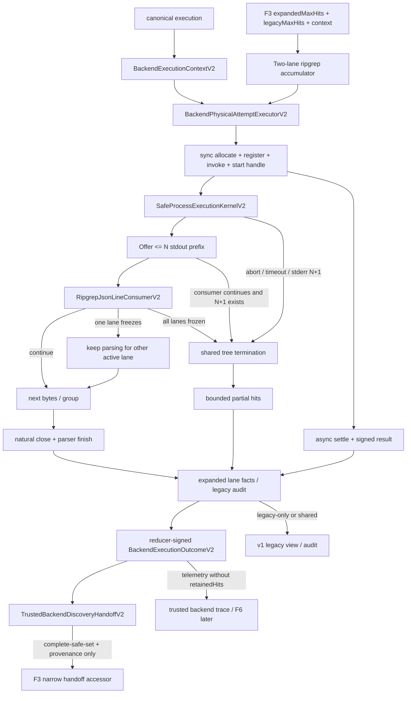

# streaming-ripgrep feature design

## 0. 术语约定

| 术语 | 定义 | 边界 |
|---|---|---|
| observed N+1 byte | child stream 在已接受 N bytes 后到达的下一byte | 该byte只作为limit sentinel，不保留、不交给consumer |
| stdout consumer | 同步消费有界bytes并回报已消费前缀与continue/stop的private port | 不理解process tree、timeout或stderr |
| line framer | 按LF切分raw bytes、剥离紧邻LF的单个CR、按raw bytes限制单行 | 不先把全部stdout转成string |
| complete safe set | backend所有active groups自然完成且parser完整、未触发任何termination的hits集合 | 唯一可进入F3 safe pool/F2 selector的outcome |
| bounded attempt telemetry | incomplete expanded attempt在上限内已解析并标准化的hits | `retainedHits`只供F5内部有界诊断并派生`hitCount`；F6只接收逐union member移除`retainedHits/selectionEligibility`后的public-neutral telemetry，legacy由独立lane物化 |
| logical backend attempt | 一次canonical execution中一个backend的完整逻辑search；可包含多个ripgrep case groups/processes | F6最终每backend最多一条ledger |
| multi-view lane | F3同一次backend adapter orchestration中的expanded或legacy观察者，各有独立cap、冻结时点和fallback decision | 一个lane冻结不等于立即停止共享OS process |
| consumer stop | 所有仍活动lane都不再需要当前process时，consumer在一个非空byte prefix内请求终止 | process边界只记录stop；RipgrepBackend映射为`early-stop` |
| consumer invalid | fatal UTF-8、line超限、malformed/unknown JSON event或final unterminated line | 映射为backend `process-error`，不输出原文 |
| protocol-complete group | `begin/match|context/end`全部平衡、唯一terminal summary已验证且summary后无event的group | exit 0/1都必须先满足该条件 |
| termination trigger | abort/timeout/output/consumer等第一个被纯reducer接受的原始停止原因 | process close/exit是completion candidate，与最终cleanup/consumer settlement verdict分离 |
| trusted backend trace | 由F5 execution-local registry绑定expanded-v2 logical outcomes、其首次相关物理启动顺序与CodeGraph health observation的request-local事实 | legacy-only物理调用只进compatibility audit；F6消费trace但F5不创建public owner |
| legacy compatibility audit | 记录只服务legacy lane的plan/group/fallback及旧物化分支 | 不进入F6 trace，不改变expanded-v2 outcome/status |
| backend execution context | canonical executor为每次locate创建的F5 opaque context，内部独占preparation、physical start、result signer、logical reducer、trace与legacy audit registries | Nest backend singleton与F3只传context，不持runner/preparation port或request-global maps |

## 1. 决策与约束

### 需求摘要

本feature修正`NodeSafeProcessRunner`当前“exact N即limit”的off-by-one语义，并为ripgrep stdout增加不缓冲完整输出的同步consumer。process boundary只负责bytes、primary-trigger冻结、settlement/cleanup verdict、树终止和settle-once；RipgrepBackend负责JSON Lines framing、UTF-8/shape、hit构造、case groups与`maxHits`。两层共同产出统一`BackendExecutionOutcomeV2`，但不聚合request-level status、abortSource、limits、degradations、strategy或nextActions。

成功标准：

1. stdout/stderr累计恰好N bytes并自然close时成功；只有观察到N+1才触发对应output limit，retained/delivered bytes始终`<=N`。
2. buffered `run()`与streaming `runStreaming()`复用同一process lifecycle kernel；shell/env/tree cleanup/timeout/abort/settle-once语义不分叉。
3. ripgrep JSON按raw LF流式切分，支持UTF-8 code point、CRLF和JSON line跨任意chunk；fatal UTF-8、空行、unknown event、malformed match、单行N+1或EOF残片全部fail closed。
4. expanded与legacy lane共享每个active ripgrep group的一次process/parse，但各自按自己的cap冻结；只有所有lane都冻结或无需后续工作才consumer-stop。
5. `complete-safe-set`只允许`used/complete/none`；所有incomplete/unavailable/failed/timeout/output-limit/early-stop/aborted/process-error均为`telemetry-only`。
6. incomplete `retainedHits`永不进入F3 safe candidate pool、F2 selector、stable evidence或v2 public result；完整fallback可独立贡献自己的complete safe set。
7. F5把Ripgrep与CodeGraph的真实outcomes、启动顺序和index health observation登记为trusted backend trace，但不写F1C public owner；F6才从该trace生成backend与request-outcome fragments。
8. Node 22/24 × Windows/Linux/macOS同一F4 matrix验证N/N+1、chunk framing、early stop与cleanup。
9. process自然close与exit-code policy正交：streaming result可携带任意自然exit code和`TComplete`；ripgrep再把exit 0/1与summary truth联合验证。
10. expanded-v2 logical outcome只由expanded lane相关物理工作归约；legacy-only plan/group/fallback即使失败也不得污染F6 trace。

### 明确不做

- 不改变search terms、anchors、case grouping、scope、ranking、fallback decision或request status。
- 不把`question`用于search plan；input normalization与caller/deadline聚合属于F6。
- 不把raw stdout/stderr、JSON line、path、matched text、PID、argv或environment写入日志/artifact。
- 不实现异步consumer/backpressure协议；当前ripgrep parser为同步、有界CPU consumer。
- 不把incomplete prefix经redaction后升级为evidence；redaction不能证明safe-key等价类完整。
- 不引入stream parser第三方依赖；使用Node标准`Buffer/TextDecoder/child_process`与现有Zod。
- 不改变package engines、private、license、version或production v2 projector edge。

### 方案深度 pre-pass

| 方案 | 结论 | 原因 |
|---|---|---|
| 保留完整stdout buffer，退出后split/parse | 拒绝 | 不能在maxHits提前停止，峰值内存等于output cap |
| 在process runner直接解析ripgrep JSON | 拒绝 | 破坏generic process boundary，CodeGraph/Git等consumer被业务协议污染 |
| 为ripgrep另写第二套spawn/cleanup状态机 | 拒绝 | Windows/POSIX tree cleanup、race与settle语义会漂移 |
| 同一kernel + synchronous bounded consumer + backend parser | 采用 | bytes/lifecycle与JSON/hits所有权清晰，可分别穷举 |
| incomplete prefix先进入F3再靠finalizer过滤 | 拒绝 | cap前safe equivalence不完整，finalizer无法恢复缺失成员 |

### 复杂度档位

- Correctness：finite truth table + chunk partition invariance。
- Determinism：相同byte stream在所有chunk partition下得到相同hits/outcome。
- Performance：stdout常驻内存上界为`maxLineBytes + maxHits × bounded BackendHit`，stderr`<=maxStderrBytes`。
- Security：shell false、controlled env、fatal decode、strict event shape、telemetry-only gate。
- Compatibility：普通非边界v1 deep-exact；exact-N行为按本item批准改变；F9前不切v2。

### 关键决策

1. **单一lifecycle kernel**：把spawn/listener/timer/tree termination/hard-kill/close/cleanup/settle逻辑收敛为`SafeProcessExecutionKernelV2`。现有`run()`使用`BoundedByteCollectorV2`，新增`runStreaming()`使用caller consumer；两者不得复制listener或termination state。
2. **N+1算法**：每个stream维护`acceptedBytes`。chunk先给consumer/collector至多`N-acceptedBytes`的prefix；exact N不终止。若consumer未在该prefix内stop而chunk仍有byte，N+1 sentinel触发limit；sentinel及之后bytes不保留。
3. **consumer progress contract**：kernel只在`offered.length>0`时调用`push`。`continue`必须满足`consumedBytes===offered.length`；`stop`必须满足`Number.isSafeInteger(consumedBytes)`且`1<=consumedBytes<=offered.length`。不支持partial-continue/replay suffix；NaN、小数、负数、continue-zero、continue-partial、stop-zero、越界及partial后throw全部fixed `consumer-invalid`，因此不会死循环或丢失未定义suffix。
4. **chunk无关的stop/limit优先级**：合法partial-stop在N内先于同chunk N+1，未消费suffix被终止语义丢弃；只有consumer完整消费N-prefix并continue时，后续byte才是N+1 sentinel。该规则按stream byte offset而非Node chunk边界决定。
5. **primary trigger与settlement verdict分层**：`PrimaryTerminationTriggerReducerV2`是纯reducer，只接收带单调event sequence的`aborted|timeout|stdout-limit|stderr-limit|consumer-stop|consumer-invalid`，第一个accepted trigger冻结；process `close`的`{exitCode,signal}`是completion candidate，不是primary trigger。production callback entry分配sequence；测试通过注入式clock/spawn/event scheduler排列事件，不依赖wall clock。第二阶段`SettlementVerdictV2`只在process close、consumer finalization和cleanup都完成后按固定优先级归约：`cleanup-invariant > consumer-invalid(finalizer) > frozen primary trigger > process-exit > completed`。其中无primary且`exitCode===null`或`signal!==null`固定为`process-exit`；因此first-trigger不会被较晚abort/limit或close signal改写，但cleanup invariant必须覆盖此前任何trigger，promise仍只settle一次。
6. **consumer异常安全与同步finalizer契约**：consumer不得抛出包含input的错误。`push()` throw或invalid decision形成primary `consumer-invalid`；无primary close时`finish()`、termination时`partial()`都必须同步返回exact discriminated union `{ok:true,value}`或`{ok:false,kind:'consumer-invalid'}`。kernel只验证top-level wrapper为同步exact object；`value`由consumer注册的同步`validatePartialValue/validateCompleteValue`验证，validator throw、返回非boolean或false均invalid，但validator明确接受的nested Promise/thenable只是合法`TValue`，不能被kernel误判为top-level async finalizer。top-level throw、`Promise`/thenable、`undefined`、missing/extra key、错误discriminant或其他malformed return统一形成settlement `consumer-invalid`并丢弃stdout payload，不重试finalizer。任一路径随后都执行同一tree termination/cleanup；cleanup失败最终固定为`cleanup-invariant`。public/log只出现固定kind。
7. **stream completion与exit正交**：只有无primary trigger的close调用一次`finish()`；它必须验证decoder flush成功且pending raw line length为0。termination路径只调用一次`partial()`取得bounded telemetry，不把未终止line物化为hit。合法`finish()`与tree cleanup完成后，只有`exitCode`为nonnegative safe integer且`signal===null`才返回`completed`并保留exact exit code；`exitCode===null`、signal close、负数/小数/overflow或矛盾pair都固定`process-exit`并丢弃stdout payload。Ripgrep backend自行接受completed exit 0/1并拒绝其他整数。现有buffered `run()`兼容投影才把completed nonzero映射为旧`non-zero-exit`，不能让generic kernel提前吞掉rg exit 1。
8. **stderr保持bytes collector**：stderr不交给ripgrep parser；N/N+1语义与stdout一致。backend不得记录其内容，probe只可从成功stdout consumer取得已验证version。
9. **CRLF pending state**：framer遇CR先保存在单byte pending slot而不计payload；下一byte为LF时丢弃该CR并结束line，下一byte非LF时先把CR计入payload再处理该byte。payload中的任何raw CR显式invalid；`N payload + CRLF`合法，`N+1 payload + CRLF`在追加N+1前失败。fixtures覆盖CR|LF跨chunk、孤立CR、双CR与N/N+1。
10. **ripgrep协议FSM**：parser constructor显式接收`{allowContext:boolean}`，production固定`false`且argv不得包含context flags；因此production流中任何`context` event立即`consumer-invalid`，不能“验证后忽略”。初态允许零或多个file scope后进入唯一summary；`begin`只能在无open file且summary前出现，`match`只能在open file内且data.path与begin逐code-unit相同，每个`begin/end` scope至少含一个match，`end`关闭同一路径，summary要求无open file、全局唯一且为最后event。仅test-only `allowContext=true`时context仍必须在已有match的open scope内并完成同等path/shape验证。missing/duplicate summary、nested/unbalanced/empty begin-end、scope外event、路径错配或summary后event全部consumer-invalid。
11. **event与offset验证**：每条LF终止line用fatal UTF-8 decode；top-level只接受`{type,data}`，type仅`begin|match|context|end|summary`。path/lines/submatch只接受`text`形式；line number、absolute offset、submatch start/end为nonnegative safe integers，match line number为positive。offset按`lines.text`的UTF-8 bytes计，必须`0<=start<end<=byteLength`，slice fatal decode且逐code-unit等于`match.text`。production context event在读取其内容前即按config拒绝。
12. **summary与exit联合完整性**：summary stats中的`searches/searches_with_match/matched_lines/matches`必须是nonnegative safe integers；`searches>=completed file scopes`、`searches_with_match===含match的completed scopes`、`matched_lines===match event数`、`matches===validated submatch数`。zero-match允许`searches>0`但不允许begin/end scope。streaming completion后只有两种backend合法组合：exit 0要求至少一个match event、`matched_lines>0`且`matches>0`；exit 1要求零scope、零match event且`matched_lines=matches=searches_with_match=0`。exit 0 + zero、exit 1 + positive或其他exit全部process-error。final unterminated JSON line即使可parse也invalid。
13. **multi-view accumulator与legacy事务式group staging**：一次group parse同时更新expanded与legacy
    lane，但legacy当前group的arrival prefix、comparator top-N与N+1 count先进入bounded staging，
    只有完整valid summary + accepted exit后才原子commit；当前group parser/process/summary/exit失败
    整组discard，绝不能把partial hits带入legacy committed view。file anchors先作为既有committed
    base进入；每个group开始前只检查committed `hits.length>=legacyMaxHits`，命中时执行
    `hits.slice(0,cap).sort(compareHits)`并`complete=false`返回；所有groups自然commit后先计算
    `complete=hits.length<=cap`，再执行`hits.sort(compareHits).slice(0,cap)`。后续group失败只返回
    anchors + 先前已commit groups的`sort(compareHits)`且`complete=false`。visible file anchor、
    path normalization、source、line、reasonCodes、symbol expansion、CRLF trim与comparator逐字段
    deep-exact，不能合并两个sort/slice分支。expanded按`expandedMaxHits`保留logical hit arrival
    prefix；第N个hit形成且仍有work时冻结为early-stop telemetry-only。单event多symbol按canonical
    symbol order展开。staging cap、N/N+1与commit/discard counters为F5-MULTIVIEW-001 authority。
14. **共享process停止条件**：expanded冻结后若legacy仍需当前group，process继续但expanded不再观察hits；legacy冻结后若expanded仍活动亦同。只有所有活动lane冻结/完成，或terminal event发生，才停止当前process和后续groups。这样`expanded>legacy`、两组query、file anchors及arrival-order与sort-order反转不改变legacy view。
15. **complete-safe-set边界**：expanded只有全部active groups自然完成、FSM complete、无cap/terminal且hits不超过cap时complete-safe-set；任何expanded early freeze的raw prefix永远telemetry-only并使F3 expandedSafe为空。legacy不使用expanded prefix猜造，expanded也不从legacy top-N补齐。
16. **safe process判别联合与ENOENT/cwd identity边界**：generic streaming failure固定区分
    `invalid-request|other-spawn-error|process-exit|aborted|timeout|stdout-limit|stderr-limit|
    consumer-stop|consumer-invalid|cleanup-invariant`；`executable-not-found`只属于dedicated
    availability execution，`non-zero-exit`只属于buffered compatibility projection。generic
    `run()/runStreaming()`即使spawn返回ENOENT也一律`other-spawn-error`。execution-scoped
    `BackendPhysicalAttemptExecutorV2.prepareAvailabilityProbe()`内部独占
    `ExecutableAvailabilityPreparationPortV2`，只返回exact
    `{ok:true,prepared}|{ok:false,kind:'other-spawn-error'}`，捕获realpath/stat/validation异常且不
    reject raw error。prepared private record绑定backend、executable、real
    `codegraph status --json <repositoryRoot>`或`rg --version` argv class、exact request snapshot、
    cwd realpath、bigint `{dev,ino}`、execution与nonce；它不登记start。
    `startAvailabilityProbe()`同步原子执行`allocate ordinal → register binding → invoke runner →
    freeze one-use start handle`，不能先spawn后登记；异步settle后
    `settlePhysicalAttempt()`才签result并绑定exact handle。dedicated result区分
    `executable-not-found|other-spawn-error`且不返回旧`SafeProcessResult`。只有稳定平台
    not-found code后重新realpath/stat与prepared cwd/identity逐项相同才是not-found；其余
    cross-executable/probe/request、reuse、nonce/handle替换、cwd replacement/stat race、
    clone/cross-execution均为fixed other-spawn。
17. **no-start/no-child/outcome语义三分与可信no-start provenance**：a) generic runner
    invalid/pre-aborted/spawn failure返回`SafeProcessNoChildResultV2`，不属于F5 executor trace；
    b) availability preparation failure返回由execution-scoped executor登记exact identity的最小
    `AvailabilityProbePreparationFailureV2 other-spawn-error`，start/ordinal/logical outcome均0；
    pre-aborted必须由context绑定的exact request `AbortSignal`在尚无该backend start时被executor
    当场观察。executor只通过两个条件化方法签opaque `BackendNoStartObservationV2`，分别验证
    same-context preparation failure identity，或same-context exact signal identity且
    `signal.aborted===true`；不接受caller提供的`BackendNoStartCauseV2`、普通
    `{kind:'pre-aborted'}`或结构化preparation object。decision factory只消费same
    context/execution的一次性observation并从registry恢复backend/reason/zero-start counters，
    再签`BackendNoStartDecisionV2`；not-aborted、signal/failure clone、swap、reuse、
    cross-backend/context/execution及observation clone/reuse都在handoff前fixed invariant失败。
    decision可进入F3 handoff的`kind:'no-start'` terminal分支，但不得伪造ordinal、logical
    attempt或outcome；c) 已进入executor但OS未取得child仍有ordinal与signed physical result，
    availability not-found映射unavailable，其余映射failed/process-error。所有no-child execution
    行的consumer finalizer与tree cleanup为0；只有取得child handle后的termination调用
    `partial()`与tree cleanup。pre-aborted或invalid在executor前失败，无logical outcome、
    fallback只由既有lane policy决定；不得为零start伪造failed outcome。
18. **backend mapping与outcome严格联合**：process已启动后的other spawn/process-exit/malformed/
    illegal exit/cleanup→`failed/incomplete/process-error/BACKEND_PROCESS_FAILED`；local timer→
    `failed/incomplete/timeout/BACKEND_PROCESS_FAILED`；executable-not-found→backend-specific
    unavailable；shared request signal在probe/search已启动后→
    `used/incomplete/aborted/BACKEND_ABORTED`。complete zero-hit reason必须与backend匹配，
    nonzero complete无reason，early-stop/output-limit无reason，unavailable retained为空。
    private factory deep-freeze shape并签execution-bound `ValidatedBackendExecutionOutcomeV2`。
    `requireBackendExecutionOutcomeV2`供F5内部诊断；F6不直接拿opaque outcome数组，而由trace
    accessor取得去除`retainedHits`的`BackendExecutionTelemetryViewV2`。
19. **F3 exact四参数handoff与started/no-start terminal union**：F5 revision原子把F3 pre-F5 port
    替换为
    `searchViews(request,signal,backendExecutionContext,execution) →
    Promise<TrustedBackendDiscoveryHandoffV2>`；F3/F5两份声明必须由同一个compile fixture引用，
    禁止三参数/四参数漂移，且signal必须与context factory登记的exact request signal同一identity。
    handoff的`kind:'started'`只接受reducer-signed
    `ExpandedBackendLogicalAttemptV2`，factory从attempt registry取得same outcome/full-set；
    `kind:'no-start'`只接受same-context one-use observation签发的
    `BackendNoStartDecisionV2`，没有outcome/ordinal/attempt，
    expanded固定empty/incomplete/cannot-skip-fallback，但仍携带adapter-owned exact legacy terminal
    result、`legacyCap===request.legacyMaxHits`与fallback decision。两分支都绑定exact request
    `expandedMaxHits/legacyMaxHits`、backend、context、execution、health、legacy、fallback与lane
    audit。F3 accessor额外接收`expectedRequest`并在任何value前验证；started complete-safe hit
    identity及`querySeedKeys/matchedAnchorKeys`可见，noneligible/no-start raw prefix不可达。
20. **physical result→closed-set reducer→handoff是单一authority**：每个signed physical result必须
    来自exact start handle；backend调用
    `createExpandedLaneAttemptFactsV2(result,laneFacts,context,execution)`时factory同时在context
    registry登记facts，且只接受expanded-related lane。caller不能把facts数组交给reducer。
    `sealExpandedBackendAttemptSetV2(context,backend,execution)`从registry读取该backend全部
    expanded-related starts，要求每项settled且恰有一个facts，拒绝missing/duplicate/unsettled/
    wrong-lane/reorder/late-start，并永久关闭该backend expanded set；legacy-only显式排除且只进
    audit。`ExpandedBackendAttemptReducerV2.reduce(seal,execution)`按sealed first ordinal签每backend
    至多一个logical attempt；`requireExpandedBackendLogicalAttemptV2`是取得same
    `ValidatedBackendExecutionOutcomeV2`的唯一accessor。outcome factory不接受caller裸shape，
    private record绑定context、seal与完整physical result set。handoff与trace都只消费该attempt。
21. **CodeGraph receipt覆盖所有started terminal，trace可总是finalize**：唯一
    `createCodeGraphProbeReceiptV2(result,context,execution)`先验证signed
    `BackendPhysicalAttemptResultV2<AvailabilityProbeExecutionResultV2>`；completed分支在factory内
    strict解析status，valid映射available/missing-index，malformed/exit error映射error；
    executable-not-found映射tool-unavailable，other-spawn/process/timeout/abort/limit/cleanup映射
    error。receipt private record绑定result/start ordinal/context/execution与exact observation kind，
    caller不提交parsed status。`not-observed`仍只允许expanded-related CodeGraph start为0；任何已
    started terminal都必须用receipt，故trace不会卡在“已start但无parsed status”。legacy-only probe
    不进expanded observation。
22. **唯一execution-scoped physical authority**：canonical executor在root/execution建立后调用
    `createBackendExecutionContextV2(runner,preparationPort,requestSignal,execution)`恰一次；
    factory把exact request signal一对一登记到context，signal不得被第二context复用；F3
    `MultiViewRepositorySearchBackendV2.searchViews`与Nest CodeGraph/Ripgrep singleton都必须显式
    接收该opaque context，并从中取得唯一`BackendPhysicalAttemptExecutorV2`。attempt kind闭合含
    `codegraph-status|codegraph-query|codegraph-fallback|ripgrep-version|ripgrep-group`，lane闭合含
    `expanded-only|expanded-and-legacy|legacy-only`；legacy-only也经同一start authority但只进入
    compatibility audit。bare runner/spawn、旁路registry、伪ordinal/result、context clone或
    backend/context swap是blocking mutation。not-observed factory仅在exact registry中所有
    expanded-related CodeGraph starts为0时签发；legacy-only CodeGraph starts不阻止not-observed，
    但其失败不能污染trace。`finalizeBackendExecutionTraceV2(context,observation,execution)`只读取
    context内reducer-signed attempts，按first expanded-related ordinal排序并签opaque trace；
    trace accessor返回已验证telemetry values（无retained hits）与CodeGraph facts，F6无需再调用
    outcome accessor。
23. **F6 ownership**：canonical `public-contract-v2.md`明确F5只归一process/backend outcome，F6才聚合public attempt ledger、backend owner、request-outcome owner、fallback/strategy、abort/status、limits/degradations和nextActions。F5不得越权填owner；真实F5 shadow仍缺`backend,request-outcome,scope,capability`。
24. **cleanup保证**：normal abort/timeout/output-limit/early-stop/consumer-invalid返回前direct+descendant均不可存活；tree termination注入失败只承诺fixed cleanup-invariant与direct hard-kill，harness在观察后test-only清理，沿用F4保证边界。
25. **F4 child-owned gate扩展**：F4 base acceptance只提供closed registry machinery与blocking
    workflow；F5 implementation同一revision原子迁移既有F4 stdout/stderr binding到N/N+1，并新增
    四项F5 union/binding/fixture/owner/marker/self-test delta，随后取得该revision六格证据。
26. **实现准入**：design可在F2与当前F4 base design review passed后完成；implementation必须等待
    F2/F3 acceptance与F4 base远程matrix/required-check acceptance done，不等待尚未存在的F5
    markers。F5实现后才由F5拥有其platform extension review与六格acceptance。

### Top 3 风险与缓解

| 风险 | 缓解 |
|---|---|
| chunk划分改变early-stop/output-limit结果 | consumedBytes byte-offset协议 + 全partition property table |
| parser保留完整line或raw diagnostics泄漏 | 1MiB line cap、fatal fixed errors、artifact forbidden scan |
| telemetry hits误入evidence | discriminated schema、唯一eligible accessor、import inventory与hostile integration |

### 非显然依赖与基线风险

- F2/F3冻结了safe selection seam；F5不能把parser前缀交给该seam。
- F4冻结旧exact-N baseline；F5必须在同一commit同时更新runner、旧expectations与platform binding，不能出现半迁移。
- `rg` exit 1是合法no-match，不能套用通用nonzero错误。
- `BackendHit.matchedText`可含敏感源码；telemetry artifact只记录数量/outcome，不记录hit内容。

### 必跑验证、交付物与清洁度

- 单元：N/N+1、多字节、chunk partitions、terminal races、JSON truth table、outcome schema/accessor。
- 真实进程：大输出、maxHits early stop、abort/timeout/output caps、direct/descendant cleanup。
- 集成：F3 safe pool零telemetry membership、complete fallback eligible、legacy非边界parity、real trace无owner占位。
- 平台：F5-PROC-001、F5-PROC-003、F5-RG-001、F5-CLEANUP-001四项新binding与迁移后的F4-PROC-003/004共同注册为F4六格证据。
- 禁止debug output、raw stream artifact、第二spawn state machine、new dependency、placeholder owner。

## 2. 名词与编排

### 2.1 名词层

#### 现状

- `SafeProcessRunner.run()`把stdout/stderr都完整缓冲到N，并在chunk恰好填满remaining时立即limit。
- `RipgrepBackend`等待process退出后`Buffer.toString('utf8')`、split全部lines再JSON.parse。
- 两个case groups串行执行，failure返回此前hits与`complete=false`，没有统一backend outcome或eligibility discriminator。

#### 变化

```ts
interface SafeStdoutConsumerDecisionV2 {
  readonly consumedBytes: number;
  readonly action: 'continue' | 'stop';
}

type SafeStdoutConsumerFinalizationV2<TValue> = Readonly<
  | { ok: true; value: TValue }
  | { ok: false; kind: 'consumer-invalid' }
>;

interface SafeStdoutConsumerV2<TPartial, TComplete> {
  push(bytes: Uint8Array): SafeStdoutConsumerDecisionV2;
  partial(): SafeStdoutConsumerFinalizationV2<TPartial>;
  finish(): SafeStdoutConsumerFinalizationV2<TComplete>;
  validatePartialValue(value: unknown): value is TPartial;
  validateCompleteValue(value: unknown): value is TComplete;
}

type SafeProcessStreamingFailureKindV2 =
  | 'invalid-request'
  | 'other-spawn-error'
  | 'process-exit'
  | 'aborted'
  | 'timeout'
  | 'stdout-limit'
  | 'stderr-limit'
  | 'consumer-stop'
  | 'consumer-invalid'
  | 'cleanup-invariant';

type SafeProcessNoChildResultV2 = Readonly<{
  ok: false;
  kind: 'invalid-request' | 'other-spawn-error' | 'aborted';
  startState: 'no-child';
  exitCode: null;
  terminationSignal: null;
  stdout: Readonly<{ kind: 'unavailable' }>;
  stderr: Uint8Array;
}>;

type SafeProcessStreamingResultV2<TPartial, TComplete> =
  | SafeProcessNoChildResultV2
  | Readonly<{
      ok: true;
      kind: 'completed';
      startState: 'started';
      exitCode: number;
      terminationSignal: null;
      stdout: Readonly<{ kind: 'complete'; value: TComplete }>;
      stderr: Uint8Array;
    }>
  | Readonly<{
      ok: false;
      kind: 'process-exit';
      startState: 'started';
      exitCode: number | null;
      terminationSignal: string | null;
      stdout: Readonly<{ kind: 'unavailable' }>;
      stderr: Uint8Array;
    }>
  | Readonly<{
      ok: false;
      kind: Exclude<
        SafeProcessStreamingFailureKindV2,
        | 'invalid-request'
        | 'other-spawn-error'
        | 'process-exit'
      >;
      startState: 'started';
      exitCode: number | null;
      terminationSignal: string | null;
      stdout:
        | Readonly<{ kind: 'partial'; value: TPartial }>
        | Readonly<{ kind: 'unavailable' }>;
      stderr: Uint8Array;
    }>;

interface StreamingSafeProcessRunnerV2 extends SafeProcessRunner {
  runStreaming<TPartial, TComplete>(
    request: SafeProcessRequest,
    signal: AbortSignal,
    consumer: SafeStdoutConsumerV2<TPartial, TComplete>,
  ): Promise<SafeProcessStreamingResultV2<TPartial, TComplete>>;
}

declare const PREPARED_EXECUTABLE_AVAILABILITY_PROBE_V2: unique symbol;
declare const AVAILABILITY_PROBE_PREPARATION_FAILURE_V2: unique symbol;

type PreparedExecutableAvailabilityProbeV2 = Readonly<object> & {
  readonly [PREPARED_EXECUTABLE_AVAILABILITY_PROBE_V2]: never;
};

type AvailabilityProbePreparationFailureV2 = Readonly<{
  ok: false;
  kind: 'other-spawn-error';
  readonly [AVAILABILITY_PROBE_PREPARATION_FAILURE_V2]: never;
}>;

type ExecutableAvailabilityProbeArgvClassV2 =
  | 'codegraph-status'
  | 'ripgrep-version';

interface ExecutableAvailabilityProbeBindingV2 {
  readonly backend: SearchBackendId;
  readonly argvClass: ExecutableAvailabilityProbeArgvClassV2;
  readonly request: SafeProcessRequest;
}

type AvailabilityProbePreparationResultV2 =
  | Readonly<{
      ok: true;
      prepared: PreparedExecutableAvailabilityProbeV2;
    }>
  | AvailabilityProbePreparationFailureV2;

type AvailabilityProbeExecutionResultV2 =
  | Readonly<{
      ok: true;
      kind: 'completed';
      exitCode: number;
      terminationSignal: null;
      stdout: Uint8Array;
      stderr: Uint8Array;
    }>
  | Readonly<{
      ok: false;
      kind: 'executable-not-found' | 'other-spawn-error';
      exitCode: null;
      terminationSignal: null;
      stdout: Readonly<{ kind: 'unavailable' }>;
      stderr: Uint8Array;
    }>
  | Readonly<{
      ok: false;
      kind:
        | 'process-exit'
        | 'aborted'
        | 'timeout'
        | 'stdout-limit'
        | 'stderr-limit'
        | 'cleanup-invariant';
      exitCode: number | null;
      terminationSignal: string | null;
      stdout: Readonly<{ kind: 'unavailable' }>;
      stderr: Uint8Array;
    }>;

interface ExecutableAvailabilityPreparationPortV2 {
  prepare(
    binding: ExecutableAvailabilityProbeBindingV2,
    execution: LocateExecutionTokenV2,
  ): Promise<AvailabilityProbePreparationResultV2>;
}

declare const BACKEND_EXECUTION_CONTEXT_V2: unique symbol;
declare const BACKEND_PHYSICAL_START_REGISTRY_V2: unique symbol;
declare const BACKEND_PHYSICAL_ATTEMPT_START_V2: unique symbol;
declare const BACKEND_PHYSICAL_ATTEMPT_RESULT_V2: unique symbol;
declare const BACKEND_NO_START_OBSERVATION_V2: unique symbol;

type BackendExecutionContextV2 = Readonly<object> & {
  readonly [BACKEND_EXECUTION_CONTEXT_V2]: never;
};

type BackendPhysicalStartRegistryV2 = Readonly<object> & {
  readonly [BACKEND_PHYSICAL_START_REGISTRY_V2]: never;
};

type BackendPhysicalAttemptLaneMaskV2 =
  | 'expanded-only'
  | 'expanded-and-legacy'
  | 'legacy-only';

type BackendPhysicalAttemptKindV2 =
  | 'codegraph-status'
  | 'codegraph-query'
  | 'codegraph-fallback'
  | 'ripgrep-version'
  | 'ripgrep-group';

interface BackendPhysicalAttemptBindingV2 {
  readonly backend: SearchBackendId;
  readonly laneMask: BackendPhysicalAttemptLaneMaskV2;
  readonly kind: BackendPhysicalAttemptKindV2;
  readonly request: SafeProcessRequest;
}

type BackendPhysicalAttemptStartV2<TResult> = Readonly<object> & {
  readonly [BACKEND_PHYSICAL_ATTEMPT_START_V2]: TResult;
};

type BackendPhysicalAttemptResultV2<TResult> = Readonly<object> & {
  readonly [BACKEND_PHYSICAL_ATTEMPT_RESULT_V2]: TResult;
};

type BackendNoStartObservationV2 = Readonly<object> & {
  readonly [BACKEND_NO_START_OBSERVATION_V2]: never;
};

interface BackendPhysicalAttemptStartViewV2 {
  readonly ordinal: number;
  readonly binding: BackendPhysicalAttemptBindingV2;
}

interface BackendPhysicalAttemptResultViewV2<TResult>
  extends BackendPhysicalAttemptStartViewV2 {
  readonly result: TResult;
}

interface BackendPhysicalAttemptExecutorV2 {
  registry(): BackendPhysicalStartRegistryV2;
  prepareAvailabilityProbe(
    binding: ExecutableAvailabilityProbeBindingV2,
    execution: LocateExecutionTokenV2,
  ): Promise<AvailabilityProbePreparationResultV2>;
  observeAvailabilityPreparationFailureNoStart(
    failure: AvailabilityProbePreparationFailureV2,
    execution: LocateExecutionTokenV2,
  ): BackendNoStartObservationV2;
  observePreAbortedNoStart(
    signal: AbortSignal,
    execution: LocateExecutionTokenV2,
  ): BackendNoStartObservationV2;
  startAvailabilityProbe(
    binding: BackendPhysicalAttemptBindingV2,
    prepared: PreparedExecutableAvailabilityProbeV2,
    signal: AbortSignal,
    execution: LocateExecutionTokenV2,
  ): BackendPhysicalAttemptStartV2<AvailabilityProbeExecutionResultV2>;
  startBuffered(
    binding: BackendPhysicalAttemptBindingV2,
    signal: AbortSignal,
    execution: LocateExecutionTokenV2,
  ): BackendPhysicalAttemptStartV2<SafeProcessResult>;
  startStreaming<TPartial, TComplete>(
    binding: BackendPhysicalAttemptBindingV2,
    signal: AbortSignal,
    consumer: SafeStdoutConsumerV2<TPartial, TComplete>,
    execution: LocateExecutionTokenV2,
  ): BackendPhysicalAttemptStartV2<
    SafeProcessStreamingResultV2<TPartial, TComplete>
  >;
  settlePhysicalAttempt<TResult>(
    start: BackendPhysicalAttemptStartV2<TResult>,
    execution: LocateExecutionTokenV2,
  ): Promise<BackendPhysicalAttemptResultV2<TResult>>;
  requireStart<TResult>(
    start: BackendPhysicalAttemptStartV2<TResult>,
    execution: LocateExecutionTokenV2,
  ): BackendPhysicalAttemptStartViewV2;
  requireResult<TResult>(
    attempt: BackendPhysicalAttemptResultV2<TResult>,
    execution: LocateExecutionTokenV2,
  ): BackendPhysicalAttemptResultViewV2<TResult>;
}

function createBackendExecutionContextV2(
  runner: StreamingSafeProcessRunnerV2,
  preparationPort: ExecutableAvailabilityPreparationPortV2,
  requestSignal: AbortSignal,
  execution: LocateExecutionTokenV2,
): BackendExecutionContextV2;

function requireBackendPhysicalAttemptExecutorV2(
  context: BackendExecutionContextV2,
  expectedBackend: SearchBackendId,
  execution: LocateExecutionTokenV2,
): BackendPhysicalAttemptExecutorV2;

type BackendExecutionOutcomeV2 =
  | Readonly<{
      backend: SearchBackendId;
      status: 'used';
      completion: 'complete';
      selectionEligibility: 'complete-safe-set';
      termination: 'none';
      reasonCode?: 'CODEGRAPH_NO_RESULT' | 'RIPGREP_NO_RESULT';
      hitCount: number;
      retainedHits: readonly BackendHit[];
    }>
  | Readonly<{
      backend: SearchBackendId;
      status: 'used';
      completion: 'incomplete';
      selectionEligibility: 'telemetry-only';
      termination: 'output-limit' | 'early-stop';
      hitCount: number;
      retainedHits: readonly BackendHit[];
    }>
  | Readonly<{
      backend: SearchBackendId;
      status: 'used';
      completion: 'incomplete';
      selectionEligibility: 'telemetry-only';
      termination: 'aborted';
      reasonCode: 'BACKEND_ABORTED';
      hitCount: number;
      retainedHits: readonly BackendHit[];
    }>
  | Readonly<{
      backend: SearchBackendId;
      status: 'failed';
      completion: 'incomplete';
      selectionEligibility: 'telemetry-only';
      termination: 'timeout' | 'process-error';
      reasonCode: 'BACKEND_PROCESS_FAILED';
      hitCount: number;
      retainedHits: readonly BackendHit[];
    }>
  | Readonly<{
      backend: SearchBackendId;
      status: 'unavailable';
      completion: 'incomplete';
      selectionEligibility: 'telemetry-only';
      termination: 'none';
      reasonCode:
        | 'CODEGRAPH_INDEX_MISSING'
        | 'CODEGRAPH_UNAVAILABLE'
        | 'RIPGREP_UNAVAILABLE';
      hitCount: 0;
      retainedHits: readonly [];
    }>;

declare const VALIDATED_BACKEND_EXECUTION_OUTCOME_V2: unique symbol;
type ValidatedBackendExecutionOutcomeV2 = Readonly<object> & {
  readonly [VALIDATED_BACKEND_EXECUTION_OUTCOME_V2]: never;
};

type BackendExecutionOutcomeViewV2 = BackendExecutionOutcomeV2;
type DistributiveOmitV2<T, K extends PropertyKey> = T extends unknown
  ? Omit<T, Extract<keyof T, K>>
  : never;
type BackendExecutionTelemetryViewV2 = DistributiveOmitV2<
  BackendExecutionOutcomeV2,
  'retainedHits' | 'selectionEligibility'
>;

function requireBackendExecutionOutcomeV2(
  outcome: ValidatedBackendExecutionOutcomeV2,
  expectedExecution: LocateExecutionTokenV2,
): BackendExecutionOutcomeViewV2;

function completeSafeHitsV2(
  outcome: ValidatedBackendExecutionOutcomeV2,
  expectedExecution: LocateExecutionTokenV2,
): readonly BackendHit[];

declare const TRUSTED_BACKEND_DISCOVERY_HANDOFF_V2: unique symbol;
type TrustedBackendDiscoveryHandoffV2 = Readonly<object> & {
  readonly [TRUSTED_BACKEND_DISCOVERY_HANDOFF_V2]: never;
};

declare const BACKEND_NO_START_DECISION_V2: unique symbol;
type BackendNoStartDecisionV2 = Readonly<object> & {
  readonly [BACKEND_NO_START_DECISION_V2]: never;
};

interface CompleteSafeBackendHitForF3V2 {
  readonly hit: BackendHit;
  readonly querySeedKeys: readonly string[];
  readonly matchedAnchorKeys: readonly string[];
}

interface BackendFallbackFactsForF3V2 {
  readonly primaryNeededFallback: boolean;
  readonly fallbackInvoked: boolean;
  readonly fallbackAcceptedForExpanded: boolean;
  readonly fallbackAcceptedForLegacy: boolean;
}

interface BackendDiscoveryHandoffCommonForF3V2 {
  readonly backend: SearchBackendId;
  readonly legacy: BackendSearchResult;
  readonly legacyCap: number;
  readonly fallback: BackendFallbackFactsForF3V2;
}

type BackendDiscoveryHandoffForF3ViewV2 =
  | (BackendDiscoveryHandoffCommonForF3V2 &
      Readonly<{
        kind: 'started';
        expandedOutcome: ValidatedBackendExecutionOutcomeV2;
        expandedHealth: BackendSearchResult['health'];
        expandedComplete: boolean;
        completeSafeHits: readonly CompleteSafeBackendHitForF3V2[];
        canSkipFallbackIfVerified: boolean;
      }>)
  | (BackendDiscoveryHandoffCommonForF3V2 &
      Readonly<{
        kind: 'no-start';
        reason: 'availability-preparation-failed' | 'pre-aborted';
        expandedHealth: BackendSearchResult['health'];
        expandedComplete: false;
        completeSafeHits: readonly [];
        canSkipFallbackIfVerified: false;
      }>);

type BackendDiscoveryHandoffInputV2 =
  | Readonly<{
      kind: 'started';
      request: MultiViewBackendSearchRequestV2;
      attempt: ExpandedBackendLogicalAttemptV2;
      legacy: BackendSearchResult;
      fallback: BackendFallbackFactsForF3V2;
    }>
  | Readonly<{
      kind: 'no-start';
      request: MultiViewBackendSearchRequestV2;
      decision: BackendNoStartDecisionV2;
      legacy: BackendSearchResult;
      fallback: BackendFallbackFactsForF3V2;
    }>;

interface F5MultiViewRepositorySearchBackendV2 {
  readonly id: SearchBackendId;
  searchViews(
    request: MultiViewBackendSearchRequestV2,
    signal: AbortSignal,
    backendExecutionContext: BackendExecutionContextV2,
    execution: LocateExecutionTokenV2,
  ): Promise<TrustedBackendDiscoveryHandoffV2>;
}

function createBackendNoStartDecisionV2(
  observation: BackendNoStartObservationV2,
  context: BackendExecutionContextV2,
  execution: LocateExecutionTokenV2,
): BackendNoStartDecisionV2;

function createTrustedBackendDiscoveryHandoffV2(
  input: BackendDiscoveryHandoffInputV2,
  context: BackendExecutionContextV2,
  execution: LocateExecutionTokenV2,
): TrustedBackendDiscoveryHandoffV2;

function requireBackendDiscoveryHandoffForF3V2(
  handoff: TrustedBackendDiscoveryHandoffV2,
  expectedBackend: SearchBackendId,
  expectedRequest: MultiViewBackendSearchRequestV2,
  context: BackendExecutionContextV2,
  execution: LocateExecutionTokenV2,
): BackendDiscoveryHandoffForF3ViewV2;

function materializeBackendDiscoveryViewsFromF5V2(
  handoff: TrustedBackendDiscoveryHandoffV2,
  expectedBackend: SearchBackendId,
  expectedRequest: MultiViewBackendSearchRequestV2,
  context: BackendExecutionContextV2,
  execution: LocateExecutionTokenV2,
): BackendDiscoveryViewsV2;

declare const BACKEND_EXECUTION_TRACE_V2: unique symbol;
declare const TRUSTED_CODEGRAPH_INDEX_OBSERVATION_V2: unique symbol;
declare const CODEGRAPH_PROBE_RECEIPT_V2: unique symbol;
declare const EXPANDED_BACKEND_LOGICAL_ATTEMPT_V2: unique symbol;
declare const EXPANDED_LANE_ATTEMPT_FACTS_V2: unique symbol;
declare const EXPANDED_BACKEND_ATTEMPT_SET_SEAL_V2: unique symbol;

type BackendExecutionTraceV2 = Readonly<object> & {
  readonly [BACKEND_EXECUTION_TRACE_V2]: never;
};

type TrustedCodeGraphIndexObservationV2 = Readonly<object> & {
  readonly [TRUSTED_CODEGRAPH_INDEX_OBSERVATION_V2]: never;
};

type CodeGraphProbeReceiptV2 = Readonly<object> & {
  readonly [CODEGRAPH_PROBE_RECEIPT_V2]: never;
};

type ExpandedBackendLogicalAttemptV2 = Readonly<object> & {
  readonly [EXPANDED_BACKEND_LOGICAL_ATTEMPT_V2]: never;
};

type ExpandedLaneAttemptFactsV2 = Readonly<object> & {
  readonly [EXPANDED_LANE_ATTEMPT_FACTS_V2]: never;
};

type ExpandedBackendAttemptSetSealV2 = Readonly<object> & {
  readonly [EXPANDED_BACKEND_ATTEMPT_SET_SEAL_V2]: never;
};

interface ExpandedBackendLogicalAttemptViewV2 {
  readonly backend: SearchBackendId;
  readonly firstExpandedStartOrdinal: number;
  readonly outcome: ValidatedBackendExecutionOutcomeV2;
}

interface BackendExecutionTraceViewV2 {
  readonly outcomes: readonly BackendExecutionTelemetryViewV2[];
  readonly firstExpandedStartOrdinals: readonly number[];
  readonly codegraphIndexObservation: CodeGraphIndexObservationV2;
}

type CodeGraphIndexObservationV2 =
  | Readonly<{ kind: 'not-observed' }>
  | Readonly<{ kind: 'available'; possiblyStale: boolean }>
  | Readonly<{ kind: 'missing-index' }>
  | Readonly<{ kind: 'tool-unavailable' }>
  | Readonly<{ kind: 'error' }>;

function createObservedCodeGraphIndexObservationV2(
  probeReceipt: CodeGraphProbeReceiptV2,
  execution: LocateExecutionTokenV2,
): TrustedCodeGraphIndexObservationV2;

function createCodeGraphProbeReceiptV2(
  result: BackendPhysicalAttemptResultV2<AvailabilityProbeExecutionResultV2>,
  context: BackendExecutionContextV2,
  execution: LocateExecutionTokenV2,
): CodeGraphProbeReceiptV2;

function createNotObservedCodeGraphIndexObservationV2(
  startRegistry: BackendPhysicalStartRegistryV2,
  execution: LocateExecutionTokenV2,
): TrustedCodeGraphIndexObservationV2;

function createExpandedLaneAttemptFactsV2(
  result: BackendPhysicalAttemptResultV2<unknown>,
  laneFacts: unknown,
  context: BackendExecutionContextV2,
  execution: LocateExecutionTokenV2,
): ExpandedLaneAttemptFactsV2;

interface ExpandedBackendAttemptReducerV2 {
  reduce(
    seal: ExpandedBackendAttemptSetSealV2,
    execution: LocateExecutionTokenV2,
  ): ExpandedBackendLogicalAttemptV2 | undefined;
}

function sealExpandedBackendAttemptSetV2(
  context: BackendExecutionContextV2,
  backend: SearchBackendId,
  execution: LocateExecutionTokenV2,
): ExpandedBackendAttemptSetSealV2;

function requireExpandedBackendAttemptReducerV2(
  context: BackendExecutionContextV2,
  execution: LocateExecutionTokenV2,
): ExpandedBackendAttemptReducerV2;

function requireExpandedBackendLogicalAttemptV2(
  attempt: ExpandedBackendLogicalAttemptV2,
  expectedContext: BackendExecutionContextV2,
  expectedExecution: LocateExecutionTokenV2,
): ExpandedBackendLogicalAttemptViewV2;

function finalizeBackendExecutionTraceV2(
  context: BackendExecutionContextV2,
  codegraphObservation: TrustedCodeGraphIndexObservationV2,
  execution: LocateExecutionTokenV2,
): BackendExecutionTraceV2;

function requireBackendExecutionTraceV2(
  trace: BackendExecutionTraceV2,
  expectedExecution: LocateExecutionTokenV2,
): BackendExecutionTraceViewV2;
```

`SafeProcessNoChildResultV2`的`stderr`必须是exact zero-length `Uint8Array`；generic invalid、
pre-aborted与generic spawn failure的consumer `push/partial/finish` counters全为0。availability
preparation failure使用独立最小union且start/ordinal/logical outcome/legacy audit均为0；
availability not-found/other-spawn-error使用dedicated execution union，有exact start ordinal但
finalizer与tree cleanup仍为0。普通buffered/streaming attempt若executor已登记start后才遇OS
no-child，则同样保留ordinal并由reducer映射failed outcome；这些都不能与preparation failure
合并。business result均resolve而不以raw rejection表示；只有cleanup invariant沿既有固定内部
Error rejection边界供buffered compatibility使用。

`ValidatedBackendExecutionOutcomeV2`只能由sealed attempt reducer的private factory返回；public
shape通过Zod后还必须在execution/context/seal WeakMap命中。`consumer-stop`只在process层存在，
RipgrepBackend确认所有lane冻结后映射`early-stop`；`consumer-invalid`、非法exit与cleanup
invariant映射`failed/process-error`。`DistributiveOmitV2`逐union member删除`retainedHits`与
internal `selectionEligibility`，保留public `BackendAttemptV2`的discriminant与各branch
`reasonCode`；compile fixture对used-complete、aborted、failed、unavailable
分别narrow并exhaustive读取reason，禁止退回普通`Omit<union,...>`。trace accessor逐项验证opaque
outcome后投影exact public-neutral attempt telemetry；F6不得调用outcome accessor、接触hits或
重新解释selection eligibility。eligibility只经F3 trusted handoff/proof控制candidate membership。

`prepareAvailabilityProbe()`对failure branch创建并登记exact
`AvailabilityProbePreparationFailureV2` identity；普通同形object、clone、另一个backend/context/
execution的failure或已消费failure不能生成observation。`observePreAbortedNoStart()`只接受context
factory登记的exact request signal，并在签发时验证它已aborted、该backend尚无start且signal没有绑定
第二context；not-aborted、AbortSignal lookalike、不同signal、cross-context与已有start都失败。
`observeAvailabilityPreparationFailureNoStart()`同样要求该backend零start并消费exact registered
failure。两个方法都从backend-bound executor private registry恢复reason，不接caller reason literal，
只签一次`BackendNoStartObservationV2`。`createBackendNoStartDecisionV2()`只接受same
context/execution的未消费observation，从registry恢复backend/reason/zero-start counters并签decision；
observation plain object/clone/swap/reuse/cross-context/execution、prepared success与伪reason全部失败。
F3只消费trusted handoff accessor：started complete-safe full set保留hit identity与
query-seed/matched-anchor provenance；started noneligible与no-start raw prefix均不可达。
`legacyCap`只能从exact expected request恢复，不能由materializer猜测或caller覆盖；legacy result、
expanded health与fallback facts始终由same request/context/execution registry绑定。
`stdout-limit|stderr-limit`统一映射`used/incomplete/output-limit`，内部process report保留stream
kind，F6只派生一个`PROCESS_OUTPUT_LIMIT_REACHED` degradation。

`SafeStdoutConsumerFinalizationV2`是同步runtime contract，不只是TypeScript提示；kernel以strict
shape validator拒绝top-level thenable/Promise、`undefined`、额外字段与错误discriminant，再以
consumer-owned同步validator验证任意`TValue`；validator throw/非boolean/false固定invalid，而
validator明确接受的nested Promise或thenable仍是普通payload。backend execution context、
prepared availability token、start handle/result、start registry、no-start decision、
attempt-set seal、logical attempt、handoff与trace tokens均由private WeakMap持有真实facts，runtime使用
`Object.freeze(Object.create(null))`创建无own-property token；cwd bigint `{dev,ino}`、nonce、
probe receipt、physical starts、expanded lane facts、sealed set、outcome arrays与index facts只在对应factory/
accessor验证same execution后使用。同步start transaction在返回handle前完成ordinal allocation、
registry insert与runner invocation；异步result签名只发生在settlement并绑定该handle，绝不把
result签名谎称为同一同步critical section。
CodeGraph production availability binding精确为`codegraph status --json <repositoryRoot>`，不是
不存在的version probe；probe receipt factory内部消费completed stdout并strict解析，started
not-found/spawn/process/timeout/abort/limit/cleanup及malformed completed stdout同样签receipt并映射
`tool-unavailable|error`，因此每个expanded-related start恰有一个observation terminal。

no-child矩阵先于streaming settlement，所有bytes/counter都是可执行断言：

| Path | physical executor/start ordinal | consumer calls | Result |
|---|---|---|---|
| generic invalid request | 0 | push/partial/finish = 0 | `SafeProcessNoChildResultV2 invalid-request`，null exit/signal、stdout unavailable、stderr exact empty |
| generic pre-aborted | 0 | push/partial/finish = 0 | `SafeProcessNoChildResultV2 aborted`，其余同上 |
| backend entry exact request signal already aborted | 0，且logical outcome/audit均0 | push/partial/finish = 0 | backend-bound executor从context exact signal签一次observation → decision；F3 handoff为`no-start/pre-aborted`，无outcome/ordinal |
| generic spawn failure（含ENOENT，compatibility runner直接调用） | 0 | push/partial/finish = 0 | `SafeProcessNoChildResultV2 other-spawn-error`，其余同上；不生成logical outcome |
| availability preparation failure | 0，且logical outcome/audit均0 | push/partial/finish = 0 | exact registered failure → backend-bound observation → decision；F3 handoff为`no-start/availability-preparation-failed`，无outcome/ordinal |
| availability stable executable not found | 1个已登记ordinal，无child | push/partial/finish = 0 | dedicated `executable-not-found`，null exit/signal、stdout unavailable、stderr exact empty |
| availability ambiguous/other spawn | 1个已登记ordinal，无child | push/partial/finish = 0 | dedicated `other-spawn-error`，其余同上 |
| executor-started buffered/streaming OS no-child | 1个已登记ordinal，无child | push/partial/finish = 0 | signed physical `SafeProcessNoChildResultV2 other-spawn-error`；expanded-related归约failed，legacy-only只进audit |

streaming settlement矩阵冻结如下；`partial()`或`finish()`只调用表中指定的一次，任何throw/invalid
都不再重试：

| Frozen primary / close | consumer finalizer | cleanup | Final kind | stdout |
|---|---|---|---|---|
| none + close(exit为nonnegative safe integer、signal null) | `finish()` `{ok:true,value}` | ok | `completed` + exact exitCode | complete |
| none + natural close | `finish()` throw/invalid | ok | `consumer-invalid` | unavailable |
| none + close(exit null/signal非null/非法exit pair) | `finish()` `{ok:true,value}` | ok | `process-exit` | unavailable |
| abort/timeout/limit/consumer-stop | `partial()` `{ok:true,value}` | ok | frozen primary | partial |
| 任意primary | `partial()` `{ok:false,kind:'consumer-invalid'}` | ok | `consumer-invalid` | unavailable |
| 任意primary | `partial()` throw/invalid | ok | `consumer-invalid` | unavailable |
| `push()` throw/invalid | `partial()` valid或invalid | ok | `consumer-invalid` | unavailable |
| 任意 | 任意 | cleanup/tree invariant失败 | `cleanup-invariant` | unavailable |

`completed.exitCode`必须是nonnegative safe integer且`terminationSignal=null`；null exit、signal close
或非法pair为fixed `process-exit`。Ripgrep completed exit 0/1联合FSM判断，exit 2+失败。
buffered `run()`在复用同一kernel后才把completed nonzero投影回既有
`{ok:false,kind:'non-zero-exit',exitCode}`，F5不改变其他consumer的返回shape。compatibility
collector的完整投影矩阵固定如下，不能由caller自行switch：

| Kernel settlement | buffered `run()`旧结果 |
|---|---|
| `completed` + exit 0 | 旧`ok:true`，bounded stdout/stderr deep-exact |
| `completed` + exit > 0 | 旧`non-zero-exit`，exact exitCode/signal null与bounded stdout/stderr |
| `process-exit`（exit null、signal或非法pair） | 旧`non-zero-exit`，保留旧exitCode/signal与private collector的bounded stdout/stderr |
| `invalid-request` | 旧`invalid-request` |
| generic no-child `other-spawn-error` | 旧`spawn-error`，empty bounded stdout/stderr |
| generic no-child `aborted` | 旧`aborted`，empty bounded stdout/stderr |
| started `aborted|timeout|stdout-limit|stderr-limit` | 同名旧failure与bounded bytes |
| `cleanup-invariant` | 与当前实现相同，拒绝Promise并使用固定`Safe process cleanup invariant failed.` error |
| `executable-not-found|consumer-stop|consumer-invalid` | generic `BoundedByteCollectorV2`不可生成；若mutation伪造则compatibility invariant拒绝，不投影为新旧public kind |

buffered-only private collector value不能通过streaming result泄露；projection tests逐行覆盖，另以
top-level Promise/thenable与validator接受/拒绝的nested Promise分别证明两层契约。

#### Outcome truth table

| Backend event | status | completion | termination | reason | eligibility |
|---|---|---|---|---|---|
| 全groups exit0/合法exit1且parser完整 | used | complete | none | 0 hits时`RIPGREP_NO_RESULT` | complete-safe-set |
| maxHits且仍有work | used | incomplete | early-stop | none | telemetry-only |
| stdout/stderr观察N+1 | used | incomplete | output-limit | none | telemetry-only |
| backend本地timer | failed | incomplete | timeout | BACKEND_PROCESS_FAILED | telemetry-only |
| request signal终止运行backend | used | incomplete | aborted | BACKEND_ABORTED | telemetry-only |
| executor-started malformed/FSM/offset/UTF8/line/unknown event/other spawn/process-exit/nonzero>1/cleanup | failed | incomplete | process-error | BACKEND_PROCESS_FAILED | telemetry-only |
| executable not found | unavailable | incomplete | none | backend-specific unavailable | telemetry-only |
| CodeGraph cap或unsupported plan | used | incomplete | early-stop | none | telemetry-only |

#### Expanded logical attempt truth table

`laneMask`由F3 orchestration在启动前冻结为
`expanded-only|expanded-and-legacy|legacy-only`，不能由process结果或legacy projection反推：

| Backend physical work | laneMask / phase | F6 trace contribution | Legacy compatibility audit |
|---|---|---|---|
| CodeGraph shared availability probe | expanded-and-legacy | 作为expanded logical attempt首个start；missing/unavailable可直接终结 | 同时记录legacy所见health |
| CodeGraph legacy-only availability probe | legacy-only | 不纳入；不阻止expanded not-observed | 记录exact legacy health |
| CodeGraph equal-cap shared query plan | expanded-and-legacy | 纳入expanded reducer；完整/cap/failure决定expanded outcome | 同一物理结果按旧plan物化 |
| CodeGraph different-cap legacy-first plan | legacy-only | 不纳入；其失败不污染expanded | 记录exact legacy result/fallback decision |
| CodeGraph different-cap expanded plan | expanded-only | 纳入；首次该plan start可成为ordinal | 不写legacy |
| Ripgrep version probe，expanded active | expanded-only或expanded-and-legacy | 按首次相关ordinal纳入Ripgrep logical attempt | shared时同时记录legacy availability |
| Ripgrep version probe，仅legacy active | legacy-only | 不纳入 | 记录legacy availability |
| Ripgrep group，两lane至少expanded active | expanded-only或expanded-and-legacy | 纳入；expanded冻结点后停止观察hits | legacy active时继续旧lane |
| Ripgrep group，expanded已冻结且仅legacy active | legacy-only | 不纳入；后续failure不改expanded outcome | 记录group/failure及旧物化分支 |
| fallback backend仅legacy需要 | legacy-only fallback | 不新增该backend outcome | 记录legacy fallback |
| fallback backend由expanded需要（可同时legacy） | expanded-related fallback | 按该backend首次真实start新增logical outcome | legacy需要时记录同一物理观察 |
| pre-abort且任何expanded-related probe/search未start | none | 无outcome、无伪ordinal | 只记录no-start decision |

expanded reducer只从自己的lane snapshot计算hitCount/completion/termination；legacy-only hits、failure、
fallback或group count不进入它。physical work数量可以大于logical outcome数量，但每个backend最终
恰好零或一个logical outcome，trace order按`firstExpandedStartOrdinal`稳定排序。

### 2.2 编排层



关键编排：

1. file anchors先同时进入两个lane；legacy按旧group-boundary算法，expanded按自己的hard cap。
2. 每个active case group最多一个start handle/process/parse；一个lane冻结后另一个lane可继续观察同一process。
3. FSM必须以唯一summary完整结束；任一terminal event停止后续groups并完成树清理。
4. F3 expanded view只走same-context handoff accessor，取得complete-safe full set及其provenance/
   health/fallback facts；legacy view由自己的冻结状态物化，不从expanded outcome切片。
5. CodeGraph status/query/fallback与Ripgrep version/group（含legacy-only）共享唯一physical executor；
   reducer只接受expanded-related facts；F5 trace登记validated telemetry和CodeGraph observation，
   不创建owner。

### 2.3 挂载点清单

1. `src/process/safe-process-execution-kernel-v2.ts`：唯一child lifecycle/N+1 owner与no-child result factory。
2. `src/process/backend-execution-context-v2.ts`与`backend-physical-attempt-executor-v2.ts`：request-scoped preparation、全部lane ordinal/start registry、sync start handle、async result signer、reducer与trace owner。
3. `src/contracts/safe-process.ts`：buffered兼容port、streaming/no-child与availability preparation/execution result types。
4. `src/repository/ripgrep-stream/`：line framer、event parser、hit accumulator。
5. `src/contracts/v2/backend-execution-outcome-v2.ts`：strict schema、opaque validated token、F3 trusted handoff与F6 no-hits telemetry accessor。
6. CodeGraph backend、`src/repository/ripgrep-backend.ts`与F3 multi-view orchestration：显式接收同一opaque execution context，不持bare runner。
7. F3 multi-view backend seam：`searchViews(request,signal,context,execution) →
   TrustedBackendDiscoveryHandoffV2`，F3只import handoff union/accessor；同一个compile fixture同时赋值
   F3 consumer与F5 provider签名。
8. F4 platform registry：原子迁移两个既有boundary bindings并新增四个F5 bindings，共六个tuple。

不新增package root public export；这些均为deep/internal contracts。

### 2.4 推进策略

#### S1：抽取单一process lifecycle kernel并修正N+1

先以现有cases证明行为等价，再让buffered collector和stream consumer共用kernel；原子把
stdout/stderr expectations从N-1/N改为N/N+1。S1 exit必须显式运行
`--case buffered-compatibility-projection`，不能只靠group全量隐含覆盖。

#### S2：实现流式line consumer、协议FSM与partition invariance

完成raw byte framing、pending-CR、fatal UTF-8、line cap、begin/end/summary FSM、path与submatch byte-offset slice验证及所有chunk partition property cases；尚不接production backend。

#### S3：接入唯一execution context/physical executor、multi-view Ripgrep与generic outcome truth table

canonical executor每request创建一次context，F3与两个backend显式传递；所有availability、
CodeGraph/Ripgrep expanded/shared/legacy-only work经sync start-handle/async result executor，
锁死bare runner import。随后接入expanded/legacy独立cap、case groups、hit expansion、all-lanes
stop、exit1 no-result、real status/version probes、三类no-start/no-child语义与trusted outcome。

#### S4：闭合F3/F2 eligibility、trusted trace与legacy/no-owner兼容

F5签same-context discovery handoff，F3 accessor取得complete-safe full set及provenance/health/
fallback而telemetry prefix不可达；producer factory→logical reducer→CodeGraph receipt→trace链完整，
F6 trace view无retained hits；legacy对arrival/sort反转deep-exact且不填public owner。

#### S5：跨平台、真实大输出与全链hardening

运行六格process/parser/cleanup bindings、large output、全量unit/Golden/MCP/docs、architecture/scope与review/QA/acceptance。

### 2.5 结构健康度与微重构

`node-safe-process-runner.ts`当前同时持有validation、env、spawn、buffer、termination与settlement；
直接再加JSON callback会成为双协议巨石。S1只抽`SafeProcessExecutionKernelV2`与两个consumer，
不改变public Nest provider。S3增加request-scoped context与薄physical executor，并把
CodeGraph/Ripgrep现有runner调用挂到该port，不重写CodeGraph planner/parser或Git probe。
`ripgrep-backend.ts`的parse/helper迁到
`ripgrep-stream/`，backend保留argv/group/outcome orchestration。该微重构是防止start registry
旁路与接入流式行为的必要前置。

## 3. 验收契约

### 3.1 关键场景清单

| ID | 输入 / 触发 | 期望 |
|---|---|---|
| F5-PROC-001 | stdout/stderr 0、N-1、N、N+1；N末尾多字节；chunk全排列 | N成功，N+1对应limit，retained<=N，结果与chunk划分无关 |
| F5-PROC-002 | abort/timeout/limit/stop/invalid/close races；push/finish/partial throw；null exit/signal close；任一trigger叠加cleanup fault | primary first-trigger冻结；final verdict按cleanup-invariant > finalizer-invalid > primary > process-exit > completed；settle once、listener/timer清理 |
| F5-PROC-003 | continue-full、partial stop、NaN/小数/zero/partial/overflow decision及consumer throw；`partial()`/`finish()` top-level valid-invalid union、Promise/undefined/extra-key、validator throw/false/nonboolean与nested Promise payload；completed exit 0/1/2与null exit/signal；完整buffered projection rows | 合法stop按byte offset生效；同步top-level finalizer malformed固定consumer-invalid且不重试，nested payload只由owner validator决定；null exit/signal固定process-exit；streaming保留合法integer exit而buffered精确保持旧success/failure/rejection |
| F5-STREAM-001 | LF/CRLF pending slot、UTF-8和JSON跨每个byte boundary | 与single chunk hits/outcome deep-exact，N payload+CRLF合法 |
| F5-STREAM-002 | invalid UTF-8、empty/unknown/malformed/bytes-only、line N/N+1、EOF残片 | fixed consumer-invalid，prefix telemetry bounded，无raw detail |
| F5-STREAM-003 | missing/duplicate summary、nested/unbalanced/empty scope、production context、path mismatch、summary后event、offset越界/slice mismatch、exit0-zero/exit1-positive | FSM与exit联合fail closed，任何伪complete stream均不可eligible |
| F5-HITS-001 | file anchors、两case groups、single line multi-symbol、maxHits N | logical hit cap exact；expanded仍有work时冻结telemetry，其他lane可继续 |
| F5-MULTIVIEW-001 | expanded cap大于/等于/小于legacy、arrival与sort逆序、group-boundary early return/natural completion、当前group summary/exit/parser/process失败、一个lane先冻结 | 每group一次process/parse；legacy group staging只在valid summary+exit原子commit，失败discard当前组且保留anchors/先前commits；两个sort/slice分支及字段deep-exact |
| F5-EXIT-001 | exit0 positive、exit1 zero-match、invalid exits；generic invalid/pre-aborted/ENOENT；backend exact request signal already-aborted、not-aborted、lookalike/different signal、after-start、cross-context；availability failure plain object/clone/reuse/backend/context/execution swap与伪started outcome；observation clone/reuse/swap；executor-started no-child；binding/cwd mutations | generic no-child、exact signal或registered failure→one-use observation→signed no-start decision/handoff、started signed result三类shape/counter exact；no-start无ordinal/outcome，伪造或不满足状态的provenance在handoff前fixed invariant失败，可信terminal view仍保留legacyCap/health/fallback |
| F5-OUTCOME-001 | 所有status/completion/termination/reason/eligibility mutations及普通Omit回归compile probe | strict schema拒绝非法组合，hitCount/length exact；distributive telemetry union保留reasonCode与exhaustive narrowing |
| F5-CODEGRAPH-001 | real status/version、equal/different cap、legacy-first failure、expanded/shared/legacy-only；completed valid/malformed/exit error、not-found/spawn/timeout/abort/limit/cleanup、zero expanded start与already-start mutation | 每个expanded-related start由result-only receipt映射available/missing/tool-unavailable/error；not-observed仅零start；trace总能finalize且caller无parsed-status注入口 |
| F5-START-AUTHORITY-001 | canonical/F3/CodeGraph/Ripgrep context缺失或swap，backend尝试持singleton runner、bare runner import、spawn-before-register、伪ordinal/start handle/result、绕过receipt/reducer；sync start与async settle races | inventory/mutation拒绝全部旁路；canonical每request一个context，正常每次start恰一ordinal/entry/handle，settlement恰一signed result绑定handle；legacy-only也不能旁路 |
| F5-ELIGIBILITY-001 | exact four-argument provider/consumer compile fixture；started/no-start handoff；different request caps；complete set provenance；health/legacy/fallback；attempt/observation/decision/hit/context/request/request-signal/legacyCap swaps或raw prefix读取 | ABI exact；started只消费logical attempt，no-start只消费由same-context observation签发的decision且无outcome；legacyCap等于expected request；noneligible/no-start prefix不可达；任一swap在facts前失败 |
| F5-CLEANUP-001 | real parent/descendant large writer在early-stop/output/abort/timeout/invalid | normal path全部dead；fault boundary与F4一致 |
| F5-V1-001 | 现有非边界success/no-result/failure/partial fixtures与exact-N新边界 | 非边界v1 deep-exact；仅exact-N按批准delta变化；production仍v1 |
| F5-TRACE-001 | real shared/legacy-only/expanded-only/fallback；missing/duplicate/unsettled facts、facts reorder、wrong lane、late start、seal/attempt/outcome swap；all CodeGraph result receipts、zero-start not-observed、trace clone/cross-execution | context registry→closed set seal→single reducer attempt→handoff/trace同一outcome；legacy-only排除；late start失败；trace telemetry无hits且reason discriminant exact |
| F5-LARGE-001 | fixed large rg JSON synthetic stream与real temp repo | memory counters有界、五次hash一致、cleanup完成 |

### 3.2 Case / fixture ownership inventory

下表中的路径都是implementation revision必须创建或修改的exact owner；禁止用`same`、目录、
prose owner或动态发现替代。`testkit/runners/runner-registry.ts`必须显式登记每个group/case，
并由unknown group/case self-test证明无隐式fallback。

| Stable ID | Surface | Exact executable group / case | Exact fixture owner | Exact assertion owner | Exact runner owner | Exact contract owner |
|---|---|---|---|---|---|---|
| F5-PROC-001 | unit | `streaming-ripgrep/process-n-plus-one-boundary` | `testkit/fixtures/process-v2/byte-writer-v2.ts` | `test/unit/safe-process-streaming-v2.spec.ts` | `testkit/runners/runner-registry.ts` | `src/process/safe-process-execution-kernel-v2.ts` |
| F5-PROC-002 | unit | `streaming-ripgrep/process-terminal-races` | `testkit/fixtures/process-v2/terminal-race-scheduler-v2.ts` | `test/unit/safe-process-streaming-v2.spec.ts` | `testkit/runners/runner-registry.ts` | `src/process/safe-process-execution-kernel-v2.ts` |
| F5-PROC-003 | unit | `streaming-ripgrep/consumer-progress-contract` + `streaming-ripgrep/buffered-compatibility-projection` + `streaming-ripgrep/stream-consumer-finalizer-and-process-exit` | `testkit/fixtures/process-v2/hostile-consumer-v2.ts` + `testkit/fixtures/process-v2/buffered-projection-v2.ts` + `testkit/fixtures/process-v2/streaming-finalizer-platform-v2.ts` | `test/unit/safe-process-streaming-v2.spec.ts` | `testkit/runners/runner-registry.ts` | `src/contracts/safe-process.ts` |
| F5-STREAM-001 | unit | `streaming-ripgrep/json-line-partitions` | `testkit/fixtures/ripgrep/stream-partitions-v2.ts` | `test/unit/ripgrep-json-line-consumer-v2.spec.ts` | `testkit/runners/runner-registry.ts` | `src/repository/ripgrep-stream/ripgrep-json-line-consumer-v2.ts` |
| F5-STREAM-002 | unit | `streaming-ripgrep/json-line-invalid` | `testkit/fixtures/ripgrep/malformed-stream-v2.ts` | `test/unit/ripgrep-json-line-consumer-v2.spec.ts` | `testkit/runners/runner-registry.ts` | `src/repository/ripgrep-stream/ripgrep-json-line-consumer-v2.ts` |
| F5-STREAM-003 | unit | `streaming-ripgrep/protocol-fsm-and-offsets` | `testkit/fixtures/ripgrep/protocol-fsm-v2.ts` | `test/unit/ripgrep-json-line-consumer-v2.spec.ts` | `testkit/runners/runner-registry.ts` | `src/repository/ripgrep-stream/ripgrep-protocol-fsm-v2.ts` |
| F5-HITS-001 | unit | `streaming-ripgrep/max-hits-groups` | `testkit/fixtures/ripgrep/multi-view-runner-v2.ts` | `test/unit/ripgrep-streaming-backend-v2.spec.ts` | `testkit/runners/runner-registry.ts` | `src/repository/ripgrep-stream/multi-view-accumulator-v2.ts` |
| F5-MULTIVIEW-001 | unit | `streaming-ripgrep/multi-view-cap-and-order` | `testkit/fixtures/ripgrep/multi-view-cap-order-v2.ts` | `test/unit/ripgrep-streaming-backend-v2.spec.ts` | `testkit/runners/runner-registry.ts` | `src/repository/ripgrep-stream/multi-view-accumulator-v2.ts` |
| F5-EXIT-001 | unit | `streaming-ripgrep/exit-outcome-table` | `testkit/fixtures/process-v2/no-start-no-child-v2.ts` | `test/unit/ripgrep-streaming-backend-v2.spec.ts` | `testkit/runners/runner-registry.ts` | `src/process/backend-physical-attempt-executor-v2.ts` |
| F5-OUTCOME-001 | unit + compile | `streaming-ripgrep/outcome-schema` + `typecheck/backend-telemetry-view-v2` | `testkit/fixtures/backend-execution-v2/outcome-schema-v2.ts` + `test/unit/backend-telemetry-view-v2.type-test.ts` | `test/unit/backend-execution-outcome-v2.spec.ts` + `test/unit/backend-telemetry-view-v2.type-test.ts` | `testkit/runners/runner-registry.ts` | `src/contracts/v2/backend-execution-outcome-v2.ts` |
| F5-CODEGRAPH-001 | unit | `streaming-ripgrep/codegraph-outcome-trace` | `testkit/fixtures/backend-execution-v2/codegraph-terminal-v2.ts` | `test/unit/backend-execution-trace-v2.spec.ts` | `testkit/runners/runner-registry.ts` | `src/process/backend-execution-context-v2.ts` |
| F5-START-AUTHORITY-001 | unit | `streaming-ripgrep/physical-start-authority` | `testkit/fixtures/backend-execution-v2/physical-start-authority-v2.ts` | `test/unit/backend-physical-attempt-executor-v2.spec.ts` | `testkit/runners/runner-registry.ts` | `src/process/backend-physical-attempt-executor-v2.ts` |
| F5-ELIGIBILITY-001 | unit integration + compile | `streaming-ripgrep/eligibility-gate` + `typecheck/f3-f5-multiview-abi-v2` | `testkit/fixtures/backend-execution-v2/f3-f5-handoff-v2.ts` + `test/unit/f3-f5-multiview-abi-v2.type-test.ts` | `test/unit/canonical-locate-execution.spec.ts` + `test/unit/f3-f5-multiview-abi-v2.type-test.ts` | `testkit/runners/runner-registry.ts` | `src/contracts/v2/backend-execution-outcome-v2.ts` |
| F5-CLEANUP-001 | real process | `streaming-ripgrep/real-cleanup` | `testkit/fixtures/process-v2/process-tree-writer-v2.ts` | `test/unit/process-cleanup.spec.ts` | `testkit/runners/runner-registry.ts` | `src/process/safe-process-execution-kernel-v2.ts` |
| F5-V1-001 | unit integration | `streaming-ripgrep/v1-parity-and-trace` | `testkit/fixtures/ripgrep/v1-parity-v2.ts` | `test/unit/canonical-locate-execution.spec.ts` | `testkit/runners/runner-registry.ts` | `src/repository/ripgrep-backend.ts` |
| F5-TRACE-001 | unit | `streaming-ripgrep/backend-trace-closure` | `testkit/fixtures/backend-execution-v2/trace-closure-v2.ts` | `test/unit/backend-execution-trace-v2.spec.ts` | `testkit/runners/runner-registry.ts` | `src/process/backend-execution-context-v2.ts` |
| F5-LARGE-001 | Golden/performance | `streaming-ripgrep/large-streaming-ripgrep` | `testkit/fixtures/ripgrep/large-stream-v2.ts` | `test/golden/large-synthetic-repository.spec.ts` | `testkit/runners/runner-registry.ts` | `src/repository/ripgrep-stream/ripgrep-json-line-consumer-v2.ts` |

#### Platform binding delta

| Contract ID | surface | group | unique executableCaseId | applicable OS | required assertion IDs |
|---|---|---|---|---|---|
| F4-PROC-003 | unit | `cross-platform-baseline` | `process-stdout-n-plus-one-boundary` | linux, win32, darwin | `exact-n-success`, `n-plus-one-limit`, `owned-tree-dead` |
| F4-PROC-004 | unit | `cross-platform-baseline` | `process-stderr-n-plus-one-boundary` | linux, win32, darwin | `exact-n-success`, `n-plus-one-limit`, `owned-tree-dead` |
| F5-PROC-001 | unit | `streaming-ripgrep` | `stream-consumer-progress-and-boundary` | linux, win32, darwin | `continue-full-prefix`, `partial-stop-before-n-plus-one`, `invalid-decision-fixed`, `cleanup-invariant-overrides-trigger` |
| F5-PROC-003 | unit | `streaming-ripgrep` | `stream-consumer-finalizer-and-process-exit` | linux, win32, darwin | `partial-valid-invalid-union`, `top-level-async-finalizer-rejected`, `null-exit-or-signal-process-exit` |
| F5-RG-001 | unit | `streaming-ripgrep` | `ripgrep-json-stream-protocol` | linux, win32, darwin | `crlf-partition-stable`, `summary-fsm-complete`, `offset-slice-valid`, `exit-summary-joint-valid` |
| F5-CLEANUP-001 | unit | `streaming-ripgrep` | `ripgrep-early-stop-tree-cleanup` | linux, win32, darwin | `telemetry-only`, `owned-tree-dead`, `settled-once` |

六个tuple、case与`platform::<contractId>::<assertionId>` marker均保持全局唯一。迁移
F4-PROC-003/004时必须在同一revision删除旧`n-minus-one-success/exact-n-limit` assertions；
不得并存两套边界或伪造skipped marker。四个F5 binding的fixture/assertion owner exact为：
`F5-PROC-001 → testkit/fixtures/process-v2/byte-writer-v2.ts +
test/unit/safe-process-streaming-v2.spec.ts`；
`F5-PROC-003 → testkit/fixtures/process-v2/streaming-finalizer-platform-v2.ts（platform binding唯一fixture，内部复用
testkit/fixtures/process-v2/hostile-consumer-v2.ts与testkit/fixtures/process-v2/buffered-projection-v2.ts）+
test/unit/safe-process-streaming-v2.spec.ts`；
`F5-RG-001 → testkit/fixtures/ripgrep/stream-partitions-v2.ts +
test/unit/ripgrep-json-line-consumer-v2.spec.ts`；
`F5-CLEANUP-001 → testkit/fixtures/process-v2/process-tree-writer-v2.ts +
test/unit/process-cleanup.spec.ts`。F4 self-test覆盖closed union、漏fixture/owner、wrong-path、
zero-marker、错tuple、重复case与缩小OS；不创建`test/platform`。

### 3.3 明确不做的反向核对

- `src/process`不得import ripgrep/evidence contracts；`ripgrep-stream`不得spawn process。
- `partial()`/`finish()`不得返回裸payload、Promise/thenable或宽松structural object；null exit或signal close不得进入`completed`。
- no-child路径不得调用`push/partial/finish`、伪造exit/signal/stderr或以raw rejection承载business failure。
- executable availability preparation不得reject或只复查cwd存在；physical execution必须由same-request context的唯一executor消费exact prepared token，以sync start handle/async signed result逐项比较pre/post bigint `{dev,ino}`。
- CodeGraph backend、F3 multi-view与Ripgrep backend不得持bare runner/spawn、自己分配ordinal、先spawn后登记、伪造start/result/receipt/lane facts或在legacy-only路径旁路authority。
- F6不得读取caller手写outcome或structural clone的CodeGraph index facts，也不得接触retained hits；只能读取F5 trace accessor已验证的telemetry values。
- telemetry-only raw prefix不得进入F3 handoff；F3不得importtelemetry/outcome factory或仅靠结构`selectionEligibility`判断，必须经same-context handoff accessor取得complete-safe full set/provenance/health/fallback。
- legacy view不得由expanded arrival prefix排序/slice猜造，两个旧sort/slice分支不得合并，任一lane冻结不得让仍活动lane丢数据。
- legacy-only process、plan、fallback或failure不得进入expanded logical reducer、F6 trace或first-start ordinal。
- artifact/log不得包含raw stdout/stderr/path/matchedText/PID/argv/env。
- 不得新增第二process cleanup实现、async consumer、unbounded line/string array或第三方stream parser。
- F5不得创建public backend/request-outcome fragment或修改MCP/CLI projector。
- package metadata除新增测试script/case registry所需内容外不变；不新增dependency。

### 3.4 Acceptance Coverage Matrix

| 目标 | Cases | Step | Evidence | Core |
|---|---|---|---|---|
| N/N+1、finalizer、process-exit与race | PROC-001/002/003 | S1 | unit + real process + six-cell binding | yes |
| framing/parser | STREAM-001/002/003 | S2 | exhaustive partitions/FSM/offset corpus | yes |
| hit/exit/outcome/start authority | HITS/MULTIVIEW/EXIT/OUTCOME/CODEGRAPH/START-AUTHORITY | S3 | truth tables + context/start/result/reducer invocation counts | yes |
| eligibility/compat | ELIGIBILITY/V1/TRACE | S4 | integration + Golden | yes |
| cleanup/large/platform | CLEANUP/LARGE + F5 bindings | S5 | real process + six-cell | yes |

### 3.5 DoD Contract

**Design DoD**：design/checklist/review固定process/consumer byte协议、sync finalizer union、三类no-start/no-child语义、request-scoped exact signal→conditioned one-use no-start observation→decision provenance、sync start handle/async result、五attempt/三lane表、probe cwd identity、parser、physical result→logical reducer→CodeGraph receipt→trace链、F3 full-provenance handoff与F6 no-hits telemetry边界。

**Implementation DoD**：S1–S5 evidence齐全；单一kernel/context/start authority，context exact request signal及registered preparation failure之外没有no-start签发路径，F3/两个backend无bare runner，legacy-only只进audit，handoff无raw prefix，trace无retained hits，无placeholder owner。

**Review DoD**：独立审查process races、partial/finish hostile returns、null exit/signal、no-start signal/failure/observation identity与not-aborted/clone/swap/reuse/cross-context hostile corpus、cwd replacement race、context/start/result/reducer producer chain、chunk invariance、strict outcome/index observation、F3 provenance/health/fallback handoff、F6 telemetry accessor、legacy delta、F4 child-owned extension与scope。

**QA DoD**：本地全量与owner-authorized F4六格均通过；N/N+1旧expectation已原子迁移。

**Acceptance DoD**：architecture/source pointers、scope manifest、review/QA artifacts齐全；F4 base admission与F5 child extension证据分离；F6获得唯一no-hits trace input seam。

**Validation Commands**

| ID | Command | Purpose | Core | failure_handling |
|---|---|---|---|---|
| CMD-BUILD | `npm run build` | production/CLI compile | core | fix-or-block |
| CMD-TYPECHECK | `npm run typecheck` | strict consumer/outcome/trace types | core | fix-or-block |
| CMD-F5-UNIT | `npm test -- --group streaming-ripgrep` | F5全部unit stable cases | core | fix-or-block |
| CMD-PROCESS-REGRESSION | `npm test -- --group process-contract --group process-output-isolation --group process-cleanup --group ripgrep-backend --group codegraph-probe --group codegraph-parser --group codegraph-query-plan` | process/backend compatibility | core | fix-or-block |
| CMD-UPSTREAM-REGRESSION | `npm test -- --group request-snapshot-cache --group relevance-ranking-budget --group canonical-locate-bridge` | F3/F2/F1C seams | core | fix-or-block |
| CMD-UNIT-ALL | `npm test` | full unit regression | core | fix-or-block |
| CMD-F5-GOLDEN | `npm run test:golden -- --group streaming-ripgrep --case large-streaming-ripgrep` | large/v1 delta | core | fix-or-block |
| CMD-GOLDEN-ALL | `npm run test:golden -- --all` | full Golden | core | fix-or-block |
| CMD-MCP-ALL | `npm run test:mcp -- --all` | production v1 MCP | core | fix-or-block |
| CMD-DOCS | `npm run test:docs` | docs smoke | core | fix-or-block |
| CMD-PLATFORM | `npm run test:platform` | six binding delta across six cells | core | fix-or-block |
| CMD-YAML | `python .codestable/tools/validate-yaml.py --file .codestable/features/2026-07-24-streaming-ripgrep/streaming-ripgrep-checklist.yaml --yaml-only` | checklist syntax | supporting | fix-or-block |
| CMD-DOD-GATE | `python .codestable/tools/codestable-dod-contract-gate.py --design .codestable/features/2026-07-24-streaming-ripgrep/streaming-ripgrep-design.md --stage design` | machine DoD structure | core | fix-or-block |
| CMD-SPEC | `python .codestable/tools/codestable-spec-governance.py --root . analyze` | spec drift | supporting | fix-or-block |
| CMD-DIFF-CHECK | `git diff --check` | patch cleanliness | supporting | fix-or-block |

**Required Actions**

1. `ACT-ARCH-UPDATE`：acceptance前记录三类no-start/no-child、request exact signal或registered preparation failure→one-use observation→decision trust chain、streaming process boundary、request-scoped context、sync start/async result authority、availability、producer/reducer/trace、F3 handoff、F6 no-hits seam与legacy删除条件。
2. `ACT-SCOPE-CHECK`：使用exact allow manifest与`--check-path .`核对全部changed paths。
3. `ACT-PLATFORM-EVIDENCE`：owner授权后取得同一F4 workflow revision六格F5 markers；不自动push/PR。

**Required Artifacts:** N/N+1 byte与consumer decision表、generic no-child/minimal registered preparation failure/executor-started no-child shape-counter-ordinal-outcome report、exact request signal或registered failure→one-use no-start observation→decision provenance及not-aborted/plain-object/clone/swap/reuse/cross-context/execution hostile report、partial/finish top-level exact union与nested value-validator hostile report、S1显式完整buffered compatibility projection表、null-exit/signal/process-exit与terminal reducer race report、availability preparation non-rejection + dedicated execution union、real `codegraph status --json <repositoryRoot>`与`rg --version` bindings及cwd pre/post bigint `{dev,ino}` replacement/race/reuse/request-swap report、request-scoped context factory与exact四参数F3/F5 compile signature、sync start handle/async signed result import inventory及spawn-before-register/bare-runner/伪ordinal-handle-result mutations、CRLF/UTF-8 partition corpus、protocol FSM/path/offset hostile corpus、expanded/shared/legacy-only group invocation与arrival-sort parity/audit report、legacy per-group staging commit/discard counters、safe process/CodeGraph/Ripgrep outcome truth tables、physical result→expanded lane facts→closed-set seal→logical reducer与result-only CodeGraph receipt→observation→trace mutation report、distributive telemetry union compile proof、opaque outcome与F3 trusted started/no-start handoff exact request/request-signal/legacyCap/hit/provenance/full-set/health/legacy/fallback/context hostile report、F6 trace no-retainedHits API probe、F3/F2 zero-membership与complete fallback proof、17项stable-case exact owner inventory与runner registry self-test、v1 parity/exact-N delta、real cleanup/PID liveness、large bounded counters、F4-base admission evidence + F5同revision六项platform delta与六格marker evidence含`top-level-async-finalizer-rejected`、runner registry delta、architecture/scope、current-revision review/QA/acceptance。

### 3.6 自我批判结论

- 设计没有把“流式”误写成async transport；它只是同步bounded consumer，符合当前CLI/MCP一次性响应。
- `maxHits`到N时若仍有work即early-stop，会把“恰有N条但尚未读EOF”的情况保守标incomplete；这是资源边界换取完整性诚实。
- legacy不直接消费expanded telemetry，而是同一parse中的独立旧算法lane；这避免arrival prefix改变旧top-N，同时仍让expanded incomplete fail closed。
- 最大剩余风险是OS process event race；F4六格与deterministic injected scheduler共同取证。

## 4. 与项目级架构文档的关系

本feature把architecture中的`Streaming Process Boundary`从计划态落为单一lifecycle kernel + generic stdout consumer，并在backend层新增真实`BackendExecutionOutcomeV2`、execution-bound CodeGraph observation/trusted trace。architecture必须记录sync finalizer union、null-exit/signal的`process-exit`、availability probe cwd pre/post identity、F5不拥有public coverage aggregator、telemetry-only不能进入F3/F2、legacy与expanded是同parse独立lanes、F6才生成backend/request-outcome owners、F9前legacy v1仍是production edge。若实现需要改变approved outcome字段、从expanded prefix猜legacy或让partial prefix进入v2 evidence，必须返回Epic重审。
