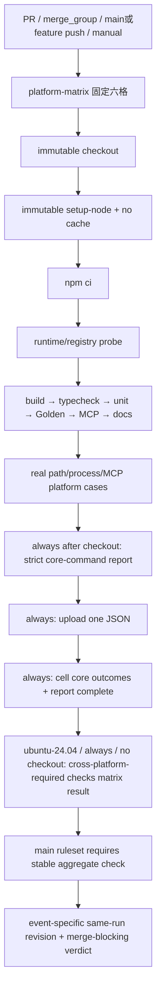

# cross-platform-ci-baseline feature design

## 0. 术语约定

| 术语 | 定义 | 防冲突结论 |
|---|---|---|
| blocking matrix | `ubuntu-24.04`、`windows-2025`、`macos-15-intel` 分别运行 Node 22 与 24 的六个必过 job cell，并由稳定命名的非matrix aggregate job收敛 | 只有aggregate required check被ruleset保护后才真正阻断合并，不以单个workflow失败冒充branch protection |
| platform contract registry | 版本化声明六格、必跑命令、稳定 case ID 与报告字段的机读清单 | 不复制 Vitest case 实现；负责阻止 workflow 静默删格或删 gate |
| platform core-command report | 每格在checkout成功后的 `if: always()` 阶段生成的安全 JSON 摘要，只含预期/实际 OS、arch、Node、workflow/source SHA 与九项 core command outcome | 不是完整GitHub job outcome；checkout/setup/upload/aggregate truth只由workflow run evidence证明，也不能包含环境变量、绝对路径或凭证 |
| real platform case | 在对应 hosted runner 上实际创建文件、链接/reparse point 或子进程树并观察结果的测试 | 不接受通过 mock `process.platform` 代替 |
| runtime support freeze | CI 从本 feature 起只把 Node 22/24 作为 beta blocking support | `package.json.engines`、README 与 package candidate 仍由 F9 原子更新 |
| action pin | GitHub Action 使用不可变 40 位 commit SHA，旁注人读 major/tag | 不使用可漂移的 `@v7`、`@main` 或第三方 action |

## 1. 决策与约束

### 需求摘要

本 feature 在 F5 改动 process/streaming 边界前建立跨平台安全网。六个固定 cell 都执行安装、build、typecheck、完整 unit、完整 Golden、完整 MCP、docs smoke，并额外执行可被 registry 追踪的 process/path contract gate。稳定 `cross-platform-required` aggregate job只有在matrix整体成功时通过；owner还必须把该check配置为`main` ruleset/branch protection的required status check，任一cell失败才真正阻断合并。本地单平台通过只能作为预检，不能替代同一commit的远程矩阵与ruleset证据。

成功标准：

1. matrix 精确覆盖 Node `22`、`24` × `ubuntu-24.04`、`windows-2025`、`macos-15-intel`，`fail-fast: false` 仅用于收集全部失败，不改变任一 cell 的 blocking 性。
2. workflow 使用最小 `contents: read` 权限、无 secrets、无写权限、无持久凭证；checkout/setup/upload 均锁定经 review 的完整 SHA。
3. 每格执行相同命令序列，`npm ci` 不启用隐式 package-manager cache；后续 feature 只能向 registry 增加 case，不得创建绕过矩阵的平行“快速绿灯”。
4. `F4-PATH-001..004` 在真实平台证明 absolute/parent/non-normalized path 拒绝、POSIX symlink escape 拒绝、Windows junction/reparse escape 拒绝以及 typed error 不泄露绝对 root。
5. `F4-PROC-001..005` 在真实平台证明 caller abort、timeout、当前stdout/stderr exact-N即limit基线与cleanup failure的生命周期；正常abort/timeout/limit路径direct/descendant均终止且settlement恰好一次。注入tree-termination failure只承诺fixed invariant与direct child hard-kill，descendant由harness在生产断言后强制清理，不冒充runner保证。exact-N成功/N+1触发的新语义由F5原子修改。
6. `F4-PATH-001..004`、`F4-PROC-001..005`与`F4-MCP-001..002`各自拥有唯一`surface/group/executableCaseId` tuple、非空`applicableOs`、`requiredAssertionIds`与exact `requiredEvidenceHashIds`（F4 base均为空）。现有runner的JSON结果必须回报实际通过的`platform::<contractId>::<assertionId>` marker及binding要求的`platform-evidence::<contractId>::<evidenceId>=<64-lower-hex>`；orchestrator只在当前OS属于`applicableOs`时执行binding并对marker/evidence expected ID set精确校验，不能伪回填hash。非适用binding不启动runner、不写passed/skipped marker或evidence。matrix contract必须反向证明PATH-002在Linux+macOS各两格、PATH-003在Windows两格，其余binding在六格全覆盖；合法group与合法case的错误组合、漏掉任一assertion/evidence或伪回填contract ID都失败。两个MCP binding分别执行`mcp-surface/request-cancellation-cleanup`与`lifecycle/shutdown-cleanup-probe`，证明真实stdio child的cancellation/shutdown在六格成立，stdout仍只有MCP frame。
7. 每格安全报告证明九项core command outcome，并只允许registry要求的contract evidence IDs与64位小写hex hash；F4 base production evidence集合为空，child可同revision扩binding要求而不扩大任意自由文本。报告生成或上传失败仍使cell失败，但完整job、六格aggregate、PR head/merge SHA与required-check truth只由GitHub workflow/run与ruleset证据证明。报告schema的forbidden-key mutation阻止路径、env、stderr/stdout内容进入artifact。
8. F4 不改变 production v1/v2 output、repository search plan、process limit 语义或 package 公共 metadata；F9 前仍保留 `private: true` 与当前 `engines` 声明。
9. workflow包含`pull_request`、`merge_group`、`main`/`repo-nav-public-beta` push与manual触发；固定aggregate check `cross-platform-required`在`if: always()`下验证matrix result为success，`main` ruleset将其设为required。

### 明确不做

- 不在本 feature 修改 `package.json.engines`、package version、README runtime 表、license、`private`、发布脚本或 changelog；这些是 F9 的原子 release metadata。
- 不使用 self-hosted runner、Docker-in-Docker、browser/E2E、数据库、Redis 或云凭证。
- 不把 GitHub runner image 的预装工具当成契约；依赖只通过 lockfile `npm ci`，Node 通过 `setup-node` 明确选择。
- 不以 `macos-latest`、`windows-latest`、`ubuntu-latest` 代替固定 labels；runner label 升级必须单独 review registry、workflow 与真实六格证据。
- 不设置 `continue-on-error`、条件性忽略 Windows/macOS、允许失败的 experimental cell 或只在 nightly 才执行的 core gate。
- 不上传 raw logs、测试仓库内容、绝对临时目录、process command line、environment、remote URL 或凭证。
- 不改变 `NodeSafeProcessRunner` 的业务 termination contract或production代码；F4明确锁定当前exact-N即limit的已知基线。真实平台若暴露跨OS实现差异，F4阻塞并另建issue/feature修复，不能在CI baseline中顺手改语义；N/N+1修复专属F5。
- 不 commit、push、创建 PR、merge、publish、release 或 deploy。实际远程 workflow run 需要 owner 允许把实现所在 commit 推到 GitHub；设计批准不等于该外部动作授权。

### 方案深度 pre-pass

| 候选 | 结论 | 原因 |
|---|---|---|
| 只在当前 Windows 开发机跑两种 Node | 拒绝 | 无法证明 POSIX process group、symlink 与 macOS 行为 |
| 只做 workflow YAML lint | 拒绝 | 只能证明配置可解析，不能证明真实 hosted runner 行为 |
| 使用 `*-latest` 和浮动 action tags | 拒绝 | runner/action 会在无 code diff 时漂移，难以归因 |
| 六格固定 labels + immutable action pins + registry contract + real cases | 采用 | 配置、选择、执行证据三层互相约束，后续 F5-F9 可增量接入 |
| 为每个平台写三套脚本 | 拒绝 | 会产生平台特化的不同业务 gate；统一 Node orchestrator 更能证明等价 |

### 复杂度档位

- Correctness = `all-six blocking`；不得用部分平台成功推断整体。
- Determinism = `fixed labels + immutable pins + lockfile install`；不承诺 runner image 内核/补丁完全不变。
- Security = `read-only workflow + no secrets + safe artifact allowlist`。
- Performance = `one matrix job definition, six cells`；不做 cache，先优先证据可信度。
- Compatibility = `Node 22/24 evidence now, public metadata at F9`。
- 其余维度沿用本地 TypeScript/NestJS CLI 默认长期维护档位。

### 关键决策

1. **固定六格**：registry 的 canonical order 为 `linux-node22`、`linux-node24`、`windows-node22`、`windows-node24`、`macos-intel-node22`、`macos-intel-node24`；order 只服务报告与 mutation test，不改变 GitHub 并行执行。
2. **固定 runner labels**：Linux=`ubuntu-24.04`，Windows=`windows-2025`，macOS=`macos-15-intel`。不用 Arm runner，先让三平台保持 x64，避免在 OS baseline 中同时引入 architecture 变量；未来 Arm 是单独扩展项。
3. **当前 action pins**：`actions/checkout@9c091bb21b7c1c1d1991bb908d89e4e9dddfe3e0`（v7.0.0）、`actions/setup-python@a26af69be951a213d495a4c3e4e4022e16d87065`（v5.6.0）、`actions/setup-node@820762786026740c76f36085b0efc47a31fe5020`（v7.0.0）、`actions/upload-artifact@330a01c490aca151604b8cf639adc76d48f6c5d4`（v5.0.0）。registry 与 workflow 必须 deep-exact；更新任一 SHA 要同步 provenance 注释、contract test 和 review。`setup-python` 为 scope-gate / Python 宿主提供固定解释器，避免依赖 runner 预装 `py` launcher。
4. **workflow triggers**：`pull_request`、`merge_group`的`checks_requested`、向`main`及`repo-nav-public-beta`的`push`、`workflow_dispatch`。同ref使用concurrency group，`cancel-in-progress: true`仅取消已过时run，不把取消视为成功；`main`是本设计冻结的默认分支，后续变更需同步registry/workflow/ruleset review。
5. **权限与 checkout**：顶层 `permissions: { contents: read }`；checkout `persist-credentials: false`，不接收 secrets；job 不写 package registry、GitHub API 或 repository。
6. **环境验证**：setup 后先运行 registry 的 runtime probe，要求 `process.platform`、`process.arch`、Node major 与 cell 精确相符；macOS 必须为 `darwin/x64`，防 runner label 静默换 architecture。
7. **一致命令面**：每格依次执行 `npm ci`、runtime/registry probe、`npm run build`、`npm run typecheck`、`npm test`、`npm run test:golden -- --all`、`npm run test:mcp -- --all`、`npm run test:docs`、显式 `test:platform`。完整 suite 与 targeted gate 都保留：前者防回归，后者使平台 case 被删时 contract test 可直接失败。
8. **platform command、跨surface编排与真实owner provenance**：新增单一`test:platform` package script指向`tools/ci/run-platform-contracts.mjs`。orchestrator只读取registry中的`PlatformCaseBindingV1[]`，先以runtime probe确认当前OS，再只选择`applicableOs`包含该OS的binding，以`shell:false`和平台对应`npm|npm.cmd`顺序执行unit与mcp现有runner，每个applicable binding恰好一次且不按case去重。每次调用只传该binding的exact group/case；runner registry为该tuple登记exact assertion/evidence owner文件集合，Vitest/MCP runner reporter从实际执行task的file path签发private owner provenance，helper API不接收也不能伪造owner参数。private runner result逐marker/hash携带`actualOwner`，orchestrator先与`markerOwners/evidenceHashOwners`及runner registration deep-exact，再剥离path生成safe summary。只有进程成功、`requiredAssertionIds`全部且仅一次由声明owner以passed marker出现、`requiredEvidenceHashIds`全部且仅一次由声明owner产生64位小写hex、无未知同contract marker/evidence时才为该contract成功。`testkit/testing/platform-contract.ts`提供`platformContractIt(contractId, assertionId, test)`与`recordPlatformContractEvidenceHash(contractId,evidenceId,sha256)`，marker固定为`platform::<contractId>::<assertionId>`、evidence key固定为`platform-evidence::<contractId>::<evidenceId>`且registry全局唯一；两者都不接受owner path。合法但不匹配的group+case、声明owner存在且included但实际由另一included spec发marker/hash、伪造owner字段、零passed marker、漏/重/错marker/evidence、共享case或重复tuple全部fail closed。非适用binding不调用runner，也不产生假passed/skipped marker/evidence；registry/matrix mutation证明每个OS覆盖集合准确且任何binding至少被一个受支持OS执行。它不创建第四个测试框架、不允许运行时环境错误被当成N/A。
9. **path truth**：所有 case 使用 `NodeRepositoryReader` 公开 port 和真实 temp tree。Windows case 创建目录 junction 并验证 containment；POSIX case创建 symlink。创建能力缺失或清理失败是 cell failure，不标 skipped。
10. **process truth**：使用`testkit/fixtures/process/process-helper.ts`真实父子/孙进程协议；case记录opaque probe ID、PID与进程启动指纹用于防PID reuse，artifact不记录PID。正常abort/timeout/limit返回后在harness cleanup前断言direct/descendant均终止。注入tree-termination failure先断言fixed invariant、direct child已hard-kill并记录descendant真实alive状态，再由test-only `finally`强制清理；该清理不计为production runner保证。
11. **当前limit基线与F5边界**：当前`NodeSafeProcessRunner`在`remaining===0 || chunk.byteLength>=remaining`时终止，existing tests也冻结“exact N即`stdout-limit|stderr-limit`”。F4-PROC-003/004只跨平台证明`N-1`成功、exact N触发对应limit、retained bytes不超过N且正常树清理；不宣称N成功/N+1 limit。F5必须原子修改runner、这些baseline expectations，并新增自己的N/N+1 streaming/backend cases。
12. **安全报告、run family与revision语义**：`PlatformCoreCommandReportV1` strict schema只允许`{schemaVersion,cellId,expected,actual,run,revision,commands,requiredCaseIds,passedAssertionMarkers,contractEvidenceHashes,completedAt}`。`run`严格为`{workflowRunId,runAttempt}`：run ID是GitHub提供的十进制字符串，attempt是正安全整数；六格同一最终证据必须deep-exact，rerun不得与原attempt拼接。`passedAssertionMarkers`按contract/assertion ID排序且每项仅`{contractId,assertionId}`，集合必须与当前cell applicable bindings的`requiredAssertionIds` exact；owner path只在private runner result验证后剥离，不进入artifact。`contractEvidenceHashes`按contract/evidence ID排序且每项仅`{contractId,evidenceId,sha256}`，集合必须与当前cell applicable bindings的`requiredEvidenceHashIds` exact，value必须64位小写hex；F4 base evidence hash集合为空。`revision`只含`workflowSha/sourceSha/eventName`。`workflowSha`精确取`${{ github.workflow_sha }}`，表示本run加载的workflow文件commit；`sourceSha`精确取`${{ github.sha }}`并由checkout显式`ref: ${{ github.sha }}`测试。`pull_request`的source是synthetic merge commit，head SHA只从同run event metadata取；`merge_group`要求`sourceSha == github.sha == github.event.merge_group.head_sha`，可从同一payload附证`head_ref/base_sha/base_ref`，但不要求payload并不提供的成员PR head列表；`push`是pushed commit；`workflow_dispatch`是被选择ref解析出的commit。任何event都不得把head SHA冒充workflowSha，workflowSha/sourceSha也不要求相等。commands只有stable id/outcome。禁止`cwd/path/root/env/stdout/stderr/error/message/pid/argv`任意大小写key。
13. **报告真实性边界**：workflow各core gate step有固定`id`，report writer在checkout成功后的`if: always()`读取GitHub expression注入的有限outcome与GitHub提供的run/revision字段；它不能自行把failure改成success。`assert-cell`在`always()`检查九项required outcome均为`success`、run/revision合法、required cases/passed markers/evidence hashes与registry对当前cell的applicable集合exact，否则exit nonzero。checkout/setup等更早失败时报告可不存在，但matrix job必失败，不能作为acceptance evidence。
14. **artifact 上传**：artifact 名 `cross-platform-baseline-{cellId}-{runAttempt}`；`if: always()` 上传唯一 JSON，`if-no-files-found: error`，`retention-days: 14`，不上传 test-artifacts 其他内容。upload 与 assert 顺序保证 upload 尝试不吞掉 gate failure。
15. **稳定aggregate与required check**：matrix job id固定为`platform-matrix`；非matrix job id/name固定为`cross-platform-required`，固定`runs-on: ubuntu-24.04`，不checkout、不setup、不安装依赖，只配置`needs: [platform-matrix]`与`if: always()`并验证`needs.platform-matrix.result == 'success'`，取消/skipped/failure均失败。unit mutation必须证明删除aggregate、改名、改runner、增加checkout/install、去掉always/needs或放宽result均失败。
16. **ruleset与merge queue**：workflow本身不等于merge protection。owner授权后在`main` repository ruleset/branch protection中把唯一稳定check`cross-platform-required`设为required，并保存sanitized配置/API evidence；negative acceptance通过故意失败的临时PR证明不可merge。`merge_group`触发保证启用merge queue后同一required check在队列commit执行。
17. **外部证据边界**：GitHub Actions run URL与ruleset evidence只记入implementation/acceptance；safe cell artifact只保留防拼接所需的`workflowRunId/runAttempt`，不保留URL、repository、actor或自由metadata。验收必须用report中的run family、`workflowSha/sourceSha/eventName`和同run metadata证明六格属于同一PR synthetic merge + head pair、同一`merge_group.head_sha`、同一push commit或同一manual selected commit；merge-group成员PR列表不属于本feature证据要求。rerun允许，但每格最终证据必须来自同一workflow run/attempt family并记录失败历史。
18. **F5 admission**：F4 base item只有在本地全部命令通过、owner-authorized remote run六格全绿、aggregate success且required-check规则验证后才能从`in-progress`变`done`；这份accepted base是F5 implementation的唯一F4前置，不预要求任何F5 fixture/binding/marker。runner queue/平台故障是环境阻塞，不降级gate。
19. **后续扩展**：F5-F9只在platform registry增加自己的stable `PlatformCaseBindingV1`，并由同一`test:platform`跨surface orchestrator执行；不得复制workflow或缩小既有六格。
20. **F4 base与child extension ownership分离**：F4 implementation/acceptance只交付F4基线
    `PlatformContractIdV1`、production registry/orchestrator以及F4-owned synthetic extension protocol case；
    不把尚不存在的F5-F9 ID、fixture、assertion owner或marker列为F4 base DoD。每个child在自己的
    implementation revision中原子提交其union ID、exact binding、fixture、assertionOwner、
    required evidence hash owner（如非空）、exact runner owner-file registration与self-test mutation；漏任一项即
    typecheck或contract test失败，并由该child取得
    same-revision六格证据。`surface:'unit'` owner必须位于Vitest实际include的
    `test/unit/*.spec.ts`，`surface:'mcp'`必须位于现有MCP runner可达路径；禁止创建
    `test/platform`第四surface或marker-only不可执行文件。production入口只接受
    `PlatformContractSnapshotV1<typeof PLATFORM_CONTRACT_IDS_V1>`并以冻结的
    `PLATFORM_CONTRACT_IDS_V1`校验；F4 base self-test另用test-only
    `PlatformContractSnapshotV1<typeof SYNTHETIC_PLATFORM_CONTRACT_IDS_V1>`与
    `TEST-EXT-001` corpus验证unknown/unextended ID、漏fixture/assertionOwner、owner wrong-path、
    zero marker、声明owner与实际included spec错配、错tuple、重复case/marker与缩小OS集合。generic snapshot validator必须以调用方
    传入的exact expected-ID tuple做runtime deep-exact closed-set校验，不能仅依赖泛型；
    test-only union/validator不得由production registry或orchestrator import。
    下表的F5-F9 bindings只是跨设计目标ledger，不是F4 base当前文件存在性或acceptance要求。

### 外部依据快照

- GitHub hosted runner labels 与 architecture：`https://docs.github.com/en/actions/reference/runners/github-hosted-runners`。
- matrix 与 `fail-fast`：`https://docs.github.com/en/enterprise-cloud@latest/actions/how-tos/write-workflows/choose-what-workflows-do/run-job-variations`。
- concurrency cancellation：`https://docs.github.com/en/actions/how-tos/write-workflows/choose-when-workflows-run/control-workflow-concurrency`。
- protected branches / required status checks：`https://docs.github.com/en/repositories/configuring-branches-and-merges-in-your-repository/managing-protected-branches/about-protected-branches`。
- merge queue与`merge_group`：`https://docs.github.com/en/repositories/configuring-branches-and-merges-in-your-repository/configuring-pull-request-merges/managing-a-merge-queue`。
- setup-node 显式 Node major 与 `package-manager-cache: false`：`https://github.com/actions/setup-node`。
- action SHA 于 2026-07-24 由对应 official repository tag refs 复核；实现时若 refs 已变化仍使用上述 reviewed SHA，升级另走 review。

### Top 3 风险与缓解

| 风险 | 缓解 |
|---|---|
| workflow 看似六格但没有真实merge protection | S1稳定aggregate + YAML mutation；S5 owner-authorized `main` required-check/ruleset与失败PR不可merge证据 |
| process cleanup 单元测试 mock 通过但真实 OS 留子进程，或harness cleanup冒充production保证 | S3全部使用real helper并在harness cleanup前观察；fault injection分开记录direct保证与descendant残余 |
| artifact 为排错上传 raw 敏感信息 | S4 strict allowlist + forbidden-key recursive mutation，只上传单个安全 JSON |

### 非显然依赖、关键假设与基线风险

- 依赖 F1 已完成；F4 与 F1A-F2 是并行 safety lane，但 F5 同时等待 F2 与 F4 design/implementation done。
- 假设 GitHub public hosted runner 保持列出的固定 labels 可用；若 label retired，先更新 Epic/设计并重审，不能临时换 `latest`。
- 假设 Node 22/24 可运行 lockfile 中全部依赖；六格 `npm ci` 是此假设的直接证据。
- 当前本地 package 声明 `engines.node >=20` 是开发期 v1 事实；不把它误判为 F4 失败，F9 才完成 breaking metadata。
- 远程 run 需要 owner 授权 push/PR，当前设计与后续本地实现都不能自行执行。
- 当前repository ruleset、branch protection与merge queue状态尚未验证；F4 acceptance必须读取live配置并经owner授权设置/验证，不能从workflow YAML推断。
- 当前runner的exact-N即limit是已知基线而非目标语义；F4不得偷偷修复，F5必须以N/N+1 contract和回归证据完成迁移。

### 必跑验证、交付物与清洁度

必跑验证见 §3.5 DoD；本地必须完成 YAML parse、registry mutations、build/typecheck/full suites 和 report security，远程必须完成六格。

交付物：

- 单一 GitHub Actions blocking workflow。
- platform contract registry、safe report schema/writer/assertion与 targeted runner entry。
- stable case/fixture ownership entries、六格安全 JSON artifacts 和同 commit run 证据。
- architecture 现状更新、roadmap/item 状态与 F5 admission evidence。

清洁度：

- 不新增 raw log artifact、workflow debug echo、`ACTIONS_STEP_DEBUG`、临时 TODO/FIXME、注释掉的 gate、无用 platform branch。
- 不把 action SHA、runner label、required case IDs 在多个无 owner 常量里手写；registry 是 contract truth，workflow由测试 deep-exact核对。

## 2. 名词与编排

### 2.1 名词层

#### 现状

- `package.json` 有 build/typecheck/unit/Golden/MCP/docs scripts，但无 `.github/workflows/` 与 Node/OS matrix。
- `testkit/runners/runner-registry.ts` 已拥有 unit/golden/mcp group/case registry；尚无 `platform` surface。
- `NodeSafeProcessRunner` 已区分 Windows `taskkill /T` 与 POSIX process group，已有 mock cleanup tests和部分真实 lifecycle tests。
- `NodeRepositoryReader` 与 `repository-safety.spec.ts` 已检查 normalized relative path、canonical containment 和 symlink/junction escape，但没有三 OS blocking evidence。

#### 变化

新增 private `PlatformContractV1`：

```ts
type PlatformCellId =
  | 'linux-node22'
  | 'linux-node24'
  | 'windows-node22'
  | 'windows-node24'
  | 'macos-intel-node22'
  | 'macos-intel-node24';

interface PlatformCellContract {
  readonly id: PlatformCellId;
  readonly runner: 'ubuntu-24.04' | 'windows-2025' | 'macos-15-intel';
  readonly os: 'linux' | 'win32' | 'darwin';
  readonly arch: 'x64';
  readonly nodeMajor: 22 | 24;
}

interface PlatformCommandContract {
  readonly id:
    | 'install'
    | 'runtime'
    | 'build'
    | 'typecheck'
    | 'unit'
    | 'golden'
    | 'mcp'
    | 'docs'
    | 'platform';
  readonly blocking: true;
}

const PLATFORM_CONTRACT_IDS_V1 = [
  'F4-PATH-001',
  'F4-PATH-002',
  'F4-PATH-003',
  'F4-PATH-004',
  'F4-PROC-001',
  'F4-PROC-002',
  'F4-PROC-003',
  'F4-PROC-004',
  'F4-PROC-005',
  'F4-MCP-001',
  'F4-MCP-002',
] as const;

type PlatformContractIdV1 = (typeof PLATFORM_CONTRACT_IDS_V1)[number];
type SyntheticPlatformContractIdV1 =
  | PlatformContractIdV1
  | 'TEST-EXT-001';

const SYNTHETIC_PLATFORM_CONTRACT_IDS_V1 = [
  ...PLATFORM_CONTRACT_IDS_V1,
  'TEST-EXT-001',
] as const;

interface PlatformCaseBindingV1<TContractId extends string> {
  readonly contractId: TContractId;
  readonly surface: 'unit' | 'mcp';
  readonly group: string;
  readonly executableCaseId: string;
  readonly applicableOs: readonly ('linux' | 'win32' | 'darwin')[];
  readonly requiredAssertionIds: readonly string[];
  readonly requiredEvidenceHashIds: readonly string[];
  readonly fixture: string;
  readonly assertionOwner: string;
}

interface PlatformAssertionMarkerOwnerV1<TContractId extends string> {
  readonly contractId: TContractId;
  readonly assertionId: string;
  readonly assertionOwner: string;
}

interface PlatformEvidenceHashOwnerV1<TContractId extends string> {
  readonly contractId: TContractId;
  readonly evidenceId: string;
  readonly evidenceOwner: string;
}

interface PlatformContractSnapshotV1<
  TExpectedIds extends readonly string[],
> {
  readonly allowedIds: TExpectedIds;
  readonly bindings:
    readonly PlatformCaseBindingV1<TExpectedIds[number]>[];
  readonly markerOwners:
    readonly PlatformAssertionMarkerOwnerV1<TExpectedIds[number]>[];
  readonly evidenceHashOwners:
    readonly PlatformEvidenceHashOwnerV1<TExpectedIds[number]>[];
}

declare const validatedPlatformContractSnapshotBrandV1: unique symbol;

interface ValidatedPlatformContractSnapshotV1<
  TExpectedIds extends readonly string[],
> {
  readonly [validatedPlatformContractSnapshotBrandV1]:
    TExpectedIds[number];
}

interface PlatformContractRepositoryPortV1 {
  exists(repositoryRelativePath: string): boolean;
  isIncludedTestOwner(
    surface: 'unit' | 'mcp',
    repositoryRelativePath: string,
  ): boolean;
  registeredCaseOwners(
    surface: 'unit' | 'mcp',
    group: string,
    executableCaseId: string,
  ): readonly string[];
}

function validatePlatformContractSnapshotV1<
  const TExpectedIds extends readonly string[],
>(
  expectedIds: TExpectedIds,
  snapshot: PlatformContractSnapshotV1<NoInfer<TExpectedIds>>,
  repository: PlatformContractRepositoryPortV1,
): ValidatedPlatformContractSnapshotV1<TExpectedIds>;

function validateProductionPlatformContractSnapshotV1(
  snapshot: PlatformContractSnapshotV1<
    typeof PLATFORM_CONTRACT_IDS_V1
  >,
  repository: PlatformContractRepositoryPortV1,
): ValidatedPlatformContractSnapshotV1<
  typeof PLATFORM_CONTRACT_IDS_V1
>;

interface PlatformContractEvidenceHashV1 {
  readonly contractId: string;
  readonly evidenceId: string;
  readonly sha256: string;
}

interface PrivatePlatformAssertionExecutionV1 {
  readonly contractId: string;
  readonly assertionId: string;
  readonly status: 'passed' | 'failed' | 'skipped';
  readonly actualOwner: string;
}

interface PrivatePlatformEvidenceExecutionV1 {
  readonly contractId: string;
  readonly evidenceId: string;
  readonly sha256: string;
  readonly actualOwner: string;
}

interface PrivatePlatformRunnerResultV1 {
  readonly registeredOwners: readonly string[];
  readonly assertions: readonly PrivatePlatformAssertionExecutionV1[];
  readonly evidence: readonly PrivatePlatformEvidenceExecutionV1[];
}

interface PlatformRunIdentityV1 {
  readonly workflowRunId: string;
  readonly runAttempt: number;
}

interface PlatformPassedAssertionMarkerV1 {
  readonly contractId: string;
  readonly assertionId: string;
}

interface PlatformCoreCommandReportV1 {
  readonly schemaVersion: 1;
  readonly cellId: PlatformCellId;
  readonly expected: PlatformCellContract;
  readonly actual: PlatformCellContract;
  readonly run: PlatformRunIdentityV1;
  readonly revision: Readonly<{
    readonly workflowSha: string;
    readonly sourceSha: string;
    readonly eventName:
      | 'pull_request'
      | 'merge_group'
      | 'push'
      | 'workflow_dispatch';
  }>;
  readonly commands: readonly Readonly<{
    readonly id: PlatformCommandContract['id'];
    readonly outcome: 'success' | 'failure' | 'cancelled' | 'skipped';
  }>[];
  readonly requiredCaseIds: readonly string[];
  readonly passedAssertionMarkers:
    readonly PlatformPassedAssertionMarkerV1[];
  readonly contractEvidenceHashes:
    readonly PlatformContractEvidenceHashV1[];
  readonly completedAt: string;
}
```

generic validator由`testkit/contracts/platform-contract.ts`私有实现，先验证
`snapshot.allowedIds`与`expectedIds`按canonical order deep-exact，再验证每个expected ID恰有
一个binding、每个required assertion恰有一个同tuple marker owner、每个required evidence hash恰有
一个同tuple evidence owner、无unknown/duplicate ID、case tuple、marker/evidence或缩小OS集合。
`validateProductionPlatformContractSnapshotV1`是production
orchestrator唯一可导入的wrapper，内部固定传`PLATFORM_CONTRACT_IDS_V1`；synthetic validator
只由`test/unit/cross-platform-ci-contract.spec.ts`导入并固定传
`SYNTHETIC_PLATFORM_CONTRACT_IDS_V1`。`NoInfer`阻止snapshot反向放宽expected tuple；
compile fixture必须显式实例化exact tuple snapshot，因此漏ID与unknown ID都在typecheck失败。

`fixture`、`assertionOwner`与`evidenceOwner`不是注释字段：validator要求非空、
repository-relative、POSIX separator、无`.`/`..`/absolute/drive/UNC segments，文件必须存在；
assertion/evidence owner还必须属于surface允许的runner include。`registeredCaseOwners`返回该
surface/group/case在runner registry中显式登记的canonical owner path集合，必须与binding的
assertion owner、全部marker owner及evidence owner去重排序后deep-exact。runner执行时再由
Vitest/MCP reporter从实际task file签发`PrivatePlatformRunnerResultV1.actualOwner`；orchestrator逐项
与声明owner deep-exact，完成后才剥离path生成safe marker/hash summary。fixture缺失、owner指向错误
spec、owner虽存在/included但由另一included spec发marker/hash、owner字段伪造、owner存在但
marker/evidence为0、ID未加入对应expected-ID tuple均fail closed。production compile
fixture证明`TEST-EXT-001`不能赋给`PlatformContractIdV1`；synthetic compile fixture证明完整
extension snapshot可赋值，并以`@ts-expect-error`证明漏ID/unknown ID不能通过其closed union。

`PlatformCoreCommandReportV1`是strict closed schema；command outcome仅为
`success|failure|cancelled|skipped`，cell assertion要求九项全为`success`。`skipped`
可以真实记录但不能通过。它不含`upload`、aggregate或ruleset outcome，完整job truth
只能从同一run evidence取得。`run`只保留十进制`workflowRunId`与正安全整数`runAttempt`，
`passedAssertionMarkers`只保存exact contract/assertion IDs；
`contractEvidenceHashes`只保存registry exact evidence ID与hash，不保存被hash正文、path、owner或
自由文本；F4 base正常run仅evidence数组固定为空，marker数组仍必须与applicable assertions exact。

稳定 case ownership inventory；每个路径均为exact owner，不允许`same`、`existing fixture`
或目录级占位：

| Stable ID | Fixture owner | Assertion owner | Runner / manifest owner | Contract owners |
|---|---|---|---|---|
| F4-MATRIX-001 | `.github/workflows/cross-platform-ci.yml` | `test/unit/cross-platform-ci-contract.spec.ts` | `testkit/runners/runner-registry.ts`; `testkit/manifests/coverage/fixture-ownership.yaml` | `testkit/contracts/platform-contract.ts`; `tools/ci/assert-platform-contract.mjs`; `.github/workflows/cross-platform-ci.yml` |
| F4-RUNTIME-001 | `testkit/contracts/platform-contract.ts` | `test/unit/cross-platform-ci-contract.spec.ts` | `testkit/runners/runner-registry.ts`; `testkit/manifests/coverage/fixture-ownership.yaml` | `testkit/contracts/platform-contract.ts`; `tools/ci/run-platform-contracts.mjs` |
| F4-PATH-001 | `testkit/fixtures/platform/repository-path-tree.ts` | `test/unit/cross-platform-platform.spec.ts` | `testkit/runners/runner-registry.ts`; `testkit/manifests/coverage/fixture-ownership.yaml` | `src/repository/node-repository-reader.ts`; `testkit/contracts/platform-contract.ts` |
| F4-PATH-002 | `testkit/fixtures/platform/repository-path-tree.ts` | `test/unit/cross-platform-platform.spec.ts` | `testkit/runners/runner-registry.ts`; `testkit/manifests/coverage/fixture-ownership.yaml` | `src/repository/node-repository-reader.ts`; `testkit/contracts/platform-contract.ts` |
| F4-PATH-003 | `testkit/fixtures/platform/repository-path-tree.ts` | `test/unit/cross-platform-platform.spec.ts` | `testkit/runners/runner-registry.ts`; `testkit/manifests/coverage/fixture-ownership.yaml` | `src/repository/node-repository-reader.ts`; `testkit/contracts/platform-contract.ts` |
| F4-PATH-004 | `testkit/fixtures/platform/repository-path-tree.ts` | `test/unit/cross-platform-platform.spec.ts` | `testkit/runners/runner-registry.ts`; `testkit/manifests/coverage/fixture-ownership.yaml` | `src/repository/node-repository-reader.ts`; `testkit/contracts/platform-contract.ts` |
| F4-PROC-001 | `testkit/fixtures/process/process-helper.ts` | `test/unit/cross-platform-platform.spec.ts` | `testkit/runners/runner-registry.ts`; `testkit/manifests/coverage/fixture-ownership.yaml` | `src/repository/node-safe-process-runner.ts`; `testkit/contracts/platform-contract.ts` |
| F4-PROC-002 | `testkit/fixtures/process/process-helper.ts` | `test/unit/cross-platform-platform.spec.ts` | `testkit/runners/runner-registry.ts`; `testkit/manifests/coverage/fixture-ownership.yaml` | `src/repository/node-safe-process-runner.ts`; `testkit/contracts/platform-contract.ts` |
| F4-PROC-003 | `testkit/fixtures/process/process-helper.ts` | `test/unit/cross-platform-platform.spec.ts` | `testkit/runners/runner-registry.ts`; `testkit/manifests/coverage/fixture-ownership.yaml` | `src/repository/node-safe-process-runner.ts`; `testkit/contracts/platform-contract.ts` |
| F4-PROC-004 | `testkit/fixtures/process/process-helper.ts` | `test/unit/cross-platform-platform.spec.ts` | `testkit/runners/runner-registry.ts`; `testkit/manifests/coverage/fixture-ownership.yaml` | `src/repository/node-safe-process-runner.ts`; `testkit/contracts/platform-contract.ts` |
| F4-PROC-005 | `testkit/fixtures/process/process-helper.ts` | `test/unit/cross-platform-platform.spec.ts` | `testkit/runners/runner-registry.ts`; `testkit/manifests/coverage/fixture-ownership.yaml` | `src/repository/node-safe-process-runner.ts`; `testkit/contracts/platform-contract.ts` |
| F4-MCP-001 | `testkit/manifests/mcp/request-cancellation-platform.yaml` | `test/mcp/request-cancellation.spec.ts` | `testkit/runners/mcp-runner.ts`; `testkit/manifests/coverage/fixture-ownership.yaml` | `src/mcp/repo-nav-mcp-server.ts`; `src/mcp/mcp-stdio-host.ts`; `testkit/contracts/platform-contract.ts` |
| F4-MCP-002 | `testkit/manifests/mcp/shutdown-cleanup-platform.yaml` | `test/mcp/lifecycle-contract.spec.ts` | `testkit/runners/mcp-runner.ts`; `testkit/manifests/coverage/fixture-ownership.yaml` | `src/mcp/mcp-shutdown-coordinator.ts`; `src/mcp/mcp-stdio-host.ts`; `testkit/contracts/platform-contract.ts` |
| F4-BINDING-001 | `testkit/fixtures/platform/binding-attestation-mutations.ts` | `test/unit/cross-platform-ci-contract.spec.ts` | `testkit/runners/runner-registry.ts`; `testkit/manifests/coverage/fixture-ownership.yaml` | `testkit/contracts/platform-contract.ts`; `tools/ci/run-platform-contracts.mjs` |
| F4-EXT-001 | `testkit/fixtures/platform/registry-extension-mutations.ts`; `test/unit/platform-contract-production-id-v1.type-test.ts`; `test/unit/platform-contract-synthetic-extension-v1.type-test.ts` | `test/unit/cross-platform-ci-contract.spec.ts` | `testkit/runners/runner-registry.ts`; `testkit/manifests/coverage/fixture-ownership.yaml` | `testkit/contracts/platform-contract.ts`; `tools/ci/run-platform-contracts.mjs` |
| F4-REPORT-001 | `testkit/contracts/platform-evidence-report.ts` | `test/unit/platform-evidence-report.spec.ts` | `testkit/runners/runner-registry.ts`; `testkit/manifests/coverage/fixture-ownership.yaml` | `testkit/contracts/platform-evidence-report.ts`; `tools/ci/write-platform-report.mjs` |
| F4-REMOTE-001 | `.github/workflows/cross-platform-ci.yml` | `test/unit/cross-platform-ci-contract.spec.ts` | `.github/workflows/cross-platform-ci.yml` | `tools/ci/assert-platform-contract.mjs`; `.codestable/roadmap/repo-nav-public-beta/repo-nav-public-beta-items.yaml` |

F4-EXT-001的exact type owners为
`test/unit/platform-contract-production-id-v1.type-test.ts`与
`test/unit/platform-contract-synthetic-extension-v1.type-test.ts`，runtime assertion owner为
`test/unit/cross-platform-ci-contract.spec.ts`，runner owner为
`testkit/runners/runner-registry.ts`，contract/validator owner为
`testkit/contracts/platform-contract.ts`；synthetic `TEST-EXT-001`另固定
`requiredEvidenceHashIds:['synthetic-proof']`，evidence owner为
`test/unit/cross-platform-ci-contract.spec.ts`并记录固定64位小写hex，使漏/重/错/unknown evidence
与伪hash路径可执行。这些owner与
`testkit/fixtures/platform/registry-extension-mutations.ts`必须在同一revision进入typecheck、
registry self-test与unit runner。

关键 executable mapping 冻结为：

| Contract ID | surface | group | unique executableCaseId | applicable OS | required assertion IDs |
|---|---|---|---|---|---|
| F4-PATH-001 | unit | `cross-platform-baseline` | `repository-path-invalid-input` | linux, win32, darwin | `absolute-parent-nonnormalized-rejected` |
| F4-PATH-002 | unit | `cross-platform-baseline` | `repository-path-posix-symlink-escape` | linux, darwin | `posix-symlink-escape-rejected` |
| F4-PATH-003 | unit | `cross-platform-baseline` | `repository-path-windows-reparse-escape` | win32 | `windows-reparse-escape-rejected` |
| F4-PATH-004 | unit | `cross-platform-baseline` | `repository-path-error-redaction` | linux, win32, darwin | `absolute-root-not-serialized` |
| F4-PROC-001 | unit | `cross-platform-baseline` | `process-caller-abort-tree-cleanup` | linux, win32, darwin | `aborted-result`, `settled-once`, `owned-tree-dead` |
| F4-PROC-002 | unit | `cross-platform-baseline` | `process-timeout-tree-cleanup` | linux, win32, darwin | `timeout-result`, `settled-once`, `owned-tree-dead` |
| F4-PROC-003 | unit | `cross-platform-baseline` | `process-stdout-current-boundary` | linux, win32, darwin | `n-minus-one-success`, `exact-n-limit`, `owned-tree-dead` |
| F4-PROC-004 | unit | `cross-platform-baseline` | `process-stderr-current-boundary` | linux, win32, darwin | `n-minus-one-success`, `exact-n-limit`, `owned-tree-dead` |
| F4-PROC-005 | unit | `cross-platform-baseline` | `process-cleanup-invariant-fault` | linux, win32, darwin | `fixed-invariant`, `direct-child-dead`, `descendant-observed-before-harness-cleanup` |
| F4-MCP-001 | mcp | `mcp-surface` | `request-cancellation-cleanup` | linux, win32, darwin | `pre-handler-cancel`, `inflight-signal`, `eof-abort` |
| F4-MCP-002 | mcp | `lifecycle` | `shutdown-cleanup-probe` | linux, win32, darwin | `real-close-and-tree-cleanup`, `missing-close-negative`, `live-descendant-negative`, `timeout-cleanup`, `nonzero-cleanup` |

上述F4 base binding的`requiredEvidenceHashIds`均为exact `[]`。

ChildDesignBatch target extension ledger is frozen as follows; all targets have
`applicableOs:['linux','win32','darwin']` and `surface:'unit'`. These rows are
informational until the owning child implementation atomically extends the source union/registry;
F4 base neither loads these rows nor requires their files to exist:

| Contract ID | group / executableCaseId | Fixture owner | Assertion owner | Required assertion IDs | Required evidence hash IDs |
|---|---|---|---|---|---|
| F5-PROC-001 | `streaming-ripgrep/stream-consumer-progress-and-boundary` | `testkit/fixtures/process-v2/byte-writer-v2.ts` | `test/unit/safe-process-streaming-v2.spec.ts` | `continue-full-prefix`, `partial-stop-before-n-plus-one`, `invalid-decision-fixed`, `cleanup-invariant-overrides-trigger` | none |
| F5-PROC-003 | `streaming-ripgrep/stream-consumer-finalizer-and-process-exit` | `testkit/fixtures/process-v2/streaming-finalizer-platform-v2.ts` | `test/unit/safe-process-streaming-v2.spec.ts` | `partial-valid-invalid-union`, `top-level-async-finalizer-rejected`, `null-exit-or-signal-process-exit` | none |
| F5-RG-001 | `streaming-ripgrep/ripgrep-json-stream-protocol` | `testkit/fixtures/ripgrep/stream-partitions-v2.ts` | `test/unit/ripgrep-json-line-consumer-v2.spec.ts` | `crlf-partition-stable`, `summary-fsm-complete`, `offset-slice-valid`, `exit-summary-joint-valid` | none |
| F5-CLEANUP-001 | `streaming-ripgrep/ripgrep-early-stop-tree-cleanup` | `testkit/fixtures/process-v2/process-tree-writer-v2.ts` | `test/unit/process-cleanup.spec.ts` | `telemetry-only`, `owned-tree-dead`, `settled-once` | none |
| F6-INPUT-001 | `input-abort-contract-v2/platform-input-boundary` | `testkit/fixtures/input-v2/platform-input-v2.ts` | `test/unit/locate-request-v2.spec.ts` | `repo-path-code-units`, `file-anchor-backslash-rejected`, `raw-budget-boundary` | none |
| F6-ABORT-001 | `input-abort-contract-v2/platform-abort-first-writer` | `testkit/fixtures/request-outcome-v2/platform-abort-v2.ts` | `test/unit/locate-abort-coordinator-v2.spec.ts` | `caller-first-writer`, `deadline-first-writer`, `local-timeout-not-abort-source` | none |
| F6-LATCH-001 | `input-abort-contract-v2/platform-finalization-latch` | `testkit/fixtures/request-outcome-v2/platform-finalization-v2.ts` | `test/unit/canonical-locate-finalization-v2.spec.ts` | `before-close-observed`, `after-close-ignored`, `no-timer-listener-leak` | none |
| F7-SCOPE-001 | `repository-scope-policy/platform-path-flavor-and-priority` | `testkit/fixtures/scope-v1/path-source-matrix-v1.ts` | `test/unit/scope-policy-platform.spec.ts` | `backend-native-path-flavor`, `scope-priority`, `caller-backslash-rejected`, `drive-relative-rejected` | none |
| F8-LANG-001 | `language-capability-boundary/language-extension-and-fallback` | `testkit/fixtures/language-capability-v2/extension-matrix-v2.ts` | `test/unit/language-capability-platform.spec.ts` | `typescript-extension`, `javascript-extension`, `sql-extension`, `fallback-candidate-only`, `unsupported-count-before-budget` | none |
| F9-PACK-001 | `public-beta-release/package-install-and-bin-smoke` | `testkit/fixtures/release-v2/package-install-v2.ts` | `test/mcp/public-beta-release-platform.spec.ts` | `tarball-allowlist-exact`, `package-bins-executable`, `node-engine-range-declared`, `mcp-v2-installed-parity`, `package-runtime-closure` | `candidate-id`, `semantic-manifest`, `production-closure` |

每个contract ID、完整`surface/group/executableCaseId` tuple、marker
`platform::<contractId>::<assertionId>`与evidence key
`platform-evidence::<contractId>::<evidenceId>`都必须全局唯一；一个executable case不得服务多个
contract IDs。registry contract、runner self-test与真实orchestrator都校验这一点。
`test:platform`逐binding运行，expected/actual marker与evidence ID集合deep-exact；漏assertion/
evidence、删除case、合法group+合法case但组合错误、错误surface、重复/未知marker/evidence、
invalid hash或只得到skipped tests均
fail closed，禁止根据exit 0回填contract IDs。

##### Interface 设计检查

- **Caller invariant**：workflow 只能提交 registry 中的 cell/command IDs；writer 不接受自由文本 step name或任意 metadata。
- **Ordering**：command outcomes按 registry order写入；GitHub step执行顺序与该 order一致。
- **Error mode**：runtime mismatch、case/mapping缺失、合法group/case错配、assertion marker expected/actual不等、schema invalid、任一非success outcome、报告/上传失败均使cell失败；matrix失败使aggregate失败。
- **Seam**：registry/strict core-command report/cross-surface orchestrator是CI configuration与既有test runners的唯一接口；production modules不依赖它。
- **Dependency strategy**：只用 Node 标准库、现有 YAML/Zod/Vitest；不引入新第三方依赖。

### 2.2 编排层

#### 现状

验证只能由开发者逐条运行 package scripts；没有远程 orchestrator，测试是否覆盖当前 OS/Node 取决于本机。

#### 变化



- 任一普通step失败后，后续普通gate可能被GitHub标记`skipped`；checkout成功时report记录九项core outcome，cell assert失败。checkout前失败时report缺失但job仍失败，aggregate不得通过。
- artifact upload本身不决定业务成功；cell assert检查core outcomes/platform cases/report，upload失败也由job直接失败。完整job truth由matrix result与aggregate拥有，不写回report。
- concurrency取消旧run后该run不是验收证据；只接受非cancelled、六格matrix success、aggregate success且event-specific workflow/source revision一致的新run。
- 实现/验收按“本地contract → owner-authorized remote run → owner-authorized required-check配置/验证 → same-run evidence”推进，不自动触发外部动作。

### 2.3 挂载点清单

1. GitHub Actions workflow及稳定`cross-platform-required` aggregate：删除后远程六格或required check消失。
2. `package.json`的`test:platform` script与`tools/ci/run-platform-contracts.mjs`：删除后跨unit/MCP平台cases不再被同一gate显式执行。
3. platform contract/report/case-binding registry：删除后labels、commands、surface/group/case ownership与安全artifact不再受机读约束。
4. unit/MCP real platform case owners：删除后 workflow只证明普通 suites，不证明 process/path重点风险。
5. architecture 的 CI baseline 现状：删除不影响 runtime，但会使后续 feature与维护者失去当前支持证据地图；属于文档挂载点。

### 2.4 推进策略

#### S1：冻结六格与 workflow contract

建立registry、固定action pins/labels/permissions/triggers/concurrency、matrix+aggregate、merge_group、YAML deep-exact和逐项删除mutation。

#### S2：建立 runtime 与 path real cases

验证 Node/OS/arch，先落地orchestrator的OS applicability选择与marker attestation最小切片，再复用真实 reader 构造相对路径、POSIX symlink、Windows junction/reparse与安全错误；POSIX/Windows专属binding只在对应cells执行。

#### S3：建立 process/MCP real lifecycle cases

复用S2的orchestrator/attestation seam与process helper证明abort、timeout、当前stdout/stderr exact-N limit基线、cleanup failure与MCP shutdown；每个contract使用唯一case tuple与namespaced assertion markers，明确normal path与injected failure的direct/descendant保证边界，并用机器binding显式运行两个MCP cases。

#### S4：建立安全报告、统一 targeted gate并接入既有aggregate

收敛`test:platform`跨surface orchestrator，实现assertion-marker expected/actual attestation、strict core-command report、forbidden-key scan、always report/upload/cell assert，并把cell result接入S1唯一的stable aggregate；同时以production wrapper + generic closed-set validator、两份compile fixtures和F4-owned `TEST-EXT-001` runtime patch corpus证明production union拒绝test ID、完整synthetic snapshot可通过、未来child可原子扩union/binding/owner/marker，而不读取任何planned child文件；不创建第二aggregate。

#### S5：执行完整本地与远程矩阵验收

先跑全量本地命令；owner授权外部动作后按event冻结语义，在同一PR synthetic merge/head pair、`merge_group.head_sha`、push commit或manual selected commit上取得六格与aggregate全绿，并配置/验证`main` required check及失败PR不可merge，再回写architecture/roadmap evidence。

### 2.5 结构健康度与微重构

#### 评估

- `node-safe-process-runner.ts` 约束集中且已有独立 process seam；F4只补真实证据，不应为 CI 顺手重构 production。
- `testkit/runners/runner-registry.ts` 已较长，但新 platform surface 的 cells、reports、commands与现有 unit/golden/mcp selection不同；继续塞入会混合配置与执行证据职责。
- `test/unit/` 已平铺较多 specs；本 feature用两个明确 owner spec，不做大规模目录迁移，以免把验证基线变成重构项目。

#### 结论：不做既有文件微重构，新建隔离的 CI contract 子目录

新增 CI/platform contract 与report模块到独立 `testkit/contracts`/`tools/ci` 责任域；不搬动现有 runner或production文件。若后续 F5-F9 让 CI contracts 超过单一模块职责，再单独走 `cs-refactor`。

## 3. 验收契约

### 3.1 关键场景清单

| Case | 输入 / 触发 | 期望可观察结果 | 证据 |
|---|---|---|---|
| F4-MATRIX-001 | 删除任一cell/aggregate/merge_group、改aggregate name/runner/needs/always/result、向aggregate加checkout/install、改`latest`或加`continue-on-error` | contract unit失败 | unit mutation |
| F4-RUNTIME-001 | 每个真实cell setup后probe | OS/arch/Node与registry精确相符 | six reports |
| F4-PATH-001 | absolute/parent/non-normalized path | reader typed拒绝且无root泄露 | real unit |
| F4-PATH-002 | POSIX symlink逃逸 | Linux/macOS四格均执行并拒绝；Windows两格不启动该binding且无假marker | real unit + applicability evidence |
| F4-PATH-003 | Windows junction/reparse逃逸 | Windows两格均执行并拒绝；POSIX四格不启动该binding且无假marker | real unit + applicability evidence |
| F4-PATH-004 | path error序列化 | 不含绝对temp root | forbidden assertion |
| F4-PROC-001 | caller abort父子/孙进程 | aborted、settle once、全部PID终止 | real unit |
| F4-PROC-002 | timeout父子/孙进程 | timeout、settle once、全部PID终止 | real unit |
| F4-PROC-003 | 当前runner stdout N-1与exact N | N-1完成；exact N为stdout-limit且bounded，normal tree清理；F5前不改语义 | real unit |
| F4-PROC-004 | 当前runner stderr N-1与exact N | N-1完成；exact N为stderr-limit且bounded，normal tree清理；F5前不改语义 | real unit |
| F4-PROC-005 | tree termination failure | fixed invariant failure且direct child最终终止；harness cleanup前记录descendant真实状态，再强制清理且不算runner保证 | fault injection + real cleanup |
| F4-MCP-001 | locate cancellation | request收敛且无tracked child残留 | MCP integration |
| F4-MCP-002 | EOF/signal/failure shutdown | host/context/direct/descendant最终关闭 | MCP lifecycle |
| F4-BINDING-001 | 删除required assertion/evidence、共享case、重复marker/evidence、invalid hash，传入各自合法但不匹配的group+case，或声明owner存在且included但marker/hash实际由另一included spec发出 | runner private actualOwner/marker/evidence与binding expected owner和ID集合任一不等即`test:platform`失败；safe summary不回填contract ID/hash/owner | runner private owner provenance + safe JSON + orchestrator mutation |
| F4-EXT-001 | production type fixture把`TEST-EXT-001`赋给base union；synthetic type fixture构造完整/漏ID/unknown ID snapshot；runtime corpus逐一做expected-ID tuple未扩、漏binding/fixture/owner/evidence owner、owner wrong-path、declared-owner/actual-owner错配、zero-marker/evidence、invalid/duplicate/unknown evidence、错tuple、重复case/marker、缩小OS mutation，并验证完整synthetic snapshot | production赋值与synthetic漏/unknown compile negative成立；每个runtime hostile mutation在generic validator/self-test或private runner owner gate失败；完整synthetic snapshot含fixed `synthetic-proof` hash通过但production wrapper拒绝且不进入production registry；F4 base不读取不存在的child文件 | `test/unit/platform-contract-production-id-v1.type-test.ts` + `test/unit/platform-contract-synthetic-extension-v1.type-test.ts` + `testkit/fixtures/platform/registry-extension-mutations.ts` + `test/unit/cross-platform-ci-contract.spec.ts` |
| F4-REPORT-001 | 注入`cwd/env/stdout/PID`、缺command/marker、extra/invalid/duplicate/unknown marker/evidence、invalid run ID/attempt、同revision跨run/attempt六格拼接或伪造任一event的workflow/source SHA | strict core-command report/六格collector拒绝，artifact不生成；base正常report marker exact且evidence数组exact empty | unit mutation |
| F4-REMOTE-001 | PR、merge_group、push或manual event按冻结revision mapping触发workflow | source/workflow SHA与同run metadata一致；六格与aggregate全绿，九个core gate均success，main required check生效；故意失败PR不可merge | GitHub run + event/ruleset evidence |

### 3.2 Case / fixture ownership inventory

- `testkit/contracts/platform-contract.ts`：六格、commands、required cases与action pins唯一 owner。
- `tools/ci/run-platform-contracts.mjs`：按registry跨unit/MCP surface逐binding执行，先校验runner reporter签发的actual owner path与registry owner mapping deep-exact，再校验passed assertion marker/evidence hash集合；safe summary剥离owner path。
- `testkit/testing/platform-contract.ts`：注册namespaced assertion marker/evidence hash并防重复的唯一owner；API不接受owner参数，private runner result的owner只由实际task file reporter签发，safe JSON只暴露marker/status及registry允许的64位hash。
- `testkit/fixtures/platform/repository-path-tree.ts`：跨平台真实path树的创建/清理 owner。
- `testkit/fixtures/process/process-helper.ts`：真实父子/孙进程协议 owner；只扩展模式，不复制 helper。
- `testkit/contracts/platform-evidence-report.ts`：报告schema、forbidden keys与canonical order owner。
- `test/unit/cross-platform-ci-contract.spec.ts`：workflow/registry/runtime mutation owner。
- `testkit/fixtures/platform/registry-extension-mutations.ts`：F4-owned test-only child-extension protocol mutation owner；不进入production registry。
- `test/unit/cross-platform-platform.spec.ts`：F4 path/process targeted owner。
- `test/mcp/request-cancellation.spec.ts` 与 `test/mcp/lifecycle-contract.spec.ts`：MCP平台生命周期 assertion owner。
- `testkit/manifests/mcp/request-cancellation-platform.yaml`与`testkit/manifests/mcp/shutdown-cleanup-platform.yaml`：F4两个MCP case的输入/预算fixture owners。
- `.github/workflows/cross-platform-ci.yml`：唯一远程matrix与stable aggregate owner。

### 3.3 明确不做的反向核对

- `git diff package.json package-lock.json README.md` 不得出现 engines/version/private/license变更；仅允许新增 `test:platform` script。
- registry不得使用开放`string` contract ID、空fixture/owner、未登记evidence、`test/platform`第四surface或不在runner include中的marker-only/evidence-only spec。
- workflow grep 不得出现 `secrets.`、`write` permission、`continue-on-error`、`*-latest`、浮动 action ref 或 raw artifact glob。
- production import inventory不得从 `src/**` 指向 `tools/ci`、`testkit` 或 workflow contracts。
- 六格+aggregate远程evidence与main required-check验证前不得把item标`done`或宣称F5 implementation-ready。

### 3.4 Acceptance Coverage Matrix

| 核心目标 | Cases | Step | 证据类型 | Owner |
|---|---|---|---|---|
| 六格不可删、aggregate稳定且真正阻断merge | F4-MATRIX-001, F4-REMOTE-001 | S1,S5 | unit + remote run + ruleset negative | CI contract/workflow/repository owner |
| runtime精确 | F4-RUNTIME-001 | S1,S5 | runtime report | platform registry |
| repository path安全 | F4-PATH-001..004 | S2 | real unit | platform spec |
| process tree与当前exact-N limit基线 | F4-PROC-001..005 | S3 | real unit | platform spec |
| F4 base contract assertion真实执行 | F4-BINDING-001 + F4 base bindings | S2-S4 | private actual-owner + marker/evidence equality + tuple/owner mutations | platform helper/orchestrator |
| child extension协议可用 | F4-EXT-001 | S4 | F4-owned synthetic closed-set assertion/evidence patch corpus | registry contract |
| MCP lifecycle | F4-MCP-001..002 | S3 | integration | MCP specs |
| artifact安全可信 | F4-REPORT-001 | S4 | schema mutation | report spec |
| v1/F9边界不变 | reverse checks | S5 | diff/import/full regression | release scope inventory |

### 3.5 DoD Contract

**Design DoD**

- design/checklist/review hashes固定；F4 base stable cases的唯一surface/group/executableCaseId、requiredAssertionIds、empty requiredEvidenceHashIds、fixture/assertion/evidence owner、runner actual-owner provenance、safe run/marker/hash report、aggregate required-check contract与外部action pins明确；F5-F9 target ledger不作为base实现依赖。

**Implementation DoD**

- S1-S5全部有step evidence；F4 base registry/workflow/matrix+aggregate/core-command report/cross-surface bindings、runner reporter actual-owner provenance、safe run family、实际passed assertion markers及empty evidence集合deep-exact；synthetic extension corpus证明child可原子扩展assertion/evidence且错tuple/漏owner/declared-vs-actual owner错配/zero marker/evidence/invalid hash等失败；不要求F5-F9真实文件或marker/evidence；真实base case无平台整体skip；F4未改production runner语义。

**Review DoD**

- code review核对permissions、pins、shell/quoting、merge_group、aggregate needs/always/result、Windows/POSIX清理保证边界、artifact allowlist与F9 scope。

**QA DoD**

- 本地全部core命令通过；global doctor作为non-core诊断记录既有P1 baseline。owner-authorized event-specific revision远程run六格必须具有同一workflowRunId/runAttempt、exact marker/evidence集合并与aggregate全绿，main required check与失败PR不可merge可验证，失败/rerun历史被记录。

**Acceptance DoD**

- item仅在remote run+ruleset evidence可验证后done；architecture记录实际已落地CI，不记录计划态；F5 admission明确。

**Validation Commands**

| ID | Command | Purpose | Core | failure_handling |
|---|---|---|---|---|
| CMD-BUILD | `npm run build` | production compile | core | fix-or-block |
| CMD-TYPECHECK | `npm run typecheck` | closed union/binding types | core | fix-or-block |
| CMD-F4-CONTRACT | `npm test -- --group cross-platform-ci-contract` | workflow/registry/report mutations | core | fix-or-block |
| CMD-F4-PLATFORM | `npm test -- --group cross-platform-baseline` | F4 path/process cases | core | fix-or-block |
| CMD-UNIT-ALL | `npm test` | full unit regression | core | fix-or-block |
| CMD-GOLDEN-ALL | `npm run test:golden -- --all` | Golden regression | core | fix-or-block |
| CMD-MCP-ALL | `npm run test:mcp -- --all` | MCP regression | core | fix-or-block |
| CMD-DOCS | `npm run test:docs` | docs/schema regression | core | fix-or-block |
| CMD-PLATFORM | `npm run test:platform` | applicable real marker与contract evidence hash execution | core | fix-or-block |
| CMD-WORKFLOW-YAML | `npm exec -- yaml .github/workflows/cross-platform-ci.yml` | workflow syntax | core | fix-or-block |
| CMD-WORKFLOW-CONTRACT | `node tools/ci/assert-platform-contract.mjs --workflow .github/workflows/cross-platform-ci.yml` | matrix/aggregate contract | core | fix-or-block |
| CMD-REGISTRY-SELFTEST | `node tools/ci/run-platform-contracts.mjs --self-test` | F4 base registry + synthetic assertion/evidence child-extension mutations | core | fix-or-block |
| CMD-REPORT-SELFTEST | `node tools/ci/write-platform-report.mjs --self-test` | safe report schema与exact contractEvidenceHashes | core | fix-or-block |
| CMD-YAML | `python .codestable/tools/validate-yaml.py --file .codestable/features/2026-07-24-cross-platform-ci-baseline/cross-platform-ci-baseline-checklist.yaml --yaml-only` | checklist syntax | supporting | fix-or-block |
| CMD-DOCTOR | `python .codestable/tools/codestable-doctor.py --root .` | non-core global diagnostic | supporting | record-baseline-or-block-new-regression |
| CMD-SPEC | `python .codestable/tools/codestable-spec-governance.py --root . analyze` | spec drift | supporting | fix-or-block |
| CMD-DIFF-CHECK | `git diff --check` | patch cleanliness | supporting | fix-or-block |

**Required Non-Automatic Actions**

1. owner批准将实现commit推送到GitHub或创建PR，才允许取得remote matrix/aggregate证据。
2. owner另行授权并执行/确认`main` ruleset或branch protection，把`cross-platform-required`设为required；保存sanitized配置证据并用故意失败的临时PR验证不可merge。若启用merge queue，再验证`merge_group` run。
3. runner/action label/pin升级需review，不由implementation自行追最新。
4. F4不授权merge、publish、release、deploy或production cutover。

**Required Artifacts:** workflow matrix+aggregate、closed F4-base `PlatformContractIdV1`与`PLATFORM_CONTRACT_IDS_V1`、generic closed-set snapshot validator + production-only wrapper、base registry/cross-surface bindings及empty evidence hash sets、production-ID negative与synthetic-extension positive/negative compile fixtures、F4-owned synthetic `TEST-EXT-001` runtime fixture及unextended-ID/漏fixture-assertion-evidence-owner/wrong-path/declared-owner-vs-actual-owner/zero-marker-evidence/invalid-duplicate-unknown-hash/错tuple/重复case-marker/缩小OS mutations、F5-F9 child-owned assertion/evidence target ledger、no-owner-argument platform helper、runner reporter private actual-owner provenance与剥离owner后的safe marker/hash report、`run-platform-contracts`、含workflowRunId/runAttempt与exact passed markers的core-command report schema/writer/assert、同revision跨run/attempt拼接mutation、targeted F4 unit/MCP cases及两个manifest、safe six-cell base reports、event-specific same-run revision/aggregate/ruleset negative evidence、global doctor baseline、architecture update、current-revision review/QA/acceptance。

### 3.6 自我批判结论

- 已把“跨平台通过”拆成固定cell、稳定aggregate、required ruleset、runtime identity、真实path/process/MCP cases、逐contract assertion attestation和event-specific same-run revision evidence，避免workflow失败却仍可merge的弱标准。
- 最弱依赖是owner-authorized remote run与repository ruleset配置；二者作为non-automatic action和acceptance gate显式保留，不用本地结果或workflow YAML冒充。
- action/runner未来会漂移；设计选择reviewed immutable SHA/fixed label并要求显式升级，而不是声称环境永久可复现。
- F4与F9对runtime支持的职责已分开：F4提供blocking evidence，F9才改变公开package metadata。

## 4. 与项目级架构文档的关系

- 实现通过后更新 `.codestable/architecture/system-repo-nav-foundation.md`：补充固定六格CI、platform registry、safe report和真实path/process/MCP证据；只写实际落地现状。
- 更新 `.codestable/architecture/ARCHITECTURE.md` 的 Verification Kit摘要。
- 不新建ADR：固定CI验证编排是本Epic已批准交付，不改变production module边界。若未来把hosted runner替换为self-hosted或新增Arm support，再评估ADR。
- F9需消费F4 same-commit/近线matrix规则，但不能复制workflow。
